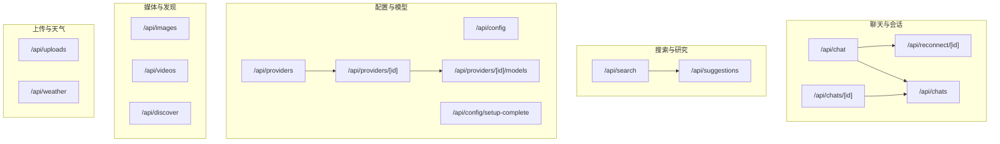
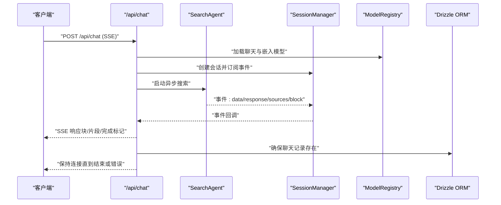
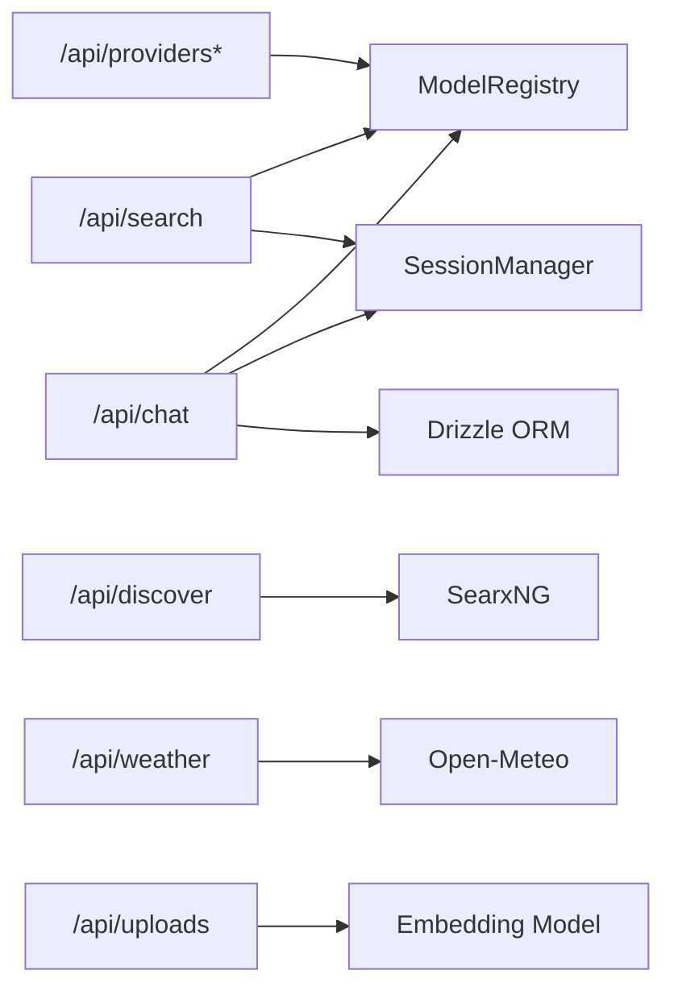
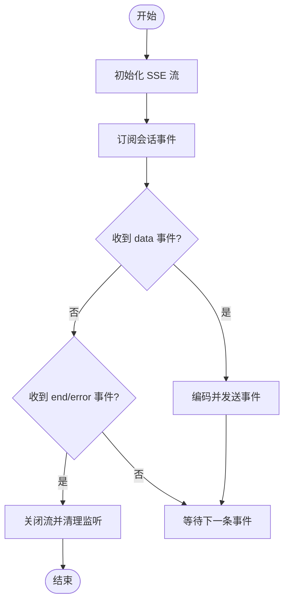

# API 接口文档

<cite>
**本文引用的文件**
- [src/app/api/chat/route.ts](file://src/app/api/chat/route.ts)
- [src/app/api/search/route.ts](file://src/app/api/search/route.ts)
- [src/app/api/chats/route.ts](file://src/app/api/chats/route.ts)
- [src/app/api/chats/[id]/route.ts](file://src/app/api/chats/[id]/route.ts)
- [src/app/api/config/route.ts](file://src/app/api/config/route.ts)
- [src/app/api/config/setup-complete/route.ts](file://src/app/api/config/setup-complete/route.ts)
- [src/app/api/providers/route.ts](file://src/app/api/providers/route.ts)
- [src/app/api/providers/[id]/route.ts](file://src/app/api/providers/[id]/route.ts)
- [src/app/api/providers/[id]/models/route.ts](file://src/app/api/providers/[id]/models/route.ts)
- [src/app/api/uploads/route.ts](file://src/app/api/uploads/route.ts)
- [src/app/api/images/route.ts](file://src/app/api/images/route.ts)
- [src/app/api/videos/route.ts](file://src/app/api/videos/route.ts)
- [src/app/api/suggestions/route.ts](file://src/app/api/suggestions/route.ts)
- [src/app/api/discover/route.ts](file://src/app/api/discover/route.ts)
- [src/app/api/weather/route.ts](file://src/app/api/weather/route.ts)
- [src/app/api/reconnect/[id]/route.ts](file://src/app/api/reconnect/[id]/route.ts)
</cite>

## 目录
1. [简介](#简介)
2. [项目结构](#项目结构)
3. [核心组件](#核心组件)
4. [架构总览](#架构总览)
5. [详细组件分析](#详细组件分析)
6. [依赖关系分析](#依赖关系分析)
7. [性能与流式传输](#性能与流式传输)
8. [故障排查指南](#故障排查指南)
9. [结论](#结论)
10. [附录：端点清单与规范](#附录端点清单与规范)

## 简介
本文件为 Perplexica 的完整 API 接口文档，覆盖聊天、搜索、配置、模型提供方、上传、媒体检索、发现与天气等主要 API 组。文档详细说明各端点的 HTTP 方法、URL 模式、请求/响应结构、认证要求、错误码，并解释实时流式响应（SSE）机制与客户端集成建议。同时提供版本管理、速率限制与安全注意事项。

## 项目结构
API 路由集中于 Next.js App Router 的约定式路由目录中，按功能分组组织：
- 聊天与会话：/api/chat、/api/reconnect/[id]、/api/chats、/api/chats/[id]
- 搜索与研究：/api/search、/api/suggestions
- 配置与管理：/api/config、/api/config/setup-complete、/api/providers、/api/providers/[id]、/api/providers/[id]/models
- 媒体与发现：/api/images、/api/videos、/api/discover
- 上传与嵌入：/api/uploads
- 天气：/api/weather

图表来源
- [src/app/api/chat/route.ts](file://src/app/api/chat/route.ts#L103-L254)
- [src/app/api/reconnect/[id]/route.ts](file://src/app/api/reconnect/[id]/route.ts#L3-L93)
- [src/app/api/chats/route.ts](file://src/app/api/chats/route.ts#L3-L15)
- [src/app/api/chats/[id]/route.ts](file://src/app/api/chats/[id]/route.ts#L5-L69)
- [src/app/api/search/route.ts](file://src/app/api/search/route.ts#L19-L208)
- [src/app/api/suggestions/route.ts](file://src/app/api/suggestions/route.ts#L10-L39)
- [src/app/api/config/route.ts](file://src/app/api/config/route.ts#L12-L110)
- [src/app/api/config/setup-complete/route.ts](file://src/app/api/config/setup-complete/route.ts#L4-L23)
- [src/app/api/providers/route.ts](file://src/app/api/providers/route.ts#L5-L77)
- [src/app/api/providers/[id]/route.ts](file://src/app/api/providers/[id]/route.ts#L5-L94)
- [src/app/api/providers/[id]/models/route.ts](file://src/app/api/providers/[id]/models/route.ts#L5-L94)
- [src/app/api/images/route.ts](file://src/app/api/images/route.ts#L11-L41)
- [src/app/api/videos/route.ts](file://src/app/api/videos/route.ts#L11-L41)
- [src/app/api/discover/route.ts](file://src/app/api/discover/route.ts#L28-L98)
- [src/app/api/uploads/route.ts](file://src/app/api/uploads/route.ts#L5-L40)
- [src/app/api/weather/route.ts](file://src/app/api/weather/route.ts#L1-L175)

章节来源
- [src/app/api/chat/route.ts](file://src/app/api/chat/route.ts#L103-L254)
- [src/app/api/search/route.ts](file://src/app/api/search/route.ts#L19-L208)

## 核心组件
- 模型注册中心：负责加载与管理聊天与嵌入模型，贯穿多个 API。
- 会话管理器：统一创建与订阅事件，支持 SSE 流式输出。
- 数据库：使用 Drizzle ORM 访问 chats 与 messages 表，维护聊天历史。
- 上传管理器：处理文件上传与嵌入向量化，支持多文件批量处理。
- 搜索代理：封装搜索流程，支持同步与流式两种模式。
- 媒体检索：图片与视频搜索，结合 LLM 对查询进行理解与筛选。
- 发现模块：基于 SearxNG 的主题化新闻聚合。
- 天气模块：调用 Open-Meteo 获取天气数据并映射为统一结构。

章节来源
- [src/app/api/chat/route.ts](file://src/app/api/chat/route.ts#L12-L14)
- [src/app/api/search/route.ts](file://src/app/api/search/route.ts#L34-L42)
- [src/app/api/chats/route.ts](file://src/app/api/chats/route.ts#L1-L15)
- [src/app/api/uploads/route.ts](file://src/app/api/uploads/route.ts#L24-L26)
- [src/app/api/discover/route.ts](file://src/app/api/discover/route.ts#L1-L24)
- [src/app/api/weather/route.ts](file://src/app/api/weather/route.ts#L18-L52)

## 架构总览
下图展示关键 API 的交互关系与数据流向：

图表来源
- [src/app/api/chat/route.ts](file://src/app/api/chat/route.ts#L103-L254)

## 详细组件分析

### 聊天 API（/api/chat）
- 方法与路径
  - POST /api/chat
- 功能
  - 接收用户消息，构建历史，加载模型，启动异步搜索，通过 SSE 实时推送块更新与最终完成信号。
- 请求体字段
  - message: { messageId, chatId, content }
  - optimizationMode: "speed" | "balanced" | "quality"
  - sources: 字符串数组（可选）
  - history: 二维字符串数组（可选）
  - files: 文件 ID 数组（可选）
  - chatModel: { providerId, key }
  - embeddingModel: { providerId, key }
  - systemInstructions: 字符串（可选）
- 响应
  - Content-Type: text/event-stream
  - 事件类型
    - "block": 新块开始，携带块内容
    - "updateBlock": 块增量更新，携带块 ID 与补丁
    - "researchComplete": 研究阶段完成
    - "messageEnd": 流结束
    - "error": 错误事件
- 认证与安全
  - 未在路由内显式校验；若需鉴权，请在上游网关或中间件层处理。
- 错误码
  - 400: 请求体无效、消息为空
  - 500: 内部错误
- 示例
  - 客户端以 SSE 方式接收事件，逐条解析 JSON 并渲染到界面。

章节来源
- [src/app/api/chat/route.ts](file://src/app/api/chat/route.ts#L16-L69)
- [src/app/api/chat/route.ts](file://src/app/api/chat/route.ts#L103-L254)

### 重连 API（/api/reconnect/[id]）
- 方法与路径
  - POST /api/reconnect/[id]
- 功能
  - 使用会话 ID 重新连接到已存在的搜索会话，继续推送事件。
- 请求
  - 路径参数: id（会话 ID）
- 响应
  - SSE 流，事件同上。
- 错误码
  - 404: 会话不存在
  - 500: 内部错误

章节来源
- [src/app/api/reconnect/[id]/route.ts](file://src/app/api/reconnect/[id]/route.ts#L3-L93)

### 搜索 API（/api/search）
- 方法与路径
  - POST /api/search
- 功能
  - 支持同步与流式两种模式。流式模式返回 SSE，非流式等待完整结果后一次性返回。
- 请求体字段
  - optimizationMode: "speed" | "balanced" | "quality"
  - sources: 搜索源数组
  - chatModel: { providerId, key }
  - embeddingModel: { providerId, key }
  - query: 查询字符串
  - history: 历史对话
  - stream: 是否启用流式
  - systemInstructions: 系统指令（可选）
- 响应
  - 非流式: JSON { message, sources }
  - 流式: SSE，事件
    - "init": 连接建立
    - "response": 增量回答片段
    - "sources": 检索到的来源列表
    - "done": 流结束
    - "error": 错误
- 错误码
  - 400: 缺少 sources 或 query
  - 500: 搜索错误

章节来源
- [src/app/api/search/route.ts](file://src/app/api/search/route.ts#L8-L17)
- [src/app/api/search/route.ts](file://src/app/api/search/route.ts#L19-L208)

### 建议生成 API（/api/suggestions）
- 方法与路径
  - POST /api/suggestions
- 功能
  - 基于聊天历史生成后续问题建议。
- 请求体字段
  - chatHistory: 历史对话
  - chatModel: { providerId, key }
- 响应
  - JSON { suggestions: 字符串数组 }
- 错误码
  - 500: 内部错误

章节来源
- [src/app/api/suggestions/route.ts](file://src/app/api/suggestions/route.ts#L5-L8)
- [src/app/api/suggestions/route.ts](file://src/app/api/suggestions/route.ts#L10-L39)

### 图片搜索 API（/api/images）
- 方法与路径
  - POST /api/images
- 功能
  - 将查询与聊天历史交由 LLM 理解后，执行图片检索。
- 请求体字段
  - query: 查询字符串
  - chatHistory: 历史对话
  - chatModel: { providerId, key }
- 响应
  - JSON { images: 结果数组 }
- 错误码
  - 500: 内部错误

章节来源
- [src/app/api/images/route.ts](file://src/app/api/images/route.ts#L5-L9)
- [src/app/api/images/route.ts](file://src/app/api/images/route.ts#L11-L41)

### 视频搜索 API（/api/videos）
- 方法与路径
  - POST /api/videos
- 功能
  - 将查询与聊天历史交由 LLM 理解后，执行视频检索。
- 请求体字段
  - query: 查询字符串
  - chatHistory: 历史对话
  - chatModel: { providerId, key }
- 响应
  - JSON { videos: 结果数组 }
- 错误码
  - 500: 内部错误

章节来源
- [src/app/api/videos/route.ts](file://src/app/api/videos/route.ts#L5-L9)
- [src/app/api/videos/route.ts](file://src/app/api/videos/route.ts#L11-L41)

### 发现 API（/api/discover）
- 方法与路径
  - GET /api/discover
- 功能
  - 主题化新闻聚合，支持 normal 与 preview 两种模式。
- 查询参数
  - mode: "normal" | "preview"
  - topic: "tech" | "finance" | "art" | "sports" | "entertainment"
- 响应
  - JSON { blogs: 结果数组 }
- 错误码
  - 500: 内部错误

章节来源
- [src/app/api/discover/route.ts](file://src/app/api/discover/route.ts#L28-L98)

### 天气 API（/api/weather）
- 方法与路径
  - POST /api/weather
- 功能
  - 根据经纬度与单位制获取天气数据并映射为统一结构。
- 请求体字段
  - lat: 数字
  - lng: 数字
  - measureUnit: "Imperial" | "Metric"
- 响应
  - JSON { temperature, condition, humidity, windSpeed, icon, temperatureUnit, windSpeedUnit }
- 错误码
  - 400: 参数缺失
  - 500: 天气接口错误

章节来源
- [src/app/api/weather/route.ts](file://src/app/api/weather/route.ts#L3-L16)
- [src/app/api/weather/route.ts](file://src/app/api/weather/route.ts#L18-L174)

### 上传 API（/api/uploads）
- 方法与路径
  - POST /api/uploads
- 功能
  - 多文件上传，结合嵌入模型对文件进行处理与索引。
- 请求
  - multipart/form-data
    - files: File 列表
    - embedding_model_key: 嵌入模型键
    - embedding_model_provider_id: 提供方 ID
- 响应
  - JSON { files: 处理后的文件信息数组 }
- 错误码
  - 400: 缺少嵌入模型或提供方
  - 500: 内部错误

章节来源
- [src/app/api/uploads/route.ts](file://src/app/api/uploads/route.ts#L5-L40)

### 聊天列表与详情 API（/api/chats 与 /api/chats/[id]）
- 方法与路径
  - GET /api/chats
  - GET /api/chats/[id]
  - DELETE /api/chats/[id]
- 功能
  - 获取全部聊天列表；按 ID 获取聊天与消息；删除聊天及其消息。
- 响应
  - GET /api/chats: JSON { chats: 数组 }
  - GET /api/chats/[id]: JSON { chat, messages }
  - DELETE /api/chats/[id]: JSON { message }
- 错误码
  - 404: 聊天不存在
  - 500: 内部错误

章节来源
- [src/app/api/chats/route.ts](file://src/app/api/chats/route.ts#L3-L15)
- [src/app/api/chats/[id]/route.ts](file://src/app/api/chats/[id]/route.ts#L5-L69)

### 配置 API（/api/config 与 /api/config/setup-complete）
- 方法与路径
  - GET /api/config
  - POST /api/config
  - POST /api/config/setup-complete
- 功能
  - 获取当前配置与 UI 字段；管理员更新配置；标记安装完成。
- 认证
  - 更新配置需要管理员权限（中间件校验）。
- 响应
  - GET /api/config: JSON { values, fields, isAdmin }
  - POST /api/config: JSON { message }
  - POST /api/config/setup-complete: JSON { message }
- 错误码
  - 400: 缺少 key/value
  - 403: 需要管理员身份
  - 500: 内部错误

章节来源
- [src/app/api/config/route.ts](file://src/app/api/config/route.ts#L12-L110)
- [src/app/api/config/setup-complete/route.ts](file://src/app/api/config/setup-complete/route.ts#L4-L23)

### 模型提供方 API（/api/providers 与 /api/providers/[id] 及子路由）
- 方法与路径
  - GET /api/providers
  - POST /api/providers
  - DELETE /api/providers/[id]
  - PATCH /api/providers/[id]
  - POST /api/providers/[id]/models
  - DELETE /api/providers/[id]/models
- 功能
  - 获取可用提供方；新增/更新/删除提供方；为提供方新增/删除模型。
- 认证
  - 新增、更新、删除提供方及模型变更均需管理员权限。
- 响应
  - JSON { providers | provider | message }
- 错误码
  - 400: 缺少必要字段
  - 500: 内部错误

章节来源
- [src/app/api/providers/route.ts](file://src/app/api/providers/route.ts#L5-L77)
- [src/app/api/providers/[id]/route.ts](file://src/app/api/providers/[id]/route.ts#L5-L94)
- [src/app/api/providers/[id]/models/route.ts](file://src/app/api/providers/[id]/models/route.ts#L5-L94)

## 依赖关系分析
- 组件耦合
  - 路由层仅负责输入校验、会话创建与事件转发，业务逻辑集中在代理与注册中心，耦合度低。
  - 模型注册中心与数据库访问在多个路由中复用，形成高内聚低耦合。
- 外部依赖
  - 搜索与发现依赖 SearxNG；天气依赖 Open-Meteo；文件上传依赖嵌入模型。
- 中间件
  - 管理员权限通过 requireAdmin 中间件强制校验。

图表来源
- [src/app/api/chat/route.ts](file://src/app/api/chat/route.ts#L12-L14)
- [src/app/api/search/route.ts](file://src/app/api/search/route.ts#L34-L42)
- [src/app/api/providers/route.ts](file://src/app/api/providers/route.ts#L36-L54)
- [src/app/api/discover/route.ts](file://src/app/api/discover/route.ts#L1-L1)
- [src/app/api/weather/route.ts](file://src/app/api/weather/route.ts#L18-L22)
- [src/app/api/uploads/route.ts](file://src/app/api/uploads/route.ts#L20-L26)

## 性能与流式传输
- SSE 实现
  - 使用 TransformStream/ReadableStream 与 TextEncoder 输出 JSON 事件行，事件以换行分隔。
  - 客户端需以 EventSource 或 fetch + ReadableStream 解析事件。
- 事件类型与语义
  - "block"/"updateBlock": 流式块渲染
  - "researchComplete": 研究阶段完成
  - "messageEnd": 流结束
  - "error": 异常终止
- 优化建议
  - 合理设置 optimizationMode 以平衡延迟与质量
  - 在客户端实现断线重连（/api/reconnect/[id]）
  - 控制并发请求数，避免阻塞

图表来源
- [src/app/api/chat/route.ts](file://src/app/api/chat/route.ts#L155-L211)
- [src/app/api/reconnect/[id]/route.ts](file://src/app/api/reconnect/[id]/route.ts#L16-L72)

## 故障排查指南
- 常见错误与定位
  - 400: 请求体校验失败（字段缺失或类型不符），检查 bodySchema 与必填项。
  - 404: 聊天或会话不存在，确认 ID 正确性。
  - 403: 配置或提供方操作需要管理员权限。
  - 500: 服务器内部错误，查看后端日志与外部服务状态。
- 建议排查步骤
  - 确认模型提供方与模型键有效
  - 检查 SSE 客户端是否正确处理换行分隔的事件
  - 使用 /api/reconnect/[id] 进行断线恢复
  - 对外服务（SearxNG、Open-Meteo）连通性与配额

章节来源
- [src/app/api/chat/route.ts](file://src/app/api/chat/route.ts#L109-L126)
- [src/app/api/chats/[id]/route.ts](file://src/app/api/chats/[id]/route.ts#L16-L18)
- [src/app/api/config/route.ts](file://src/app/api/config/route.ts#L68-L76)
- [src/app/api/weather/route.ts](file://src/app/api/weather/route.ts#L26-L34)

## 结论
Perplexica 的 API 采用清晰的功能分组与 SSE 流式传输，兼顾易用性与扩展性。通过模型注册中心与会话管理器实现松耦合设计，配合管理员权限中间件保障配置安全。建议在生产环境引入速率限制、超时控制与监控告警，并完善客户端断线重试与事件去重策略。

## 附录：端点清单与规范

- 聊天
  - POST /api/chat
    - 请求体字段：message, optimizationMode, sources, history, files, chatModel, embeddingModel, systemInstructions
    - 响应：text/event-stream
    - 错误：400, 500
- 重连
  - POST /api/reconnect/[id]
    - 响应：text/event-stream
    - 错误：404, 500
- 搜索
  - POST /api/search
    - 请求体字段：optimizationMode, sources, chatModel, embeddingModel, query, history, stream, systemInstructions
    - 响应：JSON 或 text/event-stream
    - 错误：400, 500
- 建议
  - POST /api/suggestions
    - 请求体字段：chatHistory, chatModel
    - 响应：JSON
    - 错误：500
- 图片
  - POST /api/images
    - 请求体字段：query, chatHistory, chatModel
    - 响应：JSON
    - 错误：500
- 视频
  - POST /api/videos
    - 请求体字段：query, chatHistory, chatModel
    - 响应：JSON
    - 错误：500
- 发现
  - GET /api/discover?mode=normal|preview&topic=tech|finance|art|sports|entertainment
    - 响应：JSON
    - 错误：500
- 天气
  - POST /api/weather
    - 请求体字段：lat, lng, measureUnit
    - 响应：JSON
    - 错误：400, 500
- 上传
  - POST /api/uploads
    - 请求：multipart/form-data(files, embedding_model_key, embedding_model_provider_id)
    - 响应：JSON
    - 错误：400, 500
- 聊天列表与详情
  - GET /api/chats
  - GET /api/chats/[id]
  - DELETE /api/chats/[id]
    - 响应：JSON
    - 错误：404, 500
- 配置
  - GET /api/config
  - POST /api/config
  - POST /api/config/setup-complete
    - 响应：JSON
    - 错误：400, 403, 500
- 提供方
  - GET /api/providers
  - POST /api/providers
  - DELETE /api/providers/[id]
  - PATCH /api/providers/[id]
  - POST /api/providers/[id]/models
  - DELETE /api/providers/[id]/models
    - 响应：JSON
    - 错误：400, 500

章节来源
- [src/app/api/chat/route.ts](file://src/app/api/chat/route.ts#L103-L254)
- [src/app/api/reconnect/[id]/route.ts](file://src/app/api/reconnect/[id]/route.ts#L3-L93)
- [src/app/api/search/route.ts](file://src/app/api/search/route.ts#L19-L208)
- [src/app/api/suggestions/route.ts](file://src/app/api/suggestions/route.ts#L10-L39)
- [src/app/api/images/route.ts](file://src/app/api/images/route.ts#L11-L41)
- [src/app/api/videos/route.ts](file://src/app/api/videos/route.ts#L11-L41)
- [src/app/api/discover/route.ts](file://src/app/api/discover/route.ts#L28-L98)
- [src/app/api/weather/route.ts](file://src/app/api/weather/route.ts#L1-L175)
- [src/app/api/uploads/route.ts](file://src/app/api/uploads/route.ts#L5-L40)
- [src/app/api/chats/route.ts](file://src/app/api/chats/route.ts#L3-L15)
- [src/app/api/chats/[id]/route.ts](file://src/app/api/chats/[id]/route.ts#L5-L69)
- [src/app/api/config/route.ts](file://src/app/api/config/route.ts#L12-L110)
- [src/app/api/config/setup-complete/route.ts](file://src/app/api/config/setup-complete/route.ts#L4-L23)
- [src/app/api/providers/route.ts](file://src/app/api/providers/route.ts#L5-L77)
- [src/app/api/providers/[id]/route.ts](file://src/app/api/providers/[id]/route.ts#L5-L94)
- [src/app/api/providers/[id]/models/route.ts](file://src/app/api/providers/[id]/models/route.ts#L5-L94)