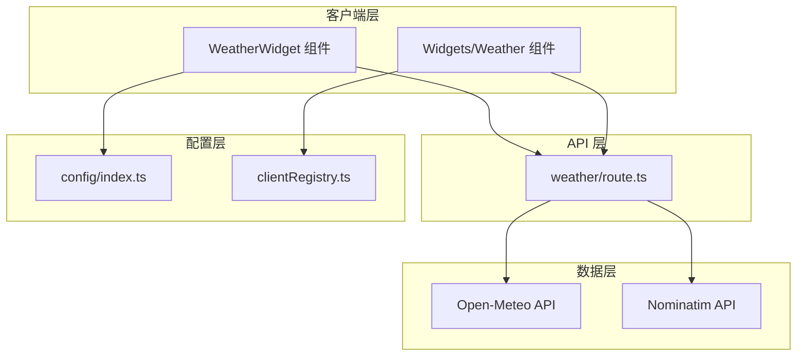
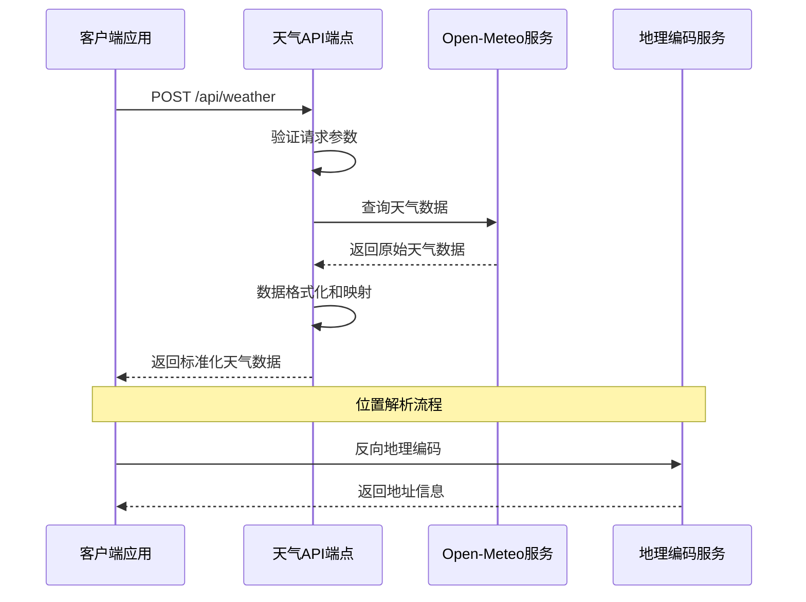
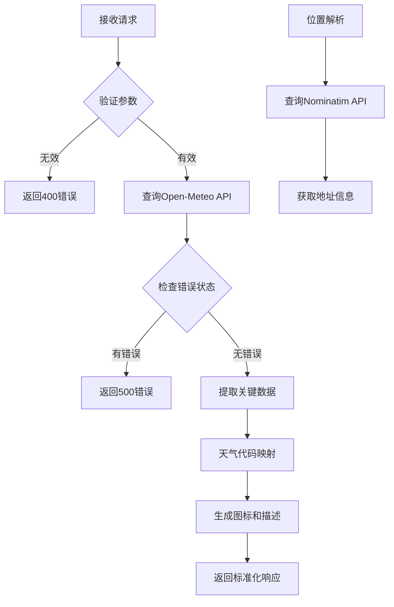
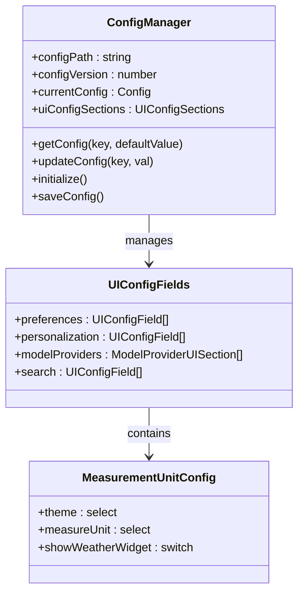
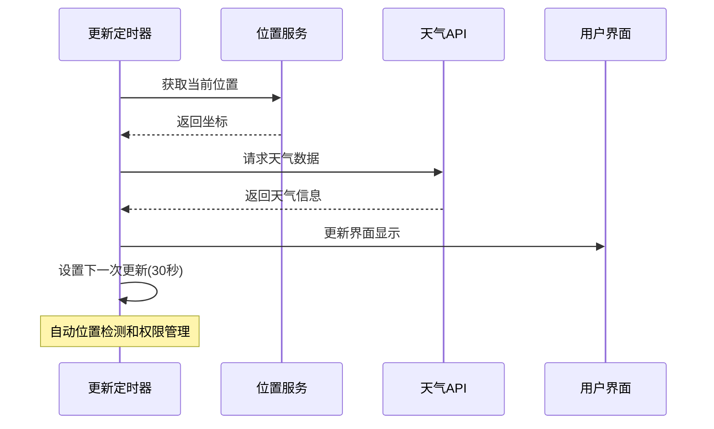
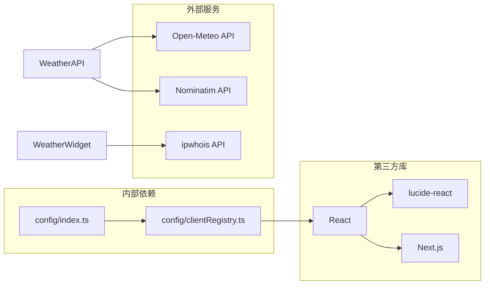

# 天气 API

<cite>
**本文档引用的文件**
- [src/app/api/weather/route.ts](file://src/app/api/weather/route.ts)
- [src/components/WeatherWidget.tsx](file://src/components/WeatherWidget.tsx)
- [src/components/Widgets/Weather.tsx](file://src/components/Widgets/Weather.tsx)
- [src/lib/agents/search/widgets/weatherWidget.ts](file://src/lib/agents/search/widgets/weatherWidget.ts)
- [src/lib/config/index.ts](file://src/lib/config/index.ts)
- [src/lib/config/clientRegistry.ts](file://src/lib/config/clientRegistry.ts)
</cite>

## 目录
1. [简介](#简介)
2. [项目结构](#项目结构)
3. [核心组件](#核心组件)
4. [架构概览](#架构概览)
5. [详细组件分析](#详细组件分析)
6. [依赖关系分析](#依赖关系分析)
7. [性能考虑](#性能考虑)
8. [故障排除指南](#故障排除指南)
9. [结论](#结论)
10. [附录](#附录)

## 简介

天气 API 是 Perplexica 应用程序中的一个关键功能模块，负责为用户提供实时天气信息。该系统通过统一的 /api/weather 端点提供天气数据获取和处理功能，支持地理位置解析、天气数据查询和结果格式化。

本 API 主要服务于两个核心场景：
- **用户界面天气组件**：提供个人化的天气卡片显示
- **AI 助手天气集成**：为聊天机器人提供上下文相关的天气信息

## 项目结构

天气 API 的实现分布在多个层次中，形成了清晰的分层架构：



**图表来源**
- [src/app/api/weather/route.ts](file://src/app/api/weather/route.ts#L1-L175)
- [src/components/WeatherWidget.tsx](file://src/components/WeatherWidget.tsx#L1-L170)
- [src/lib/config/index.ts](file://src/lib/config/index.ts#L1-L391)

**章节来源**
- [src/app/api/weather/route.ts](file://src/app/api/weather/route.ts#L1-L175)
- [src/components/WeatherWidget.tsx](file://src/components/WeatherWidget.tsx#L1-L170)

## 核心组件

### 天气 API 端点

/weather 端点是整个天气系统的核心，负责处理来自客户端的请求并返回标准化的天气数据。

**主要功能特性：**
- 支持经纬度坐标查询
- 自动单位转换（摄氏度/华氏度）
- 天气条件映射和图标生成
- 错误处理和降级机制

**请求参数规范：**
- `lat` (number): 纬度坐标
- `lng` (number): 经度坐标  
- `measureUnit` ('Imperial' | 'Metric'): 测量单位

**响应数据结构：**
- `temperature` (number): 当前温度
- `condition` (string): 天气状况描述
- `humidity` (number): 湿度百分比
- `windSpeed` (number): 风速
- `icon` (string): 图标名称
- `temperatureUnit` ('C' | 'F'): 温度单位
- `windSpeedUnit` ('m/s' | 'mph'): 风速单位

**章节来源**
- [src/app/api/weather/route.ts](file://src/app/api/weather/route.ts#L1-L175)

### 天气组件系统

系统提供了两种不同粒度的天气组件：

#### 1. 简化版天气组件 (WeatherWidget)
- 提供基础的当前天气信息
- 自动位置获取和更新
- 30秒自动刷新机制

#### 2. 增强版天气组件 (Widgets/Weather)
- 提供完整的天气卡片，包含温度、湿度、风速等详细信息
- 支持未来几天的天气预报
- 响应式设计和主题适配

**章节来源**
- [src/components/WeatherWidget.tsx](file://src/components/WeatherWidget.tsx#L1-L170)
- [src/components/Widgets/Weather.tsx](file://src/components/Widgets/Weather.tsx#L1-L423)

## 架构概览

天气系统的整体架构采用分层设计，确保了良好的可维护性和扩展性：



**图表来源**
- [src/app/api/weather/route.ts](file://src/app/api/weather/route.ts#L18-L22)
- [src/lib/agents/search/widgets/weatherWidget.ts](file://src/lib/agents/search/widgets/weatherWidget.ts#L141-L160)

**章节来源**
- [src/lib/agents/search/widgets/weatherWidget.ts](file://src/lib/agents/search/widgets/weatherWidget.ts#L1-L204)

## 详细组件分析

### 天气数据源和处理流程

天气数据的获取和处理遵循严格的流程：



**图表来源**
- [src/app/api/weather/route.ts](file://src/app/api/weather/route.ts#L9-L34)
- [src/app/api/weather/route.ts](file://src/app/api/weather/route.ts#L58-L160)

#### 天气条件映射表

系统支持多种天气状况的精确映射：

| 天气代码 | 条件类型 | 映射数量 |
|---------|---------|---------|
| 0, 1, 2, 3 | 清晰/多云 | 4种 |
| 45, 48 | 雾 | 2种 |
| 51, 53, 55 | 露水/雨 | 3种 |
| 61, 63, 65 | 雨 | 3种 |
| 71, 73, 75, 77 | 雪 | 4种 |
| 80, 81, 82, 85, 86, 87 | 雨雪 | 6种 |
| 95, 96, 99 | 雷暴 | 3种 |

**章节来源**
- [src/app/api/weather/route.ts](file://src/app/api/weather/route.ts#L58-L160)

### 配置管理系统

天气功能的配置管理采用集中式设计：



**图表来源**
- [src/lib/config/index.ts](file://src/lib/config/index.ts#L7-L117)
- [src/lib/config/clientRegistry.ts](file://src/lib/config/clientRegistry.ts#L21-L29)

**章节来源**
- [src/lib/config/index.ts](file://src/lib/config/index.ts#L1-L391)
- [src/lib/config/clientRegistry.ts](file://src/lib/config/clientRegistry.ts#L1-L30)

### 实时数据更新机制

天气组件实现了智能的实时更新策略：



**图表来源**
- [src/components/WeatherWidget.tsx](file://src/components/WeatherWidget.tsx#L72-L109)

**章节来源**
- [src/components/WeatherWidget.tsx](file://src/components/WeatherWidget.tsx#L1-L170)

## 依赖关系分析

天气 API 的依赖关系相对简洁，主要依赖于外部服务：



**图表来源**
- [src/app/api/weather/route.ts](file://src/app/api/weather/route.ts#L18-L22)
- [src/components/WeatherWidget.tsx](file://src/components/WeatherWidget.tsx#L19-L26)

**章节来源**
- [src/app/api/weather/route.ts](file://src/app/api/weather/route.ts#L1-L175)
- [src/components/WeatherWidget.tsx](file://src/components/WeatherWidget.tsx#L1-L170)

## 性能考虑

### 缓存策略

当前实现采用以下缓存策略：
- **短期缓存**：30秒自动刷新机制
- **本地存储**：浏览器本地存储测量单位偏好
- **智能重试**：网络错误时的自动重试机制

### 性能优化建议

1. **并发请求优化**：在需要时使用 Promise.all 并发处理
2. **数据压缩**：对传输的数据进行必要的压缩
3. **懒加载**：按需加载天气图标资源
4. **连接复用**：利用 HTTP/2 连接复用特性

## 故障排除指南

### 常见错误类型

| 错误类型 | 状态码 | 触发原因 | 解决方案 |
|---------|--------|---------|---------|
| 参数错误 | 400 | 缺少纬度或经度 | 验证请求参数完整性 |
| 服务错误 | 500 | Open-Meteo API 失败 | 检查外部服务可用性 |
| 网络超时 | 504 | 网络连接问题 | 实现重试机制和超时处理 |
| 权限拒绝 | 403 | 地理位置权限被拒绝 | 引导用户手动输入位置 |

### 调试工具和方法

1. **网络监控**：使用浏览器开发者工具监控 API 请求
2. **日志记录**：在生产环境中添加结构化日志
3. **错误边界**：实现 React 错误边界捕获组件错误
4. **健康检查**：定期检查外部服务的可用性

**章节来源**
- [src/app/api/weather/route.ts](file://src/app/api/weather/route.ts#L9-L16)
- [src/app/api/weather/route.ts](file://src/app/api/weather/route.ts#L26-L34)

## 结论

天气 API 系统展现了良好的架构设计和实现质量。其特点包括：

**优势：**
- 清晰的分层架构设计
- 完善的错误处理机制
- 灵活的配置管理系统
- 用户友好的实时更新机制

**改进方向：**
- 实现更完善的缓存策略
- 增加更多的错误恢复机制
- 优化网络请求的性能
- 扩展支持更多的天气数据源

该系统为 Perplexica 应用提供了可靠的天气信息服务，为用户提供了准确、及时的天气信息。

## 附录

### API 使用示例

**基本请求格式：**
```json
{
  "lat": 40.7128,
  "lng": -74.0060,
  "measureUnit": "Metric"
}
```

**预期响应格式：**
```json
{
  "temperature": 22,
  "condition": "Partly Cloudy",
  "humidity": 65,
  "windSpeed": 12,
  "icon": "cloudy-1-day",
  "temperatureUnit": "C",
  "windSpeedUnit": "m/s"
}
```

### 集成最佳实践

1. **错误处理**：始终检查响应状态码
2. **缓存策略**：合理设置缓存时间
3. **用户体验**：提供加载状态和错误提示
4. **性能优化**：避免频繁的 API 调用

### 配置选项参考

| 配置项 | 类型 | 默认值 | 描述 |
|-------|------|--------|------|
| measureUnit | select | Metric | 测量单位选择 |
| showWeatherWidget | switch | true | 是否显示天气组件 |
| theme | select | dark | 应用主题设置 |