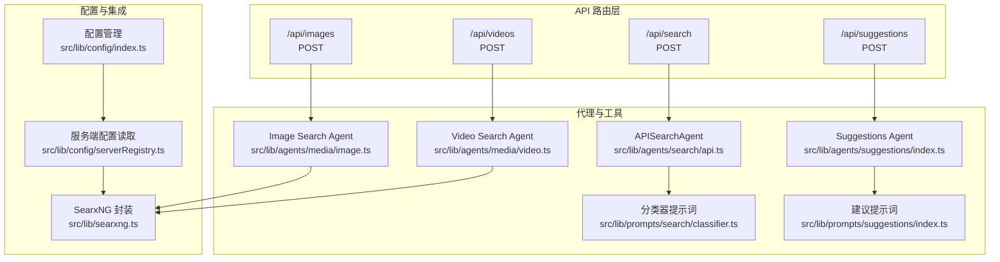
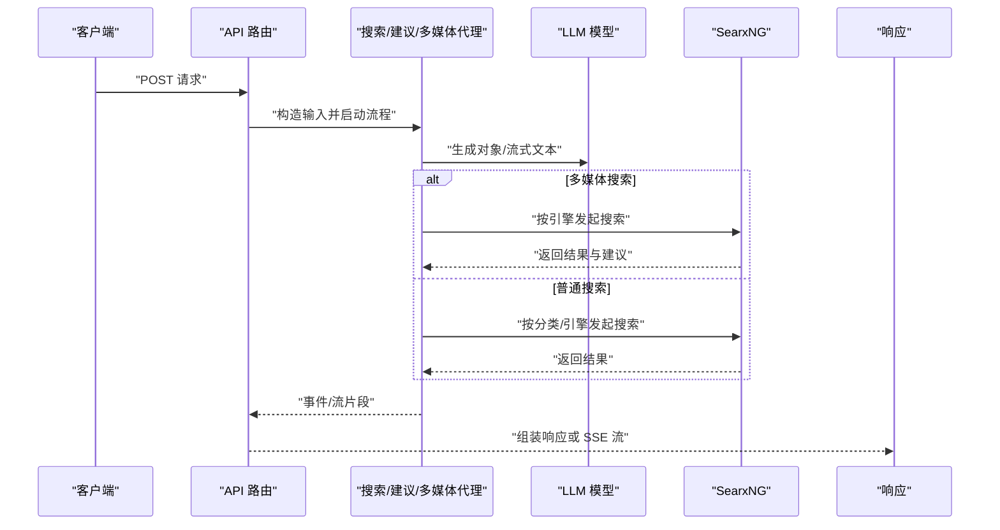
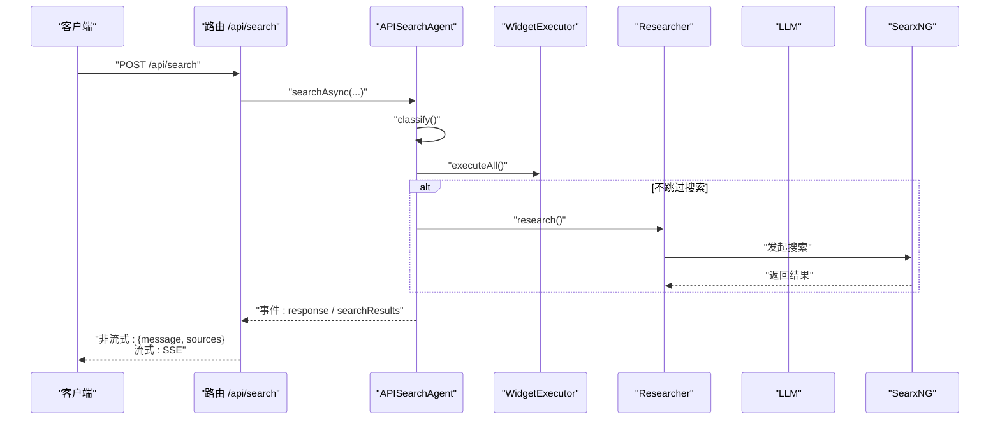
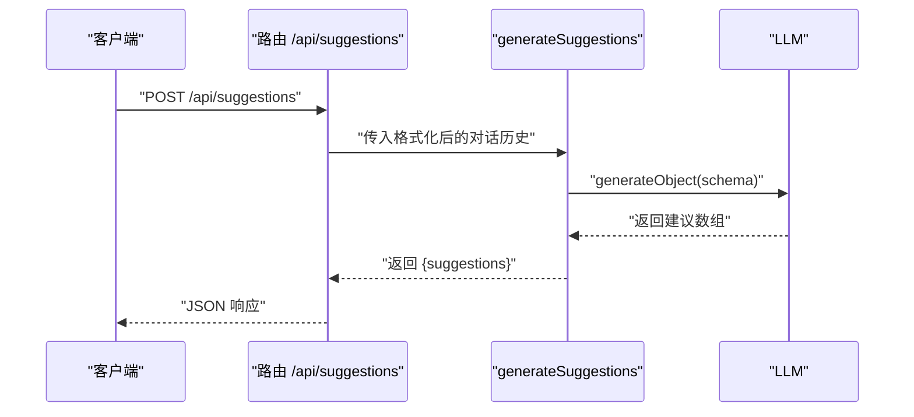
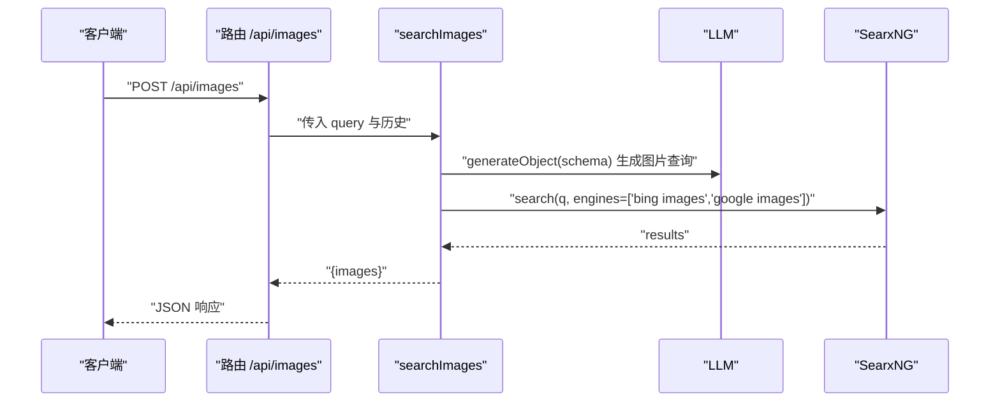
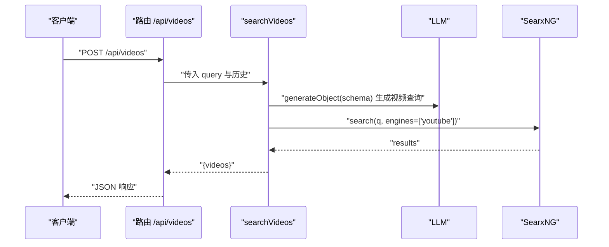
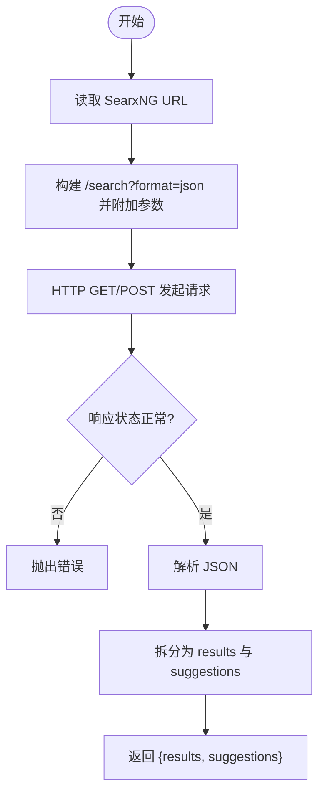
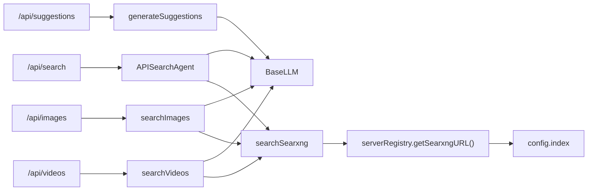

# 搜索 API

<cite>
**本文引用的文件**
- [src/app/api/search/route.ts](file://src/app/api/search/route.ts)
- [src/app/api/suggestions/route.ts](file://src/app/api/suggestions/route.ts)
- [src/app/api/images/route.ts](file://src/app/api/images/route.ts)
- [src/app/api/videos/route.ts](file://src/app/api/videos/route.ts)
- [src/lib/agents/search/api.ts](file://src/lib/agents/search/api.ts)
- [src/lib/agents/suggestions/index.ts](file://src/lib/agents/suggestions/index.ts)
- [src/lib/agents/media/image.ts](file://src/lib/agents/media/image.ts)
- [src/lib/agents/media/video.ts](file://src/lib/agents/media/video.ts)
- [src/lib/searxng.ts](file://src/lib/searxng.ts)
- [src/lib/config/serverRegistry.ts](file://src/lib/config/serverRegistry.ts)
- [src/lib/config/index.ts](file://src/lib/config/index.ts)
- [src/lib/agents/search/types.ts](file://src/lib/agents/search/types.ts)
- [src/lib/types.ts](file://src/lib/types.ts)
- [src/lib/prompts/search/classifier.ts](file://src/lib/prompts/search/classifier.ts)
- [src/lib/prompts/suggestions/index.ts](file://src/lib/prompts/suggestions/index.ts)
</cite>

## 目录
1. [简介](#简介)
2. [项目结构](#项目结构)
3. [核心组件](#核心组件)
4. [架构总览](#架构总览)
5. [详细组件分析](#详细组件分析)
6. [依赖关系分析](#依赖关系分析)
7. [性能考虑](#性能考虑)
8. [故障排查指南](#故障排查指南)
9. [结论](#结论)
10. [附录](#附录)

## 简介
本文件系统性梳理 Perplexica 的搜索 API，覆盖以下端点与能力：
- /api/search：全文检索与回答生成，支持流式与非流式响应；可配置搜索源（网络、讨论、学术）与优化模式（速度/平衡/质量）。
- /api/suggestions：基于对话历史生成智能建议，帮助用户继续提问。
- /api/images 与 /api/videos：多媒体搜索，通过 LLM 生成精确查询并对接 SearxNG 引擎（如 Bing 图片、Google 图片、YouTube）。
- SearxNG 集成：统一的搜索入口，支持分类、引擎、语言、分页等参数。
- 最佳实践、性能优化与错误处理策略。

## 项目结构
后端采用 Next.js App Router，搜索相关路由位于 src/app/api 下，核心逻辑在 src/lib/agents 中，配置与 SearxNG 集成在 src/lib 下。

图表来源
- [src/app/api/search/route.ts](file://src/app/api/search/route.ts#L1-L209)
- [src/app/api/suggestions/route.ts](file://src/app/api/suggestions/route.ts#L1-L40)
- [src/app/api/images/route.ts](file://src/app/api/images/route.ts#L1-L42)
- [src/app/api/videos/route.ts](file://src/app/api/videos/route.ts#L1-L42)
- [src/lib/agents/search/api.ts](file://src/lib/agents/search/api.ts#L1-L100)
- [src/lib/agents/suggestions/index.ts](file://src/lib/agents/suggestions/index.ts#L1-L39)
- [src/lib/agents/media/image.ts](file://src/lib/agents/media/image.ts#L1-L67)
- [src/lib/agents/media/video.ts](file://src/lib/agents/media/video.ts#L1-L67)
- [src/lib/searxng.ts](file://src/lib/searxng.ts#L1-L54)
- [src/lib/config/serverRegistry.ts](file://src/lib/config/serverRegistry.ts#L1-L16)
- [src/lib/config/index.ts](file://src/lib/config/index.ts#L1-L391)
- [src/lib/prompts/search/classifier.ts](file://src/lib/prompts/search/classifier.ts#L1-L65)
- [src/lib/prompts/suggestions/index.ts](file://src/lib/prompts/suggestions/index.ts#L1-L18)

章节来源
- [src/app/api/search/route.ts](file://src/app/api/search/route.ts#L1-L209)
- [src/app/api/suggestions/route.ts](file://src/app/api/suggestions/route.ts#L1-L40)
- [src/app/api/images/route.ts](file://src/app/api/images/route.ts#L1-L42)
- [src/app/api/videos/route.ts](file://src/app/api/videos/route.ts#L1-L42)
- [src/lib/agents/search/api.ts](file://src/lib/agents/search/api.ts#L1-L100)
- [src/lib/agents/suggestions/index.ts](file://src/lib/agents/suggestions/index.ts#L1-L39)
- [src/lib/agents/media/image.ts](file://src/lib/agents/media/image.ts#L1-L67)
- [src/lib/agents/media/video.ts](file://src/lib/agents/media/video.ts#L1-L67)
- [src/lib/searxng.ts](file://src/lib/searxng.ts#L1-L54)
- [src/lib/config/serverRegistry.ts](file://src/lib/config/serverRegistry.ts#L1-L16)
- [src/lib/config/index.ts](file://src/lib/config/index.ts#L1-L391)
- [src/lib/prompts/search/classifier.ts](file://src/lib/prompts/search/classifier.ts#L1-L65)
- [src/lib/prompts/suggestions/index.ts](file://src/lib/prompts/suggestions/index.ts#L1-L18)

## 核心组件
- 搜索代理（APISearchAgent）：负责查询分类、小部件执行、研究链路与最终回答生成。
- 建议生成器：基于对话历史生成多条高质量建议。
- 多媒体搜索代理：通过 LLM 生成精确查询，再调用 SearxNG 获取图片/视频结果。
- SearxNG 集成：统一的搜索请求封装，支持分类、引擎、语言、分页等参数。
- 配置系统：集中管理模型提供商、SearxNG 地址等服务器配置。

章节来源
- [src/lib/agents/search/api.ts](file://src/lib/agents/search/api.ts#L1-L100)
- [src/lib/agents/suggestions/index.ts](file://src/lib/agents/suggestions/index.ts#L1-L39)
- [src/lib/agents/media/image.ts](file://src/lib/agents/media/image.ts#L1-L67)
- [src/lib/agents/media/video.ts](file://src/lib/agents/media/video.ts#L1-L67)
- [src/lib/searxng.ts](file://src/lib/searxng.ts#L1-L54)
- [src/lib/config/index.ts](file://src/lib/config/index.ts#L1-L391)

## 架构总览
下图展示从 API 路由到代理、再到 SearxNG 的整体调用链与数据流。

图表来源
- [src/app/api/search/route.ts](file://src/app/api/search/route.ts#L19-L208)
- [src/app/api/suggestions/route.ts](file://src/app/api/suggestions/route.ts#L10-L39)
- [src/app/api/images/route.ts](file://src/app/api/images/route.ts#L11-L41)
- [src/app/api/videos/route.ts](file://src/app/api/videos/route.ts#L11-L41)
- [src/lib/agents/search/api.ts](file://src/lib/agents/search/api.ts#L8-L96)
- [src/lib/agents/media/image.ts](file://src/lib/agents/media/image.ts#L24-L64)
- [src/lib/agents/media/video.ts](file://src/lib/agents/media/video.ts#L23-L64)
- [src/lib/searxng.ts](file://src/lib/searxng.ts#L21-L53)

## 详细组件分析

### /api/search 端点
- 功能概述
  - 接收查询、历史、模型配置与搜索源，进行分类、小部件执行与研究链路，最终以流式或非流式返回回答与搜索来源。
- 请求体字段
  - optimizationMode: 'speed' | 'balanced' | 'quality'
  - sources: 搜索源数组，支持 'web' | 'discussions' | 'academic'
  - chatModel / embeddingModel: 指定使用的模型提供者与模型键
  - query: 用户查询
  - history: 对话历史，格式为 [[角色, 内容], ...]，内部转换为标准消息结构
  - stream?: 是否启用流式输出，默认 false
  - systemInstructions?: 系统指令
- 响应格式
  - 非流式：返回 { message, sources }
  - 流式：SSE，事件类型包括 init、response、sources、done；sources 在首次出现时推送
- 查询处理机制
  - 分类：根据对话历史与查询进行分类，决定是否跳过搜索、是否显示天气/股票/计算小部件等
  - 小部件：并行执行可能的小部件（如天气、股票、计算）
  - 研究链路：若未跳过搜索，则执行研究链路，收集搜索发现并拼接上下文
  - 回答生成：使用写作者提示词与最终上下文生成回答，支持流式输出
- 错误处理
  - 缺少必要字段返回 400
  - 会话事件 error 时返回 500
  - 解析数据异常时返回 500
- 性能优化建议
  - 使用 balanced 或 quality 时适当减少 sources 数量
  - 合理设置 history 长度，避免上下文过长导致延迟
  - 流式输出可提升首包延迟体验

图表来源
- [src/app/api/search/route.ts](file://src/app/api/search/route.ts#L19-L208)
- [src/lib/agents/search/api.ts](file://src/lib/agents/search/api.ts#L8-L96)
- [src/lib/agents/search/types.ts](file://src/lib/agents/search/types.ts#L45-L63)
- [src/lib/prompts/search/classifier.ts](file://src/lib/prompts/search/classifier.ts#L1-L65)

章节来源
- [src/app/api/search/route.ts](file://src/app/api/search/route.ts#L8-L17)
- [src/app/api/search/route.ts](file://src/app/api/search/route.ts#L19-L208)
- [src/lib/agents/search/api.ts](file://src/lib/agents/search/api.ts#L8-L96)
- [src/lib/agents/search/types.ts](file://src/lib/agents/search/types.ts#L1-L123)
- [src/lib/prompts/search/classifier.ts](file://src/lib/prompts/search/classifier.ts#L1-L65)

### /api/suggestions 端点
- 功能概述
  - 基于对话历史生成 4–5 条相关建议，帮助用户继续提问
- 请求体字段
  - chatHistory: 对话历史，格式同上
  - chatModel: 指定聊天模型
- 建议类型与生成算法
  - 类型：字符串数组，每项为一条建议
  - 算法：使用结构化生成（JSON Schema），系统提示词引导生成与对话高度相关且中等长度的建议
- 响应格式
  - { suggestions: string[] }

图表来源
- [src/app/api/suggestions/route.ts](file://src/app/api/suggestions/route.ts#L10-L39)
- [src/lib/agents/suggestions/index.ts](file://src/lib/agents/suggestions/index.ts#L17-L36)
- [src/lib/prompts/suggestions/index.ts](file://src/lib/prompts/suggestions/index.ts#L1-L18)

章节来源
- [src/app/api/suggestions/route.ts](file://src/app/api/suggestions/route.ts#L5-L8)
- [src/app/api/suggestions/route.ts](file://src/app/api/suggestions/route.ts#L10-L39)
- [src/lib/agents/suggestions/index.ts](file://src/lib/agents/suggestions/index.ts#L7-L36)
- [src/lib/prompts/suggestions/index.ts](file://src/lib/prompts/suggestions/index.ts#L1-L18)

### /api/images 端点
- 功能概述
  - 通过 LLM 生成面向图片搜索的精确查询，再调用 SearxNG 的图片引擎（Bing 图片、Google 图片）获取结果
- 请求体字段
  - query: 初始查询
  - chatHistory: 对话历史
  - chatModel: 指定聊天模型
- 过滤与结果
  - 返回前 10 条包含 img_src、url、title 的结果
- 参数与引擎
  - 引擎列表：['bing images', 'google images']
- 响应格式
  - { images: { img_src, url, title }[] }

图表来源
- [src/app/api/images/route.ts](file://src/app/api/images/route.ts#L11-L41)
- [src/lib/agents/media/image.ts](file://src/lib/agents/media/image.ts#L24-L64)
- [src/lib/searxng.ts](file://src/lib/searxng.ts#L21-L53)

章节来源
- [src/app/api/images/route.ts](file://src/app/api/images/route.ts#L5-L9)
- [src/app/api/images/route.ts](file://src/app/api/images/route.ts#L11-L41)
- [src/lib/agents/media/image.ts](file://src/lib/agents/media/image.ts#L13-L22)
- [src/lib/agents/media/image.ts](file://src/lib/agents/media/image.ts#L24-L64)
- [src/lib/searxng.ts](file://src/lib/searxng.ts#L3-L8)

### /api/videos 端点
- 功能概述
  - 通过 LLM 生成面向视频搜索的精确查询，再调用 SearxNG 的 YouTube 引擎获取结果
- 请求体字段
  - query: 初始查询
  - chatHistory: 对话历史
  - chatModel: 指定聊天模型
- 过滤与结果
  - 返回前 10 条包含 thumbnail、url、title、iframe_src 的结果
- 参数与引擎
  - 引擎列表：['youtube']
- 响应格式
  - { videos: { img_src, url, title, iframe_src }[] }

图表来源
- [src/app/api/videos/route.ts](file://src/app/api/videos/route.ts#L11-L41)
- [src/lib/agents/media/video.ts](file://src/lib/agents/media/video.ts#L23-L64)
- [src/lib/searxng.ts](file://src/lib/searxng.ts#L21-L53)

章节来源
- [src/app/api/videos/route.ts](file://src/app/api/videos/route.ts#L5-L9)
- [src/app/api/videos/route.ts](file://src/app/api/videos/route.ts#L11-L41)
- [src/lib/agents/media/video.ts](file://src/lib/agents/media/video.ts#L11-L21)
- [src/lib/agents/media/video.ts](file://src/lib/agents/media/video.ts#L23-L64)
- [src/lib/searxng.ts](file://src/lib/searxng.ts#L3-L8)

### SearxNG 集成与配置
- 统一搜索接口
  - 支持参数：categories、engines（数组）、language、pageno
  - 返回：results（结果数组）、suggestions（建议数组）
- 配置项
  - 服务器配置键：search.searxngURL
  - 读取方式：getSearxngURL()
  - 默认值为空字符串，需在部署时正确设置
- 与各端点的结合
  - /api/images：固定使用图片引擎
  - /api/videos：固定使用 YouTube 引擎
  - /api/search：由分类器与配置控制

图表来源
- [src/lib/searxng.ts](file://src/lib/searxng.ts#L21-L53)
- [src/lib/config/serverRegistry.ts](file://src/lib/config/serverRegistry.ts#L14-L15)
- [src/lib/config/index.ts](file://src/lib/config/index.ts#L19-L22)

章节来源
- [src/lib/searxng.ts](file://src/lib/searxng.ts#L1-L54)
- [src/lib/config/serverRegistry.ts](file://src/lib/config/serverRegistry.ts#L1-L16)
- [src/lib/config/index.ts](file://src/lib/config/index.ts#L104-L116)

## 依赖关系分析
- 路由到代理
  - /api/search → APISearchAgent：负责完整搜索流程
  - /api/suggestions → generateSuggestions：结构化生成建议
  - /api/images → searchImages：图片查询与结果筛选
  - /api/videos → searchVideos：视频查询与结果筛选
- 代理到 LLM
  - 所有代理均通过模型注册表加载 chat/embedding 模型
- 代理到 SearxNG
  - 多媒体代理直接调用 searchSearxng
  - 搜索代理通过研究链路间接使用 SearxNG
- 配置耦合
  - SearxNG 地址通过 serverRegistry 与 config 管理
  - 优化模式与搜索源影响分类器与研究链路行为

图表来源
- [src/app/api/search/route.ts](file://src/app/api/search/route.ts#L34-L42)
- [src/app/api/suggestions/route.ts](file://src/app/api/suggestions/route.ts#L14-L19)
- [src/app/api/images/route.ts](file://src/app/api/images/route.ts#L15-L20)
- [src/app/api/videos/route.ts](file://src/app/api/videos/route.ts#L15-L20)
- [src/lib/agents/search/api.ts](file://src/lib/agents/search/api.ts#L1-L100)
- [src/lib/agents/suggestions/index.ts](file://src/lib/agents/suggestions/index.ts#L1-L39)
- [src/lib/agents/media/image.ts](file://src/lib/agents/media/image.ts#L1-L67)
- [src/lib/agents/media/video.ts](file://src/lib/agents/media/video.ts#L1-L67)
- [src/lib/searxng.ts](file://src/lib/searxng.ts#L1-L54)
- [src/lib/config/serverRegistry.ts](file://src/lib/config/serverRegistry.ts#L1-L16)
- [src/lib/config/index.ts](file://src/lib/config/index.ts#L1-L391)

章节来源
- [src/app/api/search/route.ts](file://src/app/api/search/route.ts#L34-L42)
- [src/app/api/suggestions/route.ts](file://src/app/api/suggestions/route.ts#L14-L19)
- [src/app/api/images/route.ts](file://src/app/api/images/route.ts#L15-L20)
- [src/app/api/videos/route.ts](file://src/app/api/videos/route.ts#L15-L20)
- [src/lib/agents/search/api.ts](file://src/lib/agents/search/api.ts#L1-L100)
- [src/lib/agents/suggestions/index.ts](file://src/lib/agents/suggestions/index.ts#L1-L39)
- [src/lib/agents/media/image.ts](file://src/lib/agents/media/image.ts#L1-L67)
- [src/lib/agents/media/video.ts](file://src/lib/agents/media/video.ts#L1-L67)
- [src/lib/searxng.ts](file://src/lib/searxng.ts#L1-L54)
- [src/lib/config/serverRegistry.ts](file://src/lib/config/serverRegistry.ts#L1-L16)
- [src/lib/config/index.ts](file://src/lib/config/index.ts#L1-L391)

## 性能考虑
- 优化模式
  - speed：优先快速响应，适合简单问题或不需要深度检索
  - balanced：默认模式，兼顾速度与质量
  - quality：更全面的检索与上下文拼接，适合复杂问题
- 搜索源选择
  - 减少 sources 可降低并发与延迟
  - 仅在需要时启用学术/讨论源
- 流式输出
  - 流式可显著改善首包延迟与用户体验
- LLM 与嵌入模型
  - 选择合适的模型与批大小，避免过载
- SearxNG
  - 控制分页与结果数量，避免超大响应
  - 合理设置语言与分类，提高命中率

## 故障排查指南
- 常见错误与处理
  - 缺少 sources 或 query：返回 400
  - 数据解析异常：返回 500
  - 会话错误事件：返回 500
  - SearxNG 请求失败：抛出错误并由上层捕获
- 建议检查清单
  - 确认 SearxNG URL 已在配置中设置
  - 检查模型提供者与模型键是否有效
  - 确保网络可达与超时设置合理
  - 对于流式场景，确认客户端正确处理 SSE

章节来源
- [src/app/api/search/route.ts](file://src/app/api/search/route.ts#L23-L28)
- [src/app/api/search/route.ts](file://src/app/api/search/route.ts#L86-L93)
- [src/app/api/search/route.ts](file://src/app/api/search/route.ts#L100-L107)
- [src/lib/searxng.ts](file://src/lib/searxng.ts#L43-L45)

## 结论
本搜索 API 体系以代理为核心，结合 LLM 与 SearxNG 实现了从智能建议、多媒体搜索到综合问答的完整能力。通过可配置的优化模式与搜索源，可在不同场景下取得最佳的性能与体验。建议在生产环境中严格管理 SearxNG 与模型配置，并针对不同端点制定相应的监控与告警策略。

## 附录

### API 定义与示例字段
- /api/search
  - 方法：POST
  - 请求体字段：optimizationMode、sources、chatModel、embeddingModel、query、history、stream、systemInstructions
  - 响应：非流式 { message, sources }；流式 SSE 事件：init、response、sources、done
- /api/suggestions
  - 方法：POST
  - 请求体字段：chatHistory、chatModel
  - 响应：{ suggestions: string[] }
- /api/images
  - 方法：POST
  - 请求体字段：query、chatHistory、chatModel
  - 响应：{ images: { img_src, url, title }[] }
- /api/videos
  - 方法：POST
  - 请求体字段：query、chatHistory、chatModel
  - 响应：{ videos: { img_src, url, title, iframe_src }[] }

章节来源
- [src/app/api/search/route.ts](file://src/app/api/search/route.ts#L8-L17)
- [src/app/api/search/route.ts](file://src/app/api/search/route.ts#L69-L111)
- [src/app/api/suggestions/route.ts](file://src/app/api/suggestions/route.ts#L5-L8)
- [src/app/api/images/route.ts](file://src/app/api/images/route.ts#L5-L9)
- [src/app/api/videos/route.ts](file://src/app/api/videos/route.ts#L5-L9)

### 搜索源与优化模式
- 搜索源（sources）
  - web：通用网页搜索
  - discussions：论坛/社区讨论
  - academic：学术数据库
- 优化模式（mode）
  - speed：快速
  - balanced：平衡
  - quality：高质量

章节来源
- [src/lib/agents/search/types.ts](file://src/lib/agents/search/types.ts#L7-L16)
- [src/app/api/search/route.ts](file://src/app/api/search/route.ts#L30-L32)

### 数据模型与类型
- ChatTurnMessage：用户/助手消息
- Chunk：内容块与元数据
- 建议与小部件块类型：SuggestionBlock、WidgetBlock 等

章节来源
- [src/lib/types.ts](file://src/lib/types.ts#L26-L124)