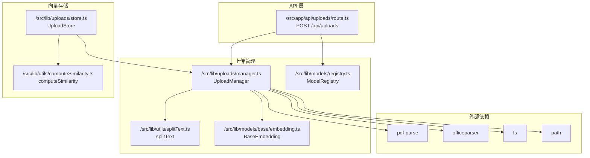
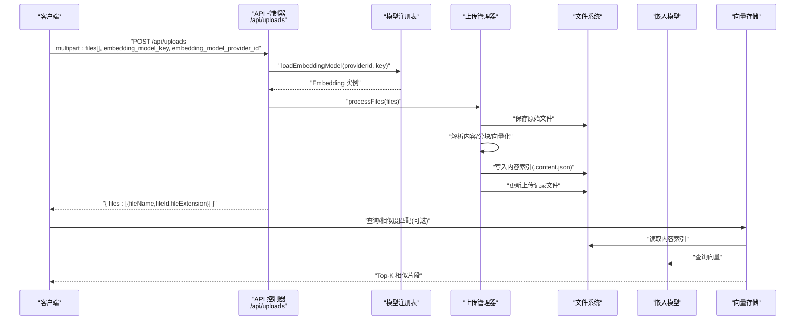
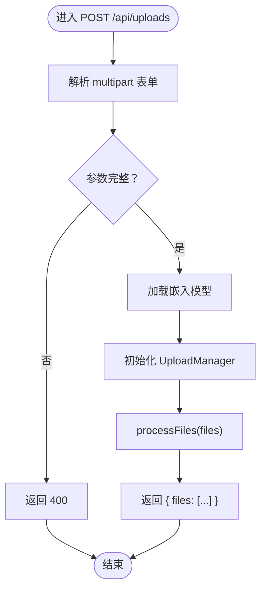
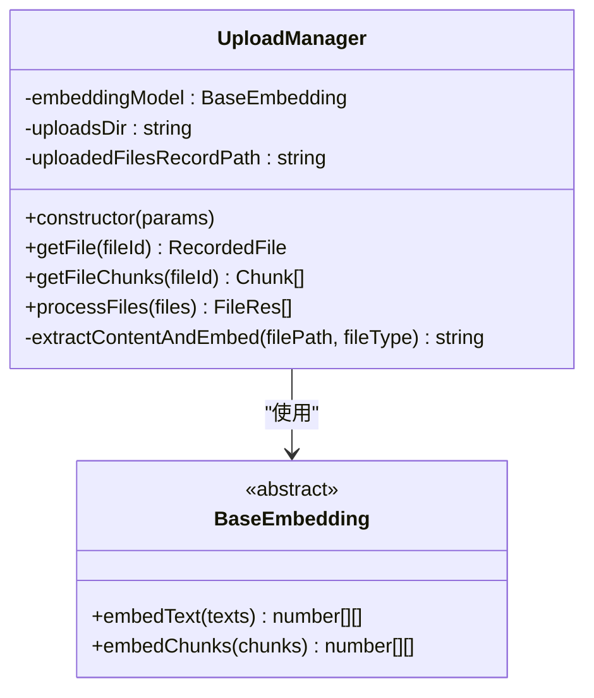
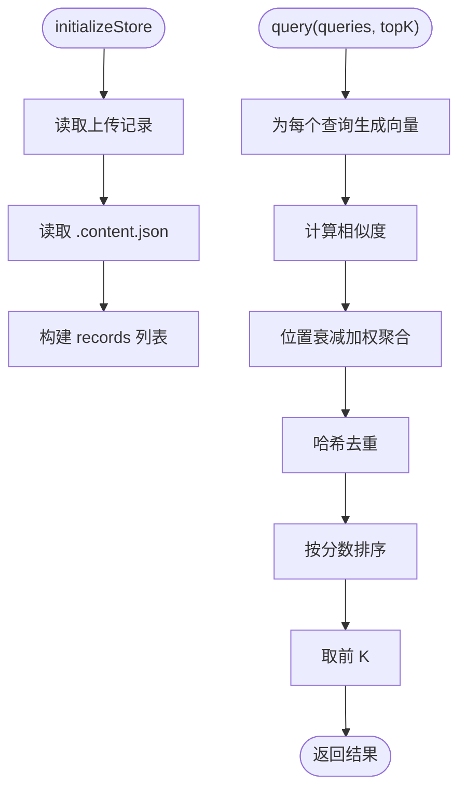
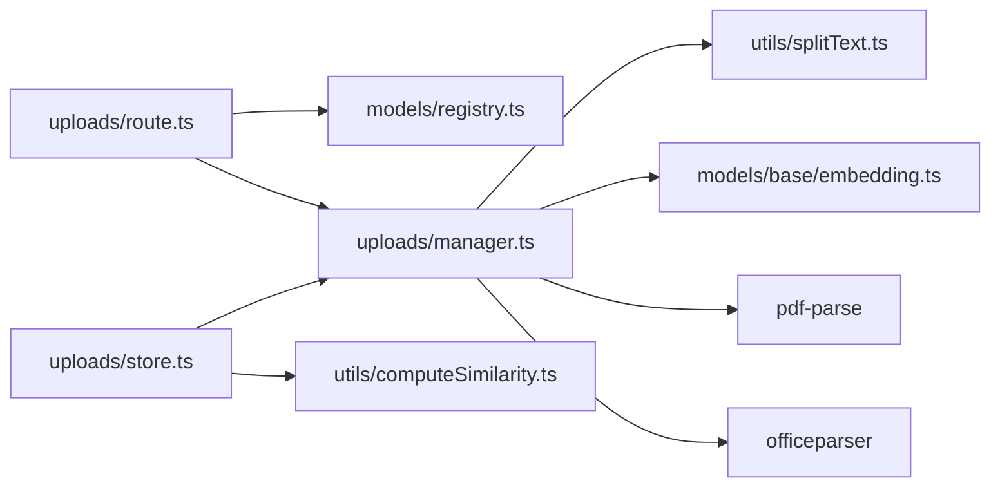

# 文件上传 API

<cite>
**本文档引用的文件**
- [src/app/api/uploads/route.ts](file://src/app/api/uploads/route.ts)
- [src/lib/uploads/manager.ts](file://src/lib/uploads/manager.ts)
- [src/lib/uploads/store.ts](file://src/lib/uploads/store.ts)
- [src/lib/utils/computeSimilarity.ts](file://src/lib/utils/computeSimilarity.ts)
- [src/lib/utils/splitText.ts](file://src/lib/utils/splitText.ts)
- [src/lib/models/base/embedding.ts](file://src/lib/models/base/embedding.ts)
- [src/lib/models/registry.ts](file://src/lib/models/registry.ts)
- [src/lib/types.ts](file://src/lib/types.ts)
- [src/lib/middleware/adminAuth.ts](file://src/lib/middleware/adminAuth.ts)
- [src/lib/adminAuth.ts](file://src/lib/adminAuth.ts)
- [package.json](file://package.json)
</cite>

## 目录
1. [简介](#简介)
2. [项目结构](#项目结构)
3. [核心组件](#核心组件)
4. [架构总览](#架构总览)
5. [详细组件分析](#详细组件分析)
6. [依赖关系分析](#依赖关系分析)
7. [性能考量](#性能考量)
8. [故障排除指南](#故障排除指南)
9. [结论](#结论)
10. [附录](#附录)

## 简介
本文件上传 API 提供将本地文件上传至服务器并进行内容解析、分块、向量化嵌入以及持久化的能力。上传完成后，系统会返回每个文件的唯一标识符，以便后续检索与相似度匹配。该接口支持多种文件类型，通过嵌入模型生成向量表示，并提供基于余弦相似度的检索能力。

## 项目结构
与文件上传 API 相关的关键文件组织如下：
- API 层：负责接收请求、参数校验与响应封装
- 上传管理器：负责文件落地、内容提取、文本分块与向量化
- 向量存储：负责加载已上传文件的向量片段，执行查询与相似度计算
- 工具与模型：提供文本分块、相似度计算、嵌入模型抽象与注册表

**图表来源**
- [src/app/api/uploads/route.ts](file://src/app/api/uploads/route.ts#L1-L40)
- [src/lib/uploads/manager.ts](file://src/lib/uploads/manager.ts#L1-L218)
- [src/lib/uploads/store.ts](file://src/lib/uploads/store.ts#L1-L122)
- [src/lib/utils/splitText.ts](file://src/lib/utils/splitText.ts#L1-L75)
- [src/lib/utils/computeSimilarity.ts](file://src/lib/utils/computeSimilarity.ts#L1-L23)
- [src/lib/models/base/embedding.ts](file://src/lib/models/base/embedding.ts#L1-L10)
- [src/lib/models/registry.ts](file://src/lib/models/registry.ts#L1-L222)

**章节来源**
- [src/app/api/uploads/route.ts](file://src/app/api/uploads/route.ts#L1-L40)
- [src/lib/uploads/manager.ts](file://src/lib/uploads/manager.ts#L1-L218)
- [src/lib/uploads/store.ts](file://src/lib/uploads/store.ts#L1-L122)
- [src/lib/utils/splitText.ts](file://src/lib/utils/splitText.ts#L1-L75)
- [src/lib/utils/computeSimilarity.ts](file://src/lib/utils/computeSimilarity.ts#L1-L23)
- [src/lib/models/base/embedding.ts](file://src/lib/models/base/embedding.ts#L1-L10)
- [src/lib/models/registry.ts](file://src/lib/models/registry.ts#L1-L222)

## 核心组件
- API 控制器：接收 multipart 表单数据，校验必需参数，加载嵌入模型，委托上传管理器处理文件，并返回结果。
- 上传管理器：校验文件类型、保存到磁盘、解析内容、分块、生成向量并写入内容索引文件；维护上传记录文件。
- 向量存储：根据文件 ID 加载分块与向量，执行查询并按相似度聚合排序。
- 文本分块：基于正则与分词器统计 token 数，确保分块长度与重叠满足配置。
- 相似度计算：使用余弦相似度对向量进行比较。
- 嵌入模型抽象：定义统一的 embedText 与 embedChunks 接口，便于多提供商实现。
- 模型注册表：动态加载指定提供商与模型，支持多提供商与模型列表。

**章节来源**
- [src/app/api/uploads/route.ts](file://src/app/api/uploads/route.ts#L5-L40)
- [src/lib/uploads/manager.ts](file://src/lib/uploads/manager.ts#L14-L218)
- [src/lib/uploads/store.ts](file://src/lib/uploads/store.ts#L8-L122)
- [src/lib/utils/splitText.ts](file://src/lib/utils/splitText.ts#L15-L75)
- [src/lib/utils/computeSimilarity.ts](file://src/lib/utils/computeSimilarity.ts#L1-L23)
- [src/lib/models/base/embedding.ts](file://src/lib/models/base/embedding.ts#L3-L9)
- [src/lib/models/registry.ts](file://src/lib/models/registry.ts#L84-L92)

## 架构总览
下图展示了从客户端发起上传请求到完成向量化与索引的完整流程。

**图表来源**
- [src/app/api/uploads/route.ts](file://src/app/api/uploads/route.ts#L5-L32)
- [src/lib/models/registry.ts](file://src/lib/models/registry.ts#L84-L92)
- [src/lib/uploads/manager.ts](file://src/lib/uploads/manager.ts#L177-L215)
- [src/lib/uploads/store.ts](file://src/lib/uploads/store.ts#L54-L98)

## 详细组件分析

### API 控制器（/api/uploads）
- 请求体字段
  - files: File[]（必填，multipart 字段名）
  - embedding_model_key: string（必填）
  - embedding_model_provider_id: string（必填）
- 处理流程
  - 校验必填参数
  - 通过模型注册表加载嵌入模型
  - 初始化上传管理器并处理文件
  - 返回每个文件的元信息（名称、扩展名、唯一 ID）
- 错误处理
  - 参数缺失返回 400
  - 其他异常返回 500

**图表来源**
- [src/app/api/uploads/route.ts](file://src/app/api/uploads/route.ts#L5-L32)

**章节来源**
- [src/app/api/uploads/route.ts](file://src/app/api/uploads/route.ts#L5-L40)

### 上传管理器（UploadManager）
- 支持的 MIME 类型
  - application/pdf
  - application/vnd.openxmlformats-officedocument.wordprocessingml.document
  - text/plain
- 关键职责
  - 校验文件类型
  - 生成随机文件名并保存到 data/uploads
  - 解析内容并分块（默认最大 512 tokens，重叠 128 tokens）
  - 调用嵌入模型生成向量
  - 写入内容索引文件（.content.json），包含 chunks：[{content, embedding}]
  - 维护上传记录文件（uploaded_files.json），记录文件元信息
- 数据结构
  - RecordedFile：id、name、filePath、contentPath、uploadedAt
  - FileRes：fileName、fileExtension、fileId
- 异常
  - 不支持的文件类型抛出错误
  - 嵌入向量与文本分块数量不一致抛出错误
  - 读取内容索引失败返回空数组

**图表来源**
- [src/lib/uploads/manager.ts](file://src/lib/uploads/manager.ts#L32-L218)
- [src/lib/models/base/embedding.ts](file://src/lib/models/base/embedding.ts#L3-L9)

**章节来源**
- [src/lib/uploads/manager.ts](file://src/lib/uploads/manager.ts#L10-L218)

### 向量存储（UploadStore）
- 初始化
  - 根据 fileIds 读取上传记录与内容索引
  - 构建 records 列表，包含 embedding、content、fileId 与 metadata
- 查询流程
  - 对每个查询语句生成向量
  - 计算与所有 records 的相似度
  - 使用哈希去重，按位置衰减加权聚合分数
  - 返回 Top-K 结果
- 辅助方法
  - getFileData：返回每个文件的初始内容片段

**图表来源**
- [src/lib/uploads/store.ts](file://src/lib/uploads/store.ts#L31-L98)
- [src/lib/utils/computeSimilarity.ts](file://src/lib/utils/computeSimilarity.ts#L1-L23)

**章节来源**
- [src/lib/uploads/store.ts](file://src/lib/uploads/store.ts#L20-L122)
- [src/lib/utils/computeSimilarity.ts](file://src/lib/utils/computeSimilarity.ts#L1-L23)

### 文本分块（splitText）
- 分割策略
  - 基于标点与换行的正则分割
  - 使用分词器估算 token 数，确保不超过阈值
  - 保留一定重叠以增强上下文连续性
- 参数
  - maxTokens：默认 512
  - overlapTokens：默认 128

**章节来源**
- [src/lib/utils/splitText.ts](file://src/lib/utils/splitText.ts#L15-L75)

### 相似度计算（余弦相似度）
- 输入：两个等长向量
- 输出：[0, 1] 之间的相似度
- 异常：向量长度不一致抛错

**章节来源**
- [src/lib/utils/computeSimilarity.ts](file://src/lib/utils/computeSimilarity.ts#L1-L23)

### 嵌入模型抽象与注册表
- BaseEmbedding
  - embedText：批量文本向量化
  - embedChunks：批量片段向量化
- ModelRegistry
  - loadEmbeddingModel：按提供商 ID 与模型 Key 加载嵌入模型实例
  - 提供模型列表与动态增删改能力

**章节来源**
- [src/lib/models/base/embedding.ts](file://src/lib/models/base/embedding.ts#L3-L9)
- [src/lib/models/registry.ts](file://src/lib/models/registry.ts#L84-L92)

## 依赖关系分析
- 外部库
  - pdf-parse：PDF 文本解析
  - officeparser：DOC/DOCX 文本解析
  - js-tiktoken：token 计数
- 内部模块
  - 上传管理器依赖分块工具与嵌入模型抽象
  - 向量存储依赖上传管理器与相似度计算
  - API 控制器依赖注册表与上传管理器

**图表来源**
- [src/app/api/uploads/route.ts](file://src/app/api/uploads/route.ts#L1-L40)
- [src/lib/models/registry.ts](file://src/lib/models/registry.ts#L1-L222)
- [src/lib/uploads/manager.ts](file://src/lib/uploads/manager.ts#L1-L218)
- [src/lib/utils/splitText.ts](file://src/lib/utils/splitText.ts#L1-L75)
- [src/lib/utils/computeSimilarity.ts](file://src/lib/utils/computeSimilarity.ts#L1-L23)
- [src/lib/uploads/store.ts](file://src/lib/uploads/store.ts#L1-L122)

**章节来源**
- [package.json](file://package.json#L31-L41)
- [src/lib/uploads/manager.ts](file://src/lib/uploads/manager.ts#L6-L8)
- [src/lib/uploads/store.ts](file://src/lib/uploads/store.ts#L1-L6)

## 性能考量
- 并行处理
  - 上传管理器对多个文件采用并发写入与分块向量化
  - 向量存储对多个查询向量并行计算相似度
- 分块策略
  - 合理设置 maxTokens 与 overlapTokens，平衡内存占用与检索精度
- I/O 优化
  - 使用流式写入与一次性 JSON 序列化减少多次 I/O
- 向量维度
  - 嵌入维度越高，相似度越精确但计算成本更高；需结合具体模型选择

[本节为通用性能建议，无需特定文件来源]

## 故障排除指南
- 常见错误与处理
  - 缺少嵌入模型或提供商参数：返回 400
  - 不支持的文件类型：抛出错误并中断处理
  - 嵌入向量与文本分块数量不一致：抛出错误
  - 读取内容索引失败：返回空数组，不影响其他文件
  - 服务器内部错误：返回 500
- 安全与权限
  - 管理员认证中间件要求 Authorization: Bearer <token>
  - 管理员登录接口提供限流与时间安全密码校验
  - 管理员认证工具自动处理 403（token 失效）场景
- 建议排查步骤
  - 确认请求头包含有效管理员 token
  - 检查嵌入模型提供商与模型 Key 是否正确
  - 查看服务端日志中的错误堆栈
  - 确认 data/uploads 目录存在且具备写权限

**章节来源**
- [src/app/api/uploads/route.ts](file://src/app/api/uploads/route.ts#L13-L39)
- [src/lib/uploads/manager.ts](file://src/lib/uploads/manager.ts#L97-L98)
- [src/lib/middleware/adminAuth.ts](file://src/lib/middleware/adminAuth.ts#L13-L40)
- [src/lib/adminAuth.ts](file://src/lib/adminAuth.ts#L59-L161)

## 结论
文件上传 API 通过清晰的分层设计实现了从文件上传、内容解析、向量化到相似度检索的完整链路。其支持的文件类型与分块策略兼顾了准确性与性能，同时提供了灵活的嵌入模型接入能力。配合管理员认证与限流机制，系统在功能与安全性之间取得了良好平衡。

[本节为总结性内容，无需特定文件来源]

## 附录

### API 规范
- 端点：POST /api/uploads
- 请求头：Content-Type: multipart/form-data
- 请求体字段
  - files: File[]（必填）
  - embedding_model_key: string（必填）
  - embedding_model_provider_id: string（必填）
- 响应
  - 成功：200 { files: [{fileName,fileId,fileExtension}] }
  - 参数缺失：400
  - 服务器错误：500

**章节来源**
- [src/app/api/uploads/route.ts](file://src/app/api/uploads/route.ts#L9-L32)

### 文件类型支持
- application/pdf
- application/vnd.openxmlformats-officedocument.wordprocessingml.document
- text/plain

**章节来源**
- [src/lib/uploads/manager.ts](file://src/lib/uploads/manager.ts#L10-L12)

### 存储与索引
- 原始文件：data/uploads/<随机文件名>
- 内容索引：data/uploads/<原始文件名>.content.json（包含 chunks）
- 上传记录：data/uploads/uploaded_files.json（包含文件元信息）

**章节来源**
- [src/lib/uploads/manager.ts](file://src/lib/uploads/manager.ts#L34-L35)
- [src/lib/uploads/manager.ts](file://src/lib/uploads/manager.ts#L197-L205)

### 相似度匹配算法
- 向量相似度：余弦相似度
- 查询流程：对每个查询生成向量，计算与所有分块向量的相似度，按位置衰减加权聚合后取 Top-K

**章节来源**
- [src/lib/utils/computeSimilarity.ts](file://src/lib/utils/computeSimilarity.ts#L1-L23)
- [src/lib/uploads/store.ts](file://src/lib/uploads/store.ts#L54-L98)

### 权限与安全
- 管理员认证中间件：requireAdmin
- 登录接口：/api/admin/auth（限流、时间安全校验）
- Token 续期：/api/admin/renew
- 客户端工具：adminFetch 自动处理 403 场景

**章节来源**
- [src/lib/middleware/adminAuth.ts](file://src/lib/middleware/adminAuth.ts#L13-L40)
- [src/lib/adminAuth.ts](file://src/lib/adminAuth.ts#L59-L161)