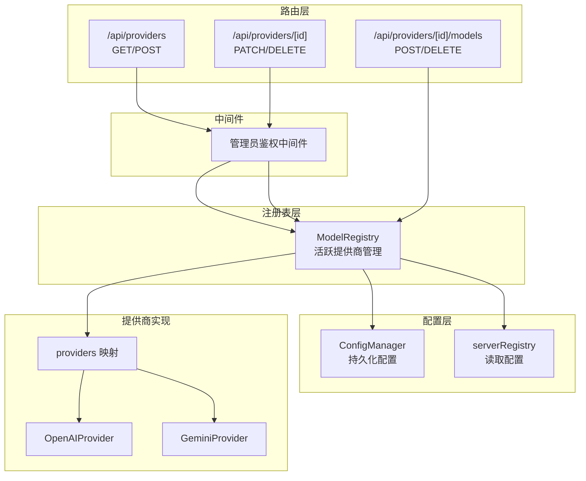
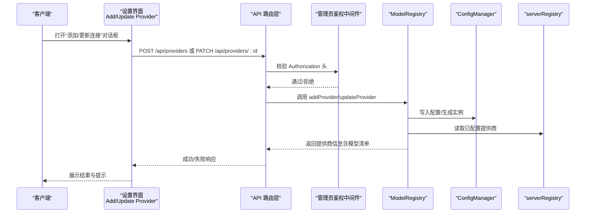
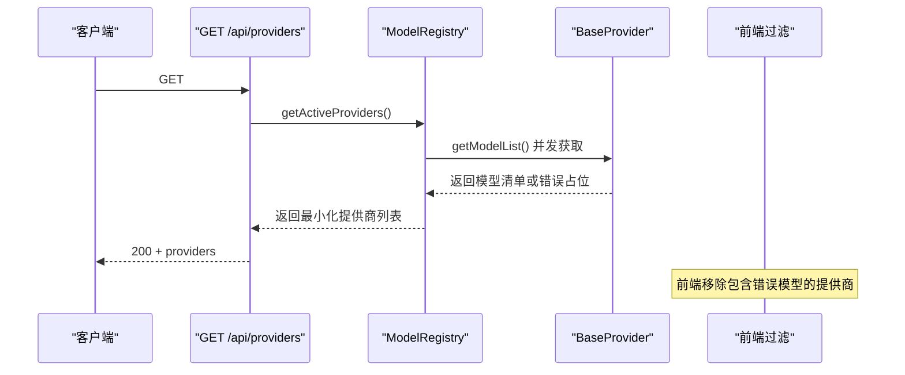
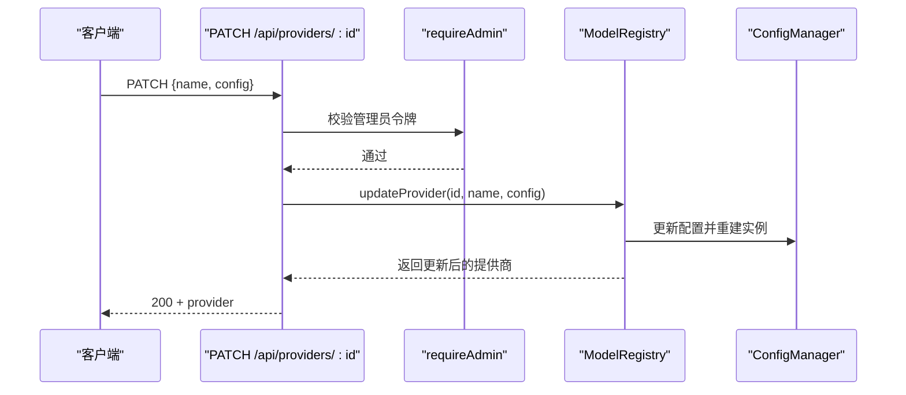
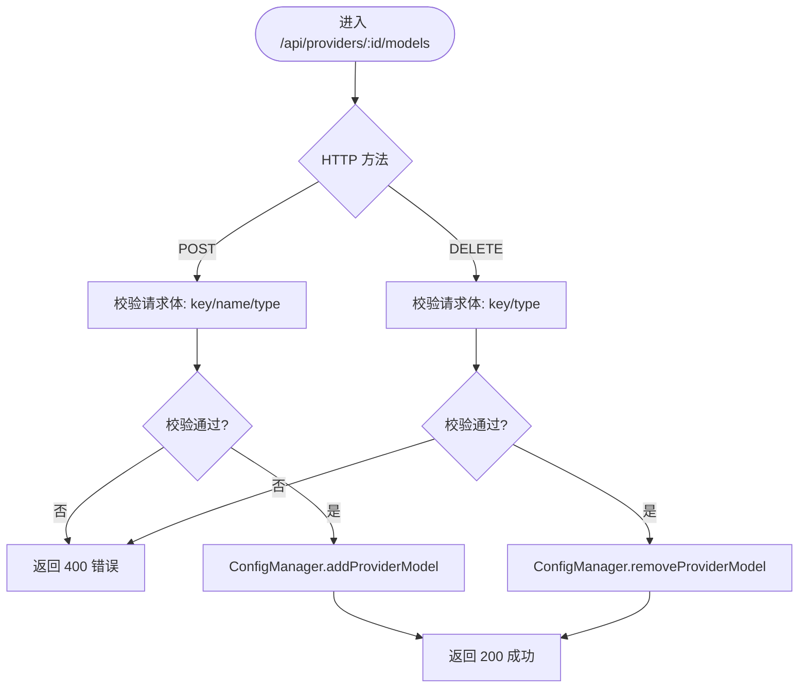
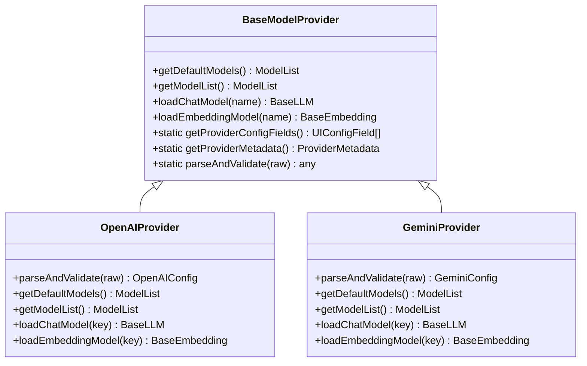
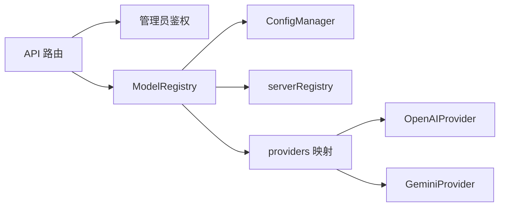

# 模型提供商 API

<cite>
**本文档引用的文件**
- [src/app/api/providers/route.ts](file://src/app/api/providers/route.ts)
- [src/app/api/providers/[id]/route.ts](file://src/app/api/providers/[id]/route.ts)
- [src/app/api/providers/[id]/models/route.ts](file://src/app/api/providers/[id]/models/route.ts)
- [src/lib/middleware/adminAuth.ts](file://src/lib/middleware/adminAuth.ts)
- [src/lib/models/registry.ts](file://src/lib/models/registry.ts)
- [src/lib/models/base/provider.ts](file://src/lib/models/base/provider.ts)
- [src/lib/models/types.ts](file://src/lib/models/types.ts)
- [src/lib/config/types.ts](file://src/lib/config/types.ts)
- [src/lib/config/index.ts](file://src/lib/config/index.ts)
- [src/lib/config/serverRegistry.ts](file://src/lib/config/serverRegistry.ts)
- [src/lib/models/providers/index.ts](file://src/lib/models/providers/index.ts)
- [src/lib/models/providers/openai/index.ts](file://src/lib/models/providers/openai/index.ts)
- [src/lib/models/providers/gemini/index.ts](file://src/lib/models/providers/gemini/index.ts)
- [src/components/Settings/Sections/Models/AddProviderDialog.tsx](file://src/components/Settings/Sections/Models/AddProviderDialog.tsx)
- [src/components/Settings/Sections/Models/UpdateProviderDialog.tsx](file://src/components/Settings/Sections/Models/UpdateProviderDialog.tsx)
</cite>

## 目录
1. [简介](#简介)
2. [项目结构](#项目结构)
3. [核心组件](#核心组件)
4. [架构总览](#架构总览)
5. [详细组件分析](#详细组件分析)
6. [依赖关系分析](#依赖关系分析)
7. [性能考虑](#性能考虑)
8. [故障排除指南](#故障排除指南)
9. [结论](#结论)
10. [附录](#附录)

## 简介
本文件面向模型提供商 API 的使用者与维护者，系统化梳理 /api/providers 及其子端点的管理能力，涵盖提供商的增删改查、模型列表管理、配置验证与状态展示，并结合前端设置界面说明如何通过 UI 完成提供商的添加与更新。同时提供最佳实践、错误处理与故障排除建议，帮助在不同提供商类型之间进行正确配置与兼容性适配。

## 项目结构
围绕模型提供商 API 的关键文件组织如下：
- 路由层：负责 HTTP 请求处理、鉴权与响应格式化
- 注册表层：统一管理已启用的提供商实例及其模型清单
- 基类与类型：定义提供商抽象接口、模型数据结构与 UI 配置字段
- 配置层：持久化存储提供商配置、支持环境变量注入与迁移
- 提供商实现：各云厂商或本地服务的适配器（如 OpenAI、Gemini）

图表来源
- [src/app/api/providers/route.ts](file://src/app/api/providers/route.ts#L1-L78)
- [src/app/api/providers/[id]/route.ts](file://src/app/api/providers/[id]/route.ts#L1-L95)
- [src/app/api/providers/[id]/models/route.ts](file://src/app/api/providers/[id]/models/route.ts#L1-L95)
- [src/lib/middleware/adminAuth.ts](file://src/lib/middleware/adminAuth.ts#L1-L55)
- [src/lib/models/registry.ts](file://src/lib/models/registry.ts#L1-L222)
- [src/lib/config/index.ts](file://src/lib/config/index.ts#L1-L391)
- [src/lib/config/serverRegistry.ts](file://src/lib/config/serverRegistry.ts#L1-L16)
- [src/lib/models/providers/index.ts](file://src/lib/models/providers/index.ts#L1-L36)

章节来源
- [src/app/api/providers/route.ts](file://src/app/api/providers/route.ts#L1-L78)
- [src/app/api/providers/[id]/route.ts](file://src/app/api/providers/[id]/route.ts#L1-L95)
- [src/app/api/providers/[id]/models/route.ts](file://src/app/api/providers/[id]/models/route.ts#L1-L95)
- [src/lib/middleware/adminAuth.ts](file://src/lib/middleware/adminAuth.ts#L1-L55)
- [src/lib/models/registry.ts](file://src/lib/models/registry.ts#L1-L222)
- [src/lib/config/index.ts](file://src/lib/config/index.ts#L1-L391)
- [src/lib/config/serverRegistry.ts](file://src/lib/config/serverRegistry.ts#L1-L16)
- [src/lib/models/providers/index.ts](file://src/lib/models/providers/index.ts#L1-L36)

## 核心组件
- 路由处理器：分别实现 /api/providers 的查询与新增，以及 /api/providers/:id 的更新与删除，还有 /api/providers/:id/models 的模型增删。
- 管理员鉴权中间件：所有写操作均需携带 Bearer Token 并通过校验。
- ModelRegistry：统一加载与管理活跃提供商，聚合模型清单，支持新增、更新、删除提供商及模型。
- ConfigManager：负责配置的持久化、环境变量注入、迁移与模型清单变更。
- 提供商基类与实现：定义统一接口，各提供商实现解析与校验配置、加载模型等能力。
- 类型与 UI 字段：定义模型与提供商的数据结构，以及 UI 配置字段描述。

章节来源
- [src/app/api/providers/route.ts](file://src/app/api/providers/route.ts#L1-L78)
- [src/app/api/providers/[id]/route.ts](file://src/app/api/providers/[id]/route.ts#L1-L95)
- [src/app/api/providers/[id]/models/route.ts](file://src/app/api/providers/[id]/models/route.ts#L1-L95)
- [src/lib/middleware/adminAuth.ts](file://src/lib/middleware/adminAuth.ts#L1-L55)
- [src/lib/models/registry.ts](file://src/lib/models/registry.ts#L1-L222)
- [src/lib/config/index.ts](file://src/lib/config/index.ts#L1-L391)
- [src/lib/models/base/provider.ts](file://src/lib/models/base/provider.ts#L1-L46)
- [src/lib/models/types.ts](file://src/lib/models/types.ts#L1-L104)
- [src/lib/config/types.ts](file://src/lib/config/types.ts#L1-L110)

## 架构总览
下图展示了从客户端到后端的调用链路与职责分工：

图表来源
- [src/components/Settings/Sections/Models/AddProviderDialog.tsx](file://src/components/Settings/Sections/Models/AddProviderDialog.tsx#L1-L213)
- [src/components/Settings/Sections/Models/UpdateProviderDialog.tsx](file://src/components/Settings/Sections/Models/UpdateProviderDialog.tsx#L1-L185)
- [src/app/api/providers/route.ts](file://src/app/api/providers/route.ts#L1-L78)
- [src/app/api/providers/[id]/route.ts](file://src/app/api/providers/[id]/route.ts#L1-L95)
- [src/lib/middleware/adminAuth.ts](file://src/lib/middleware/adminAuth.ts#L1-L55)
- [src/lib/models/registry.ts](file://src/lib/models/registry.ts#L1-L222)
- [src/lib/config/index.ts](file://src/lib/config/index.ts#L1-L391)
- [src/lib/config/serverRegistry.ts](file://src/lib/config/serverRegistry.ts#L1-L16)

## 详细组件分析

### /api/providers 端点（提供商列表与新增）
- GET：返回当前活跃提供商列表，过滤掉获取模型列表失败的提供商，确保前端显示稳定。
- POST：需要管理员权限；请求体包含 type、name、config；调用 ModelRegistry.addProvider 完成新增并返回新提供商信息。

图表来源
- [src/app/api/providers/route.ts](file://src/app/api/providers/route.ts#L5-L34)
- [src/lib/models/registry.ts](file://src/lib/models/registry.ts#L37-L72)
- [src/lib/models/base/provider.ts](file://src/lib/models/base/provider.ts#L1-L46)

章节来源
- [src/app/api/providers/route.ts](file://src/app/api/providers/route.ts#L1-L78)
- [src/lib/models/registry.ts](file://src/lib/models/registry.ts#L1-L222)
- [src/lib/models/base/provider.ts](file://src/lib/models/base/provider.ts#L1-L46)

### /api/providers/:id 端点（单个提供商更新与删除）
- PATCH：需要管理员权限；请求体包含 name、config；调用 ModelRegistry.updateProvider 完成更新并返回最新提供商信息。
- DELETE：需要管理员权限；根据 id 删除提供商；调用 ModelRegistry.removeProvider 后同步清理内存中的活跃实例。

图表来源
- [src/app/api/providers/[id]/route.ts](file://src/app/api/providers/[id]/route.ts#L49-L94)
- [src/lib/middleware/adminAuth.ts](file://src/lib/middleware/adminAuth.ts#L13-L40)
- [src/lib/models/registry.ts](file://src/lib/models/registry.ts#L152-L199)
- [src/lib/config/index.ts](file://src/lib/config/index.ts#L304-L317)

章节来源
- [src/app/api/providers/[id]/route.ts](file://src/app/api/providers/[id]/route.ts#L1-L95)
- [src/lib/middleware/adminAuth.ts](file://src/lib/middleware/adminAuth.ts#L1-L55)
- [src/lib/models/registry.ts](file://src/lib/models/registry.ts#L143-L199)
- [src/lib/config/index.ts](file://src/lib/config/index.ts#L291-L317)

### /api/providers/:id/models 端点（模型列表管理）
- POST：为指定提供商添加一个模型项（chat 或 embedding），请求体需包含 key、name 与 type。
- DELETE：为指定提供商删除一个模型项（按 key 与 type）。

图表来源
- [src/app/api/providers/[id]/models/route.ts](file://src/app/api/providers/[id]/models/route.ts#L1-L95)
- [src/lib/config/index.ts](file://src/lib/config/index.ts#L319-L365)

章节来源
- [src/app/api/providers/[id]/models/route.ts](file://src/app/api/providers/[id]/models/route.ts#L1-L95)
- [src/lib/config/index.ts](file://src/lib/config/index.ts#L319-L365)

### 配置验证与状态管理
- 配置字段定义：UIConfigField 描述了每个提供商所需的字段（名称、键、必填、默认值、占位符、作用域与环境变量映射）。
- 解析与校验：各提供商实现 parseAndValidate 对原始配置进行校验与类型转换。
- 状态展示：当获取模型列表失败时，注册表会返回一个带错误占位的聊天模型，前端可据此过滤显示。

图表来源
- [src/lib/models/base/provider.ts](file://src/lib/models/base/provider.ts#L1-L46)
- [src/lib/models/providers/openai/index.ts](file://src/lib/models/providers/openai/index.ts#L10-L227)
- [src/lib/models/providers/gemini/index.ts](file://src/lib/models/providers/gemini/index.ts#L10-L145)

章节来源
- [src/lib/config/types.ts](file://src/lib/config/types.ts#L1-L110)
- [src/lib/models/base/provider.ts](file://src/lib/models/base/provider.ts#L1-L46)
- [src/lib/models/providers/openai/index.ts](file://src/lib/models/providers/openai/index.ts#L10-L227)
- [src/lib/models/providers/gemini/index.ts](file://src/lib/models/providers/gemini/index.ts#L10-L145)

### 认证配置、API 密钥管理与连接测试
- 管理员鉴权：所有写操作必须携带 Bearer Token，中间件会校验令牌有效性。
- API 密钥管理：提供商配置字段中包含敏感信息（如 apiKey），应使用服务器作用域并在环境变量中注入。
- 连接测试：当前路由层未直接暴露“测试连接”端点；可通过新增/更新提供商后，调用 GET /api/providers 观察是否出现错误占位来判断连接状态。

章节来源
- [src/lib/middleware/adminAuth.ts](file://src/lib/middleware/adminAuth.ts#L1-L55)
- [src/lib/config/types.ts](file://src/lib/config/types.ts#L1-L110)
- [src/lib/models/providers/openai/index.ts](file://src/lib/models/providers/openai/index.ts#L109-L131)
- [src/lib/models/providers/gemini/index.ts](file://src/lib/models/providers/gemini/index.ts#L14-L25)
- [src/app/api/providers/route.ts](file://src/app/api/providers/route.ts#L5-L34)

### 不同提供商类型的配置差异与兼容性
- OpenAI：需要 apiKey 与 baseURL；默认模型清单仅在官方 base URL 下生效。
- Gemini：需要 apiKey；默认模型清单通过远程 API 获取。
- 其他提供商（Ollama、Groq、Anthropic、LMStudio、Transformers、Lemonade）在 providers 映射中注册，各自实现 parseAndValidate 与 getProviderConfigFields。

章节来源
- [src/lib/models/providers/openai/index.ts](file://src/lib/models/providers/openai/index.ts#L10-L131)
- [src/lib/models/providers/gemini/index.ts](file://src/lib/models/providers/gemini/index.ts#L10-L25)
- [src/lib/models/providers/index.ts](file://src/lib/models/providers/index.ts#L1-L36)

## 依赖关系分析
- 路由层依赖管理员鉴权中间件与 ModelRegistry。
- ModelRegistry 依赖 ConfigManager 进行持久化，依赖 serverRegistry 读取配置，依赖 providers 映射创建具体提供商实例。
- 提供商实现依赖 BaseModelProvider 抽象与 UI 配置字段定义。

图表来源
- [src/app/api/providers/route.ts](file://src/app/api/providers/route.ts#L1-L78)
- [src/app/api/providers/[id]/route.ts](file://src/app/api/providers/[id]/route.ts#L1-L95)
- [src/app/api/providers/[id]/models/route.ts](file://src/app/api/providers/[id]/models/route.ts#L1-L95)
- [src/lib/middleware/adminAuth.ts](file://src/lib/middleware/adminAuth.ts#L1-L55)
- [src/lib/models/registry.ts](file://src/lib/models/registry.ts#L1-L222)
- [src/lib/config/index.ts](file://src/lib/config/index.ts#L1-L391)
- [src/lib/config/serverRegistry.ts](file://src/lib/config/serverRegistry.ts#L1-L16)
- [src/lib/models/providers/index.ts](file://src/lib/models/providers/index.ts#L1-L36)

章节来源
- [src/lib/models/registry.ts](file://src/lib/models/registry.ts#L1-L222)
- [src/lib/config/index.ts](file://src/lib/config/index.ts#L1-L391)
- [src/lib/models/providers/index.ts](file://src/lib/models/providers/index.ts#L1-L36)

## 性能考虑
- 并发获取模型清单：ModelRegistry 在构建提供商列表时并发调用各提供商的 getModelList，提升整体响应速度。
- 实例缓存：新增/更新提供商后，注册表会缓存实例以避免重复初始化。
- 前端过滤：对错误占位模型进行前端过滤，减少渲染与交互负担。

章节来源
- [src/lib/models/registry.ts](file://src/lib/models/registry.ts#L37-L72)
- [src/app/api/providers/route.ts](file://src/app/api/providers/route.ts#L11-L13)

## 故障排除指南
- 403 未授权：确认请求头包含正确的 Bearer Token，且令牌有效。
- 400 缺少参数：新增/更新提供商或模型时，确保请求体包含必需字段（type、name、config、key 等）。
- 500 服务器错误：查看后端日志定位异常；对于提供商初始化失败的情况，注册表会在模型列表中插入错误占位，便于前端识别问题。
- 配置不生效：检查环境变量与默认值注入流程；确认 ConfigManager 已保存最新配置。

章节来源
- [src/lib/middleware/adminAuth.ts](file://src/lib/middleware/adminAuth.ts#L18-L35)
- [src/app/api/providers/route.ts](file://src/app/api/providers/route.ts#L41-L50)
- [src/app/api/providers/[id]/route.ts](file://src/app/api/providers/[id]/route.ts#L58-L67)
- [src/app/api/providers/[id]/models/route.ts](file://src/app/api/providers/[id]/models/route.ts#L15-L24)
- [src/lib/models/registry.ts](file://src/lib/models/registry.ts#L29-L34)

## 结论
模型提供商 API 通过清晰的路由分层、严格的管理员鉴权、可扩展的提供商基类与完善的配置持久化机制，实现了对多提供商模型的统一管理。配合前端设置界面，用户可以便捷地添加、更新与删除提供商及模型。建议在生产环境中优先使用服务器作用域的敏感字段并通过环境变量注入，确保安全与可维护性。

## 附录
- 最佳实践
  - 新增提供商前先在环境变量中配置必要字段，避免运行时失败。
  - 使用 PATCH 更新提供商配置时，尽量只传递变更字段，减少不必要的写操作。
  - 对于远程 API 提供商，默认模型清单可能受限于官方域名，自定义 base URL 时需谨慎。
  - 定期通过 GET /api/providers 检查提供商状态，及时发现并修复配置问题。

- 错误码参考
  - 400：缺少必要字段或请求体格式错误
  - 403：管理员鉴权失败
  - 500：内部错误（后端抛出异常或提供商初始化失败）