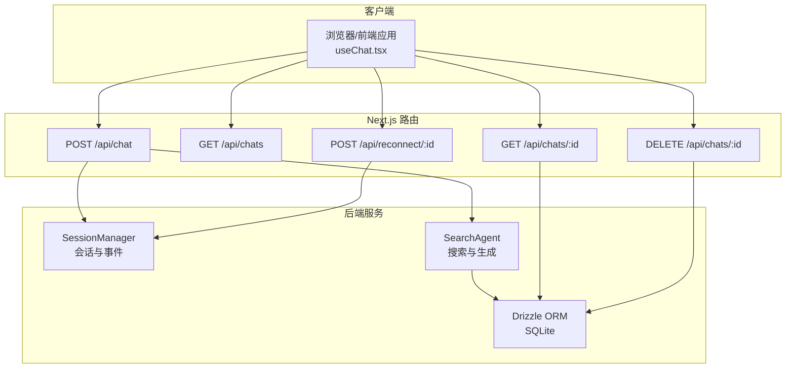
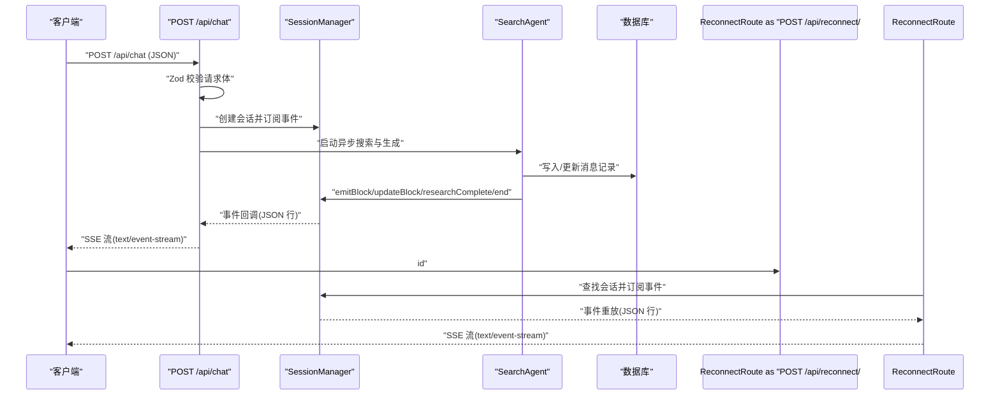
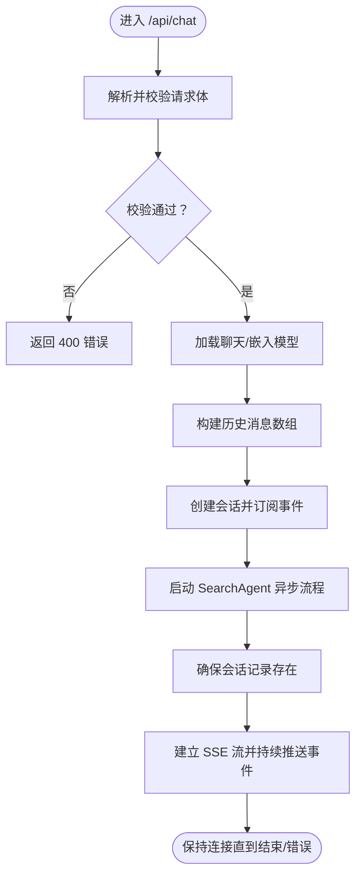
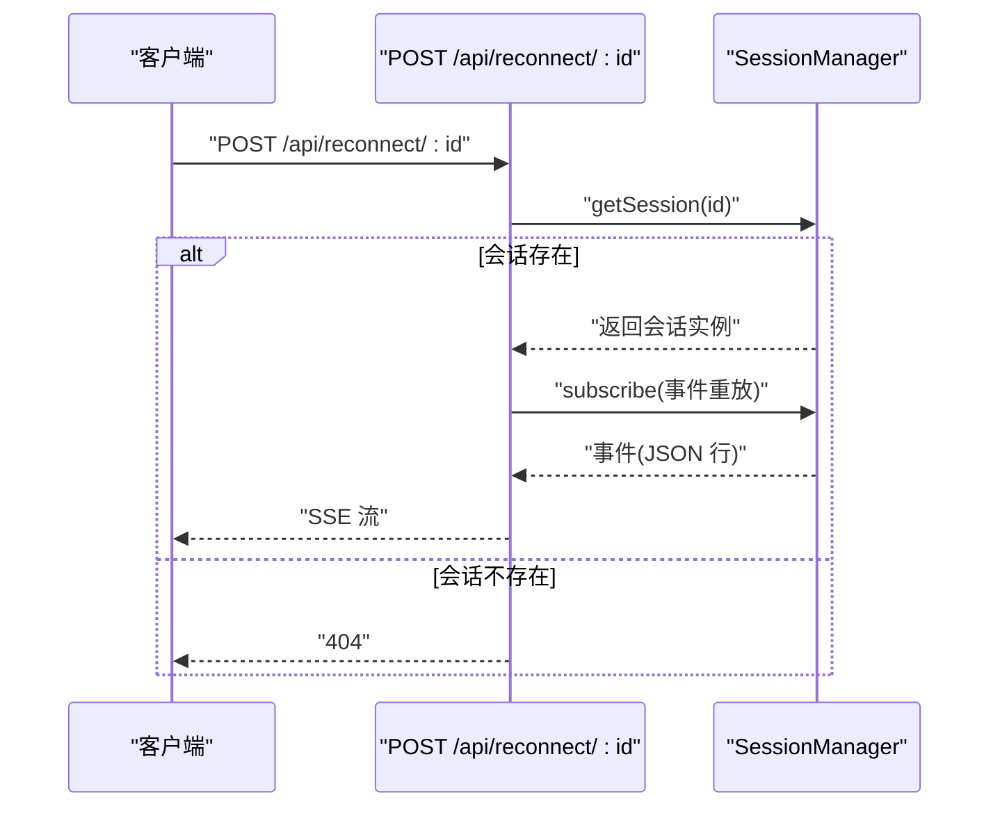
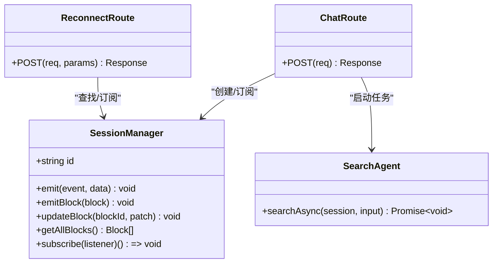
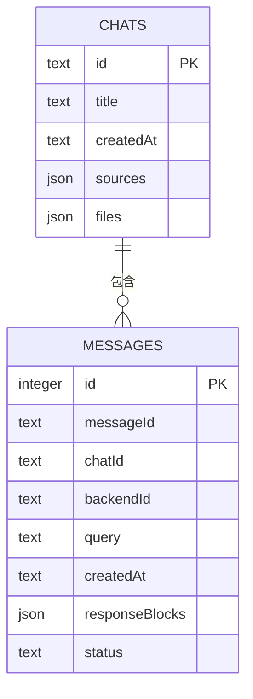
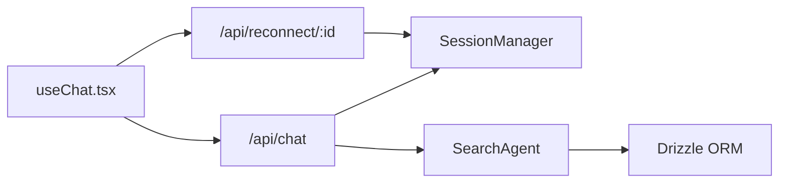

# 聊天 API

<cite>
**本文引用的文件**
- [src/app/api/chat/route.ts](file://src/app/api/chat/route.ts)
- [src/app/api/chats/route.ts](file://src/app/api/chats/route.ts)
- [src/app/api/chats/[id]/route.ts](file://src/app/api/chats/[id]/route.ts)
- [src/app/api/reconnect/[id]/route.ts](file://src/app/api/reconnect/[id]/route.ts)
- [src/lib/session.ts](file://src/lib/session.ts)
- [src/lib/agents/search/index.ts](file://src/lib/agents/search/index.ts)
- [src/lib/agents/search/types.ts](file://src/lib/agents/search/types.ts)
- [src/lib/db/schema.ts](file://src/lib/db/schema.ts)
- [src/lib/types.ts](file://src/lib/types.ts)
- [src/lib/models/types.ts](file://src/lib/models/types.ts)
- [src/lib/hooks/useChat.tsx](file://src/lib/hooks/useChat.tsx)
</cite>

## 目录
1. [简介](#简介)
2. [项目结构](#项目结构)
3. [核心组件](#核心组件)
4. [架构总览](#架构总览)
5. [详细组件分析](#详细组件分析)
6. [依赖关系分析](#依赖关系分析)
7. [性能考量](#性能考量)
8. [故障排查指南](#故障排查指南)
9. [结论](#结论)
10. [附录](#附录)

## 简介
本文件为 Perplexica 项目中聊天相关 API 的权威技术文档，覆盖以下端点与能力：
- 流式聊天：POST /api/chat
- 历史列表：GET /api/chats
- 历史详情与删除：GET /api/chats/:id、DELETE /api/chats/:id
- 重新连接：POST /api/reconnect/:id
- 实时流式响应采用 Server-Sent Events（SSE），事件类型涵盖块级输出、增量更新、研究完成与结束信号等。

文档同时解释请求/响应结构、参数校验、会话管理、错误处理与状态码，并提供可视化图示帮助理解端到端流程。

## 项目结构
围绕聊天 API 的关键文件组织如下：
- 路由层：负责请求解析、参数校验、SSE 响应与错误处理
- 会话层：基于 EventEmitter 的 SessionManager，承载流式事件与块数据
- 搜索代理：SearchAgent 负责检索、小部件执行、最终回答生成与数据库持久化
- 数据模型：Drizzle ORM 定义 chats 与 messages 表结构
- 类型系统：统一的消息、块、模型与搜索配置类型
- 前端集成：React Hook useChat.tsx 负责发起请求、解析 SSE 并渲染界面

图表来源
- [src/app/api/chat/route.ts](file://src/app/api/chat/route.ts#L103-L254)
- [src/app/api/chats/route.ts](file://src/app/api/chats/route.ts#L3-L15)
- [src/app/api/chats/[id]/route.ts](file://src/app/api/chats/[id]/route.ts#L5-L69)
- [src/app/api/reconnect/[id]/route.ts](file://src/app/api/reconnect/[id]/route.ts#L3-L93)
- [src/lib/session.ts](file://src/lib/session.ts#L11-L103)
- [src/lib/agents/search/index.ts](file://src/lib/agents/search/index.ts#L12-L186)
- [src/lib/db/schema.ts](file://src/lib/db/schema.ts#L6-L38)

章节来源
- [src/app/api/chat/route.ts](file://src/app/api/chat/route.ts#L103-L254)
- [src/app/api/chats/route.ts](file://src/app/api/chats/route.ts#L3-L15)
- [src/app/api/chats/[id]/route.ts](file://src/app/api/chats/[id]/route.ts#L5-L69)
- [src/app/api/reconnect/[id]/route.ts](file://src/app/api/reconnect/[id]/route.ts#L3-L93)
- [src/lib/session.ts](file://src/lib/session.ts#L11-L103)
- [src/lib/agents/search/index.ts](file://src/lib/agents/search/index.ts#L12-L186)
- [src/lib/db/schema.ts](file://src/lib/db/schema.ts#L6-L38)

## 核心组件
- 请求体校验与路由入口
  - 使用 Zod 对请求体进行严格校验，返回 400 错误及字段级问题数组
  - 运行时设置为 NodeJS 且禁用动态路由缓存，确保实时性
- 会话管理
  - SessionManager 提供事件订阅、块集合、增量补丁与 TTL 清理
- 搜索代理
  - 分类器决定是否跳过搜索；小部件先行输出；随后检索与阅读；最后以 LLM 流式生成回答并持久化
- 数据模型
  - chats 表存储会话元信息（标题、创建时间、来源、文件）
  - messages 表存储每条消息的查询、块集合与状态

章节来源
- [src/app/api/chat/route.ts](file://src/app/api/chat/route.ts#L16-L69)
- [src/lib/session.ts](file://src/lib/session.ts#L11-L103)
- [src/lib/agents/search/index.ts](file://src/lib/agents/search/index.ts#L12-L186)
- [src/lib/db/schema.ts](file://src/lib/db/schema.ts#L6-L38)

## 架构总览
下图展示从客户端到后端的端到端交互，包括会话创建、事件分发与流式响应。

图表来源
- [src/app/api/chat/route.ts](file://src/app/api/chat/route.ts#L103-L254)
- [src/app/api/reconnect/[id]/route.ts](file://src/app/api/reconnect/[id]/route.ts#L3-L93)
- [src/lib/session.ts](file://src/lib/session.ts#L11-L103)
- [src/lib/agents/search/index.ts](file://src/lib/agents/search/index.ts#L12-L186)
- [src/lib/db/schema.ts](file://src/lib/db/schema.ts#L6-L38)

## 详细组件分析

### POST /api/chat：流式聊天
- 请求方法与路径
  - POST /api/chat
- 请求头
  - Content-Type: application/json
- 请求体结构（字段说明）
  - message: 对象
    - messageId: 字符串，必填
    - chatId: 字符串，必填
    - content: 字符串，必填且非空
  - optimizationMode: 枚举，可选值为 "speed" | "balanced" | "quality"，默认 "speed"
  - sources: 字符串数组，可选，默认 []
  - history: 二元组数组 [[角色, 内容], ...]，可选，默认 []
  - files: 字符串数组，可选，默认 []
  - chatModel: 对象，包含 providerId 与 key，必填
  - embeddingModel: 对象，包含 providerId 与 key，必填
  - systemInstructions: 字符串或 null，可选，默认 ""
- 参数校验
  - 使用 Zod schema 校验，失败返回 400 与字段级错误数组
  - content 为空字符串时直接返回 400
- 处理流程
  - 加载聊天模型与嵌入模型
  - 将 history 映射为标准 ChatTurnMessage[]
  - 创建会话并订阅事件
  - 启动 SearchAgent 异步流程
  - 确保会话在数据库中存在（首次创建）
  - 建立 TransformStream，编码事件为 JSON 行，作为 SSE 返回
  - 监听请求中断，清理资源
- SSE 事件类型
  - block: 新增块（如文本、源、小部件、研究步骤等）
  - updateBlock: 增量更新块（通过 JSON Patch）
  - researchComplete: 检索阶段完成
  - messageEnd: 当前消息生成结束
  - error: 发生错误时携带错误信息
- 响应头
  - Content-Type: text/event-stream
  - Connection: keep-alive
  - Cache-Control: no-cache, no-transform
- 状态码
  - 200: 成功流式响应
  - 400: 请求体无效或内容为空
  - 500: 服务器内部错误
- 示例
  - 请求（示意）
    - 方法：POST
    - 路径：/api/chat
    - 头部：Content-Type: application/json
    - 正文：包含 message、history、files、sources、chatModel、embeddingModel、optimizationMode、systemInstructions
  - 响应（SSE）
    - 多行 JSON，每行一个事件对象
    - 事件类型：block、updateBlock、researchComplete、messageEnd、error

图表来源
- [src/app/api/chat/route.ts](file://src/app/api/chat/route.ts#L103-L254)
- [src/lib/agents/search/index.ts](file://src/lib/agents/search/index.ts#L12-L186)
- [src/lib/session.ts](file://src/lib/session.ts#L11-L103)

章节来源
- [src/app/api/chat/route.ts](file://src/app/api/chat/route.ts#L16-L69)
- [src/app/api/chat/route.ts](file://src/app/api/chat/route.ts#L103-L254)
- [src/lib/agents/search/types.ts](file://src/lib/agents/search/types.ts#L18-L24)
- [src/lib/models/types.ts](file://src/lib/models/types.ts#L26-L29)

### GET /api/chats：聊天历史列表
- 功能：返回所有会话的基本信息（按创建时间倒序）
- 响应体
  - chats: 数组，元素为 chats 表记录
- 状态码
  - 200: 成功
  - 500: 服务器内部错误

章节来源
- [src/app/api/chats/route.ts](file://src/app/api/chats/route.ts#L3-L15)
- [src/lib/db/schema.ts](file://src/lib/db/schema.ts#L26-L38)

### GET /api/chats/:id：聊天详情
- 功能：返回指定会话及其全部消息
- 路径参数
  - id: 会话 ID
- 响应体
  - chat: chats 表记录
  - messages: messages 表记录数组
- 状态码
  - 200: 成功
  - 404: 会话不存在
  - 500: 服务器内部错误

章节来源
- [src/app/api/chats/[id]/route.ts](file://src/app/api/chats/[id]/route.ts#L5-L38)
- [src/lib/db/schema.ts](file://src/lib/db/schema.ts#L6-L19)

### DELETE /api/chats/:id：删除聊天
- 功能：删除指定会话及其关联消息
- 路径参数
  - id: 会话 ID
- 响应体
  - message: 删除成功提示
- 状态码
  - 200: 成功
  - 404: 会话不存在
  - 500: 服务器内部错误

章节来源
- [src/app/api/chats/[id]/route.ts](file://src/app/api/chats/[id]/route.ts#L40-L69)
- [src/lib/db/schema.ts](file://src/lib/db/schema.ts#L6-L19)

### POST /api/reconnect/:id：重新连接
- 功能：对指定会话 ID 重新订阅事件，用于断线重连
- 路径参数
  - id: 会话 ID（即消息记录中的 backendId）
- 响应头
  - Content-Type: text/event-stream
  - Connection: keep-alive
  - Cache-Control: no-cache, no-transform
- SSE 事件类型
  - 与 /api/chat 相同：block、updateBlock、researchComplete、messageEnd、error
- 状态码
  - 200: 成功流式响应
  - 404: 会话不存在
  - 500: 服务器内部错误

图表来源
- [src/app/api/reconnect/[id]/route.ts](file://src/app/api/reconnect/[id]/route.ts#L3-L93)
- [src/lib/session.ts](file://src/lib/session.ts#L27-L29)

章节来源
- [src/app/api/reconnect/[id]/route.ts](file://src/app/api/reconnect/[id]/route.ts#L3-L93)
- [src/lib/session.ts](file://src/lib/session.ts#L11-L103)

### 会话管理与事件模型
- SessionManager
  - 会话生命周期：随机 ID、TTL 自动清理
  - 事件：data（块新增/更新）、end（完成）、error（异常）
  - 块操作：emitBlock、updateBlock（基于 JSON Patch）
  - 订阅：支持事件重放，新订阅者可收到历史事件
- 前端消费
  - useChat.tsx 在断线场景调用 /api/reconnect/:id，逐行解析 JSON 并更新本地状态

图表来源
- [src/lib/session.ts](file://src/lib/session.ts#L11-L103)
- [src/lib/agents/search/index.ts](file://src/lib/agents/search/index.ts#L12-L186)
- [src/app/api/chat/route.ts](file://src/app/api/chat/route.ts#L103-L254)
- [src/app/api/reconnect/[id]/route.ts](file://src/app/api/reconnect/[id]/route.ts#L3-L93)

章节来源
- [src/lib/session.ts](file://src/lib/session.ts#L11-L103)
- [src/lib/agents/search/index.ts](file://src/lib/agents/search/index.ts#L12-L186)
- [src/lib/hooks/useChat.tsx](file://src/lib/hooks/useChat.tsx#L408-L461)

### 数据模型与类型
- 数据表
  - chats：id、title、createdAt、sources、files
  - messages：messageId、chatId、backendId、query、createdAt、responseBlocks、status
- 类型
  - ChatTurnMessage、Message、Block 及各类块类型（文本、源、建议、小部件、研究）
  - 搜索配置与输入类型（Sources、SearchAgentConfig、SearchAgentInput）

图表来源
- [src/lib/db/schema.ts](file://src/lib/db/schema.ts#L6-L38)
- [src/lib/types.ts](file://src/lib/types.ts#L28-L123)

章节来源
- [src/lib/db/schema.ts](file://src/lib/db/schema.ts#L6-L38)
- [src/lib/types.ts](file://src/lib/types.ts#L28-L123)

## 依赖关系分析
- 组件耦合
  - /api/chat 依赖 SessionManager 与 SearchAgent，二者通过事件解耦
  - SearchAgent 依赖 Drizzle ORM 读写数据库
  - 前端 useChat.tsx 仅通过 HTTP 与 SSE 与后端交互
- 外部依赖
  - rfc6902：用于块的增量补丁
  - Zod：请求体校验
  - Next.js App Router：路由组织

图表来源
- [src/app/api/chat/route.ts](file://src/app/api/chat/route.ts#L103-L254)
- [src/app/api/reconnect/[id]/route.ts](file://src/app/api/reconnect/[id]/route.ts#L3-L93)
- [src/lib/session.ts](file://src/lib/session.ts#L11-L103)
- [src/lib/agents/search/index.ts](file://src/lib/agents/search/index.ts#L12-L186)
- [src/lib/hooks/useChat.tsx](file://src/lib/hooks/useChat.tsx#L408-L461)

章节来源
- [src/app/api/chat/route.ts](file://src/app/api/chat/route.ts#L103-L254)
- [src/app/api/reconnect/[id]/route.ts](file://src/app/api/reconnect/[id]/route.ts#L3-L93)
- [src/lib/session.ts](file://src/lib/session.ts#L11-L103)
- [src/lib/agents/search/index.ts](file://src/lib/agents/search/index.ts#L12-L186)
- [src/lib/hooks/useChat.tsx](file://src/lib/hooks/useChat.tsx#L408-L461)

## 性能考量
- 流式传输
  - 使用 TransformStream 与 TextEncoder，边生成边推送，降低首字节延迟
- 会话复用
  - SessionManager 支持事件重放，避免重复计算
- 并行加载
  - 模型加载与检索并行，提升整体吞吐
- 数据库写入
  - 先插入/更新消息记录，再写入块集合，保证一致性

[本节为通用指导，不直接分析具体文件]

## 故障排查指南
- 常见错误与定位
  - 400：请求体校验失败（检查字段类型与必填项）
  - 404：/api/chats/:id 或 /api/reconnect/:id 的资源不存在
  - 500：服务器内部错误（查看后端日志）
- 断线重连
  - 前端在消息状态为 answering 时自动调用 /api/reconnect/:id
  - 若未收到 messageEnd，检查 SSE 是否被提前关闭或网络中断
- 事件解析
  - 前端按行解析 JSON，注意处理不完整片段与异常

章节来源
- [src/app/api/chat/route.ts](file://src/app/api/chat/route.ts#L109-L126)
- [src/app/api/chats/[id]/route.ts](file://src/app/api/chats/[id]/route.ts#L16-L18)
- [src/app/api/reconnect/[id]/route.ts](file://src/app/api/reconnect/[id]/route.ts#L12-L14)
- [src/lib/hooks/useChat.tsx](file://src/lib/hooks/useChat.tsx#L408-L461)

## 结论
该聊天 API 通过严格的请求体校验、事件驱动的会话管理与 SSE 流式传输，实现了高可靠、低延迟的实时对话体验。结合历史管理与断线重连机制，满足了复杂交互场景下的可用性需求。建议在生产环境关注会话 TTL、SSE 心跳与前端异常恢复策略，以进一步提升稳定性。

[本节为总结性内容，不直接分析具体文件]

## 附录

### SSE 事件类型定义
- block
  - 说明：新增块（如文本、源、小部件、研究步骤等）
  - 字段：type: "block", block: 块对象
- updateBlock
  - 说明：块的增量更新（基于 JSON Patch）
  - 字段：type: "updateBlock", blockId: 块 ID, patch: 补丁数组
- researchComplete
  - 说明：检索阶段完成
  - 字段：type: "researchComplete"
- messageEnd
  - 说明：当前消息生成结束
  - 字段：type: "messageEnd"
- error
  - 说明：发生错误
  - 字段：type: "error", data: 错误信息

章节来源
- [src/app/api/chat/route.ts](file://src/app/api/chat/route.ts#L159-L211)
- [src/app/api/reconnect/[id]/route.ts](file://src/app/api/reconnect/[id]/route.ts#L20-L72)
- [src/lib/agents/search/index.ts](file://src/lib/agents/search/index.ts#L97-L100)

### 请求/响应示例（路径引用）
- POST /api/chat
  - 请求体字段与校验参考：[src/app/api/chat/route.ts](file://src/app/api/chat/route.ts#L16-L48)
  - 校验失败返回 400：[src/app/api/chat/route.ts](file://src/app/api/chat/route.ts#L109-L114)
  - 内容为空返回 400：[src/app/api/chat/route.ts](file://src/app/api/chat/route.ts#L119-L126)
  - 成功流式响应头：[src/app/api/chat/route.ts](file://src/app/api/chat/route.ts#L240-L246)
- GET /api/chats
  - 成功响应：[src/app/api/chats/route.ts](file://src/app/api/chats/route.ts#L6-L7)
- GET /api/chats/:id
  - 成功响应：[src/app/api/chats/[id]/route.ts](file://src/app/api/chats/[id]/route.ts#L24-L29)
  - 404 场景：[src/app/api/chats/[id]/route.ts](file://src/app/api/chats/[id]/route.ts#L16-L18)
- DELETE /api/chats/:id
  - 成功响应：[src/app/api/chats/[id]/route.ts](file://src/app/api/chats/[id]/route.ts#L58-L61)
  - 404 场景：[src/app/api/chats/[id]/route.ts](file://src/app/api/chats/[id]/route.ts#L51-L53)
- POST /api/reconnect/:id
  - 成功流式响应头：[src/app/api/reconnect/[id]/route.ts](file://src/app/api/reconnect/[id]/route.ts#L79-L85)
  - 404 场景：[src/app/api/reconnect/[id]/route.ts](file://src/app/api/reconnect/[id]/route.ts#L12-L14)