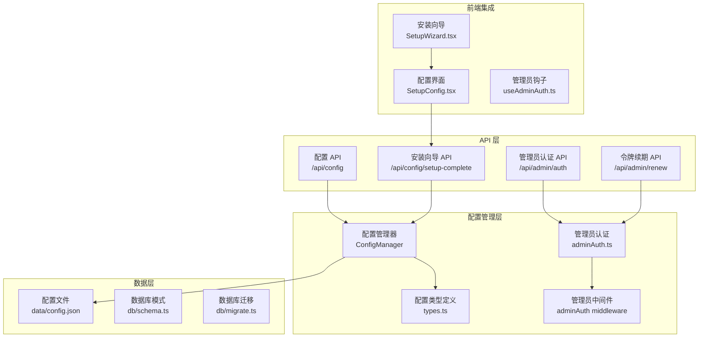
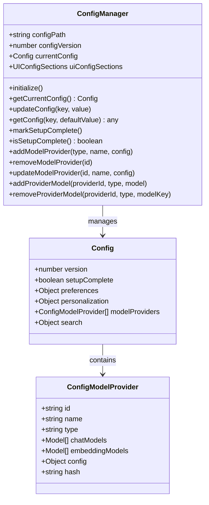
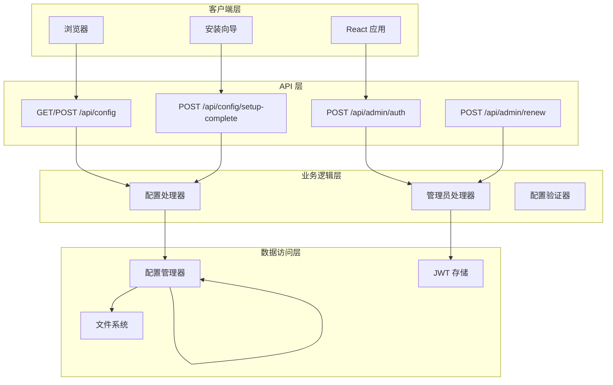
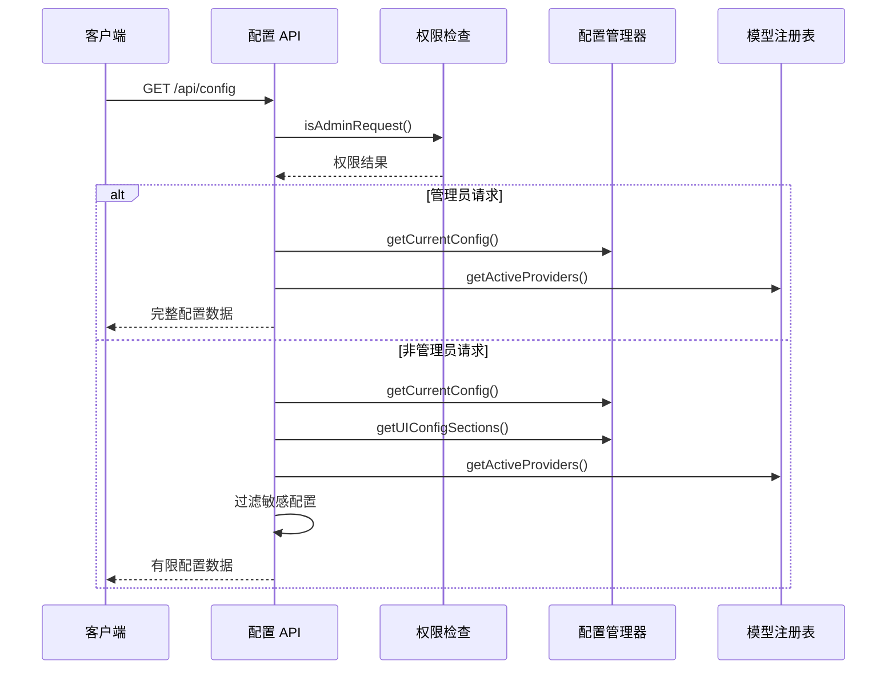
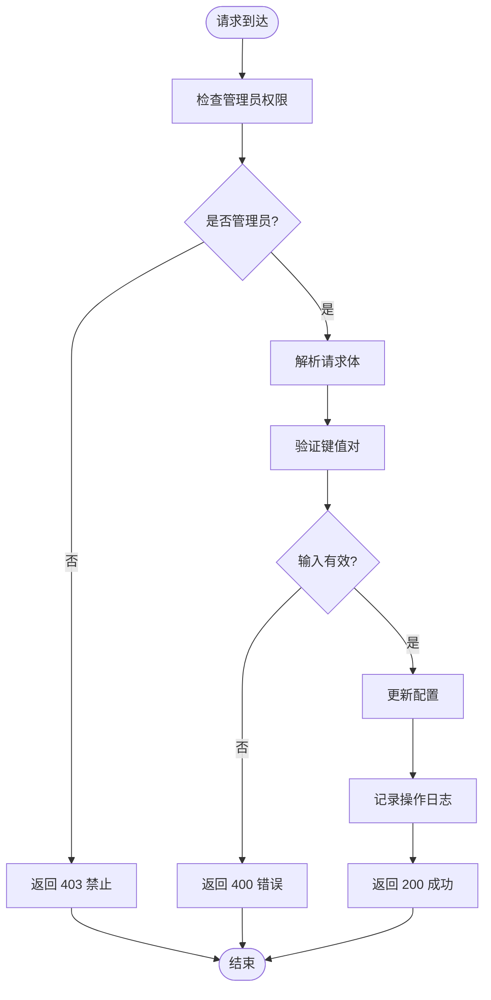
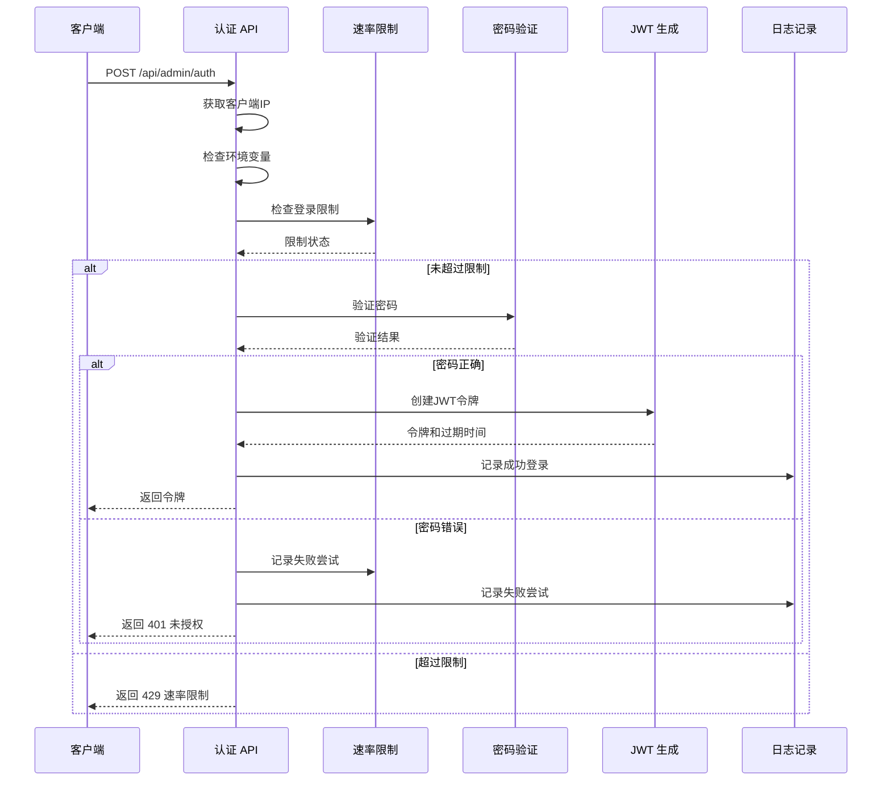
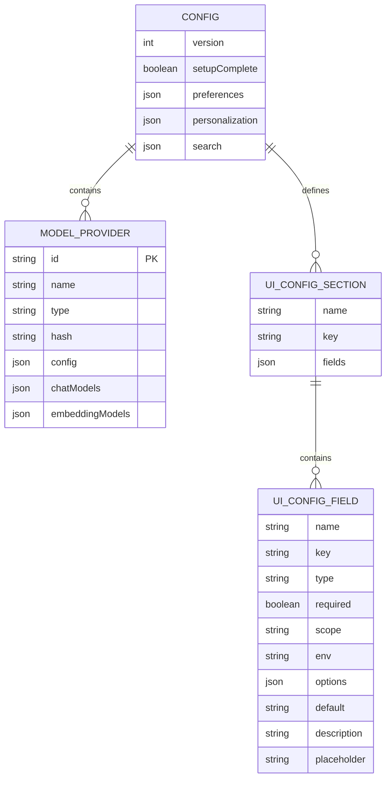
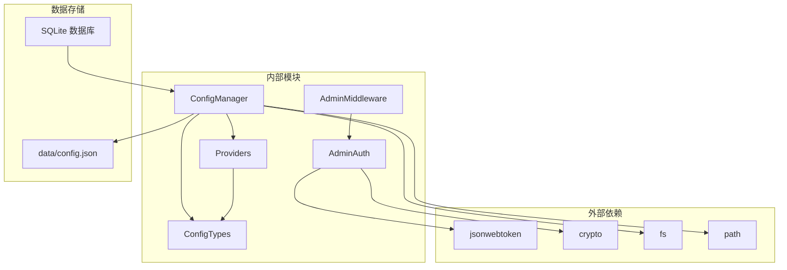

# 配置管理 API

<cite>
**本文档引用的文件**
- [src/app/api/config/route.ts](file://src/app/api/config/route.ts)
- [src/app/api/config/setup-complete/route.ts](file://src/app/api/config/setup-complete/route.ts)
- [src/app/api/admin/auth/route.ts](file://src/app/api/admin/auth/route.ts)
- [src/app/api/admin/renew/route.ts](file://src/app/api/admin/renew/route.ts)
- [src/lib/config/index.ts](file://src/lib/config/index.ts)
- [src/lib/config/types.ts](file://src/lib/config/types.ts)
- [src/lib/adminAuth.ts](file://src/lib/adminAuth.ts)
- [src/lib/middleware/adminAuth.ts](file://src/lib/middleware/adminAuth.ts)
- [src/lib/hooks/useAdminAuth.ts](file://src/lib/hooks/useAdminAuth.ts)
- [src/lib/models/providers/index.ts](file://src/lib/models/providers/index.ts)
- [src/lib/db/migrate.ts](file://src/lib/db/migrate.ts)
- [src/lib/db/schema.ts](file://src/lib/db/schema.ts)
- [data/config.json](file://data/config.json)
- [src/components/Setup/SetupWizard.tsx](file://src/components/Setup/SetupWizard.tsx)
- [src/components/Setup/SetupConfig.tsx](file://src/components/Setup/SetupConfig.tsx)
</cite>

## 目录
1. [简介](#简介)
2. [项目结构](#项目结构)
3. [核心组件](#核心组件)
4. [架构概览](#架构概览)
5. [详细组件分析](#详细组件分析)
6. [依赖关系分析](#依赖关系分析)
7. [性能考虑](#性能考虑)
8. [故障排除指南](#故障排除指南)
9. [结论](#结论)
10. [附录](#附录)

## 简介

配置管理 API 是 Perplexica 应用的核心基础设施，负责管理系统配置的读取、更新和持久化。该系统提供了完整的管理员身份验证机制、配置项验证和安全保护，确保系统的稳定运行和数据安全。

本系统采用基于文件的配置存储方案，使用 JSON 格式存储所有配置信息，并通过专门的配置管理器进行统一管理。系统支持动态配置项验证、环境变量集成、模型提供商配置以及安装向导功能。

## 项目结构

配置管理 API 的核心文件组织如下：

**图表来源**
- [src/app/api/config/route.ts](file://src/app/api/config/route.ts#L1-L111)
- [src/lib/config/index.ts](file://src/lib/config/index.ts#L1-L391)
- [src/lib/adminAuth.ts](file://src/lib/adminAuth.ts#L1-L197)

**章节来源**
- [src/app/api/config/route.ts](file://src/app/api/config/route.ts#L1-L111)
- [src/lib/config/index.ts](file://src/lib/config/index.ts#L1-L391)

## 核心组件

### 配置管理器 (ConfigManager)

配置管理器是整个配置系统的核心，负责配置的初始化、验证、持久化和迁移。

**主要功能：**
- 配置文件的读取和写入
- 配置项的动态验证
- 环境变量集成
- 配置迁移和版本管理
- 模型提供商配置管理

**配置结构：**

**图表来源**
- [src/lib/config/index.ts](file://src/lib/config/index.ts#L7-L386)
- [src/lib/config/types.ts](file://src/lib/config/types.ts#L63-L76)

**章节来源**
- [src/lib/config/index.ts](file://src/lib/config/index.ts#L7-L386)
- [src/lib/config/types.ts](file://src/lib/config/types.ts#L1-L110)

### 管理员认证系统

管理员认证系统提供安全的身份验证和授权机制，使用 JWT 令牌实现无状态认证。

**核心组件：**
- 密码验证 (使用时间安全比较)
- 登录尝试限制 (防暴力破解)
- JWT 令牌生成和验证
- 令牌续期机制

**章节来源**
- [src/lib/adminAuth.ts](file://src/lib/adminAuth.ts#L1-L197)
- [src/lib/middleware/adminAuth.ts](file://src/lib/middleware/adminAuth.ts#L1-L55)

## 架构概览

配置管理 API 采用分层架构设计，确保职责分离和系统可维护性：

**图表来源**
- [src/app/api/config/route.ts](file://src/app/api/config/route.ts#L12-L64)
- [src/app/api/admin/auth/route.ts](file://src/app/api/admin/auth/route.ts#L25-L102)

## 详细组件分析

### 配置读取和更新端点

#### GET /api/config 端点

该端点负责返回当前系统配置，具有智能的权限控制和敏感信息过滤功能。

**功能特性：**
- 返回完整的配置值和 UI 配置字段定义
- 管理员模式下显示完整配置
- 普通用户模式下过滤敏感信息
- 动态获取活跃的模型提供商信息

**权限控制流程：**

**图表来源**
- [src/app/api/config/route.ts](file://src/app/api/config/route.ts#L12-L64)
- [src/lib/middleware/adminAuth.ts](file://src/lib/middleware/adminAuth.ts#L45-L54)

**POST /api/config 端点**

该端点负责配置更新操作，包含严格的权限验证和输入验证。

**处理流程：**

**图表来源**
- [src/app/api/config/route.ts](file://src/app/api/config/route.ts#L66-L110)

**章节来源**
- [src/app/api/config/route.ts](file://src/app/api/config/route.ts#L12-L110)

### 安装向导完成状态管理

#### POST /api/config/setup-complete 端点

该端点用于标记系统安装向导的完成状态，确保应用正确进入正常运行模式。

**工作流程：**
1. 接收安装完成请求
2. 调用配置管理器标记安装完成
3. 更新配置文件中的 `setupComplete` 标志
4. 返回成功响应

**章节来源**
- [src/app/api/config/setup-complete/route.ts](file://src/app/api/config/setup-complete/route.ts#L1-L24)

### 管理员身份验证系统

#### POST /api/admin/auth 端点

管理员身份验证端点提供安全的登录机制，包含多重安全防护措施。

**安全特性：**
- 环境变量配置检查
- 登录尝试频率限制 (15分钟内最多5次)
- 时间安全的密码比较
- JWT 令牌生成和过期管理

**认证流程：**

**图表来源**
- [src/app/api/admin/auth/route.ts](file://src/app/api/admin/auth/route.ts#L25-L102)
- [src/lib/adminAuth.ts](file://src/lib/adminAuth.ts#L79-L129)

**POST /api/admin/renew 端点**

令牌续期端点提供安全的令牌刷新机制，避免用户频繁重新登录。

**续期流程：**
1. 从 Authorization 头部提取 JWT 令牌
2. 验证令牌的有效性和完整性
3. 生成新的 JWT 令牌
4. 更新过期时间
5. 返回新的令牌信息

**章节来源**
- [src/app/api/admin/auth/route.ts](file://src/app/api/admin/auth/route.ts#L10-L24)
- [src/app/api/admin/renew/route.ts](file://src/app/api/admin/renew/route.ts#L1-L61)

### 配置数据模型

配置系统使用强类型的数据模型确保数据完整性和一致性：

**图表来源**
- [src/lib/config/types.ts](file://src/lib/config/types.ts#L63-L96)

**章节来源**
- [src/lib/config/types.ts](file://src/lib/config/types.ts#L1-L110)

## 依赖关系分析

配置管理 API 的依赖关系图展示了各组件之间的交互：

**图表来源**
- [src/lib/config/index.ts](file://src/lib/config/index.ts#L1-L6)
- [src/lib/adminAuth.ts](file://src/lib/adminAuth.ts#L1-L3)
- [src/lib/models/providers/index.ts](file://src/lib/models/providers/index.ts#L1-L11)

**章节来源**
- [src/lib/config/index.ts](file://src/lib/config/index.ts#L1-L391)
- [src/lib/adminAuth.ts](file://src/lib/adminAuth.ts#L1-L197)

## 性能考虑

### 配置访问优化

1. **内存缓存策略**
   - 配置文件在内存中缓存，避免重复磁盘 I/O
   - 配置变更实时同步到磁盘，确保数据持久性

2. **并发访问控制**
   - 文件写入操作使用同步阻塞，防止竞态条件
   - 配置读取操作非阻塞，支持高并发访问

3. **网络传输优化**
   - 管理员模式返回完整配置，减少后续请求
   - 非管理员模式过滤敏感信息，降低响应大小

### 安全性能平衡

1. **JWT 令牌缓存**
   - 本地存储令牌和过期时间，避免频繁网络请求
   - 自动续期机制减少用户交互

2. **速率限制实现**
   - 内存中的登录尝试计数，避免数据库访问
   - 定期清理过期的尝试记录

## 故障排除指南

### 常见问题诊断

#### 配置文件损坏

**症状：** 启动时配置加载失败或返回默认配置

**解决方案：**
1. 检查 `data/config.json` 文件格式
2. 验证 JSON 语法正确性
3. 如损坏，删除文件让系统重新生成默认配置

**章节来源**
- [src/lib/config/index.ts](file://src/lib/config/index.ts#L143-L167)

#### 管理员认证失败

**症状：** 无法登录管理员面板

**诊断步骤：**
1. 检查 `ADMIN_PASSWORD` 环境变量是否设置
2. 验证密码是否正确（区分大小写）
3. 查看速率限制状态 (15分钟内最多5次尝试)

**章节来源**
- [src/app/api/admin/auth/route.ts](file://src/app/api/admin/auth/route.ts#L35-L41)
- [src/lib/adminAuth.ts](file://src/lib/adminAuth.ts#L79-L101)

#### 令牌过期问题

**症状：** 管理员功能自动失效

**解决方案：**
1. 检查浏览器本地存储中的令牌
2. 确认 `JWT_SECRET` 或 `ADMIN_PASSWORD` 环境变量
3. 手动触发令牌续期

**章节来源**
- [src/lib/hooks/useAdminAuth.ts](file://src/lib/hooks/useAdminAuth.ts#L42-L75)

### 配置更新问题

#### 配置保存失败

**症状：** 修改配置后重启丢失

**排查方法：**
1. 检查 `DATA_DIR` 环境变量指向的目录
2. 验证目录写入权限
3. 确认磁盘空间充足

**章节来源**
- [src/lib/config/index.ts](file://src/lib/config/index.ts#L8-L12)

## 结论

配置管理 API 提供了一个完整、安全且高效的配置管理系统。通过分层架构设计、严格的权限控制和多重安全防护，确保了系统的稳定性和安全性。

**主要优势：**
- 完整的管理员身份验证机制
- 智能的配置权限控制
- 强类型的数据模型保证数据完整性
- 灵活的配置扩展机制
- 完善的错误处理和故障排除指南

**未来改进方向：**
- 添加配置项的实时验证
- 实现配置版本历史追踪
- 增加配置导入导出功能
- 优化大规模配置的性能表现

## 附录

### 配置备份和恢复

**备份步骤：**
1. 停止应用服务
2. 复制 `data/config.json` 文件
3. 备份数据库文件 (`data/db.sqlite`)
4. 记录环境变量配置

**恢复步骤：**
1. 停止应用服务
2. 替换备份的配置文件
3. 启动应用服务
4. 验证配置生效

### 迁移和升级指南

**版本升级注意事项：**
1. 备份当前配置
2. 检查新版本的配置变更
3. 逐步应用迁移脚本
4. 验证系统功能正常

**数据库迁移：**
- 自动应用 `drizzle` 目录下的 SQL 脚本
- 迁移历史记录在 `ran_migrations` 表中
- 支持回滚和重新应用

### 安全最佳实践

**配置安全：**
- 使用强密码作为 `ADMIN_PASSWORD`
- 设置合适的 `JWT_SECRET`
- 定期轮换密钥
- 限制配置文件的文件系统权限

**审计日志：**
- 管理员登录和操作记录
- 配置修改历史
- 错误和异常事件
- 安全相关事件监控