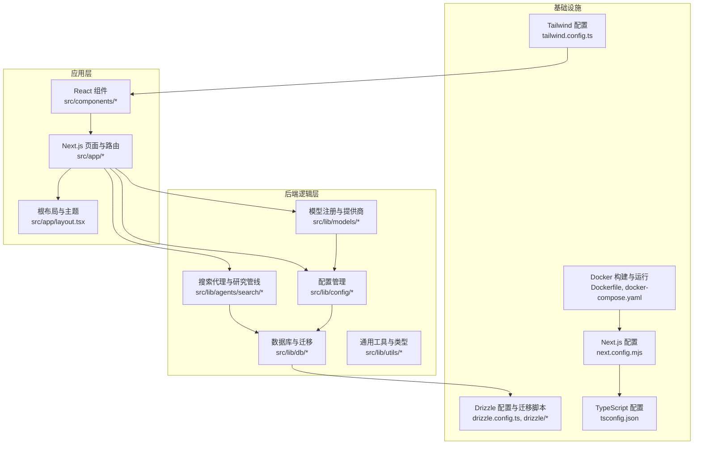
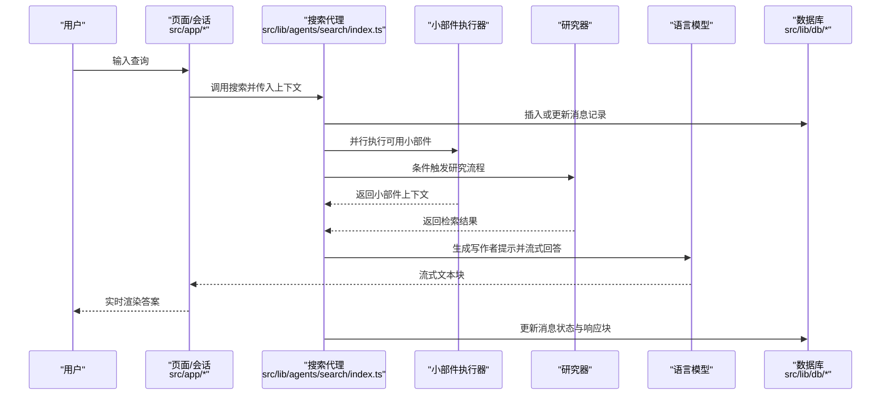
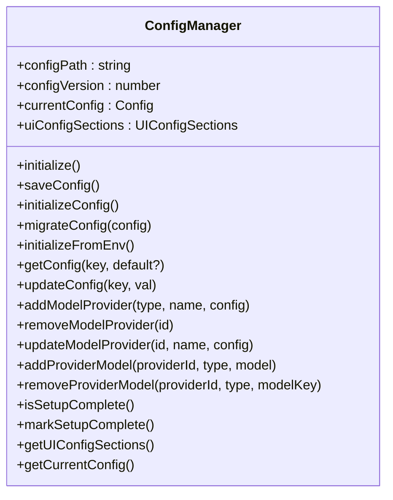
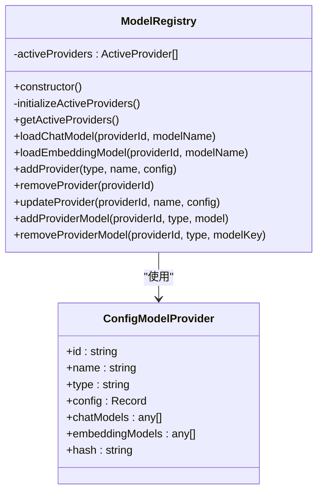
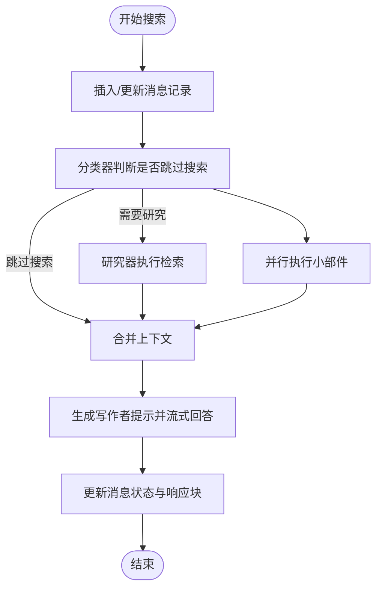
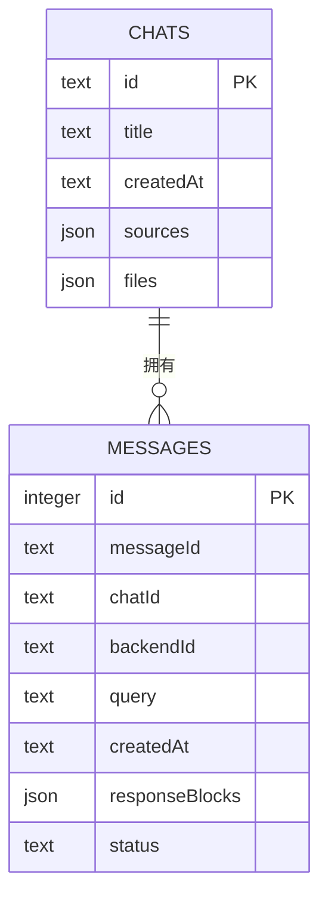
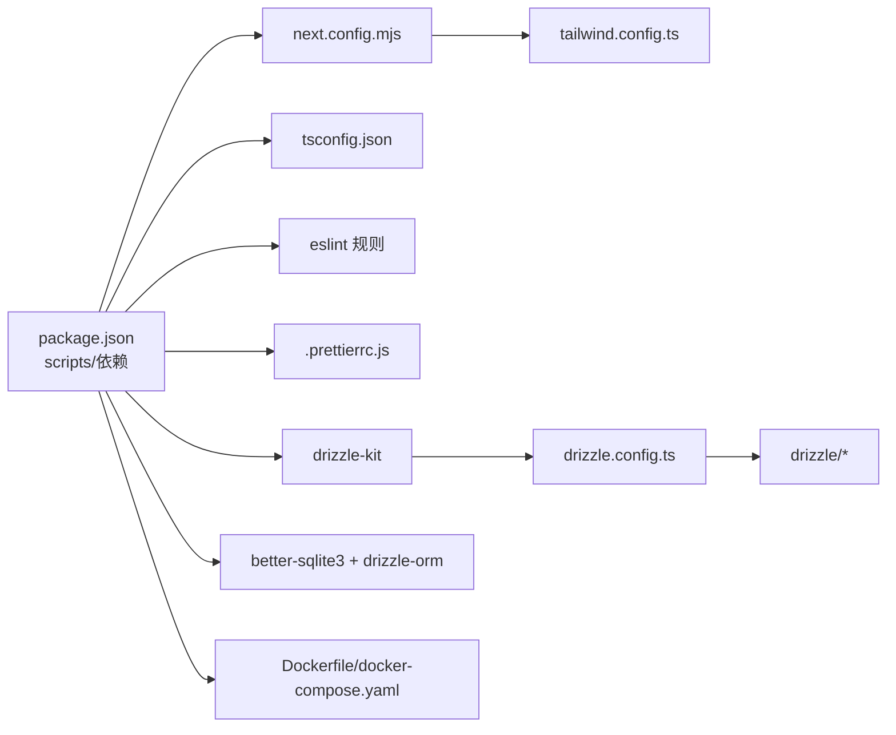

# 开发指南

<cite>
**本文引用的文件**
- [package.json](file://package.json)
- [README.md](file://README.md)
- [tsconfig.json](file://tsconfig.json)
- [next.config.mjs](file://next.config.mjs)
- [drizzle.config.ts](file://drizzle.config.ts)
- [CONTRIBUTING.md](file://CONTRIBUTING.md)
- [.eslintrc.json](file://.eslintrc.json)
- [.prettierrc.js](file://.prettierrc.js)
- [tailwind.config.ts](file://tailwind.config.ts)
- [Dockerfile](file://Dockerfile)
- [docker-compose.yaml](file://docker-compose.yaml)
- [src/lib/db/schema.ts](file://src/lib/db/schema.ts)
- [src/lib/db/migrate.ts](file://src/lib/db/migrate.ts)
- [src/lib/config/index.ts](file://src/lib/config/index.ts)
- [src/lib/models/registry.ts](file://src/lib/models/registry.ts)
- [src/lib/agents/search/index.ts](file://src/lib/agents/search/index.ts)
- [src/app/layout.tsx](file://src/app/layout.tsx)
- [src/components/Layout.tsx](file://src/components/Layout.tsx)
</cite>

## 目录
1. [简介](#简介)
2. [项目结构](#项目结构)
3. [核心组件](#核心组件)
4. [架构总览](#架构总览)
5. [详细组件分析](#详细组件分析)
6. [依赖关系分析](#依赖关系分析)
7. [性能考虑](#性能考虑)
8. [故障排查指南](#故障排查指南)
9. [结论](#结论)
10. [附录](#附录)

## 简介
本开发指南面向希望参与 Perplexica 开发与维护的新贡献者，目标是帮助你在最短时间内完成本地开发环境搭建、理解项目结构与开发规范、掌握数据库迁移与模式管理、熟悉调试与开发工具、明确贡献流程与代码审查要点，并建立测试与质量保障意识。同时提供性能优化与部署最佳实践建议，确保你能够高效地为项目做出高质量贡献。

## 项目结构
Perplexica 基于 Next.js 应用目录（App Router）组织前端页面与路由，后端逻辑集中在 src/lib 下，采用 Drizzle ORM 进行 SQLite 数据库存取，支持多模型提供商（如 OpenAI、Anthropic、Gemini、Groq、Ollama、Lemonade 等），并通过 SearxNG 提供隐私友好的网络搜索能力。项目同时提供 Docker 与非 Docker 两种安装方式，便于开发与生产部署。

图表来源
- [src/app/layout.tsx](file://src/app/layout.tsx#L27-L59)
- [src/lib/config/index.ts](file://src/lib/config/index.ts#L1-L391)
- [src/lib/models/registry.ts](file://src/lib/models/registry.ts#L1-L222)
- [src/lib/agents/search/index.ts](file://src/lib/agents/search/index.ts#L1-L187)
- [src/lib/db/migrate.ts](file://src/lib/db/migrate.ts#L1-L289)
- [drizzle.config.ts](file://drizzle.config.ts#L1-L12)
- [next.config.mjs](file://next.config.mjs#L1-L27)
- [tsconfig.json](file://tsconfig.json#L1-L34)
- [tailwind.config.ts](file://tailwind.config.ts#L1-L58)
- [Dockerfile](file://Dockerfile#L1-L75)
- [docker-compose.yaml](file://docker-compose.yaml#L1-L25)

章节来源
- [README.md](file://README.md#L77-L164)
- [CONTRIBUTING.md](file://CONTRIBUTING.md#L7-L24)

## 核心组件
- 配置管理：负责读取/写入配置文件、从环境变量注入配置、提供 UI 配置分组与默认值。
- 模型注册中心：集中管理已配置的模型提供商，动态加载聊天与嵌入模型列表，并支持增删改查。
- 搜索代理：串联“分类器 -> 小部件执行器 -> 研究器 -> 写作者提示”流水线，实时流式输出答案并持久化消息块。
- 数据库与迁移：基于 Drizzle ORM 的 SQLite 模式定义与增量迁移脚本，自动在启动时应用未执行的迁移。
- 布局与主题：根布局控制设置向导与聊天界面切换，主题提供深浅色支持与通知组件。

章节来源
- [src/lib/config/index.ts](file://src/lib/config/index.ts#L1-L391)
- [src/lib/models/registry.ts](file://src/lib/models/registry.ts#L1-L222)
- [src/lib/agents/search/index.ts](file://src/lib/agents/search/index.ts#L1-L187)
- [src/lib/db/schema.ts](file://src/lib/db/schema.ts#L1-L39)
- [src/lib/db/migrate.ts](file://src/lib/db/migrate.ts#L1-L289)
- [src/app/layout.tsx](file://src/app/layout.tsx#L27-L59)

## 架构总览
下图展示了从用户输入到最终答案输出的关键交互路径，以及数据如何在各模块间流转。

图表来源
- [src/lib/agents/search/index.ts](file://src/lib/agents/search/index.ts#L12-L187)
- [src/lib/db/schema.ts](file://src/lib/db/schema.ts#L6-L38)
- [src/lib/db/migrate.ts](file://src/lib/db/migrate.ts#L35-L289)

## 详细组件分析

### 配置管理（ConfigManager）
职责与行为
- 初始化配置文件与默认结构，支持版本迁移占位。
- 从环境变量注入模型提供商与搜索相关字段，自动校验必填项并去重。
- 提供键路径读取与更新、添加/删除/更新模型提供商、增删模型条目等操作。
- 对外暴露 UI 配置分组，用于设置界面渲染。

图表来源
- [src/lib/config/index.ts](file://src/lib/config/index.ts#L7-L391)

章节来源
- [src/lib/config/index.ts](file://src/lib/config/index.ts#L1-L391)

### 模型注册中心（ModelRegistry）
职责与行为
- 依据配置加载已启用的模型提供商实例，异步获取聊天与嵌入模型列表。
- 支持动态添加/移除/更新提供商及其模型，内部通过配置管理器持久化。
- 提供按提供商 ID 与模型名加载聊天/嵌入模型的能力。

图表来源
- [src/lib/models/registry.ts](file://src/lib/models/registry.ts#L8-L222)
- [src/lib/config/index.ts](file://src/lib/config/index.ts#L274-L302)

章节来源
- [src/lib/models/registry.ts](file://src/lib/models/registry.ts#L1-L222)

### 搜索代理（SearchAgent）
职责与行为
- 在数据库中插入或清理后续消息相关的冗余记录，标记状态为“回答中”。
- 使用分类器判断是否需要检索与研究；并行执行小部件以生成上下文。
- 若需研究，则由研究器收集检索结果；随后组合检索与小部件上下文，生成写作者提示并流式输出答案。
- 结束后更新消息状态与响应块集合。

图表来源
- [src/lib/agents/search/index.ts](file://src/lib/agents/search/index.ts#L12-L187)

章节来源
- [src/lib/agents/search/index.ts](file://src/lib/agents/search/index.ts#L1-L187)

### 数据库与迁移（Schema 与 Migration）
职责与行为
- 模式定义：messages 表存储消息块与状态，chats 表存储对话元数据与文件/来源信息。
- 迁移机制：启动时扫描 drizzle 目录下的 SQL 文件，按序执行未应用的迁移，并记录到 ran_migrations 表。
- 兼容性处理：对历史表进行结构转换与数据迁移，确保升级后数据一致性。

图表来源
- [src/lib/db/schema.ts](file://src/lib/db/schema.ts#L6-L38)

章节来源
- [src/lib/db/schema.ts](file://src/lib/db/schema.ts#L1-L39)
- [src/lib/db/migrate.ts](file://src/lib/db/migrate.ts#L1-L289)
- [drizzle.config.ts](file://drizzle.config.ts#L1-L12)

### 布局与主题（Root Layout）
职责与行为
- 控制页面字体、主题提供者、通知组件与侧边栏容器。
- 根据配置管理器判断是否进入设置向导或聊天主界面。
- 为聊天界面提供上下文 Provider。

章节来源
- [src/app/layout.tsx](file://src/app/layout.tsx#L27-L59)
- [src/components/Layout.tsx](file://src/components/Layout.tsx#L1-L10)

## 依赖关系分析
- 构建与运行：Next.js 作为框架，Webpack 启动参数用于开发模式；输出为 standalone 以便容器化部署。
- 类型系统：TypeScript 严格模式，路径别名 @/* 指向 src，目标 ES2017。
- 样式与主题：Tailwind 自定义深浅色主题与插件；Prettier 统一格式化；ESLint 基于 Next.js 规则。
- 数据库：Drizzle ORM + better-sqlite3；迁移脚本与 Drizzle CLI 配置分离。
- 容器化：Docker 多阶段构建，内置 SearxNG 服务（完整镜像）或可连接外部 SearxNG（精简镜像）。

图表来源
- [package.json](file://package.json#L6-L12)
- [next.config.mjs](file://next.config.mjs#L1-L27)
- [tsconfig.json](file://tsconfig.json#L1-L34)
- [.eslintrc.json](file://.eslintrc.json#L1-L4)
- [.prettierrc.js](file://.prettierrc.js#L1-L12)
- [tailwind.config.ts](file://tailwind.config.ts#L1-L58)
- [drizzle.config.ts](file://drizzle.config.ts#L1-L12)
- [Dockerfile](file://Dockerfile#L1-L75)
- [docker-compose.yaml](file://docker-compose.yaml#L1-L25)

章节来源
- [package.json](file://package.json#L1-L77)
- [next.config.mjs](file://next.config.mjs#L1-L27)
- [tsconfig.json](file://tsconfig.json#L1-L34)
- [.eslintrc.json](file://.eslintrc.json#L1-L4)
- [.prettierrc.js](file://.prettierrc.js#L1-L12)
- [tailwind.config.ts](file://tailwind.config.ts#L1-L58)
- [drizzle.config.ts](file://drizzle.config.ts#L1-L12)
- [Dockerfile](file://Dockerfile#L1-L75)
- [docker-compose.yaml](file://docker-compose.yaml#L1-L25)

## 性能考虑
- 构建与打包
  - 使用 Next.js standalone 输出，减少运行时依赖体积，提升容器部署效率。
  - 仅在必要时启用 Webpack 开发模式，避免不必要的编译开销。
- 数据访问
  - SQLite 适合单机与中小规模数据；若未来扩展，建议评估索引与查询计划，避免全表扫描。
  - 对频繁查询的字段（如 chatId、messageId）建立合适索引，减少 JOIN 与过滤成本。
- 模型与网络
  - 选择合适的模型与推理后端，合理设置并发与缓存策略，避免阻塞主线程。
  - 对外部 API（SearxNG、模型提供商）增加超时与重试策略，提升稳定性。
- 前端渲染
  - 利用 React Suspense 与懒加载组件，减少首屏负载。
  - Tailwind 动态类名应控制在合理范围，避免样式爆炸导致的内存与重绘压力。
- 容器与资源
  - Docker 多阶段构建减少镜像体积；根据实际部署环境调整 CPU/内存限制。
  - 对 Canvas 等原生依赖按需启用，避免不必要的二进制依赖。

## 故障排查指南
- 开发环境无法启动
  - 确认 Node.js 版本满足 Dockerfile 中使用的版本要求（当前使用 24.5.0-slim）。
  - 清理 node_modules 与缓存后重新安装依赖，确保 package-lock.json 一致。
- 数据库迁移失败
  - 检查 data/db.sqlite 是否存在且可写；确认 ran_migrations 表与 drizzle 目录权限。
  - 查看迁移日志定位具体 SQL 错误，修复后重新启动应用。
- 模型提供商不可用
  - 检查环境变量是否正确注入（如 SEARXNG_API_URL），并在设置界面确认配置。
  - 对本地 LLM（如 Ollama）检查 API 地址与端口映射，确保跨容器可达。
- Docker 运行异常
  - 完整镜像包含内置 SearxNG，无需额外配置；精简镜像需提供外部 SearxNG 地址。
  - 端口冲突时修改映射端口，确保 3000（应用）与 8080（SearxNG）开放。
- 格式化与 Lint
  - 使用提供的格式化脚本统一代码风格；遵循 ESLint 规则，避免提交前失败。

章节来源
- [Dockerfile](file://Dockerfile#L1-L75)
- [docker-compose.yaml](file://docker-compose.yaml#L1-L25)
- [src/lib/db/migrate.ts](file://src/lib/db/migrate.ts#L35-L289)
- [src/lib/config/index.ts](file://src/lib/config/index.ts#L175-L238)
- [README.md](file://README.md#L166-L213)

## 结论
通过本开发指南，你可以快速完成 Perplexica 的本地开发环境搭建，理解前后端协作、数据库迁移与模型提供商集成的核心流程，并掌握调试、格式化、Lint、Docker 部署与性能优化的方法。建议在贡献前先阅读贡献指南与架构文档，确保你的改动与整体设计保持一致。

## 附录

### 开发环境搭建流程
- 安装依赖
  - 使用包管理器安装项目依赖。
- 启动开发服务器
  - 使用提供的开发脚本启动 Next.js 开发服务器。
- 首次运行与配置
  - 访问本地地址，完成设置向导（API 密钥、模型、SearxNG 地址等）。
- 数据库初始化
  - 应用启动时自动应用未执行的迁移，确保表结构与数据一致。

章节来源
- [CONTRIBUTING.md](file://CONTRIBUTING.md#L60-L72)
- [README.md](file://README.md#L132-L164)
- [package.json](file://package.json#L6-L12)
- [src/lib/db/migrate.ts](file://src/lib/db/migrate.ts#L35-L289)

### 代码结构与开发规范
- TypeScript 配置
  - 严格模式、路径别名、目标版本与插件配置。
- 构建配置
  - Next.js standalone 输出、图片远程域名白名单、可选原生包追踪。
- 代码风格
  - Prettier 统一格式化；ESLint 基于 Next.js 规则；提交前请执行格式化脚本。
- 样式与主题
  - Tailwind 自定义深浅色主题与插件，确保一致的视觉体验。

章节来源
- [tsconfig.json](file://tsconfig.json#L1-L34)
- [next.config.mjs](file://next.config.mjs#L1-L27)
- [.prettierrc.js](file://.prettierrc.js#L1-L12)
- [.eslintrc.json](file://.eslintrc.json#L1-L4)
- [tailwind.config.ts](file://tailwind.config.ts#L1-L58)

### 数据库迁移与模式管理
- 模式定义
  - 使用 Drizzle ORM 定义 messages 与 chats 表，包含 JSON 字段与枚举状态。
- 迁移流程
  - 启动时扫描 drizzle 目录，按文件名排序执行未应用的 SQL；记录已执行迁移。
  - 历史表结构变更通过迁移脚本处理，确保数据安全过渡。

章节来源
- [src/lib/db/schema.ts](file://src/lib/db/schema.ts#L1-L39)
- [drizzle.config.ts](file://drizzle.config.ts#L1-L12)
- [src/lib/db/migrate.ts](file://src/lib/db/migrate.ts#L1-L289)

### 调试技巧与开发工具
- 日志与错误
  - 关注迁移与模型加载过程中的错误日志，定位配置与网络问题。
- 浏览器与网络
  - 使用浏览器开发者工具检查网络请求与响应，验证 SearxNG 与模型提供商连通性。
- 容器调试
  - 查看容器日志与端口映射，确认服务监听与权限设置。

章节来源
- [src/lib/db/migrate.ts](file://src/lib/db/migrate.ts#L284-L287)
- [src/lib/models/registry.ts](file://src/lib/models/registry.ts#L29-L34)

### 贡献流程与代码审查标准
- 贡献流程
  - 阅读贡献指南，确认项目结构与变更方向；安装依赖并启动开发服务器；在设置界面完成基础配置。
- 代码审查
  - 保持代码风格一致（格式化与 Lint）；确保新增功能不破坏现有行为；提供必要的注释与文档链接。
- 提交前检查
  - 本地测试通过；运行格式化脚本；避免引入大型依赖或不必要的原生包。

章节来源
- [CONTRIBUTING.md](file://CONTRIBUTING.md#L60-L83)
- [README.md](file://README.md#L258-L267)

### 测试策略与质量保证
- 单元测试
  - 对关键函数（如配置解析、模型加载、迁移逻辑）编写单元测试，覆盖边界条件与错误分支。
- 集成测试
  - 模拟搜索代理的完整流程，验证消息持久化、流式输出与上下文拼接正确性。
- 端到端测试
  - 使用真实或模拟的模型提供商与 SearxNG，验证从输入到输出的端到端路径。
- 质量门禁
  - 强制执行 Lint 与格式化；CI 中加入构建与测试步骤，确保主干稳定。

[本节为通用指导，不直接分析具体文件，故无章节来源]

### 部署最佳实践
- Docker 镜像
  - 使用多阶段构建，剥离开发依赖；standalone 输出便于运行时最小化。
- 环境变量
  - 明确必需的环境变量（如 SEARXNG_API_URL），并在容器编排中统一管理。
- 存储与持久化
  - 将 data 与 uploads 目录映射为卷，确保重启后数据不丢失。
- 可观测性
  - 在容器中开启日志采集与健康检查，监控应用与 SearxNG 的可用性。

章节来源
- [Dockerfile](file://Dockerfile#L1-L75)
- [docker-compose.yaml](file://docker-compose.yaml#L1-L25)
- [next.config.mjs](file://next.config.mjs#L5-L24)