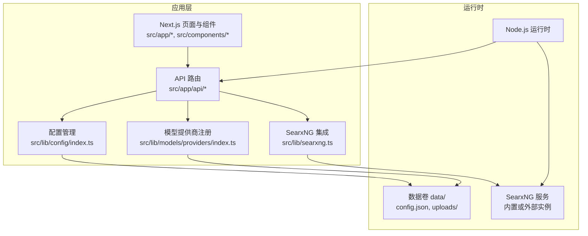
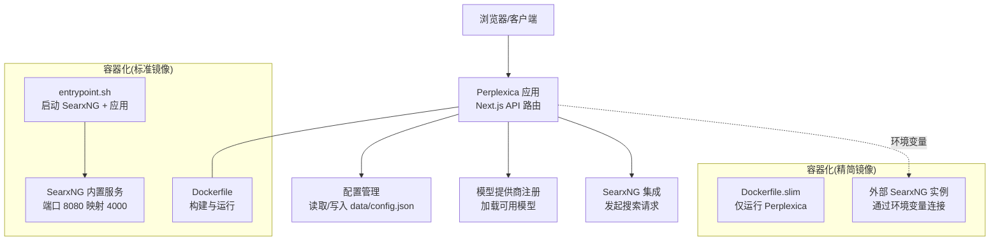
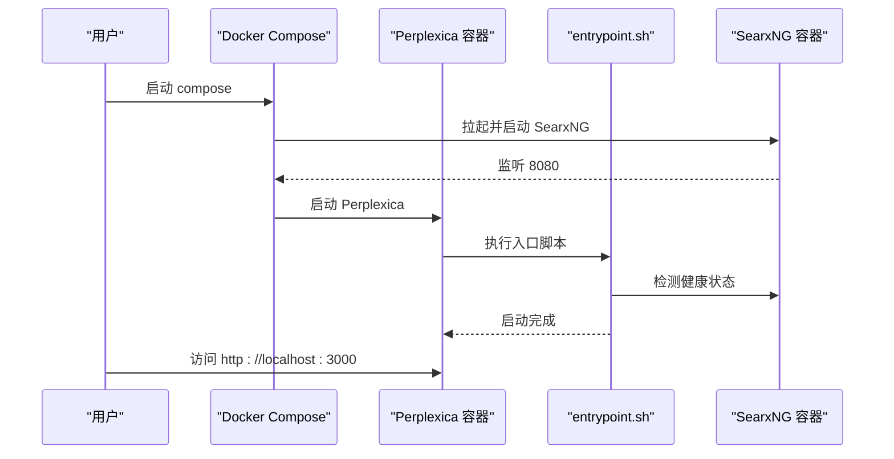
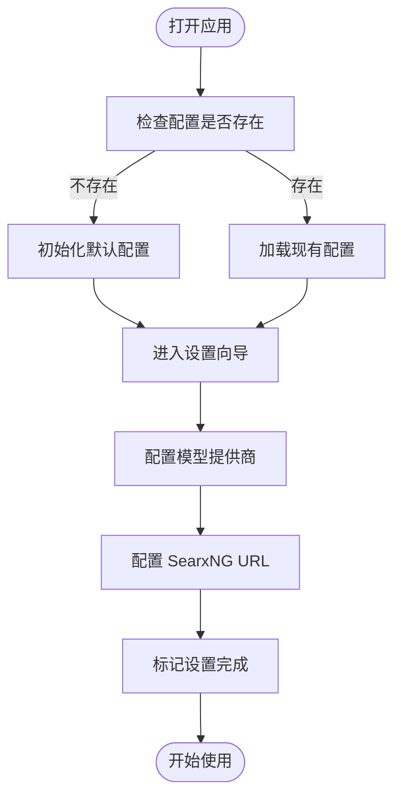
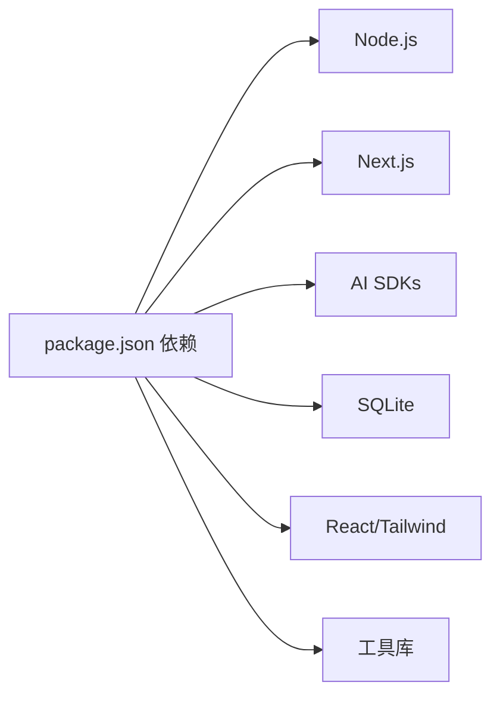

# 快速开始

<cite>
**本文引用的文件**
- [README.md](file://README.md)
- [package.json](file://package.json)
- [.env.example](file://.env.example)
- [Dockerfile](file://Dockerfile)
- [Dockerfile.slim](file://Dockerfile.slim)
- [docker-compose.yaml](file://docker-compose.yaml)
- [entrypoint.sh](file://entrypoint.sh)
- [searxng-settings.yml](file://searxng-settings.yml)
- [data/config.json](file://data/config.json)
- [src/lib/config/index.ts](file://src/lib/config/index.ts)
- [src/app/api/config/route.ts](file://src/app/api/config/route.ts)
- [src/app/api/config/setup-complete/route.ts](file://src/app/api/config/setup-complete/route.ts)
- [src/components/Setup/SetupWizard.tsx](file://src/components/Setup/SetupWizard.tsx)
- [src/lib/models/providers/index.ts](file://src/lib/models/providers/index.ts)
- [src/lib/searxng.ts](file://src/lib/searxng.ts)
- [SEARXNG-SETUP.md](file://SEARXNG-SETUP.md)
</cite>

## 目录
1. [简介](#简介)
2. [项目结构](#项目结构)
3. [核心组件](#核心组件)
4. [架构总览](#架构总览)
5. [详细组件分析](#详细组件分析)
6. [依赖关系分析](#依赖关系分析)
7. [性能注意事项](#性能注意事项)
8. [故障排除指南](#故障排除指南)
9. [结论](#结论)
10. [附录](#附录)

## 简介
本指南面向不同技术背景的用户，提供 Perplexica 的“从零到一”安装与配置流程，覆盖 Docker 与非 Docker 两种部署方式；详细说明环境准备、依赖安装、容器配置、环境变量与 SearxNG 集成设置；并给出常见安装问题的排错建议与首次使用的完整设置步骤，帮助你快速体验核心功能。

## 项目结构
Perplexica 是基于 Next.js 的应用，采用前后端一体化的 API 路由设计，内置 SearxNG 搜索引擎（在标准镜像中），并通过环境变量与配置文件实现灵活的运行时定制。关键目录与文件如下：
- 应用入口与页面：src/app/* 与 src/components/*
- 配置与注册中心：src/lib/config/* 与 src/lib/models/providers/*
- 搜索集成：src/lib/searxng.ts
- 容器化：Dockerfile、Dockerfile.slim、docker-compose.yaml、entrypoint.sh
- 示例配置：.env.example、data/config.json、searxng-settings.yml
- 包管理与脚本：package.json

图表来源
- [src/app/api/config/route.ts](file://src/app/api/config/route.ts#L1-L111)
- [src/lib/config/index.ts](file://src/lib/config/index.ts#L1-L391)
- [src/lib/models/providers/index.ts](file://src/lib/models/providers/index.ts#L1-L36)
- [src/lib/searxng.ts](file://src/lib/searxng.ts#L1-L54)
- [Dockerfile](file://Dockerfile#L1-L75)

章节来源
- [README.md](file://README.md#L77-L164)
- [package.json](file://package.json#L1-L77)

## 核心组件
- 配置管理器：负责读取/写入 data/config.json，支持从环境变量初始化模型提供商与搜索配置，并提供运行时更新能力。
- 模型提供商注册：集中管理 OpenAI、Anthropic、Gemini、Groq、Lemonade、Ollama、LMStudio、Transformers 等。
- SearxNG 集成：封装对 SearxNG 的搜索调用，支持分类、引擎、语言等参数传递。
- 设置向导：首次运行时引导用户完成配置与设置完成标记。

章节来源
- [src/lib/config/index.ts](file://src/lib/config/index.ts#L1-L391)
- [src/lib/models/providers/index.ts](file://src/lib/models/providers/index.ts#L1-L36)
- [src/lib/searxng.ts](file://src/lib/searxng.ts#L1-L54)
- [src/components/Setup/SetupWizard.tsx](file://src/components/Setup/SetupWizard.tsx#L1-L127)

## 架构总览
下图展示 Perplexica 在 Docker 与非 Docker 场景下的典型部署形态，以及与 SearxNG 的交互路径。

图表来源
- [Dockerfile](file://Dockerfile#L1-L75)
- [Dockerfile.slim](file://Dockerfile.slim#L1-L36)
- [entrypoint.sh](file://entrypoint.sh#L1-L32)
- [docker-compose.yaml](file://docker-compose.yaml#L1-L25)
- [src/lib/searxng.ts](file://src/lib/searxng.ts#L1-L54)

## 详细组件分析

### Docker 安装与配置
- 标准镜像（内置 SearxNG）
  - 使用官方镜像或本地构建后运行，容器暴露 3000 端口，挂载数据卷以持久化配置与上传文件。
  - 容器内 entrypoint 会先启动 SearxNG，再启动 Perplexica 应用。
  - 可通过环境变量覆盖 SearxNG URL（默认指向容器内 8080 端口）。
- 精简镜像（外置 SearxNG）
  - 仅运行 Perplexica，需通过环境变量指定外部 SearxNG API 地址。
  - 外部 SearxNG 需开启 JSON 输出格式与 Wolfram Alpha 引擎。
- docker-compose 编排
  - 同时编排 Perplexica 与 SearxNG，Perplexica 依赖 SearxNG 容器启动。

图表来源
- [docker-compose.yaml](file://docker-compose.yaml#L1-L25)
- [Dockerfile](file://Dockerfile#L1-L75)
- [entrypoint.sh](file://entrypoint.sh#L1-L32)

章节来源
- [README.md](file://README.md#L81-L129)
- [docker-compose.yaml](file://docker-compose.yaml#L1-L25)
- [Dockerfile](file://Dockerfile#L1-L75)
- [Dockerfile.slim](file://Dockerfile.slim#L1-L36)
- [entrypoint.sh](file://entrypoint.sh#L1-L32)

### 非 Docker 安装与运行
- 先行准备：确保已安装并运行 SearxNG，且启用 JSON 输出格式与 Wolfram Alpha 引擎。
- 获取源码、安装依赖、构建与启动：
  - 安装依赖
  - 构建应用
  - 启动应用
- 首次访问 http://localhost:3000，进入设置向导完成配置。

章节来源
- [README.md](file://README.md#L132-L164)

### 环境变量与配置文件
- 环境变量示例与用途
  - 管理员鉴权：ADMIN_PASSWORD（强烈建议高强度随机值）
  - AI 提供商密钥：OPENAI_API_KEY、ANTHROPIC_API_KEY、GEMINI_API_KEY、DEEPSEEK_API_KEY、GROQ_API_KEY、AIML_API_KEY、LEMONADE_API_KEY
  - 搜索引擎：SEARXNG_API_URL（默认指向内置 SearxNG）
  - 数据目录：DATA_DIR（可选，默认使用工作目录）
- 配置文件位置与结构
  - data/config.json：保存模型提供商、搜索设置与应用偏好等
  - searxng-settings.yml：SearxNG 配置（JSON 格式、Wolfram Alpha、限流关闭等）

章节来源
- [.env.example](file://.env.example#L1-L59)
- [data/config.json](file://data/config.json#L1-L41)
- [searxng-settings.yml](file://searxng-settings.yml#L1-L16)
- [src/lib/config/index.ts](file://src/lib/config/index.ts#L1-L391)

### 首次使用完整设置流程
- 访问 http://localhost:3000，进入设置向导
- 设置向导会引导你逐步完成：
  - 选择并配置 AI 提供商（如 OpenAI、Anthropic、Gemini、Groq、Lemonade、Ollama、LMStudio、Transformers）
  - 配置 SearxNG URL（若使用内置 SearxNG 则默认即可）
  - 完成设置后标记“设置完成”，后续无需重复配置敏感项

图表来源
- [src/components/Setup/SetupWizard.tsx](file://src/components/Setup/SetupWizard.tsx#L1-L127)
- [src/app/api/config/setup-complete/route.ts](file://src/app/api/config/setup-complete/route.ts#L1-L23)
- [src/lib/config/index.ts](file://src/lib/config/index.ts#L1-L391)

章节来源
- [src/components/Setup/SetupWizard.tsx](file://src/components/Setup/SetupWizard.tsx#L1-L127)
- [src/app/api/config/setup-complete/route.ts](file://src/app/api/config/setup-complete/route.ts#L1-L23)

## 依赖关系分析
- 运行时依赖
  - Node.js 与 Next.js
  - SQLite（用于本地存储）
  - Python3 与 uWSGI（SearxNG 构建与运行）
- 应用依赖
  - 各大 AI 提供商 SDK（OpenAI、Anthropic、Gemini、Groq 等）
  - SearxNG 客户端与搜索接口
  - React 生态与 UI 组件库

图表来源
- [package.json](file://package.json#L1-L77)

章节来源
- [package.json](file://package.json#L1-L77)

## 性能注意事项
- 使用 Docker 部署可减少环境差异带来的性能波动，便于资源隔离与扩展。
- SearxNG 的 JSON 输出与 Wolfram Alpha 引擎会增加响应时间，建议在生产环境中合理配置并发与缓存策略。
- 本地模型（如 Ollama）的推理速度取决于硬件与模型大小，建议在开发阶段优先使用云端模型进行验证。

## 故障排除指南
- 本地 OpenAI 兼容服务器未配置或配置错误
  - 确保服务监听在可被容器访问的地址（非 127.0.0.1），并填写正确的模型名称与 API Key。
- Ollama 连接错误
  - Windows/Mac：使用 host.docker.internal:11434
  - Linux：使用宿主机私网 IP:11434，并确保 Ollama 以 0.0.0.0:11434 启动，防火墙放行端口。
- Lemonade 连接错误
  - 确认 Lemonade 服务运行在 0.0.0.0:8000，允许来自容器网络的连接，端口未被防火墙阻断。
- SearxNG 无法访问或返回异常
  - 检查 SearxNG 是否启用 JSON 格式与 Wolfram Alpha 引擎
  - 使用 curl 或浏览器访问 SearxNG API 验证连通性
  - 查看容器日志定位问题

章节来源
- [README.md](file://README.md#L166-L213)
- [SEARXNG-SETUP.md](file://SEARXNG-SETUP.md#L1-L91)

## 结论
通过本指南，你可以快速完成 Perplexica 的安装与配置，无论选择 Docker 还是非 Docker 方式，均能顺利接入 SearxNG 并配置主流 AI 提供商。遇到问题时，可依据故障排除章节逐项排查。完成首次设置后，即可体验基于隐私保护的本地/云端混合 AI 搜索与智能问答能力。

## 附录
- 一键部署链接（第三方平台）
  - 支持 Sealos、RepoCloud、ClawCloud、Hostinger 等平台的一键部署入口
- API 文档
  - 可参考文档目录中的搜索 API 文档，了解如何集成 Perplexica 的搜索能力

章节来源
- [README.md](file://README.md#L233-L228)