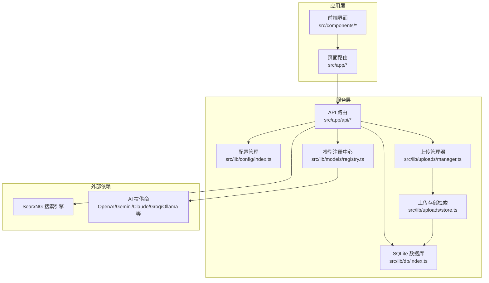
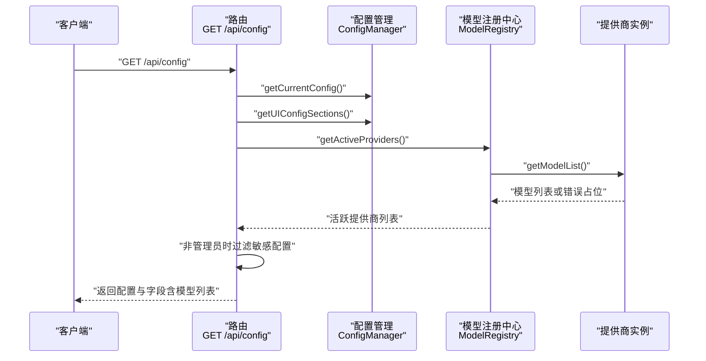
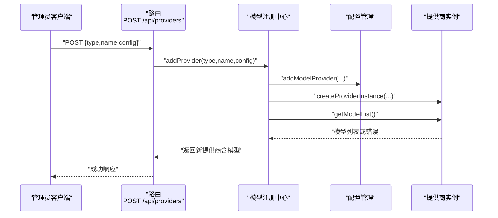
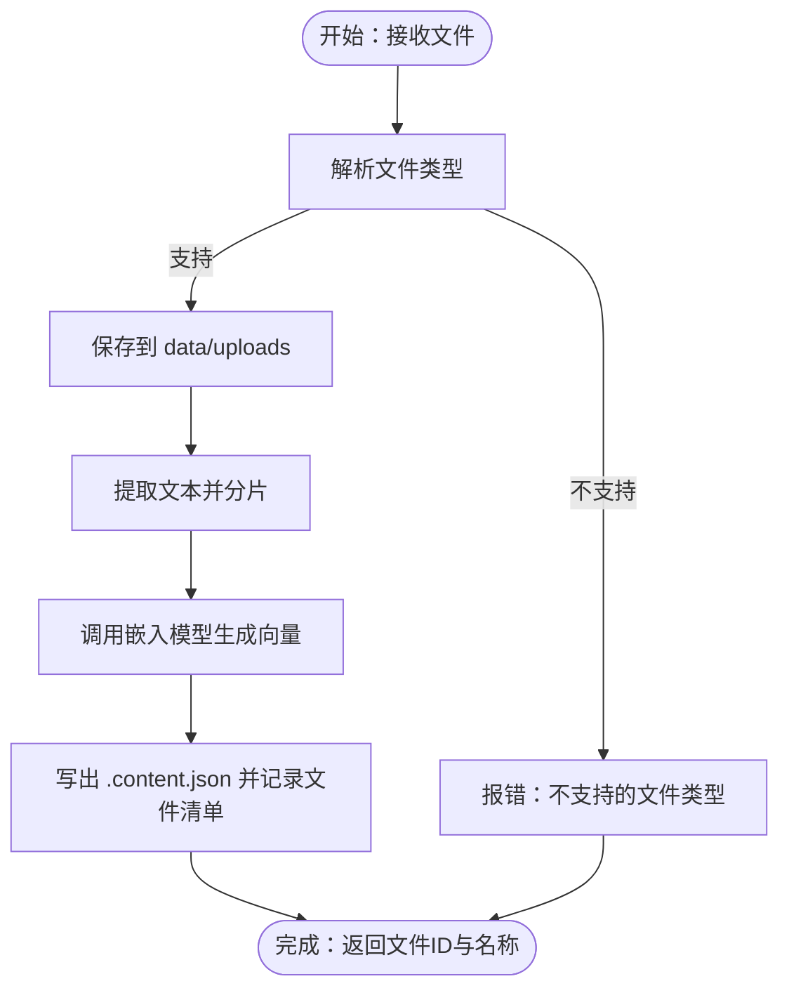
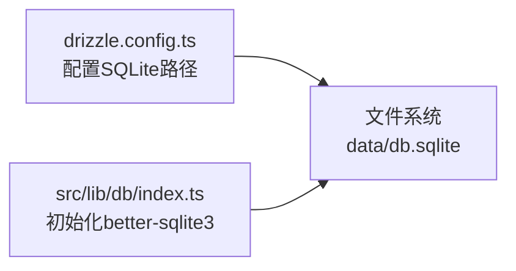
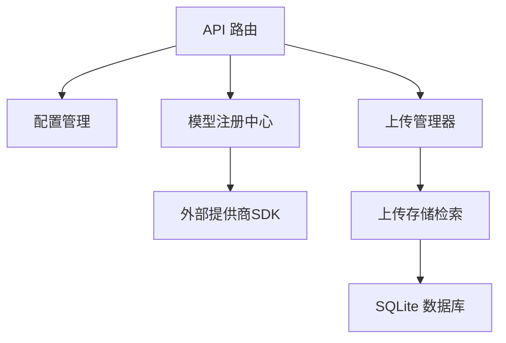

# 故障排除

<cite>
**本文引用的文件**
- [README.md](file://README.md)
- [package.json](file://package.json)
- [data/config.json](file://data/config.json)
- [.env.example](file://.env.example)
- [drizzle.config.ts](file://drizzle.config.ts)
- [src/lib/db/index.ts](file://src/lib/db/index.ts)
- [src/lib/config/index.ts](file://src/lib/config/index.ts)
- [src/app/api/config/route.ts](file://src/app/api/config/route.ts)
- [src/app/api/providers/route.ts](file://src/app/api/providers/route.ts)
- [src/lib/models/registry.ts](file://src/lib/models/registry.ts)
- [src/lib/models/base/provider.ts](file://src/lib/models/base/provider.ts)
- [src/lib/middleware/adminAuth.ts](file://src/lib/middleware/adminAuth.ts)
- [src/app/api/uploads/route.ts](file://src/app/api/uploads/route.ts)
- [src/lib/uploads/manager.ts](file://src/lib/uploads/manager.ts)
- [src/lib/uploads/store.ts](file://src/lib/uploads/store.ts)
</cite>

## 目录
1. [简介](#简介)
2. [项目结构](#项目结构)
3. [核心组件](#核心组件)
4. [架构总览](#架构总览)
5. [详细组件分析](#详细组件分析)
6. [依赖关系分析](#依赖关系分析)
7. [性能考虑](#性能考虑)
8. [故障排除指南](#故障排除指南)
9. [结论](#结论)
10. [附录](#附录)

## 简介
本指南面向 Perplexica 用户与运维人员，聚焦于安装、配置、连接与运行时常见问题的系统化诊断与修复。内容覆盖：
- 安装与部署问题
- 配置错误与敏感信息泄露防护
- AI 提供商连接失败
- 数据库与文件上传问题
- 日志与调试技巧
- 性能诊断与优化
- 如何收集与报告 Bug
- 社区支持与求助渠道

## 项目结构
Perplexica 是基于 Next.js 的应用，采用前后端同构架构，后端 API 路由集中于 src/app/api 下，配置与模型注册中心位于 src/lib，数据库使用 SQLite（better-sqlite3），迁移工具为 drizzle-kit。

图表来源
- [src/app/api/config/route.ts](file://src/app/api/config/route.ts#L1-L111)
- [src/app/api/providers/route.ts](file://src/app/api/providers/route.ts#L1-L78)
- [src/lib/config/index.ts](file://src/lib/config/index.ts#L1-L391)
- [src/lib/models/registry.ts](file://src/lib/models/registry.ts#L1-L222)
- [src/lib/uploads/manager.ts](file://src/lib/uploads/manager.ts#L1-L218)
- [src/lib/uploads/store.ts](file://src/lib/uploads/store.ts#L1-L122)
- [src/lib/db/index.ts](file://src/lib/db/index.ts#L1-L13)

章节来源
- [README.md](file://README.md#L77-L164)
- [package.json](file://package.json#L1-L77)

## 核心组件
- 配置管理：负责读取/写入 data/config.json，合并环境变量，暴露 UI 配置字段，并在非管理员视角下隐藏敏感配置。
- 模型注册中心：根据已配置的提供商类型实例化具体提供商，拉取可用模型列表，加载聊天/嵌入模型。
- 上传模块：接收文件表单，解析文本并调用嵌入模型生成向量分片，持久化内容与索引。
- 数据库：通过 better-sqlite3 访问 SQLite，drizzle 配置指向 data/db.sqlite。
- 管理员鉴权：统一校验 Bearer Token，保护敏感配置与提供商增删改操作。

章节来源
- [src/lib/config/index.ts](file://src/lib/config/index.ts#L1-L391)
- [src/lib/models/registry.ts](file://src/lib/models/registry.ts#L1-L222)
- [src/app/api/config/route.ts](file://src/app/api/config/route.ts#L1-L111)
- [src/app/api/providers/route.ts](file://src/app/api/providers/route.ts#L1-L78)
- [src/lib/uploads/manager.ts](file://src/lib/uploads/manager.ts#L1-L218)
- [src/lib/db/index.ts](file://src/lib/db/index.ts#L1-L13)

## 架构总览
以下序列图展示“获取配置”的典型流程，体现管理员鉴权与敏感信息过滤机制。

图表来源
- [src/app/api/config/route.ts](file://src/app/api/config/route.ts#L12-L64)
- [src/lib/config/index.ts](file://src/lib/config/index.ts#L379-L385)
- [src/lib/models/registry.ts](file://src/lib/models/registry.ts#L37-L72)

章节来源
- [src/app/api/config/route.ts](file://src/app/api/config/route.ts#L1-L111)
- [src/lib/config/index.ts](file://src/lib/config/index.ts#L1-L391)
- [src/lib/models/registry.ts](file://src/lib/models/registry.ts#L1-L222)

## 详细组件分析

### 组件一：配置与提供商 API
- GET /api/config：返回完整配置与 UI 字段；若非管理员请求，清空敏感配置值（API Key 等），仅保留结构供前端展示。
- POST /api/config：管理员鉴权后更新指定键值。
- GET /api/providers：返回当前可用提供商列表，过滤掉因错误而标记为 error 的模型。
- POST /api/providers：管理员鉴权后新增提供商，动态实例化并尝试获取模型列表，异常时以 error 占位。

图表来源
- [src/app/api/providers/route.ts](file://src/app/api/providers/route.ts#L36-L77)
- [src/lib/models/registry.ts](file://src/lib/models/registry.ts#L94-L141)
- [src/lib/config/index.ts](file://src/lib/config/index.ts#L274-L289)

章节来源
- [src/app/api/config/route.ts](file://src/app/api/config/route.ts#L1-L111)
- [src/app/api/providers/route.ts](file://src/app/api/providers/route.ts#L1-L78)
- [src/lib/models/registry.ts](file://src/lib/models/registry.ts#L1-L222)
- [src/lib/middleware/adminAuth.ts](file://src/lib/middleware/adminAuth.ts#L1-L55)

### 组件二：上传与嵌入检索
- POST /api/uploads：接收文件与嵌入模型选择，调用 UploadManager 处理文件，生成分片与向量并记录文件清单。
- UploadManager：按 MIME 类型解析 PDF/Word/纯文本，切分文本，调用嵌入模型生成向量，写出 .content.json 并记录文件元数据。
- UploadStore：从已记录文件读取分片与向量，基于余弦相似度聚合检索，返回 TopK 结果。

图表来源
- [src/app/api/uploads/route.ts](file://src/app/api/uploads/route.ts#L5-L40)
- [src/lib/uploads/manager.ts](file://src/lib/uploads/manager.ts#L177-L215)

章节来源
- [src/app/api/uploads/route.ts](file://src/app/api/uploads/route.ts#L1-L41)
- [src/lib/uploads/manager.ts](file://src/lib/uploads/manager.ts#L1-L218)
- [src/lib/uploads/store.ts](file://src/lib/uploads/store.ts#L1-L122)

### 组件三：数据库与迁移
- drizzle 配置：SQLite 路径指向 data/db.sqlite，schema 来自 src/lib/db/schema.ts。
- 运行时连接：通过 better-sqlite3 打开 data/db.sqlite，drizzle 初始化映射。

图表来源
- [drizzle.config.ts](file://drizzle.config.ts#L1-L12)
- [src/lib/db/index.ts](file://src/lib/db/index.ts#L1-L13)

章节来源
- [drizzle.config.ts](file://drizzle.config.ts#L1-L12)
- [src/lib/db/index.ts](file://src/lib/db/index.ts#L1-L13)

## 依赖关系分析
- 外部依赖：SearxNG（搜索）、各类 AI 提供商 SDK（OpenAI、Gemini、Anthropic、Groq、Ollama 等）。
- 内部耦合：API 路由依赖配置管理与模型注册中心；上传模块依赖注册中心加载嵌入模型；上传存储依赖上传管理器读取分片。

图表来源
- [src/app/api/config/route.ts](file://src/app/api/config/route.ts#L1-L111)
- [src/app/api/providers/route.ts](file://src/app/api/providers/route.ts#L1-L78)
- [src/lib/models/registry.ts](file://src/lib/models/registry.ts#L1-L222)
- [src/lib/uploads/manager.ts](file://src/lib/uploads/manager.ts#L1-L218)
- [src/lib/uploads/store.ts](file://src/lib/uploads/store.ts#L1-L122)
- [src/lib/db/index.ts](file://src/lib/db/index.ts#L1-L13)

章节来源
- [package.json](file://package.json#L13-L53)

## 性能考虑
- 模型列表获取：并发拉取各提供商模型列表，注意网络抖动与超时控制。
- 上传处理：PDF/Word 解析与分片向量化可能耗时，建议限制单次上传文件数量与大小，合理设置分片长度与重叠。
- 检索效率：相似度计算复杂度与分片数量成正比，可调整 topK 与分片策略以平衡召回与速度。
- 数据库存取：SQLite 适合小中型负载，若并发高或数据量大，建议评估迁移方案或引入缓存层。

## 故障排除指南

### 一、安装与部署问题
- Docker 首选：推荐使用官方镜像，避免环境差异导致的依赖问题。
- 端口与卷：确认容器端口映射与数据卷挂载正确，容器内默认监听 3000 端口。
- SearxNG 集成：若使用 slim 镜像，请确保 SEARXNG_API_URL 正确且启用 JSON 输出与 Wolfram Alpha。
- 非 Docker：需手动安装依赖、构建并启动，完成后在浏览器访问本地地址完成首次配置。

章节来源
- [README.md](file://README.md#L77-L164)

### 二、配置错误与敏感信息泄露
- 环境变量：请参考示例文件设置 ADMIN_PASSWORD、各提供商密钥、SEARXNG_API_URL、DATA_DIR 等。
- 配置文件：data/config.json 由配置管理器维护，首次运行会自动创建默认配置；若解析失败会回退默认配置。
- 敏感信息过滤：非管理员请求时，配置接口会清空敏感字段（如 API Key），仅保留结构供前端展示。

章节来源
- [.env.example](file://.env.example#L1-L59)
- [src/lib/config/index.ts](file://src/lib/config/index.ts#L135-L168)
- [src/app/api/config/route.ts](file://src/app/api/config/route.ts#L33-L50)

### 三、AI 提供商连接问题
- 常见症状：提供商模型列表为空或显示 error 占位。
- 排查步骤：
  1) 确认提供商类型与配置项完整（API Key、Base URL、模型名等）。
  2) 若为本地/私有服务器（如 Ollama、Lemonade），确保监听地址为 0.0.0.0 或正确的宿主机地址，端口未被防火墙阻断。
  3) Linux 用户需确保 Ollama 服务监听在 0.0.0.0:11434。
  4) 在“提供商”页面新增或更新提供商后，观察模型列表是否正常刷新。
- 错误信息含义：
  - “无效提供商类型”：配置 type 不在受支持列表。
  - “无效提供商 id”：内部注册表找不到对应提供商。
  - “获取模型列表失败”：网络/鉴权/参数错误导致拉取失败，注册表会以 error 占位提示。

章节来源
- [README.md](file://README.md#L166-L213)
- [src/lib/models/registry.ts](file://src/lib/models/registry.ts#L17-L35)
- [src/lib/models/registry.ts](file://src/lib/models/registry.ts#L44-L60)
- [src/app/api/providers/route.ts](file://src/app/api/providers/route.ts#L36-L77)

### 四、数据库连接问题
- 症状：应用无法启动或出现数据库相关错误。
- 排查要点：
  1) 确认 DATA_DIR 指向正确目录，data/db.sqlite 存在且可写。
  2) drizzle 配置的 SQLite 路径与实际一致。
  3) 若更换数据目录，请同步更新 DATA_DIR 并重启服务。
- 常见原因：权限不足、路径错误、磁盘空间不足。

章节来源
- [drizzle.config.ts](file://drizzle.config.ts#L8-L11)
- [src/lib/db/index.ts](file://src/lib/db/index.ts#L6-L10)

### 五、文件上传问题
- 症状：上传后无响应、报错“缺少嵌入模型或提供商”、“不支持的文件类型”、“向量与文本分片长度不匹配”。
- 排查步骤：
  1) 确保选择了有效的嵌入模型与提供商。
  2) 支持的 MIME 类型：PDF、DOCX、纯文本；其他类型会被拒绝。
  3) 检查上传目录 data/uploads 是否存在且可写，上传记录文件 uploaded_files.json 是否创建。
  4) 若解析 PDF/Word 失败，检查解析依赖与内存是否充足。
  5) 分片与向量长度不匹配通常表示嵌入模型返回异常，需更换模型或检查提供商连通性。
- 相关日志：上传路由与管理器均包含错误捕获与日志输出。

章节来源
- [src/app/api/uploads/route.ts](file://src/app/api/uploads/route.ts#L13-L18)
- [src/lib/uploads/manager.ts](file://src/lib/uploads/manager.ts#L180-L183)
- [src/lib/uploads/manager.ts](file://src/lib/uploads/manager.ts#L97-L99)
- [src/lib/uploads/manager.ts](file://src/lib/uploads/manager.ts#L128-L130)
- [src/lib/uploads/manager.ts](file://src/lib/uploads/manager.ts#L172-L174)

### 六、搜索与 SearxNG 集成问题
- 症状：搜索结果为空或报错。
- 排查要点：
  1) 确认 SEARXNG_API_URL 正确，且服务启用了 JSON 输出与 Wolfram Alpha。
  2) 若使用 slim 镜像，请确保容器网络可达 SearxNG 实例。
- 配置来源：配置管理器会从环境变量注入搜索 URL。

章节来源
- [README.md](file://README.md#L93-L106)
- [src/lib/config/index.ts](file://src/lib/config/index.ts#L229-L235)

### 七、管理员鉴权与安全
- 症状：更新配置或提供商时报 403，提示需要管理员身份。
- 排查要点：
  1) 请求头必须携带 Bearer Token。
  2) Token 必须通过后台验证。
- 配置入口：在设置界面完成管理员登录后，再进行敏感操作。

章节来源
- [src/lib/middleware/adminAuth.ts](file://src/lib/middleware/adminAuth.ts#L13-L40)
- [src/app/api/config/route.ts](file://src/app/api/config/route.ts#L66-L110)
- [src/app/api/providers/route.ts](file://src/app/api/providers/route.ts#L36-L77)

### 八、日志分析与调试技巧
- 后端日志：关注 API 路由与注册中心的错误输出，例如“初始化提供商失败”“获取模型列表失败”“上传文件错误”等。
- 前端调试：在设置界面切换管理员模式，观察敏感字段是否被过滤；在提供商页面查看 error 占位与错误消息。
- 关键路径：
  - 配置接口：GET/POST /api/config
  - 提供商接口：GET/POST /api/providers
  - 上传接口：POST /api/uploads
  - 注册中心：模型列表拉取与实例化
  - 上传管理器：文件解析、分片、向量化与记录

章节来源
- [src/app/api/config/route.ts](file://src/app/api/config/route.ts#L57-L63)
- [src/lib/models/registry.ts](file://src/lib/models/registry.ts#L29-L34)
- [src/lib/models/registry.ts](file://src/lib/models/registry.ts#L46-L60)
- [src/app/api/uploads/route.ts](file://src/app/api/uploads/route.ts#L33-L39)
- [src/lib/uploads/manager.ts](file://src/lib/uploads/manager.ts#L83-L86)

### 九、性能问题诊断与优化
- 模型列表拉取：并发过多可能导致超时，建议减少同时激活的提供商数量或增加超时阈值。
- 上传处理：限制单次上传文件数与大小，调整分片长度与重叠，降低向量化成本。
- 检索性能：topK 过大将显著增加计算量，建议结合业务需求调参。
- 数据库：SQLite 适合开发/小规模使用，生产建议评估扩展方案。

章节来源
- [src/lib/models/registry.ts](file://src/lib/models/registry.ts#L40-L72)
- [src/lib/uploads/store.ts](file://src/lib/uploads/store.ts#L54-L98)

### 十、如何收集与报告 Bug
- 收集信息：
  - 应用版本与部署方式（Docker/源码）
  - .env 与 data/config.json 关键配置片段（请脱敏敏感信息）
  - 重现步骤与期望/实际结果
  - 相关后端日志片段（含时间戳）
  - 操作系统与硬件环境
- 报告渠道：
  - GitHub Issues：遵循项目贡献规范
  - Discord 社区：获取更及时帮助与讨论

章节来源
- [README.md](file://README.md#L258-L267)

### 十一、社区支持与获取帮助
- GitHub Issues：反馈问题与建议
- Discord：交流经验、寻求帮助
- 官方文档与安装说明：参考 README 与安装文档

章节来源
- [README.md](file://README.md#L262-L267)

## 结论
本指南提供了从安装到日常运维的全链路故障排除路径。建议优先核对环境变量与配置文件、确认提供商连通性与模型列表、检查数据库与上传目录权限，并结合日志定位问题根因。对于性能瓶颈，应从并发、分片与检索参数三方面入手优化。遇到疑难问题，欢迎通过社区渠道寻求帮助。

## 附录

### A. 常见错误与解决对照
- “未配置任何聊天模型提供商”：检查提供商类型与配置项，确保 API Key 与模型名正确。
- “Ollama 连接错误”：确认监听地址为 0.0.0.0，Linux 需开放端口；Windows/Mac 使用 host.docker.internal。
- “Lemonade 连接错误”：确认服务运行、监听 0.0.0.0，端口未被阻断。
- “数据库无法打开”：检查 DATA_DIR 与 data/db.sqlite 权限与路径。
- “上传失败/不支持的文件类型”：仅支持 PDF/DOCX/纯文本；检查上传目录权限与解析依赖。
- “403 需要管理员身份”：确认携带有效 Bearer Token。

章节来源
- [README.md](file://README.md#L166-L213)
- [src/lib/db/index.ts](file://src/lib/db/index.ts#L6-L10)
- [src/lib/uploads/manager.ts](file://src/lib/uploads/manager.ts#L180-L183)
- [src/lib/middleware/adminAuth.ts](file://src/lib/middleware/adminAuth.ts#L13-L40)