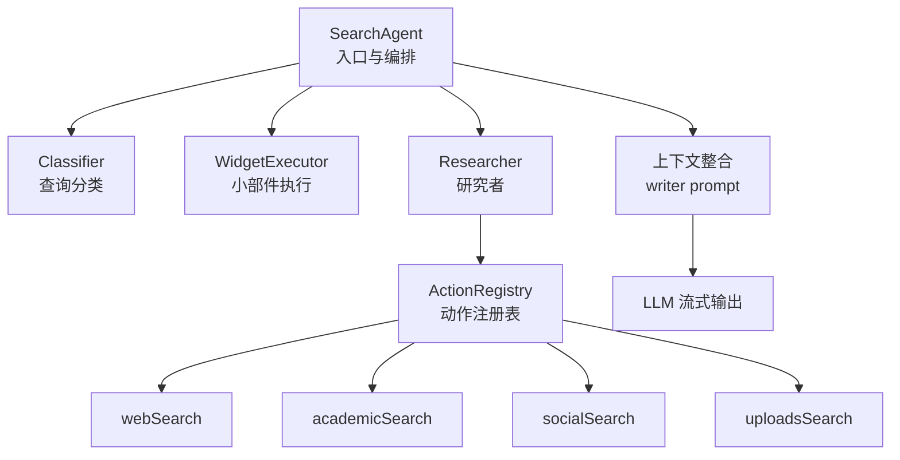
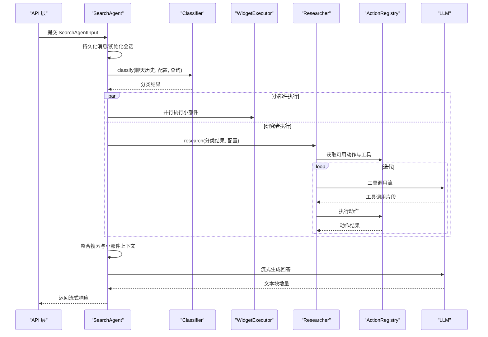
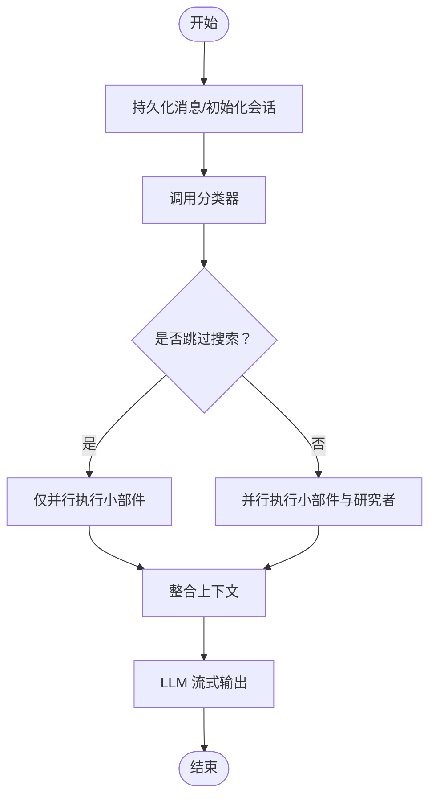
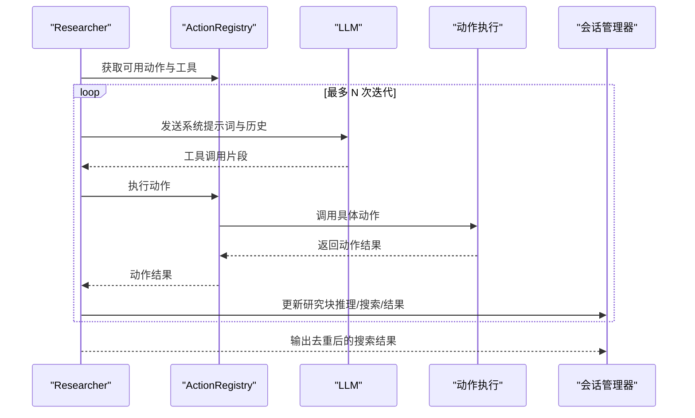
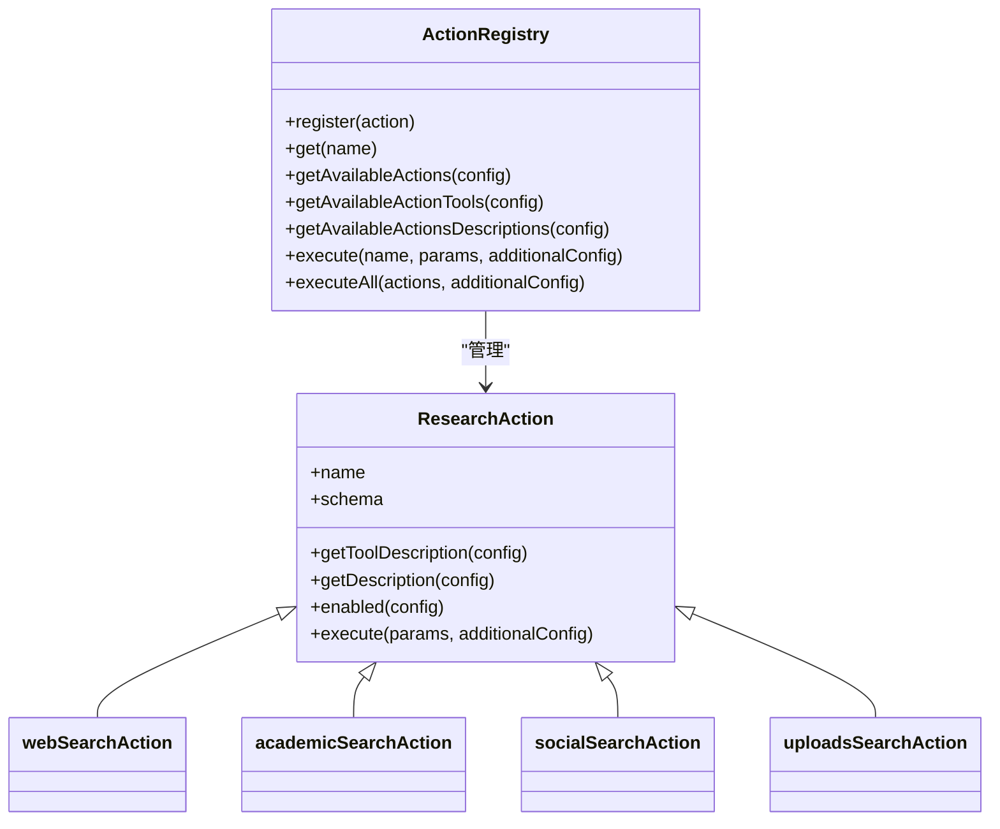
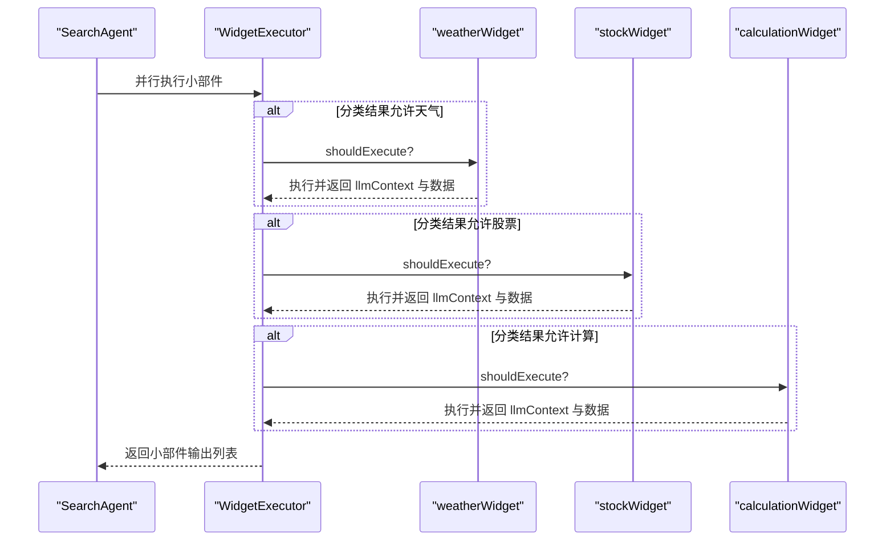
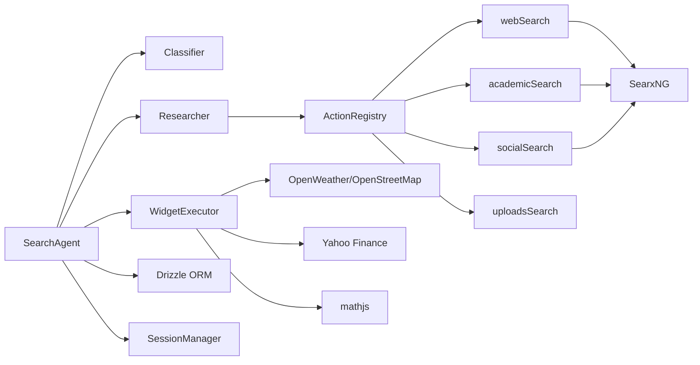

# 搜索代理系统

<cite>
**本文引用的文件**
- [src/lib/agents/search/index.ts](file://src/lib/agents/search/index.ts)
- [src/lib/agents/search/classifier.ts](file://src/lib/agents/search/classifier.ts)
- [src/lib/agents/search/researcher/index.ts](file://src/lib/agents/search/researcher/index.ts)
- [src/lib/agents/search/researcher/actions/index.ts](file://src/lib/agents/search/researcher/actions/index.ts)
- [src/lib/agents/search/researcher/actions/webSearch.ts](file://src/lib/agents/search/researcher/actions/webSearch.ts)
- [src/lib/agents/search/researcher/actions/academicSearch.ts](file://src/lib/agents/search/researcher/actions/academicSearch.ts)
- [src/lib/agents/search/researcher/actions/socialSearch.ts](file://src/lib/agents/search/researcher/actions/socialSearch.ts)
- [src/lib/agents/search/researcher/actions/uploadsSearch.ts](file://src/lib/agents/search/researcher/actions/uploadsSearch.ts)
- [src/lib/agents/search/researcher/actions/registry.ts](file://src/lib/agents/search/researcher/actions/registry.ts)
- [src/lib/agents/search/widgets/index.ts](file://src/lib/agents/search/widgets/index.ts)
- [src/lib/agents/search/widgets/weatherWidget.ts](file://src/lib/agents/search/widgets/weatherWidget.ts)
- [src/lib/agents/search/widgets/stockWidget.ts](file://src/lib/agents/search/widgets/stockWidget.ts)
- [src/lib/agents/search/widgets/calculationWidget.ts](file://src/lib/agents/search/widgets/calculationWidget.ts)
- [src/lib/agents/search/types.ts](file://src/lib/agents/search/types.ts)
- [src/lib/searxng.ts](file://src/lib/searxng.ts)
- [src/lib/session.ts](file://src/lib/session.ts)
- [src/lib/prompts/search/classifier.ts](file://src/lib/prompts/search/classifier.ts)
- [src/lib/prompts/search/researcher.ts](file://src/lib/prompts/search/researcher.ts)
- [src/lib/prompts/search/writer.ts](file://src/lib/prompts/search/writer.ts)
- [src/lib/uploads/store.ts](file://src/lib/uploads/store.ts)
- [src/app/api/search/route.ts](file://src/app/api/search/route.ts)
</cite>

## 目录
1. [简介](#简介)
2. [项目结构](#项目结构)
3. [核心组件](#核心组件)
4. [架构总览](#架构总览)
5. [详细组件分析](#详细组件分析)
6. [依赖关系分析](#依赖关系分析)
7. [性能考量](#性能考量)
8. [故障排查指南](#故障排查指南)
9. [结论](#结论)
10. [附录](#附录)

## 简介
本文件为 Perplexica 搜索代理系统的详细架构文档。系统以“搜索代理”为核心，围绕查询意图识别、多源搜索与并行执行、结果整合与写作输出等环节构建。其关键能力包括：
- 查询分类：通过大模型对用户问题进行意图识别，决定是否跳过搜索、是否执行个人/学术/讨论类搜索，以及是否展示天气、股票、计算等小部件。
- 多源搜索：支持网络搜索（SearxNG）、学术搜索（ArXiv/Google Scholar/PubMed）、社交媒体搜索（Reddit）以及本地上传文件检索。
- 并行执行与事件驱动：在研究阶段并行触发多个搜索动作，并通过会话管理器实时推送中间状态与结果块。
- 结果整合与写作：将搜索与小部件结果整合为上下文，交由大模型生成最终回答。

## 项目结构
搜索代理相关代码主要位于 src/lib/agents/search 下，按职责划分为：
- 入口与编排：SearchAgent 负责接收输入、持久化消息、调用分类器、并行执行小部件与研究者、整合上下文并流式输出答案。
- 分类器：根据对话历史与用户查询，判定搜索策略与小部件展示。
- 研究者：基于工具（动作）循环执行搜索与信息聚合，维护研究过程的推理与子步骤。
- 动作系统：注册并调度具体搜索动作（网络/学术/社交/上传/计划/完成）。
- 小部件系统：天气、股票、计算三类小部件，按分类结果并行执行。
- 类型定义与提示词：统一的数据结构、工具描述与提示词模板。

图表来源
- [src/lib/agents/search/index.ts](file://src/lib/agents/search/index.ts#L12-L187)
- [src/lib/agents/search/classifier.ts](file://src/lib/agents/search/classifier.ts#L37-L53)
- [src/lib/agents/search/researcher/index.ts](file://src/lib/agents/search/researcher/index.ts#L9-L223)
- [src/lib/agents/search/researcher/actions/index.ts](file://src/lib/agents/search/researcher/actions/index.ts#L1-L19)
- [src/lib/agents/search/widgets/index.ts](file://src/lib/agents/search/widgets/index.ts#L1-L11)

章节来源
- [src/lib/agents/search/index.ts](file://src/lib/agents/search/index.ts#L12-L187)
- [src/lib/agents/search/types.ts](file://src/lib/agents/search/types.ts#L1-L123)

## 核心组件
- SearchAgent：负责消息持久化、分类、并行执行小部件与研究者、上下文整合与流式回答输出。
- Classifier：基于系统提示词与对话历史，输出分类结果（是否跳过搜索、个人/学术/讨论搜索、小部件开关）。
- Researcher：根据模式（速度/平衡/质量）迭代调用工具，执行动作并聚合结果；维护研究过程的推理与子步骤。
- ActionRegistry：动作注册与可用性筛选，动态生成工具描述与工具定义。
- 小部件系统：天气、股票、计算三类小部件，按分类结果条件执行。
- 类型与提示词：统一的输入/输出类型、动作接口、工具描述与提示词模板。

章节来源
- [src/lib/agents/search/index.ts](file://src/lib/agents/search/index.ts#L12-L187)
- [src/lib/agents/search/classifier.ts](file://src/lib/agents/search/classifier.ts#L37-L53)
- [src/lib/agents/search/researcher/index.ts](file://src/lib/agents/search/researcher/index.ts#L9-L223)
- [src/lib/agents/search/researcher/actions/registry.ts](file://src/lib/agents/search/researcher/actions/registry.ts#L11-L106)
- [src/lib/agents/search/widgets/index.ts](file://src/lib/agents/search/widgets/index.ts#L1-L11)
- [src/lib/agents/search/types.ts](file://src/lib/agents/search/types.ts#L1-L123)

## 架构总览
搜索代理采用“事件驱动 + 并行执行”的架构：
- 输入层：API 接收请求，构造 SearchAgentInput。
- 编排层：SearchAgent 初始化会话、持久化消息、调用分类器。
- 执行层：并行执行小部件与研究者；研究者内部并行执行多个动作。
- 输出层：将搜索与小部件结果整合为上下文，交由 LLM 流式输出文本块。

图表来源
- [src/lib/agents/search/index.ts](file://src/lib/agents/search/index.ts#L13-L183)
- [src/lib/agents/search/classifier.ts](file://src/lib/agents/search/classifier.ts#L37-L53)
- [src/lib/agents/search/researcher/index.ts](file://src/lib/agents/search/researcher/index.ts#L10-L182)
- [src/lib/agents/search/researcher/actions/registry.ts](file://src/lib/agents/search/researcher/actions/registry.ts#L64-L102)

## 详细组件分析

### 组件一：SearchAgent（搜索代理）
- 职责
  - 消息持久化与状态管理：插入或更新消息记录，标记状态为“回答中/已完成”，记录响应块。
  - 查询分类：调用分类器获取分类结果，决定是否跳过搜索与小部件展示。
  - 并行执行：同时启动小部件执行与研究者研究，等待两者完成。
  - 上下文整合：将搜索结果与小部件结果拼接为最终上下文，生成系统提示词，流式输出回答。
- 关键点
  - 使用会话管理器推送中间块（研究过程、搜索结果、小部件输出）。
  - 基于模式设置最大迭代次数，平衡性能与质量。
  - 对搜索结果去重与合并，避免重复与冗余。

图表来源
- [src/lib/agents/search/index.ts](file://src/lib/agents/search/index.ts#L13-L183)

章节来源
- [src/lib/agents/search/index.ts](file://src/lib/agents/search/index.ts#L12-L187)

### 组件二：Classifier（查询分类器）
- 职责
  - 基于对话历史与当前查询，判断是否需要搜索、是否执行个人/学术/讨论搜索，以及是否展示天气/股票/计算小部件。
  - 生成独立的问题重述，便于后续工具使用。
- 实现要点
  - 使用系统提示词与 Zod Schema 约束输出格式，确保可解析性。
  - 将聊天历史格式化为字符串传入 LLM。

章节来源
- [src/lib/agents/search/classifier.ts](file://src/lib/agents/search/classifier.ts#L37-L53)
- [src/lib/prompts/search/classifier.ts](file://src/lib/prompts/search/classifier.ts)

### 组件三：Researcher（研究者）
- 职责
  - 根据模式（速度/平衡/质量）设置最大迭代次数。
  - 动态生成工具描述与工具定义，调用 LLM 进行工具选择与参数生成。
  - 执行动作并收集结果，维护研究过程中的推理与子步骤。
  - 去重与合并搜索结果，输出最终搜索发现。
- 关键流程
  - 通过 ActionRegistry 获取可用动作与工具。
  - 使用流式工具调用，逐步累积工具调用参数。
  - 执行动作并注入工具调用返回作为下一步输入。
  - 最终输出动作集合与去重后的搜索结果。

图表来源
- [src/lib/agents/search/researcher/index.ts](file://src/lib/agents/search/researcher/index.ts#L10-L182)
- [src/lib/agents/search/researcher/actions/registry.ts](file://src/lib/agents/search/researcher/actions/registry.ts#L64-L102)

章节来源
- [src/lib/agents/search/researcher/index.ts](file://src/lib/agents/search/researcher/index.ts#L9-L223)

### 组件四：动作系统（ActionRegistry 与各动作）
- ActionRegistry
  - 注册动作，按配置筛选可用动作，生成工具描述与工具定义。
  - 并行执行多个动作，汇总结果。
- 具体动作
  - webSearch：面向通用网络搜索，支持速度/平衡/质量模式下的查询策略。
  - academicSearch：面向学术论文与研究，限定引擎（ArXiv/Google Scholar/PubMed）。
  - socialSearch：面向社交媒体（Reddit）讨论与趋势。
  - uploadsSearch：面向用户上传文件的向量检索与相似度匹配。
- 并行策略
  - 各动作内部对查询数组取前 3 个，使用 Promise.all 并行发起搜索请求，提升吞吐。

图表来源
- [src/lib/agents/search/researcher/actions/registry.ts](file://src/lib/agents/search/researcher/actions/registry.ts#L11-L106)
- [src/lib/agents/search/researcher/actions/webSearch.ts](file://src/lib/agents/search/researcher/actions/webSearch.ts#L59-L183)
- [src/lib/agents/search/researcher/actions/academicSearch.ts](file://src/lib/agents/search/researcher/actions/academicSearch.ts#L22-L130)
- [src/lib/agents/search/researcher/actions/socialSearch.ts](file://src/lib/agents/search/researcher/actions/socialSearch.ts#L22-L130)
- [src/lib/agents/search/researcher/actions/uploadsSearch.ts](file://src/lib/agents/search/researcher/actions/uploadsSearch.ts#L13-L103)

章节来源
- [src/lib/agents/search/researcher/actions/index.ts](file://src/lib/agents/search/researcher/actions/index.ts#L1-L19)
- [src/lib/agents/search/researcher/actions/webSearch.ts](file://src/lib/agents/search/researcher/actions/webSearch.ts#L59-L183)
- [src/lib/agents/search/researcher/actions/academicSearch.ts](file://src/lib/agents/search/researcher/actions/academicSearch.ts#L22-L130)
- [src/lib/agents/search/researcher/actions/socialSearch.ts](file://src/lib/agents/search/researcher/actions/socialSearch.ts#L22-L130)
- [src/lib/agents/search/researcher/actions/uploadsSearch.ts](file://src/lib/agents/search/researcher/actions/uploadsSearch.ts#L13-L103)
- [src/lib/agents/search/researcher/actions/registry.ts](file://src/lib/agents/search/researcher/actions/registry.ts#L11-L106)

### 组件五：小部件系统（WidgetExecutor 与三类小部件）
- WidgetExecutor
  - 注册并调度小部件，按分类结果条件执行。
- 天气小部件（weatherWidget）
  - 从对话中抽取地点或坐标，调用 OpenStreetMap 与 Open-Meteo 获取天气数据。
- 股票小部件（stockWidget）
  - 抽取股票名称或比较对象，调用 Yahoo Finance 获取报价与多周期图表。
- 计算小部件（calculationWidget）
  - 抽取数学表达式，使用 mathjs 计算并返回结果。

图表来源
- [src/lib/agents/search/widgets/index.ts](file://src/lib/agents/search/widgets/index.ts#L1-L11)
- [src/lib/agents/search/widgets/weatherWidget.ts](file://src/lib/agents/search/widgets/weatherWidget.ts#L53-L204)
- [src/lib/agents/search/widgets/stockWidget.ts](file://src/lib/agents/search/widgets/stockWidget.ts#L51-L435)
- [src/lib/agents/search/widgets/calculationWidget.ts](file://src/lib/agents/search/widgets/calculationWidget.ts#L35-L72)

章节来源
- [src/lib/agents/search/widgets/index.ts](file://src/lib/agents/search/widgets/index.ts#L1-L11)
- [src/lib/agents/search/widgets/weatherWidget.ts](file://src/lib/agents/search/widgets/weatherWidget.ts#L53-L204)
- [src/lib/agents/search/widgets/stockWidget.ts](file://src/lib/agents/search/widgets/stockWidget.ts#L51-L435)
- [src/lib/agents/search/widgets/calculationWidget.ts](file://src/lib/agents/search/widgets/calculationWidget.ts#L35-L72)

### 组件六：类型与提示词
- 类型定义
  - 搜索来源（web/discussions/academic）、搜索配置（sources、fileIds、llm、embedding、mode、systemInstructions）、输入/输出类型、动作接口等。
- 提示词
  - 分类器提示词：指导 LLM 输出标准化的分类结果。
  - 研究者提示词：指导工具选择与迭代策略。
  - 写作者提示词：整合搜索与小部件结果，生成最终回答。

章节来源
- [src/lib/agents/search/types.ts](file://src/lib/agents/search/types.ts#L1-L123)
- [src/lib/prompts/search/classifier.ts](file://src/lib/prompts/search/classifier.ts)
- [src/lib/prompts/search/researcher.ts](file://src/lib/prompts/search/researcher.ts)
- [src/lib/prompts/search/writer.ts](file://src/lib/prompts/search/writer.ts)

## 依赖关系分析
- 组件耦合
  - SearchAgent 依赖分类器、小部件执行器、研究者、会话管理器与数据库。
  - 研究者依赖动作注册表与 LLM 工具调用能力。
  - 动作依赖 SearxNG 搜索与上传存储（向量化检索）。
- 外部依赖
  - SearxNG：网络/学术/社交搜索。
  - OpenStreetMap/Open-Meteo：天气数据。
  - Yahoo Finance：股票数据。
  - mathjs：计算表达式求值。
- 可能的循环依赖
  - 动作与注册表之间为单向依赖，无循环。
  - 小部件与执行器之间为单向依赖，无循环。

图表来源
- [src/lib/agents/search/index.ts](file://src/lib/agents/search/index.ts#L1-L11)
- [src/lib/agents/search/researcher/actions/webSearch.ts](file://src/lib/agents/search/researcher/actions/webSearch.ts#L3-L4)
- [src/lib/agents/search/researcher/actions/academicSearch.ts](file://src/lib/agents/search/researcher/actions/academicSearch.ts#L4)
- [src/lib/agents/search/researcher/actions/socialSearch.ts](file://src/lib/agents/search/researcher/actions/socialSearch.ts#L4)
- [src/lib/agents/search/widgets/weatherWidget.ts](file://src/lib/agents/search/widgets/weatherWidget.ts#L89-L116)
- [src/lib/agents/search/widgets/stockWidget.ts](file://src/lib/agents/search/widgets/stockWidget.ts#L6)
- [src/lib/agents/search/widgets/calculationWidget.ts](file://src/lib/agents/search/widgets/calculationWidget.ts#L4)

章节来源
- [src/lib/agents/search/index.ts](file://src/lib/agents/search/index.ts#L1-L11)
- [src/lib/agents/search/researcher/actions/webSearch.ts](file://src/lib/agents/search/researcher/actions/webSearch.ts#L3-L4)
- [src/lib/agents/search/researcher/actions/academicSearch.ts](file://src/lib/agents/search/researcher/actions/academicSearch.ts#L4)
- [src/lib/agents/search/researcher/actions/socialSearch.ts](file://src/lib/agents/search/researcher/actions/socialSearch.ts#L4)
- [src/lib/agents/search/widgets/weatherWidget.ts](file://src/lib/agents/search/widgets/weatherWidget.ts#L89-L116)
- [src/lib/agents/search/widgets/stockWidget.ts](file://src/lib/agents/search/widgets/stockWidget.ts#L6)
- [src/lib/agents/search/widgets/calculationWidget.ts](file://src/lib/agents/search/widgets/calculationWidget.ts#L4)

## 性能考量
- 并行执行
  - 小部件与研究者并行启动，最大化利用资源。
  - 单个动作内对查询数组取前 3 个并行搜索，减少延迟。
- 迭代限制
  - 依据模式设置最大迭代次数，避免深度搜索导致的超时。
- 结果去重与合并
  - 基于 URL 去重，相同 URL 的内容合并，减少冗余与重复引用。
- I/O 优化
  - 小部件内部部分接口使用 Promise.all 并行请求，降低等待时间。
- 数据库写入
  - 仅在消息不存在时插入，存在时删除后续消息并更新状态，保证一致性与最小写入。

## 故障排查指南
- 分类器输出异常
  - 症状：分类结果不可解析或不符合预期。
  - 排查：检查系统提示词与 Zod Schema 是否严格约束输出；确认聊天历史格式化是否正确。
- 研究者未执行动作
  - 症状：工具调用为空或未触发。
  - 排查：确认 ActionRegistry 的 enabled 条件与 sources、classification 配置一致；检查工具描述与模式是否匹配。
- 搜索结果重复或缺失
  - 症状：同一链接出现多次或关键信息缺失。
  - 排查：检查去重逻辑与 URL 映射；确认 SearxNG 引擎配置与查询关键词。
- 小部件执行失败
  - 症状：天气/股票/计算小部件无输出或报错。
  - 排查：检查外部服务（OpenWeather/OpenStreetMap/Yahoo Finance）可达性与限流；确认输入参数（地点/坐标/股票名）有效性。
- 会话与流式输出异常
  - 症状：中间块未显示或回答不完整。
  - 排查：确认 SessionManager 的块管理与更新操作；检查 LLM 流式输出的分片处理。

章节来源
- [src/lib/agents/search/classifier.ts](file://src/lib/agents/search/classifier.ts#L37-L53)
- [src/lib/agents/search/researcher/actions/registry.ts](file://src/lib/agents/search/researcher/actions/registry.ts#L64-L102)
- [src/lib/agents/search/researcher/index.ts](file://src/lib/agents/search/researcher/index.ts#L184-L218)
- [src/lib/agents/search/widgets/weatherWidget.ts](file://src/lib/agents/search/widgets/weatherWidget.ts#L192-L200)
- [src/lib/agents/search/widgets/stockWidget.ts](file://src/lib/agents/search/widgets/stockWidget.ts#L421-L430)
- [src/lib/agents/search/index.ts](file://src/lib/agents/search/index.ts#L138-L166)

## 结论
Perplexica 的搜索代理系统通过“事件驱动 + 并行执行”的设计，在保证响应质量的同时提升了整体吞吐。其核心优势在于：
- 明确的查询分类机制，使系统能够智能选择搜索策略与小部件。
- 动作注册表与工具调用流，使得研究者具备强大的扩展性与可控性。
- 并行执行与去重合并策略，显著改善了用户体验与性能表现。
建议在生产环境中关注外部服务的稳定性与限流策略，并持续优化提示词与动作启用条件，以进一步提升准确性与鲁棒性。

## 附录
- API 入口
  - 搜索 API 路由负责接收请求并调用 SearchAgent，实现端到端的搜索与回答流程。
- 数据与会话
  - 会话管理器负责中间块的创建、更新与事件推送；数据库用于持久化消息与状态。

章节来源
- [src/app/api/search/route.ts](file://src/app/api/search/route.ts)
- [src/lib/session.ts](file://src/lib/session.ts)
- [src/lib/db/schema.ts](file://src/lib/db/schema.ts)