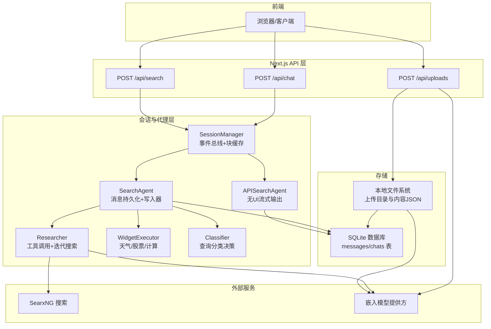
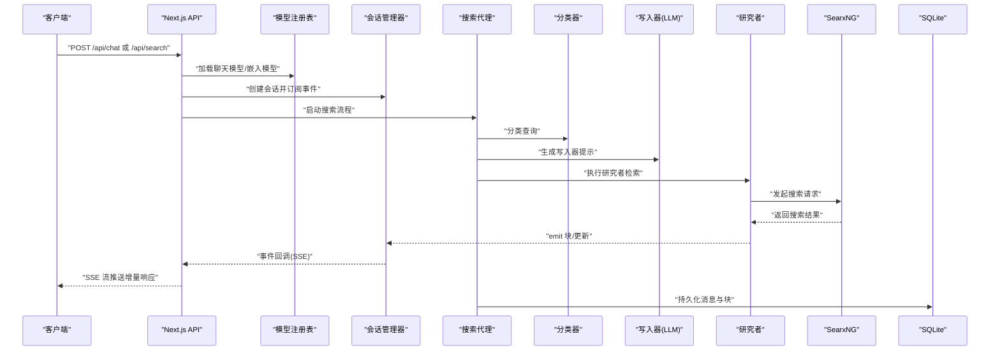
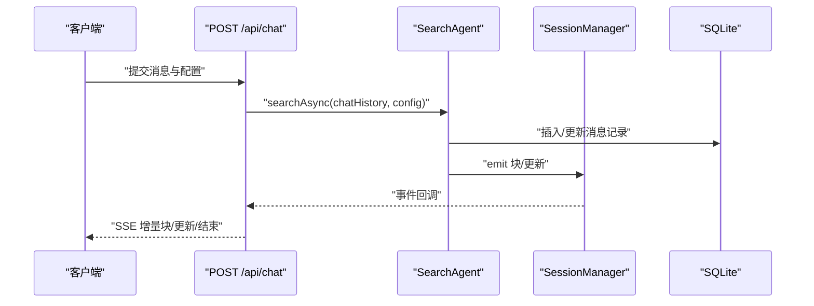
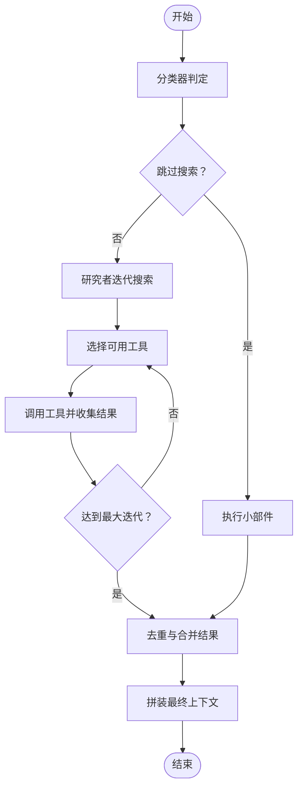
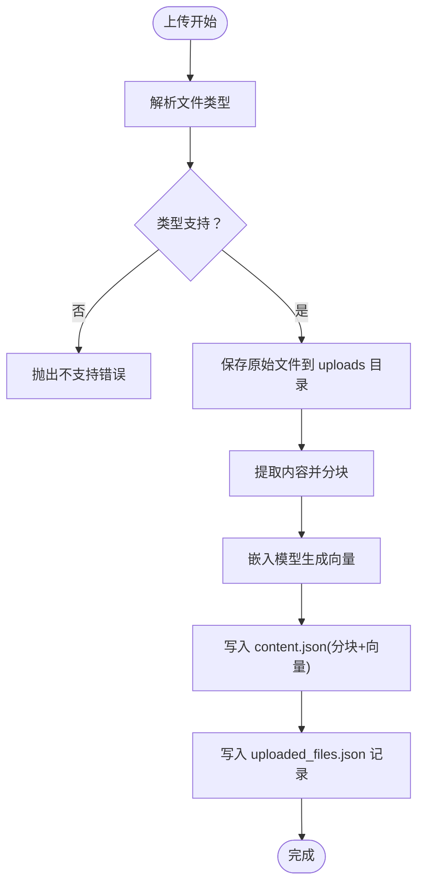
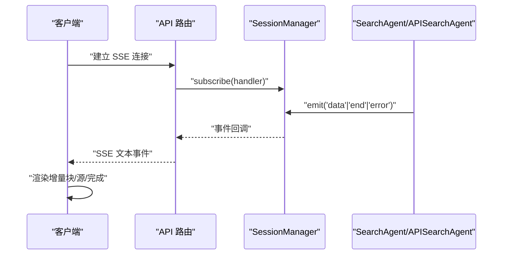
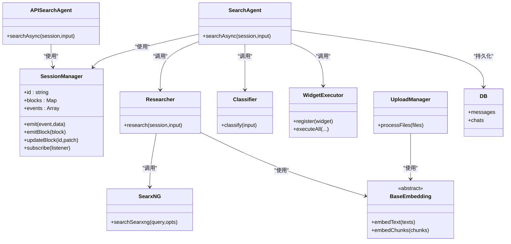

# 数据流设计

<cite>
**本文引用的文件**
- [README.md](file://README.md)
- [src/app/api/search/route.ts](file://src/app/api/search/route.ts)
- [src/app/api/chat/route.ts](file://src/app/api/chat/route.ts)
- [src/app/api/uploads/route.ts](file://src/app/api/uploads/route.ts)
- [src/lib/session.ts](file://src/lib/session.ts)
- [src/lib/agents/search/index.ts](file://src/lib/agents/search/index.ts)
- [src/lib/agents/search/api.ts](file://src/lib/agents/search/api.ts)
- [src/lib/agents/search/researcher/index.ts](file://src/lib/agents/search/researcher/index.ts)
- [src/lib/agents/search/classifier.ts](file://src/lib/agents/search/classifier.ts)
- [src/lib/agents/search/widgets/index.ts](file://src/lib/agents/search/widgets/index.ts)
- [src/lib/searxng.ts](file://src/lib/searxng.ts)
- [src/lib/db/schema.ts](file://src/lib/db/schema.ts)
- [src/lib/db/index.ts](file://src/lib/db/index.ts)
- [src/lib/types.ts](file://src/lib/types.ts)
- [src/lib/utils/computeSimilarity.ts](file://src/lib/utils/computeSimilarity.ts)
- [src/lib/uploads/manager.ts](file://src/lib/uploads/manager.ts)
- [src/lib/models/base/embedding.ts](file://src/lib/models/base/embedding.ts)
</cite>

## 目录
1. [简介](#简介)
2. [项目结构](#项目结构)
3. [核心组件](#核心组件)
4. [架构总览](#架构总览)
5. [详细组件分析](#详细组件分析)
6. [依赖关系分析](#依赖关系分析)
7. [性能考量](#性能考量)
8. [故障排查指南](#故障排查指南)
9. [结论](#结论)
10. [附录](#附录)

## 简介
本文件面向 Perplexica 的数据流设计，聚焦以下主题：
- 用户输入处理流程：从 API 接收请求到构建会话与消息块的完整链路
- 搜索结果聚合流程：分类器决策、研究者迭代检索、去重与上下文拼装
- 文件上传处理流程：类型校验、内容提取、分块与向量化、持久化记录
- 会话状态同步流程：基于事件总线的实时推送（Server-Sent Events）
- 实时数据流机制：SSE 流式传输、事件驱动更新与客户端订阅
- 数据持久化策略：SQLite 存储消息与对话元数据
- 缓存与一致性：会话内内存块缓存、数据库最终一致
- 嵌入向量与相似度：向量生成与余弦相似度计算
- 监控、性能优化与故障恢复：并发控制、超时与回退策略

## 项目结构
Perplexica 前后端采用 Next.js API 路由组织业务逻辑，核心数据流围绕“会话管理器 + 搜索代理 + 研究者 + 小部件执行器”展开，并通过 SSE 将增量响应推送给客户端。

图表来源
- [src/app/api/chat/route.ts](file://src/app/api/chat/route.ts#L103-L255)
- [src/app/api/search/route.ts](file://src/app/api/search/route.ts#L19-L209)
- [src/app/api/uploads/route.ts](file://src/app/api/uploads/route.ts#L5-L41)
- [src/lib/session.ts](file://src/lib/session.ts#L11-L106)
- [src/lib/agents/search/index.ts](file://src/lib/agents/search/index.ts#L12-L187)
- [src/lib/agents/search/api.ts](file://src/lib/agents/search/api.ts#L8-L100)
- [src/lib/agents/search/researcher/index.ts](file://src/lib/agents/search/researcher/index.ts#L9-L223)
- [src/lib/agents/search/classifier.ts](file://src/lib/agents/search/classifier.ts#L37-L54)
- [src/lib/agents/search/widgets/index.ts](file://src/lib/agents/search/widgets/index.ts#L1-L11)
- [src/lib/searxng.ts](file://src/lib/searxng.ts#L21-L54)
- [src/lib/db/schema.ts](file://src/lib/db/schema.ts#L6-L39)
- [src/lib/db/index.ts](file://src/lib/db/index.ts#L1-L13)
- [src/lib/uploads/manager.ts](file://src/lib/uploads/manager.ts#L32-L218)

章节来源
- [README.md](file://README.md#L1-L267)

## 核心组件
- 会话管理器（SessionManager）：维护每个会话的事件总线、消息块缓存、TTL 清理与订阅接口
- 搜索代理（SearchAgent/APISearchAgent）：负责消息持久化、分类、小部件执行、研究者检索、写入器生成最终回答
- 研究者（Researcher）：根据模式（速度/平衡/质量）迭代调用工具，收集搜索结果并去重
- 分类器（Classifier）：对用户查询进行分类，决定是否跳过搜索、个人/学术/讨论搜索及展示哪些小部件
- 小部件执行器（WidgetExecutor）：注册并执行天气、股票、计算等小部件
- 外部搜索（SearxNG）：统一检索入口，返回结果与建议
- 文件上传管理（UploadManager）：支持 PDF/DOC/纯文本，分块、嵌入、持久化记录
- 数据库（Drizzle ORM + better-sqlite3）：messages 与 chats 表，保存消息块与会话元信息
- 类型系统（types.ts）：定义消息、块、工具调用等核心数据结构

章节来源
- [src/lib/session.ts](file://src/lib/session.ts#L11-L106)
- [src/lib/agents/search/index.ts](file://src/lib/agents/search/index.ts#L12-L187)
- [src/lib/agents/search/api.ts](file://src/lib/agents/search/api.ts#L8-L100)
- [src/lib/agents/search/researcher/index.ts](file://src/lib/agents/search/researcher/index.ts#L9-L223)
- [src/lib/agents/search/classifier.ts](file://src/lib/agents/search/classifier.ts#L37-L54)
- [src/lib/agents/search/widgets/index.ts](file://src/lib/agents/search/widgets/index.ts#L1-L11)
- [src/lib/searxng.ts](file://src/lib/searxng.ts#L21-L54)
- [src/lib/uploads/manager.ts](file://src/lib/uploads/manager.ts#L32-L218)
- [src/lib/db/schema.ts](file://src/lib/db/schema.ts#L6-L39)
- [src/lib/db/index.ts](file://src/lib/db/index.ts#L1-L13)
- [src/lib/types.ts](file://src/lib/types.ts#L118-L124)

## 架构总览
下图展示了从用户输入到实时响应的关键数据路径与组件交互。

图表来源
- [src/app/api/chat/route.ts](file://src/app/api/chat/route.ts#L103-L255)
- [src/app/api/search/route.ts](file://src/app/api/search/route.ts#L19-L209)
- [src/lib/agents/search/index.ts](file://src/lib/agents/search/index.ts#L12-L187)
- [src/lib/agents/search/api.ts](file://src/lib/agents/search/api.ts#L8-L100)
- [src/lib/agents/search/researcher/index.ts](file://src/lib/agents/search/researcher/index.ts#L9-L223)
- [src/lib/searxng.ts](file://src/lib/searxng.ts#L21-L54)
- [src/lib/db/index.ts](file://src/lib/db/index.ts#L1-L13)

## 详细组件分析

### 用户输入处理流程（/api/chat）
- 请求体校验与参数归一化
- 并发加载聊天模型与嵌入模型
- 创建会话并订阅事件，将增量块/更新以 SSE 推送
- 启动搜索代理，持久化消息与块，结束时关闭流与移除监听

图表来源
- [src/app/api/chat/route.ts](file://src/app/api/chat/route.ts#L103-L255)
- [src/lib/agents/search/index.ts](file://src/lib/agents/search/index.ts#L12-L187)
- [src/lib/session.ts](file://src/lib/session.ts#L45-L102)
- [src/lib/db/schema.ts](file://src/lib/db/schema.ts#L6-L39)

章节来源
- [src/app/api/chat/route.ts](file://src/app/api/chat/route.ts#L103-L255)

### 搜索结果聚合流程
- 查询分类：决定是否跳过搜索、个人/学术/讨论搜索与小部件展示
- 小部件执行：并行执行天气/股票/计算等小部件，产出上下文
- 研究者迭代：根据模式限制最大迭代次数，动态选择可用工具，逐步收集搜索结果
- 结果去重与拼装：按 URL 去重并合并重复条目，生成最终上下文供写入器使用

图表来源
- [src/lib/agents/search/classifier.ts](file://src/lib/agents/search/classifier.ts#L37-L54)
- [src/lib/agents/search/researcher/index.ts](file://src/lib/agents/search/researcher/index.ts#L9-L223)
- [src/lib/agents/search/widgets/index.ts](file://src/lib/agents/search/widgets/index.ts#L1-L11)

章节来源
- [src/lib/agents/search/index.ts](file://src/lib/agents/search/index.ts#L54-L121)
- [src/lib/agents/search/researcher/index.ts](file://src/lib/agents/search/researcher/index.ts#L13-L223)

### 文件上传处理流程
- 校验嵌入模型与提供方
- 解析文件类型（PDF/DOC/纯文本），分块并调用嵌入模型生成向量
- 将分块与向量写入独立的 content.json 文件
- 记录上传文件清单，包含文件名、ID、路径与时间戳

图表来源
- [src/app/api/uploads/route.ts](file://src/app/api/uploads/route.ts#L5-L41)
- [src/lib/uploads/manager.ts](file://src/lib/uploads/manager.ts#L89-L175)
- [src/lib/models/base/embedding.ts](file://src/lib/models/base/embedding.ts#L3-L7)

章节来源
- [src/lib/uploads/manager.ts](file://src/lib/uploads/manager.ts#L32-L218)

### 会话状态同步流程（Server-Sent Events）
- 会话管理器维护事件队列与订阅者列表，支持回放历史事件
- SSE 流中发送初始化、增量块、搜索源、完成与错误事件
- 客户端可断线重连并接收历史事件

图表来源
- [src/lib/session.ts](file://src/lib/session.ts#L80-L102)
- [src/app/api/chat/route.ts](file://src/app/api/chat/route.ts#L159-L211)
- [src/app/api/search/route.ts](file://src/app/api/search/route.ts#L139-L187)

章节来源
- [src/lib/session.ts](file://src/lib/session.ts#L11-L106)
- [src/app/api/chat/route.ts](file://src/app/api/chat/route.ts#L155-L246)
- [src/app/api/search/route.ts](file://src/app/api/search/route.ts#L118-L200)

### 实时数据流与事件驱动更新
- 事件类型：块（block）、块更新（updateBlock）、研究完成（researchComplete）、响应片段（response）、搜索源（sources）、完成（done）、错误（error）
- 使用 RFC6902 补丁对块进行增量更新，确保 UI 低延迟刷新
- 会话 TTL 自动清理，避免内存泄漏

章节来源
- [src/lib/session.ts](file://src/lib/session.ts#L50-L74)
- [src/lib/types.ts](file://src/lib/types.ts#L118-L124)

### 数据持久化策略与一致性
- SQLite 表结构：messages（消息块数组、状态、时间戳）、chats（标题、来源、文件列表）
- 写入器完成后将最终块集合写回数据库，保证最终一致性
- 会话内块缓存与数据库双写，优先保证实时性；落库作为持久化备份

章节来源
- [src/lib/db/schema.ts](file://src/lib/db/schema.ts#L6-L39)
- [src/lib/db/index.ts](file://src/lib/db/index.ts#L1-L13)
- [src/lib/agents/search/index.ts](file://src/lib/agents/search/index.ts#L170-L182)

### 嵌入向量生成与相似度计算
- 嵌入抽象：BaseEmbedding 提供 embedText 与 embedChunks 接口
- 上传流程：对分块文本调用嵌入模型生成向量，写入 content.json
- 相似度计算：余弦相似度，用于后续检索或匹配场景

章节来源
- [src/lib/models/base/embedding.ts](file://src/lib/models/base/embedding.ts#L3-L7)
- [src/lib/uploads/manager.ts](file://src/lib/uploads/manager.ts#L89-L175)
- [src/lib/utils/computeSimilarity.ts](file://src/lib/utils/computeSimilarity.ts#L1-L23)

## 依赖关系分析

图表来源
- [src/lib/session.ts](file://src/lib/session.ts#L11-L106)
- [src/lib/agents/search/index.ts](file://src/lib/agents/search/index.ts#L12-L187)
- [src/lib/agents/search/api.ts](file://src/lib/agents/search/api.ts#L8-L100)
- [src/lib/agents/search/researcher/index.ts](file://src/lib/agents/search/researcher/index.ts#L9-L223)
- [src/lib/agents/search/classifier.ts](file://src/lib/agents/search/classifier.ts#L37-L54)
- [src/lib/agents/search/widgets/index.ts](file://src/lib/agents/search/widgets/index.ts#L1-L11)
- [src/lib/uploads/manager.ts](file://src/lib/uploads/manager.ts#L32-L218)
- [src/lib/models/base/embedding.ts](file://src/lib/models/base/embedding.ts#L3-L7)
- [src/lib/searxng.ts](file://src/lib/searxng.ts#L21-L54)
- [src/lib/db/schema.ts](file://src/lib/db/schema.ts#L6-L39)

## 性能考量
- 并发控制
  - API 层对模型加载与文件处理采用 Promise.all 并发，提升吞吐
  - 研究者迭代次数随模式调整，平衡延迟与质量
- 流式输出
  - SSE 逐片推送，降低首字节延迟
  - TransformStream 写入器块，边生成边推送
- 缓存与去重
  - 会话内块缓存与补丁更新，减少重复渲染
  - 搜索结果按 URL 去重，避免重复内容
- 存储与索引
  - SQLite 轻量可靠，适合本地部署；大体量后可考虑外部向量库（如当前实现未内置）
- 超时与回退
  - 外部搜索失败时抛错并终止，建议在上层增加重试与降级策略

[本节为通用性能建议，不直接分析具体文件]

## 故障排查指南
- SSE 连接异常
  - 检查 API 路由是否正确设置 Content-Type 与 keep-alive
  - 确认会话订阅是否被提前移除或 AbortController 触发
- 搜索失败
  - 核查 SearxNG 地址与返回状态码
  - 检查分类器输出与工具可用性
- 文件上传失败
  - 确认嵌入模型提供方与密钥配置
  - 校验文件类型是否受支持
- 数据不一致
  - 确认写入器完成后数据库更新是否成功
  - 检查会话 TTL 是否过早清理

章节来源
- [src/app/api/search/route.ts](file://src/app/api/search/route.ts#L194-L200)
- [src/app/api/chat/route.ts](file://src/app/api/chat/route.ts#L240-L246)
- [src/lib/searxng.ts](file://src/lib/searxng.ts#L43-L45)
- [src/lib/uploads/manager.ts](file://src/lib/uploads/manager.ts#L180-L183)

## 结论
Perplexica 的数据流以“会话管理器 + 事件驱动 + SSE 流式输出”为核心，结合分类器、研究者与小部件执行器，形成从用户输入到实时响应的闭环。文件上传与嵌入向量生成为后续检索与索引奠定基础。通过 SQLite 持久化与会话内缓存，系统在实时性与一致性之间取得平衡。未来可在向量检索与缓存层引入更高效的外部组件，进一步提升大规模场景下的性能与扩展性。

## 附录
- 关键数据结构
  - 消息块：文本块、源块、小部件块、研究块等
  - 会话事件：data/end/error 三类事件，配合块增补
  - 数据库表：messages（含 responseBlocks）、chats（含 sources/files）

章节来源
- [src/lib/types.ts](file://src/lib/types.ts#L118-L124)
- [src/lib/db/schema.ts](file://src/lib/db/schema.ts#L6-L39)
- [src/lib/session.ts](file://src/lib/session.ts#L45-L74)