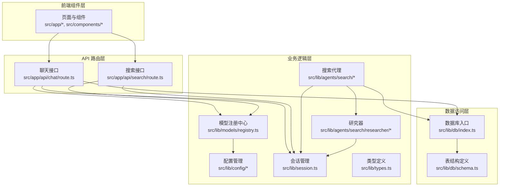
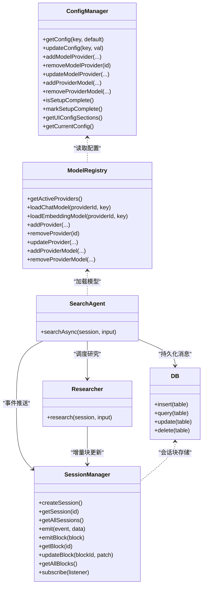
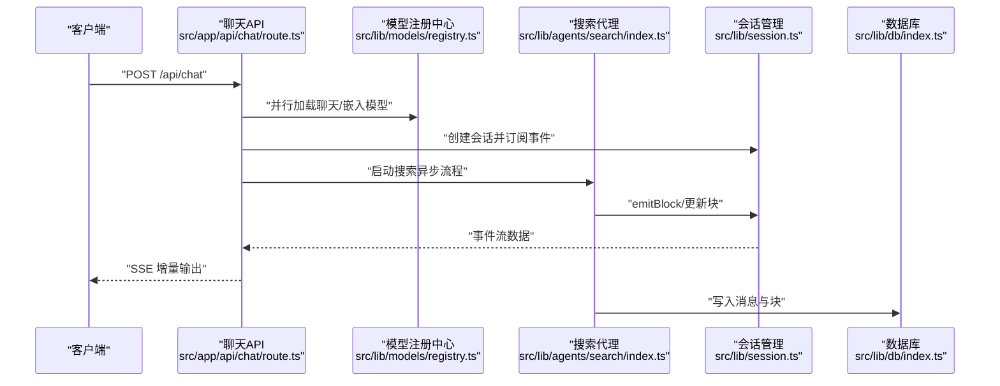
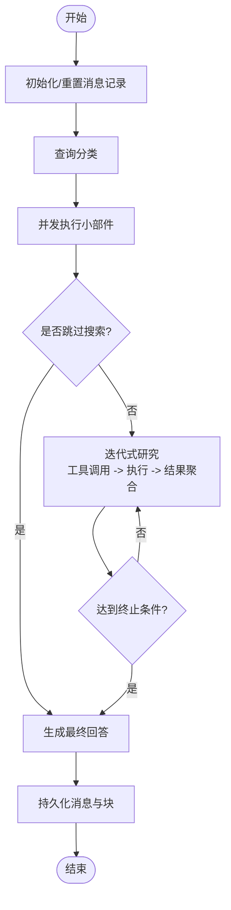
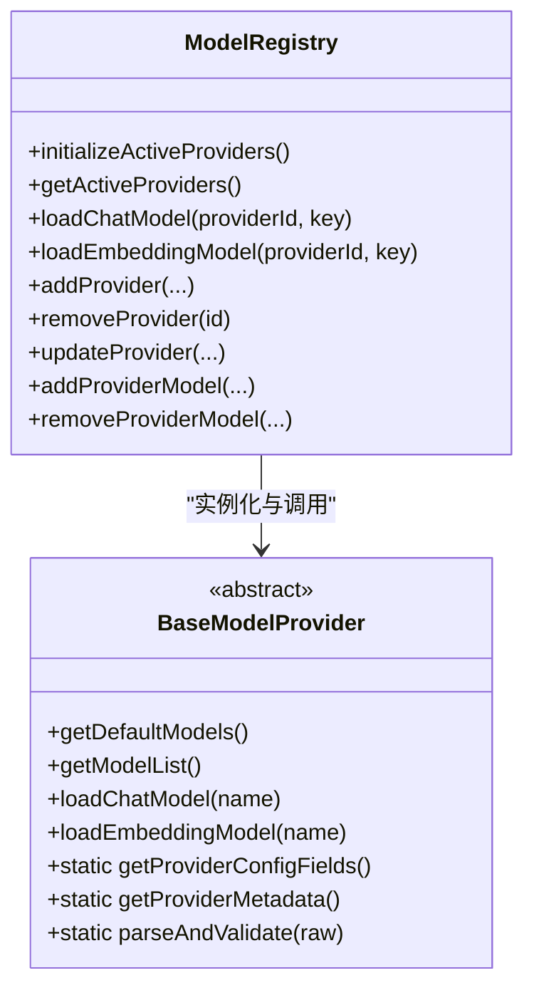
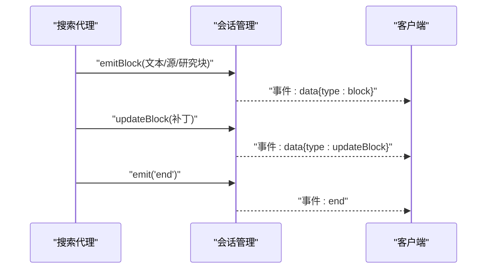
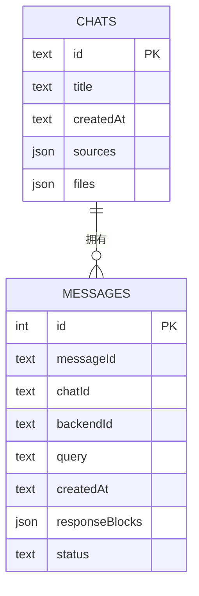
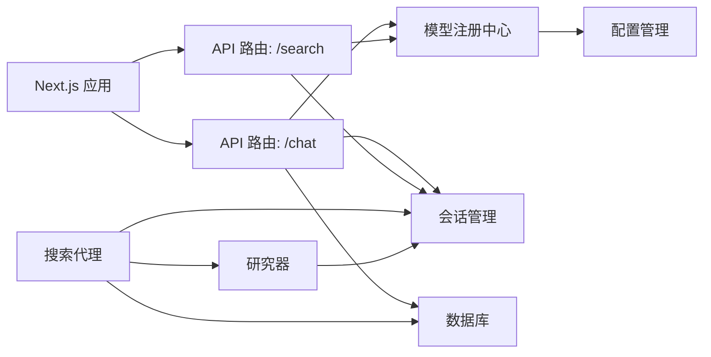

# 架构设计

<cite>
**本文引用的文件**
- [README.md](file://README.md)
- [package.json](file://package.json)
- [src/app/layout.tsx](file://src/app/layout.tsx)
- [src/app/api/chat/route.ts](file://src/app/api/chat/route.ts)
- [src/app/api/search/route.ts](file://src/app/api/search/route.ts)
- [src/lib/config/index.ts](file://src/lib/config/index.ts)
- [src/lib/config/serverRegistry.ts](file://src/lib/config/serverRegistry.ts)
- [src/lib/models/registry.ts](file://src/lib/models/registry.ts)
- [src/lib/models/base/provider.ts](file://src/lib/models/base/provider.ts)
- [src/lib/agents/search/index.ts](file://src/lib/agents/search/index.ts)
- [src/lib/agents/search/researcher/index.ts](file://src/lib/agents/search/researcher/index.ts)
- [src/lib/session.ts](file://src/lib/session.ts)
- [src/lib/db/index.ts](file://src/lib/db/index.ts)
- [src/lib/db/schema.ts](file://src/lib/db/schema.ts)
- [src/lib/types.ts](file://src/lib/types.ts)
</cite>

## 目录
1. [引言](#引言)
2. [项目结构](#项目结构)
3. [核心组件](#核心组件)
4. [架构总览](#架构总览)
5. [组件详解](#组件详解)
6. [依赖关系分析](#依赖关系分析)
7. [性能与可扩展性](#性能与可扩展性)
8. [故障排查指南](#故障排查指南)
9. [结论](#结论)
10. [附录](#附录)

## 引言
本架构设计文档面向 Perplexica 的开发者与维护者，系统化阐述其整体架构模式（分层架构、模块化设计、事件驱动）、核心组件交互（前端组件层、API 层、业务逻辑层、数据访问层），以及关键子系统（搜索代理、模型注册、会话管理）的工作原理与设计权衡。同时给出系统边界图、组件关系图、序列图与流程图，帮助快速理解与迭代。

## 项目结构
Perplexica 基于 Next.js 应用，采用前后端同构的单体应用结构，结合服务端渲染与流式响应，配合本地 SQLite 数据存储与配置持久化，形成“前端组件层 + API 路由层 + 业务逻辑层 + 数据访问层”的清晰分层。

- 前端组件层：位于 src/components 与页面入口 src/app/*，负责 UI 渲染、用户交互与状态展示。
- API 路由层：位于 src/app/api/*，定义 REST 风格接口，处理请求校验、并发加载模型、启动会话与事件流输出。
- 业务逻辑层：位于 src/lib 下，包含配置管理、模型注册、搜索代理、研究器、会话管理、数据库访问等。
- 数据访问层：基于 Drizzle ORM + better-sqlite3，使用 SQLite 文件存储聊天与消息记录。

图表来源
- [src/app/layout.tsx](file://src/app/layout.tsx#L27-L59)
- [src/app/api/chat/route.ts](file://src/app/api/chat/route.ts#L103-L254)
- [src/app/api/search/route.ts](file://src/app/api/search/route.ts#L19-L208)
- [src/lib/config/index.ts](file://src/lib/config/index.ts#L1-L391)
- [src/lib/models/registry.ts](file://src/lib/models/registry.ts#L1-L222)
- [src/lib/agents/search/index.ts](file://src/lib/agents/search/index.ts#L1-L187)
- [src/lib/agents/search/researcher/index.ts](file://src/lib/agents/search/researcher/index.ts#L1-L223)
- [src/lib/session.ts](file://src/lib/session.ts#L1-L106)
- [src/lib/db/index.ts](file://src/lib/db/index.ts#L1-L13)
- [src/lib/db/schema.ts](file://src/lib/db/schema.ts#L1-L39)

章节来源
- [README.md](file://README.md#L1-L267)
- [package.json](file://package.json#L1-L77)
- [src/app/layout.tsx](file://src/app/layout.tsx#L27-L59)

## 核心组件
- 配置管理器：负责读取/写入配置文件、环境变量注入、模型提供方注册与迁移。
- 模型注册中心：统一加载与缓存已配置的模型提供方实例，暴露模型列表与加载能力。
- 搜索代理：协调分类、小部件执行、研究器检索与最终写作提示，通过会话事件流输出块。
- 研究器：基于工具调用的迭代式研究流程，动态选择动作并聚合结果。
- 会话管理：基于 EventEmitter 的事件驱动会话，支持增量块更新与订阅。
- 数据库：Drizzle ORM + better-sqlite3，存储聊天与消息记录，支持 JSON 字段。
- 类型系统：统一定义消息、块、研究步骤等核心数据结构。

章节来源
- [src/lib/config/index.ts](file://src/lib/config/index.ts#L1-L391)
- [src/lib/models/registry.ts](file://src/lib/models/registry.ts#L1-L222)
- [src/lib/agents/search/index.ts](file://src/lib/agents/search/index.ts#L1-L187)
- [src/lib/agents/search/researcher/index.ts](file://src/lib/agents/search/researcher/index.ts#L1-L223)
- [src/lib/session.ts](file://src/lib/session.ts#L1-L106)
- [src/lib/db/index.ts](file://src/lib/db/index.ts#L1-L13)
- [src/lib/db/schema.ts](file://src/lib/db/schema.ts#L1-L39)
- [src/lib/types.ts](file://src/lib/types.ts#L1-L124)

## 架构总览
系统采用“分层 + 模块化 + 事件驱动”的混合架构：
- 分层架构：前端组件层、API 路由层、业务逻辑层、数据访问层职责清晰。
- 模块化设计：配置、模型、代理、研究器、会话、数据库以独立模块组织，低耦合高内聚。
- 事件驱动：会话管理基于 EventEmitter，API 路由通过 TransformStream/ReadableStream 将事件推送给客户端，实现近实时的增量渲染。

图表来源
- [src/lib/config/index.ts](file://src/lib/config/index.ts#L1-L391)
- [src/lib/models/registry.ts](file://src/lib/models/registry.ts#L1-L222)
- [src/lib/agents/search/index.ts](file://src/lib/agents/search/index.ts#L1-L187)
- [src/lib/agents/search/researcher/index.ts](file://src/lib/agents/search/researcher/index.ts#L1-L223)
- [src/lib/session.ts](file://src/lib/session.ts#L1-L106)
- [src/lib/db/index.ts](file://src/lib/db/index.ts#L1-L13)

## 组件详解

### 前端组件层与布局
- 入口布局根据配置是否完成决定渲染 SetupWizard 或 ChatProvider + Sidebar + 子页面。
- 主题、通知、字体等全局配置在根布局中初始化。

章节来源
- [src/app/layout.tsx](file://src/app/layout.tsx#L27-L59)

### API 路由层（聊天与搜索）
- 聊天接口：接收消息、历史、优化模式、来源、文件、模型配置；并行加载聊天与嵌入模型；创建会话并通过事件流返回增量块；确保聊天记录存在后写入。
- 搜索接口：支持同步与流式两种模式；加载模型后启动搜索代理，按事件推送响应与来源。

图表来源
- [src/app/api/chat/route.ts](file://src/app/api/chat/route.ts#L103-L254)
- [src/lib/models/registry.ts](file://src/lib/models/registry.ts#L74-L92)
- [src/lib/agents/search/index.ts](file://src/lib/agents/search/index.ts#L13-L183)
- [src/lib/session.ts](file://src/lib/session.ts#L50-L74)
- [src/lib/db/index.ts](file://src/lib/db/index.ts#L1-L13)

章节来源
- [src/app/api/chat/route.ts](file://src/app/api/chat/route.ts#L103-L254)
- [src/app/api/search/route.ts](file://src/app/api/search/route.ts#L19-L208)

### 搜索代理与研究器
- 搜索代理：先写入或重置消息记录，再进行查询分类与小部件执行；并发等待研究器结果；拼接上下文后调用大模型生成最终回答；完成后标记完成并持久化块。
- 研究器：依据优化模式限制最大迭代次数；动态构建可用工具集与动作描述；通过工具调用逐步推理、搜索、读取与去重；最终产出搜索结果块。

图表来源
- [src/lib/agents/search/index.ts](file://src/lib/agents/search/index.ts#L13-L183)
- [src/lib/agents/search/researcher/index.ts](file://src/lib/agents/search/researcher/index.ts#L9-L223)

章节来源
- [src/lib/agents/search/index.ts](file://src/lib/agents/search/index.ts#L1-L187)
- [src/lib/agents/search/researcher/index.ts](file://src/lib/agents/search/researcher/index.ts#L1-L223)

### 模型注册系统
- 从配置中读取已配置提供方，按类型映射到具体提供方类，实例化后缓存；对外提供模型列表查询与按需加载聊天/嵌入模型的能力；支持增删改与模型增删。

图表来源
- [src/lib/models/base/provider.ts](file://src/lib/models/base/provider.ts#L6-L46)
- [src/lib/models/registry.ts](file://src/lib/models/registry.ts#L1-L222)

章节来源
- [src/lib/models/registry.ts](file://src/lib/models/registry.ts#L1-L222)
- [src/lib/models/base/provider.ts](file://src/lib/models/base/provider.ts#L1-L46)
- [src/lib/config/serverRegistry.ts](file://src/lib/config/serverRegistry.ts#L1-L16)

### 会话管理系统
- 基于 EventEmitter 的事件总线，支持块级增量更新（RFC 6902 补丁）；会话具备 TTL 自清理；支持订阅回放历史事件；提供静态工厂方法创建/获取/遍历会话。

图表来源
- [src/lib/session.ts](file://src/lib/session.ts#L50-L102)
- [src/lib/agents/search/index.ts](file://src/lib/agents/search/index.ts#L67-L77)

章节来源
- [src/lib/session.ts](file://src/lib/session.ts#L1-L106)
- [src/lib/types.ts](file://src/lib/types.ts#L39-L124)

### 数据访问层
- 使用 better-sqlite3 作为底层存储，Drizzle ORM 提供类型安全的查询；表结构包含 chats 与 messages，支持 JSON 字段存储块与来源信息；API 在必要时写入/更新记录。

图表来源
- [src/lib/db/schema.ts](file://src/lib/db/schema.ts#L6-L38)
- [src/lib/db/index.ts](file://src/lib/db/index.ts#L1-L13)
- [src/app/api/chat/route.ts](file://src/app/api/chat/route.ts#L76-L101)

章节来源
- [src/lib/db/schema.ts](file://src/lib/db/schema.ts#L1-L39)
- [src/lib/db/index.ts](file://src/lib/db/index.ts#L1-L13)
- [src/app/api/chat/route.ts](file://src/app/api/chat/route.ts#L76-L101)

## 依赖关系分析
- 运行时与依赖：Next.js、better-sqlite3、drizzle-orm、openai、ollama、@google/genai、@huggingface/transformers 等。
- 内部模块耦合：API 路由依赖模型注册中心与会话管理；搜索代理依赖研究器与数据库；模型注册中心依赖配置管理；会话管理与数据库相互解耦但被上层使用。

图表来源
- [package.json](file://package.json#L13-L53)
- [src/app/api/chat/route.ts](file://src/app/api/chat/route.ts#L1-L255)
- [src/app/api/search/route.ts](file://src/app/api/search/route.ts#L1-L209)
- [src/lib/models/registry.ts](file://src/lib/models/registry.ts#L1-L222)
- [src/lib/config/index.ts](file://src/lib/config/index.ts#L1-L391)
- [src/lib/agents/search/index.ts](file://src/lib/agents/search/index.ts#L1-L187)
- [src/lib/agents/search/researcher/index.ts](file://src/lib/agents/search/researcher/index.ts#L1-L223)
- [src/lib/session.ts](file://src/lib/session.ts#L1-L106)
- [src/lib/db/index.ts](file://src/lib/db/index.ts#L1-L13)

章节来源
- [package.json](file://package.json#L1-L77)

## 性能与可扩展性
- 并发与异步：API 路由对模型加载与研究器执行采用 Promise.all 并发，降低端到端延迟。
- 流式输出：SSE 事件流将增量块推送到客户端，改善感知性能与交互体验。
- 会话 TTL：会话自动清理避免内存泄漏，适合高并发场景。
- 数据库：SQLite 适配单机部署与轻量写入；若需水平扩展，可考虑替换为 Postgres 并引入连接池与读写分离。
- 模型提供方：通过注册中心抽象，新增提供方只需实现 Provider 接口与解析逻辑，便于横向扩展。

## 故障排查指南
- 请求体校验失败：检查字段类型与必填项，参考 API 路由中的 Zod 校验错误结构。
- 模型加载异常：确认配置中提供方 ID 与模型键正确，查看注册中心日志输出。
- 会话未收到事件：确认客户端已订阅 SSE，检查断开信号与监听移除逻辑。
- 数据持久化失败：检查 DATA_DIR 权限与 SQLite 文件路径，确认 Drizzle 初始化成功。

章节来源
- [src/app/api/chat/route.ts](file://src/app/api/chat/route.ts#L52-L69)
- [src/lib/models/registry.ts](file://src/lib/models/registry.ts#L44-L60)
- [src/lib/session.ts](file://src/lib/session.ts#L80-L102)
- [src/lib/db/index.ts](file://src/lib/db/index.ts#L6-L10)

## 结论
Perplexica 采用清晰的分层与模块化设计，结合事件驱动的会话机制与流式输出，实现了从“查询分类—小部件—研究—写作”的完整搜索工作流。配置与模型注册中心提供了良好的可扩展性，数据库层简洁可靠。未来可在数据库层、认证与权限、代理编排与缓存等方面进一步增强。

## 附录
- 架构演进与未来方向（概念性说明）
  - 数据库演进：从 SQLite 迁移到分布式数据库，引入读副本与缓存层。
  - 认证与授权：引入用户域与会话令牌，保护敏感操作与资源。
  - 代理编排：将研究器动作抽象为可插拔插件，支持动态策略与优先级。
  - 缓存与预取：对热门搜索与常用模型结果进行缓存，提升响应速度。
  - 多租户与隔离：按用户/组织隔离配置与数据，支持多实例部署。