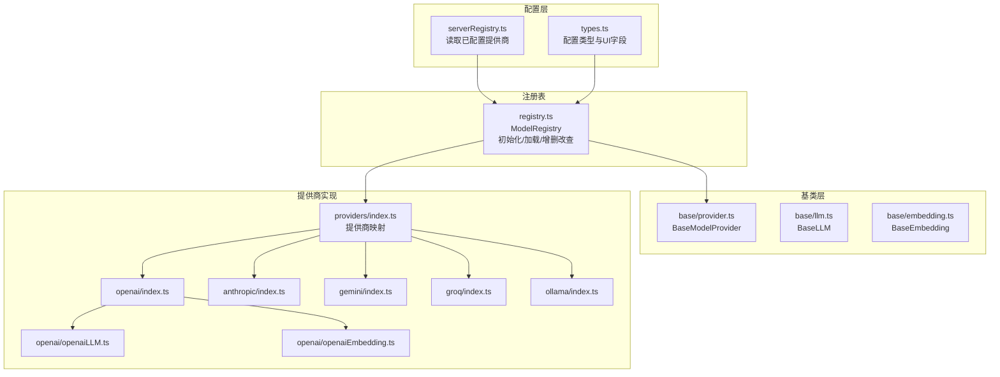
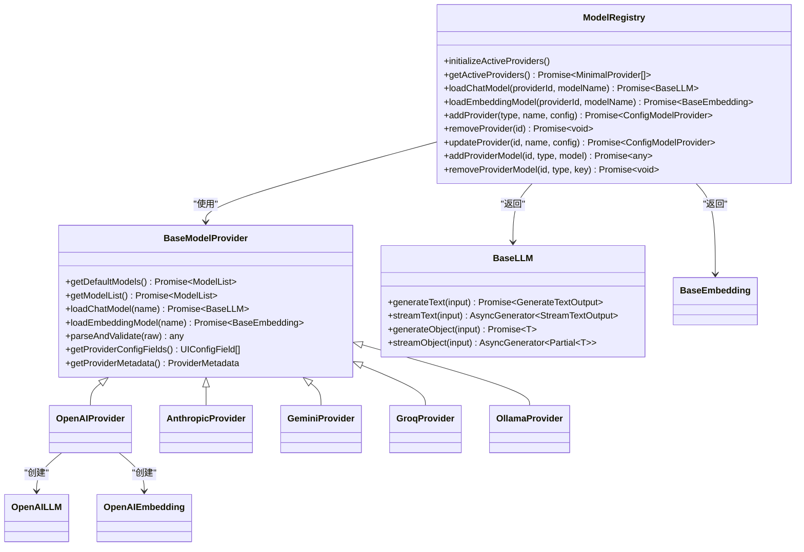
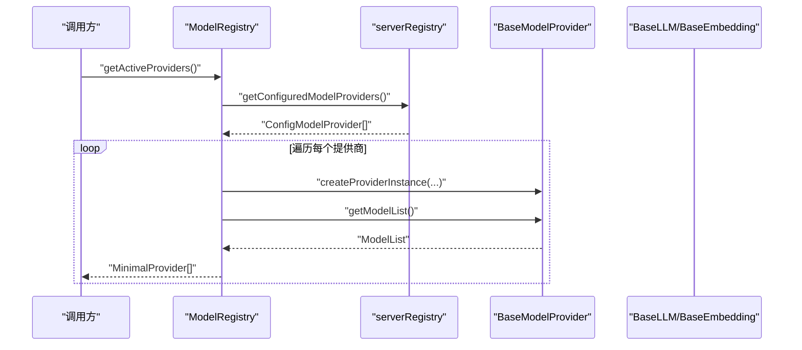
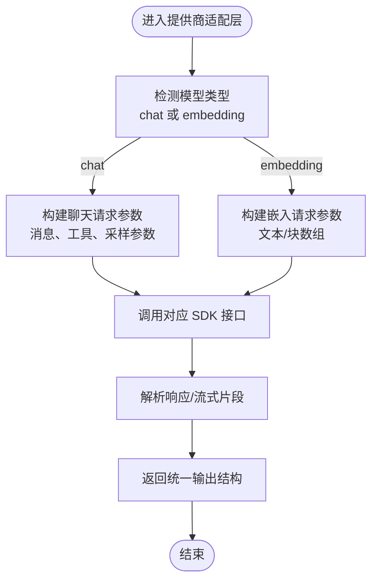
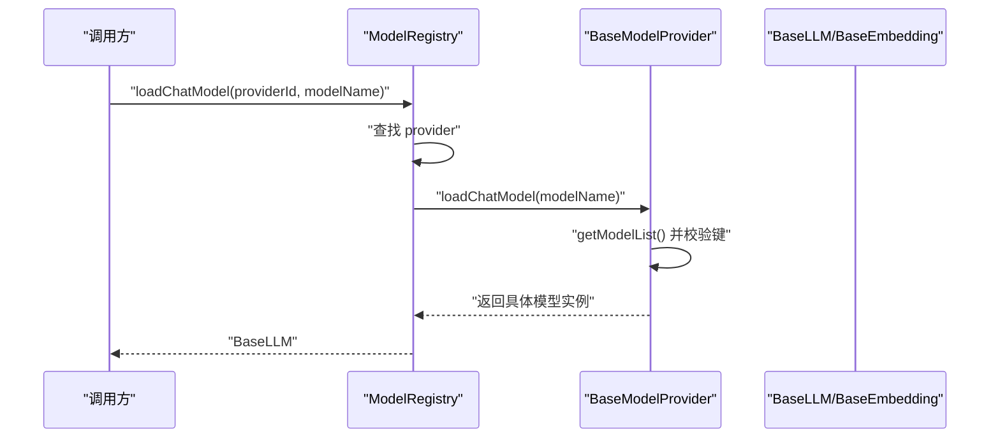
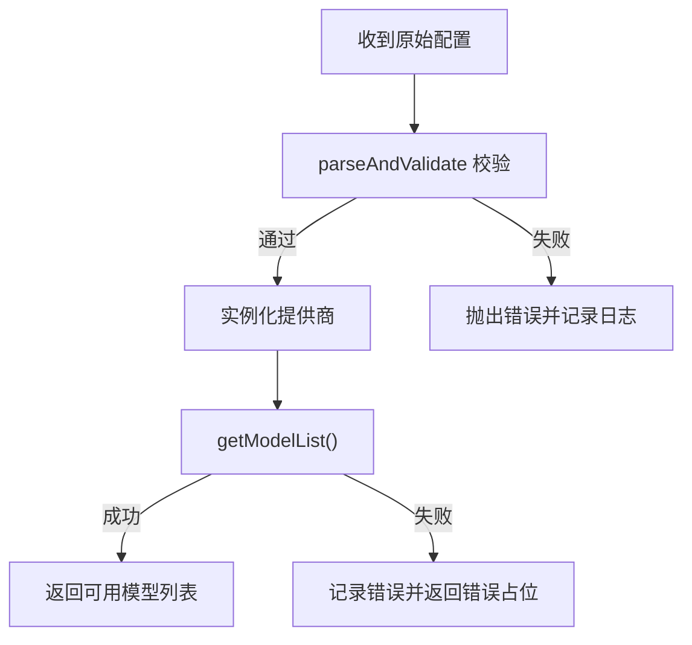
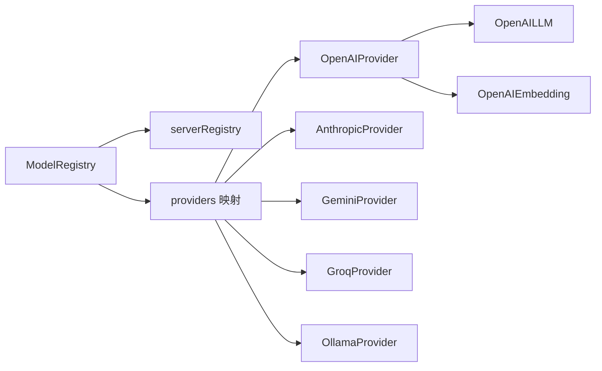

# 模型管理架构

<cite>
**本文引用的文件**
- [src/lib/models/registry.ts](file://src/lib/models/registry.ts)
- [src/lib/models/types.ts](file://src/lib/models/types.ts)
- [src/lib/models/base/provider.ts](file://src/lib/models/base/provider.ts)
- [src/lib/models/base/llm.ts](file://src/lib/models/base/llm.ts)
- [src/lib/models/base/embedding.ts](file://src/lib/models/base/embedding.ts)
- [src/lib/models/providers/index.ts](file://src/lib/models/providers/index.ts)
- [src/lib/models/providers/openai/index.ts](file://src/lib/models/providers/openai/index.ts)
- [src/lib/models/providers/openai/openaiLLM.ts](file://src/lib/models/providers/openai/openaiLLM.ts)
- [src/lib/models/providers/openai/openaiEmbedding.ts](file://src/lib/models/providers/openai/openaiEmbedding.ts)
- [src/lib/models/providers/anthropic/index.ts](file://src/lib/models/providers/anthropic/index.ts)
- [src/lib/models/providers/gemini/index.ts](file://src/lib/models/providers/gemini/index.ts)
- [src/lib/models/providers/groq/index.ts](file://src/lib/models/providers/groq/index.ts)
- [src/lib/models/providers/ollama/index.ts](file://src/lib/models/providers/ollama/index.ts)
- [src/lib/config/serverRegistry.ts](file://src/lib/config/serverRegistry.ts)
- [src/lib/config/types.ts](file://src/lib/config/types.ts)
</cite>

## 目录
1. [简介](#简介)
2. [项目结构](#项目结构)
3. [核心组件](#核心组件)
4. [架构总览](#架构总览)
5. [组件详解](#组件详解)
6. [依赖关系分析](#依赖关系分析)
7. [性能与并发](#性能与并发)
8. [故障排查指南](#故障排查指南)
9. [结论](#结论)
10. [附录：扩展与最佳实践](#附录扩展与最佳实践)

## 简介
本文件系统性阐述 Perplexica 的模型管理架构，重点覆盖以下方面：
- 抽象工厂模式在模型提供商注册与实例化中的应用
- 动态模型加载机制与提供商配置管理
- 统一接口设计与多提供商适配策略
- 模型实例化流程、配置校验与错误恢复
- 缓存策略、并发访问控制与资源管理
- 扩展接口与自定义提供商集成最佳实践

## 项目结构
模型管理相关代码主要位于 src/lib/models 及其子目录，采用“基类 + 提供商实现 + 注册表”的分层组织方式：
- 基类层：抽象出提供商、LLM、Embedding 的统一接口
- 提供商层：按 OpenAI、Anthropic、Google Gemini、Groq、Ollama 等分别实现
- 注册表层：集中管理已配置提供商、动态加载模型、增删改查提供商与模型

图表来源
- [src/lib/models/registry.ts](file://src/lib/models/registry.ts#L1-L222)
- [src/lib/models/providers/index.ts](file://src/lib/models/providers/index.ts#L1-L36)
- [src/lib/config/serverRegistry.ts](file://src/lib/config/serverRegistry.ts#L1-L16)
- [src/lib/config/types.ts](file://src/lib/config/types.ts#L1-L110)

章节来源
- [src/lib/models/registry.ts](file://src/lib/models/registry.ts#L1-L222)
- [src/lib/models/providers/index.ts](file://src/lib/models/providers/index.ts#L1-L36)
- [src/lib/config/serverRegistry.ts](file://src/lib/config/serverRegistry.ts#L1-L16)
- [src/lib/config/types.ts](file://src/lib/config/types.ts#L1-L110)

## 核心组件
- ModelRegistry：注册表，负责初始化活跃提供商、批量获取模型列表、按提供商与模型键加载 LLM/Embedding 实例，并支持动态增删改提供商与模型。
- BaseModelProvider：抽象提供商基类，定义统一的模型清单获取、默认模型清单、LLM/Embedding 加载方法及配置校验与元数据接口。
- BaseLLM/BaseEmbedding：抽象模型基类，定义文本生成、流式生成、对象抽取、嵌入等统一接口。
- 各提供商实现：如 OpenAI、Anthropic、Gemini、Groq、Ollama，各自实现 parseAndValidate、getDefaultModels、getModelList、loadChatModel/loadEmbeddingModel 等。
- 配置与类型：serverRegistry 提供已配置提供商读取；types 定义模型、提供商、生成选项、工具调用等统一类型。

章节来源
- [src/lib/models/registry.ts](file://src/lib/models/registry.ts#L8-L222)
- [src/lib/models/base/provider.ts](file://src/lib/models/base/provider.ts#L6-L46)
- [src/lib/models/base/llm.ts](file://src/lib/models/base/llm.ts#L10-L23)
- [src/lib/models/base/embedding.ts](file://src/lib/models/base/embedding.ts#L3-L10)
- [src/lib/config/serverRegistry.ts](file://src/lib/config/serverRegistry.ts#L4-L12)
- [src/lib/config/types.ts](file://src/lib/config/types.ts#L53-L76)

## 架构总览
整体采用“抽象工厂 + 注册表 + 配置驱动”的设计：
- 抽象工厂：BaseModelProvider 作为工厂接口，各提供商实现具体工厂；createProviderInstance 负责解析与校验配置后实例化。
- 注册表：ModelRegistry 通过 serverRegistry 读取配置，构建活跃提供商集合；对外暴露统一的模型加载与管理接口。
- 统一接口：BaseLLM/BaseEmbedding 定义跨提供商一致的调用契约，屏蔽底层差异。
- 配置驱动：各提供商通过 parseAndValidate 校验配置，通过 getDefaultModels + 配置合并得到最终可用模型清单。

图表来源
- [src/lib/models/base/provider.ts](file://src/lib/models/base/provider.ts#L6-L46)
- [src/lib/models/base/llm.ts](file://src/lib/models/base/llm.ts#L10-L23)
- [src/lib/models/base/embedding.ts](file://src/lib/models/base/embedding.ts#L3-L10)
- [src/lib/models/providers/openai/index.ts](file://src/lib/models/providers/openai/index.ts#L133-L227)
- [src/lib/models/providers/openai/openaiLLM.ts](file://src/lib/models/providers/openai/openaiLLM.ts#L30-L276)
- [src/lib/models/providers/openai/openaiEmbedding.ts](file://src/lib/models/providers/openai/openaiEmbedding.ts#L11-L43)
- [src/lib/models/registry.ts](file://src/lib/models/registry.ts#L8-L222)

## 组件详解

### 抽象工厂与提供商注册表
- 抽象工厂模式体现在 BaseModelProvider 中：统一定义 getDefaultModels、getModelList、loadChatModel、loadEmbeddingModel 等接口，由各提供商实现具体逻辑；createProviderInstance 负责 parseAndValidate 与实例化。
- 注册表 ModelRegistry 在构造时读取已配置提供商，逐个实例化并缓存在内存中；提供异步批量获取模型列表、按提供商与模型键加载实例的能力；支持动态增删改提供商与模型。

图表来源
- [src/lib/models/registry.ts](file://src/lib/models/registry.ts#L17-L72)
- [src/lib/config/serverRegistry.ts](file://src/lib/config/serverRegistry.ts#L4-L12)
- [src/lib/models/base/provider.ts](file://src/lib/models/base/provider.ts#L35-L43)

章节来源
- [src/lib/models/base/provider.ts](file://src/lib/models/base/provider.ts#L6-L46)
- [src/lib/models/registry.ts](file://src/lib/models/registry.ts#L8-L35)

### 统一接口设计与适配策略
- 统一接口：BaseLLM/BaseEmbedding 定义 generateText/streamText/generateObject/streamObject/embedText/embedChunks 等跨提供商一致的方法签名，便于上层调用与测试替身。
- 适配策略：各提供商内部对第三方 SDK 进行封装，负责消息格式转换、参数映射、流式解析与错误处理，确保对外暴露的接口稳定。

图表来源
- [src/lib/models/base/llm.ts](file://src/lib/models/base/llm.ts#L10-L23)
- [src/lib/models/base/embedding.ts](file://src/lib/models/base/embedding.ts#L3-L10)
- [src/lib/models/providers/openai/openaiLLM.ts](file://src/lib/models/providers/openai/openaiLLM.ts#L72-L125)
- [src/lib/models/providers/openai/openaiEmbedding.ts](file://src/lib/models/providers/openai/openaiEmbedding.ts#L23-L39)

章节来源
- [src/lib/models/base/llm.ts](file://src/lib/models/base/llm.ts#L10-L23)
- [src/lib/models/base/embedding.ts](file://src/lib/models/base/embedding.ts#L3-L10)

### 动态模型加载机制
- 模型加载流程：ModelRegistry 根据 providerId 查找活跃提供商，再调用提供商的 loadChatModel/loadEmbeddingModel；提供商内部先校验模型键是否在当前可用模型清单中，再实例化具体模型对象。
- OpenAI 示例：loadChatModel 先从 getModelList 获取可用模型，若不存在则抛错；存在则以 apiKey/baseURL/model 构造 OpenAILLM 返回。

图表来源
- [src/lib/models/registry.ts](file://src/lib/models/registry.ts#L74-L82)
- [src/lib/models/providers/openai/index.ts](file://src/lib/models/providers/openai/index.ts#L165-L181)

章节来源
- [src/lib/models/registry.ts](file://src/lib/models/registry.ts#L74-L92)
- [src/lib/models/providers/openai/index.ts](file://src/lib/models/providers/openai/index.ts#L165-L181)

### 配置验证与错误恢复
- 配置验证：各提供商实现 parseAndValidate，对必填项进行校验并返回规范化配置；createProviderInstance 在实例化前统一调用该方法。
- 错误恢复：ModelRegistry 在获取模型列表失败时记录错误并返回包含错误信息的占位模型；新增/更新提供商时同样捕获异常并返回错误占位，保证系统可用性。

图表来源
- [src/lib/models/base/provider.ts](file://src/lib/models/base/provider.ts#L22-L25)
- [src/lib/models/registry.ts](file://src/lib/models/registry.ts#L113-L129)

章节来源
- [src/lib/models/base/provider.ts](file://src/lib/models/base/provider.ts#L22-L25)
- [src/lib/models/registry.ts](file://src/lib/models/registry.ts#L113-L129)

### 不同提供商的统一适配
- OpenAI：支持聊天与嵌入，默认模型清单来自内置常量；支持通过 baseURL 切换服务端点；提供 parseAndValidate 校验 apiKey/baseURL。
- Anthropic：仅支持聊天模型，通过远端 API 获取可用模型；不支持嵌入。
- Google Gemini：通过远端 API 判断模型能力，自动区分聊天与嵌入；支持聊天与嵌入。
- Groq：仅支持聊天模型，通过远端 API 获取可用模型；不支持嵌入。
- Ollama：本地/远程 Ollama 服务，通过 /api/tags 获取模型；同时支持聊天与嵌入。

章节来源
- [src/lib/models/providers/openai/index.ts](file://src/lib/models/providers/openai/index.ts#L133-L227)
- [src/lib/models/providers/anthropic/index.ts](file://src/lib/models/providers/anthropic/index.ts#L26-L116)
- [src/lib/models/providers/gemini/index.ts](file://src/lib/models/providers/gemini/index.ts#L27-L145)
- [src/lib/models/providers/groq/index.ts](file://src/lib/models/providers/groq/index.ts#L26-L114)
- [src/lib/models/providers/ollama/index.ts](file://src/lib/models/providers/ollama/index.ts#L29-L137)

### 类型与配置体系
- 统一类型：Model/ModelList/MinimalProvider/GenerateOptions/GenerateTextInput/GenerateTextOutput/StreamTextOutput 等，确保跨提供商的数据结构一致性。
- 配置类型：ConfigModelProvider 描述单个提供商的配置、名称、类型、模型列表与哈希；UIConfigField 描述配置表单字段与环境变量映射，用于前端渲染与注入。

章节来源
- [src/lib/models/types.ts](file://src/lib/models/types.ts#L4-L103)
- [src/lib/config/types.ts](file://src/lib/config/types.ts#L53-L96)

## 依赖关系分析
- 注册表依赖配置读取器与提供商映射；提供商映射集中管理所有可用提供商构造器；各提供商依赖各自的 LLM/Embedding 实现。
- 抽象基类向上提供统一接口，向下由具体提供商实现差异化细节，降低耦合度。

图表来源
- [src/lib/models/registry.ts](file://src/lib/models/registry.ts#L1-L222)
- [src/lib/models/providers/index.ts](file://src/lib/models/providers/index.ts#L12-L21)
- [src/lib/config/serverRegistry.ts](file://src/lib/config/serverRegistry.ts#L4-L12)

章节来源
- [src/lib/models/registry.ts](file://src/lib/models/registry.ts#L1-L222)
- [src/lib/models/providers/index.ts](file://src/lib/models/providers/index.ts#L1-L36)
- [src/lib/config/serverRegistry.ts](file://src/lib/config/serverRegistry.ts#L1-L16)

## 性能与并发
- 并发访问控制：ModelRegistry 在获取模型列表时使用 Promise.all 并行拉取多个提供商的模型清单，提升初始化效率；但需注意下游提供商的网络请求并发限制与速率限制。
- 资源管理：LLM/Embedding 实例在提供商内部持有 SDK 客户端，建议在上层按需创建与复用，避免频繁创建销毁带来的连接开销。
- 缓存策略：当前实现未见显式缓存；可在以下层面考虑缓存：
  - 模型清单缓存：对远端 API 获取的模型清单设置 TTL，减少重复请求
  - 模型实例缓存：对常用模型实例进行 LRU 缓存，降低冷启动成本
  - 嵌入结果缓存：对相同输入文本的嵌入向量进行缓存，结合内容哈希
- 错误与超时：对远端调用增加超时与重试策略，避免阻塞主线程；对流式输出进行背压与取消控制。

[本节为通用性能讨论，无需列出具体文件来源]

## 故障排查指南
- 初始化失败：检查配置文件中提供商类型与必要字段是否正确；查看注册表初始化日志，定位 parseAndValidate 抛错或 getModelList 异常。
- 模型加载失败：确认模型键存在于 getModelList 返回的可用清单中；检查提供商内部校验逻辑与 SDK 认证信息。
- 远端调用异常：针对 OpenAI/Gemini/Anthropic/Groq/Ollama 的网络请求，检查 baseURL、API Key、网络连通性与限流状态。
- 流式输出问题：关注流式解析的 JSON 片段修复与增量拼接逻辑，确保部分 JSON 解析失败时不会中断整个流。

章节来源
- [src/lib/models/registry.ts](file://src/lib/models/registry.ts#L29-L34)
- [src/lib/models/registry.ts](file://src/lib/models/registry.ts#L44-L60)
- [src/lib/models/providers/openai/openaiLLM.ts](file://src/lib/models/providers/openai/openaiLLM.ts#L216-L230)

## 结论
Perplexica 的模型管理架构通过抽象工厂与注册表实现了对多提供商的统一接入与动态管理。抽象基类确保了跨提供商的一致性接口，而各提供商实现则负责差异化适配与错误恢复。配合配置驱动与类型系统，整体具备良好的可扩展性与可维护性。建议在现有基础上引入模型清单与实例缓存、完善超时与重试策略，并在上层增加并发与资源池控制，以进一步提升稳定性与性能。

[本节为总结性内容，无需列出具体文件来源]

## 附录：扩展与最佳实践
- 新增提供商步骤
  - 在 providers 目录下创建新提供商目录与实现，继承 BaseModelProvider，实现 parseAndValidate/getProviderConfigFields/getProviderMetadata/getDefaultModels/getModelList/loadChatModel/loadEmbeddingModel
  - 在 providers/index.ts 中注册新的提供商构造器
  - 在配置类型中补充 UI 表单字段与环境变量映射
  - 在 ModelRegistry 中无需额外改动即可被动态加载
- 最佳实践
  - 配置校验：严格区分必填项与可选项，提供合理的默认值与环境变量回退
  - 错误恢复：对远端调用进行超时与指数退避重试；对不可恢复错误返回结构化的错误占位
  - 流式输出：确保增量解析的健壮性，对异常片段进行容错与日志记录
  - 缓存与并发：对模型清单与实例进行缓存；对并发请求进行限流与熔断
  - 单元测试：为 parseAndValidate 与 getModelList 提供测试用例，覆盖正常与异常路径

章节来源
- [src/lib/models/providers/index.ts](file://src/lib/models/providers/index.ts#L12-L21)
- [src/lib/config/types.ts](file://src/lib/config/types.ts#L85-L96)
- [src/lib/models/registry.ts](file://src/lib/models/registry.ts#L94-L141)