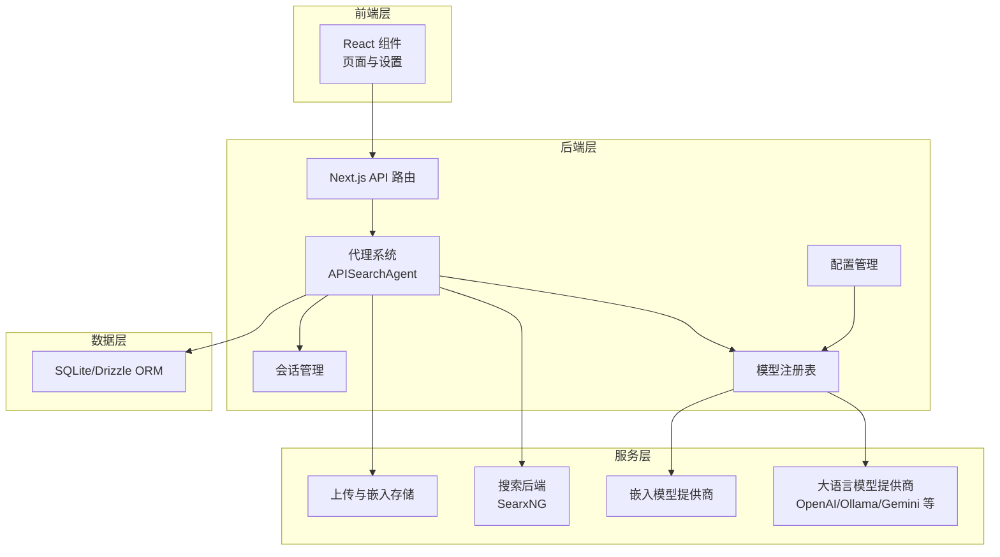
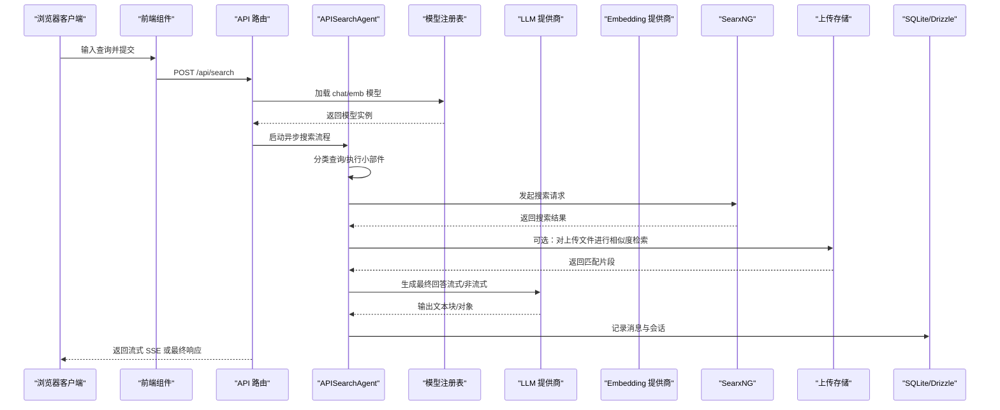
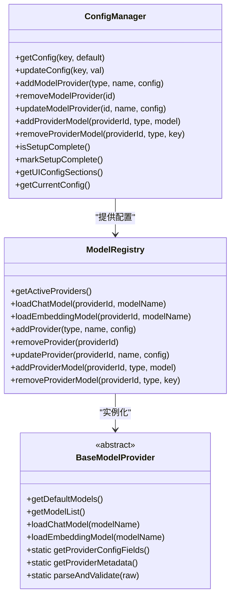
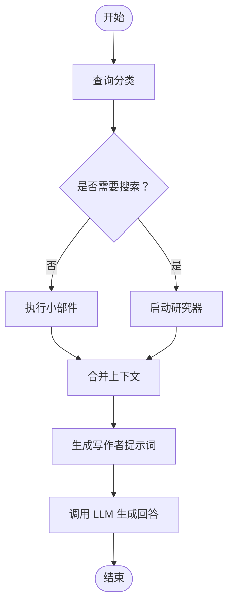
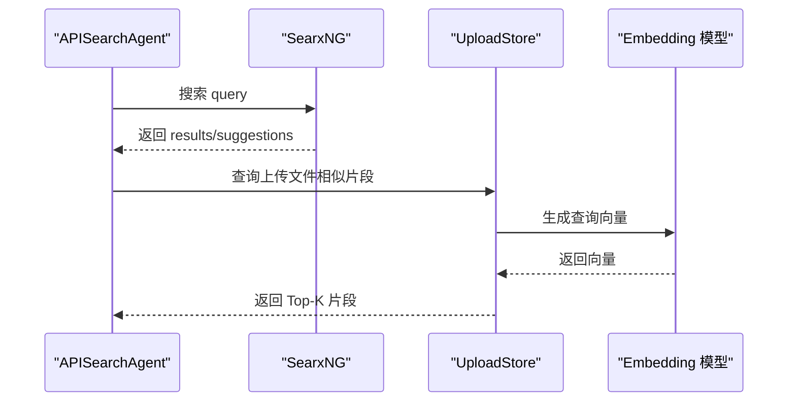
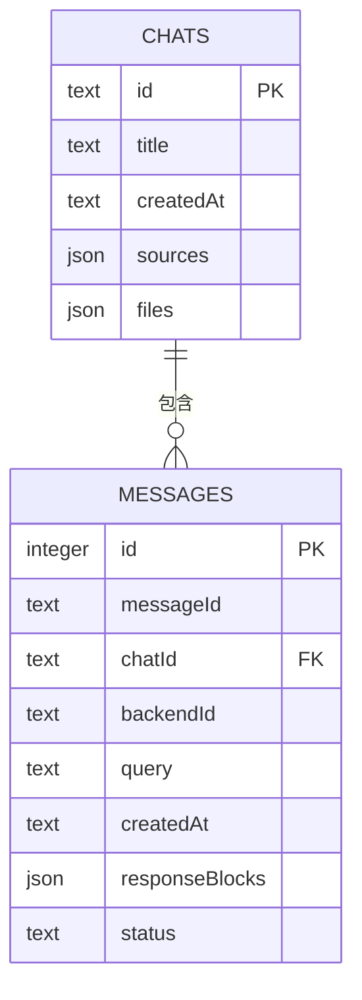
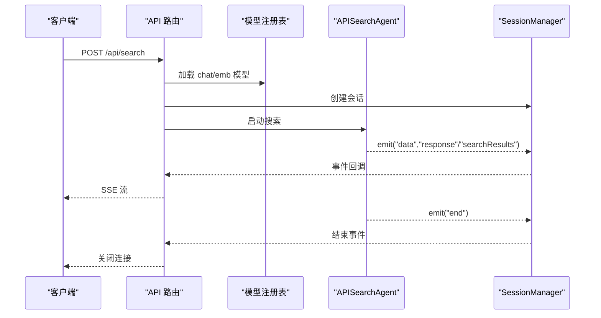
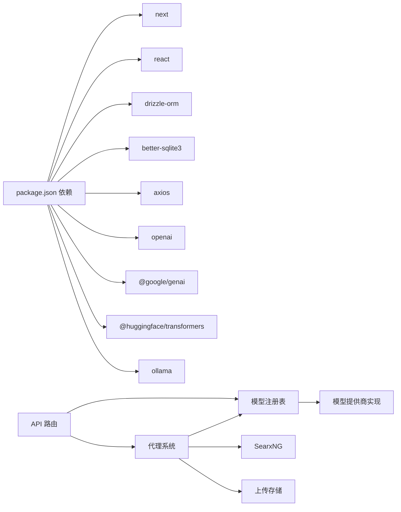

# 系统概览

<cite>
**本文引用的文件**
- [README.md](file://README.md)
- [package.json](file://package.json)
- [src/app/layout.tsx](file://src/app/layout.tsx)
- [src/lib/config/index.ts](file://src/lib/config/index.ts)
- [src/lib/config/serverRegistry.ts](file://src/lib/config/serverRegistry.ts)
- [src/lib/models/registry.ts](file://src/lib/models/registry.ts)
- [src/lib/models/base/provider.ts](file://src/lib/models/base/provider.ts)
- [src/lib/models/providers/openai/openaiLLM.ts](file://src/lib/models/providers/openai/openaiLLM.ts)
- [src/lib/models/providers/openai/openaiEmbedding.ts](file://src/lib/models/providers/openai/openaiEmbedding.ts)
- [src/lib/searxng.ts](file://src/lib/searxng.ts)
- [src/lib/db/schema.ts](file://src/lib/db/schema.ts)
- [src/lib/session.ts](file://src/lib/session.ts)
- [src/lib/agents/search/api.ts](file://src/lib/agents/search/api.ts)
- [src/lib/agents/search/researcher/index.ts](file://src/lib/agents/search/researcher/index.ts)
- [src/lib/agents/search/widgets/index.ts](file://src/lib/agents/search/widgets/index.ts)
- [src/lib/uploads/store.ts](file://src/lib/uploads/store.ts)
- [src/app/api/search/route.ts](file://src/app/api/search/route.ts)
- [src/lib/actions.ts](file://src/lib/actions.ts)
</cite>

## 目录
1. [简介](#简介)
2. [项目结构](#项目结构)
3. [核心组件](#核心组件)
4. [架构总览](#架构总览)
5. [详细组件分析](#详细组件分析)
6. [依赖分析](#依赖分析)
7. [性能考虑](#性能考虑)
8. [故障排查指南](#故障排查指南)
9. [结论](#结论)

## 简介
本文件为 Perplexica 的系统概览文档，面向开发者与架构师，帮助快速理解该隐私优先的 AI 搜索与对话系统在 Next.js 全栈框架下的整体设计与实现思路。系统以“前端 UI + 后端 API + 代理系统 + 搜索后端 + 大语言模型 + 嵌入模型 + 存储系统”七大核心组件协同工作，围绕“本地硬件运行、隐私保护、多来源检索、多模型适配”的理念构建。

## 项目结构
- 技术栈：Next.js（App Router）、React、TypeScript、TailwindCSS、Drizzle ORM、SQLite、Axios、SearxNG、OpenAI/Ollama/Gemini 等。
- 部署方式：推荐使用 Docker，内置 SearxNG 或可接入外部 SearxNG 实例；亦支持源码构建与本地部署。
- 关键目录与职责：
  - src/app：Next.js App Router 页面与 API 路由，负责前端页面与后端接口。
  - src/components：可复用 UI 组件与业务组件（聊天、设置、发现等）。
  - src/lib：核心业务逻辑库，包含配置管理、模型注册表、代理系统、上传与嵌入、数据库模型、会话管理等。
  - data：持久化数据目录（容器挂载），用于保存配置与上传文件索引。
  - docs：架构与安装说明文档。

图表来源
- [src/app/layout.tsx](file://src/app/layout.tsx#L27-L59)
- [src/app/api/search/route.ts](file://src/app/api/search/route.ts#L19-L208)
- [src/lib/agents/search/api.ts](file://src/lib/agents/search/api.ts#L8-L99)
- [src/lib/models/registry.ts](file://src/lib/models/registry.ts#L8-L221)
- [src/lib/searxng.ts](file://src/lib/searxng.ts#L21-L53)
- [src/lib/uploads/store.ts](file://src/lib/uploads/store.ts#L20-L121)
- [src/lib/db/schema.ts](file://src/lib/db/schema.ts#L6-L38)

章节来源
- [README.md](file://README.md#L1-L267)
- [package.json](file://package.json#L1-L77)

## 核心组件
- 用户界面（UI）
  - 负责聊天、设置、发现、新闻、天气等卡片式组件展示；通过主题提供者与全局样式组织。
- API 路由（API Routes）
  - 提供搜索主入口，接收查询、历史、优化模式、来源与模型配置，返回流式或非流式响应。
- 代理系统（Search Agent）
  - 将用户查询分类为是否需要搜索、是否触发小部件执行；协调研究器（Researcher）与写作者（Writer Prompt）生成最终回答。
- 搜索后端（SearxNG）
  - 作为隐私友好的搜索引擎，支持多引擎聚合与 JSON 结果格式，供代理系统调用。
- LLM 模型（大语言模型）
  - 通过统一 Provider 接口抽象，支持 OpenAI、Ollama、Gemini 等；提供文本生成与流式输出能力。
- 嵌入模型（Embedding）
  - 为上传文件与网页内容生成向量，支撑相似度检索与上下文召回。
- 存储系统（SQLite/Drizzle）
  - 记录消息与会话元信息，支持块级增量更新与 JSON 字段存储。

章节来源
- [src/app/layout.tsx](file://src/app/layout.tsx#L27-L59)
- [src/app/api/search/route.ts](file://src/app/api/search/route.ts#L19-L208)
- [src/lib/agents/search/api.ts](file://src/lib/agents/search/api.ts#L8-L99)
- [src/lib/searxng.ts](file://src/lib/searxng.ts#L21-L53)
- [src/lib/models/registry.ts](file://src/lib/models/registry.ts#L8-L221)
- [src/lib/db/schema.ts](file://src/lib/db/schema.ts#L6-L38)

## 架构总览
系统采用前后端分离的 Next.js 设计：前端负责渲染与交互，后端 API 路由承担业务编排与数据处理。代理系统作为中枢，结合模型注册表加载 LLM 与 Embedding，调用 SearxNG 获取结果，并通过会话管理实现事件驱动的流式输出。

图表来源
- [src/app/api/search/route.ts](file://src/app/api/search/route.ts#L19-L208)
- [src/lib/agents/search/api.ts](file://src/lib/agents/search/api.ts#L8-L99)
- [src/lib/models/registry.ts](file://src/lib/models/registry.ts#L74-L92)
- [src/lib/searxng.ts](file://src/lib/searxng.ts#L21-L53)
- [src/lib/uploads/store.ts](file://src/lib/uploads/store.ts#L54-L98)
- [src/lib/db/schema.ts](file://src/lib/db/schema.ts#L6-L38)

## 详细组件分析

### 配置与模型注册体系
- 配置管理（ConfigManager）
  - 负责读取/写入 data/config.json，支持环境变量注入与迁移；维护模型提供商列表、搜索配置与 UI 配置分组。
- 模型注册表（ModelRegistry）
  - 基于已配置的提供商动态创建实例，统一暴露加载 LLM 与 Embedding 的方法；支持增删改查与模型清单获取。
- Provider 抽象（BaseModelProvider）
  - 定义统一接口：默认/可用模型清单、加载模型、解析与校验配置、提供 UI 字段与元数据。

图表来源
- [src/lib/config/index.ts](file://src/lib/config/index.ts#L7-L390)
- [src/lib/models/registry.ts](file://src/lib/models/registry.ts#L8-L221)
- [src/lib/models/base/provider.ts](file://src/lib/models/base/provider.ts#L6-L45)

章节来源
- [src/lib/config/index.ts](file://src/lib/config/index.ts#L1-L391)
- [src/lib/models/registry.ts](file://src/lib/models/registry.ts#L1-L222)
- [src/lib/models/base/provider.ts](file://src/lib/models/base/provider.ts#L1-L46)

### 搜索与代理系统
- APISearchAgent
  - 对输入进行分类，决定是否需要搜索与是否执行小部件；并行执行小部件与搜索，最后拼接上下文并调用 LLM 生成回答。
- Researcher
  - 负责具体的研究流程（如学术/网络/讨论/上传内容检索），产出可引用的结果集。
- Widget 执行器
  - 在无需外部搜索时，直接执行天气、股票、计算等小部件，提供即时上下文。

图表来源
- [src/lib/agents/search/api.ts](file://src/lib/agents/search/api.ts#L8-L99)
- [src/lib/agents/search/researcher/index.ts](file://src/lib/agents/search/researcher/index.ts)
- [src/lib/agents/search/widgets/index.ts](file://src/lib/agents/search/widgets/index.ts)

章节来源
- [src/lib/agents/search/api.ts](file://src/lib/agents/search/api.ts#L1-L100)

### 搜索后端与上传存储
- SearxNG 集成
  - 通过统一函数封装搜索请求，支持分类、引擎、语言、分页等参数，返回结果与建议。
- 上传存储（UploadStore）
  - 将上传文件切分为块，利用嵌入模型生成向量并缓存；提供基于余弦相似度的检索，支持去重与打分融合。

图表来源
- [src/lib/searxng.ts](file://src/lib/searxng.ts#L21-L53)
- [src/lib/uploads/store.ts](file://src/lib/uploads/store.ts#L54-L98)

章节来源
- [src/lib/searxng.ts](file://src/lib/searxng.ts#L1-L54)
- [src/lib/uploads/store.ts](file://src/lib/uploads/store.ts#L1-L122)

### 数据模型与会话管理
- 数据模型（Drizzle ORM + SQLite）
  - messages 表记录消息块与状态；chats 表记录会话标题、来源与文件列表。
- 会话管理（SessionManager）
  - 基于 EventEmitter 的事件总线，支持订阅/取消订阅、块级增量更新、TTL 清理与流式传输。

图表来源
- [src/lib/db/schema.ts](file://src/lib/db/schema.ts#L6-L38)

章节来源
- [src/lib/db/schema.ts](file://src/lib/db/schema.ts#L1-L39)
- [src/lib/session.ts](file://src/lib/session.ts#L1-L106)

### API 路由与流式输出
- API 入口
  - /api/search 接收查询、历史、优化模式、来源与模型配置；并行加载 LLM 与 Embedding，创建会话并启动代理。
- 流式响应
  - 使用 ReadableStream 与 SSE 协议，按事件推送“响应片段”“搜索结果”“完成”等，前端实时渲染。

图表来源
- [src/app/api/search/route.ts](file://src/app/api/search/route.ts#L19-L208)
- [src/lib/session.ts](file://src/lib/session.ts#L45-L102)
- [src/lib/agents/search/api.ts](file://src/lib/agents/search/api.ts#L88-L95)

章节来源
- [src/app/api/search/route.ts](file://src/app/api/search/route.ts#L1-L209)
- [src/lib/session.ts](file://src/lib/session.ts#L1-L106)

## 依赖分析
- 运行时依赖
  - Next.js、React、TailwindCSS、Axios、Drizzle ORM、better-sqlite3、@google/genai、@huggingface/transformers、ollama、openai 等。
- 开发与工具
  - TypeScript、ESLint、Prettier、TailwindCSS、drizzle-kit 等。
- 组件耦合
  - API 路由依赖模型注册表与代理系统；代理系统依赖模型提供商、SearxNG 与上传存储；配置管理贯穿模型提供商与搜索配置。

图表来源
- [package.json](file://package.json#L13-L53)
- [src/app/api/search/route.ts](file://src/app/api/search/route.ts#L1-L209)
- [src/lib/models/registry.ts](file://src/lib/models/registry.ts#L1-L222)

章节来源
- [package.json](file://package.json#L1-L77)

## 性能考虑
- 并行加载与执行
  - API 路由中并行加载 LLM 与 Embedding，代理系统中并行执行小部件与搜索，减少端到端延迟。
- 流式输出
  - SSE 流式推送，前端可边接收边渲染，改善感知性能。
- 相似度检索优化
  - UploadStore 使用向量化与相似度打分融合，Top-K 截断降低上下文规模。
- 会话生命周期
  - SessionManager 设置 TTL 自动清理，避免内存泄漏。

## 故障排查指南
- 模型提供商未配置或不可用
  - 检查配置文件与环境变量；确认提供商类型与必要字段完整；查看注册表错误日志。
- SearxNG 请求失败
  - 校验 SEARXNG_API_URL、JSON 格式启用与引擎配置；关注返回状态与错误信息。
- Ollama/Gemini/OpenAI 等连接问题
  - 根据平台调整 API URL（如 host.docker.internal）；确保端口未被防火墙阻断；核对 API Key。
- 上传文件检索异常
  - 确认文件已成功切片与嵌入；检查嵌入模型可用性与向量维度一致性。

章节来源
- [src/lib/config/index.ts](file://src/lib/config/index.ts#L175-L238)
- [src/lib/searxng.ts](file://src/lib/searxng.ts#L43-L45)
- [src/lib/uploads/store.ts](file://src/lib/uploads/store.ts#L32-L51)

## 结论
Perplexica 以“隐私优先、本地运行、多模型与多来源检索”为核心目标，通过 Next.js 全栈架构与模块化的代理系统，实现了从查询分类、搜索聚合、小部件执行到 LLM 写作的一体化流程。配置与模型注册表提供了灵活的扩展点；SearxNG 与上传存储保障了检索质量与多样性；Drizzle ORM 与会话管理确保了数据与交互的稳定性。该设计既适合个人部署，也为后续扩展更多模型与来源奠定了坚实基础。