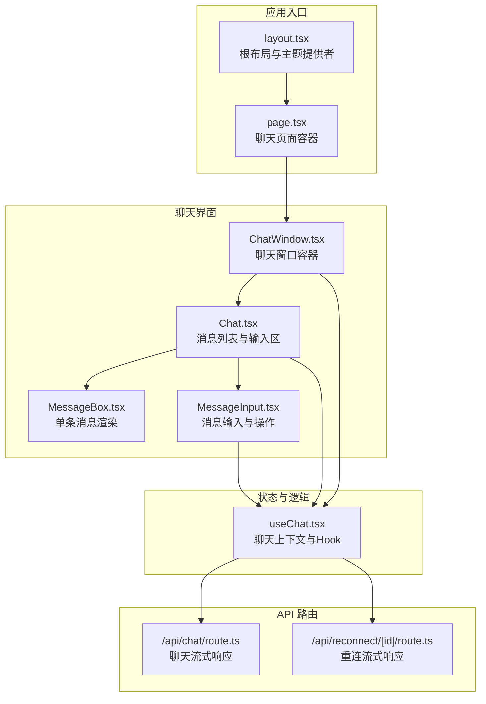
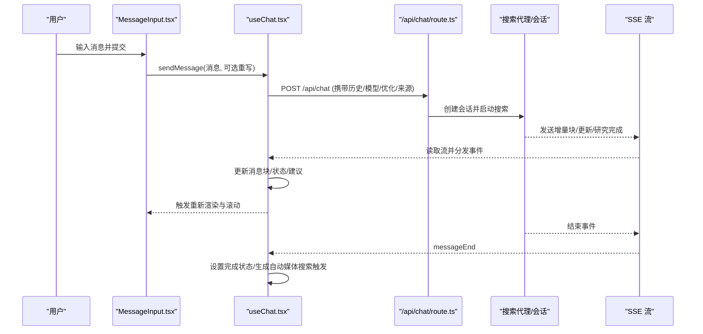
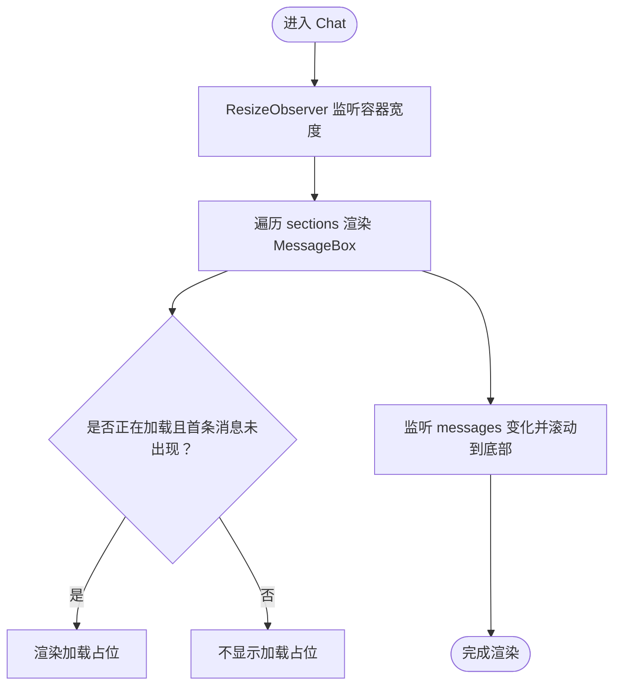
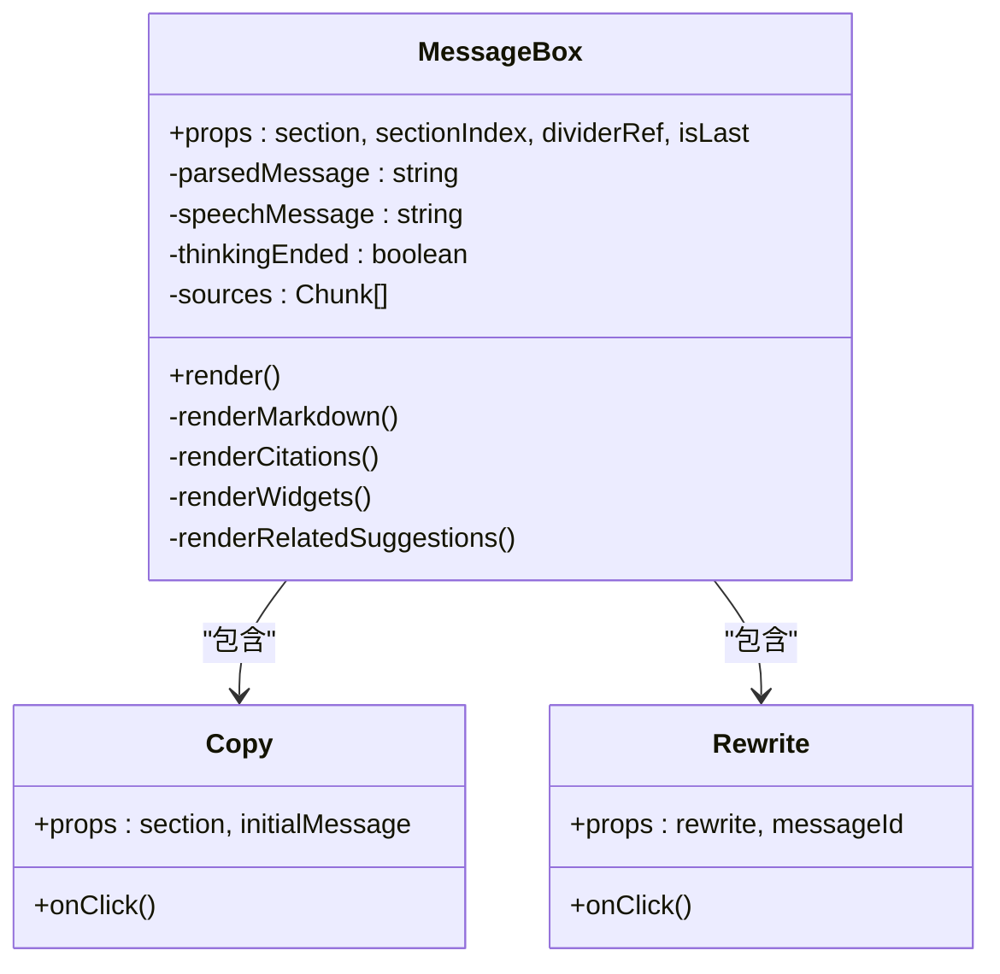
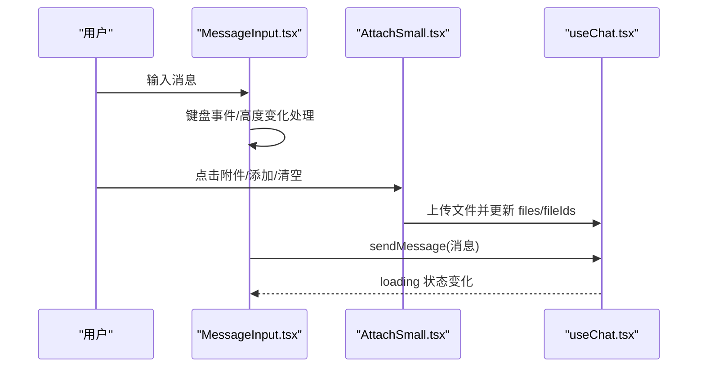
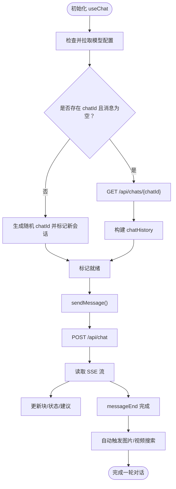
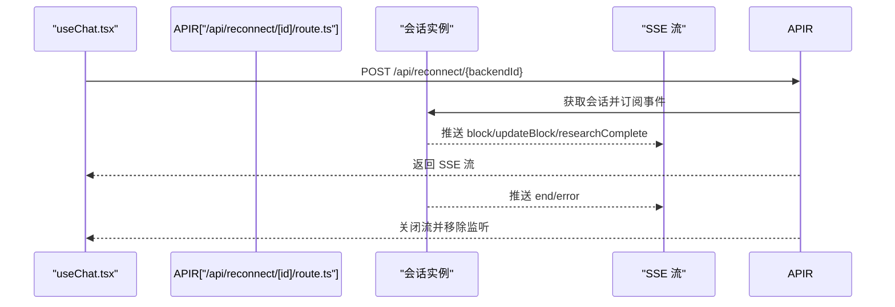
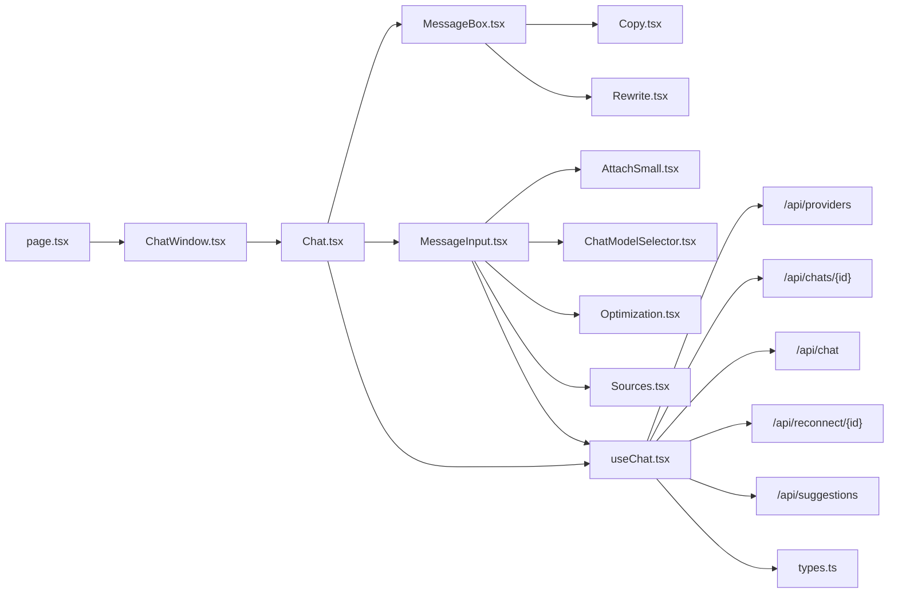

# 组件交互设计

<cite>
**本文档引用的文件**
- [README.md](file://README.md)
- [layout.tsx](file://src/app/layout.tsx)
- [page.tsx](file://src/app/c/[chatId]/page.tsx)
- [ChatWindow.tsx](file://src/components/ChatWindow.tsx)
- [Chat.tsx](file://src/components/Chat.tsx)
- [MessageBox.tsx](file://src/components/MessageBox.tsx)
- [MessageInput.tsx](file://src/components/MessageInput.tsx)
- [useChat.tsx](file://src/lib/hooks/useChat.tsx)
- [route.ts（聊天API）](file://src/app/api/chat/route.ts)
- [route.ts（重连API）](file://src/app/api/reconnect/[id]/route.ts)
- [actions.ts](file://src/lib/actions.ts)
- [types.ts](file://src/lib/types.ts)
- [Copy.tsx](file://src/components/MessageActions/Copy.tsx)
- [Rewrite.tsx](file://src/components/MessageActions/Rewrite.tsx)
- [AttachSmall.tsx](file://src/components/MessageInputActions/AttachSmall.tsx)
- [ChatModelSelector.tsx](file://src/components/MessageInputActions/ChatModelSelector.tsx)
- [Optimization.tsx](file://src/components/MessageInputActions/Optimization.tsx)
- [Sources.tsx](file://src/components/MessageInputActions/Sources.tsx)
</cite>

## 目录
1. [简介](#简介)
2. [项目结构](#项目结构)
3. [核心组件](#核心组件)
4. [架构总览](#架构总览)
5. [组件详细分析](#组件详细分析)
6. [依赖关系分析](#依赖关系分析)
7. [性能考量](#性能考量)
8. [故障排查指南](#故障排查指南)
9. [结论](#结论)
10. [附录](#附录)

## 简介
本文件面向 Perplexica 的前端组件交互设计，聚焦聊天组件、消息输入组件、消息显示组件与消息操作组件之间的协作机制。文档从状态传递、事件传播与数据绑定策略入手，解析前端与后端 API 路由的集成模式（含实时通信协议、错误处理与状态同步），并总结组件生命周期管理、内存优化与性能监控的实践建议，最后给出组件解耦、可复用性与扩展性的架构原则。

## 项目结构
Perplexica 前端采用 Next.js 应用程序目录结构，页面级路由位于 src/app 下，业务组件集中在 src/components 中，状态与逻辑通过自定义 Hook 暴露，API 路由位于 src/app/api 下。整体呈现“页面容器 + 组件库 + 自定义Hook + API 路由”的分层组织方式。

图表来源
- [layout.tsx](file://src/app/layout.tsx#L27-L59)
- [page.tsx](file://src/app/c/[chatId]/page.tsx#L1-L6)
- [ChatWindow.tsx](file://src/components/ChatWindow.tsx#L36-L74)
- [Chat.tsx](file://src/components/Chat.tsx#L9-L108)
- [MessageBox.tsx](file://src/components/MessageBox.tsx#L42-L290)
- [MessageInput.tsx](file://src/components/MessageInput.tsx#L8-L102)
- [useChat.tsx](file://src/lib/hooks/useChat.tsx#L270-L800)
- [route.ts（聊天API）](file://src/app/api/chat/route.ts#L103-L254)
- [route.ts（重连API）](file://src/app/api/reconnect/[id]/route.ts#L3-L93)

章节来源
- [layout.tsx](file://src/app/layout.tsx#L27-L59)
- [page.tsx](file://src/app/c/[chatId]/page.tsx#L1-L6)

## 核心组件
- 聊天窗口容器：负责错误态、空态与就绪态的切换，承载消息列表与输入区。
- 消息列表：维护消息分段（Section）与滚动行为，驱动输入区位置与遮罩。
- 单条消息渲染：解析文本块、渲染引用、研究步骤、小部件与相关建议。
- 消息输入：支持多行自适应、快捷键聚焦、附件上传、模型选择、优化模式与来源控制。
- 聊天上下文 Hook：统一管理消息、历史、文件、来源、模型配置、加载状态与重连逻辑；封装流式事件处理与建议生成。

章节来源
- [ChatWindow.tsx](file://src/components/ChatWindow.tsx#L36-L74)
- [Chat.tsx](file://src/components/Chat.tsx#L9-L108)
- [MessageBox.tsx](file://src/components/MessageBox.tsx#L42-L290)
- [MessageInput.tsx](file://src/components/MessageInput.tsx#L8-L102)
- [useChat.tsx](file://src/lib/hooks/useChat.tsx#L22-L800)

## 架构总览
前端通过 useChat Hook 作为状态中心，与后端 API 以 Server-Sent Events（SSE）进行实时通信。发送消息时，前端创建本地消息占位，调用 /api/chat 获取 SSE 流；在流中接收增量块（block）、更新块（updateBlock）、研究完成（researchComplete）与结束（messageEnd）等事件，逐步构建消息内容。若连接中断，前端通过 /api/reconnect/[id] 重连当前会话，恢复增量输出。

图表来源
- [MessageInput.tsx](file://src/components/MessageInput.tsx#L50-L62)
- [useChat.tsx](file://src/lib/hooks/useChat.tsx#L714-L800)
- [route.ts（聊天API）](file://src/app/api/chat/route.ts#L103-L254)

章节来源
- [useChat.tsx](file://src/lib/hooks/useChat.tsx#L550-L712)
- [route.ts（聊天API）](file://src/app/api/chat/route.ts#L155-L246)

## 组件详细分析

### 聊天窗口与消息列表
- ChatWindow 根据 isReady、notFound、hasError 控制渲染分支，空对话展示 EmptyChat，错误时提示连接失败，就绪后渲染 Chat。
- Chat 负责：
  - 计算消息分段（Section）并渲染 MessageBox 列表；
  - 使用 ResizeObserver 动态计算输入区宽度，确保固定定位正确；
  - 监听消息变化并自动滚动到底部；
  - 在 loading 且首条消息出现前显示加载占位。

图表来源
- [Chat.tsx](file://src/components/Chat.tsx#L17-L59)

章节来源
- [ChatWindow.tsx](file://src/components/ChatWindow.tsx#L36-L74)
- [Chat.tsx](file://src/components/Chat.tsx#L9-L108)

### 单条消息渲染与消息操作
- MessageBox 将消息拆分为 Section，解析文本块、引用、研究步骤、小部件与相关建议，并根据状态渲染语音播放、复制与重写操作。
- 复制操作会将正文与引用一并复制到剪贴板，并反馈“已复制”状态。
- 重写操作基于 messageId 回溯历史，删除后续消息并重新发起请求。

图表来源
- [MessageBox.tsx](file://src/components/MessageBox.tsx#L42-L290)
- [Copy.tsx](file://src/components/MessageActions/Copy.tsx#L7-L48)
- [Rewrite.tsx](file://src/components/MessageActions/Rewrite.tsx#L3-L20)

章节来源
- [MessageBox.tsx](file://src/components/MessageBox.tsx#L42-L290)
- [Copy.tsx](file://src/components/MessageActions/Copy.tsx#L7-L48)
- [Rewrite.tsx](file://src/components/MessageActions/Rewrite.tsx#L3-L20)

### 消息输入与输入动作
- MessageInput 支持单行/多行自适应、回车发送、快捷键聚焦、禁用态控制与按钮样式切换。
- 附件上传通过 AttachSmall 实现，支持多文件选择、上传进度反馈与文件列表弹出面板，上传成功后写入上下文状态。
- 模型选择器 ChatModelSelector 从 /api/providers 拉取可用模型并持久化到本地存储。
- 优化模式 Optimization 提供速度/平衡/质量三档，影响搜索策略。
- 来源控制 Sources 支持 Web/Academic/Social 三种来源的开关。

图表来源
- [MessageInput.tsx](file://src/components/MessageInput.tsx#L26-L62)
- [AttachSmall.tsx](file://src/components/MessageInputActions/AttachSmall.tsx#L19-L45)
- [useChat.tsx](file://src/lib/hooks/useChat.tsx#L714-L777)

章节来源
- [MessageInput.tsx](file://src/components/MessageInput.tsx#L8-L102)
- [AttachSmall.tsx](file://src/components/MessageInputActions/AttachSmall.tsx#L13-L159)
- [ChatModelSelector.tsx](file://src/components/MessageInputActions/ChatModelSelector.tsx#L11-L203)
- [Optimization.tsx](file://src/components/MessageInputActions/Optimization.tsx#L39-L114)
- [Sources.tsx](file://src/components/MessageInputActions/Sources.tsx#L33-L93)

### 聊天上下文与状态管理
- useChat 通过 Context 暴露 messages、sections、chatHistory、files、sources、优化模式、模型配置、加载状态与方法（sendMessage、rewrite、set*）。
- 初始化阶段：
  - 从 /api/providers 拉取模型配置并写入本地存储；
  - 若存在 chatId，则从 /api/chats/[id] 加载历史并构建 chatHistory；
  - 若无 chatId 或新会话，则生成随机 chatId。
- 发送消息流程：
  - 创建本地消息占位，设置 loading 状态；
  - 调用 /api/chat，读取 SSE 流，按事件类型更新消息块、状态与建议；
  - messageEnd 后设置完成状态并触发自动媒体搜索。
- 重连逻辑：
  - 若检测到未完成消息，调用 /api/reconnect/[backendId] 恢复流式输出。

图表来源
- [useChat.tsx](file://src/lib/hooks/useChat.tsx#L80-L172)
- [useChat.tsx](file://src/lib/hooks/useChat.tsx#L174-L239)
- [useChat.tsx](file://src/lib/hooks/useChat.tsx#L408-L461)
- [useChat.tsx](file://src/lib/hooks/useChat.tsx#L714-L800)
- [route.ts（聊天API）](file://src/app/api/chat/route.ts#L155-L246)

章节来源
- [useChat.tsx](file://src/lib/hooks/useChat.tsx#L270-L800)

### API 集成与实时通信
- /api/chat：接收消息体，校验参数，加载模型与嵌入，创建会话并返回 SSE 流；事件类型包括 block、updateBlock、researchComplete、messageEnd、error。
- /api/reconnect/[id]：根据 backendId 重连会话，向客户端推送增量事件直至 end 或 error。
- 建议生成：在消息结束且存在来源但无建议时，调用 /api/suggestions 生成相关建议并注入消息块。

图表来源
- [route.ts（重连API）](file://src/app/api/reconnect/[id]/route.ts#L3-L93)
- [useChat.tsx](file://src/lib/hooks/useChat.tsx#L408-L461)

章节来源
- [route.ts（聊天API）](file://src/app/api/chat/route.ts#L103-L254)
- [route.ts（重连API）](file://src/app/api/reconnect/[id]/route.ts#L3-L93)
- [actions.ts](file://src/lib/actions.ts#L1-L22)

## 依赖关系分析
- 页面容器与组件依赖：
  - page.tsx 仅引入 ChatWindow，形成页面级入口；
  - ChatWindow 依赖 Chat、EmptyChat、错误处理与加载组件；
  - Chat 依赖 MessageBox、MessageInput 与 useChat；
  - MessageBox 依赖消息操作组件、渲染器与多媒体搜索组件；
  - MessageInput 依赖附件上传与模型/优化/来源选择器。
- 状态与逻辑依赖：
  - useChat 依赖模型注册表、会话管理、SSE 读取、补丁应用与建议生成；
  - useChat 通过 fetch 调用 /api/providers、/api/chats、/api/chat、/api/reconnect、/api/suggestions。
- 类型与数据结构：
  - types.ts 定义消息、块类型与研究步骤，支撑前端对后端流式数据的解析与渲染。

图表来源
- [page.tsx](file://src/app/c/[chatId]/page.tsx#L1-L6)
- [ChatWindow.tsx](file://src/components/ChatWindow.tsx#L36-L74)
- [Chat.tsx](file://src/components/Chat.tsx#L9-L108)
- [MessageBox.tsx](file://src/components/MessageBox.tsx#L42-L290)
- [MessageInput.tsx](file://src/components/MessageInput.tsx#L8-L102)
- [AttachSmall.tsx](file://src/components/MessageInputActions/AttachSmall.tsx#L13-L159)
- [ChatModelSelector.tsx](file://src/components/MessageInputActions/ChatModelSelector.tsx#L11-L203)
- [Optimization.tsx](file://src/components/MessageInputActions/Optimization.tsx#L39-L114)
- [Sources.tsx](file://src/components/MessageInputActions/Sources.tsx#L33-L93)
- [Copy.tsx](file://src/components/MessageActions/Copy.tsx#L7-L48)
- [Rewrite.tsx](file://src/components/MessageActions/Rewrite.tsx#L3-L20)
- [useChat.tsx](file://src/lib/hooks/useChat.tsx#L270-L800)
- [route.ts（聊天API）](file://src/app/api/chat/route.ts#L103-L254)
- [route.ts（重连API）](file://src/app/api/reconnect/[id]/route.ts#L3-L93)
- [actions.ts](file://src/lib/actions.ts#L1-L22)
- [types.ts](file://src/lib/types.ts#L28-L124)

章节来源
- [types.ts](file://src/lib/types.ts#L28-L124)
- [useChat.tsx](file://src/lib/hooks/useChat.tsx#L270-L800)

## 性能考量
- 渲染优化
  - 使用 useMemo 将 messages 映射为 sections，避免重复解析与渲染。
  - 使用 ResizeObserver 动态计算输入区宽度，减少强制布局。
  - 仅在消息数量变化或首条消息出现时触发滚动，降低滚动开销。
- 流式传输
  - SSE 分块传输，前端逐条解析 JSON，边到边显，提升感知速度。
  - 对 messageEnd 进行去重处理，避免重复处理同一消息。
- 内存与资源
  - 重连时断开旧 reader 与监听，关闭 writer，防止内存泄漏。
  - 附件上传使用 FormData，上传完成后及时更新状态，避免冗余请求。
- 用户体验
  - loading 状态与禁用态明确反馈，避免重复提交。
  - 自动媒体搜索延迟触发，避免阻塞主消息渲染。

[本节为通用性能指导，无需特定文件引用]

## 故障排查指南
- 连接失败
  - ChatWindow 在 hasError 时显示“连接失败，请稍后再试”，检查网络与后端服务状态。
- 配置缺失
  - useChat 在检查配置阶段若未找到可用模型或提供者，会抛错并提示前往设置页配置。
- SSE 异常
  - 当后端返回 error 事件或流中断，前端会关闭 writer 并清理监听；检查 /api/chat 的异常日志。
- 重连问题
  - 若 /api/reconnect/[id] 返回 404，表示会话不存在；确认 backendId 与会话状态。
- 建议生成失败
  - /api/suggestions 请求失败不会中断消息显示，但相关建议不会出现；检查模型配置与网络。

章节来源
- [ChatWindow.tsx](file://src/components/ChatWindow.tsx#L39-L51)
- [useChat.tsx](file://src/lib/hooks/useChat.tsx#L80-L172)
- [route.ts（聊天API）](file://src/app/api/chat/route.ts#L199-L210)
- [route.ts（重连API）](file://src/app/api/reconnect/[id]/route.ts#L12-L14)
- [actions.ts](file://src/lib/actions.ts#L1-L22)

## 结论
Perplexica 的前端采用“上下文集中 + 组件解耦 + 流式渲染”的设计，通过 useChat 统一管理状态与事件，结合 SSE 实现实时增量输出与重连恢复。组件间通过 props 与 Context 解耦，消息输入与操作组件通过 Hook 注入能力，消息显示组件专注渲染与交互。该架构在可复用性与扩展性上具备良好基础：新增消息块类型、操作组件与来源即可沿用现有事件与状态更新路径。

[本节为总结性内容，无需特定文件引用]

## 附录

### 数据模型与事件类型
- 消息与块类型定义见 types.ts，涵盖文本、来源、建议、小部件与研究步骤等。
- SSE 事件类型：
  - block：新增或追加块；
  - updateBlock：对已有块进行补丁更新；
  - researchComplete：研究阶段完成；
  - messageEnd：消息生成结束；
  - error：错误事件。

章节来源
- [types.ts](file://src/lib/types.ts#L28-L124)
- [route.ts（聊天API）](file://src/app/api/chat/route.ts#L159-L211)