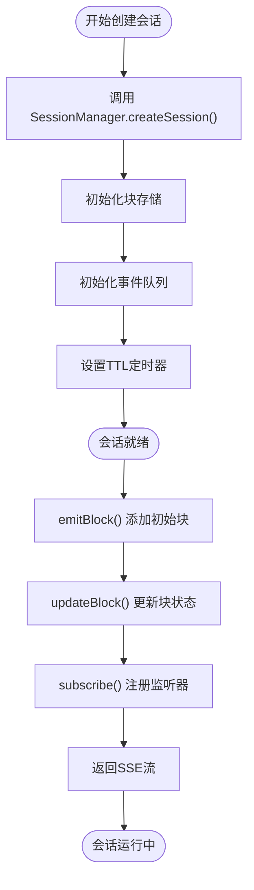

# 会话管理

<cite>
**本文档引用的文件**
- [session.ts](file://src/lib/session.ts)
- [useChat.tsx](file://src/lib/hooks/useChat.tsx)
- [chat/route.ts](file://src/app/api/chat/route.ts)
- [reconnect/[id]/route.ts](file://src/app/api/reconnect/[id]/route.ts)
- [types.ts](file://src/lib/types.ts)
- [ChatWindow.tsx](file://src/components/ChatWindow.tsx)
- [Chat.tsx](file://src/components/Chat.tsx)
- [ChatInput.tsx](file://src/components/MessageInput.tsx)
- [MessageBox.tsx](file://src/components/MessageBox.tsx)
- [chats/[id]/route.ts](file://src/app/api/chats/[id]/route.ts)
</cite>

## 目录
1. [简介](#简介)
2. [项目结构](#项目结构)
3. [核心组件](#核心组件)
4. [架构概览](#架构概览)
5. [详细组件分析](#详细组件分析)
6. [依赖关系分析](#依赖关系分析)
7. [性能考虑](#性能考虑)
8. [故障排除指南](#故障排除指南)
9. [结论](#结论)

## 简介

Perplexica 是一个基于 Next.js 的 AI 聊天应用，其核心会话管理系统采用事件驱动架构设计。该系统实现了完整的实时会话管理，包括会话生命周期管理、事件驱动架构、订阅机制、状态同步和重新连接机制。

会话管理系统的核心价值在于：
- 实时数据流处理：通过 Server-Sent Events (SSE) 实现双向实时通信
- 事件驱动架构：基于 EventEmitter 的事件发布/订阅模式
- 状态持久化：会话状态自动保存和恢复
- 错误处理：完善的异常捕获和错误传播机制
- 性能优化：内存管理和连接池优化

## 项目结构

会话管理系统主要分布在以下目录结构中：

```mermaid
graph TB
subgraph "前端组件层"
CW[ChatWindow.tsx]
C[Chat.tsx]
MI[MessageInput.tsx]
MB[MessageBox.tsx]
end
subgraph "Hook 层"
UC[useChat.tsx]
end
subgraph "会话管理层"
SM[SessionManager]
T[types.ts]
end
subgraph "API 层"
CR[chat/route.ts]
RR[reconnect/[id]/route.ts]
GR[chats/[id]/route.ts]
end
CW --> UC
C --> UC
MI --> UC
MB --> UC
UC --> SM
SM --> CR
SM --> RR
CR --> SM
RR --> SM
UC --> CR
UC --> RR
UC --> GR
```

**图表来源**
- [ChatWindow.tsx](file://src/components/ChatWindow.tsx#L1-L76)
- [useChat.tsx](file://src/lib/hooks/useChat.tsx#L1-L848)
- [session.ts](file://src/lib/session.ts#L1-L106)
- [chat/route.ts](file://src/app/api/chat/route.ts#L1-L255)

**章节来源**
- [session.ts](file://src/lib/session.ts#L1-L106)
- [useChat.tsx](file://src/lib/hooks/useChat.tsx#L1-L848)

## 核心组件

### SessionManager 类

SessionManager 是会话管理系统的核心类，负责管理所有会话的状态和事件。


**图表来源**
- [session.ts](file://src/lib/session.ts#L11-L103)
- [types.ts](file://src/lib/types.ts#L118-L124)

### 事件类型定义

系统支持多种事件类型，每种事件都有特定的数据格式：

| 事件类型 | 数据结构 | 描述 |
|---------|----------|------|
| `block` | `{ type: 'block', block: Block }` | 新增或更新块数据 |
| `updateBlock` | `{ type: 'updateBlock', blockId: string, patch: any[] }` | 块数据增量更新 |
| `researchComplete` | `{ type: 'researchComplete' }` | 研究完成信号 |
| `messageEnd` | `{ type: 'messageEnd' }` | 消息处理结束 |
| `error` | `{ type: 'error', data: string }` | 错误信息 |

**章节来源**
- [session.ts](file://src/lib/session.ts#L45-L74)
- [types.ts](file://src/lib/types.ts#L39-L124)

## 架构概览

会话管理系统的整体架构采用分层设计，从底层到上层依次为：数据层、会话管理层、API 层、Hook 层、组件层。


**图表来源**
- [useChat.tsx](file://src/lib/hooks/useChat.tsx#L714-L800)
- [chat/route.ts](file://src/app/api/chat/route.ts#L153-L226)
- [reconnect/[id]/route.ts](file://src/app/api/reconnect/[id]/route.ts#L20-L72)

## 详细组件分析

### 会话生命周期管理

会话生命周期包括创建、维护、销毁三个阶段：

#### 会话创建阶段



**图表来源**
- [session.ts](file://src/lib/session.ts#L19-L25)
- [session.ts](file://src/lib/session.ts#L35-L39)

#### 会话维护阶段

会话维护阶段主要处理实时数据流和状态同步：


**图表来源**
- [session.ts](file://src/lib/session.ts#L50-L74)
- [chat/route.ts](file://src/app/api/chat/route.ts#L159-L211)

#### 会话销毁阶段

会话销毁采用自动清理机制：


**图表来源**
- [session.ts](file://src/lib/session.ts#L17-L25)

**章节来源**
- [session.ts](file://src/lib/session.ts#L19-L25)

### 重新连接机制

重新连接机制确保在网络中断后能够恢复会话状态：


**图表来源**
- [useChat.tsx](file://src/lib/hooks/useChat.tsx#L408-L461)
- [reconnect/[id]/route.ts](file://src/app/api/reconnect/[id]/route.ts#L10-L72)

重新连接的关键特性：
- **事件重放**：自动重放断线期间的历史事件
- **状态同步**：确保客户端状态与服务器状态一致
- **防重复处理**：避免重复处理已处理的消息
- **资源清理**：正确清理断开的连接和监听器

**章节来源**
- [useChat.tsx](file://src/lib/hooks/useChat.tsx#L408-L461)
- [reconnect/[id]/route.ts](file://src/app/api/reconnect/[id]/route.ts#L20-L72)

### Hook 集成机制

useChat Hook 提供了完整的会话管理接口：


**图表来源**
- [useChat.tsx](file://src/lib/hooks/useChat.tsx#L31-L62)

Hook 的主要功能：
- **配置检查**：验证模型配置的有效性
- **消息加载**：从数据库加载历史消息
- **消息发送**：处理用户消息发送逻辑
- **重新连接**：实现断线重连机制
- **状态管理**：维护聊天状态的完整性

**章节来源**
- [useChat.tsx](file://src/lib/hooks/useChat.tsx#L31-L62)

### 组件集成示例

会话管理系统与 React 组件的集成方式：


**图表来源**
- [ChatWindow.tsx](file://src/components/ChatWindow.tsx#L36-L74)
- [Chat.tsx](file://src/components/Chat.tsx#L9-L109)

**章节来源**
- [ChatWindow.tsx](file://src/components/ChatWindow.tsx#L36-L74)
- [Chat.tsx](file://src/components/Chat.tsx#L9-L109)

## 依赖关系分析

会话管理系统的依赖关系呈现清晰的分层结构：


**图表来源**
- [session.ts](file://src/lib/session.ts#L1-L3)
- [useChat.tsx](file://src/lib/hooks/useChat.tsx#L1-L21)

**章节来源**
- [session.ts](file://src/lib/session.ts#L1-L3)
- [useChat.tsx](file://src/lib/hooks/useChat.tsx#L1-L21)

## 性能考虑

### 内存管理策略

会话管理系统采用了多重内存管理策略：

1. **TTL 自动清理**：每个会话30分钟自动过期清理
2. **事件队列限制**：只保留最近的事件用于重放
3. **块数据缓存**：使用 Map 结构高效管理块数据
4. **监听器清理**：及时移除不再使用的事件监听器

### 连接池优化

系统通过以下方式优化连接管理：
- **SSE 连接复用**：单个会话可多次重连而不创建新连接
- **监听器去重**：避免重复注册相同的事件监听器
- **资源回收**：断开连接时立即释放相关资源

### 并发控制


**图表来源**
- [session.ts](file://src/lib/session.ts#L27-L39)

**章节来源**
- [session.ts](file://src/lib/session.ts#L17-L25)

## 故障排除指南

### 常见问题及解决方案

#### 会话未找到错误

**症状**：重新连接时返回 "Session not found"

**原因分析**：
- 会话已过期自动清理
- 会话 ID 不正确
- 服务器重启导致会话丢失

**解决方法**：
1. 检查会话 ID 是否正确传递
2. 确认会话仍在有效期内（30分钟）
3. 重新发起新的聊天请求创建会话

#### SSE 连接中断

**症状**：实时消息传输中断

**原因分析**：
- 网络连接不稳定
- 服务器负载过高
- 客户端浏览器限制

**解决方法**：
1. 检查网络连接稳定性
2. 查看服务器日志确认服务状态
3. 在客户端实现自动重连机制
4. 调整浏览器的SSE连接限制

#### 内存泄漏问题

**症状**：应用内存持续增长

**原因分析**：
- 事件监听器未正确移除
- 会话对象未正确清理
- 闭包引用导致的对象无法回收

**解决方法**：
1. 确保在组件卸载时调用 `disconnect()` 函数
2. 检查 `removeAllListeners()` 是否被正确调用
3. 监控会话数量，避免无限增长
4. 使用浏览器开发者工具检查内存使用情况

#### 性能问题诊断

**症状**：响应时间过长，用户体验差

**诊断步骤**：
1. 检查服务器CPU和内存使用率
2. 分析数据库查询性能
3. 监控SSE连接数和流量
4. 评估模型调用延迟

**优化建议**：
1. 实施连接池管理
2. 优化数据库查询
3. 添加缓存机制
4. 实现请求节流

**章节来源**
- [reconnect/[id]/route.ts](file://src/app/api/reconnect/[id]/route.ts#L12-L14)
- [useChat.tsx](file://src/lib/hooks/useChat.tsx#L452-L455)

## 结论

Perplexica 的会话管理系统展现了现代 Web 应用的优秀实践：

### 技术优势

1. **事件驱动架构**：基于 EventEmitter 的事件发布/订阅模式提供了良好的解耦性
2. **实时通信**：SSE 技术确保了低延迟的实时数据传输
3. **状态管理**：完整的会话生命周期管理确保了状态的一致性和可靠性
4. **错误处理**：完善的异常捕获和错误传播机制提高了系统的健壮性

### 设计亮点

1. **模块化设计**：清晰的分层架构便于维护和扩展
2. **内存优化**：自动清理机制有效防止了内存泄漏
3. **性能优化**：TTL 机制和事件重放策略平衡了性能和用户体验
4. **可扩展性**：插件化的架构支持未来功能扩展

### 改进建议

1. **监控指标**：添加更详细的性能监控和日志记录
2. **连接池**：实现更智能的连接池管理
3. **缓存策略**：添加多级缓存机制提升响应速度
4. **安全增强**：加强会话认证和授权机制

该会话管理系统为构建高性能、可扩展的实时应用提供了优秀的参考实现，其设计理念和架构模式值得其他类似项目借鉴学习。