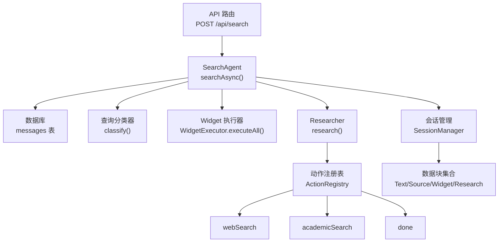
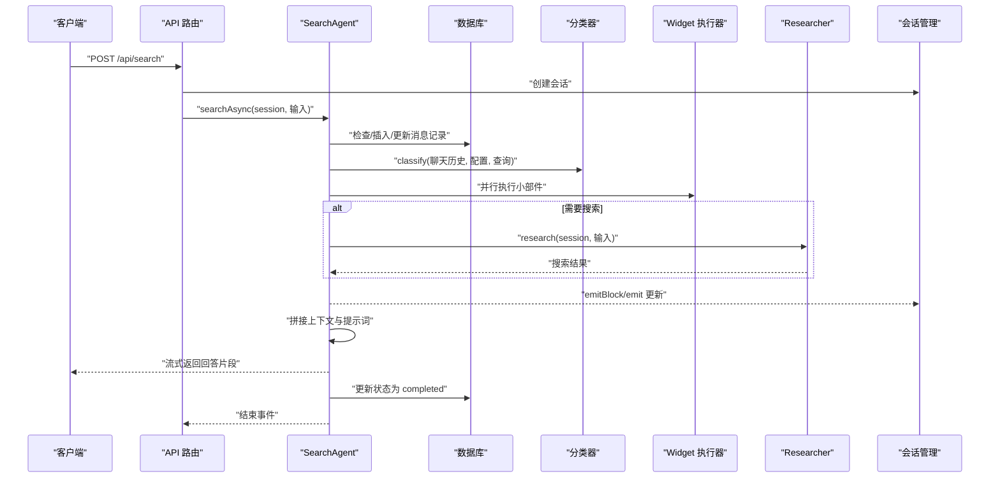
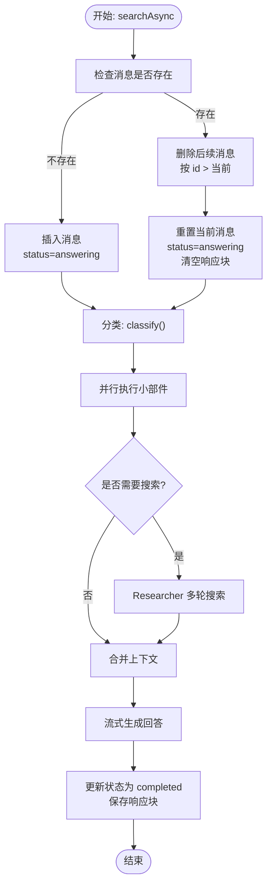
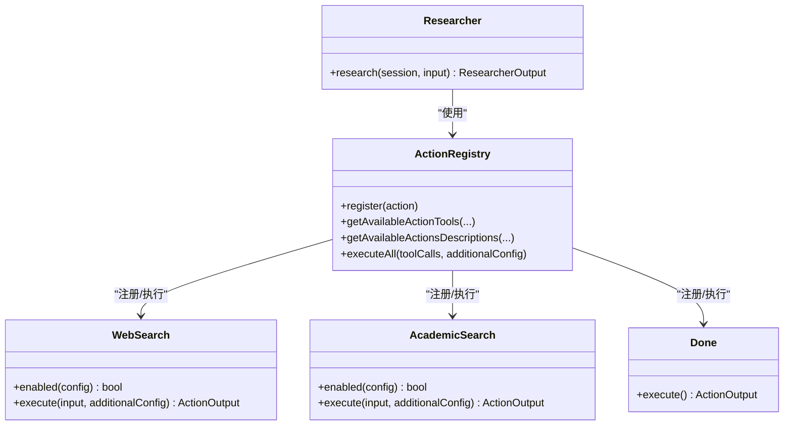
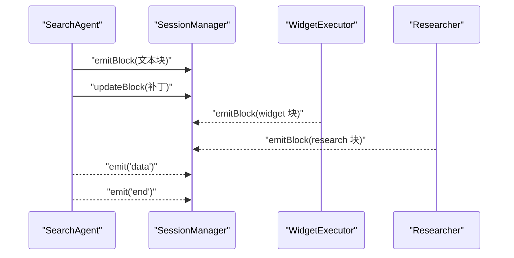
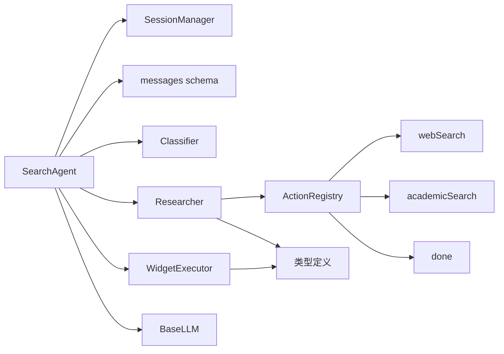

# 搜索代理生命周期

<cite>
**本文引用的文件**
- [src/lib/agents/search/index.ts](file://src/lib/agents/search/index.ts)
- [src/lib/agents/search/types.ts](file://src/lib/agents/search/types.ts)
- [src/lib/agents/search/classifier.ts](file://src/lib/agents/search/classifier.ts)
- [src/lib/agents/search/researcher/index.ts](file://src/lib/agents/search/researcher/index.ts)
- [src/lib/agents/search/researcher/actions/webSearch.ts](file://src/lib/agents/search/researcher/actions/webSearch.ts)
- [src/lib/agents/search/researcher/actions/academicSearch.ts](file://src/lib/agents/search/researcher/actions/academicSearch.ts)
- [src/lib/agents/search/researcher/actions/done.ts](file://src/lib/agents/search/researcher/actions/done.ts)
- [src/lib/agents/search/widgets/index.ts](file://src/lib/agents/search/widgets/index.ts)
- [src/lib/agents/search/widgets/executor.ts](file://src/lib/agents/search/widgets/executor.ts)
- [src/lib/session.ts](file://src/lib/session.ts)
- [src/lib/db/schema.ts](file://src/lib/db/schema.ts)
- [src/lib/models/base/llm.ts](file://src/lib/models/base/llm.ts)
- [src/lib/types.ts](file://src/lib/types.ts)
- [src/app/api/search/route.ts](file://src/app/api/search/route.ts)
</cite>

## 目录
1. [简介](#简介)
2. [项目结构](#项目结构)
3. [核心组件](#核心组件)
4. [架构总览](#架构总览)
5. [详细组件分析](#详细组件分析)
6. [依赖关系分析](#依赖关系分析)
7. [性能考虑](#性能考虑)
8. [故障排查指南](#故障排查指南)
9. [结论](#结论)
10. [附录](#附录)

## 简介
本文件系统性阐述搜索代理（SearchAgent）的完整生命周期：从消息创建、查询分类、研究执行、小部件（Widget）执行、结果聚合到最终回答生成与持久化。重点覆盖以下方面：
- 消息状态管理：answering、completed 等状态的创建与转换逻辑
- 数据库操作：消息插入、更新、删除等 CRUD 行为
- 会话管理与搜索代理协作：事件触发、数据块（Block）传输、状态同步
- 错误处理与恢复：超时、重试、异常清理策略
- 性能监控与调试：并发控制、迭代限制、流式输出与事件订阅

## 项目结构
围绕搜索代理生命周期的关键目录与文件如下：
- 搜索代理入口与主流程：src/lib/agents/search/index.ts
- 类型定义与工具类型：src/lib/agents/search/types.ts
- 查询分类器：src/lib/agents/search/classifier.ts
- 研究器（Researcher）与动作注册：src/lib/agents/search/researcher/index.ts、src/lib/agents/search/researcher/actions/index.ts
- 具体动作（如网络搜索、学术搜索）：src/lib/agents/search/researcher/actions/webSearch.ts、src/lib/agents/search/researcher/actions/academicSearch.ts、src/lib/agents/search/researcher/actions/done.ts
- 小部件执行器：src/lib/agents/search/widgets/index.ts、src/lib/agents/search/widgets/executor.ts
- 会话管理：src/lib/session.ts
- 数据库模式：src/lib/db/schema.ts
- LLM 抽象基类：src/lib/models/base/llm.ts
- 通用类型：src/lib/types.ts
- API 入口：src/app/api/search/route.ts

图表来源
- [src/app/api/search/route.ts](file://src/app/api/search/route.ts#L19-L67)
- [src/lib/agents/search/index.ts](file://src/lib/agents/search/index.ts#L12-L183)
- [src/lib/db/schema.ts](file://src/lib/db/schema.ts#L6-L19)
- [src/lib/agents/search/classifier.ts](file://src/lib/agents/search/classifier.ts#L37-L53)
- [src/lib/agents/search/widgets/executor.ts](file://src/lib/agents/search/widgets/executor.ts#L14-L33)
- [src/lib/agents/search/researcher/index.ts](file://src/lib/agents/search/researcher/index.ts#L9-L222)
- [src/lib/agents/search/researcher/actions/index.ts](file://src/lib/agents/search/researcher/actions/index.ts#L1-L19)

章节来源
- [src/lib/agents/search/index.ts](file://src/lib/agents/search/index.ts#L12-L183)
- [src/lib/agents/search/types.ts](file://src/lib/agents/search/types.ts#L1-L123)
- [src/lib/agents/search/classifier.ts](file://src/lib/agents/search/classifier.ts#L37-L53)
- [src/lib/agents/search/researcher/index.ts](file://src/lib/agents/search/researcher/index.ts#L9-L222)
- [src/lib/agents/search/researcher/actions/webSearch.ts](file://src/lib/agents/search/researcher/actions/webSearch.ts#L59-L183)
- [src/lib/agents/search/researcher/actions/academicSearch.ts](file://src/lib/agents/search/researcher/actions/academicSearch.ts#L22-L130)
- [src/lib/agents/search/researcher/actions/done.ts](file://src/lib/agents/search/researcher/actions/done.ts#L10-L25)
- [src/lib/agents/search/widgets/index.ts](file://src/lib/agents/search/widgets/index.ts#L1-L11)
- [src/lib/agents/search/widgets/executor.ts](file://src/lib/agents/search/widgets/executor.ts#L3-L37)
- [src/lib/session.ts](file://src/lib/session.ts#L11-L106)
- [src/lib/db/schema.ts](file://src/lib/db/schema.ts#L6-L19)
- [src/lib/models/base/llm.ts](file://src/lib/models/base/llm.ts#L10-L22)
- [src/lib/types.ts](file://src/lib/types.ts#L39-L124)
- [src/app/api/search/route.ts](file://src/app/api/search/route.ts#L19-L209)

## 核心组件
- SearchAgent：负责消息生命周期管理、分类、并行执行小部件与搜索、生成最终回答并持久化
- SessionManager：维护会话、事件发布、数据块集合与补丁更新
- Classifier：基于 LLM 对用户查询进行分类，决定是否跳过搜索及展示哪些小部件
- Researcher：在多轮迭代中选择可用动作，调用工具（如网络/学术搜索），汇总结果
- WidgetExecutor：注册并并行执行各类小部件（天气、股票、计算）
- 数据库 schema：messages 表承载消息与状态；chats 表承载会话元信息
- LLM 抽象：统一文本生成、流式生成与结构化对象生成接口

章节来源
- [src/lib/agents/search/index.ts](file://src/lib/agents/search/index.ts#L12-L183)
- [src/lib/session.ts](file://src/lib/session.ts#L11-L106)
- [src/lib/agents/search/classifier.ts](file://src/lib/agents/search/classifier.ts#L37-L53)
- [src/lib/agents/search/researcher/index.ts](file://src/lib/agents/search/researcher/index.ts#L9-L222)
- [src/lib/agents/search/widgets/executor.ts](file://src/lib/agents/search/widgets/executor.ts#L3-L37)
- [src/lib/db/schema.ts](file://src/lib/db/schema.ts#L6-L19)
- [src/lib/models/base/llm.ts](file://src/lib/models/base/llm.ts#L10-L22)

## 架构总览
下图展示了从 API 请求到最终回答与状态持久化的端到端流程。

图表来源
- [src/app/api/search/route.ts](file://src/app/api/search/route.ts#L19-L209)
- [src/lib/agents/search/index.ts](file://src/lib/agents/search/index.ts#L13-L183)
- [src/lib/agents/search/classifier.ts](file://src/lib/agents/search/classifier.ts#L37-L53)
- [src/lib/agents/search/widgets/executor.ts](file://src/lib/agents/search/widgets/executor.ts#L14-L33)
- [src/lib/agents/search/researcher/index.ts](file://src/lib/agents/search/researcher/index.ts#L9-L222)
- [src/lib/db/schema.ts](file://src/lib/db/schema.ts#L6-L19)

## 详细组件分析

### SearchAgent 生命周期与状态管理
- 消息创建与初始化
  - 若消息不存在，则插入一条记录，初始状态为 answering，并清空响应块
  - 若已存在，则先删除后续更大自增 id 的冗余消息，再将当前消息状态重置为 answering 并清空响应块
- 查询分类
  - 使用分类器对聊天历史、启用的搜索源、查询与 LLM 进行分类，得到是否跳过搜索、个人搜索、学术/讨论搜索以及小部件显示标记
- 小部件执行
  - 并行执行所有已注册的小部件，将小部件输出以 widget 块形式通过会话发出
- 搜索执行
  - 若分类未跳过搜索，则实例化 Researcher 并开始多轮迭代搜索
- 结果聚合与回答生成
  - 合并搜索结果与小部件上下文，构造写作者提示词，使用 LLM 流式生成回答
  - 逐片增量更新会话中的文本块，直至生成完成
- 状态持久化
  - 发出 end 事件后，将消息状态更新为 completed，并保存会话中的所有块

图表来源
- [src/lib/agents/search/index.ts](file://src/lib/agents/search/index.ts#L13-L183)
- [src/lib/agents/search/classifier.ts](file://src/lib/agents/search/classifier.ts#L37-L53)
- [src/lib/agents/search/widgets/executor.ts](file://src/lib/agents/search/widgets/executor.ts#L14-L33)
- [src/lib/agents/search/researcher/index.ts](file://src/lib/agents/search/researcher/index.ts#L9-L222)
- [src/lib/db/schema.ts](file://src/lib/db/schema.ts#L6-L19)

章节来源
- [src/lib/agents/search/index.ts](file://src/lib/agents/search/index.ts#L13-L183)
- [src/lib/db/schema.ts](file://src/lib/db/schema.ts#L6-L19)

### 查询分类器（Classifier）
- 输入包含聊天历史、启用的搜索源、查询与 LLM
- 输出包含分类标记（skipSearch、personalSearch、academicSearch、discussionSearch、showWeatherWidget、showStockWidget、showCalculationWidget）与独立的 Standalone Follow-Up
- 使用结构化对象生成接口，确保输出可解析且符合预期

章节来源
- [src/lib/agents/search/classifier.ts](file://src/lib/agents/search/classifier.ts#L37-L53)
- [src/lib/agents/search/types.ts](file://src/lib/agents/search/types.ts#L45-L63)

### Researcher 与动作（Actions）
- Researcher
  - 根据优化模式（speed/balanced/quality）设置最大迭代次数
  - 动态构建可用工具列表与工具描述
  - 在每轮迭代中：
    - 生成研究提示词并流式调用 LLM 工具调用
    - 解析推理前言（__reasoning_preamble）并更新研究块的子步骤
    - 收集工具调用参数，执行动作注册表中的动作
    - 将动作结果追加到消息历史，驱动下一轮
  - 去重与聚合搜索结果，输出最终搜索发现
- 动作示例
  - 网络搜索（web_search）：支持速度/平衡/质量模式下的不同提示词与查询策略
  - 学术搜索（academic_search）：针对 arxiv、google scholar、pubmed 等引擎
  - 完成动作（done）：用于终止研究流程

图表来源
- [src/lib/agents/search/researcher/index.ts](file://src/lib/agents/search/researcher/index.ts#L9-L222)
- [src/lib/agents/search/researcher/actions/index.ts](file://src/lib/agents/search/researcher/actions/index.ts#L1-L19)
- [src/lib/agents/search/researcher/actions/webSearch.ts](file://src/lib/agents/search/researcher/actions/webSearch.ts#L59-L183)
- [src/lib/agents/search/researcher/actions/academicSearch.ts](file://src/lib/agents/search/researcher/actions/academicSearch.ts#L22-L130)
- [src/lib/agents/search/researcher/actions/done.ts](file://src/lib/agents/search/researcher/actions/done.ts#L10-L25)

章节来源
- [src/lib/agents/search/researcher/index.ts](file://src/lib/agents/search/researcher/index.ts#L9-L222)
- [src/lib/agents/search/researcher/actions/webSearch.ts](file://src/lib/agents/search/researcher/actions/webSearch.ts#L59-L183)
- [src/lib/agents/search/researcher/actions/academicSearch.ts](file://src/lib/agents/search/researcher/actions/academicSearch.ts#L22-L130)
- [src/lib/agents/search/researcher/actions/done.ts](file://src/lib/agents/search/researcher/actions/done.ts#L10-L25)

### 小部件（Widget）执行器
- 注册多种小部件（天气、股票、计算），并行执行
- 对每个小部件调用其 shouldExecute 判定与 execute 执行
- 捕获执行异常并记录日志，保证整体流程不中断
- 将小部件输出以 widget 块形式通过会话发出

章节来源
- [src/lib/agents/search/widgets/index.ts](file://src/lib/agents/search/widgets/index.ts#L1-L11)
- [src/lib/agents/search/widgets/executor.ts](file://src/lib/agents/search/widgets/executor.ts#L3-L37)

### 会话管理与事件协作
- SessionManager
  - 维护会话映射、TTL 自动清理
  - 提供 emit/emitBlock/updateBlock/getBlock/getAllBlocks 等能力
  - 订阅接口支持事件回放与监听移除
- 与 SearchAgent 协作
  - SearchAgent 在小部件执行、研究过程、回答流式输出中通过 emitBlock/updateBlock 推送数据块
  - 通过 emit('data'/'end'/'error') 通知外部订阅者

图表来源
- [src/lib/agents/search/index.ts](file://src/lib/agents/search/index.ts#L61-L168)
- [src/lib/session.ts](file://src/lib/session.ts#L45-L102)
- [src/lib/agents/search/widgets/executor.ts](file://src/lib/agents/search/widgets/executor.ts#L14-L33)
- [src/lib/agents/search/researcher/index.ts](file://src/lib/agents/search/researcher/index.ts#L37-L219)

章节来源
- [src/lib/session.ts](file://src/lib/session.ts#L11-L106)
- [src/lib/agents/search/index.ts](file://src/lib/agents/search/index.ts#L61-L168)

### 数据库操作与消息状态
- 模式定义
  - messages 表包含消息标识、会话标识、查询内容、创建时间、状态与响应块数组
  - 状态枚举包含 answering、completed、error
- 操作流程
  - 插入：当消息不存在时，插入新记录并设置状态为 answering
  - 更新：当消息存在时，重置状态为 answering、清空响应块并更新 backendId
  - 删除：删除同一对话中 id 更大的冗余消息
  - 完成：回答结束后，将状态更新为 completed，并持久化会话中的所有块

章节来源
- [src/lib/db/schema.ts](file://src/lib/db/schema.ts#L6-L19)
- [src/lib/agents/search/index.ts](file://src/lib/agents/search/index.ts#L14-L52)
- [src/lib/agents/search/index.ts](file://src/lib/agents/search/index.ts#L170-L182)

### API 入口与流式输出
- API 路由负责：
  - 参数校验与默认值设置
  - 加载模型与嵌入模型
  - 创建会话并启动 SearchAgent
  - 非流式模式：等待 end 事件后一次性返回消息与来源
  - 流式模式：订阅会话事件，编码并推送响应、来源与完成信号
  - 异常处理：捕获内部错误并返回标准错误响应

章节来源
- [src/app/api/search/route.ts](file://src/app/api/search/route.ts#L19-L209)

## 依赖关系分析
- 组件耦合
  - SearchAgent 依赖 SessionManager、Classifier、WidgetExecutor、Researcher、数据库 schema 与 LLM 抽象
  - Researcher 依赖 ActionRegistry 与具体动作（webSearch、academicSearch、done）
  - WidgetExecutor 依赖各小部件实现
- 外部依赖
  - LLM 抽象统一了文本生成与结构化输出
  - SearxNG 搜索服务作为外部搜索引擎
- 可能的循环依赖
  - 当前模块间通过显式导入避免循环依赖

图表来源
- [src/lib/agents/search/index.ts](file://src/lib/agents/search/index.ts#L1-L11)
- [src/lib/agents/search/researcher/index.ts](file://src/lib/agents/search/researcher/index.ts#L1-L8)
- [src/lib/agents/search/widgets/executor.ts](file://src/lib/agents/search/widgets/executor.ts#L1-L2)
- [src/lib/models/base/llm.ts](file://src/lib/models/base/llm.ts#L10-L22)
- [src/lib/types.ts](file://src/lib/types.ts#L118-L124)

章节来源
- [src/lib/agents/search/index.ts](file://src/lib/agents/search/index.ts#L1-L11)
- [src/lib/agents/search/researcher/index.ts](file://src/lib/agents/search/researcher/index.ts#L1-L8)
- [src/lib/agents/search/widgets/executor.ts](file://src/lib/agents/search/widgets/executor.ts#L1-L2)
- [src/lib/models/base/llm.ts](file://src/lib/models/base/llm.ts#L10-L22)
- [src/lib/types.ts](file://src/lib/types.ts#L118-L124)

## 性能考虑
- 并发与去重
  - 小部件与搜索动作均采用并行执行，提升吞吐
  - 搜索结果按 URL 去重并合并内容，减少重复与冗余
- 迭代限制
  - Researcher 根据优化模式设置最大迭代次数，避免无限循环
- 流式输出
  - 回答与中间块均采用流式生成与推送，降低首字节延迟
- 会话 TTL
  - SessionManager 设置会话过期时间，防止内存泄漏

章节来源
- [src/lib/agents/search/index.ts](file://src/lib/agents/search/index.ts#L61-L95)
- [src/lib/agents/search/researcher/index.ts](file://src/lib/agents/search/researcher/index.ts#L15-L20)
- [src/lib/agents/search/researcher/actions/webSearch.ts](file://src/lib/agents/search/researcher/actions/webSearch.ts#L173-L179)
- [src/lib/agents/search/researcher/actions/academicSearch.ts](file://src/lib/agents/search/researcher/actions/academicSearch.ts#L120-L126)
- [src/lib/session.ts](file://src/lib/session.ts#L17-L25)

## 故障排查指南
- 分类失败或输出格式不符
  - 检查分类器输入（聊天历史、查询、启用源）与 LLM 配置
  - 确认结构化对象生成的 schema 是否被正确应用
- 搜索无结果或超时
  - 检查 SearxNG 配置与网络连通性
  - 调整优化模式与查询策略（速度模式仅一次调用，质量模式多次迭代）
- 小部件执行异常
  - 查看小部件执行器的日志输出，确认异常捕获与容错
- 会话事件未到达前端
  - 确认订阅回调是否正确注册与移除
  - 检查流式控制器的关闭与中止逻辑
- 数据库状态不一致
  - 核对消息插入/更新/删除条件，确保按 chatId 与 messageId 匹配
  - 检查后续消息清理是否按 id 顺序执行

章节来源
- [src/lib/agents/search/classifier.ts](file://src/lib/agents/search/classifier.ts#L37-L53)
- [src/lib/agents/search/researcher/actions/webSearch.ts](file://src/lib/agents/search/researcher/actions/webSearch.ts#L115-L179)
- [src/lib/agents/search/researcher/actions/academicSearch.ts](file://src/lib/agents/search/researcher/actions/academicSearch.ts#L60-L126)
- [src/lib/agents/search/widgets/executor.ts](file://src/lib/agents/search/widgets/executor.ts#L26-L28)
- [src/app/api/search/route.ts](file://src/app/api/search/route.ts#L139-L192)
- [src/lib/agents/search/index.ts](file://src/lib/agents/search/index.ts#L14-L52)

## 结论
SearchAgent 将“消息状态管理、查询分类、并行小部件与搜索、流式回答生成与持久化”整合为完整的生命周期闭环。通过 SessionManager 的事件驱动与数据块管理、数据库的状态字段与事务性更新、以及 Researcher 的多轮动作编排，系统实现了高并发、可扩展且可观测的搜索体验。建议在生产环境中结合超时控制、重试策略与更细粒度的监控指标进一步增强鲁棒性。

## 附录
- 关键流程路径参考
  - 搜索代理主流程：[src/lib/agents/search/index.ts](file://src/lib/agents/search/index.ts#L13-L183)
  - 查询分类器：[src/lib/agents/search/classifier.ts](file://src/lib/agents/search/classifier.ts#L37-L53)
  - 研究器与动作：[src/lib/agents/search/researcher/index.ts](file://src/lib/agents/search/researcher/index.ts#L9-L222)、[src/lib/agents/search/researcher/actions/webSearch.ts](file://src/lib/agents/search/researcher/actions/webSearch.ts#L59-L183)、[src/lib/agents/search/researcher/actions/academicSearch.ts](file://src/lib/agents/search/researcher/actions/academicSearch.ts#L22-L130)
  - 小部件执行器：[src/lib/agents/search/widgets/executor.ts](file://src/lib/agents/search/widgets/executor.ts#L3-L37)
  - 会话管理：[src/lib/session.ts](file://src/lib/session.ts#L11-L106)
  - 数据库模式：[src/lib/db/schema.ts](file://src/lib/db/schema.ts#L6-L19)
  - API 入口：[src/app/api/search/route.ts](file://src/app/api/search/route.ts#L19-L209)