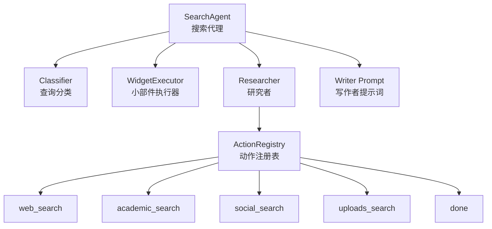
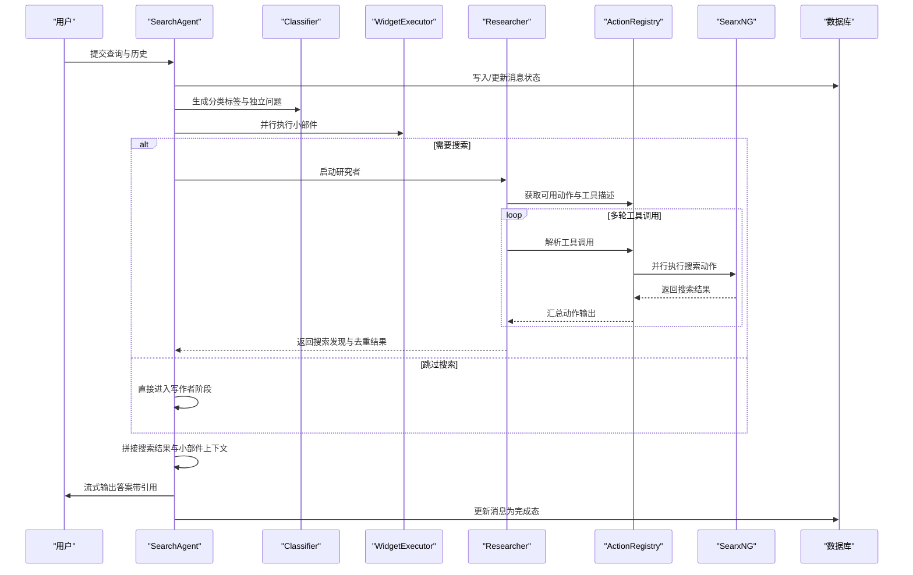
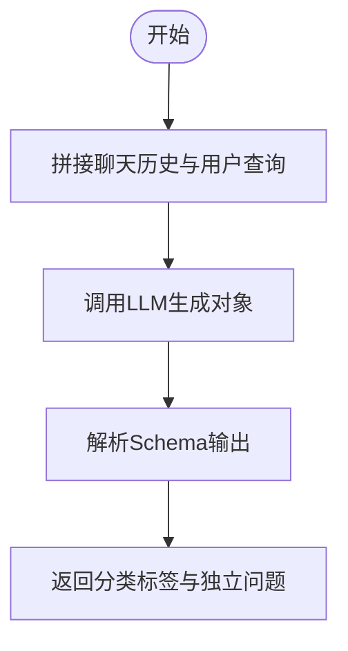
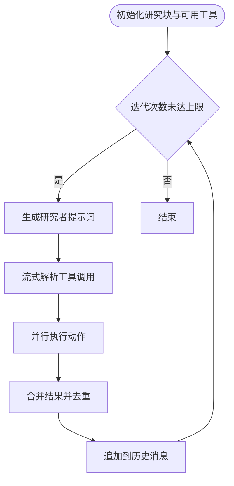
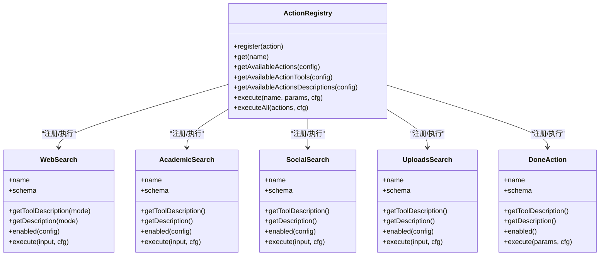
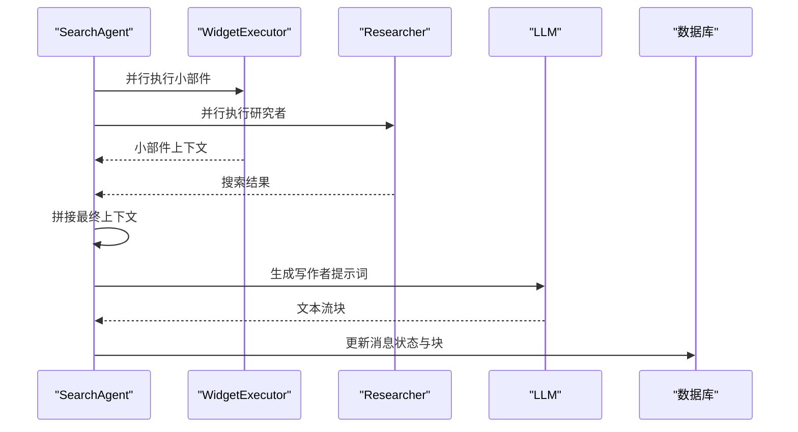
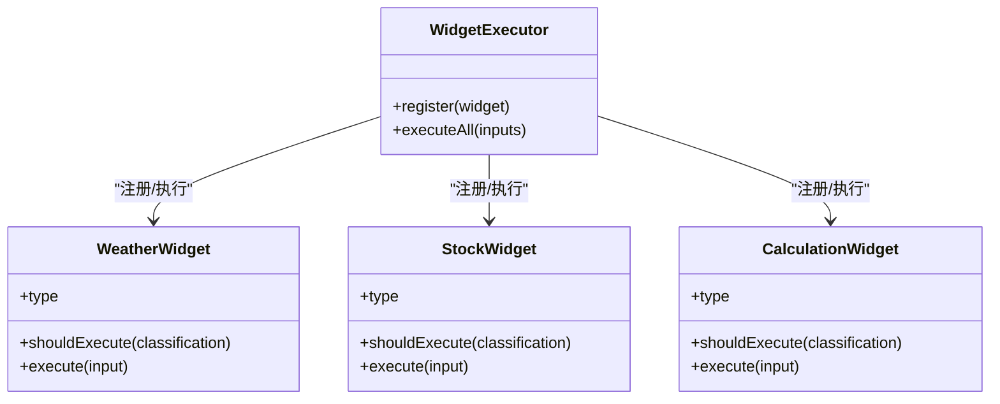
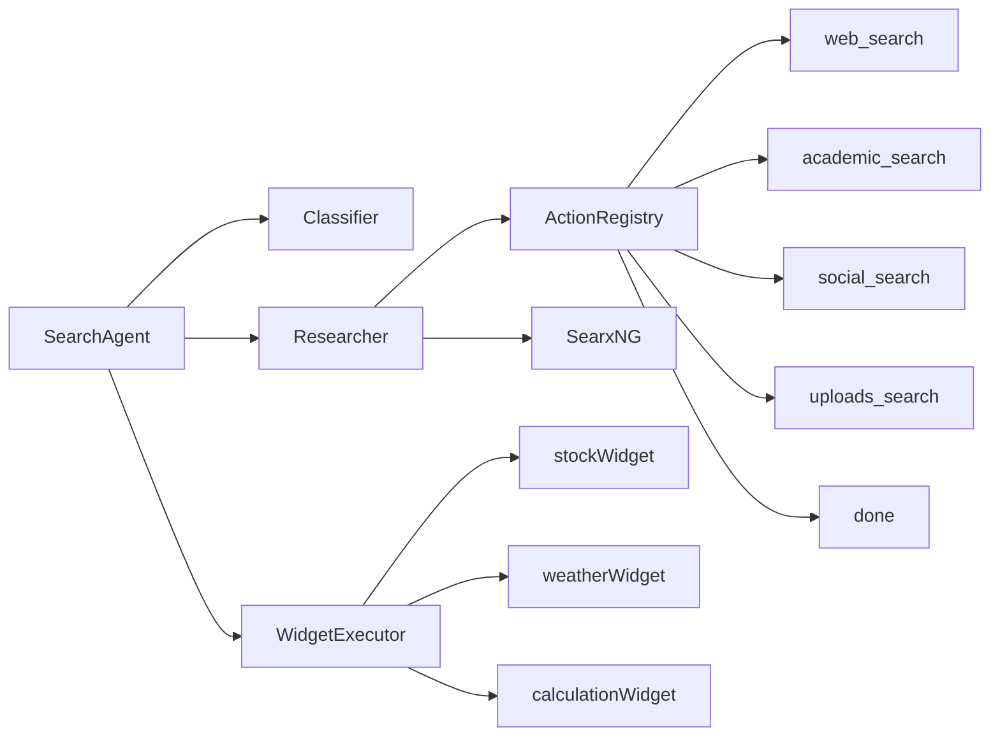

# 搜索代理系统

<cite>
**本文引用的文件**
- [src/lib/agents/search/index.ts](file://src/lib/agents/search/index.ts)
- [src/lib/agents/search/classifier.ts](file://src/lib/agents/search/classifier.ts)
- [src/lib/agents/search/types.ts](file://src/lib/agents/search/types.ts)
- [src/lib/agents/search/researcher/index.ts](file://src/lib/agents/search/researcher/index.ts)
- [src/lib/agents/search/researcher/actions/registry.ts](file://src/lib/agents/search/researcher/actions/registry.ts)
- [src/lib/agents/search/researcher/actions/webSearch.ts](file://src/lib/agents/search/researcher/actions/webSearch.ts)
- [src/lib/agents/search/researcher/actions/socialSearch.ts](file://src/lib/agents/search/researcher/actions/socialSearch.ts)
- [src/lib/agents/search/researcher/actions/academicSearch.ts](file://src/lib/agents/search/researcher/actions/academicSearch.ts)
- [src/lib/agents/search/researcher/actions/uploadsSearch.ts](file://src/lib/agents/search/researcher/actions/uploadsSearch.ts)
- [src/lib/agents/search/researcher/actions/done.ts](file://src/lib/agents/search/researcher/actions/done.ts)
- [src/lib/agents/search/widgets/index.ts](file://src/lib/agents/search/widgets/index.ts)
- [src/lib/agents/search/widgets/weatherWidget.ts](file://src/lib/agents/search/widgets/weatherWidget.ts)
- [src/lib/agents/search/widgets/stockWidget.ts](file://src/lib/agents/search/widgets/stockWidget.ts)
- [src/lib/agents/search/widgets/calculationWidget.ts](file://src/lib/agents/search/widgets/calculationWidget.ts)
</cite>

## 目录
1. [简介](#简介)
2. [项目结构](#项目结构)
3. [核心组件](#核心组件)
4. [架构总览](#架构总览)
5. [详细组件分析](#详细组件分析)
6. [依赖关系分析](#依赖关系分析)
7. [性能考量](#性能考量)
8. [故障排查指南](#故障排查指南)
9. [结论](#结论)
10. [附录：扩展与最佳实践](#附录扩展与最佳实践)

## 简介
本文件系统性阐述 Perplexica 的“搜索代理”（Search Agent）设计与实现，覆盖以下主题：
- 查询分类机制：基于 LLM 的多维意图识别，决定是否跳过搜索、是否进行个人/学术/讨论类搜索，以及是否显示天气、股票、计算小部件。
- 搜索动作编排：研究者（Researcher）通过工具调用循环，按策略动态选择并并行执行搜索动作，逐步收敛信息。
- 结果整合算法：去重合并、上下文拼接、写作者提示词生成，最终驱动大模型输出可引用来源的答案。
- 执行流程：从查询理解、动作规划、并行搜索、结果聚合到答案流式输出的完整链路。
- 扩展机制：如何新增搜索源与策略，如何注册新动作与小部件。
- 性能特性与优化：迭代次数控制、并行搜索、结果去重、会话块更新与持久化。

## 项目结构
搜索代理位于 src/lib/agents/search 目录下，采用“分类器 + 研究者 + 动作注册表 + 小部件执行器”的分层架构：
- 分类器：对用户查询与历史进行意图识别，输出分类标签与独立问题改写。
- 研究者：在多轮工具调用中选择可用动作，串并结合地执行搜索，汇总结果。
- 动作注册表：集中管理所有研究动作（网络/学术/社交/上传/完成），支持按配置启用与并发执行。
- 小部件执行器：并行执行天气、股票、计算等即时数据小部件，作为“非搜索上下文”提供给写作者。

图表来源
- [src/lib/agents/search/index.ts](file://src/lib/agents/search/index.ts#L12-L187)
- [src/lib/agents/search/classifier.ts](file://src/lib/agents/search/classifier.ts#L37-L53)
- [src/lib/agents/search/researcher/index.ts](file://src/lib/agents/search/researcher/index.ts#L9-L223)
- [src/lib/agents/search/researcher/actions/registry.ts](file://src/lib/agents/search/researcher/actions/registry.ts#L11-L106)
- [src/lib/agents/search/widgets/index.ts](file://src/lib/agents/search/widgets/index.ts#L1-L11)

章节来源
- [src/lib/agents/search/index.ts](file://src/lib/agents/search/index.ts#L12-L187)
- [src/lib/agents/search/classifier.ts](file://src/lib/agents/search/classifier.ts#L37-L53)
- [src/lib/agents/search/researcher/index.ts](file://src/lib/agents/search/researcher/index.ts#L9-L223)
- [src/lib/agents/search/researcher/actions/registry.ts](file://src/lib/agents/search/researcher/actions/registry.ts#L11-L106)
- [src/lib/agents/search/widgets/index.ts](file://src/lib/agents/search/widgets/index.ts#L1-L11)

## 核心组件
- 搜索代理（SearchAgent）
  - 负责消息持久化、分类、并行执行小部件与研究者、组装上下文、驱动写作者输出。
  - 关键路径参考：[搜索代理主流程](file://src/lib/agents/search/index.ts#L13-L183)
- 查询分类器（Classifier）
  - 基于系统提示与聊天历史，输出分类标签与独立问题改写，决定后续动作与小部件。
  - 关键路径参考：[分类逻辑](file://src/lib/agents/search/classifier.ts#L37-L53)
- 研究者（Researcher）
  - 根据模式（速度/平衡/质量）限制最大迭代次数；动态构建工具描述与可用工具；流式解析工具调用；并行执行动作；去重合并结果。
  - 关键路径参考：[研究主循环与工具调用](file://src/lib/agents/search/researcher/index.ts#L59-L182)
- 动作注册表（ActionRegistry）
  - 统一注册、筛选、描述生成、并发执行研究动作。
  - 关键路径参考：[注册与执行](file://src/lib/agents/search/researcher/actions/registry.ts#L11-L106)
- 小部件执行器（WidgetExecutor）
  - 并行执行天气、股票、计算等小部件，产出上下文供写作者使用。
  - 关键路径参考：[小部件注册与执行入口](file://src/lib/agents/search/widgets/index.ts#L1-L11)

章节来源
- [src/lib/agents/search/index.ts](file://src/lib/agents/search/index.ts#L12-L187)
- [src/lib/agents/search/classifier.ts](file://src/lib/agents/search/classifier.ts#L37-L53)
- [src/lib/agents/search/researcher/index.ts](file://src/lib/agents/search/researcher/index.ts#L9-L223)
- [src/lib/agents/search/researcher/actions/registry.ts](file://src/lib/agents/search/researcher/actions/registry.ts#L11-L106)
- [src/lib/agents/search/widgets/index.ts](file://src/lib/agents/search/widgets/index.ts#L1-L11)

## 架构总览
搜索代理的端到端流程如下：

图表来源
- [src/lib/agents/search/index.ts](file://src/lib/agents/search/index.ts#L54-L183)
- [src/lib/agents/search/classifier.ts](file://src/lib/agents/search/classifier.ts#L37-L53)
- [src/lib/agents/search/researcher/index.ts](file://src/lib/agents/search/researcher/index.ts#L22-L182)
- [src/lib/agents/search/researcher/actions/registry.ts](file://src/lib/agents/search/researcher/actions/registry.ts#L33-L102)

## 详细组件分析

### 查询分类机制（Classifier）
- 输入：聊天历史、启用的搜索源、当前查询、LLM 实例
- 输出：分类标签（是否跳过搜索、个人/学术/讨论搜索、是否显示天气/股票/计算小部件）、独立问题改写
- 关键点：
  - 使用强类型 Schema 约束输出结构，确保后续动作与小部件按标签启用。
  - 将历史与查询拼接为系统提示输入，提升上下文理解能力。
- 参考路径：
  - [分类器定义与调用](file://src/lib/agents/search/classifier.ts#L37-L53)
  - [类型定义](file://src/lib/agents/search/types.ts#L45-L63)

图表来源
- [src/lib/agents/search/classifier.ts](file://src/lib/agents/search/classifier.ts#L37-L53)
- [src/lib/agents/search/types.ts](file://src/lib/agents/search/types.ts#L45-L63)

章节来源
- [src/lib/agents/search/classifier.ts](file://src/lib/agents/search/classifier.ts#L37-L53)
- [src/lib/agents/search/types.ts](file://src/lib/agents/search/types.ts#L45-L63)

### 搜索动作编排（Researcher 与 ActionRegistry）
- 迭代上限：根据模式（速度/平衡/质量）设置最大迭代次数，避免无限循环。
- 工具描述：动态生成可用动作的工具描述与说明，注入研究者提示词。
- 工具调用解析：流式解析 LLM 的工具调用片段，累积最终调用列表。
- 并行执行：对同一轮工具调用并行执行，提升吞吐。
- 结果聚合：过滤“已完成”动作，合并搜索结果，按 URL 去重并合并内容。
- 参考路径：
  - [研究主循环与工具调用解析](file://src/lib/agents/search/researcher/index.ts#L59-L182)
  - [动作注册表与并发执行](file://src/lib/agents/search/researcher/actions/registry.ts#L33-L102)

图表来源
- [src/lib/agents/search/researcher/index.ts](file://src/lib/agents/search/researcher/index.ts#L59-L182)
- [src/lib/agents/search/researcher/actions/registry.ts](file://src/lib/agents/search/researcher/actions/registry.ts#L81-L102)

章节来源
- [src/lib/agents/search/researcher/index.ts](file://src/lib/agents/search/researcher/index.ts#L9-L223)
- [src/lib/agents/search/researcher/actions/registry.ts](file://src/lib/agents/search/researcher/actions/registry.ts#L11-L106)

### 搜索动作实现（Web/Academic/Social/Uploads/Done）
- 网络搜索（web_search）
  - 支持三种模式下的查询策略：速度模式强调单次高密度查询；平衡/质量模式建议先宽后窄、多次迭代。
  - 并行发起最多 3 个关键词查询，统一映射为 Chunk 列表。
  - 参考路径：[网络搜索动作](file://src/lib/agents/search/researcher/actions/webSearch.ts#L59-L183)
- 学术搜索（academic_search）
  - 针对 arxiv、google scholar、pubmed 等学术引擎组合检索。
  - 参考路径：[学术搜索动作](file://src/lib/agents/search/researcher/actions/academicSearch.ts#L22-L130)
- 社交搜索（social_search）
  - 限定引擎为 reddit，聚焦社会讨论与趋势。
  - 参考路径：[社交搜索动作](file://src/lib/agents/search/researcher/actions/socialSearch.ts#L22-L130)
- 上传搜索（uploads_search）
  - 在用户上传文件集合上进行嵌入检索，支持去重合并。
  - 参考路径：[上传搜索动作](file://src/lib/agents/search/researcher/actions/uploadsSearch.ts#L13-L103)
- 完成动作（done）
  - 标记研究流程结束，防止无限迭代。
  - 参考路径：[完成动作](file://src/lib/agents/search/researcher/actions/done.ts#L10-L25)

图表来源
- [src/lib/agents/search/researcher/actions/registry.ts](file://src/lib/agents/search/researcher/actions/registry.ts#L11-L106)
- [src/lib/agents/search/researcher/actions/webSearch.ts](file://src/lib/agents/search/researcher/actions/webSearch.ts#L59-L183)
- [src/lib/agents/search/researcher/actions/academicSearch.ts](file://src/lib/agents/search/researcher/actions/academicSearch.ts#L22-L130)
- [src/lib/agents/search/researcher/actions/socialSearch.ts](file://src/lib/agents/search/researcher/actions/socialSearch.ts#L22-L130)
- [src/lib/agents/search/researcher/actions/uploadsSearch.ts](file://src/lib/agents/search/researcher/actions/uploadsSearch.ts#L13-L103)
- [src/lib/agents/search/researcher/actions/done.ts](file://src/lib/agents/search/researcher/actions/done.ts#L10-L25)

章节来源
- [src/lib/agents/search/researcher/actions/webSearch.ts](file://src/lib/agents/search/researcher/actions/webSearch.ts#L59-L183)
- [src/lib/agents/search/researcher/actions/academicSearch.ts](file://src/lib/agents/search/researcher/actions/academicSearch.ts#L22-L130)
- [src/lib/agents/search/researcher/actions/socialSearch.ts](file://src/lib/agents/search/researcher/actions/socialSearch.ts#L22-L130)
- [src/lib/agents/search/researcher/actions/uploadsSearch.ts](file://src/lib/agents/search/researcher/actions/uploadsSearch.ts#L13-L103)
- [src/lib/agents/search/researcher/actions/done.ts](file://src/lib/agents/search/researcher/actions/done.ts#L10-L25)

### 结果整合与写作者（SearchAgent）
- 并行执行：小部件执行与研究者执行并行推进，使用 Promise.all 聚合。
- 上下文拼接：将搜索结果与小部件结果分别包裹为 XML 风格的上下文段落，写作者据此生成可引用来源的答案。
- 流式输出：逐块接收写作者的文本流，实时更新会话块，最后持久化为完成态。
- 参考路径：
  - [并行执行与上下文拼接](file://src/lib/agents/search/index.ts#L61-L121)
  - [流式输出与持久化](file://src/lib/agents/search/index.ts#L138-L183)

图表来源
- [src/lib/agents/search/index.ts](file://src/lib/agents/search/index.ts#L61-L183)

章节来源
- [src/lib/agents/search/index.ts](file://src/lib/agents/search/index.ts#L12-L187)

### 小部件系统（Weather/Stock/Calculation）
- 天气小部件（weatherWidget）
  - 从用户查询中抽取地点或坐标，调用 OpenMeteo 获取天气数据，同时可反向解析坐标获取地点名称。
  - 参考路径：[天气小部件](file://src/lib/agents/search/widgets/weatherWidget.ts#L53-L204)
- 股票小部件（stockWidget）
  - 使用 Yahoo Finance2 搜索与行情数据，支持多周期图表与最多 3 个对比标的。
  - 参考路径：[股票小部件](file://src/lib/agents/search/widgets/stockWidget.ts#L51-L435)
- 计算小部件（calculationWidget）
  - 抽取数学表达式并使用 mathjs 计算，直接返回结果。
  - 参考路径：[计算小部件](file://src/lib/agents/search/widgets/calculationWidget.ts#L35-L72)

图表来源
- [src/lib/agents/search/widgets/index.ts](file://src/lib/agents/search/widgets/index.ts#L1-L11)
- [src/lib/agents/search/widgets/weatherWidget.ts](file://src/lib/agents/search/widgets/weatherWidget.ts#L53-L204)
- [src/lib/agents/search/widgets/stockWidget.ts](file://src/lib/agents/search/widgets/stockWidget.ts#L51-L435)
- [src/lib/agents/search/widgets/calculationWidget.ts](file://src/lib/agents/search/widgets/calculationWidget.ts#L35-L72)

章节来源
- [src/lib/agents/search/widgets/index.ts](file://src/lib/agents/search/widgets/index.ts#L1-L11)
- [src/lib/agents/search/widgets/weatherWidget.ts](file://src/lib/agents/search/widgets/weatherWidget.ts#L53-L204)
- [src/lib/agents/search/widgets/stockWidget.ts](file://src/lib/agents/search/widgets/stockWidget.ts#L51-L435)
- [src/lib/agents/search/widgets/calculationWidget.ts](file://src/lib/agents/search/widgets/calculationWidget.ts#L35-L72)

## 依赖关系分析
- 模块耦合
  - SearchAgent 依赖 Classifier、WidgetExecutor、Researcher 与数据库；三者相对独立，便于替换与扩展。
  - Researcher 依赖 ActionRegistry 与 SearxNG；动作之间无直接耦合，通过注册表解耦。
  - 小部件彼此独立，通过 WidgetExecutor 统一调度。
- 外部依赖
  - SearxNG：统一的搜索引擎接口，封装网络/学术/社交搜索。
  - Yahoo Finance2：股票数据获取。
  - OpenMeteo/OpenStreetMap：天气与地理编码。
- 循环依赖
  - 未见直接循环依赖；动作与小部件均通过注册表间接交互。

图表来源
- [src/lib/agents/search/index.ts](file://src/lib/agents/search/index.ts#L12-L187)
- [src/lib/agents/search/researcher/index.ts](file://src/lib/agents/search/researcher/index.ts#L9-L223)
- [src/lib/agents/search/researcher/actions/registry.ts](file://src/lib/agents/search/researcher/actions/registry.ts#L11-L106)
- [src/lib/agents/search/widgets/index.ts](file://src/lib/agents/search/widgets/index.ts#L1-L11)

章节来源
- [src/lib/agents/search/index.ts](file://src/lib/agents/search/index.ts#L12-L187)
- [src/lib/agents/search/researcher/index.ts](file://src/lib/agents/search/researcher/index.ts#L9-L223)
- [src/lib/agents/search/researcher/actions/registry.ts](file://src/lib/agents/search/researcher/actions/registry.ts#L11-L106)
- [src/lib/agents/search/widgets/index.ts](file://src/lib/agents/search/widgets/index.ts#L1-L11)

## 性能考量
- 迭代次数控制
  - 速度模式限制更少迭代，平衡模式适中，质量模式允许更多轮以换取深度。
  - 参考路径：[迭代上限设置](file://src/lib/agents/search/researcher/index.ts#L15-L20)
- 并行搜索
  - 单轮内对多个查询并行执行，显著降低延迟。
  - 参考路径：[并行搜索](file://src/lib/agents/search/researcher/actions/webSearch.ts#L173-L174)
- 结果去重与合并
  - 基于 URL 去重，相同 URL 的结果内容合并，减少冗余。
  - 参考路径：[去重与合并](file://src/lib/agents/search/researcher/index.ts#L188-L207)
- 流式输出与增量更新
  - 写作者与研究者均采用流式处理，前端可即时渲染；会话块增量更新，避免全量回写。
  - 参考路径：[流式输出与块更新](file://src/lib/agents/search/index.ts#L138-L166)

[本节为通用性能讨论，不直接分析具体文件，故无章节来源]

## 故障排查指南
- 分类失败或标签异常
  - 检查分类器的系统提示与 Schema 是否匹配；确认聊天历史与查询拼接格式正确。
  - 参考路径：[分类器调用](file://src/lib/agents/search/classifier.ts#L37-L53)
- 搜索无结果或超时
  - 确认 SearxNG 配置与可用引擎；检查查询关键词是否合理；适当放宽/收紧模式。
  - 参考路径：[网络搜索动作](file://src/lib/agents/search/researcher/actions/webSearch.ts#L115-L174)
- 小部件执行错误
  - 天气：检查地理编码服务与天气 API 可用性；确保位置或坐标有效。
    - 参考路径：[天气小部件](file://src/lib/agents/search/widgets/weatherWidget.ts#L78-L201)
  - 股票：确认 Yahoo Finance2 可用；检查搜索与图表请求参数。
    - 参考路径：[股票小部件](file://src/lib/agents/search/widgets/stockWidget.ts#L78-L431)
  - 计算：确保表达式合法且 mathjs 支持。
    - 参考路径：[计算小部件](file://src/lib/agents/search/widgets/calculationWidget.ts#L58-L68)
- 数据库写入异常
  - 检查消息状态更新与块序列化；确认会话 ID 与消息 ID 唯一性。
  - 参考路径：[消息持久化](file://src/lib/agents/search/index.ts#L14-L52)

章节来源
- [src/lib/agents/search/classifier.ts](file://src/lib/agents/search/classifier.ts#L37-L53)
- [src/lib/agents/search/researcher/actions/webSearch.ts](file://src/lib/agents/search/researcher/actions/webSearch.ts#L115-L174)
- [src/lib/agents/search/widgets/weatherWidget.ts](file://src/lib/agents/search/widgets/weatherWidget.ts#L78-L201)
- [src/lib/agents/search/widgets/stockWidget.ts](file://src/lib/agents/search/widgets/stockWidget.ts#L78-L431)
- [src/lib/agents/search/widgets/calculationWidget.ts](file://src/lib/agents/search/widgets/calculationWidget.ts#L58-L68)
- [src/lib/agents/search/index.ts](file://src/lib/agents/search/index.ts#L14-L52)

## 结论
该搜索代理系统通过“意图分类 + 动作编排 + 结果整合 + 小部件增强”的方式，实现了对复杂查询的自动化处理。其核心优势在于：
- 明确的分层职责与注册表解耦，便于扩展新动作与小部件；
- 基于模式的迭代控制与并行搜索，兼顾性能与质量；
- 统一的结果去重与上下文拼接，保证最终回答的准确性与可引用性。

[本节为总结性内容，不直接分析具体文件，故无章节来源]

## 附录：扩展与最佳实践

### 如何新增搜索源（动作）
- 步骤
  1) 定义 ResearchAction 接口的实现（名称、Schema、工具描述、启用条件、执行函数）。
     - 参考现有动作：[网络搜索](file://src/lib/agents/search/researcher/actions/webSearch.ts#L59-L183)、[学术搜索](file://src/lib/agents/search/researcher/actions/academicSearch.ts#L22-L130)、[社交搜索](file://src/lib/agents/search/researcher/actions/socialSearch.ts#L22-L130)、[上传搜索](file://src/lib/agents/search/researcher/actions/uploadsSearch.ts#L13-L103)
  2) 在动作文件末尾导出该动作。
  3) 在注册表中注册该动作（若采用集中注册方式）。
     - 参考注册表：[动作注册表](file://src/lib/agents/search/researcher/actions/registry.ts#L14-L16)
  4) 在分类器输出中增加对应标签，或在 enabled 中使用现有标签控制启用。
     - 参考分类器输出结构：[分类器输出类型](file://src/lib/agents/search/types.ts#L52-L63)

- 最佳实践
  - 控制每轮查询数量（建议不超过 3），提升并行效率。
  - 对外部 API 增加重试与超时处理，避免阻塞主流程。
  - 对结果进行去重与内容合并，减少冗余。

章节来源
- [src/lib/agents/search/researcher/actions/registry.ts](file://src/lib/agents/search/researcher/actions/registry.ts#L14-L16)
- [src/lib/agents/search/researcher/actions/webSearch.ts](file://src/lib/agents/search/researcher/actions/webSearch.ts#L59-L183)
- [src/lib/agents/search/researcher/actions/academicSearch.ts](file://src/lib/agents/search/researcher/actions/academicSearch.ts#L22-L130)
- [src/lib/agents/search/researcher/actions/socialSearch.ts](file://src/lib/agents/search/researcher/actions/socialSearch.ts#L22-L130)
- [src/lib/agents/search/researcher/actions/uploadsSearch.ts](file://src/lib/agents/search/researcher/actions/uploadsSearch.ts#L13-L103)
- [src/lib/agents/search/types.ts](file://src/lib/agents/search/types.ts#L52-L63)

### 如何新增小部件
- 步骤
  1) 实现 Widget 接口（type、shouldExecute、execute），在 execute 中产出 llmContext 与 data。
     - 参考现有小部件：[天气](file://src/lib/agents/search/widgets/weatherWidget.ts#L53-L204)、[股票](file://src/lib/agents/search/widgets/stockWidget.ts#L51-L435)、[计算](file://src/lib/agents/search/widgets/calculationWidget.ts#L35-L72)
  2) 在小部件入口注册该小部件。
     - 参考注册入口：[小部件入口](file://src/lib/agents/search/widgets/index.ts#L6-L8)
  3) 在分类器输出中增加相应标签，控制小部件启用。
     - 参考分类器输出结构：[分类器输出类型](file://src/lib/agents/search/types.ts#L52-L63)

- 最佳实践
  - 小部件应尽量短时、幂等，避免阻塞主流程。
  - llmContext 应简洁明确，便于写作者引用。

章节来源
- [src/lib/agents/search/widgets/index.ts](file://src/lib/agents/search/widgets/index.ts#L6-L8)
- [src/lib/agents/search/widgets/weatherWidget.ts](file://src/lib/agents/search/widgets/weatherWidget.ts#L53-L204)
- [src/lib/agents/search/widgets/stockWidget.ts](file://src/lib/agents/search/widgets/stockWidget.ts#L51-L435)
- [src/lib/agents/search/widgets/calculationWidget.ts](file://src/lib/agents/search/widgets/calculationWidget.ts#L35-L72)
- [src/lib/agents/search/types.ts](file://src/lib/agents/search/types.ts#L52-L63)

### 使用模式与建议
- 速度模式：适合简单事实性问题，减少搜索轮次，提高响应速度。
- 平衡模式：适合一般性问题，兼顾覆盖面与深度。
- 质量模式：适合复杂或专业问题，允许更多轮次以充分挖掘信息。
- 个人文件优先：当用户上传文件时，优先使用上传搜索动作，避免无关网络噪声。
- 小部件配合：在需要时并行拉取天气/股票/计算等即时信息，增强回答实用性。

[本节为通用使用建议，不直接分析具体文件，故无章节来源]