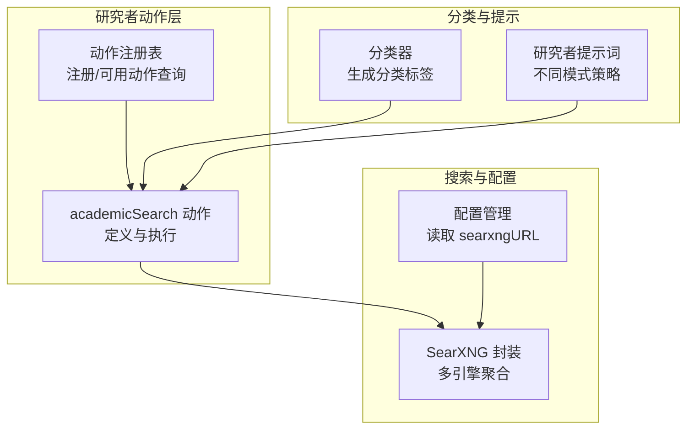
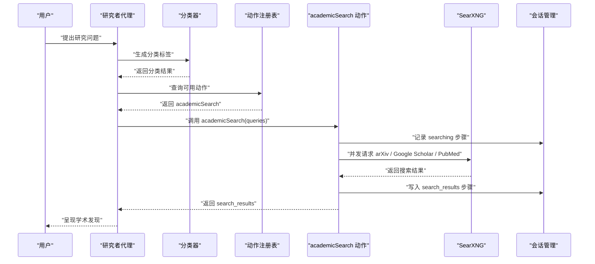
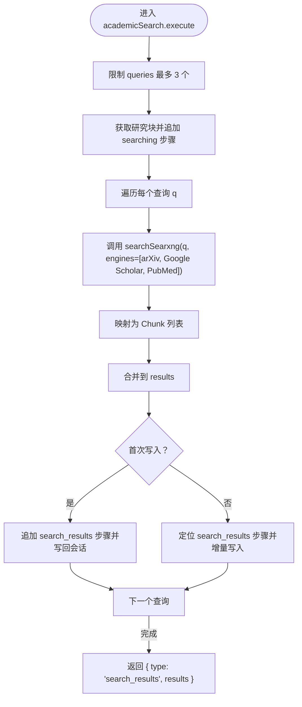
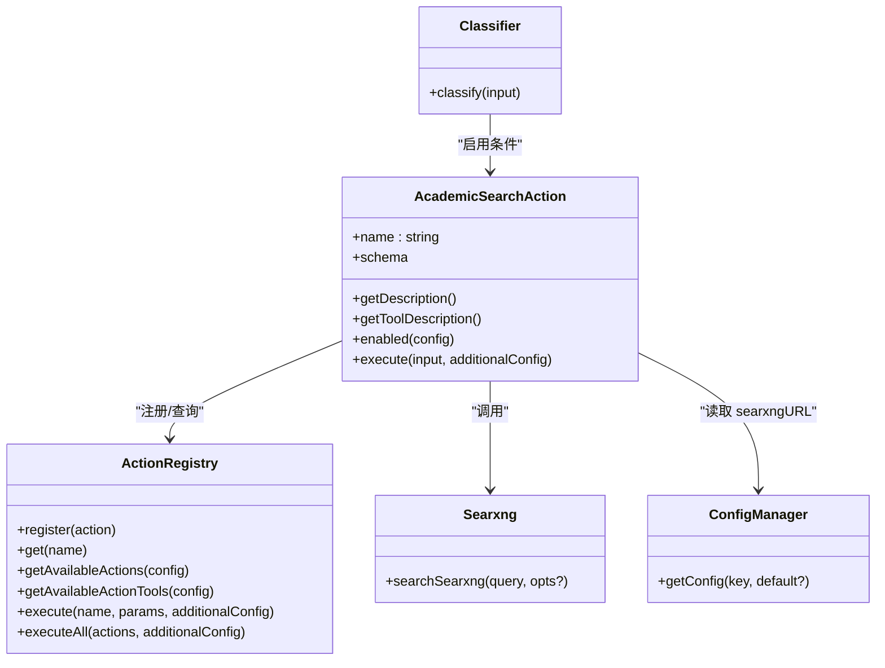

# 学术搜索动作

<cite>
**本文档引用的文件**
- [academicSearch.ts](file://src/lib/agents/search/researcher/actions/academicSearch.ts)
- [index.ts（动作注册）](file://src/lib/agents/search/researcher/actions/index.ts)
- [types.ts（研究者与动作类型）](file://src/lib/agents/search/types.ts)
- [classifier.ts（分类器）](file://src/lib/agents/search/classifier.ts)
- [researcher.ts（研究者提示词）](file://src/lib/prompts/search/researcher.ts)
- [searxng.ts（SearXNG封装）](file://src/lib/searxng.ts)
- [serverRegistry.ts（服务端配置读取）](file://src/lib/config/serverRegistry.ts)
- [config/index.ts（全局配置管理）](file://src/lib/config/index.ts)
- [types.ts（通用类型定义）](file://src/lib/types.ts)
</cite>

## 目录
1. [引言](#引言)
2. [项目结构](#项目结构)
3. [核心组件](#核心组件)
4. [架构总览](#架构总览)
5. [详细组件分析](#详细组件分析)
6. [依赖关系分析](#依赖关系分析)
7. [性能考虑](#性能考虑)
8. [故障排查指南](#故障排查指南)
9. [结论](#结论)
10. [附录：参数与配置说明](#附录参数与配置说明)

## 引言
本文件面向“学术搜索动作”（academicSearch）的专业文档，系统阐述其在 Perplexica 研究型搜索流程中的实现机制与运行逻辑。重点包括：
- 学术数据库与文献资源的集成方式（通过 SearXNG 聚合 arXiv、Google Scholar、PubMed）
- 查询构建逻辑（关键词匹配、作者检索、期刊筛选等高级搜索能力的可扩展性）
- 结果处理与验证机制（Chunk 化、元数据保留、会话块更新）
- 参数配置说明（数据库选择、时间范围限制、文献类型过滤等）
- 在科研场景中的应用案例（论文查找、文献综述、研究趋势分析）
- 性能优化建议与使用注意事项

## 项目结构
学术搜索动作位于研究者工具链中，作为一组可被智能调度的动作之一参与研究流程。其主要涉及以下模块：
- 动作定义与注册：定义 academicSearch 的输入模式、启用条件与执行逻辑，并注册到动作注册表
- 分类器：根据对话历史与用户问题判断是否需要进行学术搜索
- 提示词：为研究者代理提供不同模式下的行动策略与工具描述
- 搜索封装：统一调用 SearXNG 并支持多引擎聚合
- 配置管理：读取 SearXNG 实例地址与搜索相关配置

图表来源
- [academicSearch.ts](file://src/lib/agents/search/researcher/actions/academicSearch.ts#L22-L127)
- [index.ts（动作注册）](file://src/lib/agents/search/researcher/actions/index.ts#L1-L19)
- [classifier.ts（分类器）](file://src/lib/agents/search/classifier.ts#L37-L53)
- [researcher.ts（研究者提示词）](file://src/lib/prompts/search/researcher.ts#L320-L354)
- [searxng.ts（SearXNG封装）](file://src/lib/searxng.ts#L21-L53)
- [serverRegistry.ts（服务端配置读取）](file://src/lib/config/serverRegistry.ts#L14-L16)

章节来源
- [academicSearch.ts](file://src/lib/agents/search/researcher/actions/academicSearch.ts#L1-L130)
- [index.ts（动作注册）](file://src/lib/agents/search/researcher/actions/index.ts#L1-L19)
- [types.ts（研究者与动作类型）](file://src/lib/agents/search/types.ts#L1-L123)
- [classifier.ts（分类器）](file://src/lib/agents/search/classifier.ts#L1-L54)
- [researcher.ts（研究者提示词）](file://src/lib/prompts/search/researcher.ts#L1-L355)
- [searxng.ts（SearXNG封装）](file://src/lib/searxng.ts#L1-L54)
- [serverRegistry.ts（服务端配置读取）](file://src/lib/config/serverRegistry.ts#L1-L16)
- [config/index.ts（全局配置管理）](file://src/lib/config/index.ts#L1-L391)
- [types.ts（通用类型定义）](file://src/lib/types.ts#L1-L124)

## 核心组件
- academicSearch 动作：负责接收最多三个学术查询，异步并发调用 SearXNG 多引擎，收集结果并写入会话研究块
- 动作注册表：集中注册所有研究动作，按启用条件动态筛选可用动作
- 分类器：基于对话历史与用户问题输出分类标签，决定是否启用学术搜索
- SearXNG 封装：统一构造查询参数，支持多引擎、语言、分页等选项
- 配置管理：读取 SearXNG 地址，保证搜索后端可访问

章节来源
- [academicSearch.ts](file://src/lib/agents/search/researcher/actions/academicSearch.ts#L22-L127)
- [index.ts（动作注册）](file://src/lib/agents/search/researcher/actions/index.ts#L10-L16)
- [classifier.ts（分类器）](file://src/lib/agents/search/classifier.ts#L37-L53)
- [searxng.ts（SearXNG封装）](file://src/lib/searxng.ts#L21-L53)
- [serverRegistry.ts（服务端配置读取）](file://src/lib/config/serverRegistry.ts#L14-L16)

## 架构总览
学术搜索动作在研究流程中的位置如下：

图表来源
- [academicSearch.ts](file://src/lib/agents/search/researcher/actions/academicSearch.ts#L32-L126)
- [classifier.ts（分类器）](file://src/lib/agents/search/classifier.ts#L37-L53)
- [researcher.ts（研究者提示词）](file://src/lib/prompts/search/researcher.ts#L320-L354)
- [searxng.ts（SearXNG封装）](file://src/lib/searxng.ts#L21-L53)
- [types.ts（通用类型定义）](file://src/lib/types.ts#L110-L124)

## 详细组件分析

### academicSearch 动作实现机制
- 输入与约束
  - 接收 queries 数组，最多三个查询；超过部分会被截断
  - 使用 Zod Schema 校验输入结构
- 启用条件
  - sources 必须包含 academic
  - skipSearch 为 false
  - academicSearch 为 true
- 执行流程
  - 记录 searching 步骤到研究块
  - 并发执行每个查询，针对 arXiv、Google Scholar、PubMed 三引擎发起请求
  - 将结果映射为 Chunk（content + metadata），并写入 search_results 步骤
  - 返回统一的 search_results 输出

图表来源
- [academicSearch.ts](file://src/lib/agents/search/researcher/actions/academicSearch.ts#L32-L126)

章节来源
- [academicSearch.ts](file://src/lib/agents/search/researcher/actions/academicSearch.ts#L6-L31)
- [academicSearch.ts](file://src/lib/agents/search/researcher/actions/academicSearch.ts#L32-L126)

### 查询构建与高级搜索能力
- 关键词匹配
  - 通过传入 queries 进行精确关键词检索，支持短语与组合查询
- 作者检索
  - 可在查询中加入作者名或机构信息，由下游引擎（如 Google Scholar、PubMed）解析
- 期刊筛选
  - 可在查询中指定 journal 或 venue，由引擎侧过滤
- 时间范围限制
  - 当前实现未直接暴露时间范围参数；可通过在查询中显式包含时间限定词（如“2023–2024”）间接实现
- 文献类型过滤
  - 当前实现未直接暴露类型过滤参数；可在查询中使用引擎特定语法（如 site: 或 filetype:）进行约束

章节来源
- [academicSearch.ts](file://src/lib/agents/search/researcher/actions/academicSearch.ts#L60-L63)
- [searxng.ts（SearXNG封装）](file://src/lib/searxng.ts#L3-L8)

### 结果处理与验证机制
- 结果标准化
  - 统一映射为 Chunk，包含 content 与 metadata（title、url 等）
- 会话追踪
  - 在研究块中记录 searching 与 search_results 子步骤，便于可视化与回溯
- 增量更新
  - 首次写入时创建 search_results 步骤，后续并发结果增量追加
- 准确性保障
  - 通过多引擎聚合提升覆盖面；若需更强验证，可在上层增加去重与来源可信度评估

章节来源
- [academicSearch.ts](file://src/lib/agents/search/researcher/actions/academicSearch.ts#L65-L117)
- [types.ts（通用类型定义）](file://src/lib/types.ts#L34-L108)

### 动作注册与可用性控制
- 注册
  - academicSearch 动作在初始化时注册到 ActionRegistry
- 可用性
  - 仅当 sources 包含 academic 且 skipSearch 与 academicSearch 均为 true 时才启用
- 工具描述
  - 提供工具级描述与动作级描述，用于提示词注入与用户可见说明

章节来源
- [index.ts（动作注册）](file://src/lib/agents/search/researcher/actions/index.ts#L10-L16)
- [academicSearch.ts](file://src/lib/agents/search/researcher/actions/academicSearch.ts#L22-L31)

### 分类器与研究者提示词
- 分类器
  - 基于对话历史与用户问题输出分类标签，决定是否启用学术搜索
- 研究者提示词
  - 提供 speed/balanced/quality 三种模式下的行动策略，指导动作选择与迭代节奏

章节来源
- [classifier.ts（分类器）](file://src/lib/agents/search/classifier.ts#L37-L53)
- [researcher.ts（研究者提示词）](file://src/lib/prompts/search/researcher.ts#L320-L354)

### SearXNG 集成与配置
- SearXNG 封装
  - 支持 categories、engines、language、pageno 等参数
  - 统一错误处理与 JSON 解析
- 配置读取
  - 从配置中心读取 searxngURL，确保实例可达
- 全局配置
  - 支持环境变量注入与 UI 配置项（如 SEARXNG_API_URL）

章节来源
- [searxng.ts（SearXNG封装）](file://src/lib/searxng.ts#L21-L53)
- [serverRegistry.ts（服务端配置读取）](file://src/lib/config/serverRegistry.ts#L14-L16)
- [config/index.ts（全局配置管理）](file://src/lib/config/index.ts#L104-L116)

## 依赖关系分析
学术搜索动作的关键依赖如下：

图表来源
- [academicSearch.ts](file://src/lib/agents/search/researcher/actions/academicSearch.ts#L22-L127)
- [index.ts（动作注册）](file://src/lib/agents/search/researcher/actions/index.ts#L14-L16)
- [classifier.ts（分类器）](file://src/lib/agents/search/classifier.ts#L37-L53)
- [searxng.ts（SearXNG封装）](file://src/lib/searxng.ts#L21-L53)
- [serverRegistry.ts（服务端配置读取）](file://src/lib/config/serverRegistry.ts#L14-L16)
- [config/index.ts（全局配置管理）](file://src/lib/config/index.ts#L240-L252)

章节来源
- [academicSearch.ts](file://src/lib/agents/search/researcher/actions/academicSearch.ts#L1-L130)
- [index.ts（动作注册）](file://src/lib/agents/search/researcher/actions/index.ts#L1-L19)
- [classifier.ts（分类器）](file://src/lib/agents/search/classifier.ts#L1-L54)
- [searxng.ts（SearXNG封装）](file://src/lib/searxng.ts#L1-L54)
- [serverRegistry.ts（服务端配置读取）](file://src/lib/config/serverRegistry.ts#L1-L16)
- [config/index.ts（全局配置管理）](file://src/lib/config/index.ts#L1-L391)

## 性能考虑
- 并发搜索
  - 对多个查询采用 Promise.all 并发执行，显著降低总延迟
- 结果聚合
  - 将多引擎结果统一映射为 Chunk，减少上层适配成本
- 会话写入
  - 首次写入创建步骤，后续增量追加，避免重复写入开销
- 配置与网络
  - 确保 searxngURL 正确配置，避免网络超时与失败重试
- 可选优化
  - 在查询侧增加去重与排序，减少无效请求
  - 对长尾查询引入缓存策略（需结合业务需求）

## 故障排查指南
- SearXNG 请求失败
  - 现象：抛出错误并包含状态码与状态文本
  - 排查：确认 searxngURL 可达、网络连通性、引擎配置正确
- 动作未启用
  - 现象：academicSearch 不出现在可用动作列表
  - 排查：检查 sources 是否包含 academic、skipSearch 与 academicSearch 是否均为 true
- 结果为空或质量不佳
  - 现象：返回空或相关性不足
  - 排查：优化 queries 的关键词与限定词；尝试调整引擎组合
- 会话块未更新
  - 现象：研究块缺少 searching/search_results 步骤
  - 排查：确认 additionalConfig.researchBlockId 有效、会话管理器正常工作

章节来源
- [searxng.ts（SearXNG封装）](file://src/lib/searxng.ts#L43-L45)
- [academicSearch.ts](file://src/lib/agents/search/researcher/actions/academicSearch.ts#L28-L31)
- [academicSearch.ts](file://src/lib/agents/search/researcher/actions/academicSearch.ts#L35-L53)
- [academicSearch.ts](file://src/lib/agents/search/researcher/actions/academicSearch.ts#L82-L94)

## 结论
academicSearch 动作通过明确的输入约束、严格的启用条件与高效的并发搜索，实现了对 arXiv、Google Scholar、PubMed 等学术资源的统一检索。其与分类器、动作注册表、提示词与配置系统的协同，构成了研究型搜索的可靠基础。在实际应用中，建议通过优化查询策略、合理配置引擎与时间范围、以及在上层增加结果验证与去重机制，进一步提升学术搜索的准确性与用户体验。

## 附录：参数与配置说明
- 数据库选择
  - 通过 engines 参数选择 arXiv、Google Scholar、PubMed 等引擎
- 时间范围限制
  - 当前未直接暴露参数；可通过在查询中添加时间限定词实现
- 文献类型过滤
  - 当前未直接暴露参数；可在查询中使用引擎特定语法进行约束
- 配置项
  - searxngURL：SearXNG 实例地址（支持环境变量 SEARXNG_API_URL 注入）
  - sources：启用的搜索源集合（包含 academic 时方可启用学术搜索）

章节来源
- [academicSearch.ts](file://src/lib/agents/search/researcher/actions/academicSearch.ts#L60-L63)
- [searxng.ts（SearXNG封装）](file://src/lib/searxng.ts#L3-L8)
- [serverRegistry.ts（服务端配置读取）](file://src/lib/config/serverRegistry.ts#L14-L16)
- [config/index.ts（全局配置管理）](file://src/lib/config/index.ts#L104-L116)