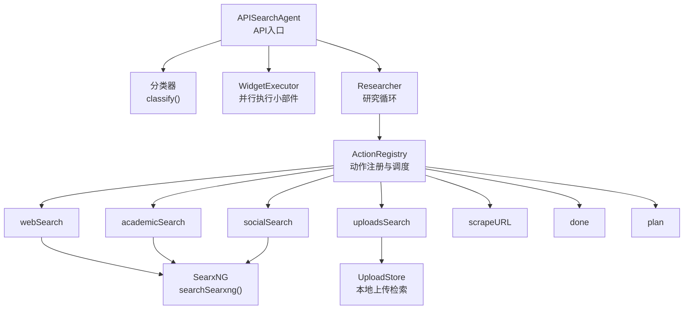
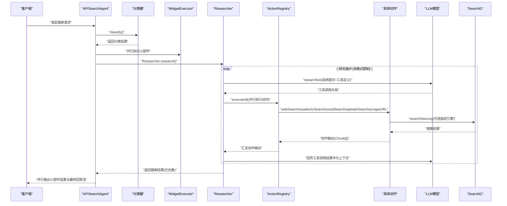
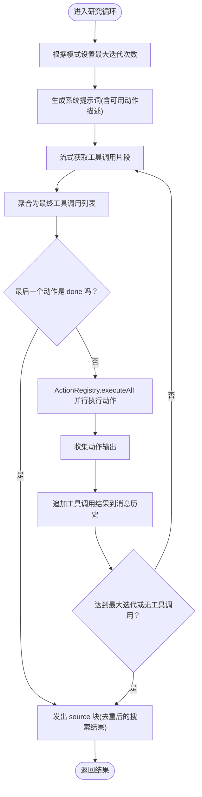
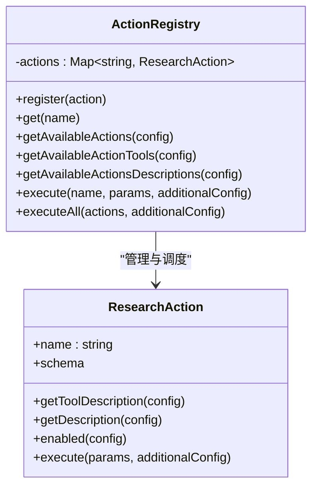
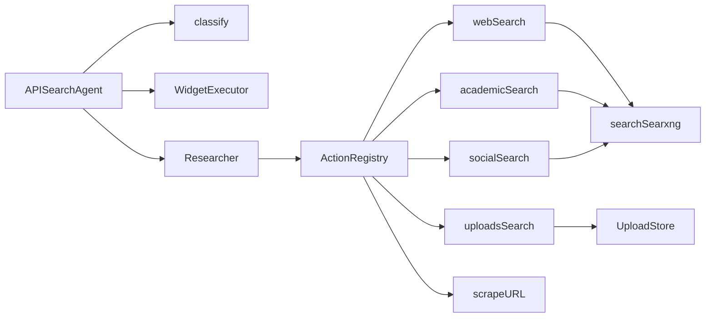

# 搜索动作执行

<cite>
**本文引用的文件**
- [src/lib/agents/search/researcher/index.ts](file://src/lib/agents/search/researcher/index.ts)
- [src/lib/agents/search/researcher/actions/index.ts](file://src/lib/agents/search/researcher/actions/index.ts)
- [src/lib/agents/search/researcher/actions/registry.ts](file://src/lib/agents/search/researcher/actions/registry.ts)
- [src/lib/agents/search/types.ts](file://src/lib/agents/search/types.ts)
- [src/lib/agents/search/api.ts](file://src/lib/agents/search/api.ts)
- [src/lib/agents/search/researcher/actions/webSearch.ts](file://src/lib/agents/search/researcher/actions/webSearch.ts)
- [src/lib/agents/search/researcher/actions/uploadsSearch.ts](file://src/lib/agents/search/researcher/actions/uploadsSearch.ts)
- [src/lib/agents/search/researcher/actions/academicSearch.ts](file://src/lib/agents/search/researcher/actions/academicSearch.ts)
- [src/lib/agents/search/researcher/actions/socialSearch.ts](file://src/lib/agents/search/researcher/actions/socialSearch.ts)
- [src/lib/agents/search/researcher/actions/scrapeURL.ts](file://src/lib/agents/search/researcher/actions/scrapeURL.ts)
- [src/lib/agents/search/researcher/actions/done.ts](file://src/lib/agents/search/researcher/actions/done.ts)
- [src/lib/agents/search/researcher/actions/plan.ts](file://src/lib/agents/search/researcher/actions/plan.ts)
- [src/lib/agents/search/classifier.ts](file://src/lib/agents/search/classifier.ts)
- [src/lib/agents/search/widgets/index.ts](file://src/lib/agents/search/widgets/index.ts)
- [src/lib/searxng.ts](file://src/lib/searxng.ts)
</cite>

## 目录
1. [简介](#简介)
2. [项目结构](#项目结构)
3. [核心组件](#核心组件)
4. [架构总览](#架构总览)
5. [详细组件分析](#详细组件分析)
6. [依赖关系分析](#依赖关系分析)
7. [性能考虑](#性能考虑)
8. [故障排查指南](#故障排查指南)
9. [结论](#结论)
10. [附录：扩展与新增搜索动作指南](#附录扩展与新增搜索动作指南)

## 简介
本文件系统性梳理 Perplexica 的“搜索动作执行”体系，重点围绕 Researcher 类的设计与执行流程展开，涵盖以下方面：
- 搜索动作的编排机制与迭代控制
- 并行执行策略与并发控制
- 错误处理与容错思路
- 各类搜索动作实现：webSearch、uploadsSearch、academicSearch、socialSearch、scrapeURL、done、plan
- 参数传递、结果收集、异常处理的关键环节
- 扩展指南：如何添加新的搜索源与搜索策略
- 性能优化与并发控制建议

## 项目结构
搜索动作执行系统位于 src/lib/agents/search 目录下，主要由以下层次构成：
- API 入口层：APISearchAgent 负责分类、并行执行小部件与研究者搜索，并最终生成回答流
- 分类器：根据对话历史与用户问题进行意图分类，决定是否需要搜索以及使用哪些搜索源
- Researcher：主研究循环，基于 LLM 工具调用驱动动作执行，收集结果并去重
- 动作注册中心：ActionRegistry 统一注册与调度所有搜索动作
- 搜索动作实现：webSearch、uploadsSearch、academicSearch、socialSearch、scrapeURL、done、plan
- 小部件：天气、股票、计算等小部件的并行执行
- 搜索后端：通过 SearxNG 提供统一的搜索引擎访问能力

图表来源
- [src/lib/agents/search/api.ts](file://src/lib/agents/search/api.ts#L1-L100)
- [src/lib/agents/search/classifier.ts](file://src/lib/agents/search/classifier.ts#L1-L54)
- [src/lib/agents/search/researcher/index.ts](file://src/lib/agents/search/researcher/index.ts#L1-L223)
- [src/lib/agents/search/researcher/actions/index.ts](file://src/lib/agents/search/researcher/actions/index.ts#L1-L19)
- [src/lib/agents/search/researcher/actions/registry.ts](file://src/lib/agents/search/researcher/actions/registry.ts#L1-L106)
- [src/lib/agents/search/researcher/actions/webSearch.ts](file://src/lib/agents/search/researcher/actions/webSearch.ts#L1-L183)
- [src/lib/agents/search/researcher/actions/academicSearch.ts](file://src/lib/agents/search/researcher/actions/academicSearch.ts#L1-L130)
- [src/lib/agents/search/researcher/actions/socialSearch.ts](file://src/lib/agents/search/researcher/actions/socialSearch.ts#L1-L130)
- [src/lib/agents/search/researcher/actions/uploadsSearch.ts](file://src/lib/agents/search/researcher/actions/uploadsSearch.ts#L1-L103)
- [src/lib/agents/search/researcher/actions/scrapeURL.ts](file://src/lib/agents/search/researcher/actions/scrapeURL.ts#L1-L140)
- [src/lib/searxng.ts](file://src/lib/searxng.ts#L1-L54)

章节来源
- [src/lib/agents/search/api.ts](file://src/lib/agents/search/api.ts#L1-L100)
- [src/lib/agents/search/researcher/index.ts](file://src/lib/agents/search/researcher/index.ts#L1-L223)

## 核心组件
- APISearchAgent：负责整体流程编排，先进行意图分类，再并行执行小部件与 Researcher 搜索，最后以流式方式输出最终回答。
- 分类器 classify：基于 LLM 输出结构化分类结果，决定是否跳过搜索、是否个人搜索、是否学术/讨论搜索等。
- Researcher：核心研究循环，依据模式（速度/平衡/质量）限制最大迭代次数，动态生成提示词，接收 LLM 工具调用，串行解析工具调用片段，聚合为最终工具调用列表，随后并行执行所有动作，收集结果并去重。
- ActionRegistry：动作注册中心，提供可用动作筛选、工具描述生成、单个/批量执行等能力。
- 搜索动作：webSearch、uploadsSearch、academicSearch、socialSearch、scrapeURL、done、plan。
- 小部件：天气、股票、计算等，与搜索并行执行。
- SearxNG：统一的搜索引擎访问封装，支持多引擎、多分类。

章节来源
- [src/lib/agents/search/api.ts](file://src/lib/agents/search/api.ts#L1-L100)
- [src/lib/agents/search/classifier.ts](file://src/lib/agents/search/classifier.ts#L1-L54)
- [src/lib/agents/search/researcher/index.ts](file://src/lib/agents/search/researcher/index.ts#L1-L223)
- [src/lib/agents/search/researcher/actions/registry.ts](file://src/lib/agents/search/researcher/actions/registry.ts#L1-L106)
- [src/lib/searxng.ts](file://src/lib/searxng.ts#L1-L54)

## 架构总览
下面的时序图展示了从 API 请求到最终回答输出的完整链路，包括分类、并行执行小部件与搜索、结果去重与最终回答生成。

图表来源
- [src/lib/agents/search/api.ts](file://src/lib/agents/search/api.ts#L1-L100)
- [src/lib/agents/search/researcher/index.ts](file://src/lib/agents/search/researcher/index.ts#L1-L223)
- [src/lib/agents/search/researcher/actions/registry.ts](file://src/lib/agents/search/researcher/actions/registry.ts#L1-L106)
- [src/lib/agents/search/researcher/actions/webSearch.ts](file://src/lib/agents/search/researcher/actions/webSearch.ts#L1-L183)
- [src/lib/agents/search/researcher/actions/academicSearch.ts](file://src/lib/agents/search/researcher/actions/academicSearch.ts#L1-L130)
- [src/lib/agents/search/researcher/actions/socialSearch.ts](file://src/lib/agents/search/researcher/actions/socialSearch.ts#L1-L130)
- [src/lib/agents/search/researcher/actions/uploadsSearch.ts](file://src/lib/agents/search/researcher/actions/uploadsSearch.ts#L1-L103)
- [src/lib/agents/search/researcher/actions/scrapeURL.ts](file://src/lib/agents/search/researcher/actions/scrapeURL.ts#L1-L140)
- [src/lib/searxng.ts](file://src/lib/searxng.ts#L1-L54)

## 详细组件分析

### Researcher 类：设计与执行流程
- 迭代控制：根据模式（speed/balanced/quality）设置最大迭代次数；每轮迭代中，Researcher 基于当前可用动作生成系统提示词，调用 LLM 的流式文本接口，逐步拼接工具调用片段，最终形成完整的工具调用列表。
- 并行执行：在每轮结束后，对所有工具调用通过 ActionRegistry.executeAll 并行执行，提升吞吐。
- 结果收集与去重：将所有动作输出中的搜索结果合并，按 URL 去重并合并内容，确保同一链接的内容被聚合，避免重复展示。
- 会话块更新：在研究过程中，Researcher 通过 SessionManager emitBlock/updateBlock 记录推理步骤与中间结果，便于前端可视化与调试。

图表来源
- [src/lib/agents/search/researcher/index.ts](file://src/lib/agents/search/researcher/index.ts#L1-L223)
- [src/lib/agents/search/researcher/actions/registry.ts](file://src/lib/agents/search/researcher/actions/registry.ts#L1-L106)

章节来源
- [src/lib/agents/search/researcher/index.ts](file://src/lib/agents/search/researcher/index.ts#L1-L223)

### 动作注册中心：ActionRegistry
- 注册与查询：通过名称注册动作，支持按名称查询与批量获取可用动作。
- 可用动作筛选：根据分类结果、文件 ID 列表、模式与启用源，动态筛选可用动作。
- 工具描述生成：为每个可用动作生成工具描述与 JSON Schema，供 LLM 使用。
- 执行策略：支持单个动作执行与批量并行执行，批量执行内部使用 Promise.all 实现并发。

图表来源
- [src/lib/agents/search/researcher/actions/registry.ts](file://src/lib/agents/search/researcher/actions/registry.ts#L1-L106)
- [src/lib/agents/search/types.ts](file://src/lib/agents/search/types.ts#L102-L122)

章节来源
- [src/lib/agents/search/researcher/actions/registry.ts](file://src/lib/agents/search/researcher/actions/registry.ts#L1-L106)
- [src/lib/agents/search/types.ts](file://src/lib/agents/search/types.ts#L102-L122)

### 搜索动作实现概览
- webSearch：面向通用网页搜索，支持三种模式下的查询策略，最多并发 3 个查询，使用 SearxNG 默认引擎集合。
- uploadsSearch：面向用户上传文件的本地检索，结合嵌入模型与上传 Store 查询，按 URL 去重与内容合并。
- academicSearch：面向学术论文与研究资料，限定 arxiv、google scholar、pubmed 引擎，适合学术场景。
- socialSearch：面向社交与讨论，限定 reddit 引擎，适合舆情与公众观点收集。
- scrapeURL：直接抓取指定 URL 内容并转换为 Markdown，用于用户明确要求特定页面信息的场景。
- plan：仅在非 speed 模式下启用，用于在每轮开始前输出自然语言计划，帮助用户感知思考过程。
- done：用于显式结束研究流程，Researcher 在达到最大迭代或收到该动作时终止循环。

章节来源
- [src/lib/agents/search/researcher/actions/webSearch.ts](file://src/lib/agents/search/researcher/actions/webSearch.ts#L1-L183)
- [src/lib/agents/search/researcher/actions/uploadsSearch.ts](file://src/lib/agents/search/researcher/actions/uploadsSearch.ts#L1-L103)
- [src/lib/agents/search/researcher/actions/academicSearch.ts](file://src/lib/agents/search/researcher/actions/academicSearch.ts#L1-L130)
- [src/lib/agents/search/researcher/actions/socialSearch.ts](file://src/lib/agents/search/researcher/actions/socialSearch.ts#L1-L130)
- [src/lib/agents/search/researcher/actions/scrapeURL.ts](file://src/lib/agents/search/researcher/actions/scrapeURL.ts#L1-L140)
- [src/lib/agents/search/researcher/actions/plan.ts](file://src/lib/agents/search/researcher/actions/plan.ts#L1-L41)
- [src/lib/agents/search/researcher/actions/done.ts](file://src/lib/agents/search/researcher/actions/done.ts#L1-L25)

### 参数传递、结果收集与异常处理
- 参数传递：每个动作通过 ResearchAction.schema 定义输入参数，例如 queries 数组；additionalConfig 包含 llm、embedding、session、fileIds、researchBlockId 等运行时上下文。
- 结果收集：动作返回统一的 ActionOutput 结构，其中搜索动作返回包含 Chunk[] 的结果；Researcher 将所有搜索结果按 URL 去重并合并内容，避免重复与冗余。
- 异常处理：scrapeURL 对单个 URL 抓取失败时记录错误信息而非中断整体流程；ActionRegistry.executeAll 使用 Promise.all，若某个动作抛错会影响整体 Promise.all 的收敛，需在上层捕获并处理。

章节来源
- [src/lib/agents/search/types.ts](file://src/lib/agents/search/types.ts#L97-L122)
- [src/lib/agents/search/researcher/actions/scrapeURL.ts](file://src/lib/agents/search/researcher/actions/scrapeURL.ts#L120-L129)
- [src/lib/agents/search/researcher/actions/registry.ts](file://src/lib/agents/search/researcher/actions/registry.ts#L81-L102)

### 并发控制与性能优化
- 并发策略：每轮工具调用结束后，ActionRegistry.executeAll 使用 Promise.all 并行执行所有动作，最大化吞吐。
- 查询并发：webSearch、academicSearch、socialSearch 中对 queries 的每个查询独立发起请求，内部使用 Promise.all 并发拉取多个结果，显著降低总延迟。
- 去重与合并：按 URL 去重并合并内容，减少重复展示与后续处理成本。
- 模式影响：speed 模式限制迭代次数，优先一次性获取关键信息；balanced/quality 模式允许多次迭代，逐步细化查询，兼顾准确性与成本。

章节来源
- [src/lib/agents/search/researcher/actions/registry.ts](file://src/lib/agents/search/researcher/actions/registry.ts#L90-L102)
- [src/lib/agents/search/researcher/actions/webSearch.ts](file://src/lib/agents/search/researcher/actions/webSearch.ts#L173-L174)
- [src/lib/agents/search/researcher/actions/academicSearch.ts](file://src/lib/agents/search/researcher/actions/academicSearch.ts#L120-L121)
- [src/lib/agents/search/researcher/actions/socialSearch.ts](file://src/lib/agents/search/researcher/actions/socialSearch.ts#L120-L121)
- [src/lib/agents/search/researcher/index.ts](file://src/lib/agents/search/researcher/index.ts#L188-L207)

## 依赖关系分析
- APISearchAgent 依赖分类器、WidgetExecutor 与 Researcher；Researcher 依赖 ActionRegistry 与 SessionManager；ActionRegistry 统一调度各动作；动作实现依赖 SearxNG 或 UploadStore；scrapeURL 直接依赖网络抓取。
- 搜索动作与 SearxNG 的耦合体现在 webSearch、academicSearch、socialSearch；uploadsSearch 与 UploadStore 耦合。

图表来源
- [src/lib/agents/search/api.ts](file://src/lib/agents/search/api.ts#L1-L100)
- [src/lib/agents/search/researcher/index.ts](file://src/lib/agents/search/researcher/index.ts#L1-L223)
- [src/lib/agents/search/researcher/actions/index.ts](file://src/lib/agents/search/researcher/actions/index.ts#L1-L19)
- [src/lib/agents/search/researcher/actions/webSearch.ts](file://src/lib/agents/search/researcher/actions/webSearch.ts#L1-L183)
- [src/lib/agents/search/researcher/actions/academicSearch.ts](file://src/lib/agents/search/researcher/actions/academicSearch.ts#L1-L130)
- [src/lib/agents/search/researcher/actions/socialSearch.ts](file://src/lib/agents/search/researcher/actions/socialSearch.ts#L1-L130)
- [src/lib/agents/search/researcher/actions/uploadsSearch.ts](file://src/lib/agents/search/researcher/actions/uploadsSearch.ts#L1-L103)
- [src/lib/searxng.ts](file://src/lib/searxng.ts#L1-L54)

章节来源
- [src/lib/agents/search/api.ts](file://src/lib/agents/search/api.ts#L1-L100)
- [src/lib/agents/search/researcher/actions/index.ts](file://src/lib/agents/search/researcher/actions/index.ts#L1-L19)

## 性能考虑
- 并发优先：在动作内部与动作之间均采用 Promise.all 并发，显著缩短端到端时延。
- 查询粒度：将一次动作内的多个查询拆分为独立请求并发执行，充分利用网络带宽与搜索引擎能力。
- 结果去重：按 URL 去重与内容合并，减少下游处理与展示成本。
- 模式权衡：speed 模式追求低延迟，balanced/quality 模式在准确性与成本间折中，应根据业务 SLA 选择。
- 外部依赖：SearxNG 的可用性与响应时间直接影响整体性能，建议部署高可用实例并配置超时与重试。

[本节为通用性能建议，不直接分析具体文件]

## 故障排查指南
- LLM 工具调用未返回：检查 ActionRegistry.getAvailableActionTools 是否正确生成工具描述与 Schema；确认 LLM 的工具调用解析逻辑是否正确拼接片段。
- 搜索结果为空：确认 sources 配置与分类结果是否允许相应动作；检查 SearxNG 引擎配置与网络连通性。
- 并发异常：ActionRegistry.executeAll 使用 Promise.all，任一动作抛错会导致整体失败；建议在外层捕获并记录错误，同时考虑降级策略。
- URL 抓取失败：scrapeURL 对单个 URL 失败会记录错误信息，不影响其他 URL；检查目标站点可访问性与跨域策略。
- 会话块更新失败：确保 SessionManager 的 updateBlock 调用路径正确，block 类型与路径一致。

章节来源
- [src/lib/agents/search/researcher/actions/registry.ts](file://src/lib/agents/search/researcher/actions/registry.ts#L81-L102)
- [src/lib/agents/search/researcher/actions/scrapeURL.ts](file://src/lib/agents/search/researcher/actions/scrapeURL.ts#L120-L129)
- [src/lib/agents/search/researcher/index.ts](file://src/lib/agents/search/researcher/index.ts#L164-L182)

## 结论
该搜索动作执行系统通过清晰的分层设计与严格的动作契约，实现了可扩展、可并行、可观测的研究流程。Researcher 以模式驱动的迭代策略与 LLM 工具调用为核心，配合 ActionRegistry 的统一调度与去重聚合，能够在不同性能目标下稳定产出高质量搜索结果。通过 SearxNG 与本地上传检索的组合，系统覆盖了通用、学术、社交与个人知识等多种场景。

## 附录：扩展与新增搜索动作指南
- 新增动作步骤
  1) 定义动作类：实现 ResearchAction 接口，包含 name、schema、getToolDescription、getDescription、enabled、execute。
  2) 编写动作逻辑：在 execute 中完成参数校验、调用外部服务（如 SearxNG 或本地存储）、构造 Chunk[] 结果。
  3) 注册动作：在动作索引文件中导入并注册到 ActionRegistry。
  4) 权限与模式：在 enabled 中根据 classification、fileIds、mode、sources 控制动作可用性。
  5) 测试与验证：编写单元测试，覆盖正常路径、边界条件与异常路径。
- 新增搜索源
  1) 若为 SearxNG 引擎：在对应动作中通过 searchSearxng 的 engines 参数指定新引擎；或在 searchSearxng 增加默认引擎集合。
  2) 若为自建后端：新增适配器函数，遵循现有 Chunk 结构，复用现有动作框架。
- 新增搜索策略
  1) 在动作的 getDescription/getToolDescription 中描述策略；在 enabled 中根据 classification 与 sources 控制启用。
  2) 在 Researcher 的迭代策略中，通过模式与工具调用顺序控制策略执行时机。

章节来源
- [src/lib/agents/search/researcher/actions/index.ts](file://src/lib/agents/search/researcher/actions/index.ts#L1-L19)
- [src/lib/agents/search/researcher/actions/registry.ts](file://src/lib/agents/search/researcher/actions/registry.ts#L14-L20)
- [src/lib/agents/search/researcher/actions/webSearch.ts](file://src/lib/agents/search/researcher/actions/webSearch.ts#L84-L86)
- [src/lib/agents/search/researcher/actions/academicSearch.ts](file://src/lib/agents/search/researcher/actions/academicSearch.ts#L28-L31)
- [src/lib/agents/search/researcher/actions/socialSearch.ts](file://src/lib/agents/search/researcher/actions/socialSearch.ts#L28-L31)
- [src/lib/agents/search/researcher/actions/uploadsSearch.ts](file://src/lib/agents/search/researcher/actions/uploadsSearch.ts#L15-L18)
- [src/lib/searxng.ts](file://src/lib/searxng.ts#L21-L53)