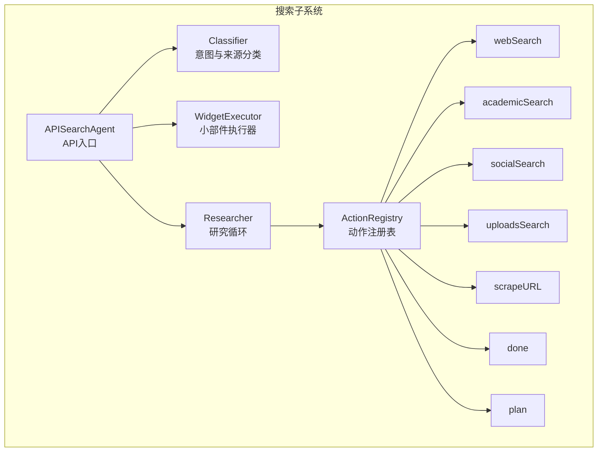
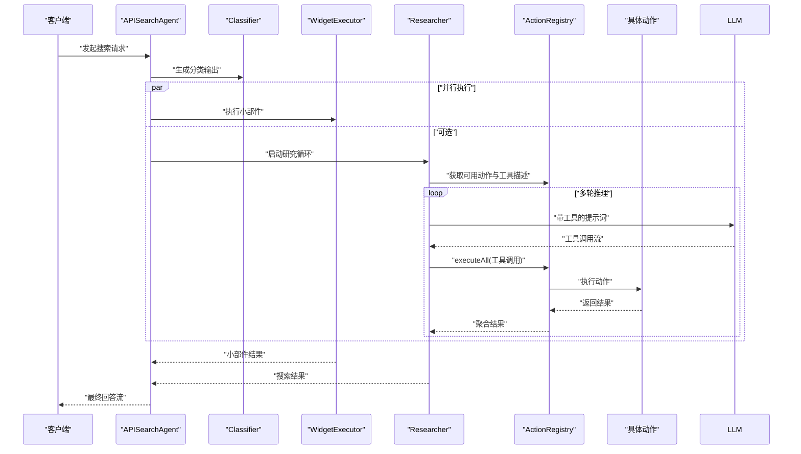
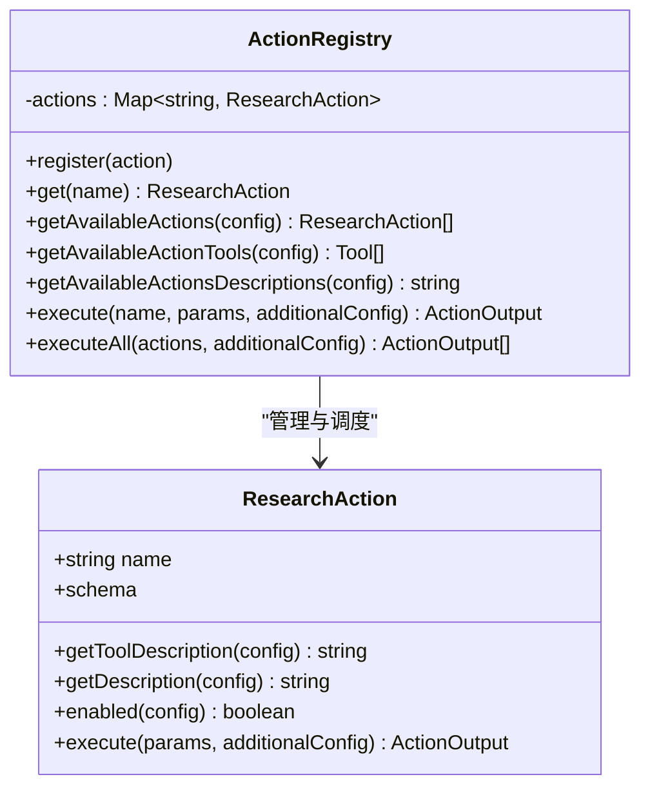
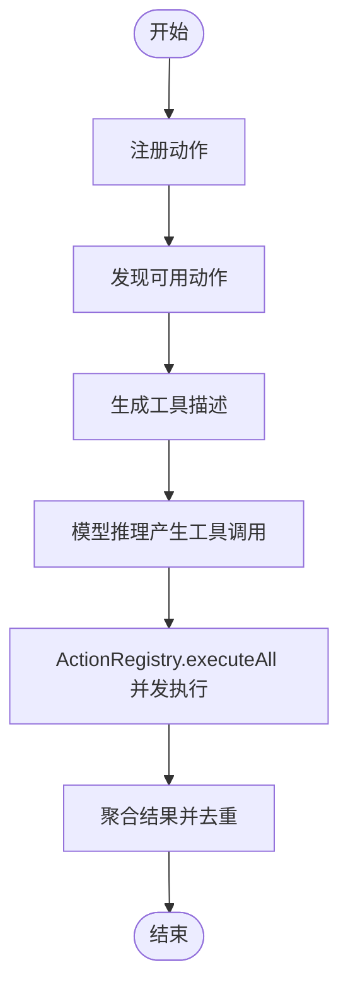
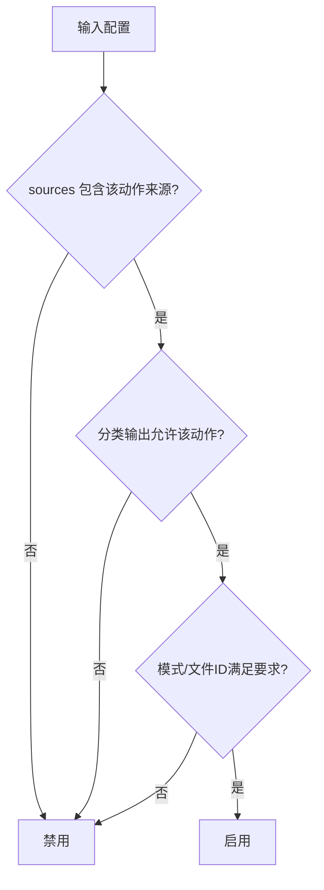
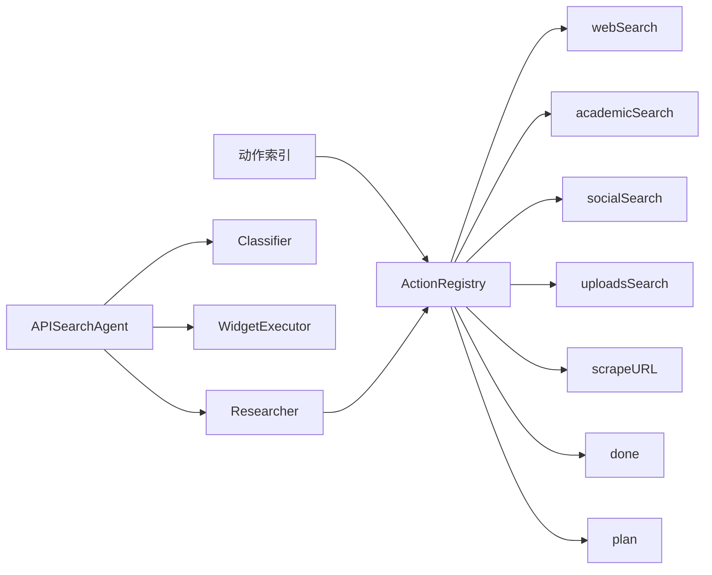

# 搜索动作注册表

<cite>
**本文引用的文件**
- [src/lib/agents/search/researcher/actions/registry.ts](file://src/lib/agents/search/researcher/actions/registry.ts)
- [src/lib/agents/search/researcher/actions/index.ts](file://src/lib/agents/search/researcher/actions/index.ts)
- [src/lib/agents/search/types.ts](file://src/lib/agents/search/types.ts)
- [src/lib/agents/search/classifier.ts](file://src/lib/agents/search/classifier.ts)
- [src/lib/agents/search/api.ts](file://src/lib/agents/search/api.ts)
- [src/lib/agents/search/researcher/actions/webSearch.ts](file://src/lib/agents/search/researcher/actions/webSearch.ts)
- [src/lib/agents/search/researcher/actions/academicSearch.ts](file://src/lib/agents/search/researcher/actions/academicSearch.ts)
- [src/lib/agents/search/researcher/actions/socialSearch.ts](file://src/lib/agents/search/researcher/actions/socialSearch.ts)
- [src/lib/agents/search/researcher/actions/uploadsSearch.ts](file://src/lib/agents/search/researcher/actions/uploadsSearch.ts)
- [src/lib/agents/search/researcher/actions/scrapeURL.ts](file://src/lib/agents/search/researcher/actions/scrapeURL.ts)
- [src/lib/agents/search/researcher/actions/done.ts](file://src/lib/agents/search/researcher/actions/done.ts)
- [src/lib/agents/search/researcher/actions/plan.ts](file://src/lib/agents/search/researcher/actions/plan.ts)
- [src/lib/agents/search/researcher/index.ts](file://src/lib/agents/search/researcher/index.ts)
- [src/lib/agents/search/widgets/index.ts](file://src/lib/agents/search/widgets/index.ts)
- [src/lib/agents/search/widgets/executor.ts](file://src/lib/agents/search/widgets/executor.ts)
</cite>

## 目录
1. [简介](#简介)
2. [项目结构](#项目结构)
3. [核心组件](#核心组件)
4. [架构总览](#架构总览)
5. [详细组件分析](#详细组件分析)
6. [依赖关系分析](#依赖关系分析)
7. [性能考虑](#性能考虑)
8. [故障排查指南](#故障排查指南)
9. [结论](#结论)
10. [附录：扩展与开发指南](#附录扩展与开发指南)

## 简介
本文件系统化阐述“搜索动作注册表”的架构设计与实现机制，覆盖以下关键主题：
- 动态注册、发现与管理：ActionRegistry 如何集中管理搜索动作，提供查询、过滤与批量执行能力。
- 生命周期管理：从注册、可用性判定、工具描述生成、到执行与结果聚合的完整流程。
- 可用性检查机制：基于分类输出、来源配置、模式（速度/平衡/质量）与文件ID等条件进行启用判定。
- 配置与参数传递：默认参数限制、Zod 参数校验、附加配置注入与错误处理策略。
- 扩展开发指南：新增搜索动作类型的步骤、接口约束与最佳实践。
- 性能优化与并发安全：并发执行、去重与会话状态更新的线程安全策略。

## 项目结构
搜索动作注册表位于研究者（Researcher）子系统中，围绕“动作”（ResearchAction）抽象构建，配合分类器（Classifier）、小部件（Widget）执行器与 API 入口协同工作。

图表来源
- [src/lib/agents/search/api.ts](file://src/lib/agents/search/api.ts#L8-L96)
- [src/lib/agents/search/classifier.ts](file://src/lib/agents/search/classifier.ts#L37-L53)
- [src/lib/agents/search/researcher/index.ts](file://src/lib/agents/search/researcher/index.ts#L9-L222)
- [src/lib/agents/search/researcher/actions/registry.ts](file://src/lib/agents/search/researcher/actions/registry.ts#L11-L105)
- [src/lib/agents/search/researcher/actions/index.ts](file://src/lib/agents/search/researcher/actions/index.ts#L1-L19)

章节来源
- [src/lib/agents/search/api.ts](file://src/lib/agents/search/api.ts#L8-L96)
- [src/lib/agents/search/researcher/index.ts](file://src/lib/agents/search/researcher/index.ts#L9-L222)
- [src/lib/agents/search/researcher/actions/registry.ts](file://src/lib/agents/search/researcher/actions/registry.ts#L11-L105)
- [src/lib/agents/search/researcher/actions/index.ts](file://src/lib/agents/search/researcher/actions/index.ts#L1-L19)

## 核心组件
- ActionRegistry：静态单例注册表，负责动作注册、可用性筛选、工具描述生成、按名称执行与批量执行。
- ResearchAction 接口：统一的动作契约，包含名称、参数模式（Zod）、描述生成、启用条件与执行逻辑。
- Researcher：驱动搜索循环，动态生成工具列表与描述，接收模型推理的工具调用，交由 ActionRegistry 执行。
- 分类器（Classifier）：根据对话历史与用户问题生成分类输出，决定动作可用性与后续行为。
- 小部件执行器（WidgetExecutor）：独立于动作的辅助信息源，与搜索并行执行，结果合并进最终回答上下文。
- 动作实现：webSearch、academicSearch、socialSearch、uploadsSearch、scrapeURL、done、plan。

章节来源
- [src/lib/agents/search/researcher/actions/registry.ts](file://src/lib/agents/search/researcher/actions/registry.ts#L11-L105)
- [src/lib/agents/search/types.ts](file://src/lib/agents/search/types.ts#L102-L122)
- [src/lib/agents/search/researcher/index.ts](file://src/lib/agents/search/researcher/index.ts#L9-L222)
- [src/lib/agents/search/classifier.ts](file://src/lib/agents/search/classifier.ts#L37-L53)
- [src/lib/agents/search/widgets/executor.ts](file://src/lib/agents/search/widgets/executor.ts#L3-L36)

## 架构总览
下图展示了从 API 到动作执行的端到端流程，包括分类、小部件并行、研究循环与动作执行。

图表来源
- [src/lib/agents/search/api.ts](file://src/lib/agents/search/api.ts#L9-L96)
- [src/lib/agents/search/classifier.ts](file://src/lib/agents/search/classifier.ts#L37-L53)
- [src/lib/agents/search/widgets/executor.ts](file://src/lib/agents/search/widgets/executor.ts#L14-L33)
- [src/lib/agents/search/researcher/index.ts](file://src/lib/agents/search/researcher/index.ts#L22-L182)
- [src/lib/agents/search/researcher/actions/registry.ts](file://src/lib/agents/search/researcher/actions/registry.ts#L64-L102)

## 详细组件分析

### ActionRegistry 设计与实现
- 注册与存储：使用 Map 存储动作实例，键为动作名称，支持 O(1) 查找。
- 可用性筛选：依据分类输出、来源集合、模式与文件ID判断动作是否启用，仅返回可用动作。
- 工具描述生成：将可用动作转换为 LLM 可用的工具定义（名称、描述、参数模式）。
- 动作描述生成：为提示词构造动作说明文本，区分不同模式下的行为策略。
- 单动作执行：按名称查找动作并执行，未找到时抛出错误。
- 批量执行：并发执行多个工具调用，聚合结果并保持顺序一致性。

图表来源
- [src/lib/agents/search/researcher/actions/registry.ts](file://src/lib/agents/search/researcher/actions/registry.ts#L11-L105)
- [src/lib/agents/search/types.ts](file://src/lib/agents/search/types.ts#L102-L122)

章节来源
- [src/lib/agents/search/researcher/actions/registry.ts](file://src/lib/agents/search/researcher/actions/registry.ts#L11-L105)
- [src/lib/agents/search/types.ts](file://src/lib/agents/search/types.ts#L102-L122)

### 动作生命周期管理
- 注册阶段：在动作索引文件中集中注册所有动作，确保全局可用。
- 发现阶段：Researcher 在每轮推理前通过 ActionRegistry 获取可用动作与工具描述。
- 执行阶段：根据模型返回的工具调用，ActionRegistry 并发执行动作，写入会话块以可视化研究过程。
- 结果聚合：Researcher 聚合所有搜索结果，去重后输出给最终回答模块。

图表来源
- [src/lib/agents/search/researcher/actions/index.ts](file://src/lib/agents/search/researcher/actions/index.ts#L10-L18)
- [src/lib/agents/search/researcher/index.ts](file://src/lib/agents/search/researcher/index.ts#L22-L182)
- [src/lib/agents/search/researcher/actions/registry.ts](file://src/lib/agents/search/researcher/actions/registry.ts#L64-L102)

章节来源
- [src/lib/agents/search/researcher/actions/index.ts](file://src/lib/agents/search/researcher/actions/index.ts#L10-L18)
- [src/lib/agents/search/researcher/index.ts](file://src/lib/agents/search/researcher/index.ts#L22-L182)
- [src/lib/agents/search/researcher/actions/registry.ts](file://src/lib/agents/search/researcher/actions/registry.ts#L64-L102)

### 可用性检查机制
- 来源限制：动作需在配置的来源集合中才可用（如 web、discussions、academic）。
- 分类开关：动作启用还取决于分类输出中的布尔标志（如 skipSearch、personalSearch、academicSearch、discussionSearch）。
- 模式影响：不同模式（speed/balanced/quality）影响动作描述与最大迭代次数，间接影响可用性。
- 文件依赖：个人上传搜索需要存在 fileIds 或满足 personalSearch 条件。

图表来源
- [src/lib/agents/search/researcher/actions/webSearch.ts](file://src/lib/agents/search/researcher/actions/webSearch.ts#L84-L86)
- [src/lib/agents/search/researcher/actions/academicSearch.ts](file://src/lib/agents/search/researcher/actions/academicSearch.ts#L28-L31)
- [src/lib/agents/search/researcher/actions/socialSearch.ts](file://src/lib/agents/search/researcher/actions/socialSearch.ts#L28-L31)
- [src/lib/agents/search/researcher/actions/uploadsSearch.ts](file://src/lib/agents/search/researcher/actions/uploadsSearch.ts#L15-L18)

章节来源
- [src/lib/agents/search/researcher/actions/webSearch.ts](file://src/lib/agents/search/researcher/actions/webSearch.ts#L84-L86)
- [src/lib/agents/search/researcher/actions/academicSearch.ts](file://src/lib/agents/search/researcher/actions/academicSearch.ts#L28-L31)
- [src/lib/agents/search/researcher/actions/socialSearch.ts](file://src/lib/agents/search/researcher/actions/socialSearch.ts#L28-L31)
- [src/lib/agents/search/researcher/actions/uploadsSearch.ts](file://src/lib/agents/search/researcher/actions/uploadsSearch.ts#L15-L18)

### 配置管理与参数传递
- 默认参数限制：多数动作对查询数量进行上限控制（例如最多 3 个查询/URL），避免过度负载。
- Zod 参数校验：每个动作定义严格的 schema，确保传参合法性与文档化。
- 附加配置注入：执行时注入 llm、embedding、session、researchBlockId、fileIds 等上下文。
- 错误处理：动作内部对网络或解析失败进行容错，返回结构化错误内容，保证整体流程不中断。

章节来源
- [src/lib/agents/search/researcher/actions/webSearch.ts](file://src/lib/agents/search/researcher/actions/webSearch.ts#L8-L11)
- [src/lib/agents/search/researcher/actions/academicSearch.ts](file://src/lib/agents/search/researcher/actions/academicSearch.ts#L6-L8)
- [src/lib/agents/search/researcher/actions/socialSearch.ts](file://src/lib/agents/search/researcher/actions/socialSearch.ts#L6-L8)
- [src/lib/agents/search/researcher/actions/uploadsSearch.ts](file://src/lib/agents/search/researcher/actions/uploadsSearch.ts#L5-L11)
- [src/lib/agents/search/researcher/actions/scrapeURL.ts](file://src/lib/agents/search/researcher/actions/scrapeURL.ts#L9-L11)
- [src/lib/agents/search/researcher/actions/registry.ts](file://src/lib/agents/search/researcher/actions/registry.ts#L64-L79)

### 动作实现要点与差异
- webSearch：面向通用网页搜索，按模式调整查询策略与迭代次数；并发拉取多个查询结果并写入研究块。
- academicSearch：限定学术引擎（如 arxiv、google scholar、pubmed），适合科研场景。
- socialSearch：限定社交引擎（如 reddit），适合舆情与公众讨论。
- uploadsSearch：基于嵌入模型检索用户上传文件，支持同 URL 去重与内容拼接。
- scrapeURL：直接抓取指定 URL 内容并转 Markdown，用于用户明确指定页面的提取。
- plan/done：plan 在非 speed 模式下强制首用，done 作为终止信号。

章节来源
- [src/lib/agents/search/researcher/actions/webSearch.ts](file://src/lib/agents/search/researcher/actions/webSearch.ts#L59-L179)
- [src/lib/agents/search/researcher/actions/academicSearch.ts](file://src/lib/agents/search/researcher/actions/academicSearch.ts#L22-L126)
- [src/lib/agents/search/researcher/actions/socialSearch.ts](file://src/lib/agents/search/researcher/actions/socialSearch.ts#L22-L126)
- [src/lib/agents/search/researcher/actions/uploadsSearch.ts](file://src/lib/agents/search/researcher/actions/uploadsSearch.ts#L13-L99)
- [src/lib/agents/search/researcher/actions/scrapeURL.ts](file://src/lib/agents/search/researcher/actions/scrapeURL.ts#L20-L136)
- [src/lib/agents/search/researcher/actions/plan.ts](file://src/lib/agents/search/researcher/actions/plan.ts#L25-L38)
- [src/lib/agents/search/researcher/actions/done.ts](file://src/lib/agents/search/researcher/actions/done.ts#L10-L22)

## 依赖关系分析
- 动作注册：动作索引文件集中注册所有动作，形成全局可用的动作集合。
- 动作依赖：各动作实现依赖 SearxNG 搜索、上传存储、会话管理与嵌入模型等外部服务。
- 研究者依赖：Researcher 依赖 ActionRegistry 的工具描述与执行能力，并与分类器、小部件执行器并行协作。
- 类型系统：统一的 ResearchAction 接口与 ActionOutput 类型确保扩展的一致性与可组合性。

图表来源
- [src/lib/agents/search/researcher/actions/index.ts](file://src/lib/agents/search/researcher/actions/index.ts#L1-L19)
- [src/lib/agents/search/researcher/actions/registry.ts](file://src/lib/agents/search/researcher/actions/registry.ts#L11-L105)
- [src/lib/agents/search/api.ts](file://src/lib/agents/search/api.ts#L8-L96)
- [src/lib/agents/search/researcher/index.ts](file://src/lib/agents/search/researcher/index.ts#L9-L222)

章节来源
- [src/lib/agents/search/researcher/actions/index.ts](file://src/lib/agents/search/researcher/actions/index.ts#L1-L19)
- [src/lib/agents/search/researcher/actions/registry.ts](file://src/lib/agents/search/researcher/actions/registry.ts#L11-L105)
- [src/lib/agents/search/api.ts](file://src/lib/agents/search/api.ts#L8-L96)
- [src/lib/agents/search/researcher/index.ts](file://src/lib/agents/search/researcher/index.ts#L9-L222)

## 性能考虑
- 并发执行：ActionRegistry.executeAll 使用 Promise.all 并发执行工具调用，显著降低总延迟。
- 结果去重：Researcher 对搜索结果按 URL 去重并合并内容，减少重复与冗余信息。
- 会话块更新：动作执行过程中增量更新研究块，避免全量重绘，提升前端渲染效率。
- 查询上限：动作内限制查询/URL 数量，防止过载与资源浪费。
- 模式驱动的迭代次数：speed 模式限制迭代次数，提高响应速度；quality 模式更全面但耗时较长。

章节来源
- [src/lib/agents/search/researcher/actions/registry.ts](file://src/lib/agents/search/researcher/actions/registry.ts#L81-L102)
- [src/lib/agents/search/researcher/index.ts](file://src/lib/agents/search/researcher/index.ts#L184-L207)
- [src/lib/agents/search/researcher/actions/webSearch.ts](file://src/lib/agents/search/researcher/actions/webSearch.ts#L87-L179)
- [src/lib/agents/search/researcher/actions/academicSearch.ts](file://src/lib/agents/search/researcher/actions/academicSearch.ts#L32-L126)
- [src/lib/agents/search/researcher/actions/socialSearch.ts](file://src/lib/agents/search/researcher/actions/socialSearch.ts#L32-L126)
- [src/lib/agents/search/researcher/actions/uploadsSearch.ts](file://src/lib/agents/search/researcher/actions/uploadsSearch.ts#L29-L99)
- [src/lib/agents/search/researcher/actions/scrapeURL.ts](file://src/lib/agents/search/researcher/actions/scrapeURL.ts#L27-L136)

## 故障排查指南
- 动作未找到：当 ActionRegistry.execute 中找不到对应动作名称时会抛出错误，检查动作是否正确注册与命名一致。
- 动作未启用：若 enabled 返回 false，确认分类输出、来源配置、模式与文件ID是否满足条件。
- 并发异常：WidgetExecutor.executeAll 对每个小部件执行包裹 try/catch，避免单个部件异常导致整体失败；检查日志定位问题部件。
- 结果重复：若出现重复内容，确认 URL 去重逻辑是否生效；必要时检查上游搜索结果是否包含重复条目。
- 参数校验失败：Zod schema 不匹配会导致执行前被拒绝，检查动作参数结构与类型。

章节来源
- [src/lib/agents/search/researcher/actions/registry.ts](file://src/lib/agents/search/researcher/actions/registry.ts#L72-L78)
- [src/lib/agents/search/widgets/executor.ts](file://src/lib/agents/search/widgets/executor.ts#L14-L33)
- [src/lib/agents/search/researcher/index.ts](file://src/lib/agents/search/researcher/index.ts#L184-L207)

## 结论
ActionRegistry 通过统一的接口与静态注册机制，实现了搜索动作的动态发现与高效执行。结合分类器与小部件执行器，系统能够在不同模式下灵活选择动作组合，兼顾性能与准确性。通过严格的参数校验、并发执行与去重策略，保证了整体流程的稳定性与用户体验。

## 附录：扩展与开发指南

### 新增搜索动作类型步骤
- 定义动作接口：实现 ResearchAction 接口，包含 name、schema、描述生成函数、enabled 判定与 execute 执行逻辑。
- 参数模式：使用 Zod 定义参数 schema，确保类型安全与文档化。
- 启用条件：在 enabled 中结合分类输出、来源集合、模式与文件ID进行综合判定。
- 执行逻辑：在 execute 中完成实际的搜索/抓取/查询操作，必要时通过会话管理器写入研究块。
- 注册动作：在动作索引文件中调用 ActionRegistry.register 注册新动作。
- 测试与验证：编写单元测试，覆盖参数校验、启用条件与边界情况。

章节来源
- [src/lib/agents/search/types.ts](file://src/lib/agents/search/types.ts#L102-L122)
- [src/lib/agents/search/researcher/actions/index.ts](file://src/lib/agents/search/researcher/actions/index.ts#L10-L18)
- [src/lib/agents/search/researcher/actions/registry.ts](file://src/lib/agents/search/researcher/actions/registry.ts#L14-L16)

### 自定义搜索策略
- 引擎选择：在动作内部针对 SearxNG 设置特定引擎列表，以适配学术、社交或专业领域。
- 查询策略：根据模式（speed/balanced/quality）调整查询粒度与迭代次数，平衡速度与深度。
- 结果处理：在动作内进行内容清洗、摘要或去重，减少 Researcher 层负担。

章节来源
- [src/lib/agents/search/researcher/actions/academicSearch.ts](file://src/lib/agents/search/researcher/actions/academicSearch.ts#L61-L63)
- [src/lib/agents/search/researcher/actions/socialSearch.ts](file://src/lib/agents/search/researcher/actions/socialSearch.ts#L61-L63)
- [src/lib/agents/search/researcher/actions/webSearch.ts](file://src/lib/agents/search/researcher/actions/webSearch.ts#L64-L83)

### 并发安全与一致性
- 注册表访问：ActionRegistry 为静态方法与 Map 存储，注册发生在应用初始化阶段，运行时只读访问，天然无锁。
- 批量执行：executeAll 使用 Promise.all 并发执行，注意动作内部的副作用隔离与幂等性。
- 会话更新：通过会话管理器的增量更新接口写入研究块，避免竞态条件。

章节来源
- [src/lib/agents/search/researcher/actions/registry.ts](file://src/lib/agents/search/researcher/actions/registry.ts#L12-L16)
- [src/lib/agents/search/researcher/actions/registry.ts](file://src/lib/agents/search/researcher/actions/registry.ts#L81-L102)
- [src/lib/agents/search/researcher/actions/webSearch.ts](file://src/lib/agents/search/researcher/actions/webSearch.ts#L90-L108)
- [src/lib/agents/search/researcher/actions/academicSearch.ts](file://src/lib/agents/search/researcher/actions/academicSearch.ts#L35-L53)
- [src/lib/agents/search/researcher/actions/socialSearch.ts](file://src/lib/agents/search/researcher/actions/socialSearch.ts#L35-L53)
- [src/lib/agents/search/researcher/actions/uploadsSearch.ts](file://src/lib/agents/search/researcher/actions/uploadsSearch.ts#L32-L50)
- [src/lib/agents/search/researcher/actions/scrapeURL.ts](file://src/lib/agents/search/researcher/actions/scrapeURL.ts#L33-L77)