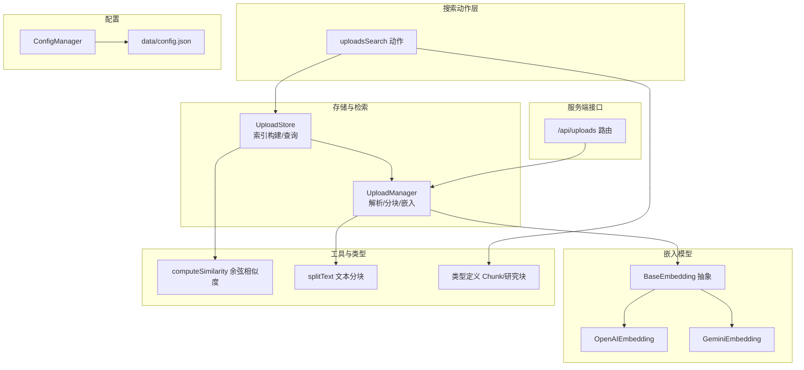
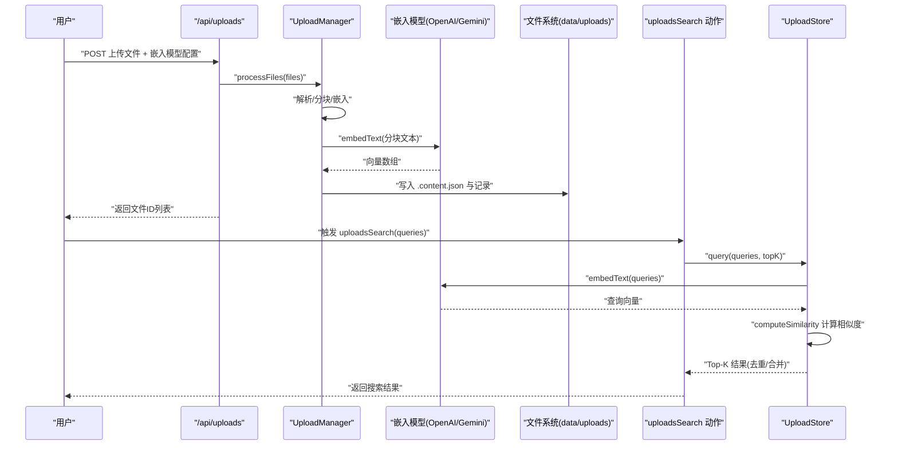
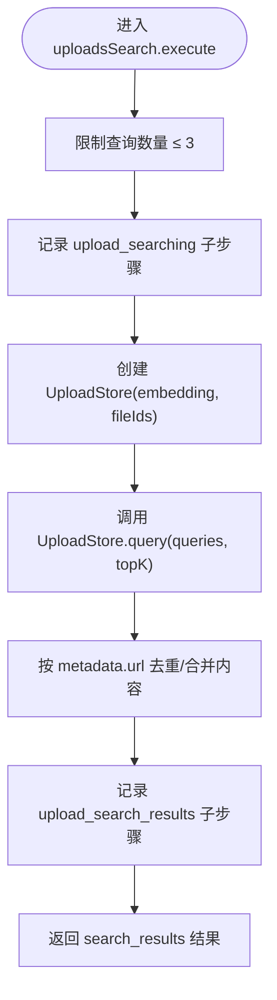
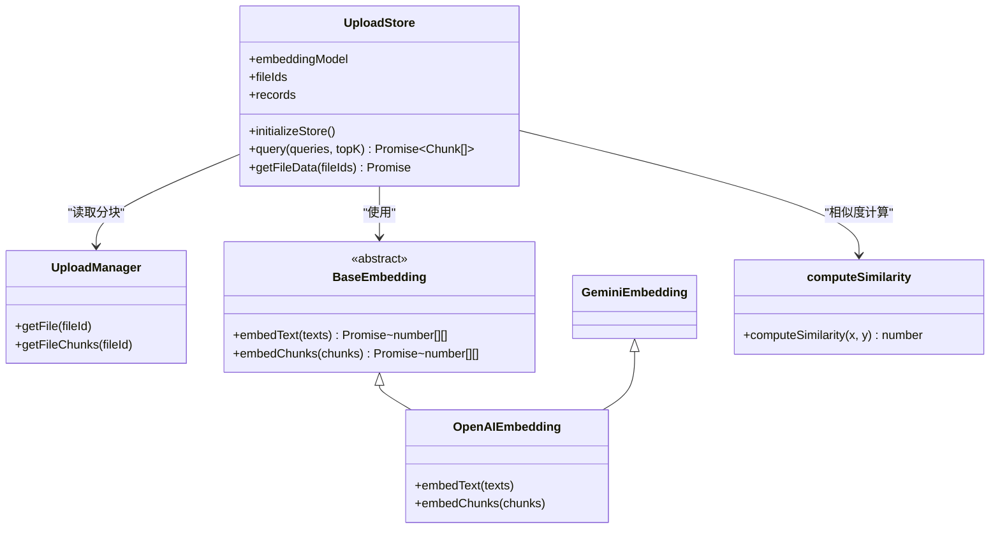
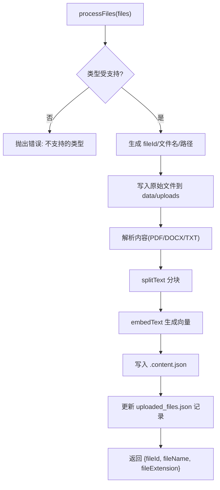
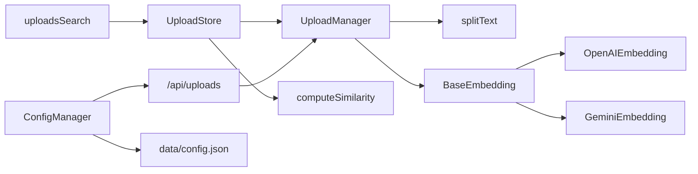

# 文件搜索动作

<cite>
**本文引用的文件**
- [src/lib/agents/search/researcher/actions/uploadsSearch.ts](file://src/lib/agents/search/researcher/actions/uploadsSearch.ts)
- [src/lib/uploads/store.ts](file://src/lib/uploads/store.ts)
- [src/lib/uploads/manager.ts](file://src/lib/uploads/manager.ts)
- [src/lib/utils/computeSimilarity.ts](file://src/lib/utils/computeSimilarity.ts)
- [src/lib/utils/splitText.ts](file://src/lib/utils/splitText.ts)
- [src/lib/models/base/embedding.ts](file://src/lib/models/base/embedding.ts)
- [src/lib/models/providers/openai/openaiEmbedding.ts](file://src/lib/models/providers/openai/openaiEmbedding.ts)
- [src/lib/models/providers/gemini/geminiEmbedding.ts](file://src/lib/models/providers/gemini/geminiEmbedding.ts)
- [src/lib/serverUtils.ts](file://src/lib/serverUtils.ts)
- [src/lib/types.ts](file://src/lib/types.ts)
- [src/app/api/uploads/route.ts](file://src/app/api/uploads/route.ts)
- [src/lib/config/index.ts](file://src/lib/config/index.ts)
- [src/lib/config/types.ts](file://src/lib/config/types.ts)
- [data/config.json](file://data/config.json)
</cite>

## 目录
1. [简介](#简介)
2. [项目结构](#项目结构)
3. [核心组件](#核心组件)
4. [架构总览](#架构总览)
5. [详细组件分析](#详细组件分析)
6. [依赖关系分析](#依赖关系分析)
7. [性能考量](#性能考量)
8. [故障排查指南](#故障排查指南)
9. [结论](#结论)
10. [附录](#附录)

## 简介
本文件围绕“文件搜索动作”展开，重点阐述 uploadsSearch 动作的实现原理与使用方式，覆盖以下方面：
- 已上传文件的索引管理与向量嵌入生成
- 相似度匹配算法与查询机制
- 文件上传后处理流程：文件解析、内容提取、分块与向量化存储
- 查询执行：自然语言查询转为向量、相似度计算与结果排序
- 性能优化策略：批量处理、内存管理与并发控制
- 支持的文件格式、大小限制与处理时间约束
- 配置项与最佳实践

## 项目结构
与“文件搜索动作”直接相关的模块分布如下：
- 搜索动作入口：agents 层的 uploadsSearch 动作
- 存储与检索：UploadStore（构建索引、相似度匹配）
- 文件处理：UploadManager（解析、分块、嵌入、持久化）
- 嵌入模型抽象与实现：BaseEmbedding 及 OpenAI/Gemini 实现
- 工具函数：computeSimilarity（余弦相似度）、splitText（文本分块）
- 服务端接口：/api/uploads（接收文件并调用 UploadManager）
- 类型定义：Chunk、研究块子步骤等
- 配置系统：ConfigManager 与 data/config.json

图表来源
- [src/lib/agents/search/researcher/actions/uploadsSearch.ts](file://src/lib/agents/search/researcher/actions/uploadsSearch.ts#L1-L103)
- [src/lib/uploads/store.ts](file://src/lib/uploads/store.ts#L1-L122)
- [src/lib/uploads/manager.ts](file://src/lib/uploads/manager.ts#L1-L218)
- [src/lib/utils/computeSimilarity.ts](file://src/lib/utils/computeSimilarity.ts#L1-L23)
- [src/lib/utils/splitText.ts](file://src/lib/utils/splitText.ts#L1-L75)
- [src/lib/models/base/embedding.ts](file://src/lib/models/base/embedding.ts#L1-L10)
- [src/lib/models/providers/openai/openaiEmbedding.ts](file://src/lib/models/providers/openai/openaiEmbedding.ts#L1-L43)
- [src/lib/models/providers/gemini/geminiEmbedding.ts](file://src/lib/models/providers/gemini/geminiEmbedding.ts#L1-L6)
- [src/app/api/uploads/route.ts](file://src/app/api/uploads/route.ts#L1-L41)
- [src/lib/config/index.ts](file://src/lib/config/index.ts#L1-L391)
- [data/config.json](file://data/config.json#L1-L41)

章节来源
- [src/lib/agents/search/researcher/actions/uploadsSearch.ts](file://src/lib/agents/search/researcher/actions/uploadsSearch.ts#L1-L103)
- [src/lib/uploads/store.ts](file://src/lib/uploads/store.ts#L1-L122)
- [src/lib/uploads/manager.ts](file://src/lib/uploads/manager.ts#L1-L218)
- [src/app/api/uploads/route.ts](file://src/app/api/uploads/route.ts#L1-L41)

## 核心组件
- uploadsSearch 动作：负责接收用户查询、记录研究步骤、调用 UploadStore 执行查询，并对结果进行去重合并。
- UploadStore：加载指定文件的向量分片，将查询语句向量化，计算相似度，聚合多查询得分并返回 Top-K 结果。
- UploadManager：接收上传文件，按支持的 MIME 类型解析内容，使用分块策略切分为文本片段，调用嵌入模型生成向量，写入 .content.json 并维护记录。
- 嵌入模型：BaseEmbedding 抽象定义 embedText/embedChunks；OpenAIEmbedding 通过 OpenAI API 生成向量；GeminiEmbedding 继承自 OpenAIEmbedding。
- computeSimilarity：计算两个向量的余弦相似度。
- splitText：基于分词器与正则分割，按最大 token 数与重叠策略切分文本。
- /api/uploads：服务端路由，接收文件与嵌入模型配置，实例化 UploadManager 并处理文件。
- 类型定义：Chunk、研究块子步骤（含 upload_searching/upload_search_results）等。

章节来源
- [src/lib/agents/search/researcher/actions/uploadsSearch.ts](file://src/lib/agents/search/researcher/actions/uploadsSearch.ts#L1-L103)
- [src/lib/uploads/store.ts](file://src/lib/uploads/store.ts#L1-L122)
- [src/lib/uploads/manager.ts](file://src/lib/uploads/manager.ts#L1-L218)
- [src/lib/utils/computeSimilarity.ts](file://src/lib/utils/computeSimilarity.ts#L1-L23)
- [src/lib/utils/splitText.ts](file://src/lib/utils/splitText.ts#L1-L75)
- [src/lib/models/base/embedding.ts](file://src/lib/models/base/embedding.ts#L1-L10)
- [src/lib/models/providers/openai/openaiEmbedding.ts](file://src/lib/models/providers/openai/openaiEmbedding.ts#L1-L43)
- [src/lib/models/providers/gemini/geminiEmbedding.ts](file://src/lib/models/providers/gemini/geminiEmbedding.ts#L1-L6)
- [src/app/api/uploads/route.ts](file://src/app/api/uploads/route.ts#L1-L41)
- [src/lib/types.ts](file://src/lib/types.ts#L1-L124)

## 架构总览
下图展示从“用户上传文件”到“执行文件搜索查询”的整体流程与组件交互。

图表来源
- [src/app/api/uploads/route.ts](file://src/app/api/uploads/route.ts#L1-L41)
- [src/lib/uploads/manager.ts](file://src/lib/uploads/manager.ts#L1-L218)
- [src/lib/models/providers/openai/openaiEmbedding.ts](file://src/lib/models/providers/openai/openaiEmbedding.ts#L1-L43)
- [src/lib/models/providers/gemini/geminiEmbedding.ts](file://src/lib/models/providers/gemini/geminiEmbedding.ts#L1-L6)
- [src/lib/agents/search/researcher/actions/uploadsSearch.ts](file://src/lib/agents/search/researcher/actions/uploadsSearch.ts#L1-L103)
- [src/lib/uploads/store.ts](file://src/lib/uploads/store.ts#L1-L122)
- [src/lib/utils/computeSimilarity.ts](file://src/lib/utils/computeSimilarity.ts#L1-L23)

## 详细组件分析

### uploadsSearch 动作
- 输入校验与限制：最多 3 个查询；记录“upload_searching”子步骤；执行查询后追加“upload_search_results”子步骤。
- 查询执行：构造 UploadStore，调用 query(queries, topK)，并对结果按来源 URL 合并与去重。
- 输出：返回 search_results 类型的结果集，便于后续对话或阅读块使用。

图表来源
- [src/lib/agents/search/researcher/actions/uploadsSearch.ts](file://src/lib/agents/search/researcher/actions/uploadsSearch.ts#L1-L103)
- [src/lib/types.ts](file://src/lib/types.ts#L90-L108)

章节来源
- [src/lib/agents/search/researcher/actions/uploadsSearch.ts](file://src/lib/agents/search/researcher/actions/uploadsSearch.ts#L1-L103)
- [src/lib/types.ts](file://src/lib/types.ts#L90-L108)

### UploadStore：索引构建与查询
- 初始化：遍历 fileIds，读取 UploadManager 的 .content.json 分块，构建内存索引，附加元数据（文件名、标题、url）。
- 查询：
  - 将查询语句向量化；
  - 对每个查询计算与所有记录的相似度，按分数降序；
  - 使用哈希去重，对相同 chunk 的多个查询得分进行加权聚合（位置倒数权重 + 固定常数），最终按聚合分排序取前 K。
- 返回：Top-K 的 Chunk 列表。

图表来源
- [src/lib/uploads/store.ts](file://src/lib/uploads/store.ts#L1-L122)
- [src/lib/uploads/manager.ts](file://src/lib/uploads/manager.ts#L1-L218)
- [src/lib/models/base/embedding.ts](file://src/lib/models/base/embedding.ts#L1-L10)
- [src/lib/models/providers/openai/openaiEmbedding.ts](file://src/lib/models/providers/openai/openaiEmbedding.ts#L1-L43)
- [src/lib/models/providers/gemini/geminiEmbedding.ts](file://src/lib/models/providers/gemini/geminiEmbedding.ts#L1-L6)
- [src/lib/utils/computeSimilarity.ts](file://src/lib/utils/computeSimilarity.ts#L1-L23)

章节来源
- [src/lib/uploads/store.ts](file://src/lib/uploads/store.ts#L1-L122)

### UploadManager：文件解析、分块与嵌入
- 支持的 MIME 类型：PDF、DOCX、TXT。
- 处理流程：
  - 写入原始文件至 data/uploads；
  - 解析内容：PDF 使用 pdf-parse，DOCX 使用 officeparser，TXT 直接读取；
  - 使用 splitText 进行分块（默认最大 512 tokens，重叠 64 tokens）；
  - 调用嵌入模型生成向量，写入 .content.json（chunks: [{content, embedding}]）；
  - 更新 uploaded_files.json 记录（id、name、filePath、contentPath、uploadedAt）。
- 错误处理：类型不支持、长度不一致、文件未找到等抛出错误。

图表来源
- [src/lib/uploads/manager.ts](file://src/lib/uploads/manager.ts#L1-L218)
- [src/lib/utils/splitText.ts](file://src/lib/utils/splitText.ts#L1-L75)

章节来源
- [src/lib/uploads/manager.ts](file://src/lib/uploads/manager.ts#L1-L218)
- [src/lib/utils/splitText.ts](file://src/lib/utils/splitText.ts#L1-L75)

### 嵌入模型与相似度计算
- BaseEmbedding：定义 embedText 与 embedChunks 接口。
- OpenAIEmbedding：通过 OpenAI SDK 调用 embeddings 接口，返回向量数组。
- GeminiEmbedding：继承 OpenAIEmbedding，复用同一接口。
- computeSimilarity：计算余弦相似度，要求向量维度一致，零向量返回 0。

章节来源
- [src/lib/models/base/embedding.ts](file://src/lib/models/base/embedding.ts#L1-L10)
- [src/lib/models/providers/openai/openaiEmbedding.ts](file://src/lib/models/providers/openai/openaiEmbedding.ts#L1-L43)
- [src/lib/models/providers/gemini/geminiEmbedding.ts](file://src/lib/models/providers/gemini/geminiEmbedding.ts#L1-L6)
- [src/lib/utils/computeSimilarity.ts](file://src/lib/utils/computeSimilarity.ts#L1-L23)

### 查询机制与结果排序
- 查询向量化：对每个查询调用嵌入模型生成向量。
- 相似度计算：对每个查询与全部记录计算余弦相似度并排序。
- 多查询融合：使用 hashObj 对每个 (chunk, query) 组合进行稳定哈希，去重后对同一 chunk 的多个查询得分做加权聚合（位置倒数 + 固定常数），最终按聚合分排序取前 K。
- 去重合并：按 metadata.url 合并来自同一文件的多个片段，拼接内容。

章节来源
- [src/lib/uploads/store.ts](file://src/lib/uploads/store.ts#L54-L98)
- [src/lib/serverUtils.ts](file://src/lib/serverUtils.ts#L1-L8)
- [src/lib/agents/search/researcher/actions/uploadsSearch.ts](file://src/lib/agents/search/researcher/actions/uploadsSearch.ts#L59-L77)

## 依赖关系分析
- 组件耦合：
  - uploadsSearch 依赖 UploadStore 与嵌入模型；
  - UploadStore 依赖 UploadManager 与 computeSimilarity；
  - UploadManager 依赖嵌入模型与 splitText；
  - 嵌入模型实现依赖具体提供商 SDK。
- 外部依赖：
  - OpenAI SDK（OpenAIEmbedding）；
  - pdf-parse（PDF 解析）；
  - officeparser（DOCX 解析）；
  - js-tiktoken（分词器，用于估算 token 数）。
- 配置依赖：
  - ConfigManager 与 data/config.json 提供模型提供商与搜索相关配置。

图表来源
- [src/lib/agents/search/researcher/actions/uploadsSearch.ts](file://src/lib/agents/search/researcher/actions/uploadsSearch.ts#L1-L103)
- [src/lib/uploads/store.ts](file://src/lib/uploads/store.ts#L1-L122)
- [src/lib/uploads/manager.ts](file://src/lib/uploads/manager.ts#L1-L218)
- [src/lib/utils/splitText.ts](file://src/lib/utils/splitText.ts#L1-L75)
- [src/lib/models/base/embedding.ts](file://src/lib/models/base/embedding.ts#L1-L10)
- [src/lib/models/providers/openai/openaiEmbedding.ts](file://src/lib/models/providers/openai/openaiEmbedding.ts#L1-L43)
- [src/lib/models/providers/gemini/geminiEmbedding.ts](file://src/lib/models/providers/gemini/geminiEmbedding.ts#L1-L6)
- [src/lib/utils/computeSimilarity.ts](file://src/lib/utils/computeSimilarity.ts#L1-L23)
- [src/app/api/uploads/route.ts](file://src/app/api/uploads/route.ts#L1-L41)
- [src/lib/config/index.ts](file://src/lib/config/index.ts#L1-L391)
- [data/config.json](file://data/config.json#L1-L41)

章节来源
- [src/lib/config/index.ts](file://src/lib/config/index.ts#L1-L391)
- [data/config.json](file://data/config.json#L1-L41)

## 性能考量
- 批量处理
  - UploadManager 在 processFiles 中对多个文件使用 Promise.all 并发处理，提升吞吐。
  - UploadStore.query 对多个查询使用 Promise.all 并发计算相似度，随后统一排序与聚合。
- 内存管理
  - 索引以内存结构 records 存储，适合中等规模文件集合；大规模场景建议分页或外部向量库。
  - 分块大小与重叠参数影响内存占用与召回质量，需根据硬件与需求调整。
- 并发控制
  - 嵌入模型调用（OpenAI/Gemini）为外部 API，建议在调用侧增加限流与重试策略，避免超时与配额限制。
- 相似度计算复杂度
  - 单查询对 N 条记录的相似度计算为 O(N*d)，其中 d 为向量维度；多查询为 O(Q*N*d)。
  - 采用哈希去重与位置倒数权重聚合可降低重复计算与冗余输出。

章节来源
- [src/lib/uploads/manager.ts](file://src/lib/uploads/manager.ts#L180-L212)
- [src/lib/uploads/store.ts](file://src/lib/uploads/store.ts#L54-L98)

## 故障排查指南
- 常见错误与定位
  - “不支持的文件类型”：检查 MIME 类型是否在支持列表内。
  - “嵌入向量与文本块长度不一致”：确认分块与嵌入调用一一对应。
  - “文件未找到”：确认 uploaded_files.json 中是否存在该 fileId 或 .content.json 是否存在。
  - “缺失嵌入模型或提供商”：/api/uploads 路由要求提供 embedding_model_key 与 embedding_model_provider_id。
- 日志与调试
  - UploadManager 在读取 .content.json 或文件不存在时会打印错误日志，便于定位问题。
  - uploadsSearch 动作在查询前后记录研究步骤，可在 UI 或日志中查看中间状态。

章节来源
- [src/lib/uploads/manager.ts](file://src/lib/uploads/manager.ts#L89-L175)
- [src/lib/uploads/manager.ts](file://src/lib/uploads/manager.ts#L72-L87)
- [src/app/api/uploads/route.ts](file://src/app/api/uploads/route.ts#L13-L18)
- [src/lib/agents/search/researcher/actions/uploadsSearch.ts](file://src/lib/agents/search/researcher/actions/uploadsSearch.ts#L36-L50)

## 结论
uploadsSearch 动作通过“上传即索引”的方式，将用户文档转化为可检索的向量索引，并以多查询融合与相似度聚合实现高质量检索。其设计强调：
- 易扩展：新增文件类型只需在 UploadManager 中扩展解析逻辑；
- 可移植：嵌入模型抽象允许替换不同提供商；
- 可观测：研究块记录使查询过程透明可追踪。

## 附录

### 文件格式支持与处理限制
- 支持的文件类型
  - PDF：使用 pdf-parse 解析文本；
  - DOCX：使用 officeparser 解析文本；
  - TXT：直接读取文本。
- 处理限制
  - 单次查询最多 3 个；
  - 默认分块大小为 512 tokens，重叠 64 tokens；
  - 上传接口未显式设置文件大小上限，实际受限于运行环境与嵌入模型输入长度限制。

章节来源
- [src/lib/uploads/manager.ts](file://src/lib/uploads/manager.ts#L10-L12)
- [src/lib/utils/splitText.ts](file://src/lib/utils/splitText.ts#L15-L19)
- [src/lib/agents/search/researcher/actions/uploadsSearch.ts](file://src/lib/agents/search/researcher/actions/uploadsSearch.ts#L5-L11)

### 配置选项与最佳实践
- 配置项
  - 模型提供商：ConfigManager 自动从环境变量加载并维护提供商配置；
  - 搜索相关：data/config.json 中包含 search.searxngURL 等字段。
- 最佳实践
  - 选择合适的嵌入模型：根据准确性和成本平衡；
  - 控制分块大小：在召回与性能间折中；
  - 并发与限流：对外部嵌入 API 做限流与重试；
  - 定期清理：删除不再使用的文件与 .content.json，释放磁盘空间。

章节来源
- [src/lib/config/index.ts](file://src/lib/config/index.ts#L175-L238)
- [data/config.json](file://data/config.json#L38-L40)