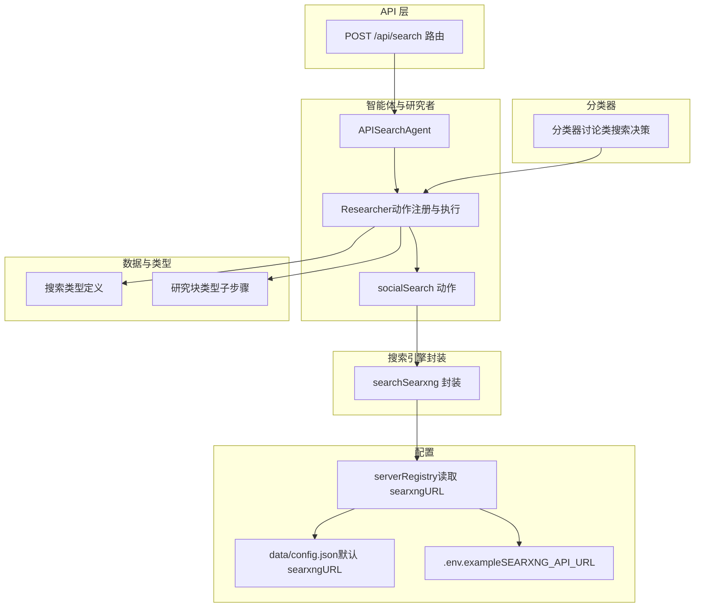
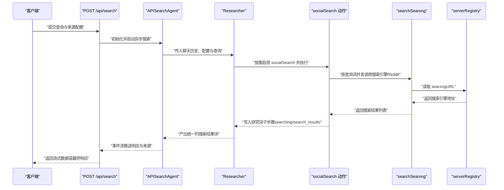
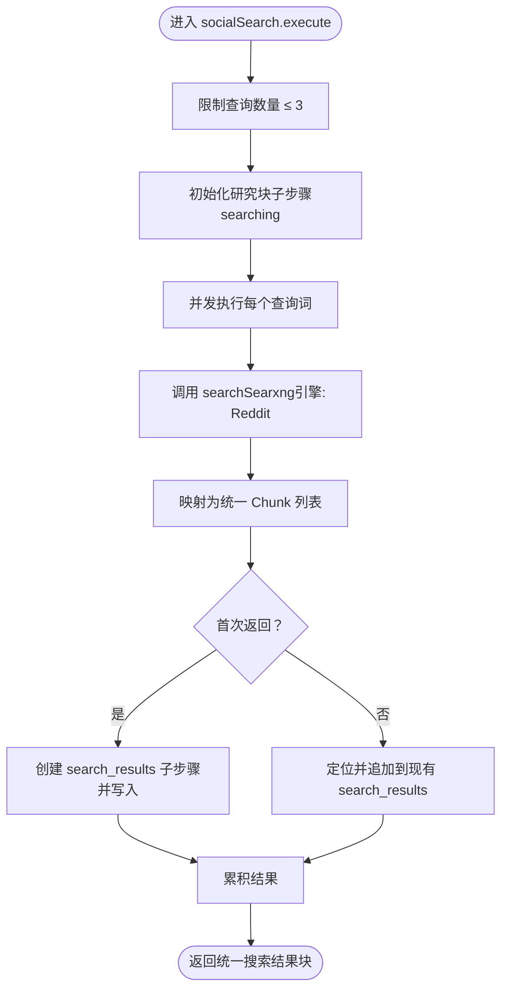
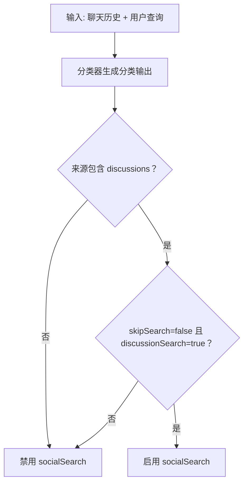
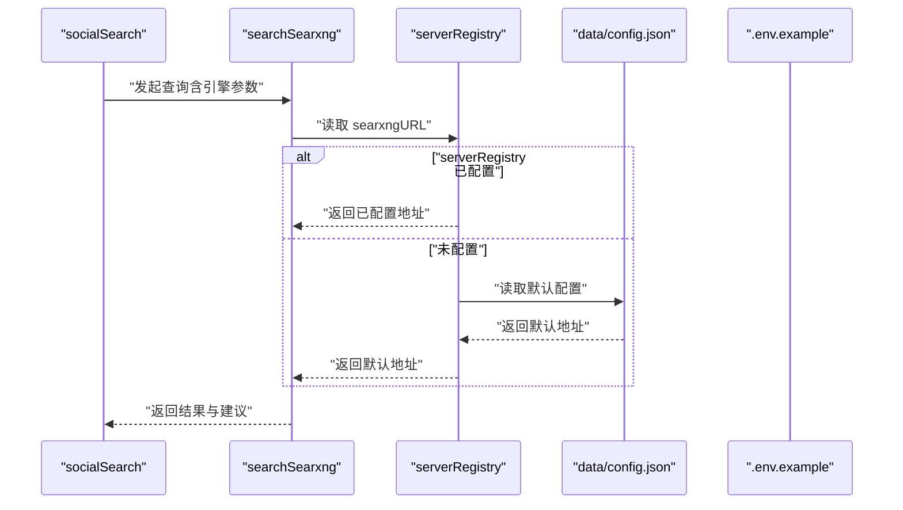
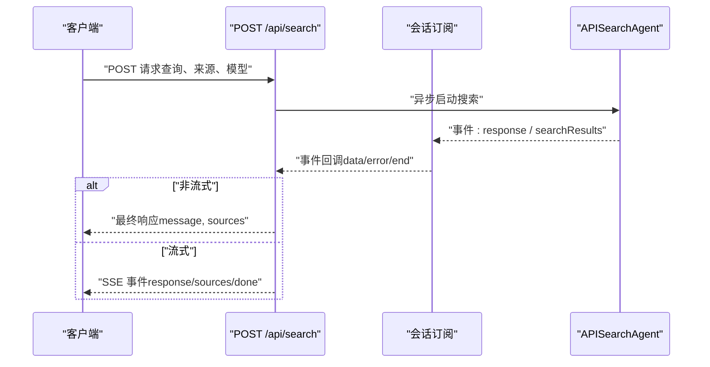
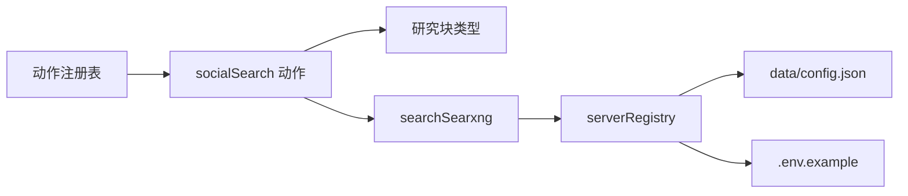

# 社交媒体搜索动作

<cite>
**本文引用的文件**
- [src/lib/agents/search/researcher/actions/socialSearch.ts](file://src/lib/agents/search/researcher/actions/socialSearch.ts)
- [src/lib/agents/search/types.ts](file://src/lib/agents/search/types.ts)
- [src/lib/agents/search/classifier.ts](file://src/lib/agents/search/classifier.ts)
- [src/lib/agents/search/researcher/actions/index.ts](file://src/lib/agents/search/researcher/actions/index.ts)
- [src/lib/types.ts](file://src/lib/types.ts)
- [src/lib/searxng.ts](file://src/lib/searxng.ts)
- [src/app/api/search/route.ts](file://src/app/api/search/route.ts)
- [src/lib/config/serverRegistry.ts](file://src/lib/config/serverRegistry.ts)
- [data/config.json](file://data/config.json)
- [.env.example](file://.env.example)
- [src/lib/agents/media/image.ts](file://src/lib/agents/media/image.ts)
- [src/lib/agents/media/video.ts](file://src/lib/agents/media/video.ts)
- [src/app/api/discover/route.ts](file://src/app/api/discover/route.ts)
- [src/components/Settings/Sections/Search.tsx](file://src/components/Settings/Sections/Search.tsx)
</cite>

## 目录
1. [简介](#简介)
2. [项目结构](#项目结构)
3. [核心组件](#核心组件)
4. [架构总览](#架构总览)
5. [详细组件分析](#详细组件分析)
6. [依赖关系分析](#依赖关系分析)
7. [性能考量](#性能考量)
8. [故障排查指南](#故障排查指南)
9. [结论](#结论)
10. [附录](#附录)

## 简介
本文件系统化梳理“社交媒体搜索动作”（socialSearch）的设计理念与实现方式，重点覆盖以下方面：
- 社交媒体平台的API集成与数据获取机制：通过统一的搜索引擎接口封装，聚合社交内容。
- 查询策略：话题标签、用户提及、实时内容抓取等能力的组合使用。
- 内容处理与分析：基于检索结果进行后续分析（如情感分析、主题提取、传播趋势分析）的扩展路径。
- 合规性与隐私保护：在数据采集、存储与展示层面的注意事项与建议。
- 应用场景：舆情监控、市场调研、品牌分析等。
- 配置指南与最佳实践：如何正确配置搜索引擎地址、模型提供商与前端开关。

## 项目结构
围绕社交媒体搜索动作的关键模块如下图所示：

图表来源
- [src/app/api/search/route.ts](file://src/app/api/search/route.ts#L1-L209)
- [src/lib/agents/search/researcher/actions/socialSearch.ts](file://src/lib/agents/search/researcher/actions/socialSearch.ts#L1-L130)
- [src/lib/agents/search/researcher/actions/index.ts](file://src/lib/agents/search/researcher/actions/index.ts#L1-L19)
- [src/lib/agents/search/classifier.ts](file://src/lib/agents/search/classifier.ts#L1-L54)
- [src/lib/agents/search/types.ts](file://src/lib/agents/search/types.ts#L1-L123)
- [src/lib/types.ts](file://src/lib/types.ts#L1-L124)
- [src/lib/searxng.ts](file://src/lib/searxng.ts#L1-L54)
- [src/lib/config/serverRegistry.ts](file://src/lib/config/serverRegistry.ts#L1-L16)
- [data/config.json](file://data/config.json#L1-L41)
- [.env.example](file://.env.example#L1-L59)

章节来源
- [src/app/api/search/route.ts](file://src/app/api/search/route.ts#L1-L209)
- [src/lib/agents/search/researcher/actions/socialSearch.ts](file://src/lib/agents/search/researcher/actions/socialSearch.ts#L1-L130)
- [src/lib/agents/search/researcher/actions/index.ts](file://src/lib/agents/search/researcher/actions/index.ts#L1-L19)
- [src/lib/agents/search/classifier.ts](file://src/lib/agents/search/classifier.ts#L1-L54)
- [src/lib/agents/search/types.ts](file://src/lib/agents/search/types.ts#L1-L123)
- [src/lib/types.ts](file://src/lib/types.ts#L1-L124)
- [src/lib/searxng.ts](file://src/lib/searxng.ts#L1-L54)
- [src/lib/config/serverRegistry.ts](file://src/lib/config/serverRegistry.ts#L1-L16)
- [data/config.json](file://data/config.json#L1-L41)
- [.env.example](file://.env.example#L1-L59)

## 核心组件
- socialSearch 动作：负责根据用户查询生成一组社交搜索查询词，调用搜索引擎接口获取结果，并将结果以统一的数据块形式写入会话状态，供后续阅读与总结使用。
- 分类器：判断是否需要进行讨论类搜索（即社交媒体搜索），并输出独立的问题重述，指导后续动作链。
- 搜索引擎封装：searchSearxng 提供统一的查询入口，支持指定引擎（如 Reddit）、语言、分页等参数。
- 类型系统：定义了研究块的子步骤类型（如 searching、search_results、reading 等），保证会话状态的一致性与可观测性。
- API 路由：接收前端请求，加载模型与嵌入，初始化会话，启动搜索代理，并支持流式返回。

章节来源
- [src/lib/agents/search/researcher/actions/socialSearch.ts](file://src/lib/agents/search/researcher/actions/socialSearch.ts#L1-L130)
- [src/lib/agents/search/classifier.ts](file://src/lib/agents/search/classifier.ts#L1-L54)
- [src/lib/searxng.ts](file://src/lib/searxng.ts#L1-L54)
- [src/lib/agents/search/types.ts](file://src/lib/agents/search/types.ts#L1-L123)
- [src/lib/types.ts](file://src/lib/types.ts#L1-L124)
- [src/app/api/search/route.ts](file://src/app/api/search/route.ts#L1-L209)

## 架构总览
下图展示了从 API 请求到社交媒体搜索动作执行的端到端流程：

图表来源
- [src/app/api/search/route.ts](file://src/app/api/search/route.ts#L1-L209)
- [src/lib/agents/search/researcher/actions/socialSearch.ts](file://src/lib/agents/search/researcher/actions/socialSearch.ts#L1-L130)
- [src/lib/searxng.ts](file://src/lib/searxng.ts#L1-L54)
- [src/lib/config/serverRegistry.ts](file://src/lib/config/serverRegistry.ts#L1-L16)

## 详细组件分析

### socialSearch 动作设计与实现
- 输入与约束
  - 输入为查询词数组，最多三条，确保聚焦与高效。
  - 动作启用条件：来源包含“discussions”，且分类器判定允许讨论类搜索且不跳过搜索。
- 执行流程
  - 记录“正在搜索”的子步骤，便于前端可视化。
  - 并发执行每个查询词，调用搜索引擎接口，将结果映射为统一的块数据结构。
  - 首次返回时创建“搜索结果”子步骤；后续追加时更新该子步骤，避免重复创建。
  - 返回统一的搜索结果块，供后续阅读与总结阶段使用。
- 关键点
  - 并发搜索提升吞吐，但需注意搜索引擎限流与稳定性。
  - 结果块包含标题与链接元数据，便于溯源与二次处理。

图表来源
- [src/lib/agents/search/researcher/actions/socialSearch.ts](file://src/lib/agents/search/researcher/actions/socialSearch.ts#L1-L130)
- [src/lib/searxng.ts](file://src/lib/searxng.ts#L1-L54)
- [src/lib/types.ts](file://src/lib/types.ts#L1-L124)

章节来源
- [src/lib/agents/search/researcher/actions/socialSearch.ts](file://src/lib/agents/search/researcher/actions/socialSearch.ts#L1-L130)
- [src/lib/agents/search/types.ts](file://src/lib/agents/search/types.ts#L1-L123)
- [src/lib/types.ts](file://src/lib/types.ts#L1-L124)

### 分类器与动作启用逻辑
- 分类器根据聊天历史与用户查询，输出是否进行讨论类搜索、是否跳过搜索以及问题的独立重述。
- socialSearch 的启用依赖于分类器输出与来源配置，确保仅在合适场景触发。

图表来源
- [src/lib/agents/search/classifier.ts](file://src/lib/agents/search/classifier.ts#L1-L54)
- [src/lib/agents/search/researcher/actions/socialSearch.ts](file://src/lib/agents/search/researcher/actions/socialSearch.ts#L1-L130)

章节来源
- [src/lib/agents/search/classifier.ts](file://src/lib/agents/search/classifier.ts#L1-L54)
- [src/lib/agents/search/researcher/actions/socialSearch.ts](file://src/lib/agents/search/researcher/actions/socialSearch.ts#L1-L130)

### 搜索引擎封装与配置
- searchSearxng 统一封装了查询参数（查询词、引擎、语言、分页号等），并返回结果与建议列表。
- searxngURL 来源优先级：
  - 运行时通过 serverRegistry 读取配置。
  - 若未配置，则回退至 data/config.json 中的默认值。
  - 开发/部署可通过 .env.example 中的 SEARXNG_API_URL 设置。

图表来源
- [src/lib/searxng.ts](file://src/lib/searxng.ts#L1-L54)
- [src/lib/config/serverRegistry.ts](file://src/lib/config/serverRegistry.ts#L1-L16)
- [data/config.json](file://data/config.json#L1-L41)
- [.env.example](file://.env.example#L1-L59)

章节来源
- [src/lib/searxng.ts](file://src/lib/searxng.ts#L1-L54)
- [src/lib/config/serverRegistry.ts](file://src/lib/config/serverRegistry.ts#L1-L16)
- [data/config.json](file://data/config.json#L1-L41)
- [.env.example](file://.env.example#L1-L59)

### API 流程与事件流
- API 接收请求后，加载模型与嵌入，创建会话并启动搜索代理。
- 支持非流式与流式两种模式：
  - 非流式：等待完整结果后一次性返回。
  - 流式：事件流持续推送响应文本与搜索来源，便于前端即时展示。

图表来源
- [src/app/api/search/route.ts](file://src/app/api/search/route.ts#L1-L209)

章节来源
- [src/app/api/search/route.ts](file://src/app/api/search/route.ts#L1-L209)

### 与其他媒体搜索动作的关系
- 图像与视频搜索同样基于 searchSearxng，分别指定不同引擎（如 Bing Images、Google Images、YouTube）。
- 社交搜索动作专注于 Reddit 引擎，形成“多引擎、多模态”的统一检索体系。

章节来源
- [src/lib/agents/media/image.ts](file://src/lib/agents/media/image.ts#L1-L66)
- [src/lib/agents/media/video.ts](file://src/lib/agents/media/video.ts#L1-L66)
- [src/lib/agents/search/researcher/actions/socialSearch.ts](file://src/lib/agents/search/researcher/actions/socialSearch.ts#L1-L130)

## 依赖关系分析
- 动作注册：socialSearch 动作在注册表中被集中注册，确保研究者可按需启用。
- 类型耦合：研究块子步骤类型与动作输出类型保持一致，保证会话状态的可追踪性。
- 外部依赖：搜索引擎接口的可用性与稳定性直接影响动作性能；配置中心提供多层级回退策略。

图表来源
- [src/lib/agents/search/researcher/actions/index.ts](file://src/lib/agents/search/researcher/actions/index.ts#L1-L19)
- [src/lib/agents/search/researcher/actions/socialSearch.ts](file://src/lib/agents/search/researcher/actions/socialSearch.ts#L1-L130)
- [src/lib/agents/search/types.ts](file://src/lib/agents/search/types.ts#L1-L123)
- [src/lib/searxng.ts](file://src/lib/searxng.ts#L1-L54)
- [src/lib/config/serverRegistry.ts](file://src/lib/config/serverRegistry.ts#L1-L16)
- [data/config.json](file://data/config.json#L1-L41)
- [.env.example](file://.env.example#L1-L59)

章节来源
- [src/lib/agents/search/researcher/actions/index.ts](file://src/lib/agents/search/researcher/actions/index.ts#L1-L19)
- [src/lib/agents/search/researcher/actions/socialSearch.ts](file://src/lib/agents/search/researcher/actions/socialSearch.ts#L1-L130)
- [src/lib/agents/search/types.ts](file://src/lib/agents/search/types.ts#L1-L123)
- [src/lib/searxng.ts](file://src/lib/searxng.ts#L1-L54)
- [src/lib/config/serverRegistry.ts](file://src/lib/config/serverRegistry.ts#L1-L16)
- [data/config.json](file://data/config.json#L1-L41)
- [.env.example](file://.env.example#L1-L59)

## 性能考量
- 并发策略：socialSearch 对多个查询词采用并发执行，显著缩短整体等待时间，但需关注搜索引擎的速率限制与稳定性。
- 结果聚合：将不同查询的结果合并为统一块结构，便于后续统一处理与去重。
- 事件流优化：流式返回减少首屏延迟，适合长文本生成与逐步展示来源。
- 配置优先级：serverRegistry 的动态配置与 data/config.json 的默认值配合，降低部署复杂度。

## 故障排查指南
- 搜索引擎不可达
  - 现象：返回错误或超时。
  - 排查：确认 searxngURL 是否正确配置；检查网络连通性与服务状态。
  - 参考
    - [src/lib/config/serverRegistry.ts](file://src/lib/config/serverRegistry.ts#L1-L16)
    - [data/config.json](file://data/config.json#L1-L41)
    - [.env.example](file://.env.example#L1-L59)
- 查询结果为空
  - 现象：返回空结果或少量结果。
  - 排查：调整查询词、增加关键词或放宽时间范围；确认搜索引擎支持目标引擎。
  - 参考
    - [src/lib/agents/search/researcher/actions/socialSearch.ts](file://src/lib/agents/search/researcher/actions/socialSearch.ts#L1-L130)
    - [src/lib/searxng.ts](file://src/lib/searxng.ts#L1-L54)
- 事件流异常
  - 现象：客户端无法接收 SSE 事件或中途断开。
  - 排查：检查服务端事件推送逻辑与客户端连接状态；必要时启用非流式模式验证。
  - 参考
    - [src/app/api/search/route.ts](file://src/app/api/search/route.ts#L1-L209)

章节来源
- [src/lib/config/serverRegistry.ts](file://src/lib/config/serverRegistry.ts#L1-L16)
- [data/config.json](file://data/config.json#L1-L41)
- [.env.example](file://.env.example#L1-L59)
- [src/lib/agents/search/researcher/actions/socialSearch.ts](file://src/lib/agents/search/researcher/actions/socialSearch.ts#L1-L130)
- [src/lib/searxng.ts](file://src/lib/searxng.ts#L1-L54)
- [src/app/api/search/route.ts](file://src/app/api/search/route.ts#L1-L209)

## 结论
socialSearch 动作通过统一的搜索引擎封装与严格的启用条件，实现了面向社交媒体的高效检索。其并发查询与事件流机制提升了用户体验，而多层级配置保障了部署灵活性。未来可在现有基础上扩展内容分析能力（如情感、主题、传播趋势），并完善合规与隐私保护策略。

## 附录

### 查询策略与示例
- 基本原则
  - 查询词应具体、聚焦，避免过于宽泛导致噪声。
  - 控制查询数量（最多三条），确保结果质量与性能平衡。
- 示例思路
  - 公众意见：结合领域关键词与年份，如“电动汽车公众意见 2024”。
  - 社交讨论：强调“社交媒体讨论/趋势/采用率”等关键词。
- 引擎选择
  - 当前默认使用 Reddit 引擎，可按需扩展其他引擎（如 Twitter、Facebook 等，需满足合规要求）。

章节来源
- [src/lib/agents/search/researcher/actions/socialSearch.ts](file://src/lib/agents/search/researcher/actions/socialSearch.ts#L1-L130)

### 内容处理与分析扩展
- 情感分析：对检索到的文本进行情感打分，识别正面/负面/中性倾向。
- 主题提取：抽取高频主题词或短语，构建话题矩阵。
- 传播趋势：统计时间序列下的提及量、转发量与情绪分布，辅助趋势研判。
- 注意：上述分析为概念性扩展，需结合实际业务需求与数据合规要求实施。

### 合规性与隐私保护
- 数据最小化：仅采集必要的公开信息，避免过度收集个人数据。
- 明示与同意：在界面提示数据来源与用途，尊重用户知情权。
- 第三方接口合规：遵守搜索引擎与社交媒体平台的使用条款与数据保护政策。
- 存储与传输安全：对敏感配置与日志采取加密与访问控制，定期轮换密钥。

### 应用场景
- 舆情监控：跟踪热点事件的公众讨论与情绪变化。
- 市场调研：洞察消费者偏好与产品反馈。
- 品牌分析：监测品牌声誉与竞品动态。

### 配置指南与最佳实践
- 搜索引擎地址
  - 优先在运行时配置 serverRegistry；若未配置则回退 data/config.json 的默认值；开发/部署可通过 .env.example 的 SEARXNG_API_URL 设置。
- 模型与嵌入
  - 在 API 层加载 LLM 与嵌入模型，确保推理与向量化能力匹配。
- 前端开关
  - 可通过客户端配置项控制媒体自动搜索与系统指令等行为。
- 最佳实践
  - 为搜索引擎设置合理的超时与重试策略。
  - 对事件流进行断线重连与错误恢复处理。
  - 在 UI 中清晰展示来源与查询词，增强透明度。

章节来源
- [src/lib/config/serverRegistry.ts](file://src/lib/config/serverRegistry.ts#L1-L16)
- [data/config.json](file://data/config.json#L1-L41)
- [.env.example](file://.env.example#L1-L59)
- [src/app/api/search/route.ts](file://src/app/api/search/route.ts#L1-L209)
- [src/components/Settings/Sections/Search.tsx](file://src/components/Settings/Sections/Search.tsx#L1-L30)