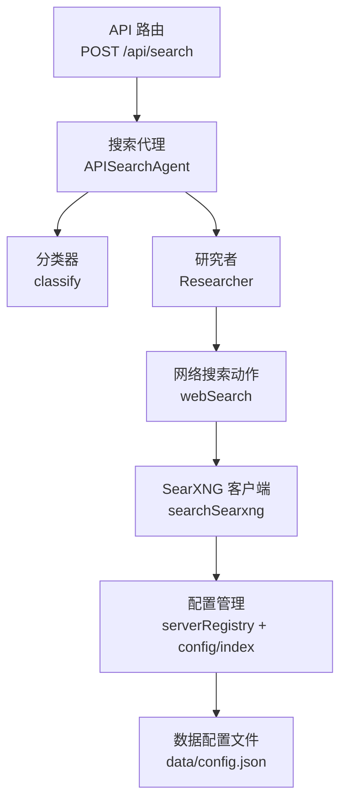
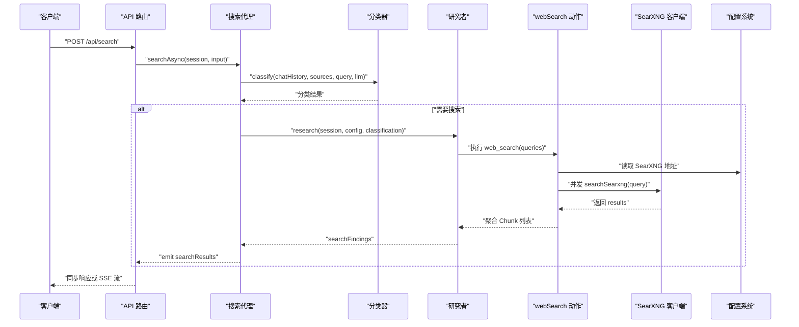
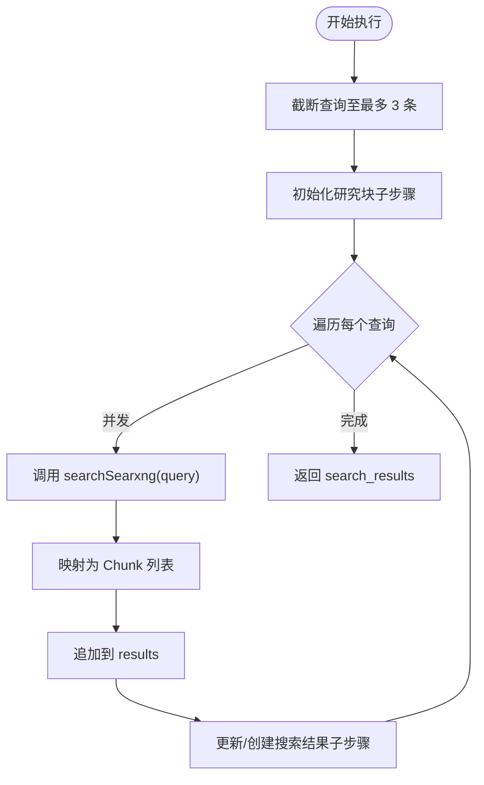
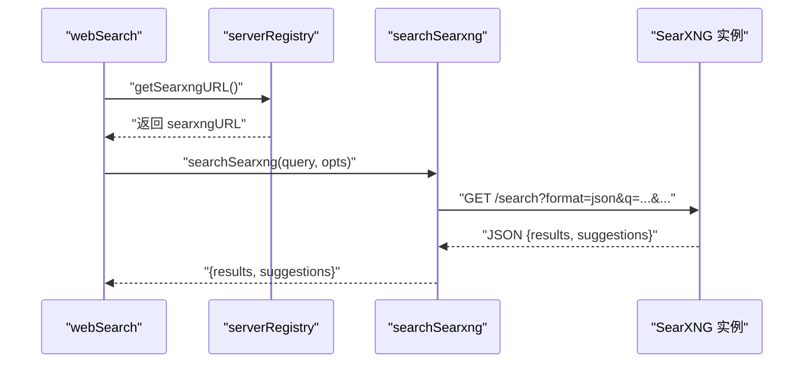
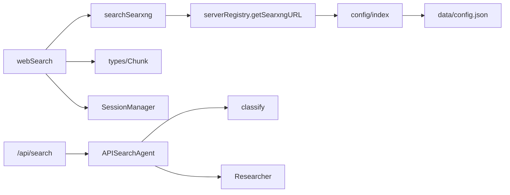

# 网络搜索动作

<cite>
**本文引用的文件**
- [src/lib/agents/search/researcher/actions/webSearch.ts](file://src/lib/agents/search/researcher/actions/webSearch.ts)
- [src/lib/searxng.ts](file://src/lib/searxng.ts)
- [src/app/api/search/route.ts](file://src/app/api/search/route.ts)
- [src/lib/agents/search/types.ts](file://src/lib/agents/search/types.ts)
- [src/lib/config/serverRegistry.ts](file://src/lib/config/serverRegistry.ts)
- [src/lib/config/index.ts](file://src/lib/config/index.ts)
- [src/lib/types.ts](file://src/lib/types.ts)
- [src/lib/agents/search/api.ts](file://src/lib/agents/search/api.ts)
- [src/lib/agents/search/classifier.ts](file://src/lib/agents/search/classifier.ts)
- [src/app/api/discover/route.ts](file://src/app/api/discover/route.ts)
- [data/config.json](file://data/config.json)
- [searxng-settings.yml](file://searxng-settings.yml)
</cite>

## 目录
1. [简介](#简介)
2. [项目结构](#项目结构)
3. [核心组件](#核心组件)
4. [架构总览](#架构总览)
5. [详细组件分析](#详细组件分析)
6. [依赖关系分析](#依赖关系分析)
7. [性能考虑](#性能考虑)
8. [故障排查指南](#故障排查指南)
9. [结论](#结论)
10. [附录](#附录)

## 简介
本文件聚焦于“网络搜索动作”（webSearch）的实现与使用，系统性阐述以下内容：
- SearXNG 搜索引擎的集成方式与查询构建逻辑
- 结果过滤与去重策略
- 参数配置（搜索源、结果数量、语言等）
- 性能优化（并发搜索、流式输出、超时与重试建议）
- 错误处理与重试机制
- 实际使用场景与扩展建议

## 项目结构
网络搜索动作位于研究者（Researcher）的动作集合中，通过统一的搜索代理（APISearchAgent）调度，并由 API 路由对外提供服务。配置项通过配置管理器集中管理，SearXNG 的访问地址来自服务器端配置。

图表来源
- [src/app/api/search/route.ts](file://src/app/api/search/route.ts#L19-L67)
- [src/lib/agents/search/api.ts](file://src/lib/agents/search/api.ts#L8-L96)
- [src/lib/agents/search/classifier.ts](file://src/lib/agents/search/classifier.ts#L37-L53)
- [src/lib/agents/search/researcher/actions/webSearch.ts](file://src/lib/agents/search/researcher/actions/webSearch.ts#L59-L180)
- [src/lib/searxng.ts](file://src/lib/searxng.ts#L21-L53)
- [src/lib/config/serverRegistry.ts](file://src/lib/config/serverRegistry.ts#L14-L15)
- [src/lib/config/index.ts](file://src/lib/config/index.ts#L19-L22)
- [data/config.json](file://data/config.json#L38-L40)

章节来源
- [src/app/api/search/route.ts](file://src/app/api/search/route.ts#L19-L67)
- [src/lib/agents/search/api.ts](file://src/lib/agents/search/api.ts#L8-L96)
- [src/lib/agents/search/classifier.ts](file://src/lib/agents/search/classifier.ts#L37-L53)
- [src/lib/agents/search/researcher/actions/webSearch.ts](file://src/lib/agents/search/researcher/actions/webSearch.ts#L59-L180)
- [src/lib/searxng.ts](file://src/lib/searxng.ts#L21-L53)
- [src/lib/config/serverRegistry.ts](file://src/lib/config/serverRegistry.ts#L14-L15)
- [src/lib/config/index.ts](file://src/lib/config/index.ts#L19-L22)
- [data/config.json](file://data/config.json#L38-L40)

## 核心组件
- 网络搜索动作（webSearch）：定义工具名称、输入模式、启用条件与执行流程；负责并发调用 SearXNG 并聚合结果。
- SearXNG 客户端（searchSearxng）：封装查询构建、参数拼接、响应解析与错误抛出。
- 搜索代理（APISearchAgent）：负责分类、并行执行小部件与研究者流程，并将搜索结果注入最终回答生成。
- API 路由（/api/search）：接收请求、加载模型、创建会话、启动搜索代理，并支持同步或流式返回。
- 配置系统：集中管理 SearXNG 地址等搜索相关配置。

章节来源
- [src/lib/agents/search/researcher/actions/webSearch.ts](file://src/lib/agents/search/researcher/actions/webSearch.ts#L59-L180)
- [src/lib/searxng.ts](file://src/lib/searxng.ts#L21-L53)
- [src/lib/agents/search/api.ts](file://src/lib/agents/search/api.ts#L8-L96)
- [src/app/api/search/route.ts](file://src/app/api/search/route.ts#L19-L67)
- [src/lib/config/serverRegistry.ts](file://src/lib/config/serverRegistry.ts#L14-L15)
- [src/lib/config/index.ts](file://src/lib/config/index.ts#L19-L22)

## 架构总览
下图展示了从 API 请求到搜索结果返回的关键交互序列，包括分类、并发搜索、结果聚合与流式输出。

图表来源
- [src/app/api/search/route.ts](file://src/app/api/search/route.ts#L19-L110)
- [src/lib/agents/search/api.ts](file://src/lib/agents/search/api.ts#L8-L96)
- [src/lib/agents/search/classifier.ts](file://src/lib/agents/search/classifier.ts#L37-L53)
- [src/lib/agents/search/researcher/actions/webSearch.ts](file://src/lib/agents/search/researcher/actions/webSearch.ts#L87-L179)
- [src/lib/searxng.ts](file://src/lib/searxng.ts#L21-L53)
- [src/lib/config/serverRegistry.ts](file://src/lib/config/serverRegistry.ts#L14-L15)

## 详细组件分析

### 网络搜索动作（webSearch）
- 工具定义与输入校验
  - 工具名：web_search
  - 输入模式：queries 数组，最多 3 个查询
  - 启用条件：sources 包含 web 且分类结果允许进行搜索
- 执行流程
  - 截断 queries 至 3 条
  - 记录“正在搜索”与“搜索结果”子步骤，用于可视化研究过程
  - 并发执行每个查询（Promise.all），将结果映射为 Chunk 并追加到 results
  - 返回类型为 search_results 的结果块
- 结果结构
  - 使用 Chunk 类型，包含 content 与 metadata（title、url）

图表来源
- [src/lib/agents/search/researcher/actions/webSearch.ts](file://src/lib/agents/search/researcher/actions/webSearch.ts#L87-L179)
- [src/lib/types.ts](file://src/lib/types.ts#L34-L82)

章节来源
- [src/lib/agents/search/researcher/actions/webSearch.ts](file://src/lib/agents/search/researcher/actions/webSearch.ts#L59-L180)
- [src/lib/types.ts](file://src/lib/types.ts#L34-L82)

### SearXNG 集成与查询构建
- 查询构建
  - 基础 URL：通过配置系统读取 search.searxngURL
  - 查询参数：q（必填）、categories、engines、language、pageno（可选）
  - 支持数组参数以逗号连接传入
- 响应解析
  - 成功状态码：返回 results 与 suggestions
  - 失败状态码：抛出错误
- 使用示例
  - 在发现路由中演示了 site: 限定、引擎选择、分页与语言设置

图表来源
- [src/lib/agents/search/researcher/actions/webSearch.ts](file://src/lib/agents/search/researcher/actions/webSearch.ts#L115-L126)
- [src/lib/searxng.ts](file://src/lib/searxng.ts#L21-L53)
- [src/lib/config/serverRegistry.ts](file://src/lib/config/serverRegistry.ts#L14-L15)

章节来源
- [src/lib/searxng.ts](file://src/lib/searxng.ts#L21-L53)
- [src/lib/config/serverRegistry.ts](file://src/lib/config/serverRegistry.ts#L14-L15)
- [src/app/api/discover/route.ts](file://src/app/api/discover/route.ts#L40-L77)

### 参数配置与环境变量
- 关键配置项
  - search.searxngURL：SearXNG 实例地址
- 配置来源
  - 数据文件：data/config.json
  - 环境变量：SEARXNG_API_URL（在初始化阶段从环境注入）
- UI 配置入口
  - 配置管理器提供 UI 字段定义，用于前端展示与编辑

章节来源
- [src/lib/config/index.ts](file://src/lib/config/index.ts#L19-L22)
- [src/lib/config/index.ts](file://src/lib/config/index.ts#L104-L116)
- [src/lib/config/index.ts](file://src/lib/config/index.ts#L229-L235)
- [data/config.json](file://data/config.json#L38-L40)

### 结果过滤与去重策略
- 发现路由中的去重示例
  - 使用 Set 维护已见 URL，过滤重复条目
  - 可结合业务需求扩展为基于标题或内容指纹的去重
- 建议
  - 对返回结果按 url 进行去重
  - 可增加时间范围、来源站点白名单等过滤规则

章节来源
- [src/app/api/discover/route.ts](file://src/app/api/discover/route.ts#L40-L65)

### 搜索源选择、结果数量与语言设置
- 搜索源选择
  - 通过 engines 参数指定引擎列表
- 结果数量
  - 通过 pageno 控制页码；具体每页数量取决于 SearXNG 配置
- 语言设置
  - 通过 language 参数指定语言
- 示例参考
  - 发现路由中固定使用引擎、分页与语言参数

章节来源
- [src/lib/searxng.ts](file://src/lib/searxng.ts#L3-L8)
- [src/app/api/discover/route.ts](file://src/app/api/discover/route.ts#L48-L76)

### 并发搜索控制
- webSearch 内部对每个查询使用 Promise.all 并发执行，提升吞吐
- 建议
  - 可引入信号量或队列限制最大并发数
  - 对外部 SearXNG 实例设置合理的限速与超时

章节来源
- [src/lib/agents/search/researcher/actions/webSearch.ts](file://src/lib/agents/search/researcher/actions/webSearch.ts#L173-L173)

### 流式输出与会话管理
- API 路由支持两种模式
  - 同步：等待完整结果后一次性返回
  - 流式：通过 SSE 分段推送 response 与 sources，最后发送 done
- 会话事件
  - 搜索代理在检索完成后 emit searchResults
  - API 路由订阅并转发给客户端

章节来源
- [src/app/api/search/route.ts](file://src/app/api/search/route.ts#L69-L110)
- [src/app/api/search/route.ts](file://src/app/api/search/route.ts#L118-L200)
- [src/lib/agents/search/api.ts](file://src/lib/agents/search/api.ts#L41-L50)

## 依赖关系分析
- webSearch 依赖
  - SearXNG 客户端：构建查询与解析响应
  - 配置系统：读取 SearXNG 地址
  - 会话管理：记录研究过程与结果
- API 路由依赖
  - 搜索代理：协调分类、研究者与小部件执行
  - 模型注册表：加载对话与嵌入模型
- 配置依赖
  - 配置管理器：持久化与环境变量注入
  - 数据文件：默认值与运行时值

图表来源
- [src/lib/agents/search/researcher/actions/webSearch.ts](file://src/lib/agents/search/researcher/actions/webSearch.ts#L3-L5)
- [src/lib/searxng.ts](file://src/lib/searxng.ts#L1-L1)
- [src/lib/config/serverRegistry.ts](file://src/lib/config/serverRegistry.ts#L14-L15)
- [src/lib/config/index.ts](file://src/lib/config/index.ts#L19-L22)
- [data/config.json](file://data/config.json#L38-L40)
- [src/app/api/search/route.ts](file://src/app/api/search/route.ts#L52-L67)
- [src/lib/agents/search/api.ts](file://src/lib/agents/search/api.ts#L8-L96)
- [src/lib/agents/search/classifier.ts](file://src/lib/agents/search/classifier.ts#L37-L53)

章节来源
- [src/lib/agents/search/researcher/actions/webSearch.ts](file://src/lib/agents/search/researcher/actions/webSearch.ts#L3-L5)
- [src/lib/searxng.ts](file://src/lib/searxng.ts#L1-L1)
- [src/lib/config/serverRegistry.ts](file://src/lib/config/serverRegistry.ts#L14-L15)
- [src/lib/config/index.ts](file://src/lib/config/index.ts#L19-L22)
- [data/config.json](file://data/config.json#L38-L40)
- [src/app/api/search/route.ts](file://src/app/api/search/route.ts#L52-L67)
- [src/lib/agents/search/api.ts](file://src/lib/agents/search/api.ts#L8-L96)
- [src/lib/agents/search/classifier.ts](file://src/lib/agents/search/classifier.ts#L37-L53)

## 性能考虑
- 并发搜索
  - 使用 Promise.all 并发调用多个查询，减少总延迟
  - 建议根据下游实例能力设置最大并发上限
- 流式输出
  - SSE 提升用户感知速度，尽早返回部分结果
- 缓存机制
  - 可在应用层对相同查询结果进行短期缓存（需注意时效性与一致性）
- 超时与重试
  - 当前未内置超时与重试；建议在 searchSearxng 或上游 fetch 层添加超时控制与指数退避重试
- 结果去重
  - 基于 URL 去重，避免重复内容影响后续处理

章节来源
- [src/lib/agents/search/researcher/actions/webSearch.ts](file://src/lib/agents/search/researcher/actions/webSearch.ts#L173-L173)
- [src/app/api/search/route.ts](file://src/app/api/search/route.ts#L118-L200)
- [src/app/api/discover/route.ts](file://src/app/api/discover/route.ts#L40-L65)

## 故障排查指南
- 常见问题
  - SearXNG 地址未配置或不可达：检查 search.searxngURL 是否正确
  - 查询失败：searchSearxng 在非 2xx 时抛错，需检查网络与认证
  - 流式中断：SSE 连接可能被中止，需检查客户端与网络状况
- 排查步骤
  - 确认 data/config.json 中 search.searxngURL 已设置
  - 在 API 路由中捕获并记录错误信息
  - 在发现路由中验证 searchSearxng 的基本调用是否成功
- 建议改进
  - 添加超时与重试策略
  - 增加日志与指标上报
  - 对不同错误类型进行分类处理与提示

章节来源
- [src/lib/config/index.ts](file://src/lib/config/index.ts#L19-L22)
- [src/lib/config/index.ts](file://src/lib/config/index.ts#L229-L235)
- [data/config.json](file://data/config.json#L38-L40)
- [src/lib/searxng.ts](file://src/lib/searxng.ts#L43-L45)
- [src/app/api/search/route.ts](file://src/app/api/search/route.ts#L201-L207)
- [src/app/api/discover/route.ts](file://src/app/api/discover/route.ts#L87-L97)

## 结论
webSearch 动作通过并发调用 SearXNG 实现高效网络搜索，并以 Chunk 形式聚合结果供后续处理。其配置简洁、扩展性强，适合在多源搜索与流式交互场景中使用。建议进一步完善超时与重试、缓存与去重策略，以提升稳定性与性能。

## 附录

### 使用场景与扩展建议
- 场景一：问答系统
  - 使用 APISearchAgent 与 webSearch 获取最新信息，再由 LLM 生成回答
- 场景二：内容发现
  - 在发现路由中使用 site: 限定与引擎筛选，结合去重策略输出高质量内容
- 扩展建议
  - 引入查询改写与多轮迭代策略
  - 增加结果评分与来源可信度评估
  - 支持自定义过滤器（时间、语言、来源）

章节来源
- [src/lib/agents/search/api.ts](file://src/lib/agents/search/api.ts#L8-L96)
- [src/app/api/discover/route.ts](file://src/app/api/discover/route.ts#L28-L77)