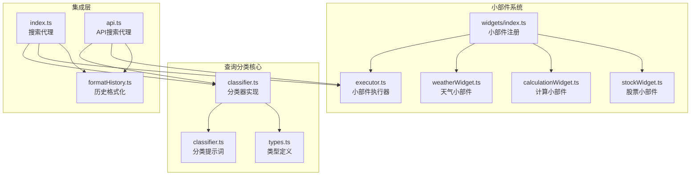
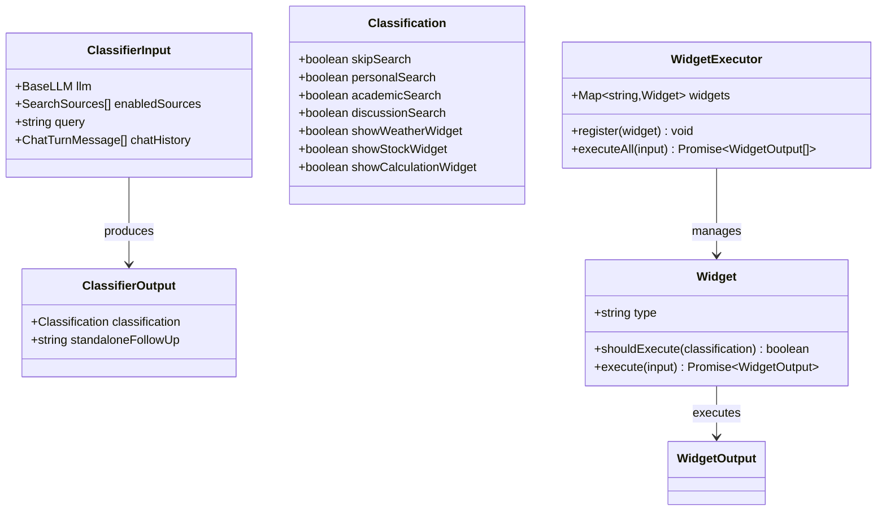
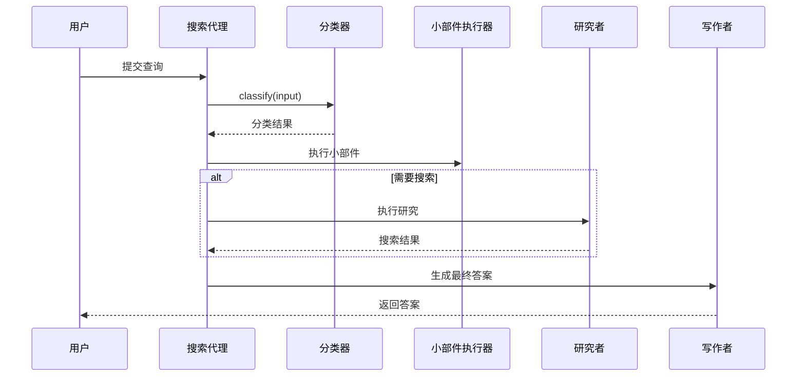
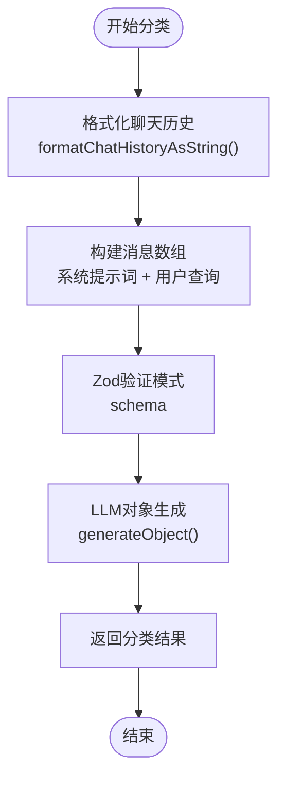
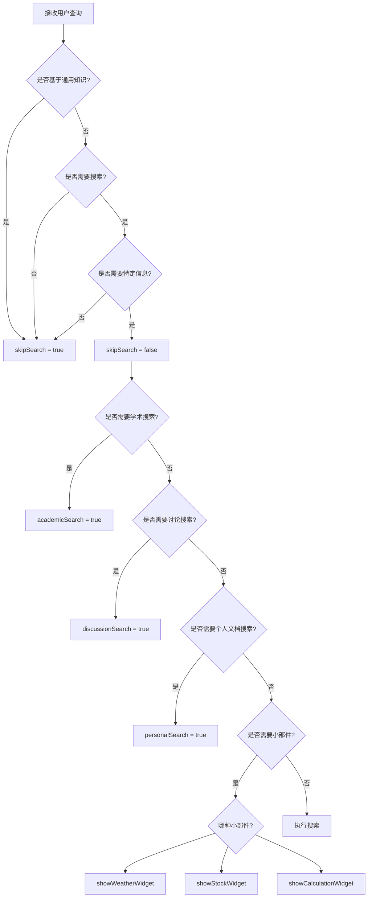
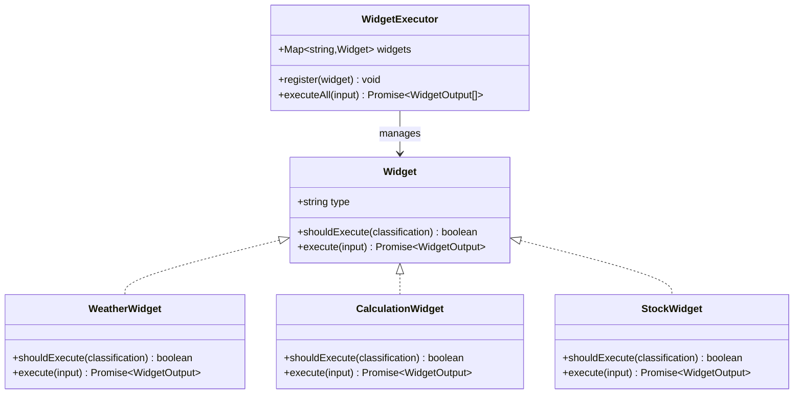
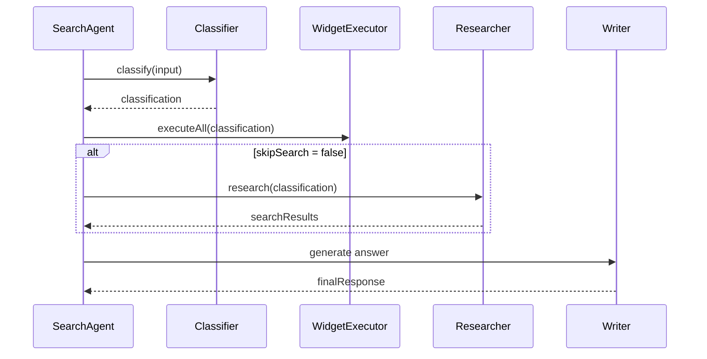
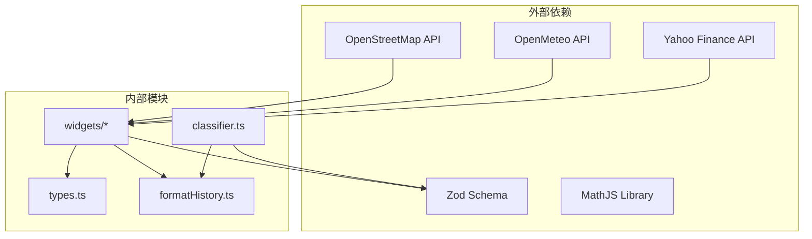

# 查询分类机制

<cite>
**本文档引用的文件**
- [classifier.ts](file://src/lib/agents/search/classifier.ts)
- [classifier.ts](file://src/lib/prompts/search/classifier.ts)
- [types.ts](file://src/lib/agents/search/types.ts)
- [index.ts](file://src/lib/agents/search/index.ts)
- [widgets/index.ts](file://src/lib/agents/search/widgets/index.ts)
- [executor.ts](file://src/lib/agents/search/widgets/executor.ts)
- [weatherWidget.ts](file://src/lib/agents/search/widgets/weatherWidget.ts)
- [calculationWidget.ts](file://src/lib/agents/search/widgets/calculationWidget.ts)
- [stockWidget.ts](file://src/lib/agents/search/widgets/stockWidget.ts)
- [formatHistory.ts](file://src/lib/utils/formatHistory.ts)
- [api.ts](file://src/lib/agents/search/api.ts)
</cite>

## 目录
1. [简介](#简介)
2. [项目结构](#项目结构)
3. [核心组件](#核心组件)
4. [架构概览](#架构概览)
5. [详细组件分析](#详细组件分析)
6. [依赖关系分析](#依赖关系分析)
7. [性能考虑](#性能考虑)
8. [故障排除指南](#故障排除指南)
9. [结论](#结论)

## 简介

Perplexica 的查询分类机制是一个智能化的搜索策略确定系统，它能够根据用户的查询内容、聊天历史和启用的搜索源来决定最佳的搜索策略。该系统通过一个专门的分类器来分析输入，然后基于分类结果执行相应的搜索或直接生成答案。

查询分类机制的核心价值在于：
- **智能决策**：根据查询特征自动选择最适合的处理方式
- **资源优化**：避免不必要的搜索操作，节省计算资源
- **用户体验**：为用户提供最相关和及时的信息响应
- **可扩展性**：支持添加新的分类规则和搜索策略

## 项目结构

查询分类机制主要分布在以下目录中：

**图表来源**
- [classifier.ts](file://src/lib/agents/search/classifier.ts#L1-L54)
- [classifier.ts](file://src/lib/prompts/search/classifier.ts#L1-L65)
- [types.ts](file://src/lib/agents/search/types.ts#L1-L123)

**章节来源**
- [classifier.ts](file://src/lib/agents/search/classifier.ts#L1-L54)
- [types.ts](file://src/lib/agents/search/types.ts#L1-L123)

## 核心组件

### 分类器架构

查询分类机制的核心是 `classify` 函数，它负责分析用户查询并返回分类结果。该函数使用 Zod 验证模式来确保输出结构的正确性。

**图表来源**
- [types.ts](file://src/lib/agents/search/types.ts#L45-L63)
- [types.ts](file://src/lib/agents/search/types.ts#L33-L43)

### 分类标签体系

系统定义了七个关键的分类标签，每个标签都有明确的语义和判断标准：

| 标签名称 | 数据类型 | 描述 | 判断标准 |
|---------|---------|------|----------|
| skipSearch | boolean | 是否跳过搜索步骤 | 基于通用知识、简单事实、直接回答需求 |
| personalSearch | boolean | 是否需要搜索用户上传文档 | 明确提及或暗示访问用户文档 |
| academicSearch | boolean | 是否需要学术数据库搜索 | 明确请求学术研究、论文、引用 |
| discussionSearch | boolean | 是否需要讨论平台搜索 | 寻求意见、经验、社区建议 |
| showWeatherWidget | boolean | 是否显示天气小部件 | 天气条件、预报、特定位置信息 |
| showStockWidget | boolean | 是否显示股票小部件 | 股票价格、公司相关信息 |
| showCalculationWidget | boolean | 是否显示计算小部件 | 数学计算、转换、计算任务 |

**章节来源**
- [classifier.ts](file://src/lib/prompts/search/classifier.ts#L7-L38)
- [types.ts](file://src/lib/agents/search/types.ts#L52-L63)

## 架构概览

查询分类机制采用分层架构设计，从上到下分为多个处理层次：

**图表来源**
- [index.ts](file://src/lib/agents/search/index.ts#L54-L134)
- [classifier.ts](file://src/lib/agents/search/classifier.ts#L37-L53)

## 详细组件分析

### classify 函数实现

`classify` 函数是整个分类机制的核心，它实现了以下处理流程：

#### 输入参数分析
- **llm**: 语言模型实例，用于执行对象生成
- **enabledSources**: 启用的搜索源列表
- **query**: 用户的原始查询
- **chatHistory**: 完整的聊天历史记录

#### 处理流程

**图表来源**
- [classifier.ts](file://src/lib/agents/search/classifier.ts#L37-L53)
- [formatHistory.ts](file://src/lib/utils/formatHistory.ts#L3-L12)

#### 输出结构
分类器返回两个主要部分：
1. **classification**: 包含所有分类标签的布尔值
2. **standaloneFollowUp**: 独立的后续问题重述

**章节来源**
- [classifier.ts](file://src/lib/agents/search/classifier.ts#L37-L53)
- [types.ts](file://src/lib/agents/search/types.ts#L52-L63)

### skipSearch 标志机制

`skipSearch` 是分类机制中最关键的标志位，它决定了是否执行搜索操作：

#### 设置规则
- **true 条件**：
  - 基于通用知识的问题
  - 直接的事实性回答
  - 写作任务或问候消息
  - 天气、股票等小部件可完全满足的查询
- **false 条件**：
  - 需要最新信息的问题
  - 具体细节或上下文要求
  - 不明确或模糊的查询

#### 性能优化
当 `skipSearch` 为 true 时，系统会跳过搜索阶段，直接进入答案生成阶段，这显著减少了处理时间和资源消耗。

**章节来源**
- [classifier.ts](file://src/lib/prompts/search/classifier.ts#L9-L14)

### 分类决策树

系统实现了复杂的分类决策树，用于处理不同类型的问题：

**图表来源**
- [classifier.ts](file://src/lib/prompts/search/classifier.ts#L15-L37)

### 小部件系统

小部件系统是查询分类机制的重要组成部分，它提供了即时信息获取能力：

#### 小部件执行器

**图表来源**
- [executor.ts](file://src/lib/agents/search/widgets/executor.ts#L3-L36)
- [types.ts](file://src/lib/agents/search/types.ts#L33-L43)

#### 天气小部件

天气小部件专门处理天气相关查询，具有以下特性：
- **位置提取**：从查询中提取地理位置信息
- **坐标转换**：支持城市名称或经纬度坐标
- **多源数据**：使用 Open-Meteo API 获取天气数据
- **历史预测**：提供未来7天的天气预报

#### 计算小部件

计算小部件处理数学计算和转换任务：
- **表达式识别**：从自然语言中提取数学表达式
- **安全计算**：使用 MathJS 库进行安全计算
- **结果格式化**：提供清晰的计算结果

#### 股票小部件

股票小部件提供实时股票市场数据：
- **公司识别**：从查询中识别股票名称或代码
- **多时间周期**：支持1D到MAX的多种时间范围
- **比较功能**：支持多股票对比分析
- **全面数据**：包含价格、技术指标、财务数据

**章节来源**
- [weatherWidget.ts](file://src/lib/agents/search/widgets/weatherWidget.ts#L53-L203)
- [calculationWidget.ts](file://src/lib/agents/search/widgets/calculationWidget.ts#L35-L71)
- [stockWidget.ts](file://src/lib/agents/search/widgets/stockWidget.ts#L51-L434)

### 搜索代理集成

搜索代理负责协调整个查询处理流程：

**图表来源**
- [index.ts](file://src/lib/agents/search/index.ts#L54-L134)

**章节来源**
- [index.ts](file://src/lib/agents/search/index.ts#L12-L186)

## 依赖关系分析

查询分类机制的依赖关系相对简洁，主要依赖于以下核心组件：

**图表来源**
- [classifier.ts](file://src/lib/agents/search/classifier.ts#L1-L54)
- [weatherWidget.ts](file://src/lib/agents/search/widgets/weatherWidget.ts#L1-L204)
- [calculationWidget.ts](file://src/lib/agents/search/widgets/calculationWidget.ts#L1-L72)
- [stockWidget.ts](file://src/lib/agents/search/widgets/stockWidget.ts#L1-L435)

### 循环依赖检查

经过分析，查询分类机制没有检测到循环依赖：
- 分类器只依赖于提示词和历史格式化工具
- 小部件系统相互独立，通过执行器解耦
- 类型定义作为纯接口存在，无实际依赖

**章节来源**
- [types.ts](file://src/lib/agents/search/types.ts#L1-L123)

## 性能考虑

查询分类机制在设计时充分考虑了性能优化：

### 并行处理
- **异步执行**：分类器、小部件和搜索可以并行执行
- **Promise.all**：使用 Promise.all 优化并发性能
- **非阻塞操作**：避免任何同步阻塞操作

### 缓存策略
- **小部件结果缓存**：对于相同查询的小部件结果可以缓存
- **搜索结果复用**：在多次查询间复用相关搜索结果

### 资源管理
- **内存优化**：及时清理临时数据和中间结果
- **网络请求优化**：合并相似的网络请求
- **错误处理**：优雅处理各种异常情况

## 故障排除指南

### 常见问题及解决方案

#### 分类结果不准确
**症状**：分类器经常错误地设置某些标签
**解决方案**：
1. 检查提示词的清晰度和完整性
2. 增加更多的示例和边界情况处理
3. 调整分类阈值和判断逻辑

#### 小部件执行失败
**症状**：天气、股票或计算小部件无法正常工作
**解决方案**：
1. 检查外部 API 的可用性和认证
2. 验证输入参数的格式和有效性
3. 实现适当的错误恢复机制

#### 性能问题
**症状**：查询响应时间过长
**解决方案**：
1. 优化并行执行策略
2. 实施结果缓存机制
3. 减少不必要的 API 调用

**章节来源**
- [weatherWidget.ts](file://src/lib/agents/search/widgets/weatherWidget.ts#L192-L200)
- [stockWidget.ts](file://src/lib/agents/search/widgets/stockWidget.ts#L421-L430)

## 结论

Perplexica 的查询分类机制是一个设计精良的智能搜索策略确定系统。它通过以下关键特性实现了高效的查询处理：

### 主要优势
- **智能化决策**：基于深度学习的分类器能够准确识别查询类型
- **资源优化**：skipSearch 标志显著减少了不必要的搜索操作
- **可扩展性**：模块化的架构支持轻松添加新的分类规则和小部件
- **性能优化**：并行处理和缓存机制确保了良好的响应性能

### 技术特点
- **类型安全**：完整的 TypeScript 类型定义确保了代码质量
- **错误处理**：完善的异常处理机制提高了系统稳定性
- **API 集成**：与多个外部服务的良好集成提供了丰富的功能

### 扩展建议
1. **增强分类准确性**：可以通过机器学习模型进一步提升分类精度
2. **增加分类维度**：可以添加更多专业领域的分类标签
3. **优化性能**：实施更智能的缓存策略和预加载机制
4. **监控和分析**：添加详细的性能监控和使用统计功能

这个查询分类机制为构建智能搜索应用提供了坚实的基础，其模块化的设计使得系统既易于维护又便于扩展。