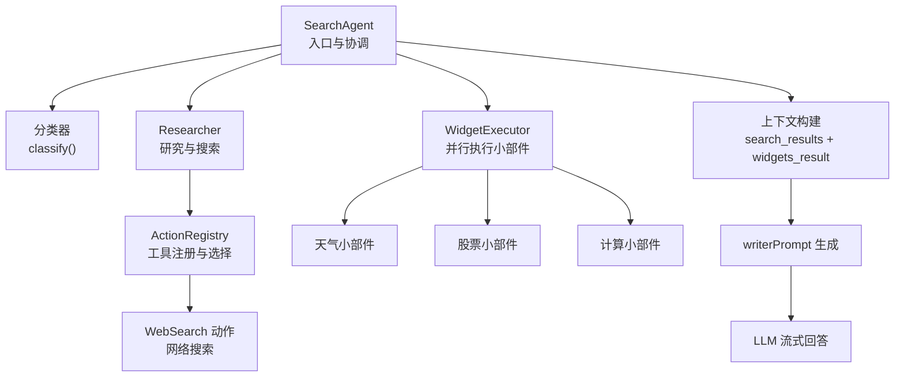
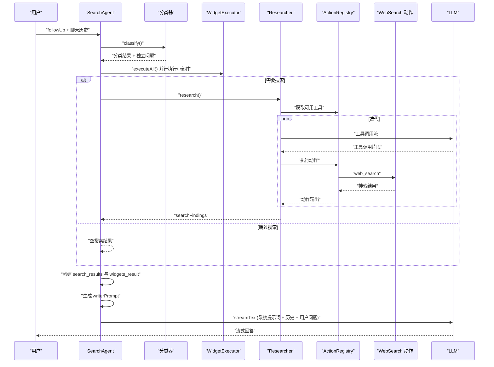
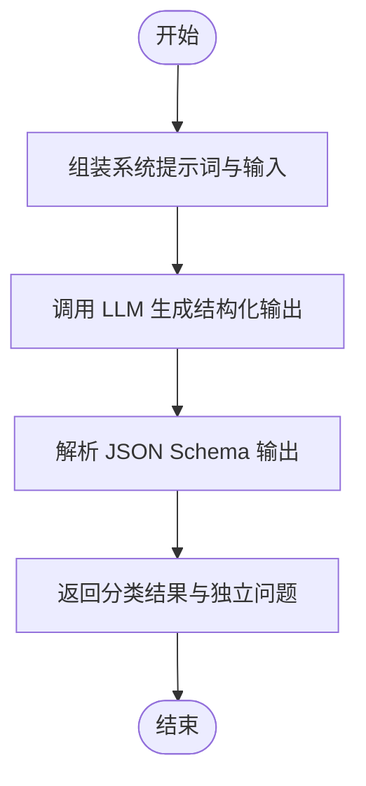
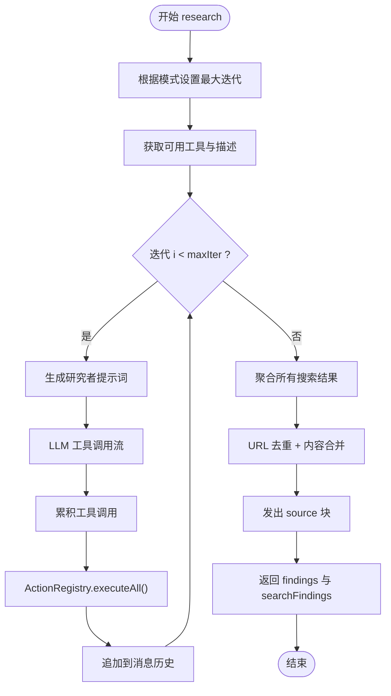
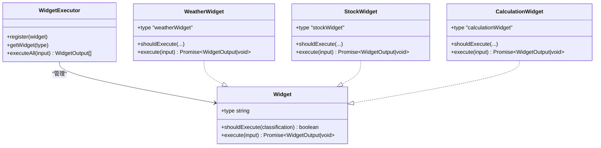
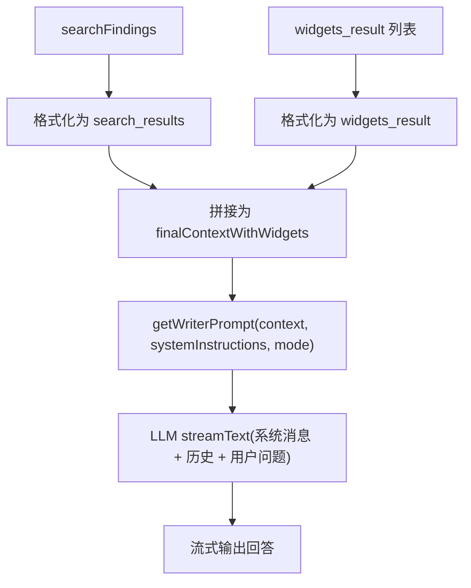
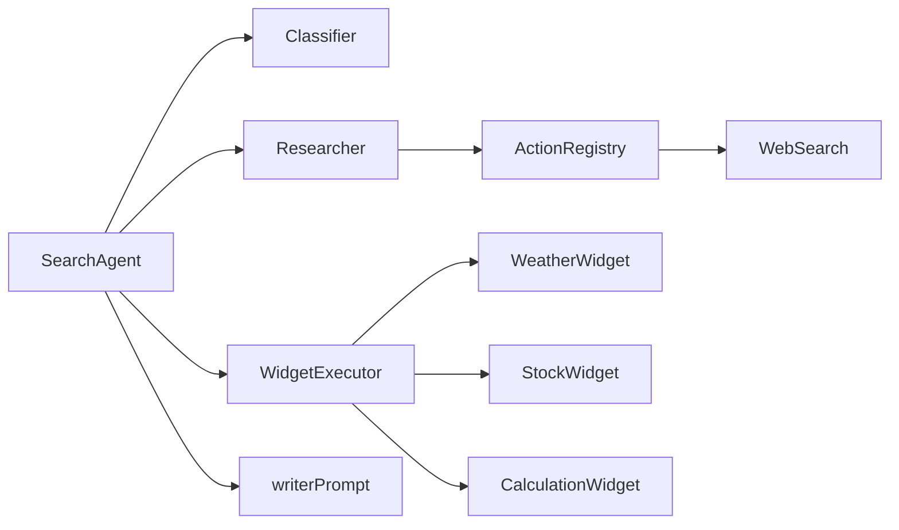

# 结果整合算法

<cite>
**本文档引用的文件**
- [src/lib/agents/search/index.ts](file://src/lib/agents/search/index.ts)
- [src/lib/agents/search/classifier.ts](file://src/lib/agents/search/classifier.ts)
- [src/lib/agents/search/researcher/index.ts](file://src/lib/agents/search/researcher/index.ts)
- [src/lib/agents/search/researcher/actions/registry.ts](file://src/lib/agents/search/researcher/actions/registry.ts)
- [src/lib/agents/search/researcher/actions/webSearch.ts](file://src/lib/agents/search/researcher/actions/webSearch.ts)
- [src/lib/agents/search/widgets/executor.ts](file://src/lib/agents/search/widgets/executor.ts)
- [src/lib/agents/search/widgets/weatherWidget.ts](file://src/lib/agents/search/widgets/weatherWidget.ts)
- [src/lib/agents/search/widgets/stockWidget.ts](file://src/lib/agents/search/widgets/stockWidget.ts)
- [src/lib/agents/search/widgets/calculationWidget.ts](file://src/lib/agents/search/widgets/calculationWidget.ts)
- [src/lib/prompts/search/writer.ts](file://src/lib/prompts/search/writer.ts)
- [src/lib/prompts/search/classifier.ts](file://src/lib/prompts/search/classifier.ts)
- [src/lib/utils/formatHistory.ts](file://src/lib/utils/formatHistory.ts)
- [src/lib/utils/computeSimilarity.ts](file://src/lib/utils/computeSimilarity.ts)
</cite>

## 目录
1. [引言](#引言)
2. [项目结构](#项目结构)
3. [核心组件](#核心组件)
4. [架构总览](#架构总览)
5. [详细组件分析](#详细组件分析)
6. [依赖关系分析](#依赖关系分析)
7. [性能考量与内存管理](#性能考量与内存管理)
8. [故障排查指南](#故障排查指南)
9. [结论](#结论)
10. [附录](#附录)

## 引言
本文件系统性阐述 Perplexica 搜索代理在一次问答中的“结果整合算法”。该算法负责：
- 将来自不同搜索源（如网络搜索）的结果进行去重与聚合
- 并行执行各类实时小部件（天气、股票、计算），产出可直接用于回答的上下文
- 构建最终上下文：格式化 search_results 与 widgets_result，注入引用标记与系统指令
- 基于整合后的上下文生成 writerPrompt，并驱动大模型流式输出最终答案
- 提供性能优化与内存管理建议，确保在多源并发与实时数据场景下的稳定性

## 项目结构
围绕“结果整合”的关键模块组织如下：
- 分类器：基于对话历史与用户查询，判断是否需要搜索、是否显示特定小部件、生成独立问题
- 研究者（Researcher）：按模式（速度/平衡/质量）迭代调用工具（如网络搜索），收集并去重搜索结果
- 小部件执行器（WidgetExecutor）：注册并并行执行天气、股票、计算等小部件
- 上下文构建与提示词生成：将搜索结果与小部件结果拼接为最终上下文，生成 writerPrompt
- 流式回答：以 writerPrompt 作为系统指令，结合历史消息与用户问题，流式输出最终答案

图表来源
- [src/lib/agents/search/index.ts](file://src/lib/agents/search/index.ts#L12-L187)
- [src/lib/agents/search/classifier.ts](file://src/lib/agents/search/classifier.ts#L37-L53)
- [src/lib/agents/search/researcher/index.ts](file://src/lib/agents/search/researcher/index.ts#L9-L223)
- [src/lib/agents/search/researcher/actions/registry.ts](file://src/lib/agents/search/researcher/actions/registry.ts#L11-L106)
- [src/lib/agents/search/researcher/actions/webSearch.ts](file://src/lib/agents/search/researcher/actions/webSearch.ts#L59-L183)
- [src/lib/agents/search/widgets/executor.ts](file://src/lib/agents/search/widgets/executor.ts#L3-L37)

章节来源
- [src/lib/agents/search/index.ts](file://src/lib/agents/search/index.ts#L12-L187)

## 核心组件
- 分类器（Classifier）
  - 输入：聊天历史、启用的搜索源、当前查询
  - 输出：分类标签（是否跳过搜索、个人/学术/讨论搜索、是否显示天气/股票/计算小部件）、独立问题
  - 关键点：使用 JSON Schema 约束输出，保证后续流程的确定性
- 研究者（Researcher）
  - 根据模式限制最大迭代次数，动态选择可用工具，流式解析工具调用，执行动作并聚合结果
  - 对搜索结果进行 URL 去重与内容合并，形成最终可引用的 searchFindings
- 小部件执行器（WidgetExecutor）
  - 注册多种小部件，按分类结果并行决定是否执行，统一收集输出
- 上下文构建与 writerPrompt
  - 将 searchFindings 与小部件输出分别包裹为 search_results 与 widgets_result
  - 注入系统指令与模式约束，生成最终 writerPrompt
- 流式回答
  - 使用 writerPrompt 作为系统消息，结合历史与用户问题，逐块流式输出

章节来源
- [src/lib/agents/search/classifier.ts](file://src/lib/agents/search/classifier.ts#L37-L53)
- [src/lib/agents/search/researcher/index.ts](file://src/lib/agents/search/researcher/index.ts#L9-L223)
- [src/lib/agents/search/widgets/executor.ts](file://src/lib/agents/search/widgets/executor.ts#L3-L37)
- [src/lib/prompts/search/writer.ts](file://src/lib/prompts/search/writer.ts#L1-L55)

## 架构总览
以下序列图展示了从用户输入到最终回答的关键调用链：

图表来源
- [src/lib/agents/search/index.ts](file://src/lib/agents/search/index.ts#L54-L135)
- [src/lib/agents/search/classifier.ts](file://src/lib/agents/search/classifier.ts#L37-L53)
- [src/lib/agents/search/researcher/index.ts](file://src/lib/agents/search/researcher/index.ts#L59-L182)
- [src/lib/agents/search/researcher/actions/registry.ts](file://src/lib/agents/search/researcher/actions/registry.ts#L33-L62)
- [src/lib/agents/search/researcher/actions/webSearch.ts](file://src/lib/agents/search/researcher/actions/webSearch.ts#L87-L179)
- [src/lib/prompts/search/writer.ts](file://src/lib/prompts/search/writer.ts#L1-L55)

## 详细组件分析

### 分类器（Classifier）
- 目标：将用户意图映射为可执行的动作集合与上下文构建规则
- 关键流程
  - 组装系统提示词与用户输入（包含聊天历史与当前问题）
  - 使用 LLM 生成结构化输出，包含分类标签与独立问题
- 输出字段
  - skipSearch、personalSearch、academicSearch、discussionSearch
  - showWeatherWidget、showStockWidget、showCalculationWidget
  - standaloneFollowUp：自包含的问题表述，便于后续检索与搜索

图表来源
- [src/lib/agents/search/classifier.ts](file://src/lib/agents/search/classifier.ts#L37-L53)
- [src/lib/prompts/search/classifier.ts](file://src/lib/prompts/search/classifier.ts#L1-L65)

章节来源
- [src/lib/agents/search/classifier.ts](file://src/lib/agents/search/classifier.ts#L37-L53)
- [src/lib/prompts/search/classifier.ts](file://src/lib/prompts/search/classifier.ts#L1-L65)

### 研究者（Researcher）与动作系统
- 目标：根据模式控制迭代次数，动态选择工具，执行动作并聚合结果
- 关键流程
  - 计算最大迭代次数（速度/平衡/质量）
  - 获取可用工具列表与描述
  - 流式解析工具调用，累积最终工具调用
  - 执行动作并追加到消息历史
  - 聚合所有搜索结果，进行 URL 去重与内容合并
- 去重与合并策略
  - 使用 Map 记录首次出现的 URL 及其索引
  - 若重复 URL，则将新内容追加到已有结果，避免重复发送与引用
  - 最终过滤掉被合并后标记为 undefined 的条目

图表来源
- [src/lib/agents/search/researcher/index.ts](file://src/lib/agents/search/researcher/index.ts#L9-L223)
- [src/lib/agents/search/researcher/actions/registry.ts](file://src/lib/agents/search/researcher/actions/registry.ts#L81-L102)
- [src/lib/agents/search/researcher/actions/webSearch.ts](file://src/lib/agents/search/researcher/actions/webSearch.ts#L87-L179)

章节来源
- [src/lib/agents/search/researcher/index.ts](file://src/lib/agents/search/researcher/index.ts#L9-L223)

### WidgetExecutor 与小部件
- WidgetExecutor
  - 注册多种 Widget 实例，提供 shouldExecute 与 execute 接口
  - executeAll 并行执行所有已注册小部件，收集输出，异常仅记录不中断
- 天气小部件（WeatherWidget）
  - 通过 LLM 抽取位置或坐标，再调用 OpenMeteo 获取天气数据，或通过 Nominatim 反向地理编码补全地点名称
  - 输出 llmContext 与结构化 data，供上下文构建与渲染
- 股票小部件（StockWidget）
  - 通过 LLM 抽取公司名或股票代码，使用 Yahoo Finance2 获取报价与多周期图表数据
  - 支持最多 3 个对比标的，统一输出 llmContext 与 data
- 计算小部件（CalculationWidget）
  - 通过 LLM 抽取数学表达式，使用 mathjs 计算并返回结果

图表来源
- [src/lib/agents/search/widgets/executor.ts](file://src/lib/agents/search/widgets/executor.ts#L3-L37)
- [src/lib/agents/search/widgets/weatherWidget.ts](file://src/lib/agents/search/widgets/weatherWidget.ts#L53-L204)
- [src/lib/agents/search/widgets/stockWidget.ts](file://src/lib/agents/search/widgets/stockWidget.ts#L51-L435)
- [src/lib/agents/search/widgets/calculationWidget.ts](file://src/lib/agents/search/widgets/calculationWidget.ts#L35-L72)

章节来源
- [src/lib/agents/search/widgets/executor.ts](file://src/lib/agents/search/widgets/executor.ts#L3-L37)
- [src/lib/agents/search/widgets/weatherWidget.ts](file://src/lib/agents/search/widgets/weatherWidget.ts#L53-L204)
- [src/lib/agents/search/widgets/stockWidget.ts](file://src/lib/agents/search/widgets/stockWidget.ts#L51-L435)
- [src/lib/agents/search/widgets/calculationWidget.ts](file://src/lib/agents/search/widgets/calculationWidget.ts#L35-L72)

### 上下文构建与 writerPrompt
- 上下文构建
  - 将 searchFindings 映射为带索引与标题的 XML 片段，拼接为 search_results
  - 将各小部件输出的 llmContext 以分隔符连接为 widgets_result
  - 合并为 finalContextWithWidgets，并在 writerPrompt 中作为 <context> 注入
- writerPrompt 生成
  - 包含角色定位、格式要求、引用规范、特殊说明、示例输出与当前时间戳
  - 根据模式（speed/balanced/quality）注入长度与深度约束
  - 将 systemInstructions 作为用户指令注入，优先级低于系统指令
- 最终回答
  - 以 writerPrompt 为系统消息，结合聊天历史与用户问题，流式输出文本块

图表来源
- [src/lib/agents/search/index.ts](file://src/lib/agents/search/index.ts#L101-L135)
- [src/lib/prompts/search/writer.ts](file://src/lib/prompts/search/writer.ts#L1-L55)

章节来源
- [src/lib/agents/search/index.ts](file://src/lib/agents/search/index.ts#L101-L135)
- [src/lib/prompts/search/writer.ts](file://src/lib/prompts/search/writer.ts#L1-L55)

## 依赖关系分析
- 组件耦合
  - SearchAgent 依赖分类器、Researcher、WidgetExecutor、writerPrompt 与 LLM
  - Researcher 依赖 ActionRegistry 与具体动作（如 WebSearch）
  - 小部件依赖外部服务（OpenMeteo、Nominatim、Yahoo Finance2、mathjs）
- 外部依赖与集成点
  - SearxNG：用于网络搜索
  - OpenMeteo/Nominatim：天气数据与地理编码
  - Yahoo Finance2：股票数据
  - LLM：对象生成与文本流式输出
- 潜在循环依赖
  - 当前结构为单向依赖（SearchAgent → 其他组件），未见循环

图表来源
- [src/lib/agents/search/index.ts](file://src/lib/agents/search/index.ts#L1-L187)
- [src/lib/agents/search/researcher/actions/registry.ts](file://src/lib/agents/search/researcher/actions/registry.ts#L1-L106)
- [src/lib/agents/search/researcher/actions/webSearch.ts](file://src/lib/agents/search/researcher/actions/webSearch.ts#L1-L183)
- [src/lib/agents/search/widgets/executor.ts](file://src/lib/agents/search/widgets/executor.ts#L1-L37)

章节来源
- [src/lib/agents/search/index.ts](file://src/lib/agents/search/index.ts#L1-L187)

## 性能考量与内存管理
- 并发与异步
  - 小部件执行采用 Promise.all 并行执行，缩短端到端时延
  - 研究者动作执行同样使用 Promise.all 并行拉取多个查询结果
- 去重与内存
  - URL 去重使用 Map 记录首次出现索引，避免重复内容与引用
  - 合并策略仅追加内容，减少重复对象创建
- I/O 优化
  - 天气与股票小部件中，对地理编码与 API 请求使用 Promise.all 并行请求
  - 研究者网络搜索对多个关键词并行发起请求
- 流式输出
  - 使用 LLM 的流式接口，边生成边输出，降低首字节延迟与内存峰值
- 内存管理建议
  - 控制搜索结果数量上限（例如限制每个查询返回的条目数）
  - 对长文本内容进行分块处理，避免一次性拼接超大字符串
  - 在小部件执行失败时捕获异常并降级输出，避免阻塞主流程
  - 对聊天历史进行截断（保留最近若干轮），减少上下文长度

章节来源
- [src/lib/agents/search/widgets/executor.ts](file://src/lib/agents/search/widgets/executor.ts#L14-L33)
- [src/lib/agents/search/researcher/index.ts](file://src/lib/agents/search/researcher/index.ts#L188-L208)
- [src/lib/agents/search/researcher/actions/webSearch.ts](file://src/lib/agents/search/researcher/actions/webSearch.ts#L173-L179)
- [src/lib/agents/search/widgets/weatherWidget.ts](file://src/lib/agents/search/widgets/weatherWidget.ts#L141-L160)
- [src/lib/agents/search/widgets/stockWidget.ts](file://src/lib/agents/search/widgets/stockWidget.ts#L134-L142)

## 故障排查指南
- 分类器输出异常
  - 现象：分类结果缺失或格式不符
  - 排查：确认系统提示词与 JSON Schema 是否匹配；检查 LLM 生成稳定性
- 研究者无结果或结果重复
  - 现象：搜索结果为空或重复
  - 排查：检查 ActionRegistry 可用工具是否正确启用；核对 URL 去重逻辑与内容合并策略
- 小部件执行失败
  - 现象：天气/股票/计算小部件返回错误信息
  - 排查：检查外部服务可用性（OpenMeteo、Nominatim、Yahoo Finance2、mathjs）；查看异常捕获分支输出
- writerPrompt 生成异常
  - 现象：上下文过大导致 LLM 截断或报错
  - 排查：缩短聊天历史与搜索结果；调整模式参数；限制小部件输出大小
- 流式输出卡顿
  - 现象：回答延迟高或内存占用飙升
  - 排查：检查网络 I/O 与外部 API 响应；优化结果聚合与上下文拼接策略

章节来源
- [src/lib/agents/search/classifier.ts](file://src/lib/agents/search/classifier.ts#L37-L53)
- [src/lib/agents/search/researcher/index.ts](file://src/lib/agents/search/researcher/index.ts#L188-L208)
- [src/lib/agents/search/widgets/weatherWidget.ts](file://src/lib/agents/search/widgets/weatherWidget.ts#L192-L200)
- [src/lib/agents/search/widgets/stockWidget.ts](file://src/lib/agents/search/widgets/stockWidget.ts#L421-L430)
- [src/lib/agents/search/widgets/calculationWidget.ts](file://src/lib/agents/search/widgets/calculationWidget.ts#L58-L67)

## 结论
本结果整合算法通过“分类器 + 研究者 + 小部件执行器”的协同，实现了对多源信息的统一去重、格式化与引用标注，并以 writerPrompt 为桥梁将上下文注入到 LLM 的回答生成过程中。整体设计强调并发与流式输出，兼顾准确性与性能。针对不同模式（速度/平衡/质量），系统在迭代次数与搜索深度上做出权衡，满足多样化的用户体验需求。

## 附录
- 相关工具函数
  - formatHistory：将聊天历史转为字符串，供分类器与小部件抽取使用
  - computeSimilarity：向量相似度计算工具（可用于潜在的相关性评分扩展）

章节来源
- [src/lib/utils/formatHistory.ts](file://src/lib/utils/formatHistory.ts#L1-L13)
- [src/lib/utils/computeSimilarity.ts](file://src/lib/utils/computeSimilarity.ts#L1-L23)