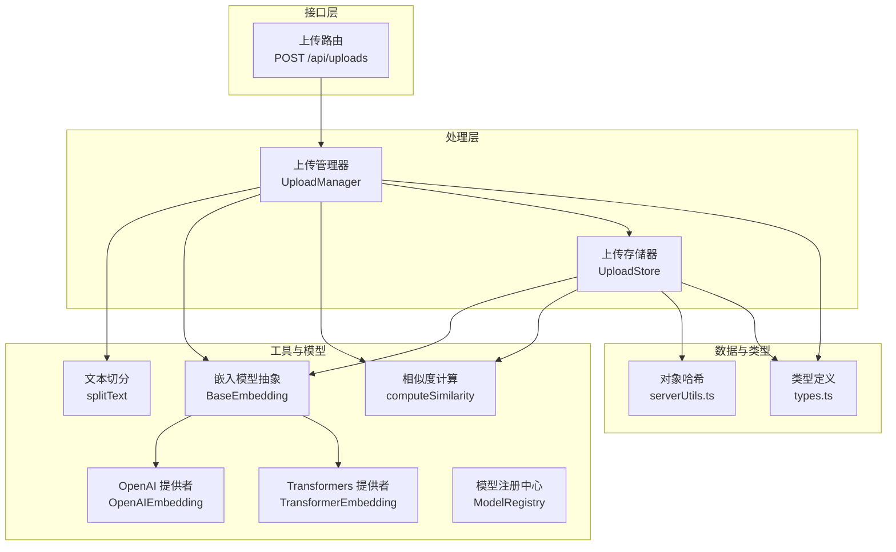
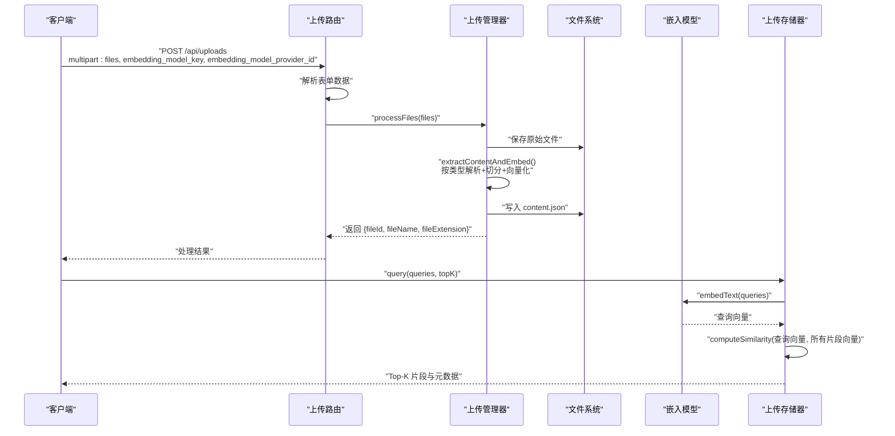
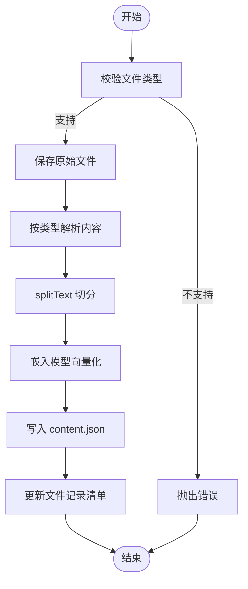
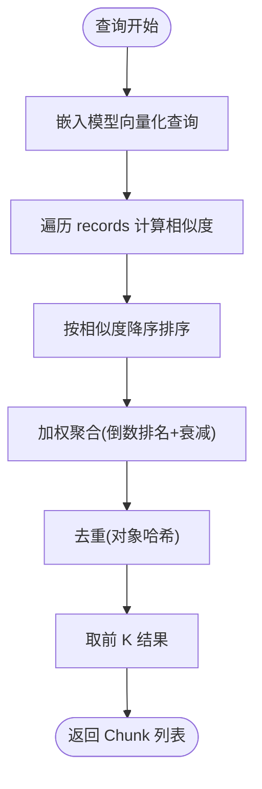
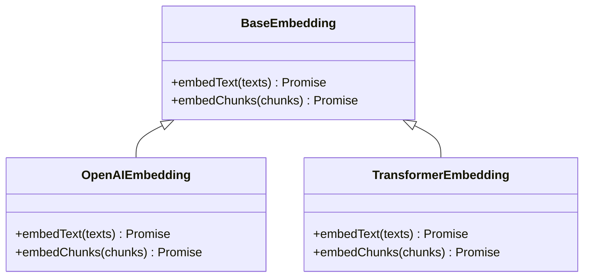
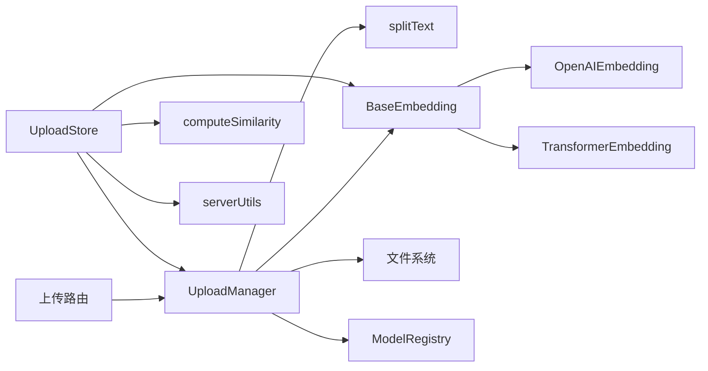

# 文件处理系统

<cite>
**本文引用的文件**
- [src/lib/uploads/manager.ts](file://src/lib/uploads/manager.ts)
- [src/lib/uploads/store.ts](file://src/lib/uploads/store.ts)
- [src/app/api/uploads/route.ts](file://src/app/api/uploads/route.ts)
- [src/lib/utils/splitText.ts](file://src/lib/utils/splitText.ts)
- [src/lib/utils/computeSimilarity.ts](file://src/lib/utils/computeSimilarity.ts)
- [src/lib/utils/files.ts](file://src/lib/utils/files.ts)
- [src/lib/models/base/embedding.ts](file://src/lib/models/base/embedding.ts)
- [src/lib/models/providers/openai/openaiEmbedding.ts](file://src/lib/models/providers/openai/openaiEmbedding.ts)
- [src/lib/models/providers/transformers/transformerEmbedding.ts](file://src/lib/models/providers/transformers/transformerEmbedding.ts)
- [src/lib/models/registry.ts](file://src/lib/models/registry.ts)
- [src/lib/types.ts](file://src/lib/types.ts)
- [src/lib/serverUtils.ts](file://src/lib/serverUtils.ts)
</cite>

## 目录
1. [简介](#简介)
2. [项目结构](#项目结构)
3. [核心组件](#核心组件)
4. [架构总览](#架构总览)
5. [详细组件分析](#详细组件分析)
6. [依赖关系分析](#依赖关系分析)
7. [性能考虑](#性能考虑)
8. [故障排查指南](#故障排查指南)
9. [结论](#结论)
10. [附录：使用示例与扩展指南](#附录使用示例与扩展指南)

## 简介
本文件处理系统围绕“文件上传-内容解析-嵌入向量化-检索检索”的完整链路展开，支持 PDF、Word 文档与纯文本文件的上传与处理。系统通过可插拔的嵌入模型提供者（如 OpenAI、Transformers）生成向量，将文本切分为固定长度的片段并计算相似度，最终返回与查询最相关的片段集合。本文档从架构、数据流、处理逻辑、性能优化到扩展方式进行全面说明。

## 项目结构
- 上传接口层：Next.js 路由负责接收文件与模型参数，调用上传管理器完成处理。
- 上传管理器：负责文件接收、格式校验、内容提取、文本切分、向量化与持久化。
- 上传存储器：加载已处理文件的向量与片段，执行相似度计算与检索。
- 工具模块：文本切分、相似度计算、文件元数据读取、对象哈希。
- 嵌入模型抽象与提供者：统一的嵌入接口与多种实现（OpenAI、Transformers）。
- 类型定义：统一的 Chunk 与消息类型，便于跨模块协作。

图表来源
- [src/app/api/uploads/route.ts](file://src/app/api/uploads/route.ts#L1-L41)
- [src/lib/uploads/manager.ts](file://src/lib/uploads/manager.ts#L1-L218)
- [src/lib/uploads/store.ts](file://src/lib/uploads/store.ts#L1-L122)
- [src/lib/utils/splitText.ts](file://src/lib/utils/splitText.ts#L1-L75)
- [src/lib/utils/computeSimilarity.ts](file://src/lib/utils/computeSimilarity.ts#L1-L23)
- [src/lib/models/base/embedding.ts](file://src/lib/models/base/embedding.ts#L1-L10)
- [src/lib/models/providers/openai/openaiEmbedding.ts](file://src/lib/models/providers/openai/openaiEmbedding.ts#L1-L43)
- [src/lib/models/providers/transformers/transformerEmbedding.ts](file://src/lib/models/providers/transformers/transformerEmbedding.ts#L1-L41)
- [src/lib/models/registry.ts](file://src/lib/models/registry.ts#L1-L222)
- [src/lib/types.ts](file://src/lib/types.ts#L1-L124)
- [src/lib/serverUtils.ts](file://src/lib/serverUtils.ts#L1-L8)

章节来源
- [src/app/api/uploads/route.ts](file://src/app/api/uploads/route.ts#L1-L41)
- [src/lib/uploads/manager.ts](file://src/lib/uploads/manager.ts#L1-L218)
- [src/lib/uploads/store.ts](file://src/lib/uploads/store.ts#L1-L122)
- [src/lib/utils/splitText.ts](file://src/lib/utils/splitText.ts#L1-L75)
- [src/lib/utils/computeSimilarity.ts](file://src/lib/utils/computeSimilarity.ts#L1-L23)
- [src/lib/models/base/embedding.ts](file://src/lib/models/base/embedding.ts#L1-L10)
- [src/lib/models/providers/openai/openaiEmbedding.ts](file://src/lib/models/providers/openai/openaiEmbedding.ts#L1-L43)
- [src/lib/models/providers/transformers/transformerEmbedding.ts](file://src/lib/models/providers/transformers/transformerEmbedding.ts#L1-L41)
- [src/lib/models/registry.ts](file://src/lib/models/registry.ts#L1-L222)
- [src/lib/types.ts](file://src/lib/types.ts#L1-L124)
- [src/lib/serverUtils.ts](file://src/lib/serverUtils.ts#L1-L8)

## 核心组件
- 上传管理器 UploadManager
  - 接收文件列表，校验 MIME 类型，生成唯一文件 ID，保存原始文件，按类型提取内容并进行切分与向量化，写入 content.json 并记录文件清单。
- 上传存储器 UploadStore
  - 加载指定文件的所有片段与向量，对查询语句进行向量化后与所有记录计算余弦相似度，采用归一化评分聚合与去重，返回 Top-K 结果。
- 嵌入模型抽象 BaseEmbedding 与提供者
  - 统一 embedText 与 embedChunks 接口；OpenAI 提供者基于官方 SDK；Transformers 提供者基于 @huggingface/transformers 的特征提取流水线。
- 文本切分 splitText
  - 基于正则断句与 token 计数，控制最大 token 数与重叠 token 数，保证语义完整性与上下文连续性。
- 相似度计算 computeSimilarity
  - 余弦相似度实现，输入为等长向量，输出范围 [0,1]。
- 模型注册中心 ModelRegistry
  - 动态加载与管理不同提供者的可用模型列表，支持运行时切换嵌入模型。

章节来源
- [src/lib/uploads/manager.ts](file://src/lib/uploads/manager.ts#L32-L218)
- [src/lib/uploads/store.ts](file://src/lib/uploads/store.ts#L20-L122)
- [src/lib/models/base/embedding.ts](file://src/lib/models/base/embedding.ts#L3-L9)
- [src/lib/models/providers/openai/openaiEmbedding.ts](file://src/lib/models/providers/openai/openaiEmbedding.ts#L11-L43)
- [src/lib/models/providers/transformers/transformerEmbedding.ts](file://src/lib/models/providers/transformers/transformerEmbedding.ts#L9-L41)
- [src/lib/utils/splitText.ts](file://src/lib/utils/splitText.ts#L15-L75)
- [src/lib/utils/computeSimilarity.ts](file://src/lib/utils/computeSimilarity.ts#L1-L23)
- [src/lib/models/registry.ts](file://src/lib/models/registry.ts#L84-L92)

## 架构总览
下图展示从客户端上传到向量检索的整体流程与组件交互。

图表来源
- [src/app/api/uploads/route.ts](file://src/app/api/uploads/route.ts#L5-L32)
- [src/lib/uploads/manager.ts](file://src/lib/uploads/manager.ts#L89-L175)
- [src/lib/uploads/store.ts](file://src/lib/uploads/store.ts#L54-L98)
- [src/lib/models/providers/openai/openaiEmbedding.ts](file://src/lib/models/providers/openai/openaiEmbedding.ts#L23-L39)
- [src/lib/models/providers/transformers/transformerEmbedding.ts](file://src/lib/models/providers/transformers/transformerEmbedding.ts#L24-L38)

## 详细组件分析

### 上传管理器 UploadManager
- 支持的 MIME 类型
  - application/pdf
  - application/vnd.openxmlformats-officedocument.wordprocessingml.document
  - text/plain
- 处理流程
  - 校验类型 -> 生成随机文件名与 ID -> 写入原始文件 -> 按类型提取文本 -> 切分文本 -> 向量化 -> 写入 content.json -> 记录文件信息
- 关键点
  - 使用 PDFParse 与 officeparser 解析二进制内容，避免依赖外部进程。
  - 切分与向量化同步执行，确保片段与向量一一对应。
  - 将每个文件的 content.json 路径与原始路径记录在 JSON 清单中，便于后续加载。

图表来源
- [src/lib/uploads/manager.ts](file://src/lib/uploads/manager.ts#L180-L215)
- [src/lib/utils/splitText.ts](file://src/lib/utils/splitText.ts#L15-L75)

章节来源
- [src/lib/uploads/manager.ts](file://src/lib/uploads/manager.ts#L10-L218)

### 上传存储器 UploadStore
- 初始化
  - 遍历 fileIds，读取对应文件记录与 content.json 中的片段与向量，构造内部 records。
- 查询流程
  - 对每个查询语句向量化，遍历所有 records 计算相似度，排序后按“倒数排名 + 衰减常数”加权聚合，去重后取前 K。
- 元数据
  - 保留文件名、标题、url（file_id://{id}），便于溯源与展示。

图表来源
- [src/lib/uploads/store.ts](file://src/lib/uploads/store.ts#L54-L98)
- [src/lib/utils/computeSimilarity.ts](file://src/lib/utils/computeSimilarity.ts#L1-L23)
- [src/lib/serverUtils.ts](file://src/lib/serverUtils.ts#L3-L7)

章节来源
- [src/lib/uploads/store.ts](file://src/lib/uploads/store.ts#L20-L122)

### 嵌入模型抽象与提供者
- 抽象接口
  - embedText：对字符串数组进行向量化
  - embedChunks：对 Chunk 数组进行向量化
- OpenAI 提供者
  - 基于官方 SDK，支持自定义 baseURL，适合云端服务。
- Transformers 提供者
  - 使用 @huggingface/transformers 的特征提取流水线，支持本地推理与模型池化/归一化。

图表来源
- [src/lib/models/base/embedding.ts](file://src/lib/models/base/embedding.ts#L3-L9)
- [src/lib/models/providers/openai/openaiEmbedding.ts](file://src/lib/models/providers/openai/openaiEmbedding.ts#L11-L43)
- [src/lib/models/providers/transformers/transformerEmbedding.ts](file://src/lib/models/providers/transformers/transformerEmbedding.ts#L9-L41)

章节来源
- [src/lib/models/base/embedding.ts](file://src/lib/models/base/embedding.ts#L1-L10)
- [src/lib/models/providers/openai/openaiEmbedding.ts](file://src/lib/models/providers/openai/openaiEmbedding.ts#L1-L43)
- [src/lib/models/providers/transformers/transformerEmbedding.ts](file://src/lib/models/providers/transformers/transformerEmbedding.ts#L1-L41)

### 文本切分与相似度计算
- splitText
  - 使用正则断句，结合 cl100k_base 编码估算 token 数，控制每片最大 token 数与重叠 token 数，保证语义边界与上下文连续。
- computeSimilarity
  - 实现余弦相似度，要求向量等长，避免零范数导致除零。

章节来源
- [src/lib/utils/splitText.ts](file://src/lib/utils/splitText.ts#L1-L75)
- [src/lib/utils/computeSimilarity.ts](file://src/lib/utils/computeSimilarity.ts#L1-L23)

### 模型注册与加载
- ModelRegistry
  - 从配置加载提供者实例，暴露 loadEmbeddingModel/loadChatModel 等方法，支持动态增删改提供者与模型。

章节来源
- [src/lib/models/registry.ts](file://src/lib/models/registry.ts#L84-L92)

## 依赖关系分析
- 组件耦合
  - UploadManager 依赖 splitText、BaseEmbedding、文件系统；UploadStore 依赖 UploadManager、computeSimilarity、serverUtils。
  - 路由层仅负责参数解析与模型加载，职责清晰。
- 外部依赖
  - PDFParse、officeparser、@huggingface/transformers、OpenAI SDK。
- 可能的循环依赖
  - 当前模块间为单向依赖，未见循环导入迹象。

图表来源
- [src/app/api/uploads/route.ts](file://src/app/api/uploads/route.ts#L1-L41)
- [src/lib/uploads/manager.ts](file://src/lib/uploads/manager.ts#L1-L218)
- [src/lib/uploads/store.ts](file://src/lib/uploads/store.ts#L1-L122)
- [src/lib/models/registry.ts](file://src/lib/models/registry.ts#L1-L222)

章节来源
- [src/app/api/uploads/route.ts](file://src/app/api/uploads/route.ts#L1-L41)
- [src/lib/uploads/manager.ts](file://src/lib/uploads/manager.ts#L1-L218)
- [src/lib/uploads/store.ts](file://src/lib/uploads/store.ts#L1-L122)
- [src/lib/models/registry.ts](file://src/lib/models/registry.ts#L1-L222)

## 性能考虑
- 并发处理
  - 上传阶段使用 Promise.all 并行处理多个文件，显著缩短总耗时。
  - 查询阶段对每个查询向量与全部记录计算相似度，建议限制并发或引入分页/分批策略以控制内存峰值。
- 内存管理
  - 大文件解析与向量化可能占用较多内存；建议在高并发场景下限制同时处理的文件数量，或拆分查询批次。
- 缓存策略
  - content.json 作为中间产物，避免重复解析与向量化；可考虑将向量与片段缓存在内存中（UploadStore 初始化时加载）。
  - 建议对频繁查询的嵌入结果做 LRU 缓存（可在嵌入提供者层实现）。
- I/O 优化
  - 使用流式写入与异步读取；对 PDF/DOC 解析尽量减少中间缓冲。
- Token 控制
  - splitText 的 maxTokens 与 overlapTokens 是性能与召回的关键平衡点，可根据硬件能力调整。

[本节为通用性能指导，无需特定文件来源]

## 故障排查指南
- 常见错误与定位
  - “文件类型不支持”：检查前端传入的 MIME 类型是否在受支持列表内。
  - “嵌入与文本片段长度不匹配”：确认切分与向量化步骤一一对应，避免中途修改数据结构。
  - “找不到文件 ID”：确认上传记录清单与 content.json 是否正确生成。
  - “向量长度不一致”：确保所选嵌入模型输出维度稳定。
- 日志与调试
  - UploadManager/FileChunks 获取失败会打印错误日志，便于定位文件缺失或解析异常。
  - UploadStore 在查询阶段对每个片段计算相似度并排序，若出现空结果，检查嵌入模型是否正常工作。

章节来源
- [src/lib/uploads/manager.ts](file://src/lib/uploads/manager.ts#L180-L183)
- [src/lib/uploads/manager.ts](file://src/lib/uploads/manager.ts#L76-L86)
- [src/lib/utils/computeSimilarity.ts](file://src/lib/utils/computeSimilarity.ts#L2-L3)

## 结论
该文件处理系统以清晰的职责划分与可插拔的嵌入模型设计，实现了从多格式文件上传到向量检索的完整闭环。通过合理的文本切分策略与相似度聚合算法，在保证召回质量的同时兼顾了性能与可维护性。未来可在并发限流、缓存与索引层面进一步优化，以支撑更大规模的数据与更高并发的查询需求。

[本节为总结性内容，无需特定文件来源]

## 附录：使用示例与扩展指南

### 使用示例
- 上传文件
  - 请求路径：POST /api/uploads
  - 表单字段：
    - files：文件数组（支持 PDF、Word、文本）
    - embedding_model_key：嵌入模型键值
    - embedding_model_provider_id：提供者 ID
  - 返回：每个文件的 fileId、fileName、fileExtension
- 检索片段
  - 使用 UploadStore.query(queries, topK) 获取与查询最相关的片段列表，片段包含 content 与 metadata（含文件名、url）。

章节来源
- [src/app/api/uploads/route.ts](file://src/app/api/uploads/route.ts#L5-L32)
- [src/lib/uploads/store.ts](file://src/lib/uploads/store.ts#L54-L98)

### 扩展指南
- 新增文件格式支持
  - 在 UploadManager.supportedMimeTypes 增加新类型，并在 extractContentAndEmbed 中添加对应解析分支（参考 PDF/Word/文本的实现模式）。
- 新增嵌入模型提供者
  - 继承 BaseEmbedding，实现 embedText 与 embedChunks；在 ModelRegistry 中注册提供者类型并提供默认模型列表。
- 自定义切分策略
  - 调整 splitText 的 maxTokens 与 overlapTokens 参数，或替换为更精细的分词器以适配不同语言与领域。
- 查询优化
  - 引入向量索引（如 FAISS/ScaNN）以加速大规模相似度计算；或对 records 进行分桶与分区，按查询关键词快速筛选候选集。

章节来源
- [src/lib/uploads/manager.ts](file://src/lib/uploads/manager.ts#L10-L175)
- [src/lib/models/base/embedding.ts](file://src/lib/models/base/embedding.ts#L3-L9)
- [src/lib/models/registry.ts](file://src/lib/models/registry.ts#L28-L35)