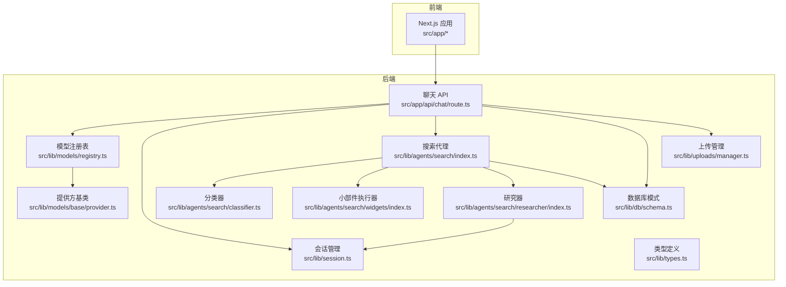
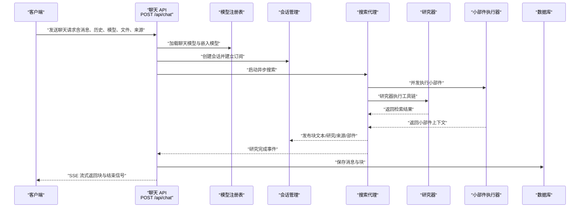
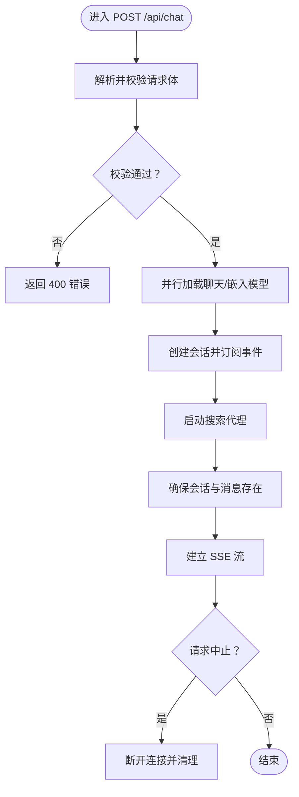
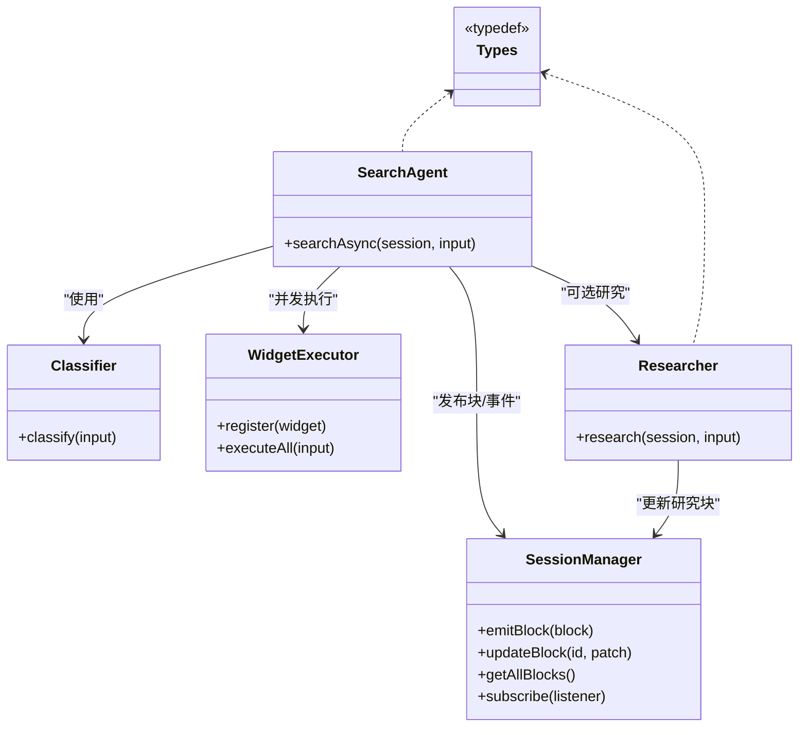
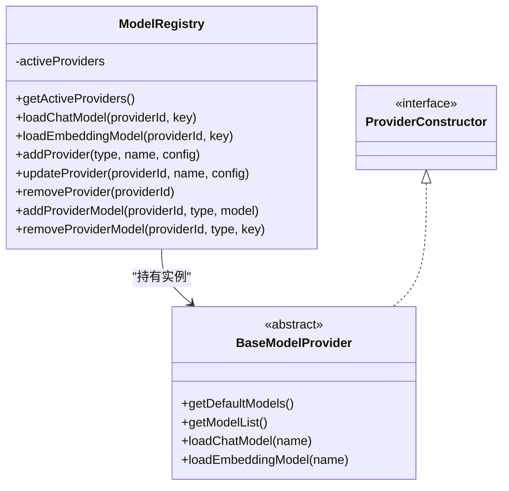
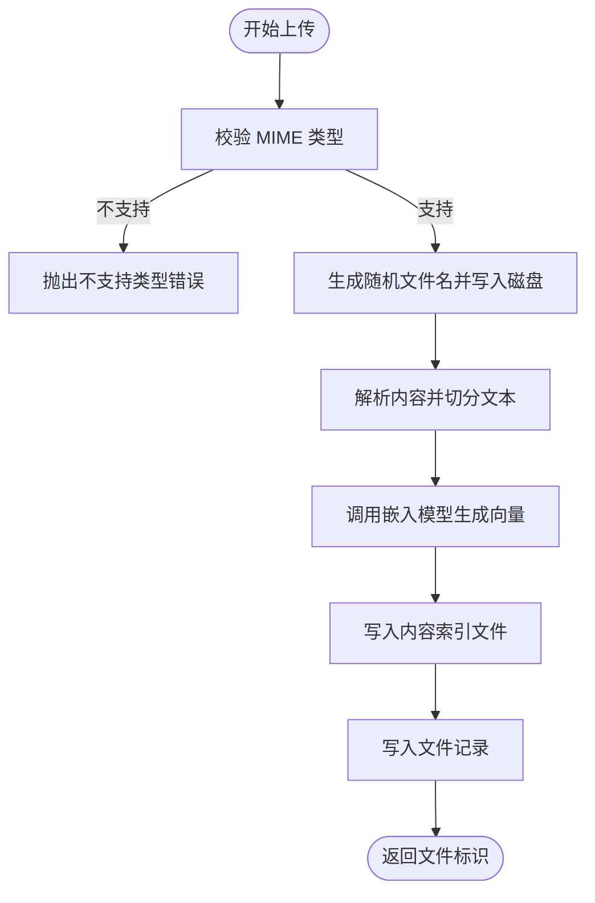
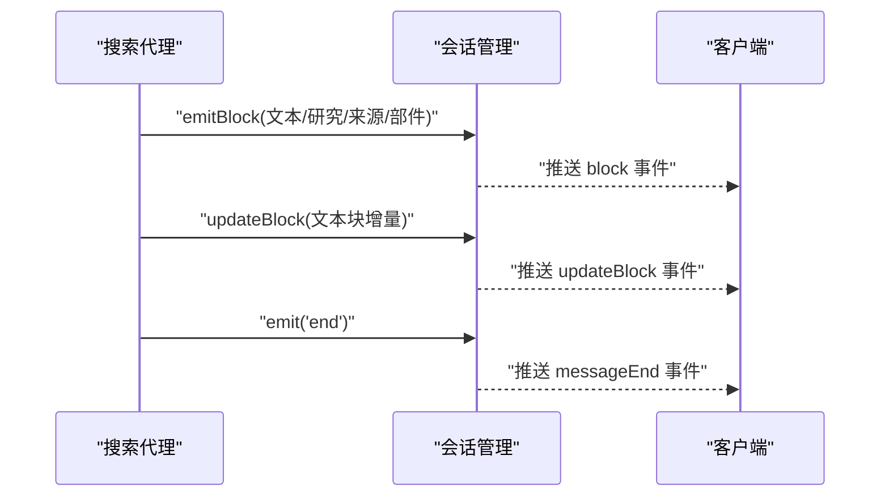
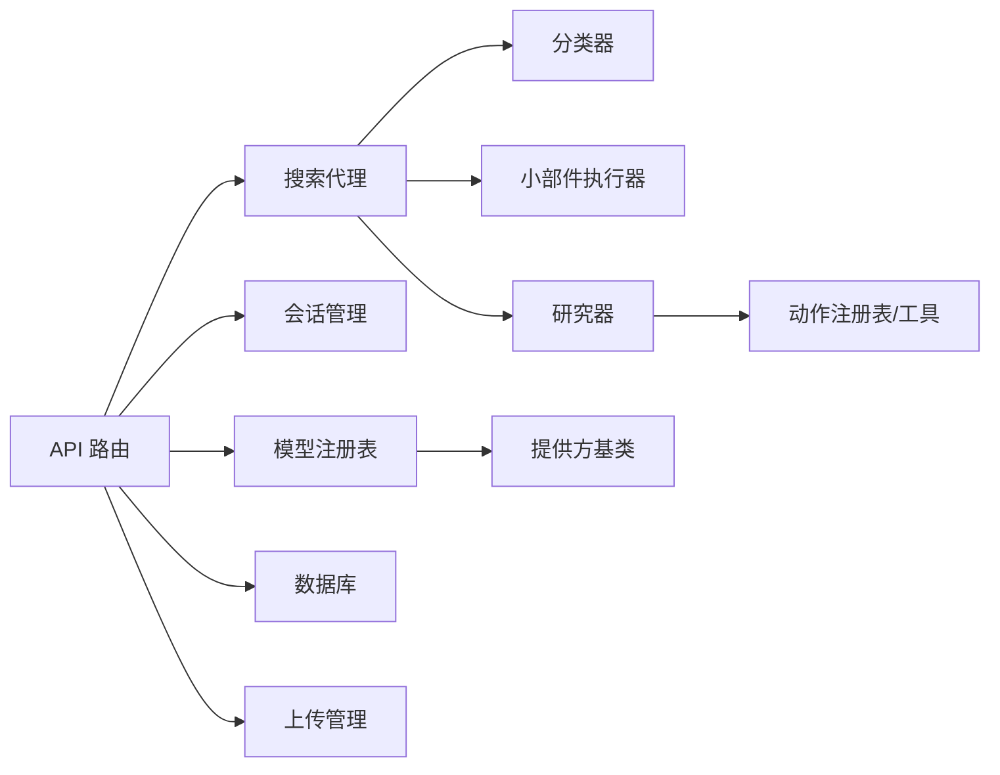

# 核心功能模块

<cite>
**本文引用的文件**
- [README.md](file://README.md)
- [package.json](file://package.json)
- [src/app/api/chat/route.ts](file://src/app/api/chat/route.ts)
- [src/lib/types.ts](file://src/lib/types.ts)
- [src/lib/session.ts](file://src/lib/session.ts)
- [src/lib/models/registry.ts](file://src/lib/models/registry.ts)
- [src/lib/models/base/provider.ts](file://src/lib/models/base/provider.ts)
- [src/lib/models/types.ts](file://src/lib/models/types.ts)
- [src/lib/config/serverRegistry.ts](file://src/lib/config/serverRegistry.ts)
- [src/lib/config/types.ts](file://src/lib/config/types.ts)
- [src/lib/db/schema.ts](file://src/lib/db/schema.ts)
- [src/lib/agents/search/index.ts](file://src/lib/agents/search/index.ts)
- [src/lib/agents/search/types.ts](file://src/lib/agents/search/types.ts)
- [src/lib/agents/search/researcher/index.ts](file://src/lib/agents/search/researcher/index.ts)
- [src/lib/agents/search/classifier.ts](file://src/lib/agents/search/classifier.ts)
- [src/lib/agents/search/widgets/index.ts](file://src/lib/agents/search/widgets/index.ts)
- [src/lib/uploads/manager.ts](file://src/lib/uploads/manager.ts)
- [src/lib/utils/formatHistory.ts](file://src/lib/utils/formatHistory.ts)
</cite>

## 目录
1. [简介](#简介)
2. [项目结构](#项目结构)
3. [核心组件](#核心组件)
4. [架构总览](#架构总览)
5. [详细组件分析](#详细组件分析)
6. [依赖分析](#依赖分析)
7. [性能考量](#性能考量)
8. [故障排除指南](#故障排除指南)
9. [结论](#结论)
10. [附录](#附录)

## 简介
本文件面向 Perplexica 的核心功能模块，系统性梳理聊天系统、搜索代理系统、模型管理、文件处理与会话管理五大模块的设计与实现。文档从架构视角解释模块职责、关键接口与内部工作机制，给出模块间协作关系与数据流，并提供可扩展与定制化建议、性能优化策略以及故障排除清单，兼顾初学者与高级开发者的阅读需求。

## 项目结构
Perplexica 基于 Next.js 构建，采用前后端同构的 API 路由与客户端组件混合架构。核心后端逻辑集中在 src/lib 下，按领域拆分：模型注册与提供方抽象、搜索代理与研究器、会话状态管理、上传与嵌入、数据库与类型定义；前端路由与页面位于 src/app 下，通过 API 路由与后端交互。

图表来源
- [src/app/api/chat/route.ts](file://src/app/api/chat/route.ts#L103-L255)
- [src/lib/agents/search/index.ts](file://src/lib/agents/search/index.ts#L12-L187)
- [src/lib/agents/search/researcher/index.ts](file://src/lib/agents/search/researcher/index.ts#L9-L223)
- [src/lib/agents/search/classifier.ts](file://src/lib/agents/search/classifier.ts#L37-L54)
- [src/lib/agents/search/widgets/index.ts](file://src/lib/agents/search/widgets/index.ts#L1-L11)
- [src/lib/session.ts](file://src/lib/session.ts#L11-L106)
- [src/lib/models/registry.ts](file://src/lib/models/registry.ts#L8-L222)
- [src/lib/models/base/provider.ts](file://src/lib/models/base/provider.ts#L6-L46)
- [src/lib/types.ts](file://src/lib/types.ts#L1-L124)
- [src/lib/db/schema.ts](file://src/lib/db/schema.ts#L6-L39)
- [src/lib/uploads/manager.ts](file://src/lib/uploads/manager.ts#L32-L218)

章节来源
- [README.md](file://README.md#L1-L267)
- [package.json](file://package.json#L1-L77)

## 核心组件
- 聊天系统（API 层）
  - 入口：POST /api/chat 接收消息、历史、模型配置与文件列表，返回 SSE 流式响应。
  - 关键职责：参数校验、加载模型、创建会话、触发搜索代理、持久化会话与消息块。
- 搜索代理系统
  - 职责：根据查询与历史进行意图分类，执行小部件（天气/股票/计算）与研究流程，生成最终回答。
  - 组件：分类器、研究器、小部件执行器、写作者提示词。
- 模型管理
  - 职责：统一注册与加载不同提供方的聊天与嵌入模型，支持动态增删改提供方与模型。
  - 组件：注册表、提供方基类、提供方实现集合。
- 文件处理
  - 职责：接收上传文件，解析内容并切分为文本块，调用嵌入模型生成向量，记录文件与内容索引。
- 会话管理
  - 职责：以事件驱动的方式维护块级状态，支持增量更新与订阅，提供 TTL 清理。

章节来源
- [src/app/api/chat/route.ts](file://src/app/api/chat/route.ts#L103-L255)
- [src/lib/agents/search/index.ts](file://src/lib/agents/search/index.ts#L12-L187)
- [src/lib/models/registry.ts](file://src/lib/models/registry.ts#L8-L222)
- [src/lib/uploads/manager.ts](file://src/lib/uploads/manager.ts#L32-L218)
- [src/lib/session.ts](file://src/lib/session.ts#L11-L106)

## 架构总览
下图展示一次典型聊天请求在系统内的端到端流转：前端发起请求 -> 后端 API 解析与校验 -> 加载模型 -> 创建会话 -> 触发搜索代理 -> 研究器执行工具链 -> 小部件并发执行 -> 写作者生成最终回答 -> 数据库持久化 -> SSE 返回。

图表来源
- [src/app/api/chat/route.ts](file://src/app/api/chat/route.ts#L103-L255)
- [src/lib/agents/search/index.ts](file://src/lib/agents/search/index.ts#L13-L187)
- [src/lib/agents/search/researcher/index.ts](file://src/lib/agents/search/researcher/index.ts#L9-L223)
- [src/lib/agents/search/widgets/index.ts](file://src/lib/agents/search/widgets/index.ts#L1-L11)
- [src/lib/session.ts](file://src/lib/session.ts#L11-L106)
- [src/lib/db/schema.ts](file://src/lib/db/schema.ts#L6-L39)

## 详细组件分析

### 聊天系统（API 层）
- 职责
  - 参数校验与错误处理
  - 并行加载聊天与嵌入模型
  - 创建会话并订阅事件
  - 将研究事件通过 SSE 推送至客户端
  - 保证消息与会话块的持久化
- 关键接口
  - POST /api/chat：接收消息体，返回流式响应
  - 请求体字段：message、optimizationMode、sources、history、files、chatModel、embeddingModel、systemInstructions
- 处理流程
  - 校验请求体 -> 加载模型 -> 构造历史 -> 订阅会话事件 -> 启动搜索代理 -> 确保会话存在 -> 建立 SSE -> 中止时清理
- 错误处理
  - 参数校验失败返回 400
  - 运行时异常返回 500
  - 会话事件 error 时关闭流并移除监听

图表来源
- [src/app/api/chat/route.ts](file://src/app/api/chat/route.ts#L103-L255)

章节来源
- [src/app/api/chat/route.ts](file://src/app/api/chat/route.ts#L103-L255)

### 搜索代理系统
- 职责
  - 对用户查询与历史进行意图分类
  - 并发执行小部件（天气/股票/计算），产出上下文
  - 若未跳过搜索，则由研究器执行工具链（如网络/学术/讨论搜索、上传搜索等）
  - 最终以写作者提示词驱动模型生成回答，流式输出文本块
- 组件关系
  - 分类器：基于 LLM 输出结构化分类结果
  - 小部件执行器：注册多个小部件，按分类条件并发执行
  - 研究器：根据模式（速度/平衡/质量）迭代调用工具，收集检索结果
  - 写作者：拼接搜索与小部件上下文，生成最终回答流
- 数据结构
  - 消息与块：用户/助手/系统/工具消息；文本块、来源块、建议块、部件块、研究块
  - 研究块：包含推理、搜索、读取、上传搜索等子步骤

图表来源
- [src/lib/agents/search/index.ts](file://src/lib/agents/search/index.ts#L12-L187)
- [src/lib/agents/search/classifier.ts](file://src/lib/agents/search/classifier.ts#L37-L54)
- [src/lib/agents/search/widgets/index.ts](file://src/lib/agents/search/widgets/index.ts#L1-L11)
- [src/lib/agents/search/researcher/index.ts](file://src/lib/agents/search/researcher/index.ts#L9-L223)
- [src/lib/session.ts](file://src/lib/session.ts#L11-L106)
- [src/lib/types.ts](file://src/lib/types.ts#L28-L124)

章节来源
- [src/lib/agents/search/index.ts](file://src/lib/agents/search/index.ts#L12-L187)
- [src/lib/agents/search/classifier.ts](file://src/lib/agents/search/classifier.ts#L37-L54)
- [src/lib/agents/search/researcher/index.ts](file://src/lib/agents/search/researcher/index.ts#L9-L223)
- [src/lib/agents/search/widgets/index.ts](file://src/lib/agents/search/widgets/index.ts#L1-L11)
- [src/lib/types.ts](file://src/lib/types.ts#L28-L124)

### 模型管理
- 职责
  - 统一初始化已配置的模型提供方
  - 提供查询可用模型列表、加载聊天/嵌入模型的能力
  - 支持动态添加/更新/删除提供方与模型
- 关键接口
  - getActiveProviders：获取提供方与模型列表
  - loadChatModel/loadEmbeddingModel：按提供方与模型名加载实例
  - addProvider/updateProvider/removeProvider：提供方生命周期管理
  - addProviderModel/removeProviderModel：模型维度的增删
- 设计要点
  - 提供方基类抽象出 getDefaultModels/getModelList/loadChatModel/loadEmbeddingModel
  - 通过配置管理器读取/写入提供方配置
  - 使用工厂方法 createProviderInstance 完成解析与实例化

图表来源
- [src/lib/models/registry.ts](file://src/lib/models/registry.ts#L8-L222)
- [src/lib/models/base/provider.ts](file://src/lib/models/base/provider.ts#L6-L46)
- [src/lib/config/serverRegistry.ts](file://src/lib/config/serverRegistry.ts#L4-L16)
- [src/lib/config/types.ts](file://src/lib/config/types.ts#L53-L76)
- [src/lib/models/types.ts](file://src/lib/models/types.ts#L4-L30)

章节来源
- [src/lib/models/registry.ts](file://src/lib/models/registry.ts#L8-L222)
- [src/lib/models/base/provider.ts](file://src/lib/models/base/provider.ts#L6-L46)
- [src/lib/config/serverRegistry.ts](file://src/lib/config/serverRegistry.ts#L4-L16)
- [src/lib/config/types.ts](file://src/lib/config/types.ts#L53-L76)
- [src/lib/models/types.ts](file://src/lib/models/types.ts#L4-L30)

### 文件处理
- 职责
  - 接收上传文件（PDF/DOC/纯文本），解析内容
  - 文本切分与嵌入生成，落盘为内容索引文件
  - 记录文件元信息（名称、路径、上传时间）以便后续检索与引用
- 关键流程
  - 校验 MIME 类型 -> 生成唯一文件名 -> 写入磁盘 -> 解析内容并切分 -> 嵌入生成 -> 写入内容索引 -> 更新记录
- 数据结构
  - RecordedFile：记录文件元信息
  - FileRes：返回给调用方的文件标识与扩展名
  - 内容索引：chunks 数组，每项包含 content 与 embedding

图表来源
- [src/lib/uploads/manager.ts](file://src/lib/uploads/manager.ts#L177-L215)

章节来源
- [src/lib/uploads/manager.ts](file://src/lib/uploads/manager.ts#L32-L218)

### 会话管理
- 职责
  - 以事件驱动维护块（Block）集合，支持增量更新（RFC6902 补丁）
  - 提供订阅接口，允许客户端或服务端实时接收数据块与状态变更
  - 设置 TTL 自动清理长时间无活动的会话
- 关键接口
  - emitBlock/updateBlock：发布与更新块
  - subscribe：订阅事件流，支持回放历史事件
  - getAllBlocks/getBlock：查询当前块状态
- 设计要点
  - 使用 EventEmitter 实现轻量事件总线
  - 块状态持久化于内存 Map，结合 SSE 推送

图表来源
- [src/lib/session.ts](file://src/lib/session.ts#L45-L102)
- [src/lib/agents/search/index.ts](file://src/lib/agents/search/index.ts#L138-L168)

章节来源
- [src/lib/session.ts](file://src/lib/session.ts#L11-L106)

## 依赖分析
- 模块耦合
  - API 路由依赖模型注册表与会话管理，间接依赖数据库与上传管理
  - 搜索代理依赖分类器、研究器与小部件执行器，研究器依赖动作注册表与工具集
  - 模型注册表依赖提供方基类与配置管理器
- 外部依赖
  - LLM/嵌入 SDK（OpenAI、Anthropic、Gemini、Groq、Ollama、Transformers 等）
  - 数据库 ORM（Drizzle-ORM + Better-SQLite3）
  - 文件解析（pdf-parse、officeparser）
  - 工具链（rfc6902 补丁应用）

图表来源
- [src/app/api/chat/route.ts](file://src/app/api/chat/route.ts#L1-L50)
- [src/lib/models/registry.ts](file://src/lib/models/registry.ts#L1-L35)
- [src/lib/agents/search/index.ts](file://src/lib/agents/search/index.ts#L1-L11)
- [src/lib/agents/search/researcher/index.ts](file://src/lib/agents/search/researcher/index.ts#L1-L8)
- [src/lib/models/base/provider.ts](file://src/lib/models/base/provider.ts#L1-L26)
- [src/lib/db/schema.ts](file://src/lib/db/schema.ts#L1-L39)
- [src/lib/uploads/manager.ts](file://src/lib/uploads/manager.ts#L1-L16)

章节来源
- [package.json](file://package.json#L13-L53)

## 性能考量
- 模型加载与并发
  - 使用 Promise.all 并行加载聊天与嵌入模型，减少冷启动等待
  - 模型注册表对提供方列表查询使用并发，避免阻塞
- 研究器迭代控制
  - 根据优化模式限制最大迭代次数，平衡质量与延迟
- 流式输出
  - 研究器与写作者均采用流式生成，边生成边推送，降低首字节延迟
- 增量更新
  - 会话块使用补丁更新，避免全量传输，提升带宽利用率
- 文件处理
  - 文本切分与嵌入批量处理，注意批大小与内存占用
- 数据持久化
  - 使用 JSON 字段存储块数组，简化读写；注意 SQLite JSON 查询性能

## 故障排除指南
- 模型提供方配置问题
  - 现象：提示未配置任何聊天模型提供方
  - 排查：确认提供方类型、ID、配置是否正确；检查 addProvider/updateProvider 是否成功返回模型列表
- 本地 LLM 服务器连接失败
  - 现象：Ollama/Lemonade 连接错误
  - 排查：确保服务监听在 0.0.0.0，端口正确；Linux 需开放防火墙；Windows/Mac 使用 host.docker.internal 映射
- 上传文件解析失败
  - 现象：Unsupported file type 或嵌入长度不匹配
  - 排查：确认 MIME 类型在支持列表；检查解析与切分逻辑；验证嵌入模型输出维度一致
- SSE 断连
  - 现象：客户端提前断开导致资源未释放
  - 排查：API 中监听 abort 事件并清理 writer 与监听器；检查会话 TTL 是否过短
- 数据库异常
  - 现象：消息插入/更新失败
  - 排查：检查 chats/messages 表结构与 JSON 字段序列化；确认并发写入时的事务一致性

章节来源
- [README.md](file://README.md#L166-L213)
- [src/app/api/chat/route.ts](file://src/app/api/chat/route.ts#L235-L239)
- [src/lib/uploads/manager.ts](file://src/lib/uploads/manager.ts#L180-L183)
- [src/lib/db/schema.ts](file://src/lib/db/schema.ts#L6-L39)

## 结论
Perplexica 的核心围绕“模型即服务”“事件驱动会话”“多源研究与小部件”的设计展开。通过模块化的注册表与提供方抽象，系统具备良好的可扩展性；通过会话块与补丁机制，实现了高效的增量渲染与流式体验；通过研究器工具链与小部件执行器，兼顾了通用搜索与专用能力。建议在生产环境中关注模型并发加载、流式生成的稳定性与数据库 JSON 字段的查询优化。

## 附录
- 扩展与定制建议
  - 新增模型提供方：实现 BaseModelProvider 抽象，注册到 providers 映射，配合配置 UI 字段
  - 新增搜索动作：在研究器动作注册表中新增工具描述与执行逻辑
  - 新增小部件：实现 Widget 接口并通过 WidgetExecutor.register 注册
  - 自定义提示词：在 prompts 目录下新增模板，按需注入到分类器/研究器/写作者
- 最佳实践
  - 严格参数校验与错误分级返回
  - 使用 SSE 时确保连接超时与中止清理
  - 控制研究器迭代次数与工具调用频率
  - 对上传文件进行类型与大小限制，合理设置嵌入批大小