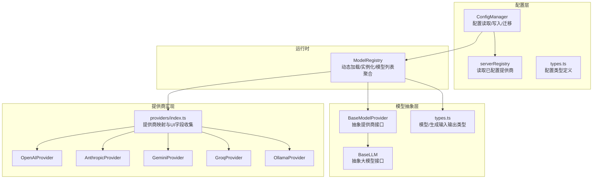
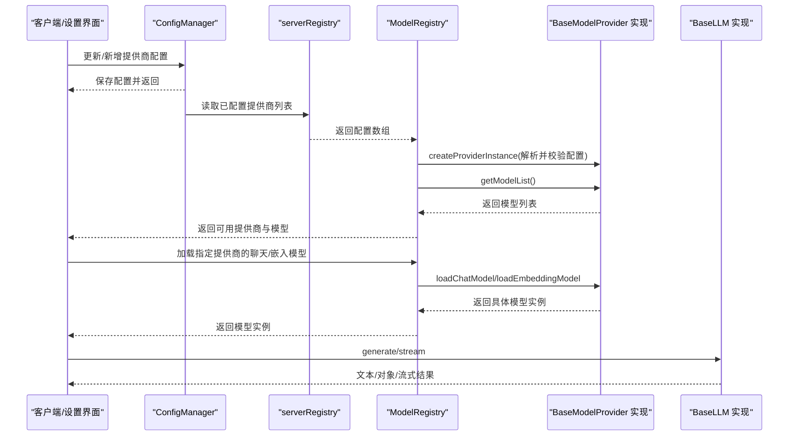
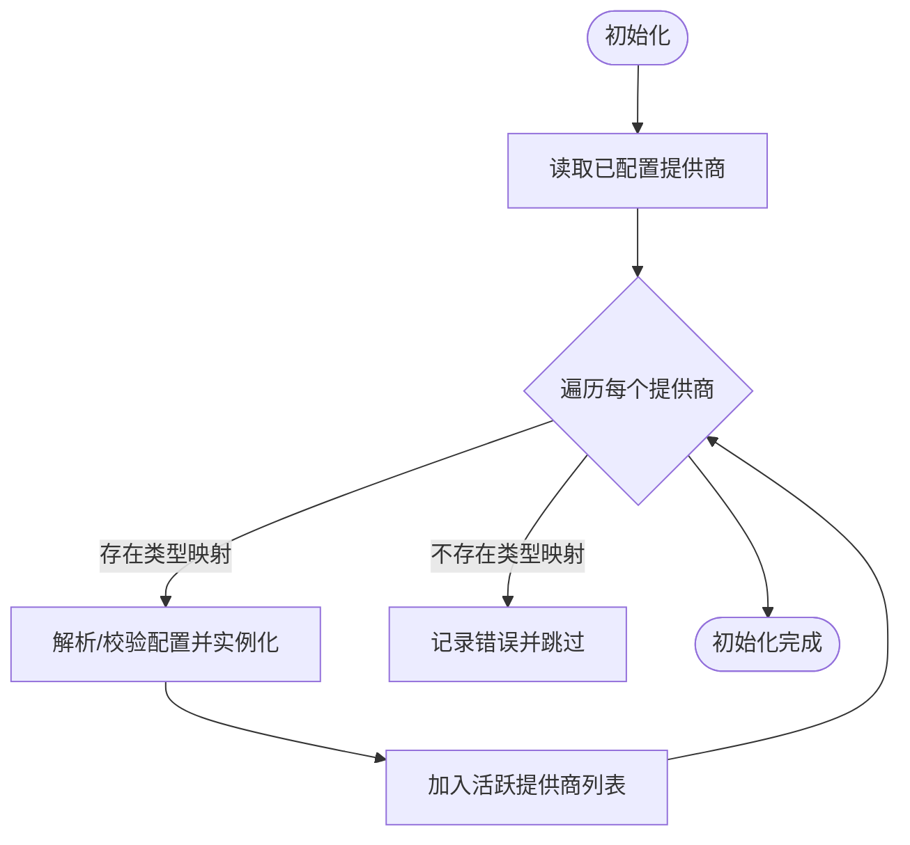
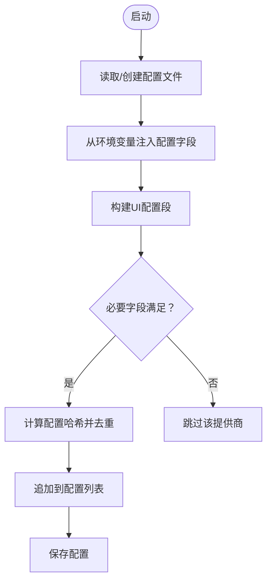
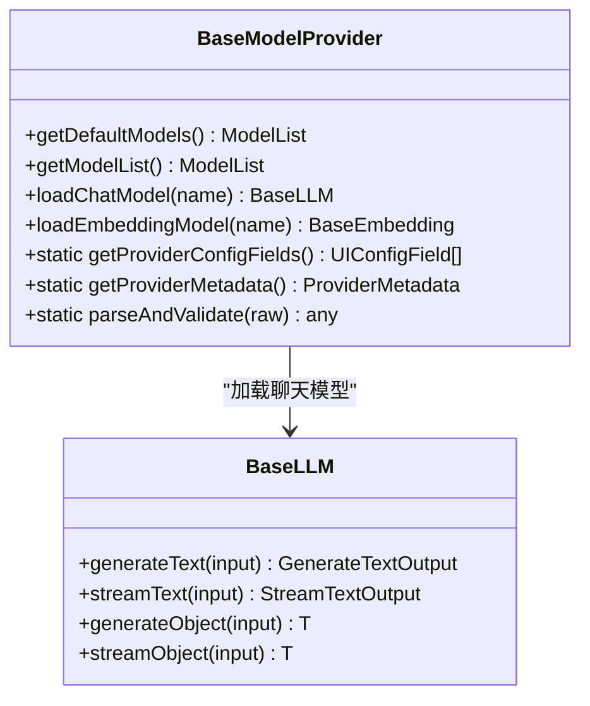
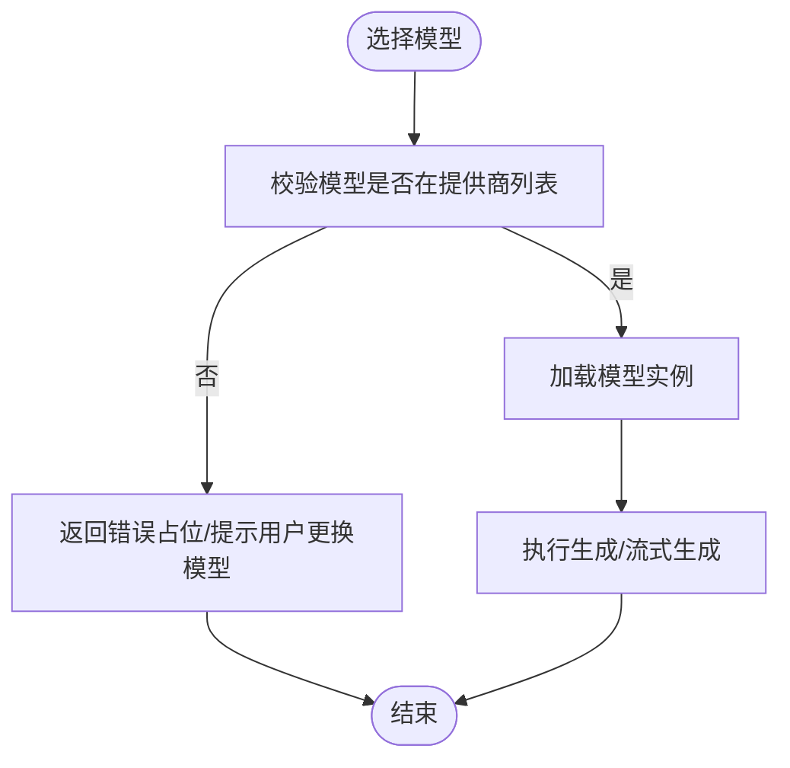
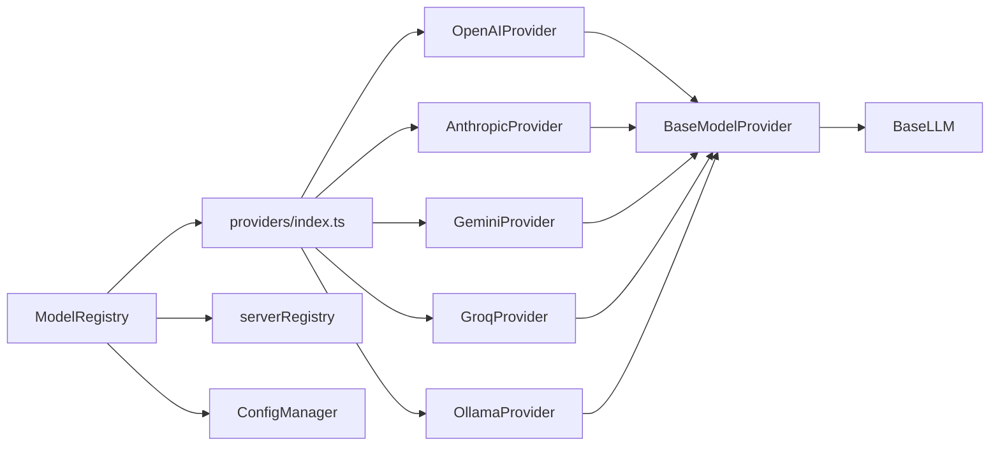
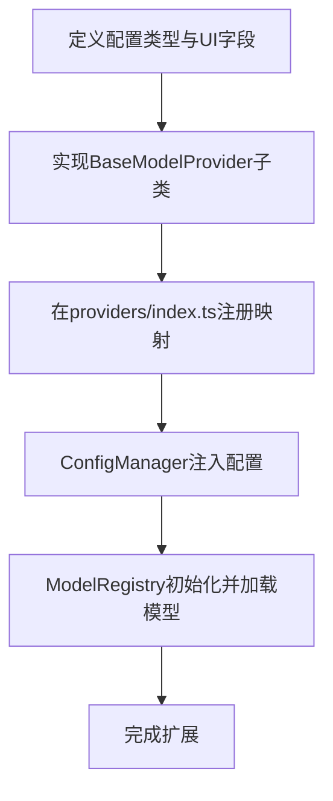

# 模型管理

<cite>
**本文引用的文件**
- [src/lib/models/registry.ts](file://src/lib/models/registry.ts)
- [src/lib/config/index.ts](file://src/lib/config/index.ts)
- [src/lib/config/serverRegistry.ts](file://src/lib/config/serverRegistry.ts)
- [src/lib/config/types.ts](file://src/lib/config/types.ts)
- [src/lib/models/types.ts](file://src/lib/models/types.ts)
- [src/lib/models/base/provider.ts](file://src/lib/models/base/provider.ts)
- [src/lib/models/base/llm.ts](file://src/lib/models/base/llm.ts)
- [src/lib/models/providers/index.ts](file://src/lib/models/providers/index.ts)
- [src/lib/models/providers/openai/index.ts](file://src/lib/models/providers/openai/index.ts)
- [src/lib/models/providers/anthropic/index.ts](file://src/lib/models/providers/anthropic/index.ts)
- [src/lib/models/providers/gemini/index.ts](file://src/lib/models/providers/gemini/index.ts)
- [src/lib/models/providers/groq/index.ts](file://src/lib/models/providers/groq/index.ts)
- [src/lib/models/providers/ollama/index.ts](file://src/lib/models/providers/ollama/index.ts)
</cite>

## 目录
1. [简介](#简介)
2. [项目结构](#项目结构)
3. [核心组件](#核心组件)
4. [架构总览](#架构总览)
5. [详细组件分析](#详细组件分析)
6. [依赖关系分析](#依赖关系分析)
7. [性能考虑](#性能考虑)
8. [故障排查指南](#故障排查指南)
9. [结论](#结论)
10. [附录：配置与扩展指南](#附录配置与扩展指南)

## 简介
本文件系统性阐述模型管理子系统的架构与实现，重点覆盖以下方面：
- 模型注册表的工作机制：动态加载、实例化、配置管理与运行时模型列表聚合
- 各模型提供商（OpenAI、Anthropic、Google Gemini、Groq、Ollama 等）的集成方式与差异点
- 配置验证机制、错误处理策略与资源管理方法
- 性能优化、资源池管理与并发控制建议
- 模型切换与回退策略
- 具体配置示例与扩展新提供商的步骤说明

## 项目结构
模型管理相关代码主要分布在以下模块：
- 注册表与运行时：src/lib/models/registry.ts
- 配置与持久化：src/lib/config/index.ts、src/lib/config/serverRegistry.ts、src/lib/config/types.ts
- 抽象基类：src/lib/models/base/provider.ts、src/lib/models/base/llm.ts
- 提供商集合与具体实现：src/lib/models/providers/index.ts、各提供商目录下的实现文件
- 类型定义：src/lib/models/types.ts

**图表来源**
- [src/lib/models/registry.ts](file://src/lib/models/registry.ts#L1-L222)
- [src/lib/config/index.ts](file://src/lib/config/index.ts#L1-L391)
- [src/lib/config/serverRegistry.ts](file://src/lib/config/serverRegistry.ts#L1-L16)
- [src/lib/models/base/provider.ts](file://src/lib/models/base/provider.ts#L1-L46)
- [src/lib/models/base/llm.ts](file://src/lib/models/base/llm.ts#L1-L23)
- [src/lib/models/providers/index.ts](file://src/lib/models/providers/index.ts#L1-L36)
- [src/lib/models/types.ts](file://src/lib/models/types.ts#L1-L104)

**章节来源**
- [src/lib/models/registry.ts](file://src/lib/models/registry.ts#L1-L222)
- [src/lib/config/index.ts](file://src/lib/config/index.ts#L1-L391)
- [src/lib/config/serverRegistry.ts](file://src/lib/config/serverRegistry.ts#L1-L16)
- [src/lib/models/base/provider.ts](file://src/lib/models/base/provider.ts#L1-L46)
- [src/lib/models/base/llm.ts](file://src/lib/models/base/llm.ts#L1-L23)
- [src/lib/models/providers/index.ts](file://src/lib/models/providers/index.ts#L1-L36)
- [src/lib/models/types.ts](file://src/lib/models/types.ts#L1-L104)

## 核心组件
- 模型注册表 ModelRegistry
  - 负责从配置中读取已启用的提供商，动态实例化提供商对象，并聚合每个提供商的模型列表
  - 提供按提供商与模型键加载聊天模型与嵌入模型的能力
  - 支持新增、更新、删除提供商以及增删自定义模型条目
- 配置管理 ConfigManager
  - 负责配置文件的初始化、读取、保存、迁移
  - 从环境变量与默认值推导提供商配置，自动注入可由环境驱动的提供商
  - 维护模型提供商列表、搜索配置等
- 抽象基类
  - BaseModelProvider：定义提供商必须实现的接口（默认/完整模型列表、加载聊天/嵌入模型、配置字段与元数据）
  - BaseLLM：统一文本/对象生成与流式接口
- 提供商映射与实现
  - providers/index.ts 将字符串类型映射到具体提供商类，并汇总 UI 配置字段与元信息
  - 各提供商（OpenAI、Anthropic、Gemini、Groq、Ollama）实现各自的配置校验、模型列表拉取与模型实例化逻辑

**章节来源**
- [src/lib/models/registry.ts](file://src/lib/models/registry.ts#L8-L222)
- [src/lib/config/index.ts](file://src/lib/config/index.ts#L7-L391)
- [src/lib/models/base/provider.ts](file://src/lib/models/base/provider.ts#L6-L46)
- [src/lib/models/base/llm.ts](file://src/lib/models/base/llm.ts#L10-L23)
- [src/lib/models/providers/index.ts](file://src/lib/models/providers/index.ts#L12-L36)

## 架构总览
下图展示了“配置 → 注册表 → 抽象层 → 具体提供商”的调用链路与职责边界。

**图表来源**
- [src/lib/config/index.ts](file://src/lib/config/index.ts#L274-L317)
- [src/lib/config/serverRegistry.ts](file://src/lib/config/serverRegistry.ts#L4-L12)
- [src/lib/models/registry.ts](file://src/lib/models/registry.ts#L17-L92)
- [src/lib/models/base/provider.ts](file://src/lib/models/base/provider.ts#L35-L43)
- [src/lib/models/base/llm.ts](file://src/lib/models/base/llm.ts#L10-L20)

## 详细组件分析

### 模型注册表 ModelRegistry
- 初始化流程
  - 从配置中读取所有已配置提供商
  - 基于提供商类型映射找到对应类，使用工厂函数解析并校验原始配置后实例化
  - 对初始化失败的情况进行日志记录与容错
- 运行时能力
  - 并发获取所有提供商的模型列表，聚合为最小化提供商视图
  - 按提供商 ID 与模型键加载聊天/嵌入模型实例
  - 动态增删改提供商及模型条目，同时刷新内存中的活跃提供商列表
- 错误处理
  - 获取模型列表失败时，以错误占位模型返回，避免中断整体可用性
  - 加载模型时若模型键不在允许列表内，抛出明确错误

**图表来源**
- [src/lib/models/registry.ts](file://src/lib/models/registry.ts#L17-L35)

**章节来源**
- [src/lib/models/registry.ts](file://src/lib/models/registry.ts#L8-L222)

### 配置管理 ConfigManager
- 文件与环境
  - 默认配置路径位于数据目录下的 config.json；首次启动会生成默认配置
  - 支持从环境变量注入配置项，自动填充 UI 字段的默认值
- 自动注入提供商
  - 通过读取所有提供商的 UI 配置字段，检查必要字段是否满足，满足则生成带哈希的提供商条目并去重
- 配置变更
  - 新增/更新/删除提供商，以及增删自定义模型条目，均持久化到配置文件
- 读取与更新
  - 支持点语法读取深层配置，支持在服务端或客户端作用域内更新

**图表来源**
- [src/lib/config/index.ts](file://src/lib/config/index.ts#L135-L238)

**章节来源**
- [src/lib/config/index.ts](file://src/lib/config/index.ts#L7-L391)
- [src/lib/config/serverRegistry.ts](file://src/lib/config/serverRegistry.ts#L1-L16)
- [src/lib/config/types.ts](file://src/lib/config/types.ts#L53-L76)

### 抽象基类 BaseModelProvider 与 BaseLLM
- BaseModelProvider
  - 必须实现：getDefaultModels、getModelList、loadChatModel、loadEmbeddingModel
  - 可选实现：getProviderConfigFields、getProviderMetadata、parseAndValidate
  - 工厂方法 createProviderInstance 负责调用 parseAndValidate 并构造实例
- BaseLLM
  - 统一文本生成与流式生成接口，以及对象生成与流式对象生成接口
  - 为具体提供商的模型实现提供一致的调用契约

**图表来源**
- [src/lib/models/base/provider.ts](file://src/lib/models/base/provider.ts#L6-L46)
- [src/lib/models/base/llm.ts](file://src/lib/models/base/llm.ts#L10-L20)

**章节来源**
- [src/lib/models/base/provider.ts](file://src/lib/models/base/provider.ts#L1-L46)
- [src/lib/models/base/llm.ts](file://src/lib/models/base/llm.ts#L1-L23)

### 各提供商实现要点

#### OpenAI
- 配置字段：API Key、Base URL
- 默认模型列表：根据 base URL 是否为官方地址决定返回内置模型
- 模型加载：校验模型键是否在聚合后的模型列表中，再实例化对应的聊天/嵌入模型
- 配置校验：要求提供 API Key 与 Base URL

**章节来源**
- [src/lib/models/providers/openai/index.ts](file://src/lib/models/providers/openai/index.ts#L10-L227)

#### Anthropic
- 配置字段：API Key
- 默认模型列表：通过官方模型接口拉取，仅返回聊天模型
- 模型加载：校验模型键后实例化聊天模型；不支持嵌入
- 配置校验：要求提供 API Key

**章节来源**
- [src/lib/models/providers/anthropic/index.ts](file://src/lib/models/providers/anthropic/index.ts#L9-L116)

#### Google Gemini
- 配置字段：API Key
- 默认模型列表：根据 generationMethods 区分聊天与嵌入模型
- 模型加载：分别校验聊天/嵌入模型键后实例化
- 配置校验：要求提供 API Key

**章节来源**
- [src/lib/models/providers/gemini/index.ts](file://src/lib/models/providers/gemini/index.ts#L10-L145)

#### Groq
- 配置字段：API Key
- 默认模型列表：通过官方 OpenAI 兼容接口拉取聊天模型
- 模型加载：校验模型键后实例化聊天模型；不支持嵌入
- 配置校验：要求提供 API Key

**章节来源**
- [src/lib/models/providers/groq/index.ts](file://src/lib/models/providers/groq/index.ts#L9-L114)

#### Ollama
- 配置字段：Base URL
- 默认模型列表：通过本地 Ollama API 拉取标签作为聊天与嵌入模型
- 模型加载：校验模型键后实例化聊天/嵌入模型
- 配置校验：要求提供 Base URL；对连接异常进行明确错误提示

**章节来源**
- [src/lib/models/providers/ollama/index.ts](file://src/lib/models/providers/ollama/index.ts#L10-L137)

### 模型切换与回退策略
- 切换机制
  - 通过 ModelRegistry 的按提供商与模型键加载接口实现即时切换
  - 切换前先校验目标模型键是否在当前提供商的模型列表中
- 回退策略
  - 当获取模型列表失败时，注册表会返回一个带有错误占位的聊天模型，保证 UI 可用但明确标示错误
  - 对于加载模型失败的情况，抛出明确错误，便于上层捕获并提示用户选择其他模型

**图表来源**
- [src/lib/models/registry.ts](file://src/lib/models/registry.ts#L37-L92)

**章节来源**
- [src/lib/models/registry.ts](file://src/lib/models/registry.ts#L37-L92)

## 依赖关系分析
- 组件耦合
  - ModelRegistry 依赖 providers 映射、ConfigManager 与 BaseModelProvider 抽象
  - 各提供商实现依赖 BaseModelProvider 抽象与 BaseLLM 抽象
  - ConfigManager 与 serverRegistry 协作提供配置读取与注入
- 外部依赖
  - 各云厂商/本地服务的 HTTP 接口用于拉取模型列表
  - 本地文件系统用于持久化配置

**图表来源**
- [src/lib/models/registry.ts](file://src/lib/models/registry.ts#L1-L222)
- [src/lib/models/providers/index.ts](file://src/lib/models/providers/index.ts#L12-L36)
- [src/lib/config/serverRegistry.ts](file://src/lib/config/serverRegistry.ts#L1-L16)
- [src/lib/config/index.ts](file://src/lib/config/index.ts#L1-L391)
- [src/lib/models/base/provider.ts](file://src/lib/models/base/provider.ts#L1-L46)
- [src/lib/models/base/llm.ts](file://src/lib/models/base/llm.ts#L1-L23)

**章节来源**
- [src/lib/models/registry.ts](file://src/lib/models/registry.ts#L1-L222)
- [src/lib/models/providers/index.ts](file://src/lib/models/providers/index.ts#L1-L36)
- [src/lib/config/serverRegistry.ts](file://src/lib/config/serverRegistry.ts#L1-L16)
- [src/lib/config/index.ts](file://src/lib/config/index.ts#L1-L391)
- [src/lib/models/base/provider.ts](file://src/lib/models/base/provider.ts#L1-L46)
- [src/lib/models/base/llm.ts](file://src/lib/models/base/llm.ts#L1-L23)

## 性能考虑
- 并发模型列表拉取
  - 注册表在聚合模型列表时使用并发 Promise，显著降低等待时间
- 配置哈希去重
  - 自动注入提供商时计算配置哈希，避免重复注入相同配置
- 流式生成
  - BaseLLM 定义了流式接口，便于在前端实时渲染响应片段，提升交互体验
- 资源管理建议
  - 对外部 HTTP 请求增加超时与重试策略
  - 对本地 Ollama 等服务增加健康检查与降级提示
  - 在高并发场景下，建议引入连接池与限流策略，避免外部服务过载

[本节为通用建议，无需特定文件来源]

## 故障排查指南
- 初始化提供商失败
  - 现象：控制台打印初始化错误日志
  - 排查：确认提供商类型映射是否存在、配置字段是否正确
- 获取模型列表失败
  - 现象：返回错误占位模型，UI 中显示错误信息
  - 排查：检查网络连通性、API Key 权限、Base URL 正确性
- 加载模型失败
  - 现象：抛出“无效模型键”错误
  - 排查：确认所选模型键存在于当前提供商的模型列表中
- 配置文件损坏
  - 现象：解析配置时报错并回退到默认配置
  - 排查：修复 JSON 格式或删除配置文件让系统重新生成

**章节来源**
- [src/lib/models/registry.ts](file://src/lib/models/registry.ts#L29-L33)
- [src/lib/models/registry.ts](file://src/lib/models/registry.ts#L44-L60)
- [src/lib/models/registry.ts](file://src/lib/models/registry.ts#L77-L78)
- [src/lib/config/index.ts](file://src/lib/config/index.ts#L143-L167)

## 结论
该模型管理系统通过“配置驱动 + 抽象提供商 + 工厂实例化 + 并发聚合”的设计，实现了对多家云服务与本地推理引擎的一致接入。其优势在于：
- 强大的可扩展性：新增提供商只需实现抽象接口并注册映射
- 良好的容错与可观测性：失败时有明确日志与占位返回
- 与 UI 的无缝衔接：通过 UI 配置字段与环境变量驱动配置注入

## 附录：配置与扩展指南

### 配置示例（基于现有提供商）
- OpenAI
  - 字段：apiKey、baseURL
  - 示例用途：接入官方或兼容 OpenAI 协议的服务
- Anthropic
  - 字段：apiKey
  - 示例用途：Claude 系列模型
- Google Gemini
  - 字段：apiKey
  - 示例用途：多模态与嵌入模型
- Groq
  - 字段：apiKey
  - 示例用途：高性能推理
- Ollama
  - 字段：baseURL
  - 示例用途：本地大模型推理

**章节来源**
- [src/lib/models/providers/openai/index.ts](file://src/lib/models/providers/openai/index.ts#L109-L131)
- [src/lib/models/providers/anthropic/index.ts](file://src/lib/models/providers/anthropic/index.ts#L13-L24)
- [src/lib/models/providers/gemini/index.ts](file://src/lib/models/providers/gemini/index.ts#L14-L25)
- [src/lib/models/providers/groq/index.ts](file://src/lib/models/providers/groq/index.ts#L13-L24)
- [src/lib/models/providers/ollama/index.ts](file://src/lib/models/providers/ollama/index.ts#L14-L27)

### 扩展新提供商步骤
- 定义配置类型与 UI 字段
  - 在新目录下定义配置接口与 UI 配置字段数组
- 实现 BaseModelProvider 子类
  - 实现 getDefaultModels、getModelList、loadChatModel、loadEmbeddingModel
  - 实现 parseAndValidate、getProviderConfigFields、getProviderMetadata
- 注册提供商映射
  - 在 providers/index.ts 中添加映射与导出
- 集成到 UI 配置
  - 通过静态方法自动收集 UI 字段与元信息
- 验证与测试
  - 使用 ConfigManager 注入配置，通过 ModelRegistry 初始化并加载模型

**图表来源**
- [src/lib/models/providers/index.ts](file://src/lib/models/providers/index.ts#L12-L36)
- [src/lib/models/base/provider.ts](file://src/lib/models/base/provider.ts#L16-L25)
- [src/lib/config/index.ts](file://src/lib/config/index.ts#L175-L238)