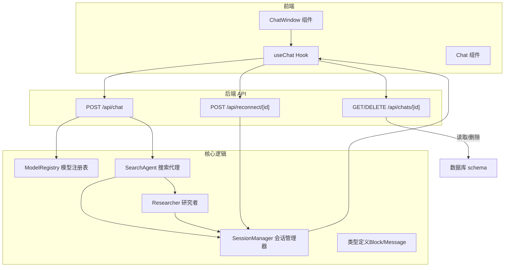
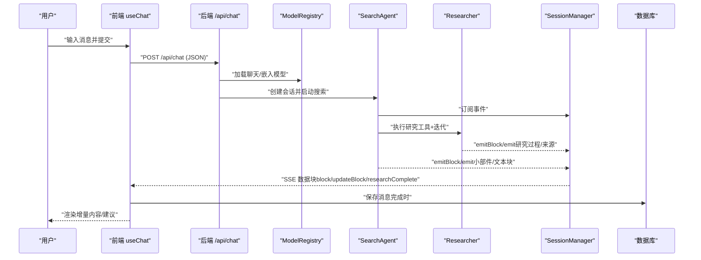
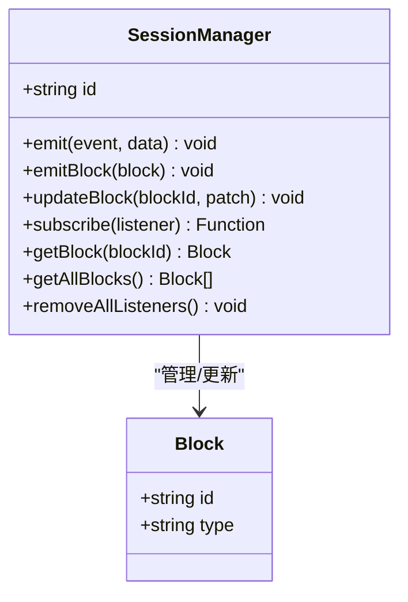
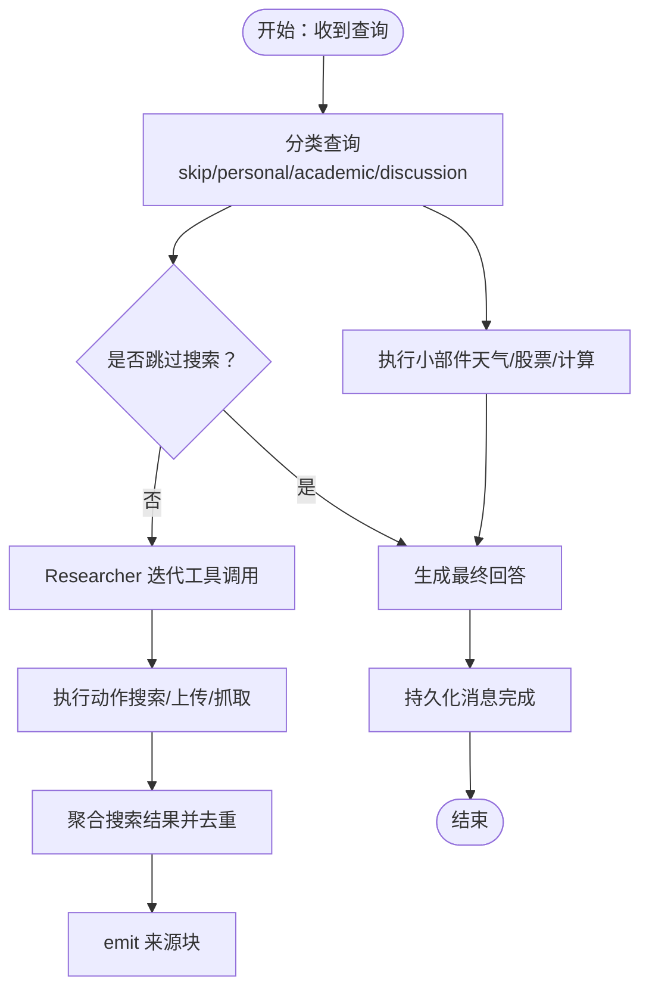
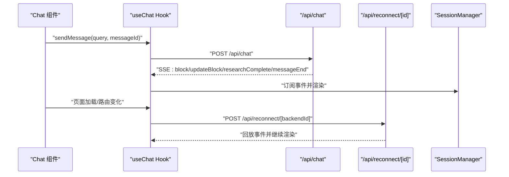
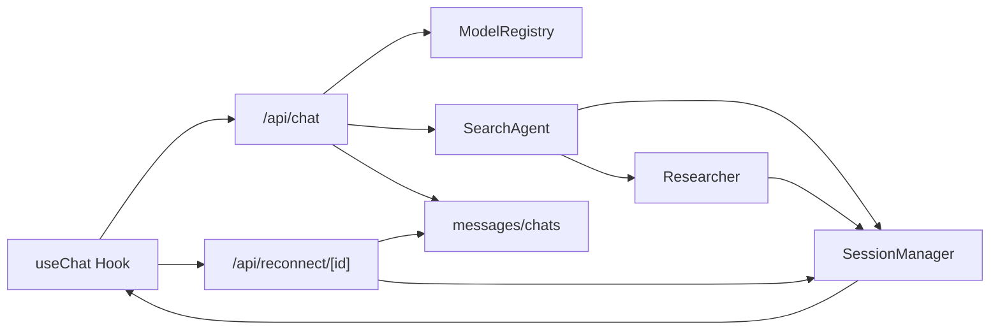

# 聊天系统

<cite>
**本文引用的文件**
- [src/app/api/chat/route.ts](file://src/app/api/chat/route.ts)
- [src/lib/hooks/useChat.tsx](file://src/lib/hooks/useChat.tsx)
- [src/lib/session.ts](file://src/lib/session.ts)
- [src/lib/types.ts](file://src/lib/types.ts)
- [src/lib/agents/search/index.ts](file://src/lib/agents/search/index.ts)
- [src/lib/agents/search/researcher/index.ts](file://src/lib/agents/search/researcher/index.ts)
- [src/lib/agents/search/classifier.ts](file://src/lib/agents/search/classifier.ts)
- [src/lib/agents/search/widgets/index.ts](file://src/lib/agents/search/widgets/index.ts)
- [src/app/api/reconnect/[id]/route.ts](file://src/app/api/reconnect/[id]/route.ts)
- [src/lib/models/registry.ts](file://src/lib/models/registry.ts)
- [src/components/Chat.tsx](file://src/components/Chat.tsx)
- [src/components/ChatWindow.tsx](file://src/components/ChatWindow.tsx)
- [src/lib/db/schema.ts](file://src/lib/db/schema.ts)
- [src/app/api/chats/[id]/route.ts](file://src/app/api/chats/[id]/route.ts)
- [src/lib/actions.ts](file://src/lib/actions.ts)
</cite>

## 目录
1. [简介](#简介)
2. [项目结构](#项目结构)
3. [核心组件](#核心组件)
4. [架构总览](#架构总览)
5. [详细组件分析](#详细组件分析)
6. [依赖关系分析](#依赖关系分析)
7. [性能考虑](#性能考虑)
8. [故障排除指南](#故障排除指南)
9. [结论](#结论)
10. [附录：API 规范与使用示例](#附录api-规范与使用示例)

## 简介
本文件面向开发者与产品团队，系统性阐述该聊天系统的实现机制与工程实践，重点覆盖以下方面：
- 实时聊天的流式响应处理（SSE）、消息与块（Block）模型、事件驱动的会话管理
- 会话管理器（SessionManager）的事件订阅、状态同步与生命周期管理
- 聊天 API 的请求/响应模式、消息格式规范与错误处理
- 搜索代理（SearchAgent）与研究管线（Researcher）的执行流程
- 前端集成示例与最佳实践
- 性能优化策略与故障排除指南

## 项目结构
该聊天系统采用前后端分离的 Next.js 应用结构，后端以 App Router 的路由作为 API 入口，前端通过自定义 Hook 管理聊天上下文与实时流。

图表来源
- [src/components/ChatWindow.tsx](file://src/components/ChatWindow.tsx#L36-L77)
- [src/lib/hooks/useChat.tsx](file://src/lib/hooks/useChat.tsx#L270-L525)
- [src/app/api/chat/route.ts](file://src/app/api/chat/route.ts#L103-L255)
- [src/app/api/reconnect/[id]/route.ts](file://src/app/api/reconnect/[id]/route.ts#L3-L94)
- [src/app/api/chats/[id]/route.ts](file://src/app/api/chats/[id]/route.ts#L5-L70)
- [src/lib/models/registry.ts](file://src/lib/models/registry.ts#L8-L222)
- [src/lib/agents/search/index.ts](file://src/lib/agents/search/index.ts#L12-L187)
- [src/lib/agents/search/researcher/index.ts](file://src/lib/agents/search/researcher/index.ts#L9-L223)
- [src/lib/session.ts](file://src/lib/session.ts#L11-L106)
- [src/lib/types.ts](file://src/lib/types.ts#L28-L124)
- [src/lib/db/schema.ts](file://src/lib/db/schema.ts#L6-L39)

章节来源
- [src/components/ChatWindow.tsx](file://src/components/ChatWindow.tsx#L36-L77)
- [src/lib/hooks/useChat.tsx](file://src/lib/hooks/useChat.tsx#L270-L525)
- [src/app/api/chat/route.ts](file://src/app/api/chat/route.ts#L103-L255)
- [src/app/api/reconnect/[id]/route.ts](file://src/app/api/reconnect/[id]/route.ts#L3-L94)
- [src/app/api/chats/[id]/route.ts](file://src/app/api/chats/[id]/route.ts#L5-L70)
- [src/lib/models/registry.ts](file://src/lib/models/registry.ts#L8-L222)
- [src/lib/agents/search/index.ts](file://src/lib/agents/search/index.ts#L12-L187)
- [src/lib/agents/search/researcher/index.ts](file://src/lib/agents/search/researcher/index.ts#L9-L223)
- [src/lib/session.ts](file://src/lib/session.ts#L11-L106)
- [src/lib/types.ts](file://src/lib/types.ts#L28-L124)
- [src/lib/db/schema.ts](file://src/lib/db/schema.ts#L6-L39)

## 核心组件
- 会话管理器（SessionManager）
  - 作用：维护单次聊天会话的块（Block）集合、事件队列与订阅者；支持增量更新（RFC6902 补丁）与 TTL 清理。
  - 关键能力：emit/subscribe、emitBlock/updateBlock、getAllBlocks、TTL 自清理。
- 搜索代理（SearchAgent）
  - 作用：协调分类、小部件执行、搜索研究与最终回答生成，并将中间结果以块形式写入会话。
- 研究者（Researcher）
  - 作用：基于 LLM 工具调用进行多轮推理与行动，产出搜索结果与去重后的引用块。
- 前端 Hook（useChat）
  - 作用：封装 SSE 流解析、消息与分段渲染、断线重连、建议生成等前端交互逻辑。
- 类型系统（Block/Message）
  - 作用：统一文本、来源、建议、小部件、研究过程等块类型，支撑增量渲染与补丁更新。

章节来源
- [src/lib/session.ts](file://src/lib/session.ts#L11-L106)
- [src/lib/agents/search/index.ts](file://src/lib/agents/search/index.ts#L12-L187)
- [src/lib/agents/search/researcher/index.ts](file://src/lib/agents/search/researcher/index.ts#L9-L223)
- [src/lib/hooks/useChat.tsx](file://src/lib/hooks/useChat.tsx#L550-L800)
- [src/lib/types.ts](file://src/lib/types.ts#L28-L124)

## 架构总览
下图展示了从用户发送消息到前端接收流式数据的完整链路，以及断线重连路径。

图表来源
- [src/lib/hooks/useChat.tsx](file://src/lib/hooks/useChat.tsx#L714-L800)
- [src/app/api/chat/route.ts](file://src/app/api/chat/route.ts#L103-L255)
- [src/lib/models/registry.ts](file://src/lib/models/registry.ts#L74-L92)
- [src/lib/agents/search/index.ts](file://src/lib/agents/search/index.ts#L12-L187)
- [src/lib/agents/search/researcher/index.ts](file://src/lib/agents/search/researcher/index.ts#L9-L223)
- [src/lib/session.ts](file://src/lib/session.ts#L45-L102)
- [src/lib/db/schema.ts](file://src/lib/db/schema.ts#L6-L39)

## 详细组件分析

### 会话管理器（SessionManager）
- 设计要点
  - 使用 EventEmitter 分发事件，内部维护事件历史与块映射，支持订阅回放。
  - 通过 RFC6902 补丁实现块的增量更新，避免全量替换。
  - 会话具备 TTL 自清理，防止内存泄漏。
- 关键方法
  - emit/emitBlock/updateBlock：产生事件与块变更
  - subscribe：注册监听器并回放历史事件
  - removeAllListeners：清理监听器
  - getBlock/getAllBlocks：查询块状态
- 复杂度与性能
  - 块增删查改为 O(1)，补丁更新为 O(k)（k 为补丁条目数）
  - 事件队列为 FIFO，回放成本与历史长度线性相关

图表来源
- [src/lib/session.ts](file://src/lib/session.ts#L11-L106)
- [src/lib/types.ts](file://src/lib/types.ts#L118-L124)

章节来源
- [src/lib/session.ts](file://src/lib/session.ts#L11-L106)
- [src/lib/types.ts](file://src/lib/types.ts#L118-L124)

### 搜索代理（SearchAgent）与研究者（Researcher）
- SearchAgent
  - 初始化/清理消息记录，分类查询，执行小部件，按需触发研究，最后汇总生成回答并持久化。
  - 将研究过程与来源以块形式写入会话，最终发出“研究完成”事件。
- Researcher
  - 基于 LLM 工具调用进行多轮推理，动态记录“思考”步骤，执行动作并收集结果。
  - 对搜索结果去重合并，输出引用块。

图表来源
- [src/lib/agents/search/index.ts](file://src/lib/agents/search/index.ts#L12-L187)
- [src/lib/agents/search/researcher/index.ts](file://src/lib/agents/search/researcher/index.ts#L9-L223)
- [src/lib/agents/search/classifier.ts](file://src/lib/agents/search/classifier.ts#L37-L53)
- [src/lib/agents/search/widgets/index.ts](file://src/lib/agents/search/widgets/index.ts#L1-L11)

章节来源
- [src/lib/agents/search/index.ts](file://src/lib/agents/search/index.ts#L12-L187)
- [src/lib/agents/search/researcher/index.ts](file://src/lib/agents/search/researcher/index.ts#L9-L223)
- [src/lib/agents/search/classifier.ts](file://src/lib/agents/search/classifier.ts#L37-L53)
- [src/lib/agents/search/widgets/index.ts](file://src/lib/agents/search/widgets/index.ts#L1-L11)

### 前端 Hook（useChat）与组件（Chat/ChatWindow）
- useChat
  - 配置检查：从本地存储与后端提供者列表中选择默认模型与嵌入模型。
  - 发送消息：构造请求体（含历史、文件、来源、优化模式），发起 SSE 流读取与增量渲染。
  - 断线重连：向 /api/reconnect/[id] 订阅会话事件，恢复未完成的消息。
  - 建议生成：在有来源但无建议时，调用后端建议接口生成建议块。
- Chat/ChatWindow
  - ChatWindow 根据就绪状态渲染 Chat 或空态/错误页。
  - Chat 负责滚动、布局与输入框固定定位。

图表来源
- [src/lib/hooks/useChat.tsx](file://src/lib/hooks/useChat.tsx#L714-L800)
- [src/app/api/chat/route.ts](file://src/app/api/chat/route.ts#L159-L211)
- [src/app/api/reconnect/[id]/route.ts](file://src/app/api/reconnect/[id]/route.ts#L20-L72)
- [src/components/Chat.tsx](file://src/components/Chat.tsx#L9-L109)
- [src/components/ChatWindow.tsx](file://src/components/ChatWindow.tsx#L36-L77)

章节来源
- [src/lib/hooks/useChat.tsx](file://src/lib/hooks/useChat.tsx#L550-L800)
- [src/components/Chat.tsx](file://src/components/Chat.tsx#L9-L109)
- [src/components/ChatWindow.tsx](file://src/components/ChatWindow.tsx#L36-L77)

### 聊天 API 请求/响应模式与消息格式
- 请求体（POST /api/chat）
  - 字段概览：message、history、files、sources、optimizationMode、chatModel、embeddingModel、systemInstructions
  - 校验：Zod Schema 校验请求体，非法参数返回 400
  - 并发：并行加载聊天/嵌入模型
  - 会话：创建 SessionManager，订阅事件并通过 TransformStream 输出 SSE
- 响应（SSE）
  - 事件类型：
    - block：新增块（如文本、来源、研究过程、小部件）
    - updateBlock：对已有块进行补丁更新
    - researchComplete：研究阶段完成
    - messageEnd：消息生成完成
    - error：异常事件
  - 客户端逐行解析 JSON，按类型更新 UI
- 错误处理
  - 参数校验失败：400
  - 运行时异常：500
  - 中止请求：关闭 writer、移除监听器

章节来源
- [src/app/api/chat/route.ts](file://src/app/api/chat/route.ts#L16-L69)
- [src/app/api/chat/route.ts](file://src/app/api/chat/route.ts#L103-L255)
- [src/app/api/reconnect/[id]/route.ts](file://src/app/api/reconnect/[id]/route.ts#L3-L94)

### 会话管理器工作原理（事件订阅/状态同步/生命周期）
- 事件订阅
  - subscribe 返回解绑函数，自动回放历史事件
  - 支持 data/end/error 三类事件
- 状态同步
  - emitBlock：新增块并缓存
  - updateBlock：应用补丁并广播更新
  - getAllBlocks：持久化前一次性读取
- 生命周期
  - 创建时分配 UUID
  - TTL 到期自动清理
  - 显式 removeAllListeners 与断开连接

章节来源
- [src/lib/session.ts](file://src/lib/session.ts#L45-L102)

### 数据模型（Block/Message）
- Block 类型
  - 文本、来源、建议、小部件、研究过程等
- Message 结构
  - 包含查询、响应块数组、状态（answering/completed/error）、后端会话标识等
- 数据库 schema
  - messages：记录每条消息的块与状态
  - chats：记录会话基本信息（标题、来源、文件）

章节来源
- [src/lib/types.ts](file://src/lib/types.ts#L28-L124)
- [src/lib/db/schema.ts](file://src/lib/db/schema.ts#L6-L39)

## 依赖关系分析
- 组件耦合
  - useChat 依赖后端 API 与本地存储；与 Chat/ChatWindow 弱耦合
  - SearchAgent 依赖 SessionManager 与 Researcher；与模型注册表解耦
  - SessionManager 仅依赖 EventEmitter 与补丁库，内聚性强
- 外部依赖
  - 模型提供者（OpenAI、Gemini、Anthropic 等）通过 ModelRegistry 注册与加载
  - 数据库存储消息与会话信息
- 循环依赖
  - 未发现直接循环依赖；事件通过回调链路传递，避免强耦合

图表来源
- [src/lib/hooks/useChat.tsx](file://src/lib/hooks/useChat.tsx#L714-L800)
- [src/app/api/chat/route.ts](file://src/app/api/chat/route.ts#L103-L255)
- [src/app/api/reconnect/[id]/route.ts](file://src/app/api/reconnect/[id]/route.ts#L3-L94)
- [src/lib/models/registry.ts](file://src/lib/models/registry.ts#L74-L92)
- [src/lib/agents/search/index.ts](file://src/lib/agents/search/index.ts#L12-L187)
- [src/lib/agents/search/researcher/index.ts](file://src/lib/agents/search/researcher/index.ts#L9-L223)
- [src/lib/session.ts](file://src/lib/session.ts#L11-L106)
- [src/lib/db/schema.ts](file://src/lib/db/schema.ts#L6-L39)

章节来源
- [src/lib/hooks/useChat.tsx](file://src/lib/hooks/useChat.tsx#L714-L800)
- [src/app/api/chat/route.ts](file://src/app/api/chat/route.ts#L103-L255)
- [src/app/api/reconnect/[id]/route.ts](file://src/app/api/reconnect/[id]/route.ts#L3-L94)
- [src/lib/models/registry.ts](file://src/lib/models/registry.ts#L74-L92)
- [src/lib/agents/search/index.ts](file://src/lib/agents/search/index.ts#L12-L187)
- [src/lib/agents/search/researcher/index.ts](file://src/lib/agents/search/researcher/index.ts#L9-L223)
- [src/lib/session.ts](file://src/lib/session.ts#L11-L106)
- [src/lib/db/schema.ts](file://src/lib/db/schema.ts#L6-L39)

## 性能考虑
- 并发处理
  - 模型加载并行化，减少冷启动延迟
  - 前后端均采用 Promise.all 并行执行任务
- 内存管理
  - SessionManager 使用 Map 存储块，TTL 自动清理，避免长期会话占用内存
  - 前端使用补丁更新块，避免重复渲染大对象
- 资源清理
  - SSE 读取循环中对中断信号进行监听，及时关闭 writer 与移除监听器
  - useChat 在断线重连时复用订阅，避免重复创建
- I/O 优化
  - 仅在消息完成时持久化，减少数据库写入次数
  - 去重搜索结果，降低后续处理与渲染成本

[本节为通用性能讨论，不直接分析具体文件]

## 故障排除指南
- 常见问题与定位
  - 无法连接服务器：检查 /api/providers 与 /api/chat 是否可达；查看控制台错误提示
  - 无响应或卡住：确认 SSE 流是否正常，是否存在未处理的 JSON 片段
  - 断线后无恢复：确认 /api/reconnect/[id] 是否返回 SSE；检查 backendId 是否正确
  - 模型配置缺失：确保本地存储存在模型键值，或后端提供者列表非空
- 排查步骤
  - 打开浏览器网络面板，观察 /api/chat 与 /api/reconnect/[id] 的 SSE 响应
  - 查看控制台日志，定位错误事件（error）与 messageEnd
  - 检查数据库 messages 表状态是否为 completed
- 建议
  - 前端对 JSON 解析异常进行容错（部分片段等待下一块）
  - 后端对模型加载失败进行降级提示（已在注册表中体现）

章节来源
- [src/lib/hooks/useChat.tsx](file://src/lib/hooks/useChat.tsx#L554-L565)
- [src/app/api/chat/route.ts](file://src/app/api/chat/route.ts#L247-L253)
- [src/app/api/reconnect/[id]/route.ts](file://src/app/api/reconnect/[id]/route.ts#L86-L92)

## 结论
该聊天系统通过事件驱动的会话管理与流式响应机制，实现了高并发、可扩展且用户体验友好的实时对话。前端 Hook 将复杂的状态与流处理抽象为简洁的 API，后端以模块化组件串联起模型加载、搜索研究与增量渲染。配合断线重连、补丁更新与 TTL 清理，系统在性能与稳定性上具备良好表现。建议在生产环境中进一步完善可观测性与限流策略，并持续优化模型加载与搜索去重算法。

[本节为总结性内容，不直接分析具体文件]

## 附录：API 规范与使用示例

### API 定义
- POST /api/chat
  - 请求头：Content-Type: application/json
  - 请求体字段：
    - message: { messageId, chatId, content }
    - history: [[role, content], ...]
    - files: string[]
    - sources: string[]
    - optimizationMode: "speed" | "balanced" | "quality"
    - chatModel: { providerId, key }
    - embeddingModel: { providerId, key }
    - systemInstructions: string?
  - 响应：SSE 流，事件类型包括 block、updateBlock、researchComplete、messageEnd、error
- POST /api/reconnect/[id]
  - 功能：断线重连，回放会话事件
  - 响应：SSE 流，行为同上
- GET /api/chats/[id]
  - 功能：获取会话与消息
  - 响应：{ chat, messages }

章节来源
- [src/app/api/chat/route.ts](file://src/app/api/chat/route.ts#L103-L255)
- [src/app/api/reconnect/[id]/route.ts](file://src/app/api/reconnect/[id]/route.ts#L3-L94)
- [src/app/api/chats/[id]/route.ts](file://src/app/api/chats/[id]/route.ts#L5-L70)

### 前端集成示例（概念性说明）
- 步骤
  - 在页面中引入 ChatWindow 组件
  - 通过 useChat 获取 messages、sections、loading 等状态
  - 调用 sendMessage 发送消息，自动处理 SSE 与断线重连
  - 可选：在消息完成后触发建议生成与媒体搜索
- 最佳实践
  - 保持 history 与 messages 的一致性，避免重复渲染
  - 对 SSE JSON 片段进行容错解析
  - 使用本地存储持久化模型配置，减少每次初始化开销

章节来源
- [src/components/ChatWindow.tsx](file://src/components/ChatWindow.tsx#L36-L77)
- [src/lib/hooks/useChat.tsx](file://src/lib/hooks/useChat.tsx#L714-L800)
- [src/lib/actions.ts](file://src/lib/actions.ts#L1-L23)