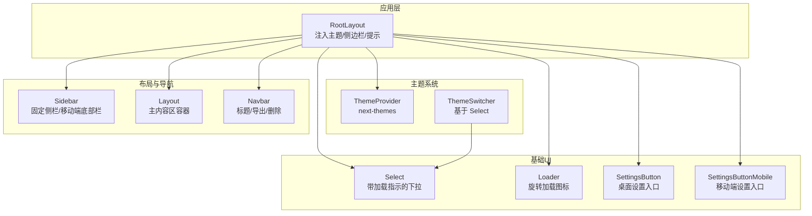
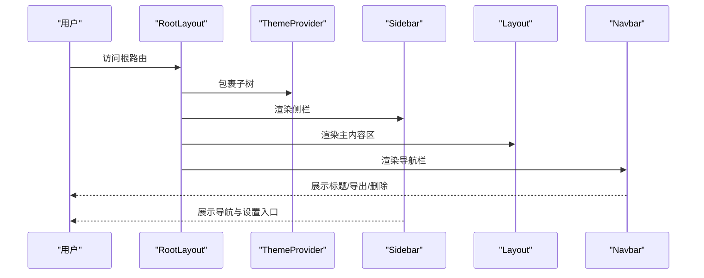
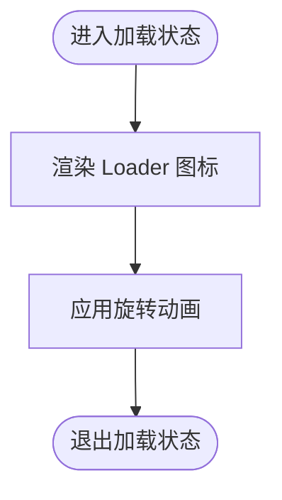
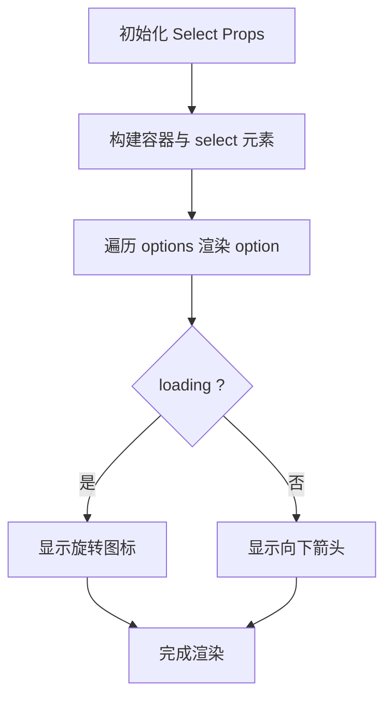
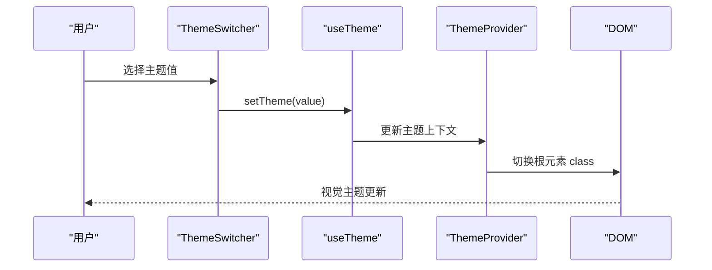
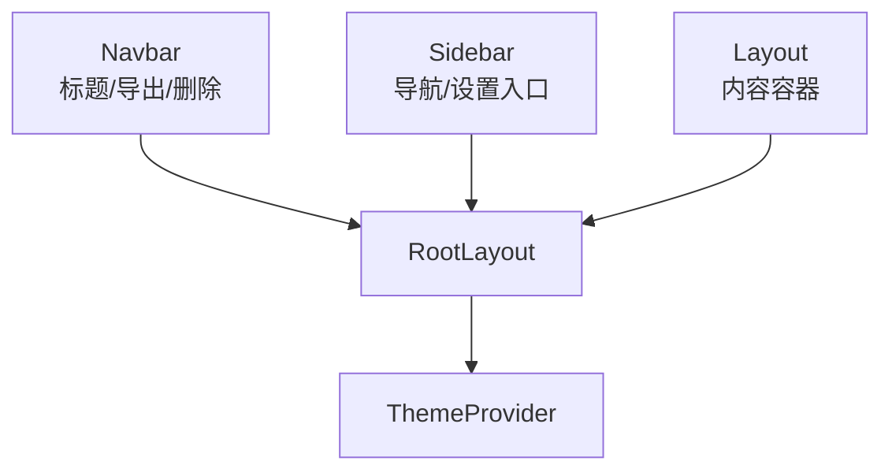
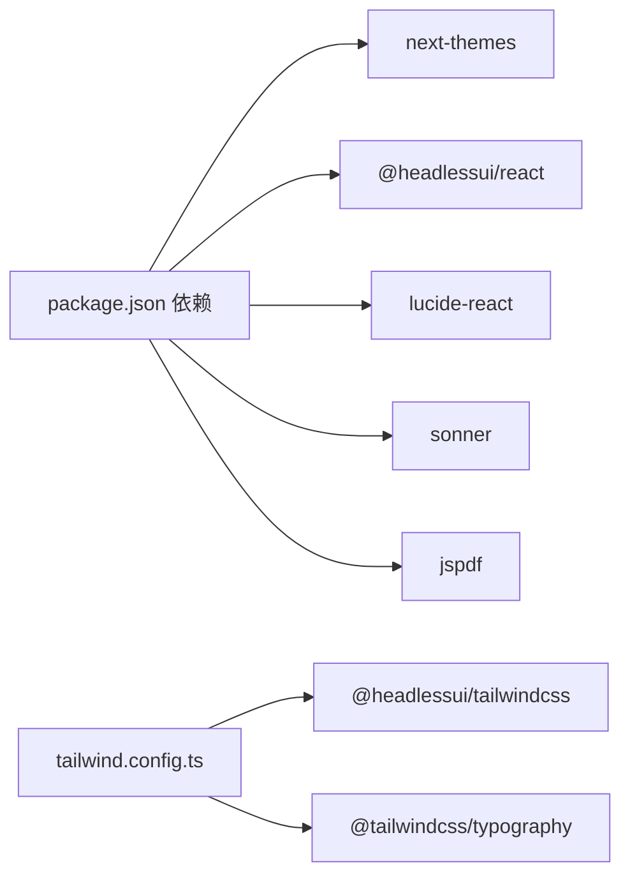

# UI基础框架组件

<cite>
**本文引用的文件**
- [src/components/ui/Loader.tsx](file://src/components/ui/Loader.tsx)
- [src/components/ui/Select.tsx](file://src/components/ui/Select.tsx)
- [src/components/theme/Provider.tsx](file://src/components/theme/Provider.tsx)
- [src/components/theme/Switcher.tsx](file://src/components/theme/Switcher.tsx)
- [src/components/Layout.tsx](file://src/components/Layout.tsx)
- [src/components/Navbar.tsx](file://src/components/Navbar.tsx)
- [src/components/Sidebar.tsx](file://src/components/Sidebar.tsx)
- [src/components/Settings/SettingsButton.tsx](file://src/components/Settings/SettingsButton.tsx)
- [src/components/Settings/SettingsButtonMobile.tsx](file://src/components/Settings/SettingsButtonMobile.tsx)
- [src/app/layout.tsx](file://src/app/layout.tsx)
- [src/lib/utils.ts](file://src/lib/utils.ts)
- [tailwind.config.ts](file://tailwind.config.ts)
- [package.json](file://package.json)
</cite>

## 目录
1. [简介](#简介)
2. [项目结构](#项目结构)
3. [核心组件](#核心组件)
4. [架构总览](#架构总览)
5. [详细组件分析](#详细组件分析)
6. [依赖关系分析](#依赖关系分析)
7. [性能考量](#性能考量)
8. [故障排查指南](#故障排查指南)
9. [结论](#结论)
10. [附录](#附录)

## 简介
本文件面向 Perplexica 的 UI 基础框架组件，系统性梳理加载器、下拉选择器、主题提供者与主题切换器、布局容器、导航栏与侧边栏等框架级组件的设计理念、实现细节、样式定制与使用方法。文档同时解释主题系统的运行机制与自定义路径，给出响应式与无障碍支持现状，并提供扩展与定制指导，帮助开发者在现有组件之上构建复杂界面。

## 项目结构
UI 基础框架主要由以下层次构成：
- 组件层：基础 UI 组件（Loader、Select）、主题系统（Provider、Switcher）、布局与导航（Layout、Navbar、Sidebar）以及设置入口（SettingsButton、SettingsButtonMobile）
- 应用层：根布局负责注入主题提供者、侧边栏与全局提示等
- 样式层：Tailwind 扩展了明暗两套色阶与边框色阶，配合类名合并工具实现一致的样式策略
- 工具层：通用工具函数（如类名合并、时间格式化）

图表来源
- [src/app/layout.tsx](file://src/app/layout.tsx#L35-L55)
- [src/components/theme/Provider.tsx](file://src/components/theme/Provider.tsx#L1-L17)
- [src/components/theme/Switcher.tsx](file://src/components/theme/Switcher.tsx#L1-L61)
- [src/components/Sidebar.tsx](file://src/components/Sidebar.tsx#L1-L135)
- [src/components/Layout.tsx](file://src/components/Layout.tsx#L1-L10)
- [src/components/Navbar.tsx](file://src/components/Navbar.tsx#L1-L328)
- [src/components/ui/Select.tsx](file://src/components/ui/Select.tsx#L1-L51)
- [src/components/ui/Loader.tsx](file://src/components/ui/Loader.tsx#L1-L23)
- [src/components/Settings/SettingsButton.tsx](file://src/components/Settings/SettingsButton.tsx#L1-L25)
- [src/components/Settings/SettingsButtonMobile.tsx](file://src/components/Settings/SettingsButtonMobile.tsx#L1-L22)

章节来源
- [src/app/layout.tsx](file://src/app/layout.tsx#L1-L60)
- [tailwind.config.ts](file://tailwind.config.ts#L1-L58)

## 核心组件
本节聚焦基础 UI 组件与框架级组件的功能特性、样式定制与使用方法。

- 加载器 Loader
  - 功能：提供简洁的旋转加载图标，适配明暗主题与无障碍属性
  - 样式：通过 Tailwind 类控制尺寸、颜色与动画；在深色模式下使用半透明填充以提升可读性
  - 使用：在需要显式加载状态的场景（如异步数据获取）使用
  - 参考路径：[src/components/ui/Loader.tsx](file://src/components/ui/Loader.tsx#L1-L23)

- 下拉选择器 Select
  - 功能：封装原生 select，支持禁用、加载态（显示旋转图标）、选项列表与样式合并
  - 样式：统一的圆角、边框、背景与文本颜色；右侧叠加指示器（加载时为旋转图标，否则为向下箭头）
  - 行为：禁用时整体透明度降低；支持透传原生 select 属性
  - 参考路径：[src/components/ui/Select.tsx](file://src/components/ui/Select.tsx#L1-L51)

- 主题提供者 ThemeProvider
  - 功能：基于 next-themes 提供主题上下文，默认深色主题，禁用系统跟随
  - 配置：通过 attribute="class" 切换根元素 class 实现主题切换
  - 参考路径：[src/components/theme/Provider.tsx](file://src/components/theme/Provider.tsx#L1-L17)

- 主题切换器 ThemeSwitcher
  - 功能：在 Light/Dark 之间切换主题；避免水合不匹配导致的闪烁
  - 行为：客户端组件，挂载后渲染；当主题为 system 时监听系统配色方案变化
  - 依赖：内部使用 Select 组件作为下拉选择器
  - 参考路径：[src/components/theme/Switcher.tsx](file://src/components/theme/Switcher.tsx#L1-L61)

- 布局容器 Layout
  - 功能：为页面内容提供最大宽度与内边距约束，左侧留出侧栏空间
  - 样式：背景色随主题变化；最小高度覆盖视口
  - 参考路径：[src/components/Layout.tsx](file://src/components/Layout.tsx#L1-L10)

- 导航栏 Navbar
  - 功能：展示当前会话标题、相对时间、导出（Markdown/PDF）与删除会话
  - 交互：使用 Headless UI Popover 实现弹出菜单；定时更新相对时间
  - 参考路径：[src/components/Navbar.tsx](file://src/components/Navbar.tsx#L1-L328)

- 侧边栏 Sidebar
  - 功能：桌面端固定侧栏与移动端底部导航条；包含“新建对话”、“首页/发现/库”链接与设置入口
  - 响应式：桌面端固定侧栏，移动端底部导航条；根据路由段高亮当前页
  - 参考路径：[src/components/Sidebar.tsx](file://src/components/Sidebar.tsx#L1-L135)

- 设置入口（桌面/移动端）
  - 功能：打开设置对话框；桌面与移动端分别提供不同入口组件
  - 参考路径：[src/components/Settings/SettingsButton.tsx](file://src/components/Settings/SettingsButton.tsx#L1-L25)、[src/components/Settings/SettingsButtonMobile.tsx](file://src/components/Settings/SettingsButtonMobile.tsx#L1-L22)

章节来源
- [src/components/ui/Loader.tsx](file://src/components/ui/Loader.tsx#L1-L23)
- [src/components/ui/Select.tsx](file://src/components/ui/Select.tsx#L1-L51)
- [src/components/theme/Provider.tsx](file://src/components/theme/Provider.tsx#L1-L17)
- [src/components/theme/Switcher.tsx](file://src/components/theme/Switcher.tsx#L1-L61)
- [src/components/Layout.tsx](file://src/components/Layout.tsx#L1-L10)
- [src/components/Navbar.tsx](file://src/components/Navbar.tsx#L1-L328)
- [src/components/Sidebar.tsx](file://src/components/Sidebar.tsx#L1-L135)
- [src/components/Settings/SettingsButton.tsx](file://src/components/Settings/SettingsButton.tsx#L1-L25)
- [src/components/Settings/SettingsButtonMobile.tsx](file://src/components/Settings/SettingsButtonMobile.tsx#L1-L22)

## 架构总览
UI 框架采用“应用层注入 + 组件层复用”的分层设计：
- 应用层（RootLayout）负责注入主题提供者、侧边栏与全局通知
- 组件层通过组合基础 UI 组件（Loader、Select）与框架组件（Layout、Navbar、Sidebar）构建页面
- 样式层通过 Tailwind 自定义明暗色阶与插件增强一致性

图表来源
- [src/app/layout.tsx](file://src/app/layout.tsx#L35-L55)
- [src/components/Sidebar.tsx](file://src/components/Sidebar.tsx#L29-L131)
- [src/components/Layout.tsx](file://src/components/Layout.tsx#L1-L10)
- [src/components/Navbar.tsx](file://src/components/Navbar.tsx#L199-L324)

## 详细组件分析

### 加载器 Loader 分析
- 设计要点
  - 使用 SVG 图标，具备无障碍属性 aria-hidden，避免对屏幕阅读器造成干扰
  - 明暗主题下的颜色与填充通过 Tailwind 类自动适配
  - 通过动画类实现旋转效果
- 复杂度与性能
  - 渲染开销极低，仅包含少量路径与属性
- 可定制点
  - 尺寸：通过宽高类调整
  - 颜色：通过明暗主题类或覆盖类进行微调
- 使用建议
  - 在异步操作开始前显示，结束时隐藏
  - 与按钮禁用状态结合，避免重复触发

图表来源
- [src/components/ui/Loader.tsx](file://src/components/ui/Loader.tsx#L1-L23)

章节来源
- [src/components/ui/Loader.tsx](file://src/components/ui/Loader.tsx#L1-L23)

### 下拉选择器 Select 分析
- 设计要点
  - 基于 forwardRef 接收 ref，透传原生 select 属性
  - 支持 loading 与 disabled 状态，右侧指示器动态切换
  - 使用 cn 合并类名，确保样式可叠加与覆盖
- 数据结构与行为
  - options 数组驱动选项列表，支持禁用单个选项
  - 通过右侧图标区分加载与展开状态
- 性能与可用性
  - 渲染逻辑线性遍历选项数组，复杂度 O(n)
  - 无障碍：原生 select 元素具备默认可访问语义
- 定制与扩展
  - 可通过 className 覆盖默认样式
  - 可在外部包装以实现分组、搜索或远程加载

图表来源
- [src/components/ui/Select.tsx](file://src/components/ui/Select.tsx#L10-L46)

章节来源
- [src/components/ui/Select.tsx](file://src/components/ui/Select.tsx#L1-L51)

### 主题系统分析
- 主题提供者 ThemeProvider
  - 作用：在应用根部提供主题上下文，通过 class 切换实现明暗主题
  - 默认：默认深色主题；禁用系统跟随
- 主题切换器 ThemeSwitcher
  - 作用：在 Light/Dark 间切换；避免水合不匹配
  - 机制：使用 useTheme 获取当前主题；监听系统配色变化（当主题为 system 时）
  - 依赖：内部复用 Select 组件作为下拉选择器
- 样式映射
  - Tailwind 自定义了明/暗两套 primary/secondary 与中间色阶，配合 darkMode: 'class'

图表来源
- [src/components/theme/Provider.tsx](file://src/components/theme/Provider.tsx#L10-L12)
- [src/components/theme/Switcher.tsx](file://src/components/theme/Switcher.tsx#L11-L17)
- [tailwind.config.ts](file://tailwind.config.ts#L24-L50)

章节来源
- [src/components/theme/Provider.tsx](file://src/components/theme/Provider.tsx#L1-L17)
- [src/components/theme/Switcher.tsx](file://src/components/theme/Switcher.tsx#L1-L61)
- [tailwind.config.ts](file://tailwind.config.ts#L1-L58)

### 布局与导航组件分析
- 布局容器 Layout
  - 作用：限制内容最大宽度，左侧留白给侧栏；背景色随主题变化
- 导航栏 Navbar
  - 作用：展示会话标题与相对时间；提供导出为 Markdown/PDF 的能力
  - 交互：使用 Headless UI Popover 实现弹出菜单；定时刷新相对时间
- 侧边栏 Sidebar
  - 作用：桌面端固定侧栏 + 移动端底部导航；包含“新建对话”、“首页/发现/库”链接与设置入口
  - 响应式：根据断点切换布局；根据路由段高亮当前页

图表来源
- [src/components/Navbar.tsx](file://src/components/Navbar.tsx#L199-L324)
- [src/components/Sidebar.tsx](file://src/components/Sidebar.tsx#L29-L131)
- [src/components/Layout.tsx](file://src/components/Layout.tsx#L1-L10)
- [src/app/layout.tsx](file://src/app/layout.tsx#L35-L55)

章节来源
- [src/components/Layout.tsx](file://src/components/Layout.tsx#L1-L10)
- [src/components/Navbar.tsx](file://src/components/Navbar.tsx#L1-L328)
- [src/components/Sidebar.tsx](file://src/components/Sidebar.tsx#L1-L135)

## 依赖关系分析
- 组件耦合
  - ThemeSwitcher 依赖 Select 与 next-themes；Sidebar 依赖 Headless UI 与 Link；Navbar 依赖 Headless UI 与 jsPDF
  - 布局组件（Layout、Sidebar、Navbar）在 RootLayout 中被统一注入
- 外部依赖
  - next-themes：主题上下文管理
  - @headlessui/react：Popover 等无样式 UI 组件
  - lucide-react：图标库
  - sonner：全局通知
  - jspdf：PDF 导出
- 样式依赖
  - Tailwind 插件：@headlessui/tailwindcss、@tailwindcss/typography
  - 类名合并：clsx + tailwind-merge

图表来源
- [package.json](file://package.json#L13-L53)
- [tailwind.config.ts](file://tailwind.config.ts#L52-L55)

章节来源
- [package.json](file://package.json#L1-L77)
- [tailwind.config.ts](file://tailwind.config.ts#L1-L58)

## 性能考量
- 组件渲染
  - Loader 与 Select 为轻量组件，渲染成本低
  - Navbar 的定时器需在组件卸载时清理，避免内存泄漏
- 样式合并
  - 使用 cn/twMerge 合并类名，减少冲突与冗余
- 主题切换
  - 通过 class 切换实现，避免重排与重绘的额外开销
- 导出功能
  - PDF 导出涉及文本拆分与分页，建议在后台任务或空闲时段执行，避免阻塞主线程

## 故障排查指南
- 水合不匹配（主题切换闪烁）
  - 症状：初次渲染时主题与预期不符
  - 解决：确保 ThemeSwitcher 在客户端挂载后再渲染；参考 mounted 条件返回
  - 参考路径：[src/components/theme/Switcher.tsx](file://src/components/theme/Switcher.tsx#L43-L45)
- 系统主题监听未生效
  - 症状：切换系统深浅模式后主题未更新
  - 解决：确认主题为 system 且已添加媒体查询监听；移除时需清理监听器
  - 参考路径：[src/components/theme/Switcher.tsx](file://src/components/theme/Switcher.tsx#L24-L40)
- 导出 PDF 报错
  - 症状：生成 PDF 失败或空白
  - 排查：检查 jsPDF 版本与浏览器兼容性；确认文本拆分与分页逻辑
  - 参考路径：[src/components/Navbar.tsx](file://src/components/Navbar.tsx#L76-L196)
- 侧栏/导航高亮异常
  - 症状：当前页未正确高亮
  - 排查：检查 useSelectedLayoutSegments 返回的 segments 是否符合预期
  - 参考路径：[src/components/Sidebar.tsx](file://src/components/Sidebar.tsx#L30-L52)

章节来源
- [src/components/theme/Switcher.tsx](file://src/components/theme/Switcher.tsx#L19-L40)
- [src/components/Navbar.tsx](file://src/components/Navbar.tsx#L76-L196)
- [src/components/Sidebar.tsx](file://src/components/Sidebar.tsx#L29-L52)

## 结论
Perplexica 的 UI 基础框架以简洁、可复用为核心目标：通过 Loader 与 Select 提供一致的加载与选择体验；通过 ThemeProvider 与 ThemeSwitcher 实现稳定的主题体系；通过 Layout、Navbar、Sidebar 构建清晰的页面骨架。Tailwind 的明暗色阶与插件体系保证了样式的一致性与可维护性。开发者可在现有组件基础上快速扩展，构建更复杂的界面功能。

## 附录
- 样式定制建议
  - 使用明/暗色阶命名约定（如 light.primary、dark.secondary），保持主题一致性
  - 对于 Select 等可复用组件，优先通过 className 覆盖而非硬编码样式
- 响应式与无障碍
  - 响应式：Sidebar 已针对桌面与移动端提供差异化布局；建议新增组件遵循相同断点策略
  - 无障碍：Select 为原生控件，具备默认可访问性；Popover 使用 Headless UI，需确保键盘可达与焦点管理
- 扩展与定制
  - 新增下拉组件：可参考 Select 的封装模式，支持 loading、disabled 与图标指示器
  - 新增主题：在 ThemeProvider 中调整默认主题与系统跟随策略；在 Switcher 中扩展选项集合
  - 新增布局：在 Layout 基础上增加侧栏留白与内容区约束，确保与 Sidebar 协同