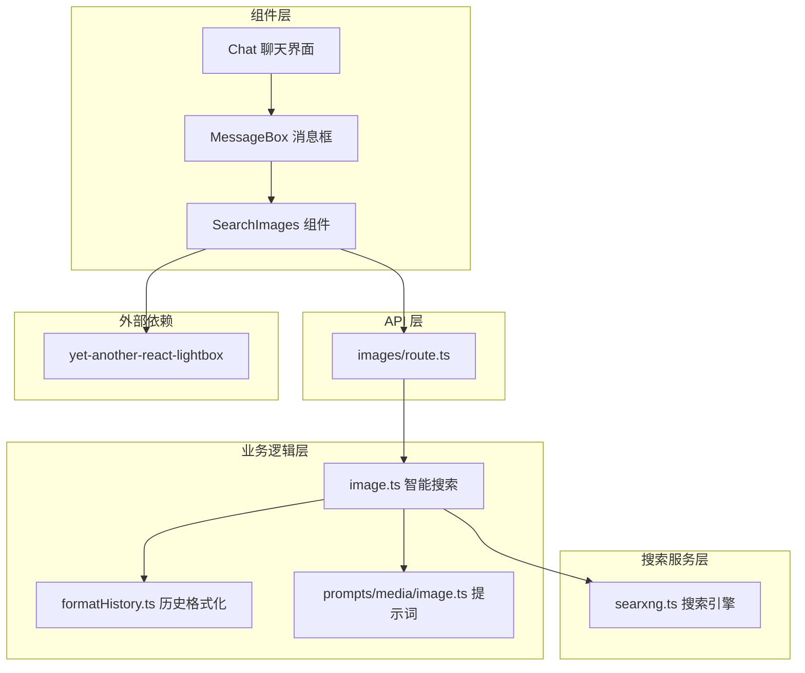
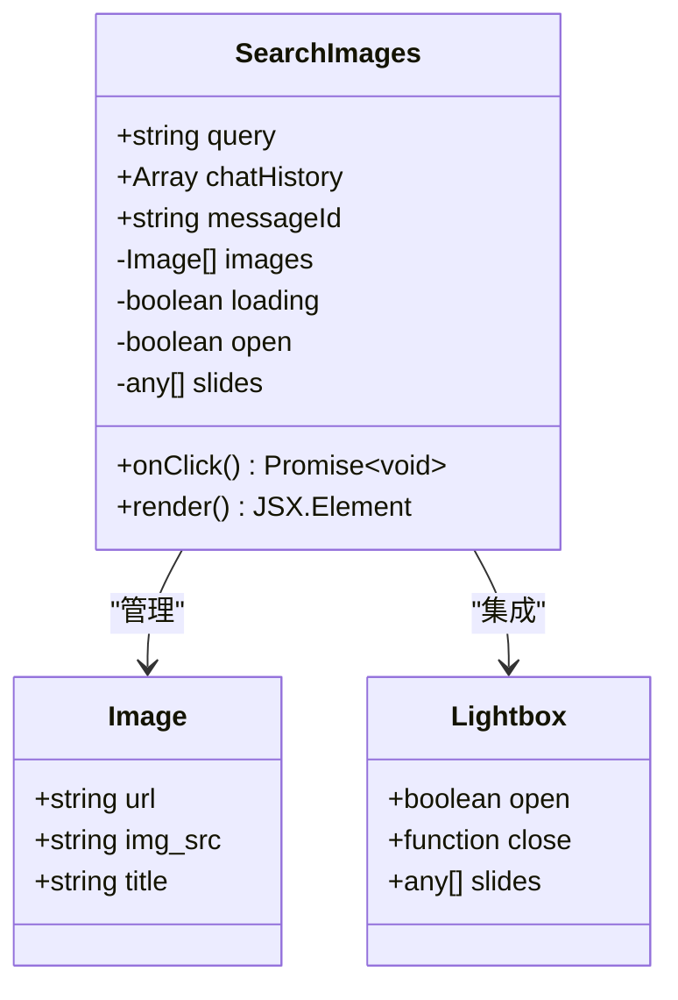
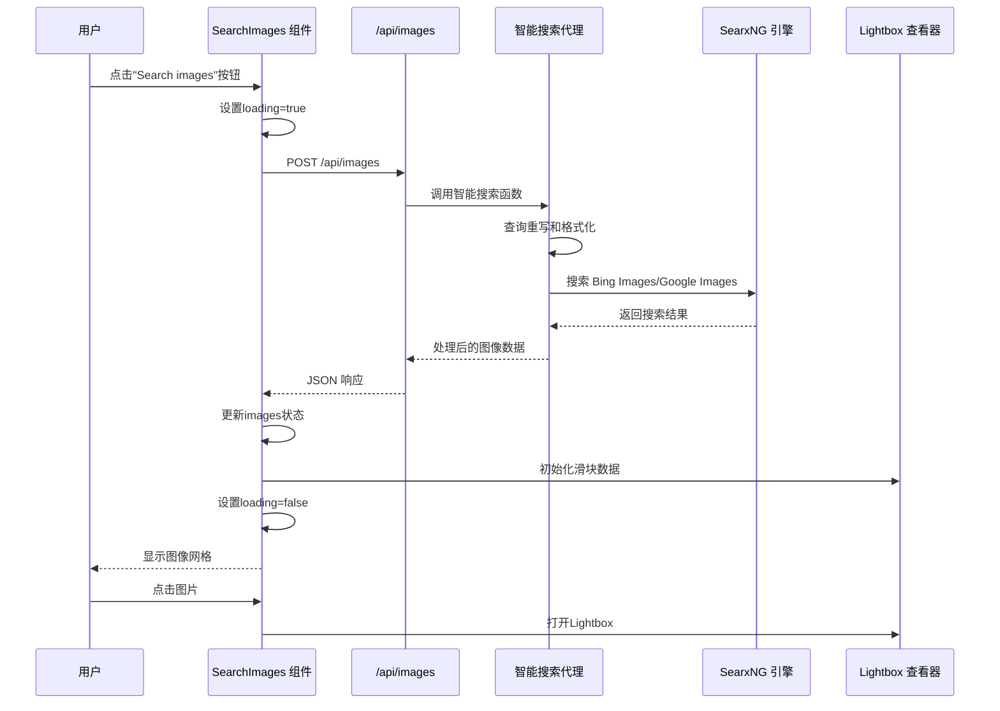
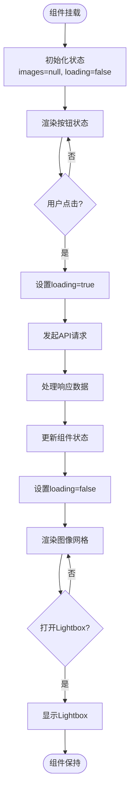
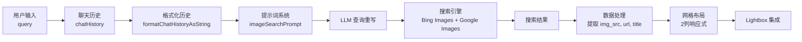
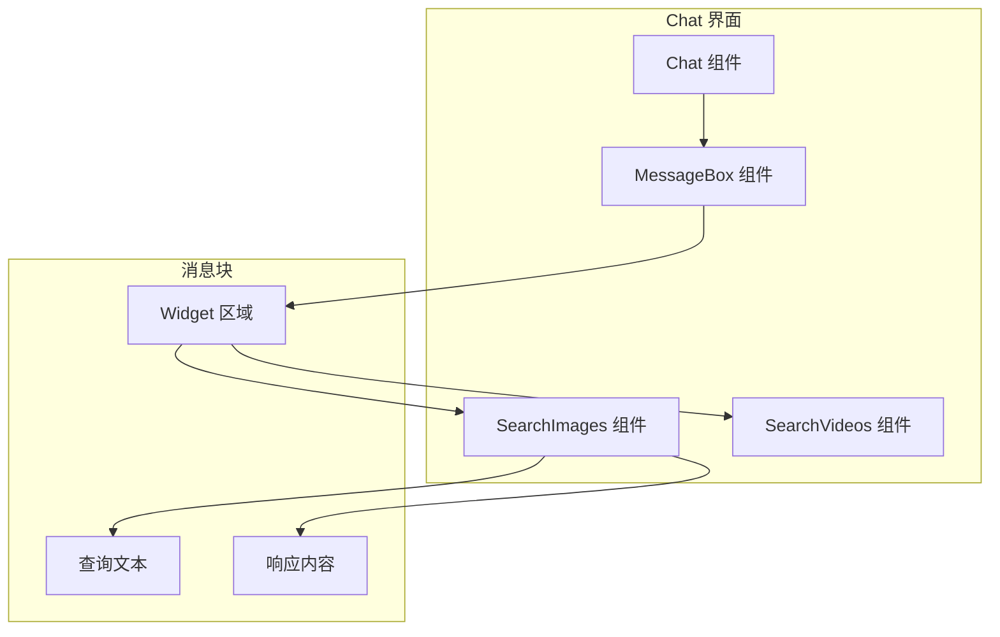
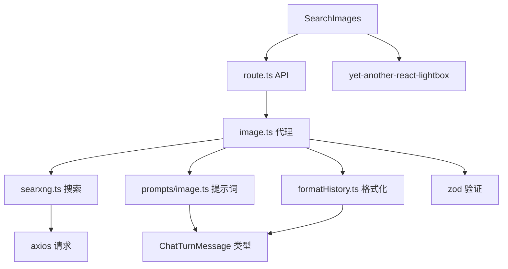
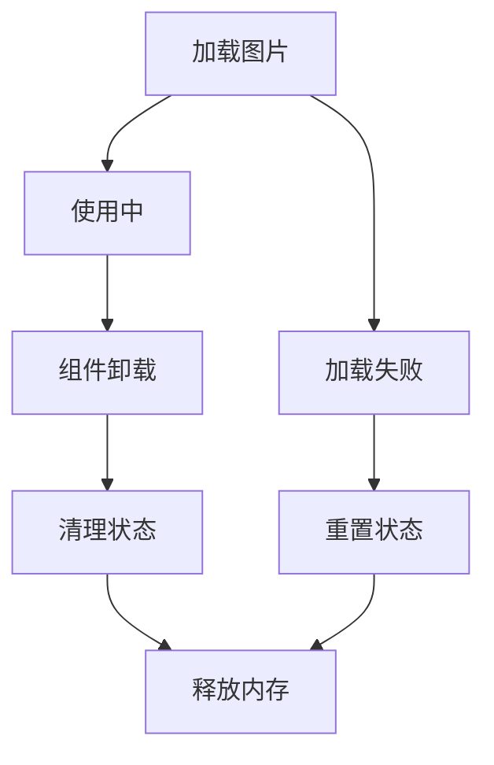
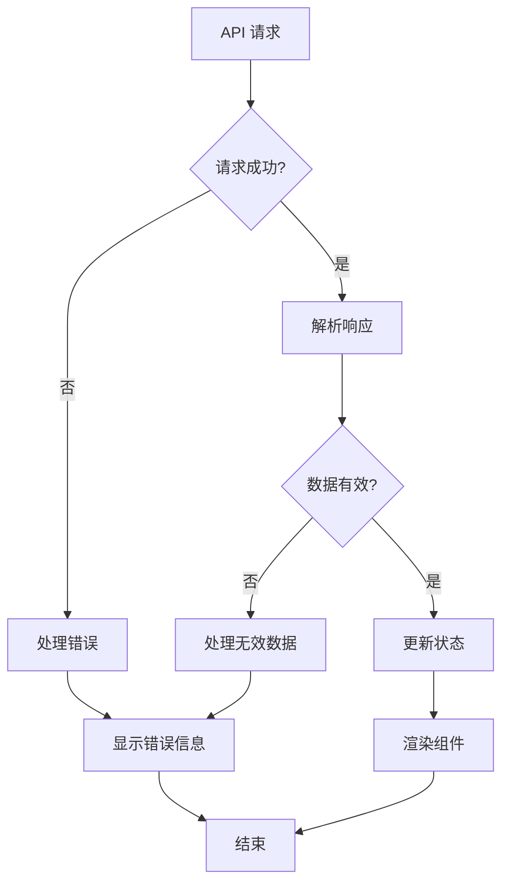

# 图像搜索组件

<cite>
**本文档引用的文件**
- [src/components/SearchImages.tsx](file://src/components/SearchImages.tsx)
- [src/app/api/images/route.ts](file://src/app/api/images/route.ts)
- [src/lib/agents/media/image.ts](file://src/lib/agents/media/image.ts)
- [src/lib/searxng.ts](file://src/lib/searxng.ts)
- [src/lib/prompts/media/image.ts](file://src/lib/prompts/media/image.ts)
- [src/components/MessageBox.tsx](file://src/components/MessageBox.tsx)
- [src/components/Chat.tsx](file://src/components/Chat.tsx)
- [src/lib/utils/formatHistory.ts](file://src/lib/utils/formatHistory.ts)
- [package.json](file://package.json)
</cite>

## 目录
1. [简介](#简介)
2. [项目结构](#项目结构)
3. [核心组件](#核心组件)
4. [架构概览](#架构概览)
5. [详细组件分析](#详细组件分析)
6. [依赖关系分析](#依赖关系分析)
7. [性能考虑](#性能考虑)
8. [故障排除指南](#故障排除指南)
9. [结论](#结论)

## 简介

Perplexica 的图像搜索组件是一个集成了 AI 驱动搜索、图片展示和 Lightbox 查看器的现代化组件。该组件通过智能查询重写、多引擎搜索和响应式布局，为用户提供无缝的图像搜索体验。

该组件的核心特性包括：
- 基于对话上下文的智能查询重写
- 支持 Bing Images 和 Google Images 的多引擎搜索
- 响应式网格布局和缩略图展示
- 集成 Lightbox 图片查看器
- 完整的加载状态管理和错误处理

## 项目结构

图像搜索组件在 Perplexica 项目中的组织结构如下：

**图表来源**
- [src/components/SearchImages.tsx](file://src/components/SearchImages.tsx#L1-L153)
- [src/app/api/images/route.ts](file://src/app/api/images/route.ts#L1-L42)
- [src/lib/agents/media/image.ts](file://src/lib/agents/media/image.ts#L1-L67)

**章节来源**
- [src/components/SearchImages.tsx](file://src/components/SearchImages.tsx#L1-L153)
- [src/components/MessageBox.tsx](file://src/components/MessageBox.tsx#L270-L291)
- [src/components/Chat.tsx](file://src/components/Chat.tsx#L1-L109)

## 核心组件

### SearchImages 组件架构

SearchImages 是一个自包含的 React 组件，负责处理图像搜索的完整生命周期：

**图表来源**
- [src/components/SearchImages.tsx](file://src/components/SearchImages.tsx#L8-L26)

### 组件状态管理

组件使用 React 的 useState Hook 来管理以下关键状态：

| 状态变量 | 类型 | 描述 | 默认值 |
|---------|------|------|--------|
| `images` | `Image[] \| null` | 搜索结果数组或空值 | `null` |
| `loading` | `boolean` | 加载状态指示器 | `false` |
| `open` | `boolean` | Lightbox 打开状态 | `false` |
| `slides` | `any[]` | Lightbox 滑块数据 | `[]` |

**章节来源**
- [src/components/SearchImages.tsx](file://src/components/SearchImages.tsx#L23-L26)

## 架构概览

图像搜索组件采用分层架构设计，确保关注点分离和代码可维护性：

**图表来源**
- [src/components/SearchImages.tsx](file://src/components/SearchImages.tsx#L33-L67)
- [src/app/api/images/route.ts](file://src/app/api/images/route.ts#L11-L33)
- [src/lib/agents/media/image.ts](file://src/lib/agents/media/image.ts#L24-L63)

## 详细组件分析

### 生命周期管理

SearchImages 组件遵循标准的 React 生命周期模式：

**图表来源**
- [src/components/SearchImages.tsx](file://src/components/SearchImages.tsx#L23-L67)

### 用户交互逻辑

组件支持多种用户交互模式：

#### 主要交互流程

1. **初始状态交互**
   - 用户看到"Search images"按钮
   - 点击按钮触发展示加载状态

2. **加载状态交互**
   - 显示4个占位符图像
   - 提供视觉反馈等待搜索完成

3. **结果展示交互**
   - 显示网格布局的图像缩略图
   - 支持单张大图点击和多图预览
   - 点击任意图片打开 Lightbox 查看器

4. **Lightbox 交互**
   - 支持全屏图片浏览
   - 导航控制和关闭功能
   - 响应式设计适配不同屏幕尺寸

**章节来源**
- [src/components/SearchImages.tsx](file://src/components/SearchImages.tsx#L78-L147)

### 数据流处理

组件的数据流经过多个处理阶段：

**图表来源**
- [src/lib/agents/media/image.ts](file://src/lib/agents/media/image.ts#L24-L63)
- [src/lib/prompts/media/image.ts](file://src/lib/prompts/media/image.ts#L3-L8)
- [src/lib/utils/formatHistory.ts](file://src/lib/utils/formatHistory.ts#L3-L10)

**章节来源**
- [src/lib/agents/media/image.ts](file://src/lib/agents/media/image.ts#L24-L63)
- [src/lib/prompts/media/image.ts](file://src/lib/prompts/media/image.ts#L1-L31)

### 组件集成方式

SearchImages 组件在聊天界面中的集成位置：

**图表来源**
- [src/components/Chat.tsx](file://src/components/Chat.tsx#L61-L79)
- [src/components/MessageBox.tsx](file://src/components/MessageBox.tsx#L271-L283)

**章节来源**
- [src/components/MessageBox.tsx](file://src/components/MessageBox.tsx#L271-L283)
- [src/components/Chat.tsx](file://src/components/Chat.tsx#L61-L79)

## 依赖关系分析

### 外部依赖

组件依赖的关键外部库：

| 依赖包 | 版本 | 用途 | 重要性 |
|--------|------|------|--------|
| yet-another-react-lightbox | ^3.17.2 | 图片查看器 | 高 |
| lucide-react | - | 图标库 | 中 |
| zod | ^4.1.12 | 数据验证 | 高 |

### 内部依赖关系

**图表来源**
- [package.json](file://package.json#L52-L53)
- [src/app/api/images/route.ts](file://src/app/api/images/route.ts#L1-L3)
- [src/lib/agents/media/image.ts](file://src/lib/agents/media/image.ts#L1-L11)

**章节来源**
- [package.json](file://package.json#L13-L53)

## 性能考虑

### 懒加载策略

组件实现了多层懒加载机制：

1. **组件级懒加载**
   - 仅在用户需要时执行搜索
   - 避免不必要的 API 调用

2. **图片懒加载**
   - 使用浏览器原生 lazy loading
   - 减少初始页面负载

3. **Lightbox 懒加载**
   - 滑块数据按需生成
   - 避免预加载所有图片

### 内存管理

### 预加载优化

虽然组件本身不进行预加载，但可以通过以下方式优化：

1. **智能预取**
   - 预测用户可能查看的图片
   - 在用户滚动时预加载下一张

2. **缓存策略**
   - 缓存搜索结果
   - 避免重复搜索相同查询

## 故障排除指南

### 常见问题及解决方案

| 问题类型 | 症状 | 可能原因 | 解决方案 |
|----------|------|----------|----------|
| 搜索无结果 | 显示空状态 | 搜索引擎不可用 | 检查网络连接和搜索引擎状态 |
| 加载时间过长 | 占位符长时间显示 | API 响应慢 | 实现超时机制和进度指示器 |
| 图片加载失败 | 图片显示为占位符 | 图片链接失效 | 添加错误边界和重试机制 |
| Lightbox 无法打开 | 点击无反应 | 滑块数据为空 | 验证图片数据结构和索引 |

### 错误处理机制

组件采用多层次的错误处理：

**章节来源**
- [src/app/api/images/route.ts](file://src/app/api/images/route.ts#L34-L40)

## 结论

Perplexica 的图像搜索组件展现了现代前端开发的最佳实践：

### 技术优势

1. **模块化设计** - 清晰的关注点分离，便于维护和扩展
2. **响应式架构** - 支持多种设备和屏幕尺寸
3. **用户体验优化** - 流畅的交互和及时的反馈
4. **性能考虑** - 合理的状态管理和资源优化

### 架构亮点

- **智能查询重写** - 利用 LLM 提升搜索准确性
- **多引擎支持** - 增强搜索结果的多样性
- **集成式设计** - 与聊天界面无缝融合
- **可扩展性** - 为未来功能增强预留空间

### 改进建议

1. **添加搜索历史** - 记录用户的搜索偏好
2. **实现图片收藏** - 允许用户保存喜欢的图片
3. **增强过滤功能** - 支持按类型、大小等条件筛选
4. **离线缓存** - 提升离线环境下的用户体验

该组件为 Perplexica 提供了强大而优雅的图像搜索能力，是现代 AI 聊天应用的重要组成部分。