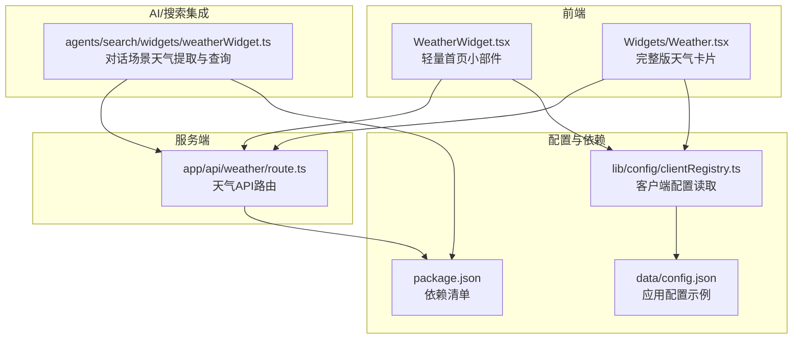
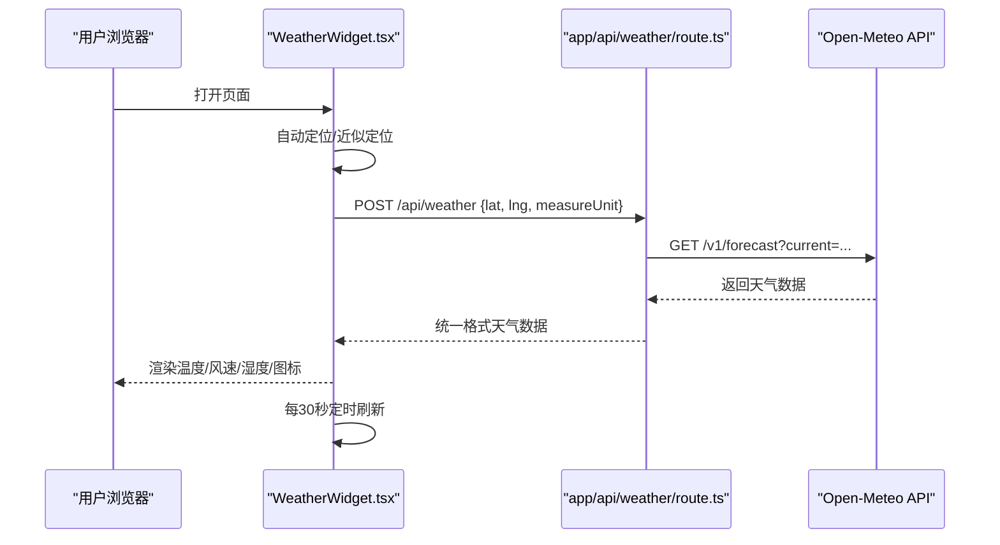
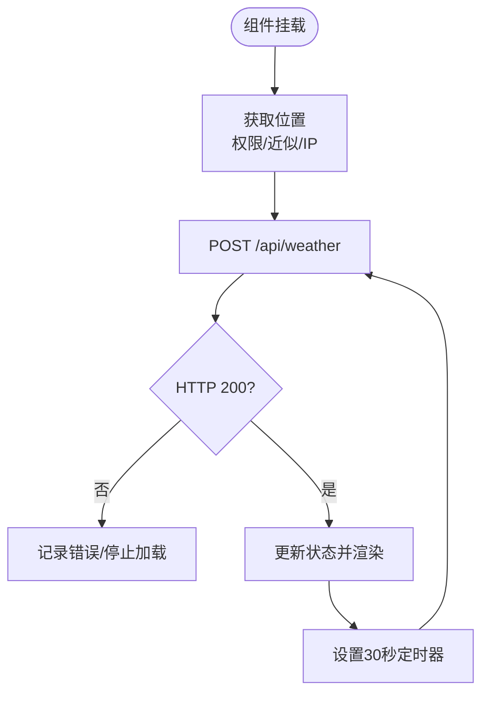
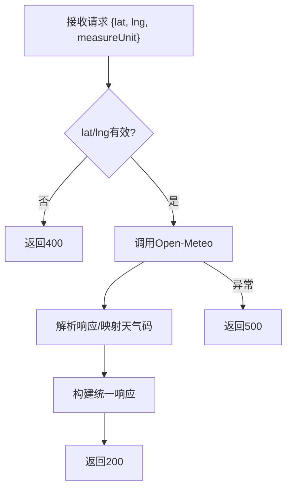
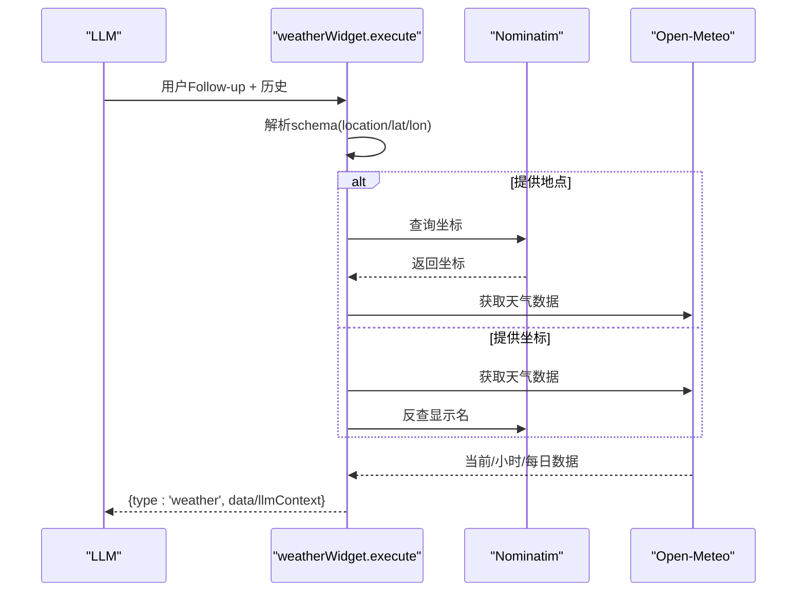
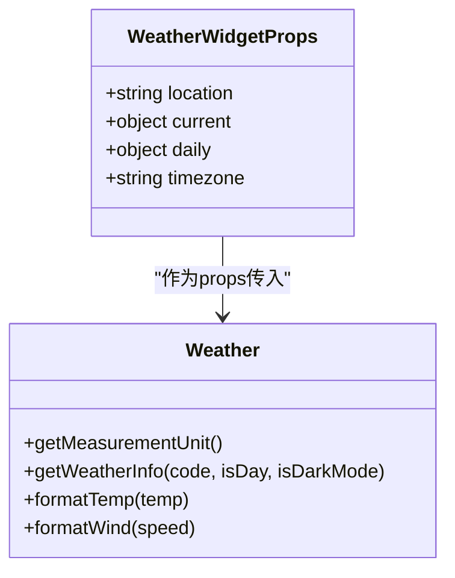
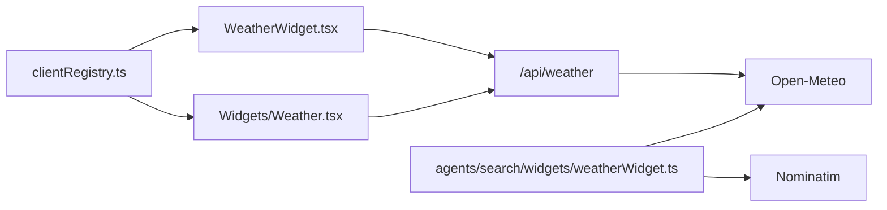

# 天气小部件

<cite>
**本文引用的文件**
- [src/components/WeatherWidget.tsx](file://src/components/WeatherWidget.tsx)
- [src/app/api/weather/route.ts](file://src/app/api/weather/route.ts)
- [src/lib/agents/search/widgets/weatherWidget.ts](file://src/lib/agents/search/widgets/weatherWidget.ts)
- [src/components/Widgets/Weather.tsx](file://src/components/Widgets/Weather.tsx)
- [src/lib/config/clientRegistry.ts](file://src/lib/config/clientRegistry.ts)
- [package.json](file://package.json)
- [data/config.json](file://data/config.json)
</cite>

## 目录
1. [简介](#简介)
2. [项目结构](#项目结构)
3. [核心组件](#核心组件)
4. [架构总览](#架构总览)
5. [组件详解](#组件详解)
6. [依赖关系分析](#依赖关系分析)
7. [性能与优化](#性能与优化)
8. [故障排除指南](#故障排除指南)
9. [结论](#结论)

## 简介
本技术文档围绕“天气小部件”展开，系统性阐述其实现架构、数据获取流程、API 集成方式、数据处理逻辑、用户界面设计、配置项、错误处理机制以及性能优化建议。读者可据此快速理解从位置识别到天气展示的完整链路，并在实际部署中进行扩展与优化。

## 项目结构
天气小部件涉及三层：前端展示组件、服务端 API 路由、以及用于对话场景的“天气小部件”执行器。此外，还包含客户端配置读取工具与基础依赖信息。

图表来源
- [src/components/WeatherWidget.tsx](file://src/components/WeatherWidget.tsx#L1-L170)
- [src/components/Widgets/Weather.tsx](file://src/components/Widgets/Weather.tsx#L1-L423)
- [src/app/api/weather/route.ts](file://src/app/api/weather/route.ts#L1-L175)
- [src/lib/agents/search/widgets/weatherWidget.ts](file://src/lib/agents/search/widgets/weatherWidget.ts#L1-L204)
- [src/lib/config/clientRegistry.ts](file://src/lib/config/clientRegistry.ts#L1-L30)
- [package.json](file://package.json#L1-L77)
- [data/config.json](file://data/config.json#L1-L41)

章节来源
- [src/components/WeatherWidget.tsx](file://src/components/WeatherWidget.tsx#L1-L170)
- [src/components/Widgets/Weather.tsx](file://src/components/Widgets/Weather.tsx#L1-L423)
- [src/app/api/weather/route.ts](file://src/app/api/weather/route.ts#L1-L175)
- [src/lib/agents/search/widgets/weatherWidget.ts](file://src/lib/agents/search/widgets/weatherWidget.ts#L1-L204)
- [src/lib/config/clientRegistry.ts](file://src/lib/config/clientRegistry.ts#L1-L30)
- [package.json](file://package.json#L1-L77)
- [data/config.json](file://data/config.json#L1-L41)

## 核心组件
- 首页轻量天气小部件：负责自动定位、周期性拉取、基础 UI 展示与单位切换。
- 完整版天气卡片：提供更丰富的天气信息、渐变背景、未来多日预报与单位格式化。
- 服务端天气 API：对接 Open-Meteo，解析天气现象码，返回统一格式数据。
- 对话场景天气小部件：通过 LLM 抽取地点或坐标，调用 Open-Meteo 获取当前与多日天气数据。
- 客户端配置读取：从 localStorage 读取主题、单位等偏好。

章节来源
- [src/components/WeatherWidget.tsx](file://src/components/WeatherWidget.tsx#L1-L170)
- [src/components/Widgets/Weather.tsx](file://src/components/Widgets/Weather.tsx#L1-L423)
- [src/app/api/weather/route.ts](file://src/app/api/weather/route.ts#L1-L175)
- [src/lib/agents/search/widgets/weatherWidget.ts](file://src/lib/agents/search/widgets/weatherWidget.ts#L1-L204)
- [src/lib/config/clientRegistry.ts](file://src/lib/config/clientRegistry.ts#L1-L30)

## 架构总览
下图展示了从浏览器到服务端再到第三方天气 API 的端到端流程，以及对话场景中的 LLM 参与路径。

图表来源
- [src/components/WeatherWidget.tsx](file://src/components/WeatherWidget.tsx#L18-L109)
- [src/app/api/weather/route.ts](file://src/app/api/weather/route.ts#L1-L175)

章节来源
- [src/components/WeatherWidget.tsx](file://src/components/WeatherWidget.tsx#L18-L109)
- [src/app/api/weather/route.ts](file://src/app/api/weather/route.ts#L1-L175)

## 组件详解

### 首页轻量天气小部件（WeatherWidget）
- 功能要点
  - 自动定位：优先使用浏览器地理定位权限；若未授权则回退至基于 IP 的近似定位。
  - 请求频率：首次加载后每 30 秒轮询一次。
  - 数据来源：调用服务端 /api/weather，参数包含经纬度与单位偏好。
  - UI 展示：温度、体感、风速、湿度、天气图标与简要描述。
  - 单位切换：根据 localStorage 中的 measureUnit 决定 Metric/Imperial。
- 关键行为
  - 地理定位失败或权限拒绝时，仍能通过 IP 获取城市名。
  - 服务端返回非 200 时前端记录错误并停止加载状态。
  - 图标资源来自 /weather-ico/{icon}.svg。

图表来源
- [src/components/WeatherWidget.tsx](file://src/components/WeatherWidget.tsx#L18-L109)

章节来源
- [src/components/WeatherWidget.tsx](file://src/components/WeatherWidget.tsx#L1-L170)

### 服务端天气 API（/api/weather）
- 输入校验：要求 lat/lng 存在；否则返回 400。
- 数据获取：调用 Open-Meteo 的 /v1/forecast 接口，按需选择温度与风速单位。
- 数据映射：将 weather_code 映射为图标与描述；补充温度与风速单位标签。
- 错误处理：对 Open-Meteo 返回的 error 字段进行判断；捕获异常并返回 500。

图表来源
- [src/app/api/weather/route.ts](file://src/app/api/weather/route.ts#L1-L175)

章节来源
- [src/app/api/weather/route.ts](file://src/app/api/weather/route.ts#L1-L175)

### 对话场景天气小部件（agents/search/widgets/weatherWidget）
- 角色：作为搜索/对话工作流的一部分，抽取用户意图中的地点或坐标。
- 两种模式：
  - 使用地点名称：先通过 Nominatim 将地名转为坐标，再调用 Open-Meteo 获取当前与多日数据。
  - 使用经纬度：直接调用 Open-Meteo 获取天气数据，并通过 Nominatim 反查显示名称。
- 输出：标准化为 llmContext 与 data 结构，供后续 LLM 使用。

图表来源
- [src/lib/agents/search/widgets/weatherWidget.ts](file://src/lib/agents/search/widgets/weatherWidget.ts#L53-L204)

章节来源
- [src/lib/agents/search/widgets/weatherWidget.ts](file://src/lib/agents/search/widgets/weatherWidget.ts#L1-L204)

### 完整版天气卡片（Widgets/Weather）
- 功能要点
  - 读取客户端单位偏好（Metric/Imperial），动态格式化温度与风速。
  - 基于 weather_code 与昼夜状态选择图标与渐变背景。
  - 展示未来多日最高/最低温度、降水概率与体感温度。
  - 监听系统深浅色主题变化，实时更新背景风格。
- 性能优化
  - 使用 useMemo 缓存天气信息与预报计算，减少重复渲染。
  - 仅在必要字段变化时重新计算。

图表来源
- [src/components/Widgets/Weather.tsx](file://src/components/Widgets/Weather.tsx#L7-L29)
- [src/components/Widgets/Weather.tsx](file://src/components/Widgets/Weather.tsx#L223-L423)

章节来源
- [src/components/Widgets/Weather.tsx](file://src/components/Widgets/Weather.tsx#L1-L423)

### 客户端配置读取（clientRegistry）
- 作用：从 localStorage 读取主题、是否显示天气小部件、测量单位等偏好。
- 单位偏好：优先读取 measureUnit，其次 measurementUnit，默认 metric。

章节来源
- [src/lib/config/clientRegistry.ts](file://src/lib/config/clientRegistry.ts#L1-L30)

## 依赖关系分析
- 天气小部件依赖 Open-Meteo 提供的公开天气接口，服务端路由负责参数拼装与响应映射。
- 对话场景天气小部件同时依赖 Nominatim（地址/反地址）与 Open-Meteo。
- 前端组件通过 Next.js API 路由与第三方服务交互，不引入额外服务端依赖。
- package.json 中未发现专门的“天气小部件”依赖包，主要依赖 Next.js、React 与第三方图标库。

图表来源
- [src/components/WeatherWidget.tsx](file://src/components/WeatherWidget.tsx#L1-L170)
- [src/components/Widgets/Weather.tsx](file://src/components/Widgets/Weather.tsx#L1-L423)
- [src/app/api/weather/route.ts](file://src/app/api/weather/route.ts#L1-L175)
- [src/lib/agents/search/widgets/weatherWidget.ts](file://src/lib/agents/search/widgets/weatherWidget.ts#L1-L204)
- [src/lib/config/clientRegistry.ts](file://src/lib/config/clientRegistry.ts#L1-L30)

章节来源
- [package.json](file://package.json#L1-L77)

## 性能与优化
- 请求去重与节流
  - 首页小部件已内置 30 秒轮询，避免频繁请求。
  - 若需要更严格的去重，可在客户端维护一个最近请求的时间戳与坐标哈希，仅在变更时发起请求。
- 本地缓存
  - 在 localStorage 中缓存最近一次成功天气数据与时间戳，页面加载时优先使用缓存，再异步刷新。
- 预加载与骨架屏
  - 首页小部件已提供骨架动画，可进一步在关键路径上预加载 /weather-ico 下常用图标资源。
- 渲染优化
  - Widgets/Weather 已使用 useMemo 缓存天气信息与预报列表，建议保持该策略。
  - 对深浅色主题监听采用 MutationObserver，注意在组件卸载时及时断开观察者。
- 单位转换
  - 在 Widgets/Weather 中对温度与风速的单位转换使用 Math.round 进行四舍五入，保证 UI 一致性。

章节来源
- [src/components/WeatherWidget.tsx](file://src/components/WeatherWidget.tsx#L105-L109)
- [src/components/Widgets/Weather.tsx](file://src/components/Widgets/Weather.tsx#L245-L259)

## 故障排除指南
- 网络异常
  - 现象：页面长时间处于加载态或报错。
  - 排查：检查 /api/weather 是否可达；确认 Open-Meteo 与 Nominatim 的连通性；查看浏览器网络面板与服务端日志。
- 权限与定位失败
  - 现象：无法获取精确位置，仅显示近似城市。
  - 排查：确认浏览器地理位置权限状态；若被拒绝，组件会回退到 IP 定位；可引导用户手动输入城市或允许定位权限。
- API 限流与配额
  - 现象：服务端返回 5xx 或 Open-Meteo 返回 error。
  - 排查：检查第三方服务可用性；适当增加轮询间隔；在客户端增加重试与退避策略。
- 数据缺失
  - 现象：部分字段为空或单位不一致。
  - 排查：确保 measureUnit 正确传递；在 Widgets/Weather 中对 NaN/非有限值进行兜底处理。
- 图标缺失
  - 现象：图标不显示或闪烁。
  - 排查：确认 /weather-ico 下存在对应图标文件；检查图标命名与映射逻辑是否匹配。

章节来源
- [src/components/WeatherWidget.tsx](file://src/components/WeatherWidget.tsx#L85-L89)
- [src/app/api/weather/route.ts](file://src/app/api/weather/route.ts#L26-L34)
- [src/lib/agents/search/widgets/weatherWidget.ts](file://src/lib/agents/search/widgets/weatherWidget.ts#L102-L106)

## 结论
本天气小部件以简洁高效为目标：前端负责位置识别与周期刷新，服务端路由统一对接第三方天气 API 并进行数据映射，完整版卡片提供丰富的可视化与单位适配能力。通过合理的缓存、去重与骨架屏策略，可在保证用户体验的同时降低网络压力。建议在生产环境中结合业务需求增加重试、退避与本地持久化策略，以提升稳定性与性能。