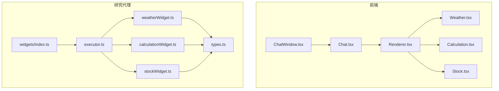
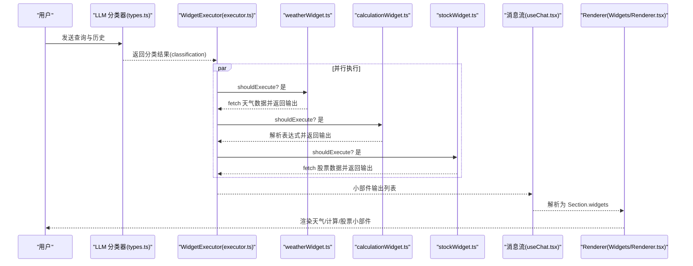
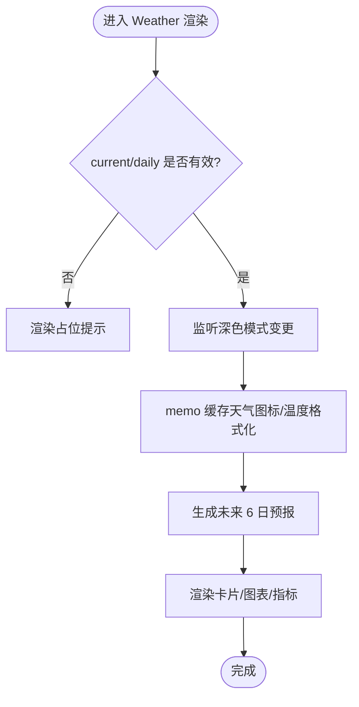
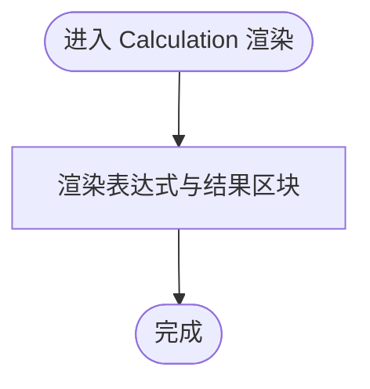
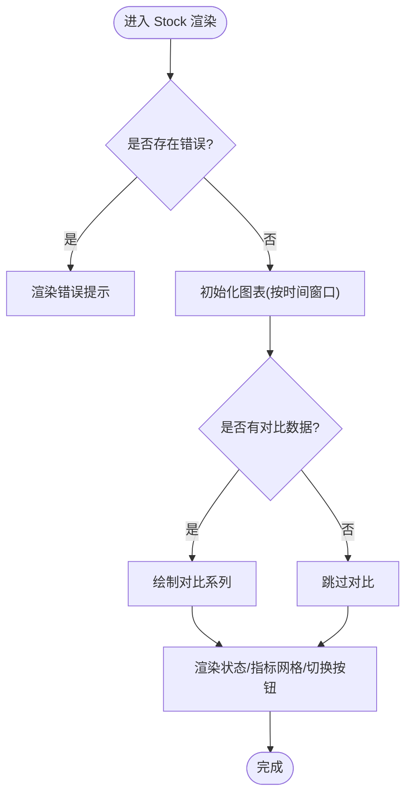
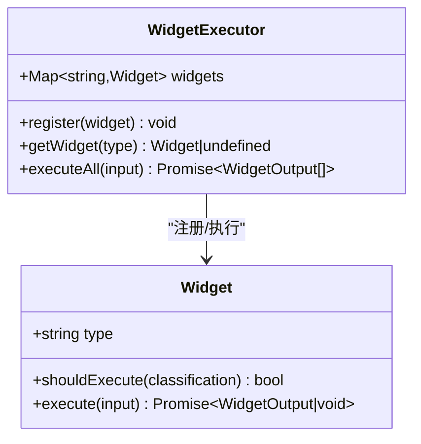
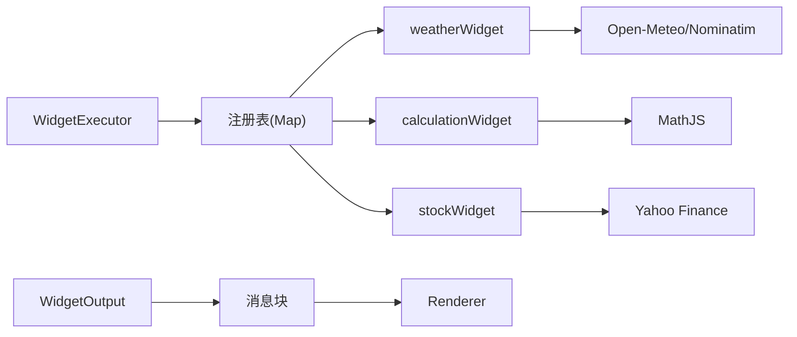

# 小部件系统

<cite>
**本文档引用的文件**
- [src/components/Widgets/Weather.tsx](file://src/components/Widgets/Weather.tsx)
- [src/components/Widgets/Calculation.tsx](file://src/components/Widgets/Calculation.tsx)
- [src/components/Widgets/Stock.tsx](file://src/components/Widgets/Stock.tsx)
- [src/components/Widgets/Renderer.tsx](file://src/components/Widgets/Renderer.tsx)
- [src/lib/agents/search/widgets/weatherWidget.ts](file://src/lib/agents/search/widgets/weatherWidget.ts)
- [src/lib/agents/search/widgets/calculationWidget.ts](file://src/lib/agents/search/widgets/calculationWidget.ts)
- [src/lib/agents/search/widgets/stockWidget.ts](file://src/lib/agents/search/widgets/stockWidget.ts)
- [src/lib/agents/search/widgets/index.ts](file://src/lib/agents/search/widgets/index.ts)
- [src/lib/agents/search/widgets/executor.ts](file://src/lib/agents/search/widgets/executor.ts)
- [src/lib/agents/search/types.ts](file://src/lib/agents/search/types.ts)
- [src/components/ChatWindow.tsx](file://src/components/ChatWindow.tsx)
- [src/components/Chat.tsx](file://src/components/Chat.tsx)
- [src/lib/hooks/useChat.tsx](file://src/lib/hooks/useChat.tsx)
- [src/lib/middleware/adminAuth.ts](file://src/lib/middleware/adminAuth.ts)
</cite>

## 目录
1. [简介](#简介)
2. [项目结构](#项目结构)
3. [核心组件](#核心组件)
4. [架构总览](#架构总览)
5. [详细组件分析](#详细组件分析)
6. [依赖关系分析](#依赖关系分析)
7. [性能考量](#性能考量)
8. [故障排查指南](#故障排查指南)
9. [结论](#结论)
10. [附录：扩展开发指南](#附录扩展开发指南)

## 简介
本文件系统性梳理 Perplexica 的小部件系统，覆盖架构设计、组件组织、注册机制、生命周期与数据流控制；深入解析天气、计算、股票等内置小部件的实现原理；说明数据来源（外部 API 集成、实时更新、缓存策略）；提供扩展开发指南；阐述与主应用的集成模式（布局、尺寸与响应式）；并总结性能优化与安全权限要点。

## 项目结构
小部件系统由“前端渲染组件”和“后端/研究代理小部件”两部分组成：
- 前端渲染组件：Weather、Calculation、Stock 以及统一的 Renderer 负责根据消息中的小部件数据进行渲染。
- 后端/研究代理小部件：weatherWidget、calculationWidget、stockWidget 通过 LLM 分类结果决定是否触发，并调用外部 API 获取数据，最终以小部件块形式注入到消息中。

图表来源
- [src/components/ChatWindow.tsx](file://src/components/ChatWindow.tsx#L31-L34)
- [src/components/Chat.tsx](file://src/components/Chat.tsx#L1-L109)
- [src/components/Widgets/Renderer.tsx](file://src/components/Widgets/Renderer.tsx#L1-L77)
- [src/lib/agents/search/widgets/index.ts](file://src/lib/agents/search/widgets/index.ts#L1-L10)
- [src/lib/agents/search/widgets/executor.ts](file://src/lib/agents/search/widgets/executor.ts#L1-L36)
- [src/lib/agents/search/widgets/weatherWidget.ts](file://src/lib/agents/search/widgets/weatherWidget.ts#L1-L204)
- [src/lib/agents/search/widgets/calculationWidget.ts](file://src/lib/agents/search/widgets/calculationWidget.ts#L1-L72)
- [src/lib/agents/search/widgets/stockWidget.ts](file://src/lib/agents/search/widgets/stockWidget.ts#L1-L435)
- [src/lib/agents/search/types.ts](file://src/lib/agents/search/types.ts#L33-L43)

章节来源
- [src/components/ChatWindow.tsx](file://src/components/ChatWindow.tsx#L31-L34)
- [src/components/Chat.tsx](file://src/components/Chat.tsx#L1-L109)
- [src/components/Widgets/Renderer.tsx](file://src/components/Widgets/Renderer.tsx#L1-L77)
- [src/lib/agents/search/widgets/index.ts](file://src/lib/agents/search/widgets/index.ts#L1-L10)
- [src/lib/agents/search/widgets/executor.ts](file://src/lib/agents/search/widgets/executor.ts#L1-L36)
- [src/lib/agents/search/widgets/weatherWidget.ts](file://src/lib/agents/search/widgets/weatherWidget.ts#L1-L204)
- [src/lib/agents/search/widgets/calculationWidget.ts](file://src/lib/agents/search/widgets/calculationWidget.ts#L1-L72)
- [src/lib/agents/search/widgets/stockWidget.ts](file://src/lib/agents/search/widgets/stockWidget.ts#L1-L435)
- [src/lib/agents/search/types.ts](file://src/lib/agents/search/types.ts#L33-L43)

## 核心组件
- 小部件类型与消息结构
  - 小部件在消息块中以类型化对象存在，前端通过 Renderer 根据 widgetType 进行分发渲染。
  - 类型定义位于 ChatWindow.tsx 的 Widget 接口与 useChat.tsx 的 Section 中的 widgets 字段。
- 渲染器
  - Renderer 统一接收小部件数组，按类型映射到具体组件（Weather、Calculation、Stock），并传递参数。
- 执行器与注册
  - WidgetExecutor 提供注册表，按分类结果并发执行符合条件的小部件，返回标准化输出。
- 内置小部件
  - 天气：基于 Open-Meteo 与 Nominatim，支持位置或坐标查询，返回当前与未来多日预报。
  - 计算：使用数学表达式解析库，提取表达式并计算结果。
  - 股票：使用 Yahoo Finance 客户端，获取多周期价格序列与关键指标，支持对比图。

章节来源
- [src/components/Widgets/Renderer.tsx](file://src/components/Widgets/Renderer.tsx#L7-L74)
- [src/components/ChatWindow.tsx](file://src/components/ChatWindow.tsx#L31-L34)
- [src/lib/hooks/useChat.tsx](file://src/lib/hooks/useChat.tsx#L22-L29)
- [src/lib/agents/search/widgets/executor.ts](file://src/lib/agents/search/widgets/executor.ts#L3-L34)
- [src/lib/agents/search/widgets/index.ts](file://src/lib/agents/search/widgets/index.ts#L1-L10)

## 架构总览
小部件系统遵循“分类驱动 + 并行执行 + 流式注入”的工作流：
- 分类阶段：LLM 输出分类结果，决定是否显示天气、股票、计算小部件。
- 执行阶段：WidgetExecutor 并发执行已注册的小部件，每个小部件负责拉取外部数据并生成标准化输出。
- 注入阶段：后端将小部件块写入消息响应流，前端在 useChat 中解析为 Section，Renderer 渲染对应组件。

图表来源
- [src/lib/agents/search/types.ts](file://src/lib/agents/search/types.ts#L52-L63)
- [src/lib/agents/search/widgets/executor.ts](file://src/lib/agents/search/widgets/executor.ts#L14-L33)
- [src/lib/agents/search/widgets/weatherWidget.ts](file://src/lib/agents/search/widgets/weatherWidget.ts#L55-L74)
- [src/lib/agents/search/widgets/calculationWidget.ts](file://src/lib/agents/search/widgets/calculationWidget.ts#L35-L56)
- [src/lib/agents/search/widgets/stockWidget.ts](file://src/lib/agents/search/widgets/stockWidget.ts#L51-L72)
- [src/lib/hooks/useChat.tsx](file://src/lib/hooks/useChat.tsx#L328-L403)
- [src/components/Widgets/Renderer.tsx](file://src/components/Widgets/Renderer.tsx#L7-L74)

## 详细组件分析

### 天气小部件（Weather）
- 数据模型
  - 当前天气与每日预报字段来自 Open-Meteo API；Renderer 通过 location、current、daily、timezone 参数渲染。
- 渲染特性
  - 动态背景渐变（白天/夜晚/明暗主题组合）、风速/湿度/体感温度等指标卡片、未来数日天气概览。
  - 单位制切换（摄氏/华氏）与风速单位换算。
- 生命周期与状态
  - 监听根节点 class 切换以适配深色模式；使用 useMemo 缓存天气图标与温度格式化结果。
- 外部数据与错误处理
  - 位置名通过 Nominatim 反向地理编码；失败时返回占位提示。
- 性能与可用性
  - 仅在有有效数据时渲染；对空数据快速降级。

图表来源
- [src/components/Widgets/Weather.tsx](file://src/components/Widgets/Weather.tsx#L223-L420)

章节来源
- [src/components/Widgets/Weather.tsx](file://src/components/Widgets/Weather.tsx#L7-L423)
- [src/components/Widgets/Renderer.tsx](file://src/components/Widgets/Renderer.tsx#L10-L19)

### 计算小部件（Calculation）
- 数据模型
  - 表达式字符串与计算结果，Renderer 以等宽字体与分层排版展示。
- 渲染特性
  - 表达式与结果分别以语义化标题与大号数字呈现，强调可读性。
- 性能与可用性
  - 无副作用，渲染开销极低。

图表来源
- [src/components/Widgets/Calculation.tsx](file://src/components/Widgets/Calculation.tsx#L10-L47)
- [src/components/Widgets/Renderer.tsx](file://src/components/Widgets/Renderer.tsx#L20-L27)

章节来源
- [src/components/Widgets/Calculation.tsx](file://src/components/Widgets/Calculation.tsx#L1-L47)
- [src/components/Widgets/Renderer.tsx](file://src/components/Widgets/Renderer.tsx#L20-L27)

### 股票小部件（Stock）
- 数据模型
  - 股票基本信息、市场状态、分时与多周期价格序列、对比图数据、财务指标等。
- 渲染特性
  - 使用轻量级图表库绘制基线/折线图；支持时间窗口切换；实时/盘前/盘后状态高亮；关键指标网格展示。
- 生命周期与状态
  - 监听深色模式；响应窗口大小变化；清理图表实例与事件监听。
- 外部数据与错误处理
  - 使用 Yahoo Finance 客户端获取报价与图表；失败时返回错误信息。
- 性能与可用性
  - 图表按需渲染；对比图颜色固定；NaN/空值安全处理。

图表来源
- [src/components/Widgets/Stock.tsx](file://src/components/Widgets/Stock.tsx#L85-L252)
- [src/components/Widgets/Stock.tsx](file://src/components/Widgets/Stock.tsx#L281-L514)

章节来源
- [src/components/Widgets/Stock.tsx](file://src/components/Widgets/Stock.tsx#L1-L518)
- [src/components/Widgets/Renderer.tsx](file://src/components/Widgets/Renderer.tsx#L28-L69)

### 小部件执行器与注册（WidgetExecutor）
- 注册机制
  - 在入口模块中注册 weatherWidget、calculationWidget、stockWidget。
- 执行流程
  - 并发遍历注册表，依据分类结果决定是否执行；捕获异常并记录日志；聚合输出。
- 类型契约
  - Widget 接口包含 type、shouldExecute、execute；输出为标准化的 WidgetOutput。

图表来源
- [src/lib/agents/search/widgets/executor.ts](file://src/lib/agents/search/widgets/executor.ts#L3-L34)
- [src/lib/agents/search/types.ts](file://src/lib/agents/search/types.ts#L33-L43)

章节来源
- [src/lib/agents/search/widgets/index.ts](file://src/lib/agents/search/widgets/index.ts#L1-L10)
- [src/lib/agents/search/widgets/executor.ts](file://src/lib/agents/search/widgets/executor.ts#L1-L36)
- [src/lib/agents/search/types.ts](file://src/lib/agents/search/types.ts#L33-L43)

### 外部数据获取与集成点
- 天气
  - 位置名 → Nominatim 地理编码；经纬度 → Open-Meteo 历史/小时/每日预报。
- 计算
  - 数学表达式 → 数学解析库求值。
- 股票
  - 名称/代码 → Yahoo Finance 搜索/报价/多周期图表；支持最多 3 支对比股票。
- 主应用集成
  - 小部件块随消息流注入；前端 useChat 解析为 Section.widgets；Renderer 渲染。

章节来源
- [src/lib/agents/search/widgets/weatherWidget.ts](file://src/lib/agents/search/widgets/weatherWidget.ts#L78-L192)
- [src/lib/agents/search/widgets/calculationWidget.ts](file://src/lib/agents/search/widgets/calculationWidget.ts#L39-L67)
- [src/lib/agents/search/widgets/stockWidget.ts](file://src/lib/agents/search/widgets/stockWidget.ts#L75-L431)
- [src/lib/hooks/useChat.tsx](file://src/lib/hooks/useChat.tsx#L328-L403)

## 依赖关系分析
- 组件耦合
  - Renderer 与具体小部件组件强耦合（switch 分支），便于扩展但不利于动态注册。
  - 建议采用工厂/映射表替代硬编码分支，提升可维护性。
- 执行器与小部件
  - 执行器通过 Map 存储小部件，注册集中化，便于新增/禁用。
- 前后端协作
  - 分类结果决定执行范围；小部件输出统一为 {type, llmContext, data}，便于前端渲染与上下文注入。

图表来源
- [src/lib/agents/search/widgets/executor.ts](file://src/lib/agents/search/widgets/executor.ts#L3-L12)
- [src/lib/agents/search/widgets/index.ts](file://src/lib/agents/search/widgets/index.ts#L6-L8)
- [src/lib/agents/search/widgets/weatherWidget.ts](file://src/lib/agents/search/widgets/weatherWidget.ts#L108-L192)
- [src/lib/agents/search/widgets/calculationWidget.ts](file://src/lib/agents/search/widgets/calculationWidget.ts#L58-L67)
- [src/lib/agents/search/widgets/stockWidget.ts](file://src/lib/agents/search/widgets/stockWidget.ts#L407-L431)
- [src/components/Widgets/Renderer.tsx](file://src/components/Widgets/Renderer.tsx#L7-L74)

章节来源
- [src/lib/agents/search/widgets/executor.ts](file://src/lib/agents/search/widgets/executor.ts#L1-L36)
- [src/lib/agents/search/widgets/index.ts](file://src/lib/agents/search/widgets/index.ts#L1-L10)
- [src/components/Widgets/Renderer.tsx](file://src/components/Widgets/Renderer.tsx#L1-L77)

## 性能考量
- 并行执行
  - WidgetExecutor 使用 Promise.all 并发执行多个小部件，缩短整体等待时间。
- 渲染优化
  - Weather 使用 useMemo 缓存图标与格式化结果；Stock 在渲染后清理图表实例与事件监听，避免内存泄漏。
- 数据体积
  - 天气/股票仅传输必要字段；股票多周期数据按需选择时间窗口。
- 实时性
  - 股票支持盘前/盘后状态；天气按分钟级小时数据展示。
- 建议
  - Renderer 可引入动态导入与懒加载，减少首屏包体。
  - 对高频小部件增加本地缓存策略（如短期 TTL）以降低外部依赖压力。

[本节为通用性能建议，不直接分析特定文件]

## 故障排查指南
- 常见问题
  - 天气：位置名无法解析或地理编码失败；Open-Meteo 接口不可用。
  - 计算：表达式无效或解析失败。
  - 股票：搜索不到股票、报价为空、图表数据缺失。
- 错误处理
  - 小部件内部捕获异常并返回错误字段；前端渲染器针对错误路径进行降级显示。
- 日志与定位
  - 执行器在捕获异常时打印小部件类型与错误堆栈，便于定位。
- 权限与安全
  - 管理员接口使用中间件校验 Bearer Token；小部件数据流不涉及敏感权限，但应避免在小部件中暴露内部凭据。

章节来源
- [src/lib/agents/search/widgets/weatherWidget.ts](file://src/lib/agents/search/widgets/weatherWidget.ts#L192-L201)
- [src/lib/agents/search/widgets/calculationWidget.ts](file://src/lib/agents/search/widgets/calculationWidget.ts#L54-L56)
- [src/lib/agents/search/widgets/stockWidget.ts](file://src/lib/agents/search/widgets/stockWidget.ts#L421-L431)
- [src/lib/agents/search/widgets/executor.ts](file://src/lib/agents/search/widgets/executor.ts#L26-L28)
- [src/lib/middleware/adminAuth.ts](file://src/lib/middleware/adminAuth.ts#L13-L40)

## 结论
Perplexica 的小部件系统通过“分类驱动 + 并行执行 + 流式注入”的模式，实现了天气、计算、股票等多源数据的统一渲染。前端渲染器与后端执行器职责清晰，具备良好的扩展性。建议后续在渲染层引入动态导入与懒加载、在执行层增加缓存策略与更细粒度的错误恢复，以进一步提升性能与稳定性。

[本节为总结性内容，不直接分析特定文件]

## 附录：扩展开发指南
- 新增小部件步骤
  1) 定义小部件类型与参数
     - 在类型文件中声明小部件类型与 shouldExecute 条件。
     - 示例参考：[src/lib/agents/search/types.ts](file://src/lib/agents/search/types.ts#L52-L63)
  2) 实现执行器
     - 编写 shouldExecute 与 execute，调用外部 API 获取数据，返回标准化输出。
     - 示例参考：[src/lib/agents/search/widgets/weatherWidget.ts](file://src/lib/agents/search/widgets/weatherWidget.ts#L55-L74)
  3) 注册执行器
     - 在入口模块注册新小部件。
     - 示例参考：[src/lib/agents/search/widgets/index.ts](file://src/lib/agents/search/widgets/index.ts#L6-L8)
  4) 前端渲染
     - 在 Renderer 中添加新的 case 分支，传递参数并渲染。
     - 示例参考：[src/components/Widgets/Renderer.tsx](file://src/components/Widgets/Renderer.tsx#L7-L74)
  5) 数据流集成
     - 确保后端将小部件块写入消息流，前端 useChat 解析为 Section.widgets。
     - 示例参考：[src/lib/hooks/useChat.tsx](file://src/lib/hooks/useChat.tsx#L328-L403)
- 设计建议
  - 使用工厂/映射表替代硬编码分支，便于动态注册与测试。
  - 对外部 API 增加超时与重试策略，提升鲁棒性。
  - 对渲染组件增加边界检查与默认值，避免空数据导致崩溃。

章节来源
- [src/lib/agents/search/types.ts](file://src/lib/agents/search/types.ts#L52-L63)
- [src/lib/agents/search/widgets/weatherWidget.ts](file://src/lib/agents/search/widgets/weatherWidget.ts#L55-L74)
- [src/lib/agents/search/widgets/index.ts](file://src/lib/agents/search/widgets/index.ts#L6-L8)
- [src/components/Widgets/Renderer.tsx](file://src/components/Widgets/Renderer.tsx#L7-L74)
- [src/lib/hooks/useChat.tsx](file://src/lib/hooks/useChat.tsx#L328-L403)