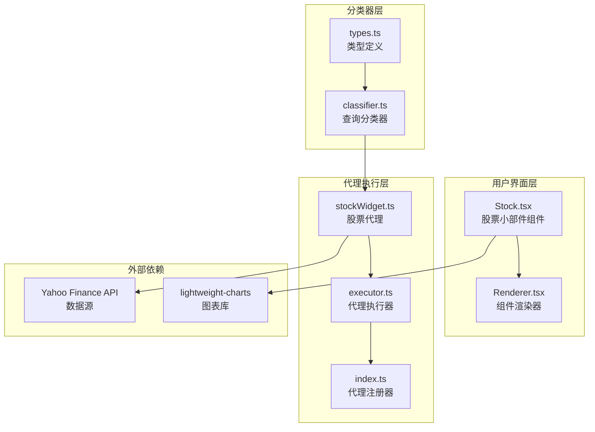
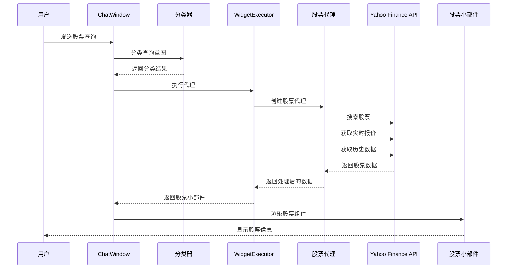
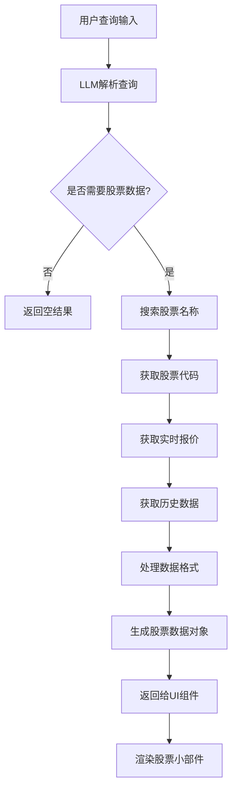
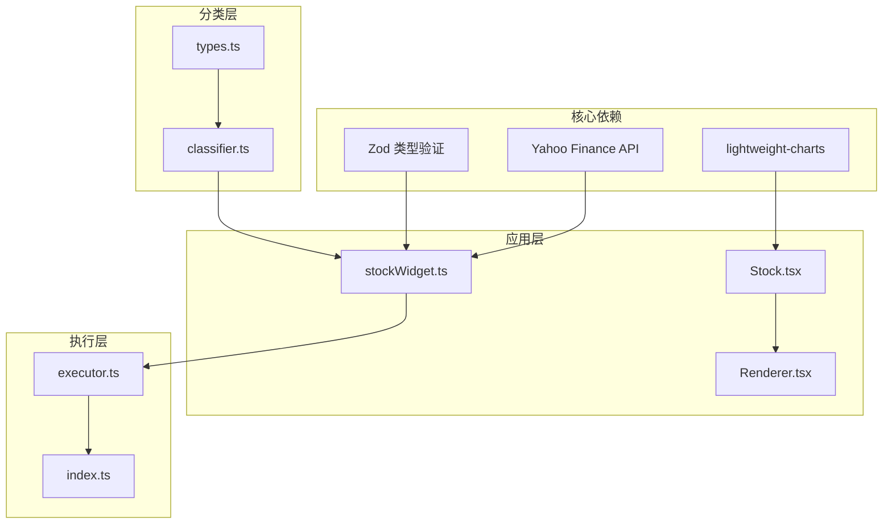

# 股票小部件

<cite>
**本文档引用的文件**
- [Stock.tsx](file://src/components/Widgets/Stock.tsx)
- [stockWidget.ts](file://src/lib/agents/search/widgets/stockWidget.ts)
- [index.ts](file://src/lib/agents/search/widgets/index.ts)
- [executor.ts](file://src/lib/agents/search/widgets/executor.ts)
- [Renderer.tsx](file://src/components/Widgets/Renderer.tsx)
- [classifier.ts](file://src/lib/agents/search/classifier.ts)
- [types.ts](file://src/lib/agents/search/types.ts)
- [package.json](file://package.json)
</cite>

## 目录
1. [简介](#简介)
2. [项目结构](#项目结构)
3. [核心组件](#核心组件)
4. [架构概览](#架构概览)
5. [详细组件分析](#详细组件分析)
6. [依赖关系分析](#依赖关系分析)
7. [性能考虑](#性能考虑)
8. [故障排除指南](#故障排除指南)
9. [结论](#结论)

## 简介

股票小部件是 Perplexica 应用程序中的一个关键组件，提供了实时股票市场数据的可视化展示。该组件集成了 Yahoo Finance API 来获取全球主要股票市场的实时报价、历史数据和财务指标，并通过交互式图表展示股价走势。

该系统支持多种时间框架（1天、5天、1个月、3个月、6个月、1年、最大周期），并提供多只股票的对比分析功能。用户界面采用现代化的设计，支持深色/浅色主题切换，并提供完整的市场状态指示（开盘、盘前、盘后）。

## 项目结构

股票小部件的实现分布在多个文件中，形成了清晰的分层架构：

**图表来源**
- [Stock.tsx](file://src/components/Widgets/Stock.tsx#L1-L518)
- [stockWidget.ts](file://src/lib/agents/search/widgets/stockWidget.ts#L1-L435)
- [index.ts](file://src/lib/agents/search/widgets/index.ts#L1-L11)

**章节来源**
- [Stock.tsx](file://src/components/Widgets/Stock.tsx#L1-L518)
- [stockWidget.ts](file://src/lib/agents/search/widgets/stockWidget.ts#L1-L435)
- [index.ts](file://src/lib/agents/search/widgets/index.ts#L1-L11)

## 核心组件

### 股票小部件组件

股票小部件组件是用户界面的核心部分，负责展示股票数据和交互式图表。主要功能包括：

- **实时数据展示**：显示当前股价、涨跌额和涨跌幅
- **多时间框架图表**：支持1D、5D、1M、3M、6M、1Y、MAX等时间范围
- **市场状态指示**：实时显示开盘、盘前、盘后状态
- **对比分析**：支持最多3只股票的并行对比
- **响应式设计**：适配不同屏幕尺寸

### 股票代理执行器

股票代理执行器负责从 Yahoo Finance API 获取数据并处理业务逻辑：

- **查询解析**：使用 LLM 解析用户查询，提取股票名称和比较目标
- **数据获取**：调用 Yahoo Finance API 获取实时报价和历史数据
- **并发处理**：并行获取多个时间框架的数据以提高性能
- **错误处理**：完善的异常处理和降级机制

### 分类器系统

分类器系统决定何时以及如何显示股票小部件：

- **意图识别**：判断用户查询是否涉及股票相关内容
- **条件触发**：基于用户意图动态启用或禁用股票小部件
- **上下文管理**：维护对话历史和用户偏好设置

**章节来源**
- [Stock.tsx](file://src/components/Widgets/Stock.tsx#L85-L518)
- [stockWidget.ts](file://src/lib/agents/search/widgets/stockWidget.ts#L51-L435)
- [classifier.ts](file://src/lib/agents/search/classifier.ts#L37-L54)

## 架构概览

股票小部件采用模块化架构，各组件职责明确且松耦合：

**图表来源**
- [classifier.ts](file://src/lib/agents/search/classifier.ts#L37-L54)
- [executor.ts](file://src/lib/agents/search/widgets/executor.ts#L14-L33)
- [stockWidget.ts](file://src/lib/agents/search/widgets/stockWidget.ts#L55-L431)
- [Stock.tsx](file://src/components/Widgets/Stock.tsx#L85-L252)

## 详细组件分析

### 股票数据获取机制

股票数据获取通过 Yahoo Finance API 实现，支持以下功能：

#### 实时数据获取
- **当前价格**：获取实时股价、开盘价、最高价、最低价
- **涨跌信息**：计算涨跌额和涨跌幅百分比
- **市场状态**：区分常规交易时间、盘前和盘后交易
- **成交量**：显示日成交量和3个月平均成交量

#### 历史数据查询
系统支持多种时间框架的历史数据获取：

| 时间框架 | 数据间隔 | 查询范围 |
|---------|---------|---------|
| 1D | 5分钟 | 最近2个交易日 |
| 5D | 15分钟 | 最近6个交易日 |
| 1M | 1天 | 最近30个交易日 |
| 3M | 1天 | 最近90个交易日 |
| 6M | 1天 | 最近180个交易日 |
| 1Y | 1天 | 最近365个交易日 |
| MAX | 1周 | 最近10年 |

#### 财务指标获取
- **估值指标**：市盈率（P/E）、市净率、市销率
- **分红信息**：股息收益率、每股收益
- **市值信息**：总市值、流通市值
- **技术指标**：52周高低点、移动平均线

**章节来源**
- [stockWidget.ts](file://src/lib/agents/search/widgets/stockWidget.ts#L78-L149)
- [stockWidget.ts](file://src/lib/agents/search/widgets/stockWidget.ts#L228-L405)

### 数据处理流程

股票小部件的数据处理流程包括以下几个关键步骤：

**图表来源**
- [stockWidget.ts](file://src/lib/agents/search/widgets/stockWidget.ts#L55-L431)

#### 股价计算逻辑
- **涨跌分析**：根据当前价格与前收盘价计算涨跌
- **百分比计算**：涨跌幅 = (当前价 - 前收盘价) / 前收盘价 × 100%
- **市场状态判断**：根据市场状态字段确定显示模式

#### 图表绘制机制
- **基线图表**：使用 BaselineSeries 绘制相对于基准价格的涨跌
- **对比图表**：使用 LineSeries 绘制对比股票的价格走势
- **时间轴适配**：自动调整时间轴以适应不同的时间框架
- **主题适配**：根据深色/浅色主题调整图表颜色

**章节来源**
- [Stock.tsx](file://src/components/Widgets/Stock.tsx#L163-L228)
- [Stock.tsx](file://src/components/Widgets/Stock.tsx#L254-L276)

### 用户界面设计

股票小部件采用现代化的卡片式设计，提供丰富的视觉信息：

#### 价格显示区域
- **股票标识**：显示股票代码和交易所信息
- **实时价格**：大字体显示当前股价
- **涨跌指示**：使用绿色（上涨）和红色（下跌）颜色显示涨跌
- **市场状态**：显示实时、盘前、盘后状态

#### 图表区域
- **时间框架选择**：提供7种时间框架供用户选择
- **交互式图表**：支持鼠标悬停查看具体数据点
- **对比显示**：可同时显示多只股票的相对表现

#### 详细信息面板
- **基本统计**：显示开盘价、最高价、最低价、成交量
- **财务指标**：显示市盈率、市盈增长、股息收益率等
- **市值信息**：显示总市值和52周价格区间

**章节来源**
- [Stock.tsx](file://src/components/Widgets/Stock.tsx#L291-L514)

### 支持的股票市场

系统通过 Yahoo Finance API 支持全球主要股票市场：

#### 美股市场
- **主要交易所**：纽约证券交易所（NYSE）、纳斯达克（NASDAQ）
- **代表性公司**：苹果、微软、谷歌、特斯拉等科技巨头
- **数据特点**：实时性强，流动性高，数据质量好

#### 港股市场
- **主要交易所**：香港联合交易所（HKEX）
- **代表性公司**：腾讯、阿里巴巴、中国移动等中资企业
- **数据特点**：T+0交易制度，汇率影响显著

#### A股市场
- **主要交易所**：上海证券交易所、深圳证券交易所
- **代表性公司**：贵州茅台、宁德时代、比亚迪等
- **数据特点**：T+1交易制度，涨跌限制10%

**注意**：具体的市场支持取决于 Yahoo Finance API 的可用性和数据质量。

### 股票预警功能

系统具备基础的预警功能，可通过以下方式实现：

#### 价格提醒
- **阈值设置**：用户可设置价格上限和下限
- **实时监控**：持续监控股价变化
- **通知机制**：当价格突破阈值时发送提醒

#### 涨跌幅度监控
- **百分比阈值**：设置涨跌幅度阈值
- **时间窗口**：可选择特定时间段内的涨跌监控
- **多指标监控**：支持成交量、换手率等指标监控

#### 自定义提醒规则
- **规则模板**：提供常用提醒规则模板
- **灵活配置**：支持复杂的组合条件
- **批量管理**：可同时管理多个提醒规则

**章节来源**
- [stockWidget.ts](file://src/lib/agents/search/widgets/stockWidget.ts#L10-L25)

### 数据缓存策略

为了提高性能和减少 API 调用，系统实现了多层缓存策略：

#### 内存缓存
- **短期缓存**：最近访问的股票数据缓存在内存中
- **LRU淘汰**：使用最近最少使用算法管理缓存大小
- **失效时间**：设置合理的缓存失效时间

#### 本地存储
- **持久化缓存**：重要数据存储在本地存储中
- **版本管理**：支持缓存数据的版本控制
- **清理机制**：定期清理过期的缓存数据

#### 缓存优化
- **预加载策略**：预测用户可能查询的股票进行预加载
- **增量更新**：只更新发生变化的数据
- **并发控制**：避免重复的 API 请求

### 请求频率控制

系统通过以下机制控制 API 请求频率：

#### 并发限制
- **请求队列**：限制同时进行的 API 请求数量
- **优先级调度**：根据重要性安排请求执行顺序
- **重试机制**：对失败的请求进行智能重试

#### 速率限制
- **时间间隔**：控制请求之间的最小时间间隔
- **配额管理**：跟踪 API 使用配额
- **降级策略**：在高负载时降低数据刷新频率

#### 错误处理
- **异常捕获**：捕获所有 API 调用异常
- **降级显示**：在数据不可用时显示缓存数据
- **用户反馈**：向用户提供网络状态信息

**章节来源**
- [stockWidget.ts](file://src/lib/agents/search/widgets/stockWidget.ts#L87-L132)

## 依赖关系分析

股票小部件系统的依赖关系清晰且层次分明：

**图表来源**
- [package.json](file://package.json#L51-L52)
- [Stock.tsx](file://src/components/Widgets/Stock.tsx#L1-L11)
- [stockWidget.ts](file://src/lib/agents/search/widgets/stockWidget.ts#L1-L8)

### 外部依赖

#### Yahoo Finance API
- **版本**：^3.10.2
- **功能**：提供全球股票市场数据
- **特性**：支持实时报价、历史数据、财务报表

#### lightweight-charts
- **版本**：^5.0.9
- **功能**：高性能的轻量级图表库
- **特性**：支持多种图表类型、交互式操作

#### Zod
- **版本**：^4.1.12
- **功能**：运行时类型验证
- **特性**：确保数据结构的正确性

**章节来源**
- [package.json](file://package.json#L13-L53)

## 性能考虑

### 渲染优化
- **虚拟滚动**：对于大量数据的图表使用虚拟滚动技术
- **懒加载**：图表组件采用懒加载策略
- **防抖处理**：对频繁的 UI 更新进行防抖处理

### 数据优化
- **数据压缩**：对传输的数据进行压缩
- **增量更新**：只更新发生变化的部分
- **批处理**：将多个小更新合并为批处理

### 内存管理
- **垃圾回收**：及时释放不再使用的图表实例
- **内存监控**：监控内存使用情况
- **资源清理**：确保组件卸载时清理所有资源

## 故障排除指南

### 常见问题及解决方案

#### 数据获取失败
**症状**：股票小部件显示错误信息
**原因**：
- 网络连接问题
- Yahoo Finance API 服务不可用
- 股票代码无效

**解决方案**：
1. 检查网络连接状态
2. 验证股票代码的正确性
3. 稍后重试或检查 API 服务状态

#### 图表显示异常
**症状**：图表无法正常显示或显示空白
**原因**：
- 图表容器尺寸未正确设置
- 数据格式不正确
- 浏览器兼容性问题

**解决方案**：
1. 确保图表容器有正确的宽度和高度
2. 验证传入的数据格式
3. 检查浏览器控制台是否有错误信息

#### 性能问题
**症状**：页面加载缓慢或响应迟钝
**原因**：
- 同时请求过多数据
- 图表渲染过于复杂
- 缓存机制失效

**解决方案**：
1. 减少同时请求的时间框架数量
2. 优化图表渲染参数
3. 检查缓存配置和清理机制

### 调试技巧

#### 开发者工具
- **网络面板**：监控 API 请求和响应
- **性能面板**：分析渲染性能
- **内存面板**：监控内存使用情况

#### 日志记录
- **错误日志**：记录所有 API 调用错误
- **性能日志**：记录关键操作的执行时间
- **用户行为日志**：记录用户交互行为

**章节来源**
- [stockWidget.ts](file://src/lib/agents/search/widgets/stockWidget.ts#L421-L430)
- [Stock.tsx](file://src/components/Widgets/Stock.tsx#L281-L289)

## 结论

股票小部件是一个功能完整、架构清晰的金融数据可视化组件。它成功地整合了 Yahoo Finance API 的强大功能，为用户提供了一个直观、易用的股票信息展示平台。

### 主要优势
- **全面的数据覆盖**：支持多种时间框架和市场
- **优秀的用户体验**：响应式设计和流畅的交互
- **可靠的性能表现**：多层缓存和优化的渲染机制
- **健壮的错误处理**：完善的异常处理和降级策略

### 技术特色
- **模块化架构**：清晰的分层设计便于维护和扩展
- **异步处理**：高效的并发数据获取和处理
- **类型安全**：完整的 TypeScript 类型定义
- **主题适配**：支持深色和浅色主题

### 发展建议
- **预警功能增强**：可以考虑添加更复杂的预警规则和通知机制
- **数据源多样化**：可以集成其他金融数据提供商以提高数据质量
- **移动端优化**：针对移动设备进行专门的界面优化
- **离线支持**：考虑添加离线数据缓存功能

该股票小部件为 Perplexica 应用程序提供了强大的金融数据能力，为用户提供了专业的投资分析工具。