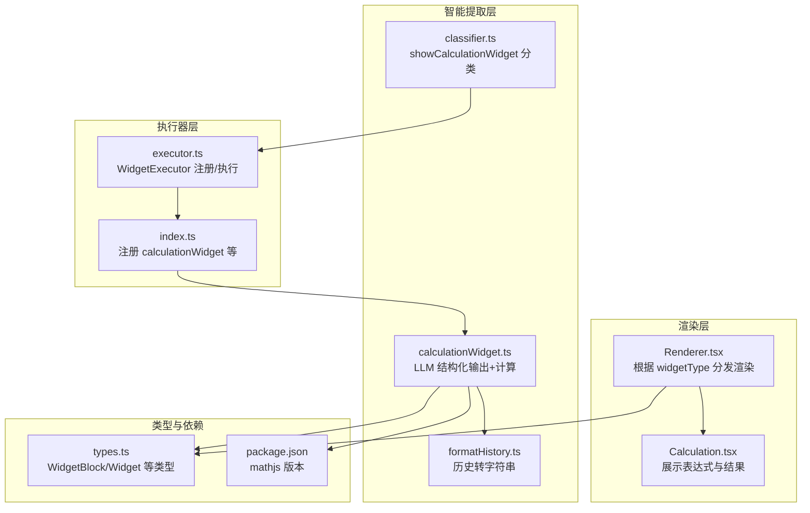
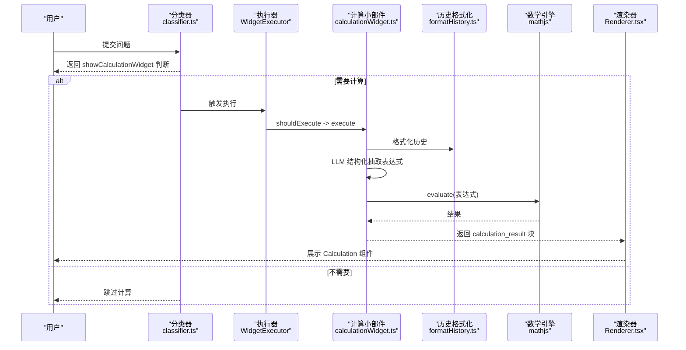
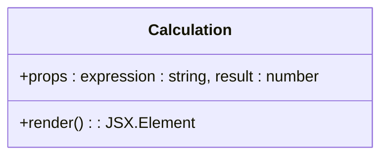
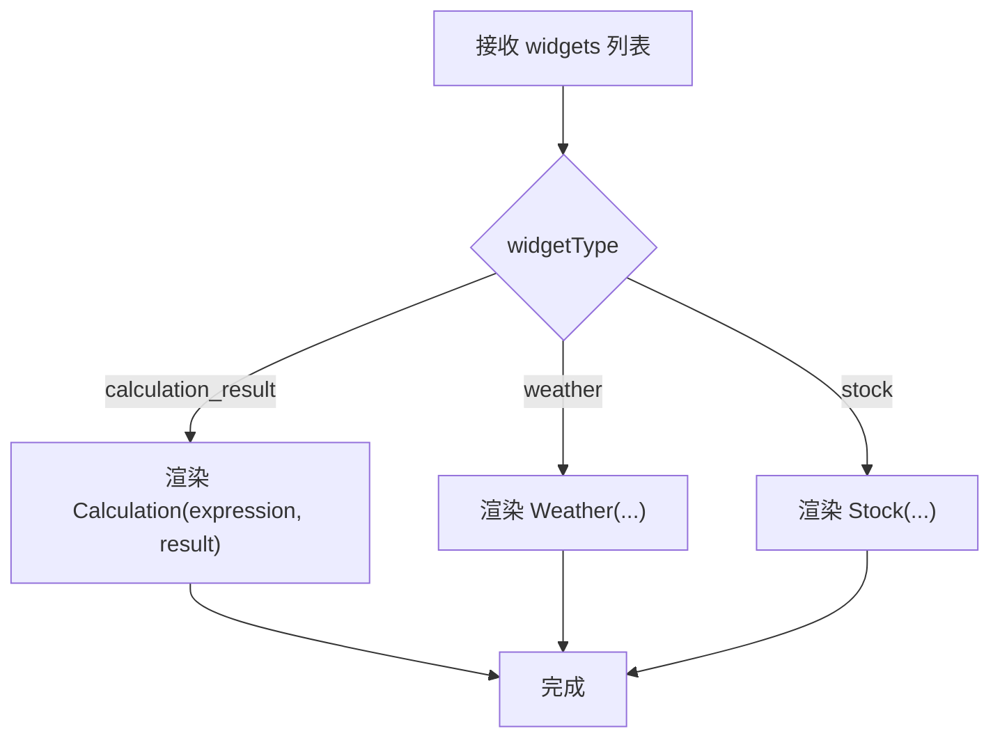
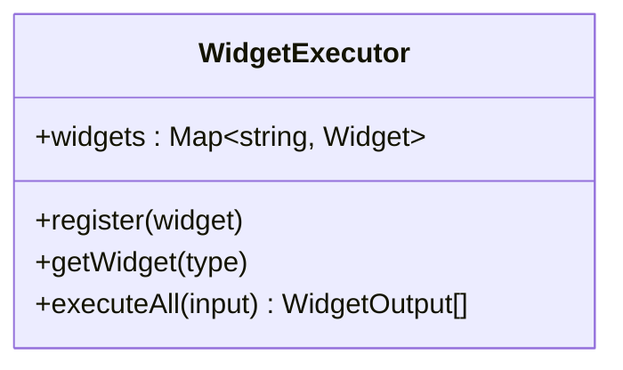
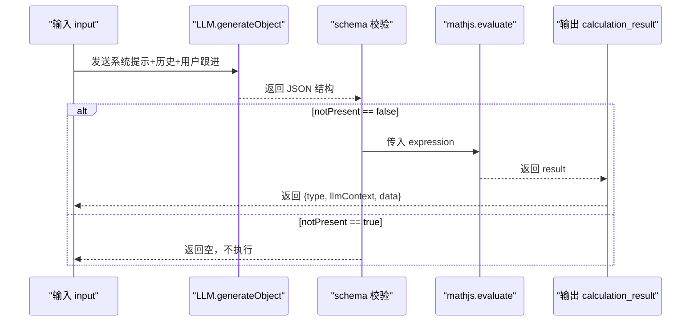
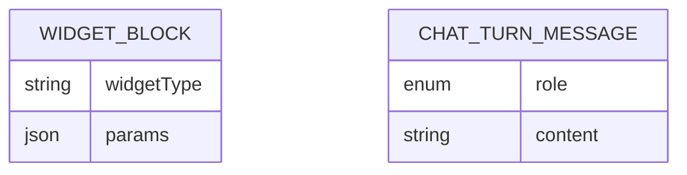
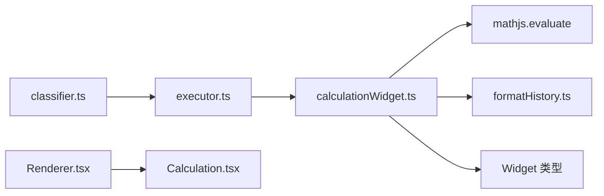

# 计算小部件

<cite>
**本文引用的文件**
- [src/components/Widgets/Calculation.tsx](file://src/components/Widgets/Calculation.tsx)
- [src/components/Widgets/Renderer.tsx](file://src/components/Widgets/Renderer.tsx)
- [src/lib/agents/search/widgets/calculationWidget.ts](file://src/lib/agents/search/widgets/calculationWidget.ts)
- [src/lib/agents/search/widgets/executor.ts](file://src/lib/agents/search/widgets/executor.ts)
- [src/lib/agents/search/widgets/index.ts](file://src/lib/agents/search/widgets/index.ts)
- [src/lib/utils/formatHistory.ts](file://src/lib/utils/formatHistory.ts)
- [src/lib/prompts/search/classifier.ts](file://src/lib/prompts/search/classifier.ts)
- [src/lib/types.ts](file://src/lib/types.ts)
- [package.json](file://package.json)
</cite>

## 目录
1. [简介](#简介)
2. [项目结构](#项目结构)
3. [核心组件](#核心组件)
4. [架构总览](#架构总览)
5. [详细组件分析](#详细组件分析)
6. [依赖关系分析](#依赖关系分析)
7. [性能考虑](#性能考虑)
8. [故障排查指南](#故障排查指南)
9. [结论](#结论)
10. [附录：使用示例与最佳实践](#附录使用示例与最佳实践)

## 简介
本技术文档围绕“计算小部件”展开，系统性阐述其在对话式 AI 场景中的作用与实现：从用户意图识别到表达式提取、从数学表达式解析与计算到结果渲染与展示。计算小部件通过 LLM 的结构化输出能力，自动判断是否需要展示计算结果，并借助数学表达式引擎完成实时计算，最终以统一的 UI 小部件进行呈现。

## 项目结构
计算小部件相关代码主要分布在以下位置：
- 渲染层：负责将计算结果以 UI 组件形式展示
- 执行器层：统一注册与调度各类小部件
- 智能提取层：基于 LLM 的分类与表达式抽取
- 工具层：对话历史格式化等辅助逻辑
- 类型定义：统一的数据结构与块类型

图表来源
- [src/components/Widgets/Calculation.tsx](file://src/components/Widgets/Calculation.tsx#L1-L47)
- [src/components/Widgets/Renderer.tsx](file://src/components/Widgets/Renderer.tsx#L1-L46)
- [src/lib/agents/search/widgets/executor.ts](file://src/lib/agents/search/widgets/executor.ts#L1-L37)
- [src/lib/agents/search/widgets/index.ts](file://src/lib/agents/search/widgets/index.ts#L1-L10)
- [src/lib/agents/search/widgets/calculationWidget.ts](file://src/lib/agents/search/widgets/calculationWidget.ts#L1-L72)
- [src/lib/utils/formatHistory.ts](file://src/lib/utils/formatHistory.ts#L1-L13)
- [src/lib/prompts/search/classifier.ts](file://src/lib/prompts/search/classifier.ts#L33-L64)
- [src/lib/types.ts](file://src/lib/types.ts#L57-L64)
- [package.json](file://package.json#L33-L33)

章节来源
- [src/components/Widgets/Calculation.tsx](file://src/components/Widgets/Calculation.tsx#L1-L47)
- [src/components/Widgets/Renderer.tsx](file://src/components/Widgets/Renderer.tsx#L1-L46)
- [src/lib/agents/search/widgets/executor.ts](file://src/lib/agents/search/widgets/executor.ts#L1-L37)
- [src/lib/agents/search/widgets/index.ts](file://src/lib/agents/search/widgets/index.ts#L1-L10)
- [src/lib/agents/search/widgets/calculationWidget.ts](file://src/lib/agents/search/widgets/calculationWidget.ts#L1-L72)
- [src/lib/utils/formatHistory.ts](file://src/lib/utils/formatHistory.ts#L1-L13)
- [src/lib/prompts/search/classifier.ts](file://src/lib/prompts/search/classifier.ts#L33-L64)
- [src/lib/types.ts](file://src/lib/types.ts#L57-L64)
- [package.json](file://package.json#L33-L33)

## 核心组件
- 计算小部件渲染组件：负责以一致的 UI 展示表达式与结果，包含样式与本地化显示。
- 计算小部件执行器：统一注册与并行执行各类小部件，屏蔽具体实现差异。
- 计算小部件逻辑：通过 LLM 抽取数学表达式并调用数学引擎计算，生成标准化输出。
- 历史格式化工具：将对话历史转换为可被 LLM 识别的字符串，辅助上下文理解。
- 分类提示词：定义是否展示计算小部件的判断标准，决定是否触发计算流程。
- 类型系统：统一小部件块（WidgetBlock）与通用消息类型，保证跨模块一致性。
- 数学引擎依赖：使用 mathjs 进行表达式求值，版本由包管理文件声明。

章节来源
- [src/components/Widgets/Calculation.tsx](file://src/components/Widgets/Calculation.tsx#L10-L44)
- [src/lib/agents/search/widgets/executor.ts](file://src/lib/agents/search/widgets/executor.ts#L3-L34)
- [src/lib/agents/search/widgets/calculationWidget.ts](file://src/lib/agents/search/widgets/calculationWidget.ts#L35-L69)
- [src/lib/utils/formatHistory.ts](file://src/lib/utils/formatHistory.ts#L3-L10)
- [src/lib/prompts/search/classifier.ts](file://src/lib/prompts/search/classifier.ts#L33-L64)
- [src/lib/types.ts](file://src/lib/types.ts#L57-L64)
- [package.json](file://package.json#L33-L33)

## 架构总览
计算小部件的端到端流程如下：
- 用户输入经分类器判断是否需要展示计算小部件
- 若需要，则由计算小部件执行器调度计算小部件
- 计算小部件抽取表达式并调用数学引擎计算
- 输出以标准化块类型返回，渲染器根据类型分发至计算小部件 UI

图表来源
- [src/lib/prompts/search/classifier.ts](file://src/lib/prompts/search/classifier.ts#L33-L64)
- [src/lib/agents/search/widgets/executor.ts](file://src/lib/agents/search/widgets/executor.ts#L14-L33)
- [src/lib/agents/search/widgets/calculationWidget.ts](file://src/lib/agents/search/widgets/calculationWidget.ts#L37-L68)
- [src/lib/utils/formatHistory.ts](file://src/lib/utils/formatHistory.ts#L3-L10)
- [src/components/Widgets/Renderer.tsx](file://src/components/Widgets/Renderer.tsx#L20-L27)
- [src/components/Widgets/Calculation.tsx](file://src/components/Widgets/Calculation.tsx#L10-L44)

## 详细组件分析

### 渲染组件：Calculation
- 功能职责：以卡片形式展示“表达式”和“结果”，包含图标、标题、容器与数值本地化显示。
- 数据绑定：接收表达式与数值作为 props，结果采用本地化格式化。
- UI 设计：使用等宽字体与制表数字，提升可读性；深浅色主题适配。

图表来源
- [src/components/Widgets/Calculation.tsx](file://src/components/Widgets/Calculation.tsx#L5-L44)

章节来源
- [src/components/Widgets/Calculation.tsx](file://src/components/Widgets/Calculation.tsx#L10-L44)

### 渲染分发：Renderer
- 功能职责：根据 widgetType 将小部件块渲染为对应组件，计算小部件映射到 Calculation。
- 可扩展性：新增小部件时在此处添加分支即可。

图表来源
- [src/components/Widgets/Renderer.tsx](file://src/components/Widgets/Renderer.tsx#L7-L27)

章节来源
- [src/components/Widgets/Renderer.tsx](file://src/components/Widgets/Renderer.tsx#L7-L27)

### 执行器：WidgetExecutor
- 功能职责：集中注册与并行执行所有小部件；对异常进行捕获与日志记录，避免单点失败影响整体。
- 并发策略：使用 Promise.all 并行遍历已注册小部件，提高吞吐。

图表来源
- [src/lib/agents/search/widgets/executor.ts](file://src/lib/agents/search/widgets/executor.ts#L3-L34)

章节来源
- [src/lib/agents/search/widgets/executor.ts](file://src/lib/agents/search/widgets/executor.ts#L6-L33)

### 计算小部件：表达式抽取与计算
- 表达式抽取：通过 LLM 的结构化输出模式抽取数学表达式，若无效则标记 notPresent。
- 计算执行：使用 mathjs.evaluate 对表达式求值，生成标准化输出块。
- 上下文注入：将计算结果写入 LLM 上下文，便于后续对话连贯。

图表来源
- [src/lib/agents/search/widgets/calculationWidget.ts](file://src/lib/agents/search/widgets/calculationWidget.ts#L39-L68)
- [src/lib/utils/formatHistory.ts](file://src/lib/utils/formatHistory.ts#L3-L10)
- [package.json](file://package.json#L33-L33)

章节来源
- [src/lib/agents/search/widgets/calculationWidget.ts](file://src/lib/agents/search/widgets/calculationWidget.ts#L35-L69)
- [src/lib/utils/formatHistory.ts](file://src/lib/utils/formatHistory.ts#L3-L10)
- [package.json](file://package.json#L33-L33)

### 类型系统与块结构
- WidgetBlock：统一承载 widgetType 与 params，便于渲染器分发。
- ChatTurnMessage：用于历史格式化，确保上下文传递正确。

图表来源
- [src/lib/types.ts](file://src/lib/types.ts#L57-L64)
- [src/lib/types.ts](file://src/lib/types.ts#L26-L26)

章节来源
- [src/lib/types.ts](file://src/lib/types.ts#L57-L64)
- [src/lib/types.ts](file://src/lib/types.ts#L26-L26)

## 依赖关系分析
- 计算小部件依赖 mathjs 进行表达式求值，版本在依赖清单中声明。
- 渲染层依赖 UI 图标库与主题系统，保证跨主题一致性。
- 执行器层与渲染层通过统一的块类型解耦，便于扩展其他小部件。

图表来源
- [src/lib/agents/search/widgets/calculationWidget.ts](file://src/lib/agents/search/widgets/calculationWidget.ts#L4-L4)
- [src/lib/agents/search/widgets/executor.ts](file://src/lib/agents/search/widgets/executor.ts#L1-L1)
- [src/components/Widgets/Renderer.tsx](file://src/components/Widgets/Renderer.tsx#L1-L5)
- [src/lib/prompts/search/classifier.ts](file://src/lib/prompts/search/classifier.ts#L33-L64)
- [package.json](file://package.json#L33-L33)

章节来源
- [src/lib/agents/search/widgets/calculationWidget.ts](file://src/lib/agents/search/widgets/calculationWidget.ts#L4-L4)
- [src/lib/agents/search/widgets/executor.ts](file://src/lib/agents/search/widgets/executor.ts#L1-L1)
- [src/components/Widgets/Renderer.tsx](file://src/components/Widgets/Renderer.tsx#L1-L5)
- [src/lib/prompts/search/classifier.ts](file://src/lib/prompts/search/classifier.ts#L33-L64)
- [package.json](file://package.json#L33-L33)

## 性能考虑
- 并行执行：执行器对所有已注册小部件使用并行策略，减少总体等待时间。
- 异步与容错：对每个小部件执行过程进行 try-catch，避免个别小部件异常导致整体阻塞。
- 渲染优化：UI 使用等宽字体与制表数字，提升长数字可读性；本地化格式化减少额外计算。
- 表达式求值：mathjs 在浏览器端运行，建议对复杂表达式进行预校验与超时控制（当前未见显式超时设置）。

章节来源
- [src/lib/agents/search/widgets/executor.ts](file://src/lib/agents/search/widgets/executor.ts#L17-L29)
- [src/components/Widgets/Calculation.tsx](file://src/components/Widgets/Calculation.tsx#L36-L38)

## 故障排查指南
- 表达式无效或无法解析
  - 现象：notPresent 被置为 true 或计算报错
  - 排查：确认表达式是否符合 mathjs 语法；检查 LLM 输出是否满足 schema
  - 参考
    - [src/lib/agents/search/widgets/calculationWidget.ts](file://src/lib/agents/search/widgets/calculationWidget.ts#L54-L56)
    - [src/lib/agents/search/widgets/calculationWidget.ts](file://src/lib/agents/search/widgets/calculationWidget.ts#L58-L58)
- 小部件未显示
  - 现象：分类器判定不需要计算小部件
  - 排查：检查分类提示词中 showCalculationWidget 的判断条件
  - 参考
    - [src/lib/prompts/search/classifier.ts](file://src/lib/prompts/search/classifier.ts#L33-L64)
- 渲染异常
  - 现象：Calculation 组件未正确渲染
  - 排查：确认 widgetType 是否为 calculation_result；params 中是否存在 expression 与 result
  - 参考
    - [src/components/Widgets/Renderer.tsx](file://src/components/Widgets/Renderer.tsx#L20-L27)
    - [src/lib/types.ts](file://src/lib/types.ts#L57-L64)

章节来源
- [src/lib/agents/search/widgets/calculationWidget.ts](file://src/lib/agents/search/widgets/calculationWidget.ts#L54-L56)
- [src/lib/agents/search/widgets/calculationWidget.ts](file://src/lib/agents/search/widgets/calculationWidget.ts#L58-L58)
- [src/lib/prompts/search/classifier.ts](file://src/lib/prompts/search/classifier.ts#L33-L64)
- [src/components/Widgets/Renderer.tsx](file://src/components/Widgets/Renderer.tsx#L20-L27)
- [src/lib/types.ts](file://src/lib/types.ts#L57-L64)

## 结论
计算小部件通过“意图识别—表达式抽取—数学计算—结果渲染”的闭环，实现了在对话场景中的自动化计算展示。其架构清晰、职责分离，具备良好的可扩展性与容错能力。未来可在表达式安全校验、超时控制与历史持久化等方面进一步增强。

## 附录：使用示例与最佳实践
- 使用示例
  - 输入包含数学表达式的自然语言问题，例如百分比、单位换算、代数式等
  - 系统将自动抽取表达式并计算，随后以 Calculation 组件展示
  - 参考
    - [src/lib/prompts/search/classifier.ts](file://src/lib/prompts/search/classifier.ts#L35-L36)
    - [src/components/Widgets/Calculation.tsx](file://src/components/Widgets/Calculation.tsx#L22-L37)
- 最佳实践
  - 明确表达式边界：确保 LLM 输出的表达式可被 mathjs 正确解析
  - 控制上下文长度：合理截断历史，避免超出模型上下文限制
  - UI 一致性：统一使用 Calculation 组件展示结果，保持视觉与交互一致
  - 错误兜底：对 notPresent 与计算异常进行明确处理，向用户反馈友好提示
  - 参考
    - [src/lib/agents/search/widgets/calculationWidget.ts](file://src/lib/agents/search/widgets/calculationWidget.ts#L54-L56)
    - [src/lib/agents/search/widgets/executor.ts](file://src/lib/agents/search/widgets/executor.ts#L26-L28)
    - [src/components/Widgets/Calculation.tsx](file://src/components/Widgets/Calculation.tsx#L36-L38)