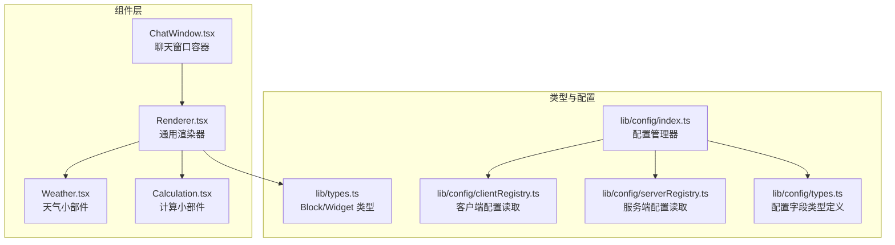
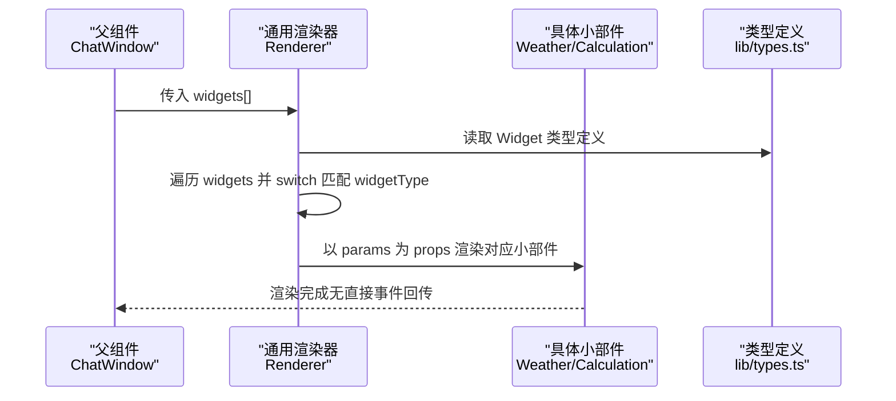
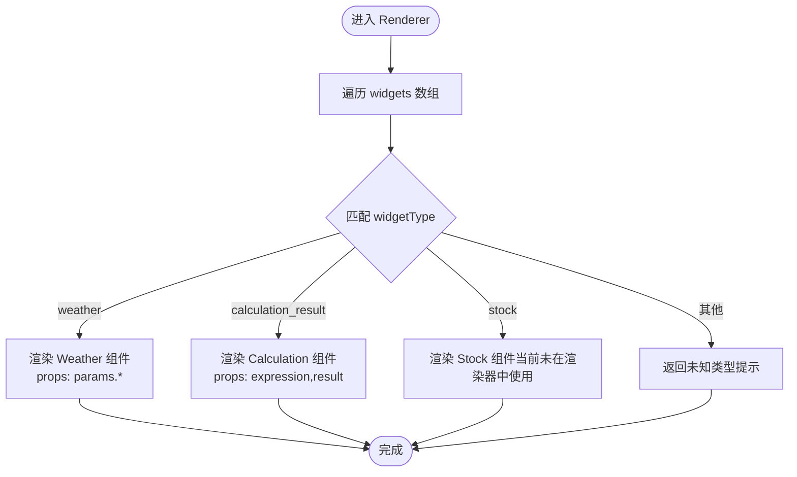
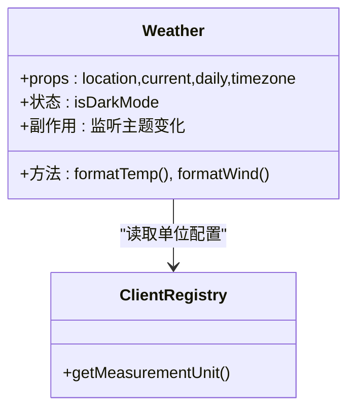
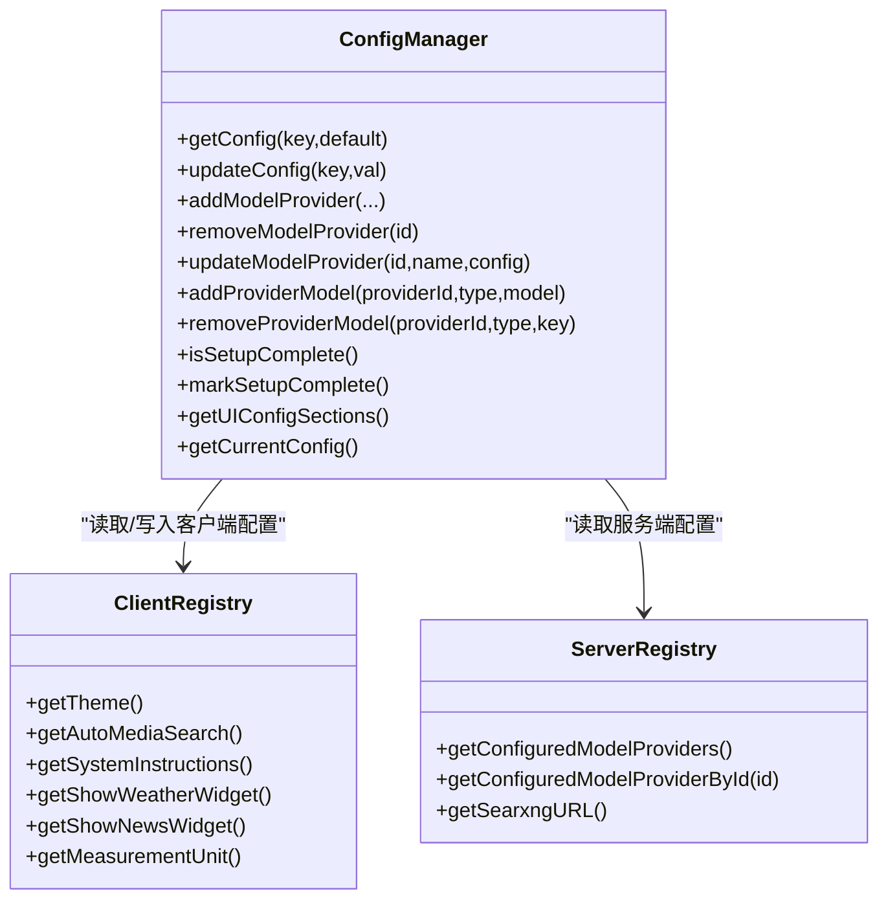
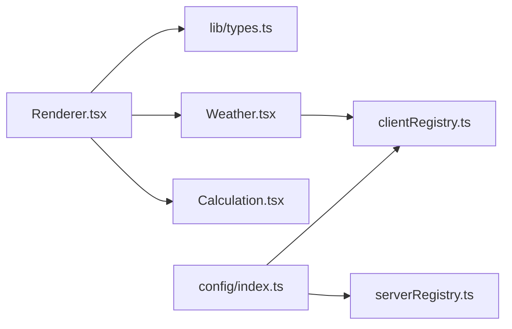

# 通用渲染器

<cite>
**本文引用的文件**
- [src/components/Widgets/Renderer.tsx](file://src/components/Widgets/Renderer.tsx)
- [src/components/Widgets/Weather.tsx](file://src/components/Widgets/Weather.tsx)
- [src/components/Widgets/Calculation.tsx](file://src/components/Widgets/Calculation.tsx)
- [src/components/ChatWindow.tsx](file://src/components/ChatWindow.tsx)
- [src/lib/types.ts](file://src/lib/types.ts)
- [src/lib/config/index.ts](file://src/lib/config/index.ts)
- [src/lib/config/clientRegistry.ts](file://src/lib/config/clientRegistry.ts)
- [src/lib/config/serverRegistry.ts](file://src/lib/config/serverRegistry.ts)
- [src/lib/config/types.ts](file://src/lib/config/types.ts)
</cite>

## 目录
1. [简介](#简介)
2. [项目结构](#项目结构)
3. [核心组件](#核心组件)
4. [架构总览](#架构总览)
5. [组件详解](#组件详解)
6. [依赖关系分析](#依赖关系分析)
7. [性能考量](#性能考量)
8. [故障排查指南](#故障排查指南)
9. [结论](#结论)
10. [附录：扩展开发指南](#附录扩展开发指南)

## 简介
本文件面向“通用渲染器”组件，系统性阐述其设计模式、组件复用机制、插件式小部件注册、配置接口、与父组件的通信方式、错误边界处理、性能优化策略以及扩展开发指南。该渲染器以“块（Block）”为数据单元，通过统一的渲染器将不同类型的“小部件（Widget）”按需呈现，支持动态组件加载、属性传递与生命周期管理，并提供可配置的布局、样式与行为控制。

## 项目结构
通用渲染器位于组件层的 Widgets 子目录中，配合类型定义与配置模块协同工作。整体采用“类型驱动 + 配置驱动”的结构化组织方式，便于扩展新的小部件类型与配置项。

**图表来源**
- [src/components/Widgets/Renderer.tsx](file://src/components/Widgets/Renderer.tsx#L1-L77)
- [src/components/Widgets/Weather.tsx](file://src/components/Widgets/Weather.tsx#L1-L423)
- [src/components/Widgets/Calculation.tsx](file://src/components/Widgets/Calculation.tsx#L1-L47)
- [src/components/ChatWindow.tsx](file://src/components/ChatWindow.tsx#L1-L77)
- [src/lib/types.ts](file://src/lib/types.ts#L57-L64)
- [src/lib/config/index.ts](file://src/lib/config/index.ts#L1-L391)
- [src/lib/config/clientRegistry.ts](file://src/lib/config/clientRegistry.ts#L1-L30)
- [src/lib/config/serverRegistry.ts](file://src/lib/config/serverRegistry.ts#L1-L16)
- [src/lib/config/types.ts](file://src/lib/config/types.ts#L1-L110)

**章节来源**
- [src/components/Widgets/Renderer.tsx](file://src/components/Widgets/Renderer.tsx#L1-L77)
- [src/components/ChatWindow.tsx](file://src/components/ChatWindow.tsx#L1-L77)
- [src/lib/types.ts](file://src/lib/types.ts#L57-L64)
- [src/lib/config/index.ts](file://src/lib/config/index.ts#L1-L391)

## 核心组件
- 通用渲染器（Renderer）
  - 负责根据传入的 Widget 列表进行动态组件分发与渲染，支持多种小部件类型。
  - 通过 switch 分支匹配 widgetType 并将 params 中的键值对作为 props 传递给具体小部件。
- 小部件集合
  - 天气小部件（Weather）：接收位置、当前天气、多日预报与时区等参数，渲染可视化卡片。
  - 计算小部件（Calculation）：接收表达式与结果，渲染简洁的计算结果展示。
- 容器组件（ChatWindow）
  - 提供消息与小部件的承载环境，负责错误状态与加载状态的展示。
- 类型与配置
  - Block/Widget 类型定义了小部件的数据结构；配置管理器提供统一的配置读取与更新能力。

**章节来源**
- [src/components/Widgets/Renderer.tsx](file://src/components/Widgets/Renderer.tsx#L7-L74)
- [src/components/Widgets/Weather.tsx](file://src/components/Widgets/Weather.tsx#L7-L29)
- [src/components/Widgets/Calculation.tsx](file://src/components/Widgets/Calculation.tsx#L5-L8)
- [src/components/ChatWindow.tsx](file://src/components/ChatWindow.tsx#L31-L34)
- [src/lib/types.ts](file://src/lib/types.ts#L57-L64)

## 架构总览
通用渲染器采用“数据驱动 + 组件分发”的架构模式：
- 数据层：Block/Widget 定义统一的数据结构，其中 WidgetBlock 的 data 字段包含 widgetType 与 params。
- 渲染层：Renderer 基于 widgetType 进行分支渲染，将 params 展平为 props 传递给具体小部件。
- 配置层：ConfigManager 提供配置读取、更新与迁移；clientRegistry/serverRegistry 提供便捷的客户端/服务端配置访问方法。
- 通信层：父组件（ChatWindow）通过 props 传递 messages 与 isReady 等状态，渲染器不直接与父组件通信，而是通过数据流被动渲染。

**图表来源**
- [src/components/ChatWindow.tsx](file://src/components/ChatWindow.tsx#L36-L74)
- [src/components/Widgets/Renderer.tsx](file://src/components/Widgets/Renderer.tsx#L7-L74)
- [src/lib/types.ts](file://src/lib/types.ts#L57-L64)

## 组件详解

### 通用渲染器（Renderer）
- 设计模式
  - 工厂/分发模式：根据 widgetType 动态选择渲染目标，避免在父组件中分散的条件判断。
  - 属性透传：将 params 对象直接展开为 props，简化调用方负担。
- 组件复用机制
  - 通过统一的 Widget 接口，任意新增小部件只需在 switch 中添加分支并实现对应组件。
  - 使用 key=index 进行列表渲染，保证列表更新时的稳定性。
- 生命周期管理
  - 渲染器本身无复杂副作用；具体小部件内部自行管理状态与副作用（如 Weather 内部的状态与监听）。
- 错误边界
  - 默认分支返回未知类型提示，便于快速定位数据异常。

**图表来源**
- [src/components/Widgets/Renderer.tsx](file://src/components/Widgets/Renderer.tsx#L7-L74)

**章节来源**
- [src/components/Widgets/Renderer.tsx](file://src/components/Widgets/Renderer.tsx#L7-L74)

### 天气小部件（Weather）
- 功能特性
  - 支持主题切换（明暗模式），根据天气代码与昼夜状态选择图标与渐变背景。
  - 支持单位切换（摄氏/华氏、公里/英里），通过客户端配置读取。
  - 渲染当日温度、体感温度、风速、湿度与未来多日预报。
- 生命周期与状态
  - 监听根节点 class 变更以检测主题切换；使用 useMemo 缓存天气信息与预报数据。
- 错误边界
  - 当缺少必要数据时，渲染占位提示，避免崩溃。

**图表来源**
- [src/components/Widgets/Weather.tsx](file://src/components/Widgets/Weather.tsx#L223-L290)
- [src/lib/config/clientRegistry.ts](file://src/lib/config/clientRegistry.ts#L21-L29)

**章节来源**
- [src/components/Widgets/Weather.tsx](file://src/components/Widgets/Weather.tsx#L7-L29)
- [src/components/Widgets/Weather.tsx](file://src/components/Widgets/Weather.tsx#L223-L420)
- [src/lib/config/clientRegistry.ts](file://src/lib/config/clientRegistry.ts#L21-L29)

### 计算小部件（Calculation）
- 功能特性
  - 展示表达式与计算结果，使用等宽字体与分组数字格式提升可读性。
- 生命周期与状态
  - 无内部状态，纯函数式渲染。

**章节来源**
- [src/components/Widgets/Calculation.tsx](file://src/components/Widgets/Calculation.tsx#L5-L8)
- [src/components/Widgets/Calculation.tsx](file://src/components/Widgets/Calculation.tsx#L10-L44)

### 容器组件（ChatWindow）
- 职责
  - 管理页面级状态（加载、错误、未找到等），决定渲染内容或错误提示。
  - 作为渲染器的父容器，通过 props 向渲染器传递数据。
- 通信机制
  - 通过 props 传递 messages/isReady 等状态；渲染器不直接回调父组件，遵循单向数据流。

**章节来源**
- [src/components/ChatWindow.tsx](file://src/components/ChatWindow.tsx#L36-L74)

### 类型与配置体系
- Block/Widget 类型
  - WidgetBlock.data 中包含 widgetType 与 params，用于 Renderer 的分发与渲染。
- 配置管理器（ConfigManager）
  - 提供配置读取、更新、模型提供者管理、环境变量注入与迁移。
  - 暴露统一的 getConfig/updateConfig 接口，支持点号路径访问嵌套配置。
- 客户端/服务端配置读取
  - clientRegistry 提供主题、单位、开关类配置的便捷读取。
  - serverRegistry 提供服务端配置（如搜索服务地址）的读取封装。

**图表来源**
- [src/lib/config/index.ts](file://src/lib/config/index.ts#L240-L272)
- [src/lib/config/clientRegistry.ts](file://src/lib/config/clientRegistry.ts#L3-L29)
- [src/lib/config/serverRegistry.ts](file://src/lib/config/serverRegistry.ts#L4-L15)

**章节来源**
- [src/lib/types.ts](file://src/lib/types.ts#L57-L64)
- [src/lib/config/index.ts](file://src/lib/config/index.ts#L240-L272)
- [src/lib/config/clientRegistry.ts](file://src/lib/config/clientRegistry.ts#L3-L29)
- [src/lib/config/serverRegistry.ts](file://src/lib/config/serverRegistry.ts#L4-L15)
- [src/lib/config/types.ts](file://src/lib/config/types.ts#L63-L76)

## 依赖关系分析
- 渲染器依赖
  - 依赖 Widget 类型定义（lib/types.ts）以确保传参一致性。
  - 依赖具体小部件组件（Weather/Calculation）实现实际渲染。
- 配置依赖
  - 具体小部件可能依赖客户端配置（如单位、主题）。
  - 配置管理器为渲染器提供统一的配置读取入口，避免各处硬编码。

**图表来源**
- [src/components/Widgets/Renderer.tsx](file://src/components/Widgets/Renderer.tsx#L1-L77)
- [src/lib/types.ts](file://src/lib/types.ts#L57-L64)
- [src/components/Widgets/Weather.tsx](file://src/components/Widgets/Weather.tsx#L1-L423)
- [src/components/Widgets/Calculation.tsx](file://src/components/Widgets/Calculation.tsx#L1-L47)
- [src/lib/config/clientRegistry.ts](file://src/lib/config/clientRegistry.ts#L1-L30)
- [src/lib/config/index.ts](file://src/lib/config/index.ts#L1-L391)
- [src/lib/config/serverRegistry.ts](file://src/lib/config/serverRegistry.ts#L1-L16)

**章节来源**
- [src/components/Widgets/Renderer.tsx](file://src/components/Widgets/Renderer.tsx#L1-L77)
- [src/lib/types.ts](file://src/lib/types.ts#L57-L64)
- [src/lib/config/index.ts](file://src/lib/config/index.ts#L1-L391)

## 性能考量
- 列表渲染优化
  - 使用稳定的 key（index）进行列表渲染，减少不必要的重排；若数据具备唯一 id，建议优先使用 id 以提升 diff 效率。
- 计算缓存
  - Weather 使用 useMemo 缓存天气信息与预报数据，降低重复计算成本。
- 主题监听
  - 通过 MutationObserver 监听根节点 class 变化，避免频繁强制刷新。
- 可选优化方向
  - 虚拟滚动：当小部件数量较多时，可考虑虚拟化列表以降低 DOM 节点数量。
  - 懒加载：对非首屏可见的小部件采用懒加载策略，延迟初始化。
  - 内存回收：在组件卸载时清理观察者与定时器，避免内存泄漏。
  - 图片与资源：对天气图标等静态资源进行预加载与缓存，减少闪烁。

[本节为通用性能建议，无需特定文件来源]

## 故障排查指南
- 渲染器无法识别小部件类型
  - 检查 WidgetBlock.data.widgetType 是否正确；默认分支会输出未知类型提示，便于定位问题。
- 小部件缺少必要参数
  - Weather/Calculation 会在数据缺失时渲染占位提示；请确认上游生成的 params 是否完整。
- 配置读取异常
  - 客户端配置读取依赖 localStorage；若读取失败，将回退到默认值。检查浏览器存储权限与键名是否一致。
- 服务端配置未生效
  - 确认环境变量已注入且 ConfigManager 初始化流程正常执行；可通过 getConfig 获取当前配置验证。

**章节来源**
- [src/components/Widgets/Renderer.tsx](file://src/components/Widgets/Renderer.tsx#L70-L72)
- [src/components/Widgets/Weather.tsx](file://src/components/Widgets/Weather.tsx#L291-L299)
- [src/lib/config/clientRegistry.ts](file://src/lib/config/clientRegistry.ts#L3-L5)
- [src/lib/config/index.ts](file://src/lib/config/index.ts#L123-L168)

## 结论
通用渲染器通过“类型 + 配置 + 组件分发”的架构，实现了小部件的高内聚、低耦合与可扩展性。它以最小的侵入代价支持多种小部件类型，同时借助配置系统提供灵活的布局、样式与行为控制。结合本文提供的性能优化与扩展指南，可在保证可维护性的前提下持续增强渲染器能力。

[本节为总结性内容，无需特定文件来源]

## 附录：扩展开发指南

### 新增小部件类型
- 步骤
  - 在 lib/types.ts 的 WidgetBlock.data 中确保包含 widgetType 与 params。
  - 在 src/components/Widgets/ 下创建新组件（如 src/components/Widgets/MyWidget.tsx）。
  - 在 Renderer.tsx 的 switch 分支中添加新类型分支，并将 params 展开为 props。
- 注意事项
  - 保持 props 名称与上游数据一致，避免运行时类型不匹配。
  - 如需主题/单位等配置，请从 clientRegistry 或配置管理器读取。

**章节来源**
- [src/lib/types.ts](file://src/lib/types.ts#L57-L64)
- [src/components/Widgets/Renderer.tsx](file://src/components/Widgets/Renderer.tsx#L9-L72)

### 插件式注册与类型检查
- 注册方式
  - 通过 Renderer 的 switch 分支实现“静态注册”，新增类型即刻可用。
- 类型检查
  - 利用 TypeScript 的联合类型与 Record<string, any> 的 params，确保编译期与运行期的类型安全。
- 实例化过程
  - 渲染器根据 widgetType 选择组件并传入 params；组件内部自行管理状态与副作用。

**章节来源**
- [src/components/Widgets/Renderer.tsx](file://src/components/Widgets/Renderer.tsx#L7-L74)
- [src/lib/types.ts](file://src/lib/types.ts#L57-L64)

### 配置接口与行为控制
- 客户端配置
  - 通过 clientRegistry 提供的主题、单位、开关等读取方法，实现用户偏好的即时生效。
- 服务端配置
  - 通过 serverRegistry 获取搜索服务地址等后端参数，保障前后端一致性。
- 配置更新
  - 使用 ConfigManager.updateConfig(key, val) 更新配置；支持嵌套键路径。

**章节来源**
- [src/lib/config/clientRegistry.ts](file://src/lib/config/clientRegistry.ts#L7-L29)
- [src/lib/config/serverRegistry.ts](file://src/lib/config/serverRegistry.ts#L14-L15)
- [src/lib/config/index.ts](file://src/lib/config/index.ts#L254-L272)

### 与父组件的通信机制
- 单向数据流
  - 父组件（ChatWindow）通过 props 传递 messages/isReady 等状态；渲染器仅消费这些 props。
- 事件回传
  - 渲染器不直接回调父组件；如需交互反馈，建议通过回调函数或状态提升的方式在父组件中集中处理。

**章节来源**
- [src/components/ChatWindow.tsx](file://src/components/ChatWindow.tsx#L36-L74)
- [src/components/Widgets/Renderer.tsx](file://src/components/Widgets/Renderer.tsx#L7-L74)

### 错误边界与降级策略
- 组件渲染失败
  - 未知小部件类型：默认分支输出提示，避免崩溃。
  - 数据缺失：具体小部件渲染占位提示，保证界面稳定。
- 错误信息展示
  - 建议在父组件层面统一处理 hasError/notFound 状态并展示用户友好的错误页。

**章节来源**
- [src/components/Widgets/Renderer.tsx](file://src/components/Widgets/Renderer.tsx#L70-L72)
- [src/components/Widgets/Weather.tsx](file://src/components/Widgets/Weather.tsx#L291-L299)
- [src/components/ChatWindow.tsx](file://src/components/ChatWindow.tsx#L39-L51)

### 性能优化实践
- 虚拟滚动：对长列表小部件采用虚拟化方案。
- 懒加载：对非首屏小部件延迟初始化。
- 内存回收：组件卸载时清理观察者与定时器。
- 资源优化：对静态资源进行缓存与预加载。

[本节为通用性能建议，无需特定文件来源]

### 适配策略（多设备与屏幕尺寸）
- 响应式布局
  - 使用网格与弹性布局适配不同屏幕宽度；为移动端提供紧凑间距与可触摸尺寸。
- 主题与对比度
  - 依据明暗主题自动调整背景与文字对比度，满足无障碍需求。
- 单位与显示精度
  - 根据测量单位配置动态转换数值与单位标签，确保本地化体验。

[本节为通用适配建议，无需特定文件来源]