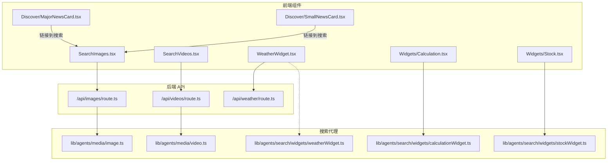
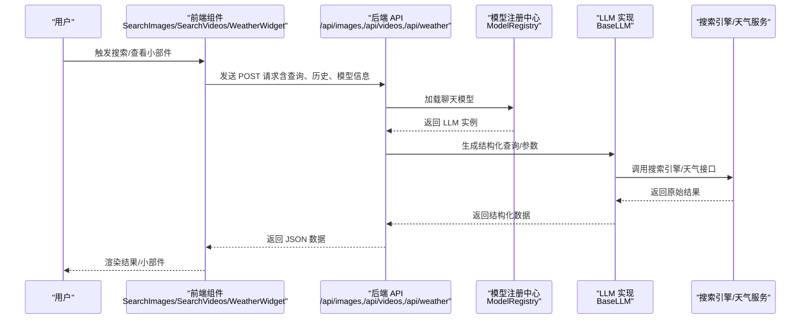
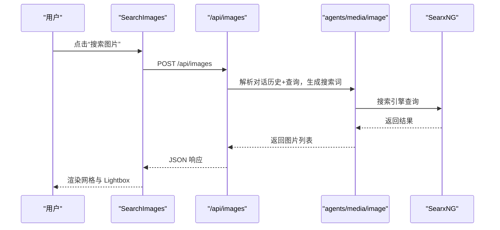
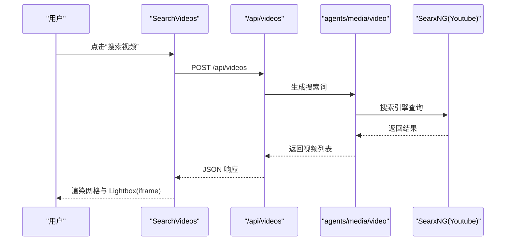
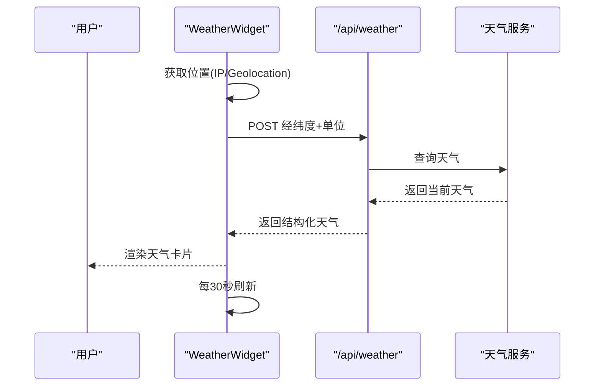
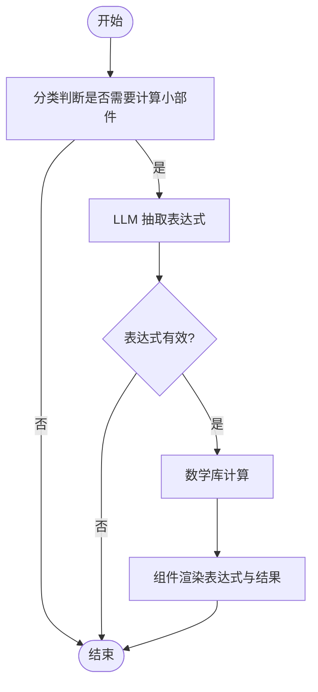
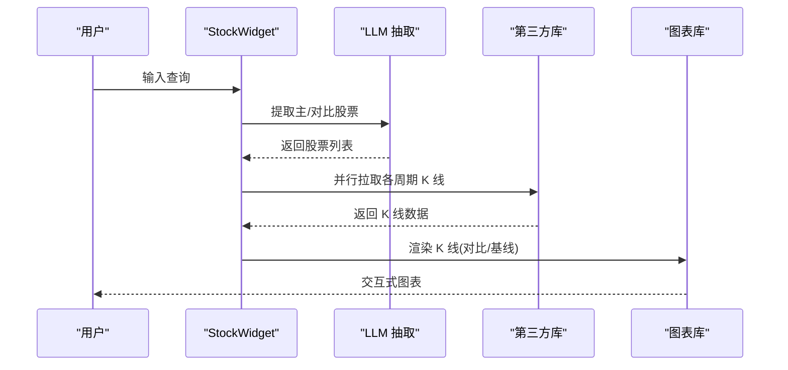
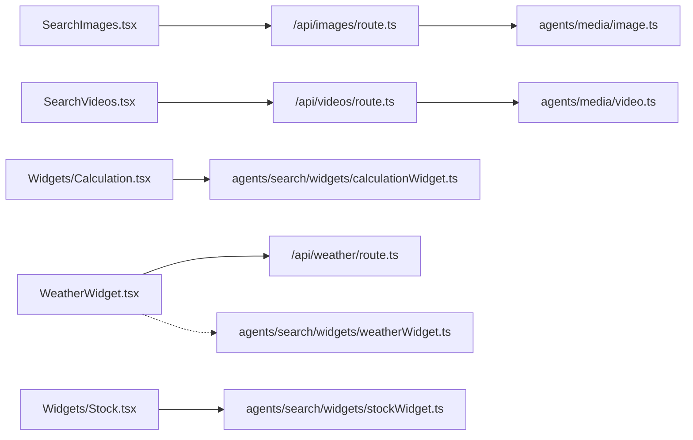

# 搜索和小部件组件

<cite>
**本文引用的文件**
- [src/components/SearchImages.tsx](file://src/components/SearchImages.tsx)
- [src/components/SearchVideos.tsx](file://src/components/SearchVideos.tsx)
- [src/components/WeatherWidget.tsx](file://src/components/WeatherWidget.tsx)
- [src/components/Widgets/Calculation.tsx](file://src/components/Widgets/Calculation.tsx)
- [src/components/Widgets/Stock.tsx](file://src/components/Widgets/Stock.tsx)
- [src/lib/agents/search/widgets/calculationWidget.ts](file://src/lib/agents/search/widgets/calculationWidget.ts)
- [src/lib/agents/search/widgets/weatherWidget.ts](file://src/lib/agents/search/widgets/weatherWidget.ts)
- [src/lib/agents/search/widgets/stockWidget.ts](file://src/lib/agents/search/widgets/stockWidget.ts)
- [src/lib/agents/media/image.ts](file://src/lib/agents/media/image.ts)
- [src/lib/agents/media/video.ts](file://src/lib/agents/media/video.ts)
- [src/app/api/images/route.ts](file://src/app/api/images/route.ts)
- [src/app/api/videos/route.ts](file://src/app/api/videos/route.ts)
- [src/app/api/weather/route.ts](file://src/app/api/weather/route.ts)
- [src/components/Discover/MajorNewsCard.tsx](file://src/components/Discover/MajorNewsCard.tsx)
- [src/components/Discover/SmallNewsCard.tsx](file://src/components/Discover/SmallNewsCard.tsx)
</cite>

## 目录
1. [引言](#引言)
2. [项目结构](#项目结构)
3. [核心组件](#核心组件)
4. [架构总览](#架构总览)
5. [详细组件分析](#详细组件分析)
6. [依赖关系分析](#依赖关系分析)
7. [性能考虑](#性能考虑)
8. [故障排查指南](#故障排查指南)
9. [结论](#结论)
10. [附录](#附录)

## 引言
本文件系统性梳理 Perplexica 的“搜索与小部件”能力，覆盖以下主题：
- 图像搜索与视频搜索：从用户输入到 LLM 解析、到搜索引擎调用、再到结果渲染与预览的完整链路
- 天气小部件：基于位置与时间的自动刷新、图标映射与单位切换
- 计算小部件：表达式抽取与即时计算
- 股票小部件：多周期 K 线对比、市场状态与关键指标展示
- 新闻发现卡片：新闻摘要与缩略图的展示组件
- 组件与外部服务的集成方式、数据同步机制、响应式设计与性能优化策略
- 扩展与自定义建议：如何新增搜索功能或小部件类型

## 项目结构
围绕“搜索与小部件”的关键目录与文件如下：
- 前端组件层（UI 展示）：SearchImages、SearchVideos、WeatherWidget、Widgets 下的 Calculation、Stock
- 搜索代理层（LLM 驱动）：media/image.ts、media/video.ts；widgets 下的 calculationWidget.ts、weatherWidget.ts、stockWidget.ts
- 后端 API 层：/api/images、/api/videos、/api/weather
- 新闻发现卡片：Discover/MajorNewsCard.tsx、Discover/SmallNewsCard.tsx

图表来源
- [src/components/SearchImages.tsx](file://src/components/SearchImages.tsx#L1-L153)
- [src/components/SearchVideos.tsx](file://src/components/SearchVideos.tsx#L1-L224)
- [src/components/WeatherWidget.tsx](file://src/components/WeatherWidget.tsx#L1-L170)
- [src/components/Widgets/Calculation.tsx](file://src/components/Widgets/Calculation.tsx#L1-L47)
- [src/components/Widgets/Stock.tsx](file://src/components/Widgets/Stock.tsx#L1-L518)
- [src/lib/agents/media/image.ts](file://src/lib/agents/media/image.ts#L1-L67)
- [src/lib/agents/media/video.ts](file://src/lib/agents/media/video.ts#L1-L67)
- [src/lib/agents/search/widgets/weatherWidget.ts](file://src/lib/agents/search/widgets/weatherWidget.ts#L1-L204)
- [src/lib/agents/search/widgets/calculationWidget.ts](file://src/lib/agents/search/widgets/calculationWidget.ts#L1-L72)
- [src/lib/agents/search/widgets/stockWidget.ts](file://src/lib/agents/search/widgets/stockWidget.ts#L1-L435)
- [src/app/api/images/route.ts](file://src/app/api/images/route.ts#L1-L42)
- [src/app/api/videos/route.ts](file://src/app/api/videos/route.ts#L1-L42)
- [src/app/api/weather/route.ts](file://src/app/api/weather/route.ts#L1-L175)

章节来源
- [src/components/SearchImages.tsx](file://src/components/SearchImages.tsx#L1-L153)
- [src/components/SearchVideos.tsx](file://src/components/SearchVideos.tsx#L1-L224)
- [src/components/WeatherWidget.tsx](file://src/components/WeatherWidget.tsx#L1-L170)
- [src/components/Widgets/Calculation.tsx](file://src/components/Widgets/Calculation.tsx#L1-L47)
- [src/components/Widgets/Stock.tsx](file://src/components/Widgets/Stock.tsx#L1-L518)
- [src/lib/agents/media/image.ts](file://src/lib/agents/media/image.ts#L1-L67)
- [src/lib/agents/media/video.ts](file://src/lib/agents/media/video.ts#L1-L67)
- [src/lib/agents/search/widgets/weatherWidget.ts](file://src/lib/agents/search/widgets/weatherWidget.ts#L1-L204)
- [src/lib/agents/search/widgets/calculationWidget.ts](file://src/lib/agents/search/widgets/calculationWidget.ts#L1-L72)
- [src/lib/agents/search/widgets/stockWidget.ts](file://src/lib/agents/search/widgets/stockWidget.ts#L1-L435)
- [src/app/api/images/route.ts](file://src/app/api/images/route.ts#L1-L42)
- [src/app/api/videos/route.ts](file://src/app/api/videos/route.ts#L1-L42)
- [src/app/api/weather/route.ts](file://src/app/api/weather/route.ts#L1-L175)

## 核心组件
- 图像搜索组件：点击触发，通过本地存储的模型提供商信息构造请求体，调用 /api/images 获取结果，使用轻量级相册库进行缩略图浏览
- 视频搜索组件：与图像搜索类似，但返回 iframe 源用于播放器渲染，并在切换幻灯片时暂停上一个视频
- 天气小部件：自动获取位置（IP 或地理定位），调用 /api/weather，定时刷新，按天气代码映射图标与描述
- 计算小部件：抽取数学表达式并计算，以纯 UI 组件展示表达式与结果
- 股票小部件：多周期 K 线对比、市场状态标识、关键财务指标与公司信息展示
- 新闻发现卡片：左右布局的大卡片与小卡片，点击跳转到摘要搜索

章节来源
- [src/components/SearchImages.tsx](file://src/components/SearchImages.tsx#L1-L153)
- [src/components/SearchVideos.tsx](file://src/components/SearchVideos.tsx#L1-L224)
- [src/components/WeatherWidget.tsx](file://src/components/WeatherWidget.tsx#L1-L170)
- [src/components/Widgets/Calculation.tsx](file://src/components/Widgets/Calculation.tsx#L1-L47)
- [src/components/Widgets/Stock.tsx](file://src/components/Widgets/Stock.tsx#L1-L518)
- [src/components/Discover/MajorNewsCard.tsx](file://src/components/Discover/MajorNewsCard.tsx#L1-L71)
- [src/components/Discover/SmallNewsCard.tsx](file://src/components/Discover/SmallNewsCard.tsx#L1-L33)

## 架构总览
整体流程：前端组件发起请求 → 后端 API 接收并加载模型 → 代理执行 LLM 解析与外部服务调用 → 返回结构化数据 → 组件渲染。

图表来源
- [src/components/SearchImages.tsx](file://src/components/SearchImages.tsx#L36-L68)
- [src/app/api/images/route.ts](file://src/app/api/images/route.ts#L11-L33)
- [src/lib/agents/media/image.ts](file://src/lib/agents/media/image.ts#L24-L45)
- [src/lib/agents/media/image.ts](file://src/lib/agents/media/image.ts#L47-L63)
- [src/components/SearchVideos.tsx](file://src/components/SearchVideos.tsx#L46-L85)
- [src/app/api/videos/route.ts](file://src/app/api/videos/route.ts#L11-L33)
- [src/lib/agents/media/video.ts](file://src/lib/agents/media/video.ts#L23-L44)
- [src/lib/agents/media/video.ts](file://src/lib/agents/media/video.ts#L46-L63)
- [src/components/WeatherWidget.tsx](file://src/components/WeatherWidget.tsx#L72-L103)
- [src/app/api/weather/route.ts](file://src/app/api/weather/route.ts#L18-L52)

## 详细组件分析

### 图像搜索组件（SearchImages）
- 功能特性
  - 懒加载：首次点击才发起请求
  - 结果展示：网格缩略图，支持“查看更多”入口
  - 预览：点击缩略图打开相册弹窗
- 数据获取与处理
  - 从前端读取模型提供商与密钥，构造请求体
  - 调用 /api/images，内部解析 LLM 输出为搜索关键词，再调用搜索引擎
  - 将结果映射为组件可用的图片对象数组
- 用户交互
  - 加载态骨架屏
  - 点击按钮触发请求
  - 点击缩略图进入 Lightbox 预览

图表来源
- [src/components/SearchImages.tsx](file://src/components/SearchImages.tsx#L36-L68)
- [src/app/api/images/route.ts](file://src/app/api/images/route.ts#L11-L33)
- [src/lib/agents/media/image.ts](file://src/lib/agents/media/image.ts#L24-L63)

章节来源
- [src/components/SearchImages.tsx](file://src/components/SearchImages.tsx#L1-L153)
- [src/app/api/images/route.ts](file://src/app/api/images/route.ts#L1-L42)
- [src/lib/agents/media/image.ts](file://src/lib/agents/media/image.ts#L1-L67)

### 视频搜索组件（SearchVideos）
- 功能特性
  - 与图像搜索一致的交互与加载逻辑
  - 返回带 iframe 源的视频项，支持在 Lightbox 中播放
  - 切换幻灯片时自动暂停上一个视频
- 数据获取与处理
  - LLM 抽取搜索词，调用 YouTube 引擎
  - 映射为包含缩略图、标题、URL、iframe 源的对象
- 用户交互
  - 网格缩略图（含播放图标）
  - 点击进入 Lightbox，iframe 自适应宽高

图表来源
- [src/components/SearchVideos.tsx](file://src/components/SearchVideos.tsx#L46-L85)
- [src/app/api/videos/route.ts](file://src/app/api/videos/route.ts#L11-L33)
- [src/lib/agents/media/video.ts](file://src/lib/agents/media/video.ts#L23-L63)

章节来源
- [src/components/SearchVideos.tsx](file://src/components/SearchVideos.tsx#L1-L224)
- [src/app/api/videos/route.ts](file://src/app/api/videos/route.ts#L1-L42)
- [src/lib/agents/media/video.ts](file://src/lib/agents/media/video.ts#L1-L67)

### 天气小部件（WeatherWidget）
- 功能特性
  - 自动定位：优先使用浏览器地理定位权限，否则回退 IP 定位
  - 天气数据：温度、体感、湿度、风速、天气现象与图标
  - 单位切换：摄氏/华氏、米/英里每秒
  - 自动刷新：每 30 秒轮询更新
- 数据获取与处理
  - 前端直接调用 /api/weather，传入经纬度与单位
  - 后端调用天气 API，映射天气代码为图标与描述
- 用户交互
  - 加载态骨架屏
  - 展示当前天气与简要指标

图表来源
- [src/components/WeatherWidget.tsx](file://src/components/WeatherWidget.tsx#L18-L103)
- [src/app/api/weather/route.ts](file://src/app/api/weather/route.ts#L18-L52)

章节来源
- [src/components/WeatherWidget.tsx](file://src/components/WeatherWidget.tsx#L1-L170)
- [src/app/api/weather/route.ts](file://src/app/api/weather/route.ts#L1-L175)

### 计算小部件（Calculation）
- 功能特性
  - 表达式抽取：由 LLM 判断是否需要计算并提取表达式
  - 计算执行：使用数学库对表达式求值
  - 结果展示：以等宽字体与分组数字格式显示
- 数据流
  - classification 决定是否启用
  - LLM 生成表达式
  - 数学库计算并返回结果
  - 组件渲染

图表来源
- [src/lib/agents/search/widgets/calculationWidget.ts](file://src/lib/agents/search/widgets/calculationWidget.ts#L35-L68)
- [src/components/Widgets/Calculation.tsx](file://src/components/Widgets/Calculation.tsx#L10-L44)

章节来源
- [src/lib/agents/search/widgets/calculationWidget.ts](file://src/lib/agents/search/widgets/calculationWidget.ts#L1-L72)
- [src/components/Widgets/Calculation.tsx](file://src/components/Widgets/Calculation.tsx#L1-L47)

### 股票小部件（Stock）
- 功能特性
  - 多周期 K 线：1D/5D/1M/3M/6M/1Y/MAX
  - 对比展示：最多 3 只股票的相对表现
  - 市场状态：盘前/盘中/盘后状态指示
  - 关键指标：开盘/昨收/日/周范围、市值、市盈率、股息、成交量等
- 数据获取与处理
  - LLM 抽取主股票与最多 3 个对比股票
  - 使用第三方库批量拉取各周期 K 线
  - 组件内使用图表库绘制 K 线，支持深色模式与响应式
- 用户交互
  - 时间窗口切换
  - 鼠标悬停查看交叉线与数值

图表来源
- [src/lib/agents/search/widgets/stockWidget.ts](file://src/lib/agents/search/widgets/stockWidget.ts#L51-L142)
- [src/components/Widgets/Stock.tsx](file://src/components/Widgets/Stock.tsx#L85-L252)

章节来源
- [src/lib/agents/search/widgets/stockWidget.ts](file://src/lib/agents/search/widgets/stockWidget.ts#L1-L435)
- [src/components/Widgets/Stock.tsx](file://src/components/Widgets/Stock.tsx#L1-L518)

### 新闻发现卡片（Discover）
- 功能特性
  - 大卡片：左右布局，标题与内容可裁剪，悬停放大缩略图
  - 小卡片：缩略图在上，标题与摘要在下
  - 点击跳转至“摘要”搜索，便于进一步检索
- 设计要点
  - 响应式断点与弹性布局
  - 图片懒加载与缩放过渡

章节来源
- [src/components/Discover/MajorNewsCard.tsx](file://src/components/Discover/MajorNewsCard.tsx#L1-L71)
- [src/components/Discover/SmallNewsCard.tsx](file://src/components/Discover/SmallNewsCard.tsx#L1-L33)

## 依赖关系分析
- 组件与 API
  - SearchImages/SearchVideos 依赖 /api/images 与 /api/videos
  - WeatherWidget 依赖 /api/weather
- 组件与代理
  - SearchImages/SearchVideos 依赖 agents/media 下的 image.ts 与 video.ts
  - Calculation/Stock/Weather 小部件依赖 agents/search/widgets 下对应实现
- 外部服务
  - 搜索引擎：SearxNG（图像/视频）
  - 天气服务：Open-Meteo
  - 地理编码：OpenStreetMap/Nominatim
  - 股票数据：第三方库（Yahoo Finance）

图表来源
- [src/components/SearchImages.tsx](file://src/components/SearchImages.tsx#L1-L153)
- [src/components/SearchVideos.tsx](file://src/components/SearchVideos.tsx#L1-L224)
- [src/components/WeatherWidget.tsx](file://src/components/WeatherWidget.tsx#L1-L170)
- [src/components/Widgets/Calculation.tsx](file://src/components/Widgets/Calculation.tsx#L1-L47)
- [src/components/Widgets/Stock.tsx](file://src/components/Widgets/Stock.tsx#L1-L518)
- [src/lib/agents/media/image.ts](file://src/lib/agents/media/image.ts#L1-L67)
- [src/lib/agents/media/video.ts](file://src/lib/agents/media/video.ts#L1-L67)
- [src/lib/agents/search/widgets/calculationWidget.ts](file://src/lib/agents/search/widgets/calculationWidget.ts#L1-L72)
- [src/lib/agents/search/widgets/stockWidget.ts](file://src/lib/agents/search/widgets/stockWidget.ts#L1-L435)
- [src/lib/agents/search/widgets/weatherWidget.ts](file://src/lib/agents/search/widgets/weatherWidget.ts#L1-L204)
- [src/app/api/images/route.ts](file://src/app/api/images/route.ts#L1-L42)
- [src/app/api/videos/route.ts](file://src/app/api/videos/route.ts#L1-L42)
- [src/app/api/weather/route.ts](file://src/app/api/weather/route.ts#L1-L175)

章节来源
- [src/components/SearchImages.tsx](file://src/components/SearchImages.tsx#L1-L153)
- [src/components/SearchVideos.tsx](file://src/components/SearchVideos.tsx#L1-L224)
- [src/components/WeatherWidget.tsx](file://src/components/WeatherWidget.tsx#L1-L170)
- [src/components/Widgets/Calculation.tsx](file://src/components/Widgets/Calculation.tsx#L1-L47)
- [src/components/Widgets/Stock.tsx](file://src/components/Widgets/Stock.tsx#L1-L518)
- [src/lib/agents/media/image.ts](file://src/lib/agents/media/image.ts#L1-L67)
- [src/lib/agents/media/video.ts](file://src/lib/agents/media/video.ts#L1-L67)
- [src/lib/agents/search/widgets/calculationWidget.ts](file://src/lib/agents/search/widgets/calculationWidget.ts#L1-L72)
- [src/lib/agents/search/widgets/stockWidget.ts](file://src/lib/agents/search/widgets/stockWidget.ts#L1-L435)
- [src/lib/agents/search/widgets/weatherWidget.ts](file://src/lib/agents/search/widgets/weatherWidget.ts#L1-L204)
- [src/app/api/images/route.ts](file://src/app/api/images/route.ts#L1-L42)
- [src/app/api/videos/route.ts](file://src/app/api/videos/route.ts#L1-L42)
- [src/app/api/weather/route.ts](file://src/app/api/weather/route.ts#L1-L175)

## 性能考虑
- 懒加载与骨架屏
  - 图像/视频网格在加载时显示占位元素，减少白屏时间
- 并行请求
  - 股票多周期 K 线采用 Promise.all 并行拉取
  - 天气坐标与地名互查采用并发请求
- 资源复用
  - 图表库实例在组件卸载时销毁，避免内存泄漏
  - Lightbox 预览仅在需要时打开
- 响应式与可访问性
  - 组件使用 Tailwind 响应式类，适配移动端
  - 图片缩略图使用 object-cover 与 aspect-video，保证视觉一致性

[本节为通用性能建议，不直接分析具体文件]

## 故障排查指南
- 图像/视频搜索无结果
  - 检查前端是否正确传递模型提供商与密钥
  - 查看后端 API 是否成功加载模型并调用 LLM
  - 确认搜索引擎返回字段是否包含必需字段（如缩略图、URL、标题）
- 天气小部件错误
  - 确认经纬度参数是否为空
  - 检查天气 API 返回是否包含错误字段
  - 核对图标映射逻辑与天气代码
- 股票小部件异常
  - LLM 抽取失败时会直接返回空数据，需检查提示词与分类
  - 第三方库调用失败时返回错误信息，注意日志输出
- 组件样式问题
  - 确保 Lightbox 样式已引入
  - 检查图表容器宽度变化时是否重新计算尺寸

章节来源
- [src/app/api/images/route.ts](file://src/app/api/images/route.ts#L34-L40)
- [src/app/api/videos/route.ts](file://src/app/api/videos/route.ts#L34-L40)
- [src/app/api/weather/route.ts](file://src/app/api/weather/route.ts#L26-L34)
- [src/lib/agents/search/widgets/stockWidget.ts](file://src/lib/agents/search/widgets/stockWidget.ts#L421-L431)

## 结论
Perplexica 的搜索与小部件体系以“LLM 驱动 + 外部服务集成”为核心，前端组件负责交互与渲染，后端 API 负责模型加载与代理编排，形成清晰的职责边界。图像/视频搜索具备良好的用户体验与可扩展性；天气与股票小部件提供了丰富的实时数据与可视化能力。通过模块化的代理与统一的 API 接口，开发者可以便捷地扩展新的搜索能力或小部件类型。

[本节为总结性内容，不直接分析具体文件]

## 附录

### 使用示例与集成模式
- 在消息输入区域插入“搜索图片/视频”按钮，点击后调用相应 API，将返回的媒体列表注入消息渲染
- 在聊天上下文末尾附加“计算小部件”请求，由 LLM 抽取表达式并计算
- 在需要展示实时行情时，调用股票小部件并传入主/对比股票列表
- 在天气卡片中展示当前天气与风速、湿度等指标，支持定时刷新

[本节为概念性说明，不直接分析具体文件]

### 组件扩展与自定义指南
- 新增搜索组件
  - 在 agents/media 下新增代理文件，定义输入输出与外部服务调用
  - 在 /api 下新增路由，加载模型并调用代理
  - 在前端组件中发起请求并渲染结果
- 新增小部件
  - 在 agents/search/widgets 下新增实现，定义 LLM 抽取逻辑与数据结构
  - 在前端 Widgets 下新增组件，定义渲染与交互
  - 在后端 API 中补充必要的数据转换与缓存策略

[本节为通用指导，不直接分析具体文件]