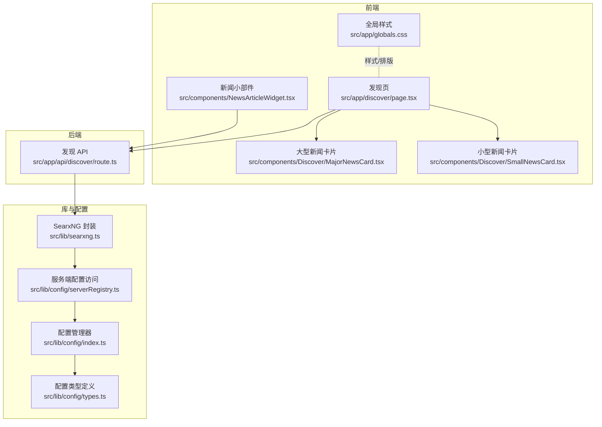
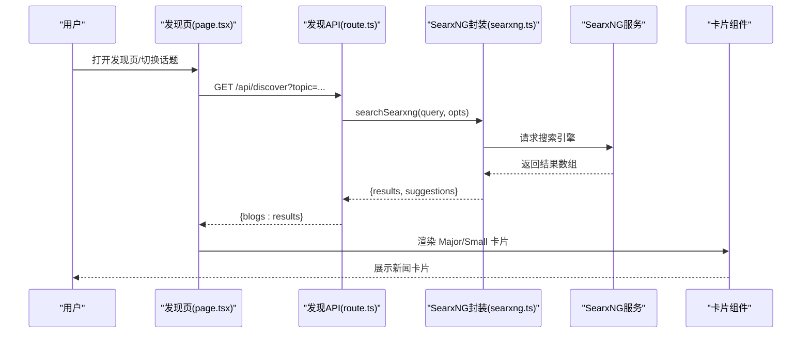
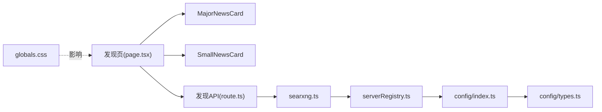

# 新闻发现组件

<cite>
**本文引用的文件**
- [src/app/discover/page.tsx](file://src/app/discover/page.tsx)
- [src/components/Discover/MajorNewsCard.tsx](file://src/components/Discover/MajorNewsCard.tsx)
- [src/components/Discover/SmallNewsCard.tsx](file://src/components/Discover/SmallNewsCard.tsx)
- [src/app/api/discover/route.ts](file://src/app/api/discover/route.ts)
- [src/lib/searxng.ts](file://src/lib/searxng.ts)
- [src/lib/config/serverRegistry.ts](file://src/lib/config/serverRegistry.ts)
- [src/lib/config/index.ts](file://src/lib/config/index.ts)
- [src/lib/config/types.ts](file://src/lib/config/types.ts)
- [src/app/globals.css](file://src/app/globals.css)
- [src/components/NewsArticleWidget.tsx](file://src/components/NewsArticleWidget.tsx)
</cite>

## 目录
1. [简介](#简介)
2. [项目结构](#项目结构)
3. [核心组件](#核心组件)
4. [架构总览](#架构总览)
5. [详细组件分析](#详细组件分析)
6. [依赖关系分析](#依赖关系分析)
7. [性能考量](#性能考量)
8. [故障排查指南](#故障排查指南)
9. [结论](#结论)
10. [附录：使用示例与集成指南](#附录使用示例与集成指南)

## 简介
本文件面向 Perplexica 的“新闻发现”功能，系统性梳理新闻卡片组件（大型与小型）的设计理念、实现方式与交互行为；解释新闻发现工作流（新闻源选择、内容抓取、去重与随机化排序）；给出 MajorNewsCard 与 SmallNewsCard 的差异化设计说明；提供在应用中集成新闻推荐系统的使用示例；说明新闻内容的展示字段与缓存更新机制；并讨论个性化推荐与用户偏好的处理现状与扩展建议。

## 项目结构
新闻发现相关代码主要分布在以下位置：
- 前端页面与卡片组件：src/app/discover/page.tsx、src/components/Discover/MajorNewsCard.tsx、src/components/Discover/SmallNewsCard.tsx
- 后端 API：src/app/api/discover/route.ts
- 搜索引擎封装：src/lib/searxng.ts、src/lib/config/serverRegistry.ts
- 配置与类型：src/lib/config/index.ts、src/lib/config/types.ts
- 全局样式与复用组件：src/app/globals.css、src/components/NewsArticleWidget.tsx

图表来源
- [src/app/discover/page.tsx](file://src/app/discover/page.tsx#L1-L272)
- [src/components/Discover/MajorNewsCard.tsx](file://src/components/Discover/MajorNewsCard.tsx#L1-L71)
- [src/components/Discover/SmallNewsCard.tsx](file://src/components/Discover/SmallNewsCard.tsx#L1-L33)
- [src/app/api/discover/route.ts](file://src/app/api/discover/route.ts#L1-L99)
- [src/lib/searxng.ts](file://src/lib/searxng.ts#L1-L54)
- [src/lib/config/serverRegistry.ts](file://src/lib/config/serverRegistry.ts#L1-L16)
- [src/lib/config/index.ts](file://src/lib/config/index.ts#L1-L391)
- [src/lib/config/types.ts](file://src/lib/config/types.ts#L1-L110)
- [src/app/globals.css](file://src/app/globals.css#L1-L100)
- [src/components/NewsArticleWidget.tsx](file://src/components/NewsArticleWidget.tsx#L29-L51)

章节来源
- [src/app/discover/page.tsx](file://src/app/discover/page.tsx#L1-L272)
- [src/app/api/discover/route.ts](file://src/app/api/discover/route.ts#L1-L99)
- [src/lib/searxng.ts](file://src/lib/searxng.ts#L1-L54)
- [src/lib/config/serverRegistry.ts](file://src/lib/config/serverRegistry.ts#L1-L16)
- [src/lib/config/index.ts](file://src/lib/config/index.ts#L1-L391)
- [src/lib/config/types.ts](file://src/lib/config/types.ts#L1-L110)
- [src/app/globals.css](file://src/app/globals.css#L1-L100)
- [src/components/NewsArticleWidget.tsx](file://src/components/NewsArticleWidget.tsx#L29-L51)

## 核心组件
- 发现页（客户端渲染）：负责话题切换、加载状态、数据请求与卡片布局编排。
- 大型新闻卡片（MajorNewsCard）：强调图片与标题/摘要的组合，支持左右布局切换，适合大屏展示。
- 小型新闻卡片（SmallNewsCard）：紧凑卡片，适合网格布局与移动端展示。
- 发现 API：根据话题聚合多个新闻源与查询词，调用 SearxNG 获取结果并进行去重与随机化。
- SearxNG 封装：统一构造查询参数并发起请求，返回结果与建议。
- 配置系统：提供 SearxNG 实例地址等配置项，供服务端访问。

章节来源
- [src/app/discover/page.tsx](file://src/app/discover/page.tsx#L10-L38)
- [src/components/Discover/MajorNewsCard.tsx](file://src/components/Discover/MajorNewsCard.tsx#L4-L10)
- [src/components/Discover/SmallNewsCard.tsx](file://src/components/Discover/SmallNewsCard.tsx#L4-L10)
- [src/app/api/discover/route.ts](file://src/app/api/discover/route.ts#L3-L24)
- [src/lib/searxng.ts](file://src/lib/searxng.ts#L21-L53)
- [src/lib/config/serverRegistry.ts](file://src/lib/config/serverRegistry.ts#L14-L16)

## 架构总览
新闻发现从“发现页”发起请求，经“发现 API”聚合多源多关键词搜索，再由“SearxNG 封装”调用外部搜索引擎，最终返回给前端渲染为不同尺寸的卡片。

图表来源
- [src/app/discover/page.tsx](file://src/app/discover/page.tsx#L45-L74)
- [src/app/api/discover/route.ts](file://src/app/api/discover/route.ts#L28-L98)
- [src/lib/searxng.ts](file://src/lib/searxng.ts#L21-L53)

## 详细组件分析

### 发现页（Discover Page）
- 数据模型：定义 Discover 接口，包含标题、摘要、链接与缩略图字段。
- 话题列表：内置 Tech/Finance/Art/Sports/Entertainment 五个主题，点击切换 activeTopic。
- 加载与错误：统一 loading 状态与错误提示；过滤掉无缩略图的条目。
- 布局策略：
  - 移动端：仅渲染小型卡片网格。
  - 桌面端：采用复杂分段布局，穿插大型卡片与小型卡片网格，并插入分隔线，提升可读性与层次感。
- 导航行为：卡片点击跳转到搜索页并携带 Summary: 前缀的 URL，便于后续摘要生成流程。

章节来源
- [src/app/discover/page.tsx](file://src/app/discover/page.tsx#L10-L15)
- [src/app/discover/page.tsx](file://src/app/discover/page.tsx#L17-L38)
- [src/app/discover/page.tsx](file://src/app/discover/page.tsx#L40-L74)
- [src/app/discover/page.tsx](file://src/app/discover/page.tsx#L128-L268)

### MajorNewsCard（大型新闻卡片）
- 结构：左右布局可选，左侧放图片，右侧放标题与摘要；或镜像布局。
- 图片处理：对缩略图 URL 进行解析与拼接，附加 id 参数以确保缓存命中与清晰度。
- 文字排版：标题使用较大的字号与行高限制，摘要采用较细字体与行高；悬停时标题颜色变化。
- 交互：整体作为链接，点击打开搜索结果；图片悬停放大，提供平滑过渡动画。
- 适用场景：桌面端主推位、双列对比、重点文章展示。

章节来源
- [src/components/Discover/MajorNewsCard.tsx](file://src/components/Discover/MajorNewsCard.tsx#L4-L10)
- [src/components/Discover/MajorNewsCard.tsx](file://src/components/Discover/MajorNewsCard.tsx#L11-L67)

### SmallNewsCard（小型新闻卡片）
- 结构：顶部缩略图（16:9 高宽比），底部标题与摘要。
- 图片处理：与大型卡片一致，解析并拼接缩略图 URL。
- 文字排版：标题与摘要均限制行数，悬停标题变色。
- 交互：整体作为链接，点击打开搜索结果；图片悬停放大，过渡时间更短。
- 适用场景：网格布局、移动端瀑布流、快速浏览。

章节来源
- [src/components/Discover/SmallNewsCard.tsx](file://src/components/Discover/SmallNewsCard.tsx#L4-L10)
- [src/components/Discover/SmallNewsCard.tsx](file://src/components/Discover/SmallNewsCard.tsx#L11-L29)

### 发现 API（/api/discover）
- 主题映射：每个主题绑定一组查询词与目标站点集合。
- 模式：
  - normal：对每个站点与查询词组合执行搜索，合并结果后去重（基于 URL）、打乱顺序。
  - preview：随机选择一个站点与一个查询词，返回单次搜索结果。
- 引擎与语言：固定使用 Bing News 引擎，语言设为英文。
- 错误处理：捕获异常并返回统一错误响应。

章节来源
- [src/app/api/discover/route.ts](file://src/app/api/discover/route.ts#L3-L24)
- [src/app/api/discover/route.ts](file://src/app/api/discover/route.ts#L28-L98)

### SearxNG 封装（searchSearxng）
- 查询参数：支持 categories、engines、language、pageno 等；自动将数组参数以逗号连接。
- 返回结构：返回 results 与 suggestions 数组。
- 错误处理：非 OK 状态抛出错误，便于上层统一处理。

章节来源
- [src/lib/searxng.ts](file://src/lib/searxng.ts#L3-L8)
- [src/lib/searxng.ts](file://src/lib/searxng.ts#L21-L53)

### 配置系统（Server Registry 与 Config）
- SearxNG 地址：通过配置中心读取 search.searxngURL。
- 配置结构：preferences/personalization/modelProviders/search 等字段；支持环境变量注入。
- 类型定义：统一的 UI 字段类型与配置对象结构。

章节来源
- [src/lib/config/serverRegistry.ts](file://src/lib/config/serverRegistry.ts#L14-L16)
- [src/lib/config/index.ts](file://src/lib/config/index.ts#L19-L22)
- [src/lib/config/types.ts](file://src/lib/config/types.ts#L63-L76)

### 样式与排版（globals.css）
- 自定义字体：PP Editorial 用于标题，保证排版一致性。
- 行数截断：line-clamp-2 等工具类用于控制标题/摘要显示行数。
- 滚动条美化：针对浅色/深色主题的滚动条配色与行为优化。

章节来源
- [src/app/globals.css](file://src/app/globals.css#L5-L11)
- [src/app/globals.css](file://src/app/globals.css#L84-L91)

### 新闻小部件（NewsArticleWidget）复用
- 用途：首页或侧边栏展示最近新闻，结构与卡片类似，但尺寸更小。
- 行为：加载态骨架屏、错误提示、点击跳转搜索页。

章节来源
- [src/components/NewsArticleWidget.tsx](file://src/components/NewsArticleWidget.tsx#L29-L51)

## 依赖关系分析
- 发现页依赖卡片组件与 API；API 依赖 SearxNG 封装；SearxNG 封装依赖配置中心读取 SearxNG 地址。
- 配置中心提供统一的键值访问与环境变量注入能力。
- 样式层通过 Tailwind 工具类与自定义字体影响组件外观。

图表来源
- [src/app/discover/page.tsx](file://src/app/discover/page.tsx#L1-L272)
- [src/app/api/discover/route.ts](file://src/app/api/discover/route.ts#L1-L99)
- [src/lib/searxng.ts](file://src/lib/searxng.ts#L1-L54)
- [src/lib/config/serverRegistry.ts](file://src/lib/config/serverRegistry.ts#L1-L16)
- [src/lib/config/index.ts](file://src/lib/config/index.ts#L1-L391)
- [src/lib/config/types.ts](file://src/lib/config/types.ts#L1-L110)
- [src/app/globals.css](file://src/app/globals.css#L1-L100)

章节来源
- [src/app/discover/page.tsx](file://src/app/discover/page.tsx#L1-L272)
- [src/app/api/discover/route.ts](file://src/app/api/discover/route.ts#L1-L99)
- [src/lib/searxng.ts](file://src/lib/searxng.ts#L1-L54)
- [src/lib/config/serverRegistry.ts](file://src/lib/config/serverRegistry.ts#L1-L16)
- [src/lib/config/index.ts](file://src/lib/config/index.ts#L1-L391)
- [src/lib/config/types.ts](file://src/lib/config/types.ts#L1-L110)
- [src/app/globals.css](file://src/app/globals.css#L1-L100)

## 性能考量
- 前端渲染策略
  - 桌面端采用分段布局与分隔线，避免一次性渲染大量节点导致卡顿。
  - 使用条件渲染与按需加载（移动端仅小型卡片）降低首屏压力。
- 图片优化
  - 缩略图 URL 解析与参数拼接，有助于命中缓存与清晰度控制。
  - 悬停缩放使用 CSS 过渡，避免 JS 动画阻塞主线程。
- 后端聚合
  - normal 模式下对结果进行去重与随机化，减少重复内容，提升多样性。
  - 固定引擎与语言，简化参数，提高稳定性与可预测性。
- 可扩展优化
  - 对于高频访问的主题，可在服务端增加缓存层（如 Redis）存储聚合结果与 TTL。
  - 对搜索结果进行本地缓存（localStorage 或 IndexedDB），结合时间戳与失效策略，减少重复请求。
  - 在前端实现虚拟滚动（如 react-window）以处理长列表场景。

[本节为通用性能建议，不直接分析具体文件]

## 故障排查指南
- 无法加载新闻
  - 检查 SearxNG 地址配置是否正确：确认 search.searxngURL 是否填写且可达。
  - 查看发现 API 的错误响应与日志输出，定位是网络问题还是上游服务异常。
- 缩略图缺失
  - 发现页会过滤无缩略图的条目；若全部为空，检查上游搜索结果是否包含图片字段。
- 随机性与重复
  - normal 模式已做 URL 去重与随机化；若仍出现重复，检查上游结果是否一致。
- 样式异常
  - 确认自定义字体与工具类是否正确引入；检查深色/浅色模式下的配色变量。

章节来源
- [src/lib/config/serverRegistry.ts](file://src/lib/config/serverRegistry.ts#L14-L16)
- [src/app/api/discover/route.ts](file://src/app/api/discover/route.ts#L88-L97)
- [src/app/discover/page.tsx](file://src/app/discover/page.tsx#L61-L69)
- [src/app/globals.css](file://src/app/globals.css#L5-L11)

## 结论
Perplexica 的新闻发现组件通过“发现页 + 卡片组件 + 发现 API + SearxNG 封装”的分层设计，实现了主题驱动的内容聚合与多样化展示。大型卡片强调视觉冲击与可读性，小型卡片聚焦密集信息与移动体验。当前实现以去重与随机化为基础，具备良好的可扩展性。未来可在服务端缓存、个性化推荐与用户偏好处理方面进一步增强。

[本节为总结性内容，不直接分析具体文件]

## 附录：使用示例与集成指南

### 如何在应用中集成新闻推荐系统
- 在路由中添加“发现”入口，渲染发现页组件。
- 确保配置中心已设置 search.searxngURL，使 API 能正常访问搜索引擎。
- 在需要展示最近新闻的位置，可复用新闻小部件组件，保持一致的交互与视觉风格。

章节来源
- [src/app/discover/page.tsx](file://src/app/discover/page.tsx#L1-L272)
- [src/lib/config/serverRegistry.ts](file://src/lib/config/serverRegistry.ts#L14-L16)
- [src/components/NewsArticleWidget.tsx](file://src/components/NewsArticleWidget.tsx#L29-L51)

### 新闻内容展示字段说明
- 标题：用于大型卡片标题与小型卡片标题，支持行数截断与悬停变色。
- 摘要：用于大型卡片与小型卡片的摘要区域，支持行数截断。
- 发布链接：卡片点击跳转至搜索页，携带 Summary: 前缀 URL。
- 来源标识：当前实现未直接展示来源域名；如需展示，可在卡片中新增来源标签。

章节来源
- [src/app/discover/page.tsx](file://src/app/discover/page.tsx#L10-L15)
- [src/components/Discover/MajorNewsCard.tsx](file://src/components/Discover/MajorNewsCard.tsx#L30-L38)
- [src/components/Discover/SmallNewsCard.tsx](file://src/components/Discover/SmallNewsCard.tsx#L21-L27)

### 缓存策略与更新机制
- 当前实现
  - 前端：未见显式缓存逻辑；发现页在切换话题时重新请求。
  - 后端：未见服务端缓存；normal 模式在内存中去重与随机化。
- 建议方案
  - 服务端缓存：对热门主题与查询词组合的结果进行缓存，设置合理 TTL。
  - 客户端缓存：使用 localStorage/IndexedDB 存储近期结果，结合时间戳与失效策略。
  - 更新策略：定时刷新或基于用户操作触发更新，避免过期内容长期驻留。

[本节为通用建议，不直接分析具体文件]

### 个性化推荐与用户偏好处理
- 现状
  - 发现 API 未考虑用户历史与偏好；normal 模式对结果进行随机化，提升多样性。
  - 配置中心存在 personalization 字段，但未在发现流程中使用。
- 建议
  - 用户偏好采集：在设置中增加兴趣标签（如科技、体育、娱乐等），记录用户偏好。
  - 个性化查询：将用户偏好转化为查询词权重或站点权重，调整聚合策略。
  - 排序策略：在现有随机化基础上加入基于偏好的排序因子，提升相关性。
  - A/B 实验：对不同排序策略进行实验，收集反馈指标（点击率、停留时长等）。

章节来源
- [src/app/api/discover/route.ts](file://src/app/api/discover/route.ts#L40-L65)
- [src/lib/config/index.ts](file://src/lib/config/index.ts#L16-L17)
- [src/lib/config/types.ts](file://src/lib/config/types.ts#L69-L71)