# 视频搜索组件

<cite>
**本文档引用的文件**
- [SearchVideos.tsx](file://src/components/SearchVideos.tsx)
- [video.ts](file://src/lib/agents/media/video.ts)
- [videos.ts](file://src/lib/prompts/media/videos.ts)
- [searxng.ts](file://src/lib/searxng.ts)
- [route.ts](file://src/app/api/videos/route.ts)
- [serverRegistry.ts](file://src/lib/config/serverRegistry.ts)
- [formatHistory.ts](file://src/lib/utils/formatHistory.ts)
- [MessageBox.tsx](file://src/components/MessageBox.tsx)
- [globals.css](file://src/app/globals.css)
</cite>

## 目录
1. [简介](#简介)
2. [项目结构](#项目结构)
3. [核心组件](#核心组件)
4. [架构概览](#架构概览)
5. [详细组件分析](#详细组件分析)
6. [依赖关系分析](#依赖关系分析)
7. [性能考虑](#性能考虑)
8. [故障排除指南](#故障排除指南)
9. [结论](#结论)

## 简介

Perplexica 的视频搜索组件是一个集成了 AI 驱动搜索功能的现代化组件，允许用户通过自然语言查询获取相关的视频内容。该组件提供了直观的用户界面，支持视频缩略图展示、播放预览和响应式设计，为聊天界面提供了无缝的多媒体搜索体验。

## 项目结构

视频搜索功能在 Perplexica 中采用模块化架构设计，主要分布在以下目录结构中：

```mermaid
graph TB
subgraph "前端组件层"
SV[SearchVideos.tsx]
MI[MessageBox.tsx]
end
subgraph "AI 搜索层"
VA[video.ts]
VP[videos.ts]
FH[formatHistory.ts]
end
subgraph "API 层"
AR[route.ts]
end
subgraph "搜索服务层"
SR[serverRegistry.ts]
SX[searxng.ts]
end
subgraph "样式层"
GC[globals.css]
end
MI --> SV
SV --> AR
AR --> VA
VA --> VP
VA --> FH
VA --> SX
SX --> SR
SV --> GC
```



**图表来源**
- [SearchVideos.tsx](file://src/components/SearchVideos.tsx#L1-L224)
- [video.ts](file://src/lib/agents/media/video.ts#L1-L67)
- [route.ts](file://src/app/api/videos/route.ts#L1-L42)

**章节来源**
- [SearchVideos.tsx](file://src/components/SearchVideos.tsx#L1-L224)
- [MessageBox.tsx](file://src/components/MessageBox.tsx#L270-L291)

## 核心组件

### SearchVideos 组件

SearchVideos 是视频搜索功能的核心组件，负责处理用户交互、数据获取和结果展示。该组件具有以下关键特性：

- **触发机制**：通过按钮点击触发视频搜索
- **状态管理**：管理加载状态、视频数据和模态框状态
- **响应式布局**：支持桌面端和移动端的自适应设计
- **播放器集成**：使用 Yet Another React Lightbox 实现视频播放

### 视频搜索代理

video.ts 文件实现了完整的视频搜索代理，包括：
- AI 查询重写和优化
- SearxNG 搜索引擎集成
- 结果格式化和过滤
- YouTube 引擎专用配置

**章节来源**
- [SearchVideos.tsx](file://src/components/SearchVideos.tsx#L27-L35)
- [video.ts](file://src/lib/agents/media/video.ts#L11-L21)

## 架构概览

视频搜索系统采用分层架构设计，确保了良好的可维护性和扩展性：


**图表来源**
- [SearchVideos.tsx](file://src/components/SearchVideos.tsx#L48-L85)
- [route.ts](file://src/app/api/videos/route.ts#L11-L33)
- [video.ts](file://src/lib/agents/media/video.ts#L23-L64)

## 详细组件分析

### SearchVideos 组件实现

#### 数据结构定义

组件使用简洁的视频数据结构来存储搜索结果：

```typescript
type Video = {
  url: string;           // 视频链接
  img_src: string;       // 缩略图URL
  title: string;         // 视频标题
  iframe_src: string;    // 嵌入式播放器URL
};
```

#### 状态管理机制

组件采用 React Hook 进行状态管理：
- `videos`: 存储搜索结果数组或 null（初始状态）
- `loading`: 控制加载指示器显示
- `open`: 管理 Lightbox 模态框状态
- `slides`: Lightbox 滑块配置数组
- `currentIndex`: 当前播放视频索引

#### 触发机制流程


**图表来源**
- [SearchVideos.tsx](file://src/components/SearchVideos.tsx#L48-L85)

#### 结果展示逻辑

组件支持多种展示模式：

1. **加载状态**：显示 4 个占位符卡片的网格
2. **结果状态**：根据视频数量动态调整布局
3. **预览模式**：使用 Lightbox 实现全屏视频播放

#### 响应式设计实现

组件采用 Tailwind CSS 实现响应式设计：


**图表来源**
- [SearchVideos.tsx](file://src/components/SearchVideos.tsx#L107-L177)

### 视频搜索代理

#### AI 查询优化

video.ts 使用 Zod Schema 和系统提示词对用户查询进行优化：


**图表来源**
- [video.ts](file://src/lib/agents/media/video.ts#L31-L44)
- [videos.ts](file://src/lib/prompts/media/videos.ts#L3-L8)

#### 搜索结果处理

组件实现了智能的结果过滤和格式化：
- 验证必需字段（缩略图、URL、标题、iframe_src）
- 限制结果数量为 10 个
- 统一数据结构格式

**章节来源**
- [video.ts](file://src/lib/agents/media/video.ts#L23-L67)
- [videos.ts](file://src/lib/prompts/media/videos.ts#L1-L30)

### API 层实现

#### 请求处理流程

API 路由实现了完整的请求处理链路：


**图表来源**
- [route.ts](file://src/app/api/videos/route.ts#L11-L33)

#### 错误处理机制

API 层实现了完善的错误处理：
- 捕获所有异常并记录日志
- 返回统一的错误响应格式
- 设置适当的 HTTP 状态码

**章节来源**
- [route.ts](file://src/app/api/videos/route.ts#L34-L41)

### 集成示例

#### 在聊天界面中的集成

SearchVideos 组件通过 MessageBox 组件集成到聊天界面：

```typescript
// 在 MessageBox 中的集成代码
{hasContent && (
  <div className="lg:sticky lg:top-20 flex flex-col items-center space-y-3 w-full lg:w-3/12 z-30 h-full pb-4">
    <SearchImages
      query={section.message.query}
      chatHistory={chatHistory}
      messageId={section.message.messageId}
    />
    <SearchVideos
      chatHistory={chatHistory}
      query={section.message.query}
      messageId={section.message.messageId}
    />
  </div>
)}
```

#### 聊天上下文关联

组件通过以下方式与聊天上下文关联：
- 接收完整的聊天历史记录
- 将历史记录转换为字符串格式
- 传递给 AI 代理进行查询优化
- 支持多轮对话的语境理解

**章节来源**
- [MessageBox.tsx](file://src/components/MessageBox.tsx#L271-L282)
- [formatHistory.ts](file://src/lib/utils/formatHistory.ts#L3-L10)

## 依赖关系分析

### 组件依赖图


**图表来源**
- [SearchVideos.tsx](file://src/components/SearchVideos.tsx#L1-L6)
- [video.ts](file://src/lib/agents/media/video.ts#L1-L9)

### 数据流分析

视频搜索的数据流遵循单向数据流原则：


**图表来源**
- [SearchVideos.tsx](file://src/components/SearchVideos.tsx#L56-L85)
- [video.ts](file://src/lib/agents/media/video.ts#L46-L63)

**章节来源**
- [SearchVideos.tsx](file://src/components/SearchVideos.tsx#L1-L224)
- [video.ts](file://src/lib/agents/media/video.ts#L1-L67)

## 性能考虑

### 优化策略

1. **懒加载机制**：仅在用户点击时才执行搜索请求
2. **状态缓存**：避免重复的 API 调用
3. **资源优化**：使用占位符动画提升用户体验
4. **内存管理**：及时清理 iframe 引用和事件监听器

### 响应式性能

组件针对不同设备进行了性能优化：
- 移动端使用更少的缩略图以减少内存占用
- 桌面端提供更丰富的视觉效果
- 自适应的图片尺寸和分辨率

## 故障排除指南

### 常见问题及解决方案

#### 搜索无结果

**症状**：点击按钮后没有显示任何视频

**可能原因**：
- SearxNG 服务不可用
- 网络连接问题
- 查询过于具体导致无匹配结果

**解决方法**：
1. 检查 SearxNG 服务器配置
2. 验证网络连接状态
3. 尝试更通用的查询词汇

#### 视频无法播放

**症状**：点击视频缩略图后无法播放

**可能原因**：
- YouTube API 未正确启用
- iframe 参数配置错误
- 浏览器安全设置阻止

**解决方法**：
1. 确认 iframe_src 包含 `enablejsapi=1` 参数
2. 检查浏览器的第三方 Cookie 设置
3. 尝试在不同的浏览器中打开

#### 性能问题

**症状**：页面加载缓慢或卡顿

**可能原因**：
- 图片资源过大
- 同时加载过多的视频
- 内存泄漏

**解决方法**：
1. 优化图片压缩和格式
2. 限制同时显示的视频数量
3. 实施适当的内存清理机制

**章节来源**
- [SearchVideos.tsx](file://src/components/SearchVideos.tsx#L184-L194)
- [route.ts](file://src/app/api/videos/route.ts#L34-L41)

## 结论

Perplexica 的视频搜索组件展现了现代 Web 应用的优秀实践，通过以下关键特性提供了出色的用户体验：

1. **智能化的搜索流程**：结合 AI 查询优化和传统搜索引擎
2. **优雅的用户界面**：响应式设计和流畅的交互体验
3. **可靠的架构设计**：清晰的分层架构和良好的可维护性
4. **完善的错误处理**：健壮的异常处理和用户反馈机制

该组件为聊天界面提供了强大的多媒体搜索能力，通过简洁的 API 设计和丰富的功能特性，为用户创造了更加丰富和互动的对话体验。其模块化的架构也为未来的功能扩展和性能优化奠定了坚实的基础。