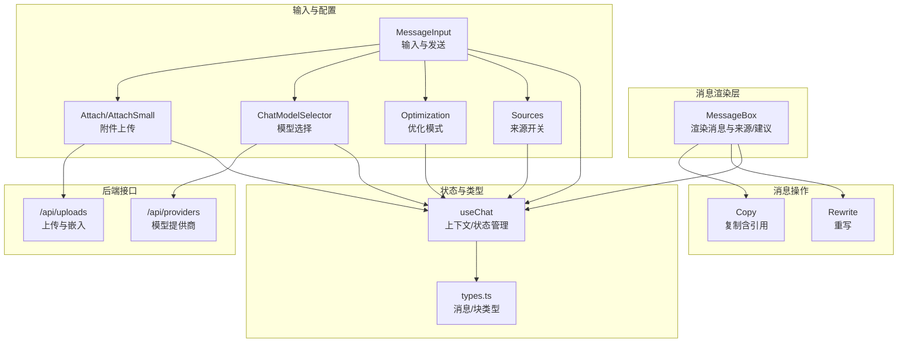
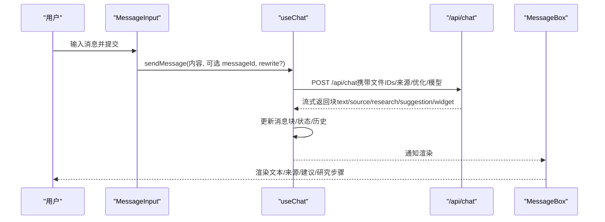
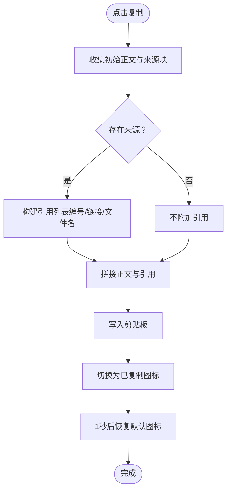
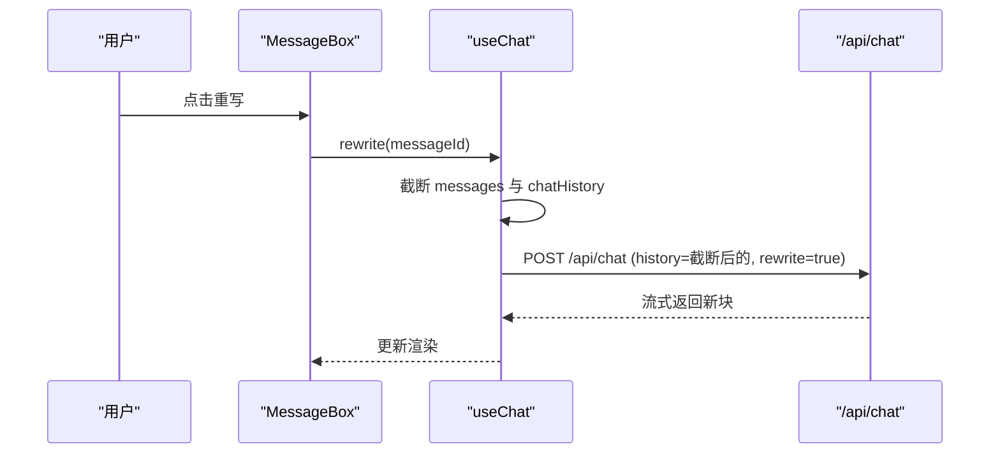
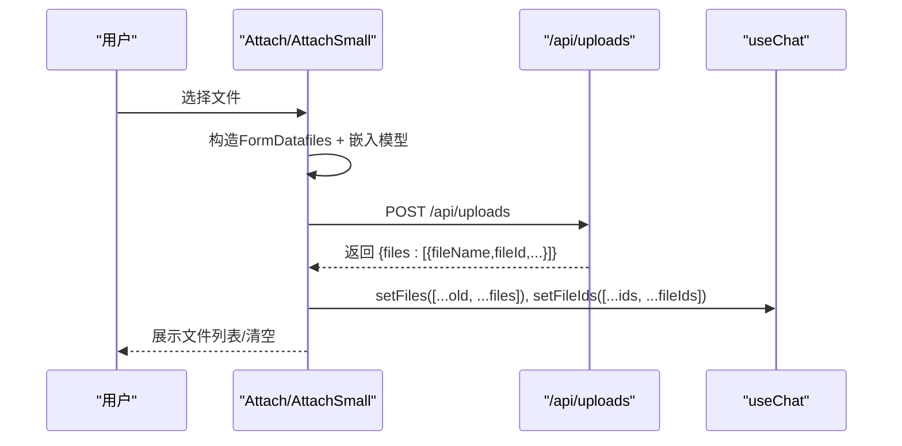
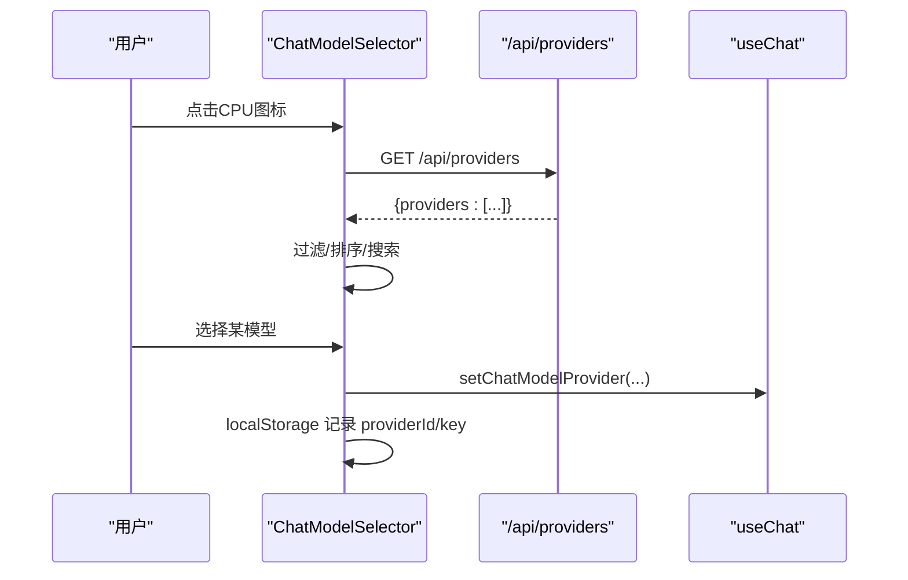
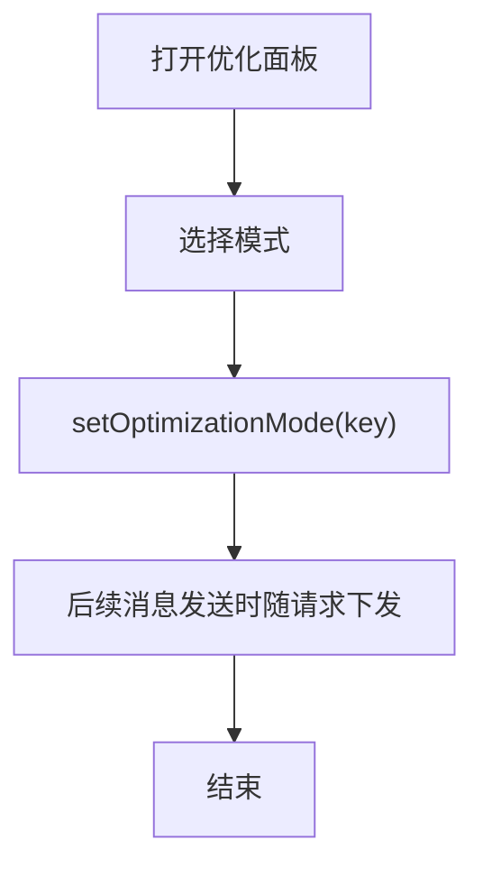
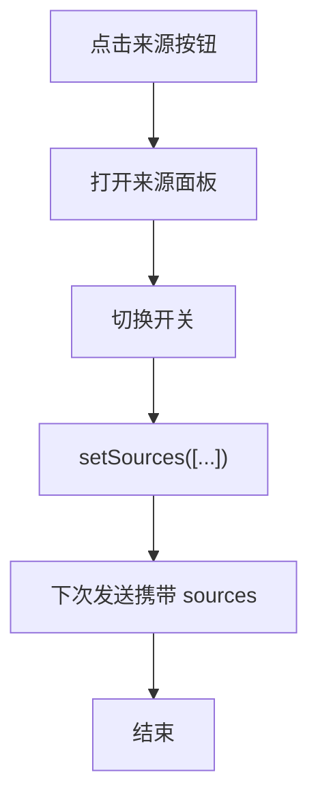
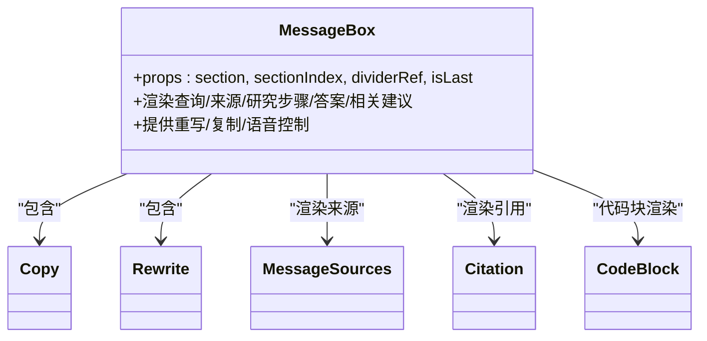
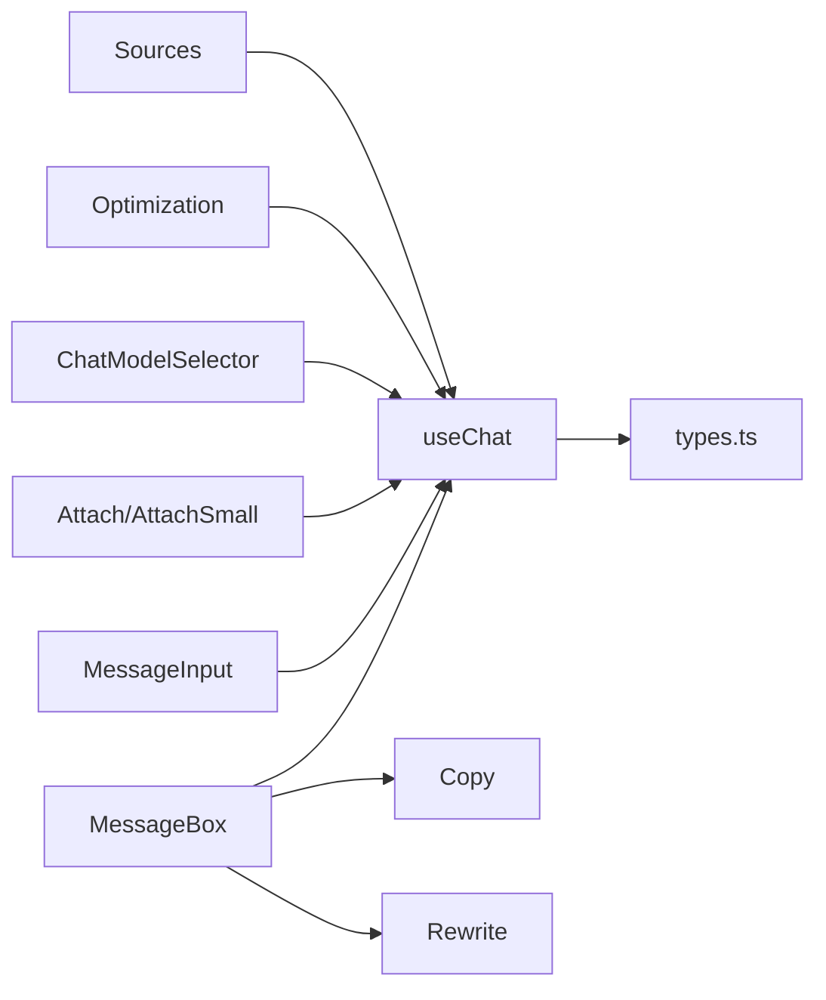

# 消息交互组件

<cite>
**本文引用的文件**
- [src/components/MessageActions/Copy.tsx](file://src/components/MessageActions/Copy.tsx)
- [src/components/MessageActions/Rewrite.tsx](file://src/components/MessageActions/Rewrite.tsx)
- [src/components/MessageInputActions/Attach.tsx](file://src/components/MessageInputActions/Attach.tsx)
- [src/components/MessageInputActions/AttachSmall.tsx](file://src/components/MessageInputActions/AttachSmall.tsx)
- [src/components/MessageInputActions/ChatModelSelector.tsx](file://src/components/MessageInputActions/ChatModelSelector.tsx)
- [src/components/MessageInputActions/Optimization.tsx](file://src/components/MessageInputActions/Optimization.tsx)
- [src/components/MessageInputActions/Sources.tsx](file://src/components/MessageInputActions/Sources.tsx)
- [src/components/MessageBox.tsx](file://src/components/MessageBox.tsx)
- [src/components/MessageInput.tsx](file://src/components/MessageInput.tsx)
- [src/lib/hooks/useChat.tsx](file://src/lib/hooks/useChat.tsx)
- [src/lib/types.ts](file://src/lib/types.ts)
- [src/components/ChatWindow.tsx](file://src/components/ChatWindow.tsx)
- [src/app/api/uploads/route.ts](file://src/app/api/uploads/route.ts)
- [src/app/api/providers/route.ts](file://src/app/api/providers/route.ts)
</cite>

## 目录
1. [简介](#简介)
2. [项目结构](#项目结构)
3. [核心组件](#核心组件)
4. [架构总览](#架构总览)
5. [详细组件分析](#详细组件分析)
6. [依赖关系分析](#依赖关系分析)
7. [性能考虑](#性能考虑)
8. [故障排查指南](#故障排查指南)
9. [结论](#结论)
10. [附录](#附录)

## 简介
本文件系统性梳理 Perplexica 的“消息交互组件”，覆盖两类能力：
- 消息操作组件：复制（带引用标注）、重写（重新生成）
- 消息输入操作组件：附件上传（含嵌入向量化）、模型选择、优化模式（速度/平衡/质量）、来源开关（网络/学术/社交）

文档从架构、数据流、处理逻辑、错误处理、性能与可访问性等方面进行深入解析，并提供使用示例、集成模式与扩展建议。

## 项目结构
消息交互组件主要分布在以下位置：
- 消息操作：MessageActions 下的 Copy 与 Rewrite
- 消息输入操作：MessageInputActions 下的 Attach/AttachSmall、ChatModelSelector、Optimization、Sources
- 渲染与容器：MessageBox 负责渲染消息块、来源、建议；MessageInput 负责输入与发送
- 状态与数据：useChat 提供全局状态与消息生命周期处理；类型定义位于 lib/types
- 后端接口：/api/uploads 用于文件上传与嵌入；/api/providers 用于模型提供商列表

图表来源
- [src/components/MessageBox.tsx](file://src/components/MessageBox.tsx#L1-L291)
- [src/components/MessageActions/Copy.tsx](file://src/components/MessageActions/Copy.tsx#L1-L49)
- [src/components/MessageActions/Rewrite.tsx](file://src/components/MessageActions/Rewrite.tsx#L1-L21)
- [src/components/MessageInput.tsx](file://src/components/MessageInput.tsx#L1-L103)
- [src/components/MessageInputActions/Attach.tsx](file://src/components/MessageInputActions/Attach.tsx#L1-L170)
- [src/components/MessageInputActions/AttachSmall.tsx](file://src/components/MessageInputActions/AttachSmall.tsx#L1-L159)
- [src/components/MessageInputActions/ChatModelSelector.tsx](file://src/components/MessageInputActions/ChatModelSelector.tsx#L1-L204)
- [src/components/MessageInputActions/Optimization.tsx](file://src/components/MessageInputActions/Optimization.tsx#L1-L115)
- [src/components/MessageInputActions/Sources.tsx](file://src/components/MessageInputActions/Sources.tsx#L1-L94)
- [src/lib/hooks/useChat.tsx](file://src/lib/hooks/useChat.tsx#L1-L848)
- [src/lib/types.ts](file://src/lib/types.ts#L1-L124)
- [src/app/api/uploads/route.ts](file://src/app/api/uploads/route.ts#L1-L41)
- [src/app/api/providers/route.ts](file://src/app/api/providers/route.ts#L1-L78)

章节来源
- [src/components/MessageBox.tsx](file://src/components/MessageBox.tsx#L1-L291)
- [src/components/MessageInput.tsx](file://src/components/MessageInput.tsx#L1-L103)
- [src/lib/hooks/useChat.tsx](file://src/lib/hooks/useChat.tsx#L1-L848)
- [src/lib/types.ts](file://src/lib/types.ts#L1-L124)

## 核心组件
- 复制（Copy）
  - 功能：将消息正文与引用列表复制到剪贴板，支持短暂“已复制”视觉反馈
  - 触发：消息操作区点击复制按钮
  - 响应：写入剪贴板，切换图标状态
- 重写（Rewrite）
  - 功能：基于当前消息 ID 回退历史并重新发起对话
  - 触发：消息操作区点击重写按钮
  - 响应：更新消息列表与历史，重新调用聊天流
- 附件上传（Attach/AttachSmall）
  - 功能：选择本地 PDF/DOCX/TXT 文件，上传并嵌入向量化，返回文件元信息
  - 触发：点击附件按钮或弹出面板中的“添加/清空”
  - 响应：加载态显示、文件列表展示、文件 ID 追加至 useChat
- 模型选择（ChatModelSelector）
  - 功能：拉取可用模型提供商与模型，支持搜索与置顶当前选中项
  - 触发：点击 CPU 图标打开下拉面板
  - 响应：本地存储选中模型，useChat 内部使用
- 优化模式（Optimization）
  - 功能：在“速度/平衡/质量”三档之间切换
  - 触发：点击优化按钮并选择模式
  - 响应：设置 optimizationMode 并随请求下发
- 来源开关（Sources）
  - 功能：控制 Web/Academic/Social 三种来源的启用状态
  - 触发：点击 globe 图标打开面板，切换开关
  - 响应：更新 sources 列表并随请求下发

章节来源
- [src/components/MessageActions/Copy.tsx](file://src/components/MessageActions/Copy.tsx#L1-L49)
- [src/components/MessageActions/Rewrite.tsx](file://src/components/MessageActions/Rewrite.tsx#L1-L21)
- [src/components/MessageInputActions/Attach.tsx](file://src/components/MessageInputActions/Attach.tsx#L1-L170)
- [src/components/MessageInputActions/AttachSmall.tsx](file://src/components/MessageInputActions/AttachSmall.tsx#L1-L159)
- [src/components/MessageInputActions/ChatModelSelector.tsx](file://src/components/MessageInputActions/ChatModelSelector.tsx#L1-L204)
- [src/components/MessageInputActions/Optimization.tsx](file://src/components/MessageInputActions/Optimization.tsx#L1-L115)
- [src/components/MessageInputActions/Sources.tsx](file://src/components/MessageInputActions/Sources.tsx#L1-L94)

## 架构总览
消息交互组件围绕 useChat 上下文展开，通过事件驱动与流式响应更新界面状态。输入侧将附件、模型、优化与来源等参数打包发送；输出侧按块（文本/来源/研究步骤/小部件/建议）增量渲染。

图表来源
- [src/components/MessageInput.tsx](file://src/components/MessageInput.tsx#L1-L103)
- [src/lib/hooks/useChat.tsx](file://src/lib/hooks/useChat.tsx#L714-L806)
- [src/components/MessageBox.tsx](file://src/components/MessageBox.tsx#L1-L291)

章节来源
- [src/lib/hooks/useChat.tsx](file://src/lib/hooks/useChat.tsx#L714-L806)
- [src/components/MessageInput.tsx](file://src/components/MessageInput.tsx#L1-L103)
- [src/components/MessageBox.tsx](file://src/components/MessageBox.tsx#L1-L291)

## 详细组件分析

### 复制（Copy）
- 功能要点
  - 收集当前段落的文本块与来源块，拼接引用列表（含文件名或 URL）
  - 使用浏览器剪贴板 API 写入
  - 点击后短暂切换为“已复制”图标，自动复位
- 数据与状态
  - 依赖 Section（包含 message/responseBlocks/parsedTextBlocks）
  - 读取 SourceBlock 列表，映射为有序编号引用
- 错误与边界
  - 无来源时仅复制正文
  - 异常由上层统一 toast 处理

图表来源
- [src/components/MessageActions/Copy.tsx](file://src/components/MessageActions/Copy.tsx#L1-L49)

章节来源
- [src/components/MessageActions/Copy.tsx](file://src/components/MessageActions/Copy.tsx#L1-L49)

### 重写（Rewrite）
- 功能要点
  - 根据 messageId 定位消息，回滚历史与消息列表
  - 以相同查询重新发起请求（rewrite 标记）
- 关键流程
  - rewrite(messageId) -> 截断 messages 与 chatHistory -> sendMessage(query, messageId, true)

图表来源
- [src/components/MessageActions/Rewrite.tsx](file://src/components/MessageActions/Rewrite.tsx#L1-L21)
- [src/lib/hooks/useChat.tsx](file://src/lib/hooks/useChat.tsx#L526-L537)
- [src/lib/hooks/useChat.tsx](file://src/lib/hooks/useChat.tsx#L714-L806)

章节来源
- [src/components/MessageActions/Rewrite.tsx](file://src/components/MessageActions/Rewrite.tsx#L1-L21)
- [src/lib/hooks/useChat.tsx](file://src/lib/hooks/useChat.tsx#L526-L537)
- [src/lib/hooks/useChat.tsx](file://src/lib/hooks/useChat.tsx#L714-L806)

### 附件上传（Attach/AttachSmall）
- 功能要点
  - 选择文件后构造 FormData，附带当前嵌入模型提供商与键
  - 调用 /api/uploads，得到文件元数据（含 fileId），追加到 useChat 的 files 与 fileIds
  - 支持弹出面板查看/新增/清空文件
- 数据流
  - 本地状态 files/fileIds 与 useChat 共享
  - 发送消息时随请求体下发 fileIds

图表来源
- [src/components/MessageInputActions/Attach.tsx](file://src/components/MessageInputActions/Attach.tsx#L28-L54)
- [src/components/MessageInputActions/AttachSmall.tsx](file://src/components/MessageInputActions/AttachSmall.tsx#L19-L45)
- [src/app/api/uploads/route.ts](file://src/app/api/uploads/route.ts#L5-L32)
- [src/lib/hooks/useChat.tsx](file://src/lib/hooks/useChat.tsx#L35-L37)

章节来源
- [src/components/MessageInputActions/Attach.tsx](file://src/components/MessageInputActions/Attach.tsx#L1-L170)
- [src/components/MessageInputActions/AttachSmall.tsx](file://src/components/MessageInputActions/AttachSmall.tsx#L1-L159)
- [src/app/api/uploads/route.ts](file://src/app/api/uploads/route.ts#L1-L41)
- [src/lib/hooks/useChat.tsx](file://src/lib/hooks/useChat.tsx#L35-L37)

### 模型选择（ChatModelSelector）
- 功能要点
  - 首次加载 /api/providers 获取可用提供商与模型
  - 支持搜索过滤，当前选中模型置顶
  - 选择后写入 localStorage 并更新 useChat 的 chatModelProvider
- 交互细节
  - 打开面板时动画入场
  - 无模型时提示“未配置”

图表来源
- [src/components/MessageInputActions/ChatModelSelector.tsx](file://src/components/MessageInputActions/ChatModelSelector.tsx#L18-L38)
- [src/components/MessageInputActions/ChatModelSelector.tsx](file://src/components/MessageInputActions/ChatModelSelector.tsx#L59-L63)
- [src/app/api/providers/route.ts](file://src/app/api/providers/route.ts#L5-L22)

章节来源
- [src/components/MessageInputActions/ChatModelSelector.tsx](file://src/components/MessageInputActions/ChatModelSelector.tsx#L1-L204)
- [src/app/api/providers/route.ts](file://src/app/api/providers/route.ts#L1-L78)

### 优化模式（Optimization）
- 功能要点
  - 三档模式：速度（优先快）、平衡（兼顾）、质量（更详尽）
  - 通过 Popover 展示图标与描述，选择后更新 optimizationMode
- 使用场景
  - 在追求响应速度与追求答案质量之间权衡

图表来源
- [src/components/MessageInputActions/Optimization.tsx](file://src/components/MessageInputActions/Optimization.tsx#L39-L112)
- [src/lib/hooks/useChat.tsx](file://src/lib/hooks/useChat.tsx#L291)

章节来源
- [src/components/MessageInputActions/Optimization.tsx](file://src/components/MessageInputActions/Optimization.tsx#L1-L115)
- [src/lib/hooks/useChat.tsx](file://src/lib/hooks/useChat.tsx#L291)

### 来源开关（Sources）
- 功能要点
  - 控制 Web/Academic/Social 三种来源的启用状态
  - 通过 Switch 开关切换，更新 sources 列表
- 请求传递
  - 发送消息时随 sources 参数下发

图表来源
- [src/components/MessageInputActions/Sources.tsx](file://src/components/MessageInputActions/Sources.tsx#L33-L91)
- [src/lib/hooks/useChat.tsx](file://src/lib/hooks/useChat.tsx#L290)

章节来源
- [src/components/MessageInputActions/Sources.tsx](file://src/components/MessageInputActions/Sources.tsx#L1-L94)
- [src/lib/hooks/useChat.tsx](file://src/lib/hooks/useChat.tsx#L290)

### 消息渲染与交互（MessageBox）
- 功能要点
  - 渲染查询、来源、研究步骤、答案、相关建议
  - 提供“重写”“复制”“语音播放/停止”等操作入口
  - 对最后一条非加载中的消息，展示“相关”建议区域
- 数据来源
  - 依赖 useChat 的 sections（解析后的文本块、思考结束标记、建议等）

图表来源
- [src/components/MessageBox.tsx](file://src/components/MessageBox.tsx#L42-L291)
- [src/components/MessageActions/Copy.tsx](file://src/components/MessageActions/Copy.tsx#L1-L49)
- [src/components/MessageActions/Rewrite.tsx](file://src/components/MessageActions/Rewrite.tsx#L1-L21)

章节来源
- [src/components/MessageBox.tsx](file://src/components/MessageBox.tsx#L1-L291)

### 输入与发送（MessageInput）
- 功能要点
  - 自适应高度的多行输入，支持单行/多行模式
  - Enter 发送，快捷键 “/” 聚焦输入
  - 单行模式下显示 AttachSmall，多行模式下底部显示
- 与附件联动
  - 通过 useChat 的 files/fileIds 与 Attach 组件共享

章节来源
- [src/components/MessageInput.tsx](file://src/components/MessageInput.tsx#L1-L103)
- [src/components/MessageInputActions/AttachSmall.tsx](file://src/components/MessageInputActions/AttachSmall.tsx#L1-L159)

## 依赖关系分析
- 组件耦合
  - MessageBox 依赖 useChat 的 sections 与操作函数（rewrite/copy）
  - MessageInput 依赖 useChat 的 sendMessage 与 loading 状态
  - 附件组件依赖 useChat 的 files/fileIds 与 localStorage 中嵌入模型配置
- 类型与数据结构
  - Message/Block/SourceBlock/ResearchBlock 等类型定义于 lib/types
  - useChat 将服务端流式块转换为 Section 以便渲染

图表来源
- [src/lib/hooks/useChat.tsx](file://src/lib/hooks/useChat.tsx#L1-L848)
- [src/lib/types.ts](file://src/lib/types.ts#L28-L124)
- [src/components/MessageBox.tsx](file://src/components/MessageBox.tsx#L1-L291)
- [src/components/MessageInput.tsx](file://src/components/MessageInput.tsx#L1-L103)
- [src/components/MessageInputActions/Attach.tsx](file://src/components/MessageInputActions/Attach.tsx#L1-L170)
- [src/components/MessageInputActions/AttachSmall.tsx](file://src/components/MessageInputActions/AttachSmall.tsx#L1-L159)
- [src/components/MessageInputActions/ChatModelSelector.tsx](file://src/components/MessageInputActions/ChatModelSelector.tsx#L1-L204)
- [src/components/MessageInputActions/Optimization.tsx](file://src/components/MessageInputActions/Optimization.tsx#L1-L115)
- [src/components/MessageInputActions/Sources.tsx](file://src/components/MessageInputActions/Sources.tsx#L1-L94)

章节来源
- [src/lib/hooks/useChat.tsx](file://src/lib/hooks/useChat.tsx#L1-L848)
- [src/lib/types.ts](file://src/lib/types.ts#L1-L124)

## 性能考虑
- 流式渲染
  - 服务端以流形式推送块，useChat 逐步更新消息与渲染，避免一次性大对象渲染
- 本地状态最小化
  - 附件文件仅保存元信息与 fileId，减少内存占用
- 搜索与排序
  - 模型选择支持前端搜索过滤，避免不必要的网络请求
- 动画与可见性
  - Popover/动画采用轻量库，仅在打开时渲染，减少常驻开销

## 故障排查指南
- 无法复制
  - 检查浏览器剪贴板权限与 HTTPS 环境
  - 确认 Copy 组件正确收集了 parsedTextBlocks 与 SourceBlock
- 重写无效
  - 确认 messageId 存在且 messages 中存在对应项
  - 检查 rewrite 调用是否传入 rewrite=true
- 附件上传失败
  - 检查 /api/uploads 返回的嵌入模型配置是否完整
  - 查看网络面板与服务端日志
- 模型不可选
  - 确认 /api/providers 返回的 providers 是否为空
  - 检查 localStorage 中的 chatModelProviderId/chatModelKey 是否匹配
- 优化/来源不生效
  - 确认 optimizationMode 与 sources 已更新并在 sendMessage 请求中下发

章节来源
- [src/components/MessageActions/Copy.tsx](file://src/components/MessageActions/Copy.tsx#L1-L49)
- [src/components/MessageActions/Rewrite.tsx](file://src/components/MessageActions/Rewrite.tsx#L1-L21)
- [src/lib/hooks/useChat.tsx](file://src/lib/hooks/useChat.tsx#L526-L537)
- [src/app/api/uploads/route.ts](file://src/app/api/uploads/route.ts#L1-L41)
- [src/app/api/providers/route.ts](file://src/app/api/providers/route.ts#L1-L78)

## 结论
消息交互组件通过清晰的职责划分与 useChat 上下文实现了高内聚、低耦合的消息生命周期管理。输入侧提供丰富的可配置项（模型/优化/来源/附件），输出侧以块为单位增量渲染，既保证了用户体验，也便于扩展与维护。

## 附录

### 使用示例与集成模式
- 在消息页集成
  - 将 MessageBox 作为消息渲染容器，内部自动渲染 Copy/Rewrite/语音/来源/建议
  - 在 MessageInput 中组合 AttachSmall/模型/优化/来源组件
- 附件上传集成
  - 在输入框旁放置 Attach/AttachSmall，选择文件后自动上传并注入 fileIds
- 模型与来源配置
  - 通过 ChatModelSelector 与 Sources 组件在会话前或会话中动态调整

章节来源
- [src/components/MessageBox.tsx](file://src/components/MessageBox.tsx#L1-L291)
- [src/components/MessageInput.tsx](file://src/components/MessageInput.tsx#L1-L103)
- [src/components/MessageInputActions/Attach.tsx](file://src/components/MessageInputActions/Attach.tsx#L1-L170)
- [src/components/MessageInputActions/AttachSmall.tsx](file://src/components/MessageInputActions/AttachSmall.tsx#L1-L159)
- [src/components/MessageInputActions/ChatModelSelector.tsx](file://src/components/MessageInputActions/ChatModelSelector.tsx#L1-L204)
- [src/components/MessageInputActions/Sources.tsx](file://src/components/MessageInputActions/Sources.tsx#L1-L94)

### 无障碍与体验优化
- 键盘快捷键
  - “/” 快捷键聚焦输入框，提升键盘可达性
- 状态反馈
  - 复制成功、加载中、错误 toast 统一提示
- 动画与过渡
  - Popover/动画采用轻量库，避免卡顿
- 可访问性建议
  - 为按钮添加 aria-label
  - 为 Switch/Popover 提供键盘操作与焦点管理

章节来源
- [src/components/MessageInput.tsx](file://src/components/MessageInput.tsx#L26-L46)
- [src/lib/hooks/useChat.tsx](file://src/lib/hooks/useChat.tsx#L554-L556)

### 扩展与自定义指导
- 新增消息操作
  - 参考 Copy/Rewrite 的模式，在 MessageBox 中添加按钮并绑定回调
  - 若需服务端协作，新增相应 API 并在 useChat 中接入
- 新增输入操作
  - 参考 Attach/ChatModelSelector/Optimization/Sources 的模式，使用 useChat 状态与 localStorage
  - 注意与 sendMessage 请求体的对接
- 数据结构与类型
  - 如需新增块类型，参照 types.ts 的 Block/TextBlock/SourceBlock 等定义，确保渲染与序列化一致

章节来源
- [src/components/MessageActions/Copy.tsx](file://src/components/MessageActions/Copy.tsx#L1-L49)
- [src/components/MessageActions/Rewrite.tsx](file://src/components/MessageActions/Rewrite.tsx#L1-L21)
- [src/components/MessageInputActions/Attach.tsx](file://src/components/MessageInputActions/Attach.tsx#L1-L170)
- [src/components/MessageInputActions/ChatModelSelector.tsx](file://src/components/MessageInputActions/ChatModelSelector.tsx#L1-L204)
- [src/components/MessageInputActions/Optimization.tsx](file://src/components/MessageInputActions/Optimization.tsx#L1-L115)
- [src/components/MessageInputActions/Sources.tsx](file://src/components/MessageInputActions/Sources.tsx#L1-L94)
- [src/lib/types.ts](file://src/lib/types.ts#L118-L124)