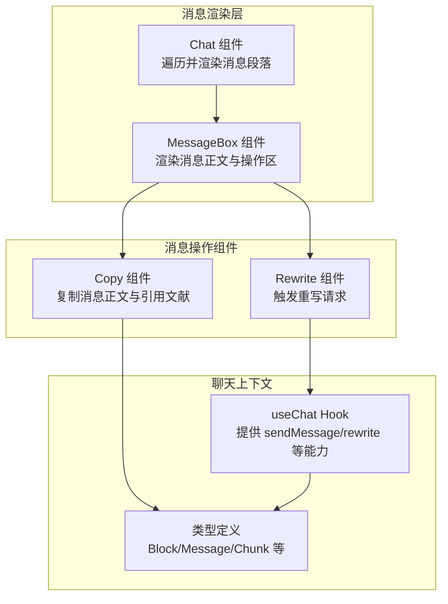
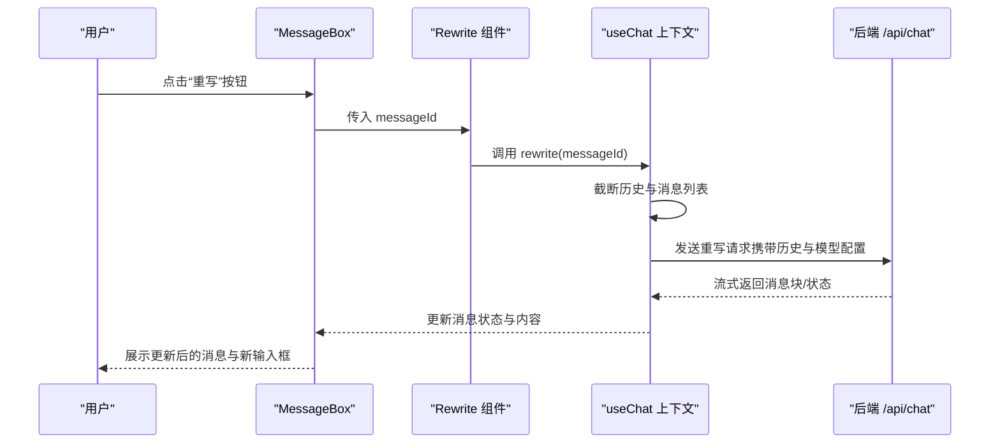
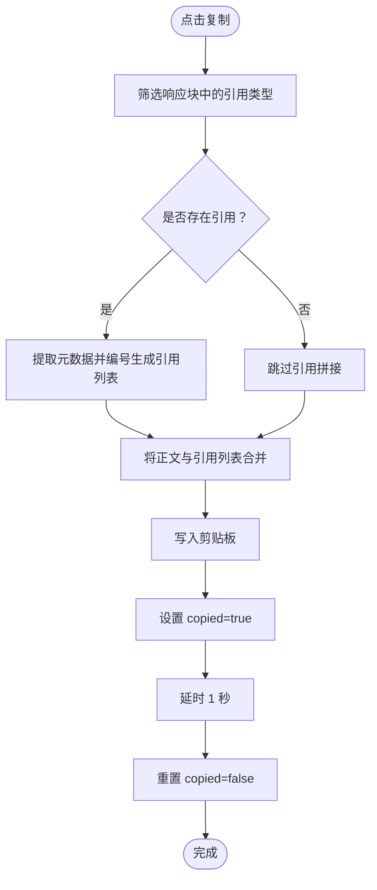
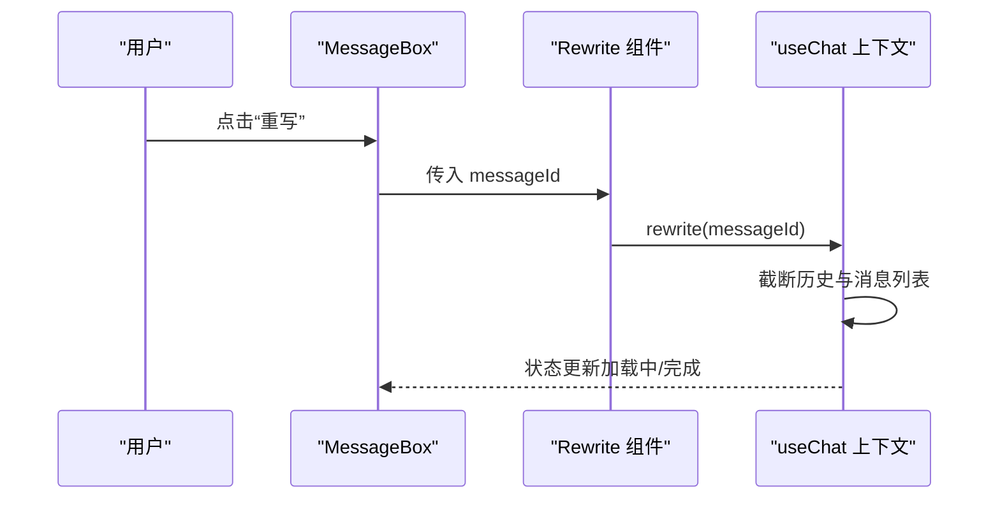
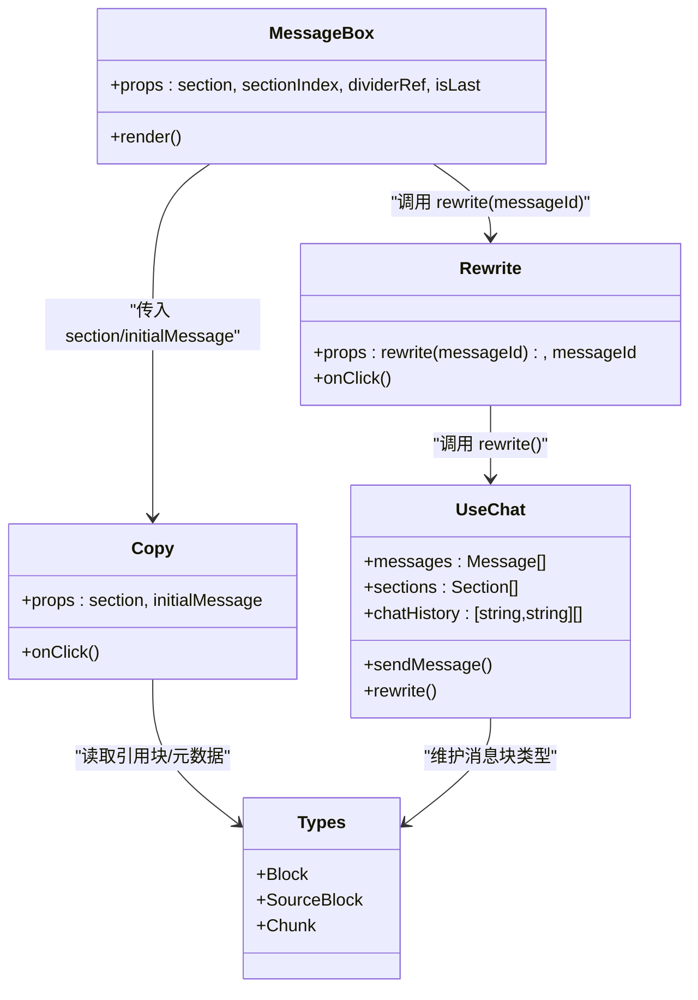
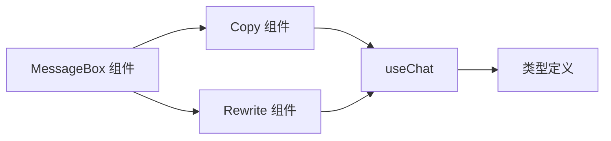

# 消息操作组件

<cite>
**本文档引用的文件**
- [src/components/MessageActions/Copy.tsx](file://src/components/MessageActions/Copy.tsx)
- [src/components/MessageActions/Rewrite.tsx](file://src/components/MessageActions/Rewrite.tsx)
- [src/components/MessageBox.tsx](file://src/components/MessageBox.tsx)
- [src/components/Chat.tsx](file://src/components/Chat.tsx)
- [src/lib/hooks/useChat.tsx](file://src/lib/hooks/useChat.tsx)
- [src/lib/types.ts](file://src/lib/types.ts)
- [src/components/ChatWindow.tsx](file://src/components/ChatWindow.tsx)
</cite>

## 目录
1. [简介](#简介)
2. [项目结构](#项目结构)
3. [核心组件](#核心组件)
4. [架构总览](#架构总览)
5. [组件详解](#组件详解)
6. [依赖关系分析](#依赖关系分析)
7. [性能考量](#性能考量)
8. [故障排查指南](#故障排查指南)
9. [结论](#结论)

## 简介
本文件聚焦于 Perplexica 的“消息操作”组件，重点解析两个核心功能：复制（Copy）与重写（Rewrite）。我们将从实现原理、使用方式、与聊天系统集成的数据流、用户体验与错误处理最佳实践等维度进行深入说明，并通过图示帮助读者快速理解组件间的协作关系。

## 项目结构
消息操作组件位于组件层，围绕消息渲染与交互展开，主要涉及以下文件：
- 复制组件：负责将消息正文与引用文献整合后写入剪贴板，并提供即时反馈
- 重写组件：触发对指定消息的重新生成流程
- 消息渲染容器：在每条消息末尾渲染操作按钮并绑定事件
- 聊天上下文：提供发送消息、重写、状态管理等能力

图表来源
- [src/components/MessageActions/Copy.tsx](file://src/components/MessageActions/Copy.tsx#L1-L49)
- [src/components/MessageActions/Rewrite.tsx](file://src/components/MessageActions/Rewrite.tsx#L1-L21)
- [src/components/MessageBox.tsx](file://src/components/MessageBox.tsx#L1-L291)
- [src/components/Chat.tsx](file://src/components/Chat.tsx#L1-L109)
- [src/lib/hooks/useChat.tsx](file://src/lib/hooks/useChat.tsx#L1-L848)
- [src/lib/types.ts](file://src/lib/types.ts#L1-L124)

章节来源
- [src/components/MessageActions/Copy.tsx](file://src/components/MessageActions/Copy.tsx#L1-L49)
- [src/components/MessageActions/Rewrite.tsx](file://src/components/MessageActions/Rewrite.tsx#L1-L21)
- [src/components/MessageBox.tsx](file://src/components/MessageBox.tsx#L1-L291)
- [src/components/Chat.tsx](file://src/components/Chat.tsx#L1-L109)
- [src/lib/hooks/useChat.tsx](file://src/lib/hooks/useChat.tsx#L1-L848)
- [src/lib/types.ts](file://src/lib/types.ts#L1-L124)

## 核心组件
- 复制组件（Copy）
  - 功能：将当前消息正文与引用文献合并为可复制文本，写入剪贴板，并短暂提示“已复制”
  - 关键点：过滤响应块中的引用类型块，提取元数据，拼接为带编号的引用列表
- 重写组件（Rewrite）
  - 功能：向聊天上下文触发重写流程，删除该消息之后的历史记录并重新发起对话
  - 关键点：接收 messageId 并调用上下文提供的 rewrite 方法

章节来源
- [src/components/MessageActions/Copy.tsx](file://src/components/MessageActions/Copy.tsx#L7-L46)
- [src/components/MessageActions/Rewrite.tsx](file://src/components/MessageActions/Rewrite.tsx#L3-L18)
- [src/lib/types.ts](file://src/lib/types.ts#L45-L49)

## 架构总览
消息操作组件与聊天系统通过上下文解耦，渲染层仅负责组装 UI 与事件绑定，业务逻辑由上下文统一处理。

图表来源
- [src/components/MessageBox.tsx](file://src/components/MessageBox.tsx#L193-L196)
- [src/components/MessageActions/Rewrite.tsx](file://src/components/MessageActions/Rewrite.tsx#L10-L16)
- [src/lib/hooks/useChat.tsx](file://src/lib/hooks/useChat.tsx#L526-L537)
- [src/lib/hooks/useChat.tsx](file://src/lib/hooks/useChat.tsx#L714-L800)

## 组件详解

### 复制组件（Copy）
- 输入参数
  - section：当前消息段落的上下文对象，包含消息体与解析后的文本块
  - initialMessage：消息正文的纯文本版本
- 处理逻辑
  - 过滤响应块中类型为“引用”的块，提取所有 Chunk 数据
  - 将每个 Chunk 的元数据转换为带编号的引用列表；若 URL 以特定前缀开头，则优先显示文件名
  - 将正文与引用列表拼接为最终复制内容
  - 写入剪贴板，设置“已复制”状态并在短暂延迟后恢复
- 用户反馈
  - 按钮图标随状态切换；复制成功后短暂提示

图表来源
- [src/components/MessageActions/Copy.tsx](file://src/components/MessageActions/Copy.tsx#L18-L40)
- [src/lib/types.ts](file://src/lib/types.ts#L45-L49)

章节来源
- [src/components/MessageActions/Copy.tsx](file://src/components/MessageActions/Copy.tsx#L7-L46)
- [src/lib/types.ts](file://src/lib/types.ts#L45-L49)

### 重写组件（Rewrite）
- 输入参数
  - rewrite：来自 useChat 的重写函数
  - messageId：目标消息 ID
- 触发流程
  - 点击按钮后直接调用 rewrite(messageId)
  - 由上下文执行截断历史与消息列表，并重新发起对话请求

图表来源
- [src/components/MessageBox.tsx](file://src/components/MessageBox.tsx#L193-L196)
- [src/components/MessageActions/Rewrite.tsx](file://src/components/MessageActions/Rewrite.tsx#L10-L16)
- [src/lib/hooks/useChat.tsx](file://src/lib/hooks/useChat.tsx#L526-L537)

章节来源
- [src/components/MessageActions/Rewrite.tsx](file://src/components/MessageActions/Rewrite.tsx#L3-L18)
- [src/components/MessageBox.tsx](file://src/components/MessageBox.tsx#L193-L196)
- [src/lib/hooks/useChat.tsx](file://src/lib/hooks/useChat.tsx#L526-L537)

### 与聊天系统的集成与数据传递
- 渲染层（MessageBox）
  - 从 useChat 获取 messages、sections、loading、researchEnded 等状态
  - 在每条消息底部渲染操作区，包含重写与复制按钮
  - 重写按钮绑定 rewrite(messageId)，复制按钮绑定 Copy 组件并传入初始正文与段落上下文
- 上下文层（useChat）
  - 提供 rewrite(messageId)：截断历史与消息列表，基于原消息内容重新发起请求
  - 提供 sendMessage：封装流式响应处理、状态更新、建议块注入等
  - 维护 chatHistory、sources、files 等全局状态，用于重写时的历史裁剪与请求参数
- 类型层（lib/types）
  - 定义 Block、SourceBlock、Chunk 等，支撑复制组件对引用块的解析与拼接

图表来源
- [src/components/MessageBox.tsx](file://src/components/MessageBox.tsx#L42-L60)
- [src/components/MessageActions/Rewrite.tsx](file://src/components/MessageActions/Rewrite.tsx#L3-L18)
- [src/components/MessageActions/Copy.tsx](file://src/components/MessageActions/Copy.tsx#L7-L14)
- [src/lib/hooks/useChat.tsx](file://src/lib/hooks/useChat.tsx#L31-L62)
- [src/lib/types.ts](file://src/lib/types.ts#L118-L124)

章节来源
- [src/components/MessageBox.tsx](file://src/components/MessageBox.tsx#L42-L60)
- [src/lib/hooks/useChat.tsx](file://src/lib/hooks/useChat.tsx#L31-L62)
- [src/lib/types.ts](file://src/lib/types.ts#L118-L124)

## 依赖关系分析
- 组件内聚性
  - Copy/Rewrite 均为无状态组件，职责单一，内聚度高
- 组件耦合
  - 两者均依赖 useChat 提供的能力；MessageBox 作为容器负责装配与事件传递
- 外部依赖
  - 复制组件依赖浏览器剪贴板 API
  - 重写组件依赖 useChat 的重写逻辑与历史裁剪

图表来源
- [src/components/MessageActions/Copy.tsx](file://src/components/MessageActions/Copy.tsx#L1-L6)
- [src/components/MessageActions/Rewrite.tsx](file://src/components/MessageActions/Rewrite.tsx#L1-L9)
- [src/components/MessageBox.tsx](file://src/components/MessageBox.tsx#L16-L25)
- [src/lib/hooks/useChat.tsx](file://src/lib/hooks/useChat.tsx#L1-L20)
- [src/lib/types.ts](file://src/lib/types.ts#L1-L6)

章节来源
- [src/components/MessageActions/Copy.tsx](file://src/components/MessageActions/Copy.tsx#L1-L6)
- [src/components/MessageActions/Rewrite.tsx](file://src/components/MessageActions/Rewrite.tsx#L1-L9)
- [src/components/MessageBox.tsx](file://src/components/MessageBox.tsx#L16-L25)
- [src/lib/hooks/useChat.tsx](file://src/lib/hooks/useChat.tsx#L1-L20)
- [src/lib/types.ts](file://src/lib/types.ts#L1-L6)

## 性能考量
- 复制操作
  - 引用块过滤与拼接为 O(n) 操作，n 为引用块数量；建议在大量引用场景下避免重复计算，可在上层缓存中间态
- 重写流程
  - 历史截断与消息列表裁剪为 O(m) 操作，m 为历史项数；注意在长对话中控制截断范围
- 渲染层
  - MessageBox 使用 memo 化与分段渲染，减少不必要的重绘；建议保持组件粒度小、职责单一

## 故障排查指南
- 复制无效或无反馈
  - 检查浏览器剪贴板权限与安全上下文（HTTPS），确认按钮点击事件已绑定
  - 确认传入的 initialMessage 与 section 是否正确
- 重写不生效
  - 确认 messageId 是否存在且与当前消息匹配
  - 检查 useChat 的 rewrite 实现是否被调用，以及历史截断逻辑是否正确
- 流式响应异常
  - 关注上下文对 messageEnd、updateBlock、block 等事件的处理，确保状态更新链路完整

章节来源
- [src/components/MessageActions/Copy.tsx](file://src/components/MessageActions/Copy.tsx#L18-L40)
- [src/components/MessageActions/Rewrite.tsx](file://src/components/MessageActions/Rewrite.tsx#L10-L16)
- [src/lib/hooks/useChat.tsx](file://src/lib/hooks/useChat.tsx#L550-L712)

## 结论
复制与重写组件通过简洁的接口与明确的职责分工，有效提升了消息的可编辑性与可复用性。复制组件关注内容与引用的格式化与剪贴板写入，重写组件则通过上下文完成历史裁剪与重新生成。二者与渲染层、上下文层、类型层协同工作，形成清晰的单向数据流与低耦合的组件架构。建议在实际使用中结合性能优化与错误处理策略，持续提升用户体验。