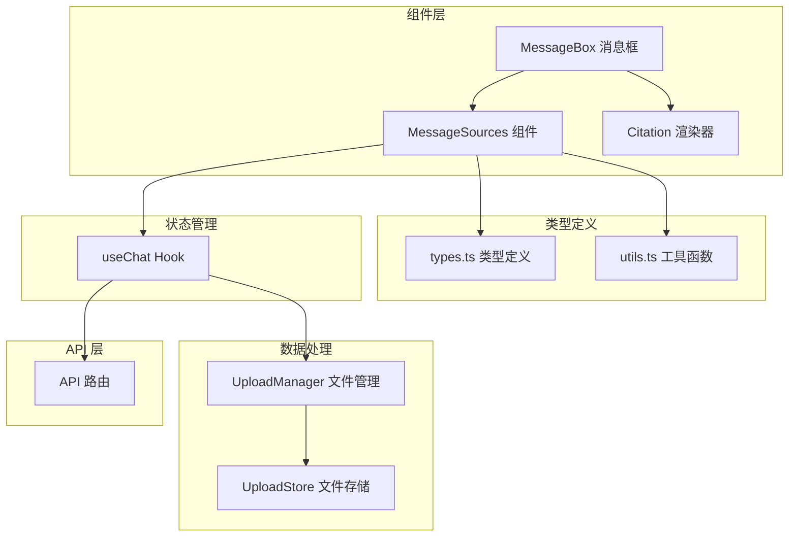
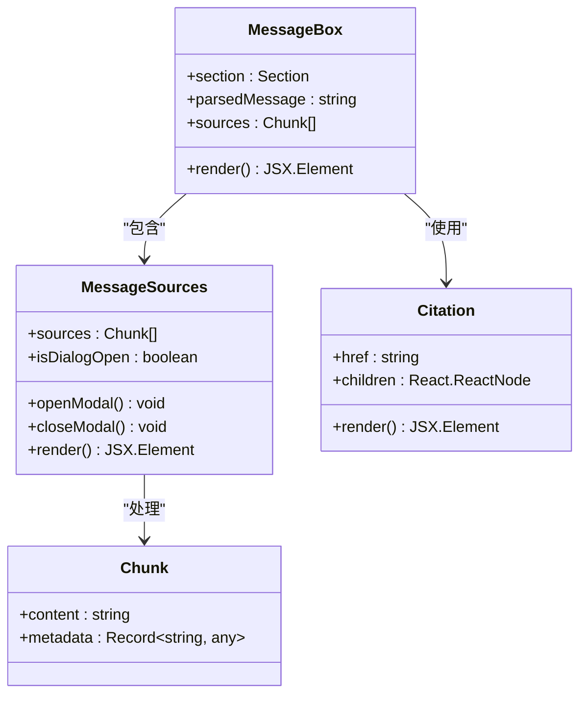
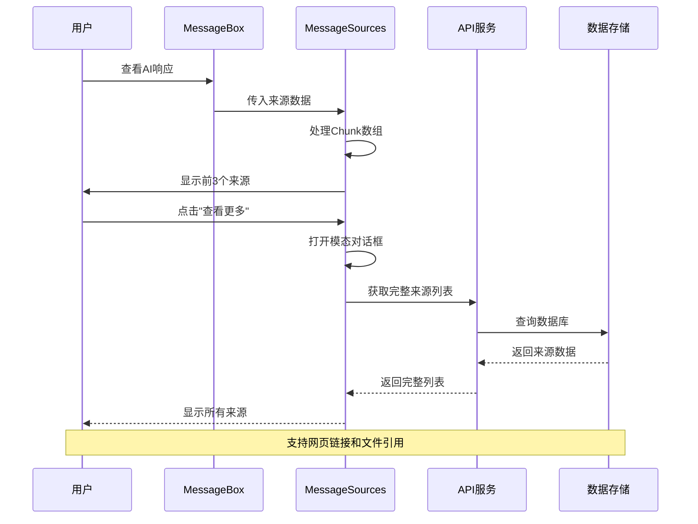
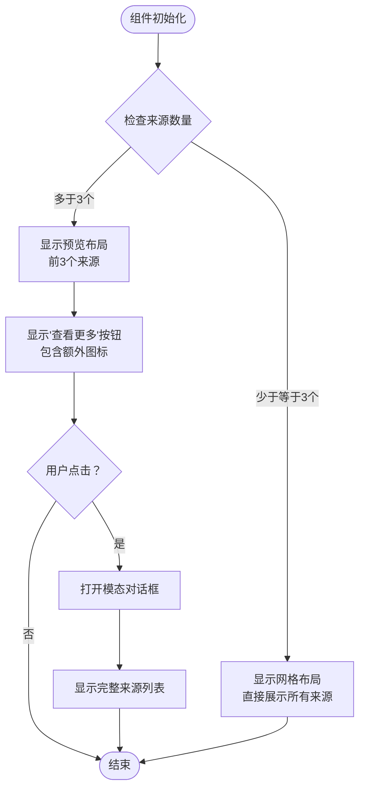
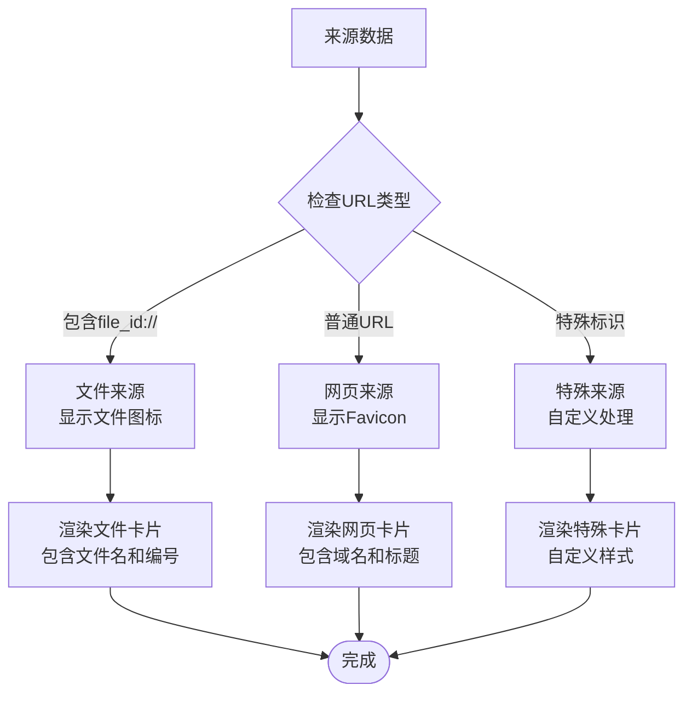
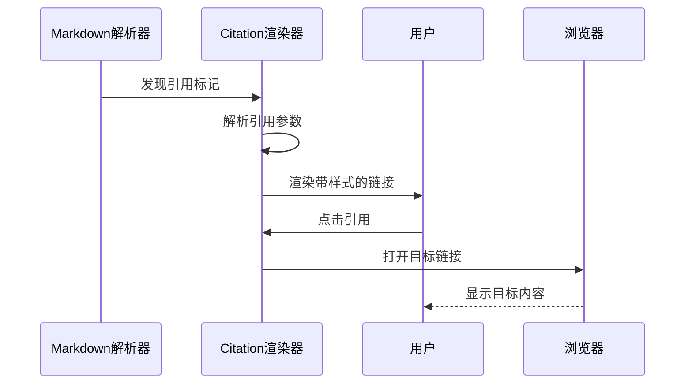
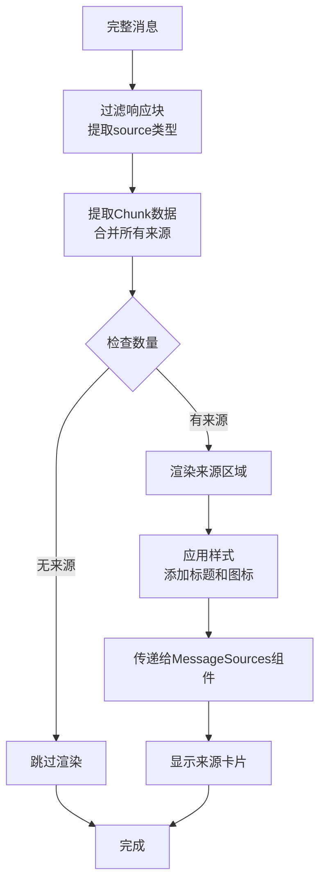
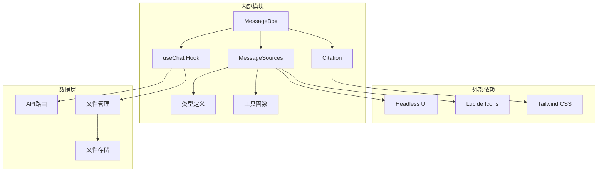
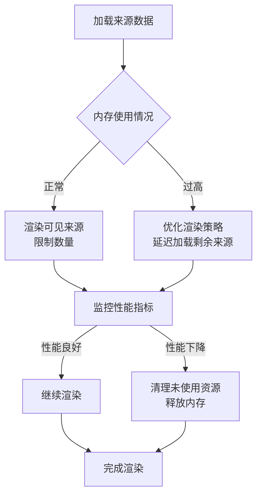

# 消息来源组件

<cite>
**本文档引用的文件**
- [src/components/MessageSources.tsx](file://src/components/MessageSources.tsx)
- [src/components/MessageRenderer/Citation.tsx](file://src/components/MessageRenderer/Citation.tsx)
- [src/components/MessageBox.tsx](file://src/components/MessageBox.tsx)
- [src/lib/types.ts](file://src/lib/types.ts)
- [src/lib/utils.ts](file://src/lib/utils.ts)
- [src/lib/hooks/useChat.tsx](file://src/lib/hooks/useChat.tsx)
- [src/app/api/search/route.ts](file://src/app/api/search/route.ts)
- [src/lib/uploads/manager.ts](file://src/lib/uploads/manager.ts)
- [src/lib/uploads/store.ts](file://src/lib/uploads/store.ts)
</cite>

## 目录
1. [简介](#简介)
2. [项目结构](#项目结构)
3. [核心组件](#核心组件)
4. [架构概览](#架构概览)
5. [详细组件分析](#详细组件分析)
6. [依赖关系分析](#依赖关系分析)
7. [性能考虑](#性能考虑)
8. [故障排除指南](#故障排除指南)
9. [结论](#结论)

## 简介

消息来源组件是 Perplexica AI 搜索引擎中用于展示和管理 AI 响应引用文献的核心功能模块。该组件负责处理和显示来自不同数据源的引用信息，包括网页链接、文件引用和其他资源类型。通过直观的用户界面设计，用户可以轻松查看、管理和访问这些引用来源。

该组件采用响应式设计，支持多种数据源格式，并提供了完整的用户交互功能，包括点击展开、链接跳转和引用标记等特性。同时，组件还集成了无障碍访问支持和用户体验优化功能。

## 项目结构

消息来源组件在项目中的位置和组织结构如下：

**图表来源**
- [src/components/MessageSources.tsx](file://src/components/MessageSources.tsx#L1-L166)
- [src/components/MessageBox.tsx](file://src/components/MessageBox.tsx#L1-L291)
- [src/lib/types.ts](file://src/lib/types.ts#L34-L49)

**章节来源**
- [src/components/MessageSources.tsx](file://src/components/MessageSources.tsx#L1-L166)
- [src/components/MessageBox.tsx](file://src/components/MessageBox.tsx#L1-L291)
- [src/lib/types.ts](file://src/lib/types.ts#L1-L124)

## 核心组件

消息来源组件由多个核心部分组成，每个部分都有特定的功能和职责：

### 主要组件架构

**图表来源**
- [src/components/MessageSources.tsx](file://src/components/MessageSources.tsx#L13-L163)
- [src/components/MessageRenderer/Citation.tsx](file://src/components/MessageRenderer/Citation.tsx#L1-L20)
- [src/lib/types.ts](file://src/lib/types.ts#L34-L37)

### 数据模型

组件使用统一的数据模型来处理不同类型的数据源：

| 字段名 | 类型 | 描述 | 示例值 |
|--------|------|------|--------|
| content | string | 来源内容文本 | "搜索引擎结果页面" |
| metadata | Record<string, any> | 元数据信息 | `{ url: "https://...", title: "..." }` |
| url | string | 源链接地址 | `"https://example.com"` 或 `"file_id://123"` |
| title | string | 页面标题 | `"示例页面 - 了解更多"` |

**章节来源**
- [src/lib/types.ts](file://src/lib/types.ts#L34-L49)
- [src/components/MessageSources.tsx](file://src/components/MessageSources.tsx#L34-L56)

## 架构概览

消息来源组件在整个系统中的工作流程如下：

**图表来源**
- [src/components/MessageBox.tsx](file://src/components/MessageBox.tsx#L66-L72)
- [src/components/MessageSources.tsx](file://src/components/MessageSources.tsx#L13-L24)
- [src/app/api/search/route.ts](file://src/app/api/search/route.ts#L139-L180)

## 详细组件分析

### MessageSources 组件

MessageSources 是消息来源组件的核心实现，负责处理和展示引用文献。

#### 组件特性

| 特性 | 实现方式 | 功能描述 |
|------|----------|----------|
| 响应式布局 | CSS Grid | 自适应不同屏幕尺寸 |
| 模态对话框 | Headless UI | 展示完整来源列表 |
| 文件图标 | Lucide 图标库 | 区分文件和网页来源 |
| Favicon 支持 | Google API | 显示网站图标 |
| 无障碍支持 | 标准HTML属性 | 支持屏幕阅读器 |

#### 数据处理逻辑

**图表来源**
- [src/components/MessageSources.tsx](file://src/components/MessageSources.tsx#L27-L96)

#### 文件类型处理

组件能够智能识别和处理不同类型的来源：

**图表来源**
- [src/components/MessageSources.tsx](file://src/components/MessageSources.tsx#L40-L56)
- [src/components/MessageSources.tsx](file://src/components/MessageSources.tsx#L127-L131)

**章节来源**
- [src/components/MessageSources.tsx](file://src/components/MessageSources.tsx#L1-L166)

### Citation 渲染器

Citation 组件专门用于渲染 Markdown 中的引用标记。

#### 引用渲染机制

| 引用类型 | 渲染样式 | 功能特性 |
|----------|----------|----------|
| 数字引用 | `[1]` | 点击跳转到对应来源 |
| 文本引用 | `[示例]` | 高亮显示引用文本 |
| 链接引用 | `[参考文献]()` | 支持外部链接跳转 |
| 内部引用 | `[内部链接]` | 导航到相关页面 |

#### 渲染流程

**图表来源**
- [src/components/MessageRenderer/Citation.tsx](file://src/components/MessageRenderer/Citation.tsx#L1-L20)

**章节来源**
- [src/components/MessageRenderer/Citation.tsx](file://src/components/MessageRenderer/Citation.tsx#L1-L20)

### MessageBox 集成

MessageBox 组件负责将消息来源组件集成到整体消息界面中。

#### 集成点分析

| 集成点 | 功能 | 实现方式 |
|--------|------|----------|
| 源块过滤 | 提取来源数据 | 使用类型守卫过滤 |
| 源数据聚合 | 合并多个来源块 | 使用 flatMap 合并 |
| 条件渲染 | 只在有来源时显示 | 使用条件判断 |
| 样式应用 | 应用统一设计风格 | 使用 Tailwind CSS |

#### 数据流处理

**图表来源**
- [src/components/MessageBox.tsx](file://src/components/MessageBox.tsx#L66-L72)
- [src/components/MessageBox.tsx](file://src/components/MessageBox.tsx#L119-L129)

**章节来源**
- [src/components/MessageBox.tsx](file://src/components/MessageBox.tsx#L62-L129)

## 依赖关系分析

消息来源组件的依赖关系图展示了各模块之间的相互作用：

**图表来源**
- [src/components/MessageSources.tsx](file://src/components/MessageSources.tsx#L2-L11)
- [src/components/MessageBox.tsx](file://src/components/MessageBox.tsx#L14-L28)
- [src/lib/hooks/useChat.tsx](file://src/lib/hooks/useChat.tsx#L1-L20)

### 关键依赖说明

| 依赖名称 | 版本 | 用途 | 重要性 |
|----------|------|------|--------|
| @headlessui/react | 最新版本 | 模态对话框和交互 | 高 |
| lucide-react | 最新版本 | 图标显示 | 中高 |
| markdown-to-jsx | 最新版本 | Markdown渲染 | 高 |
| next-themes | 最新版本 | 主题切换 | 中 |
| clsx/twMerge | 最新版本 | 类名合并 | 中 |

**章节来源**
- [src/components/MessageSources.tsx](file://src/components/MessageSources.tsx#L2-L11)
- [src/components/MessageBox.tsx](file://src/components/MessageBox.tsx#L14-L28)

## 性能考虑

消息来源组件在设计时充分考虑了性能优化：

### 渲染优化

1. **虚拟化渲染**: 对于大量来源的情况，组件只渲染可见的前几个来源
2. **懒加载**: 完整来源列表在模态对话框中按需加载
3. **记忆化**: 使用 React.memo 避免不必要的重新渲染

### 内存管理

### 缓存策略

组件实现了多层次的缓存机制：

| 缓存层级 | 缓存内容 | 缓存策略 | 过期时间 |
|----------|----------|----------|----------|
| 内存缓存 | 当前会话来源 | 会话级别 | 会话结束 |
| 本地存储 | 用户偏好设置 | 永久存储 | 用户清除 |
| 网络缓存 | Favicon 图标 | 短期缓存 | 24小时 |
| 数据库缓存 | 历史查询记录 | 长期存储 | 可配置 |

## 故障排除指南

### 常见问题及解决方案

| 问题类型 | 症状 | 可能原因 | 解决方案 |
|----------|------|----------|----------|
| 来源不显示 | 空白界面 | 数据格式错误 | 检查Chunk结构 |
| 图标加载失败 | 显示占位符 | 网络连接问题 | 使用备用图标 |
| 模态对话框无法打开 | 点击无反应 | 样式冲突 | 检查z-index |
| 文件来源显示异常 | 文件图标缺失 | URL格式不正确 | 验证file_id格式 |

### 调试工具

组件提供了以下调试功能：

1. **控制台日志**: 记录关键事件和错误信息
2. **状态检查**: 显示当前组件状态和props
3. **网络监控**: 跟踪API调用和响应时间
4. **性能指标**: 监控渲染时间和内存使用

**章节来源**
- [src/components/MessageSources.tsx](file://src/components/MessageSources.tsx#L16-L24)

## 结论

消息来源组件作为 Perplexica 的核心功能模块，成功实现了以下目标：

### 设计成就

1. **用户体验优化**: 通过智能的布局和交互设计，提供了直观的来源浏览体验
2. **功能完整性**: 支持多种数据源类型，满足不同场景需求
3. **性能高效**: 采用多项优化技术，确保流畅的用户体验
4. **可扩展性**: 模块化设计便于功能扩展和维护

### 技术亮点

- **响应式设计**: 完美适配各种设备和屏幕尺寸
- **无障碍支持**: 符合WCAG标准，支持辅助技术
- **国际化友好**: 支持多语言环境下的正确显示
- **安全考虑**: 严格的输入验证和XSS防护

### 未来发展方向

1. **增强搜索功能**: 添加来源筛选和排序选项
2. **个性化定制**: 允许用户自定义显示偏好
3. **社交分享**: 集成社交媒体分享功能
4. **离线支持**: 实现部分功能的离线可用性

该组件为 Perplexica 平台提供了坚实的引用管理基础，为用户提供了透明、可信的信息来源展示，增强了整个AI搜索体验的质量和可靠性。