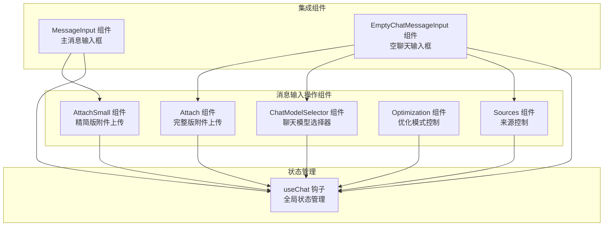
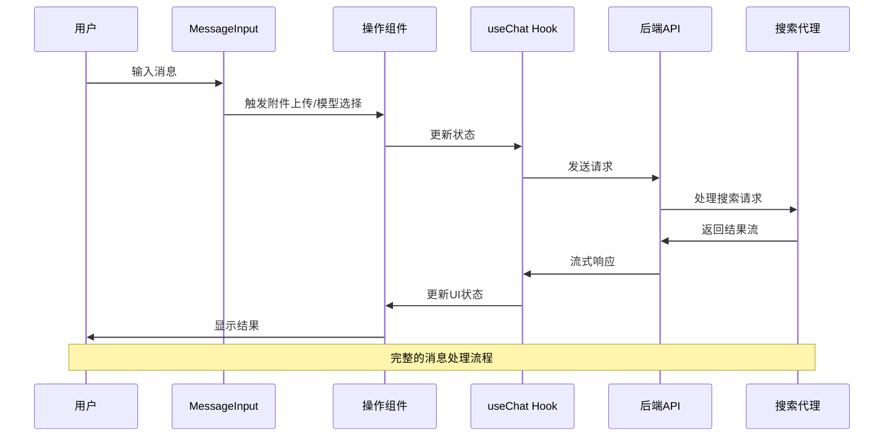
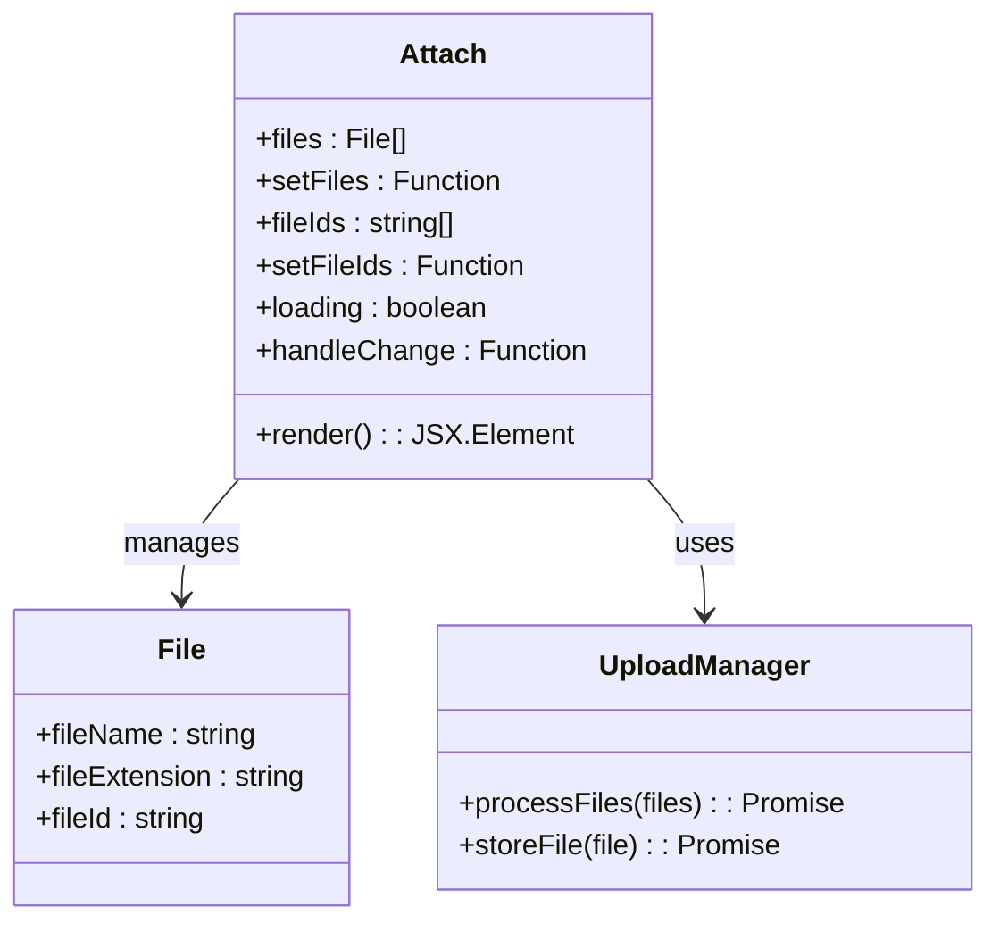
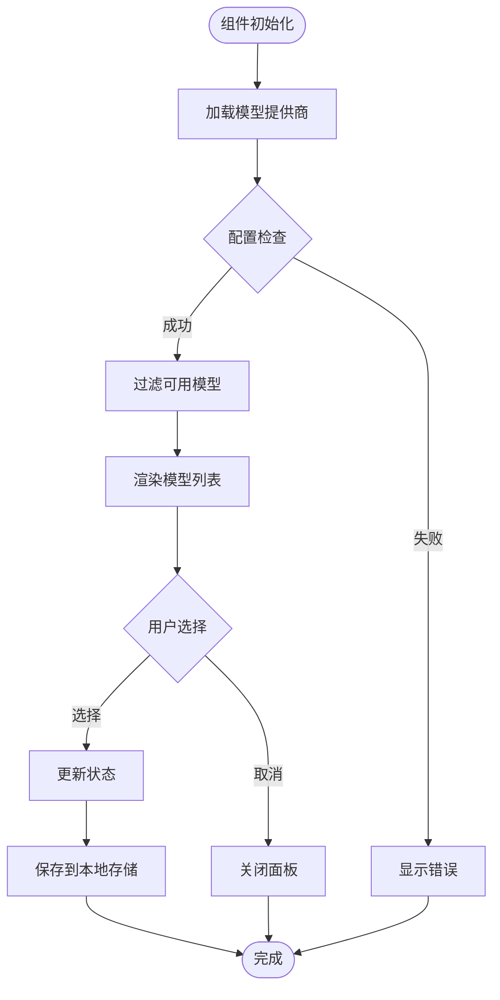
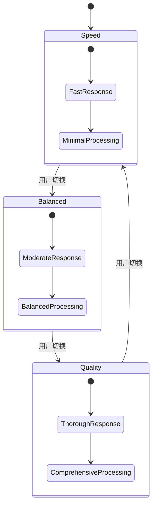
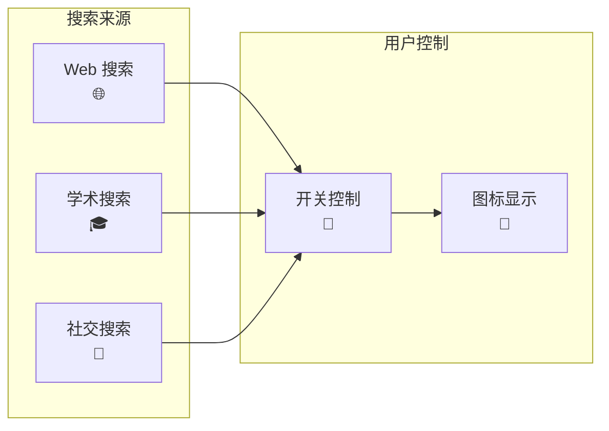
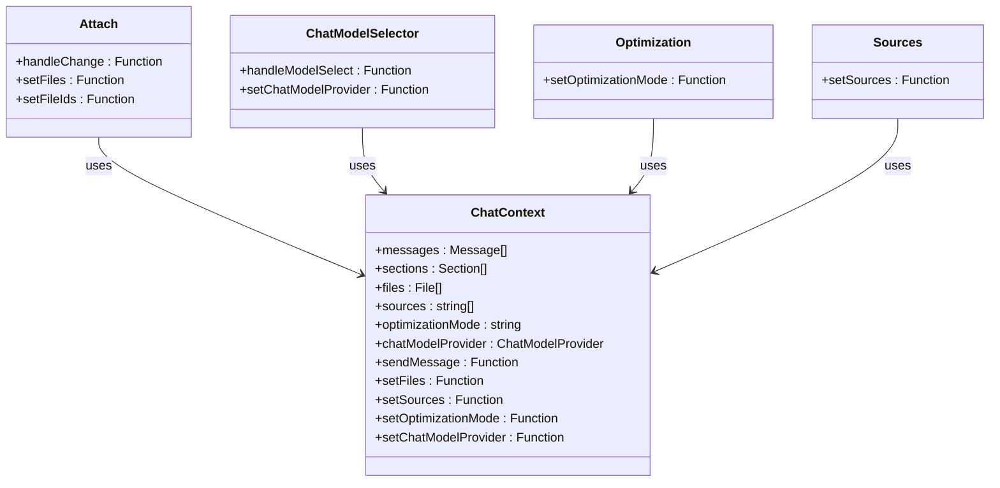
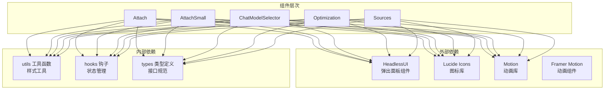

# 消息输入操作组件

<cite>
**本文档引用的文件**
- [Attach.tsx](file://src/components/MessageInputActions/Attach.tsx)
- [AttachSmall.tsx](file://src/components/MessageInputActions/AttachSmall.tsx)
- [ChatModelSelector.tsx](file://src/components/MessageInputActions/ChatModelSelector.tsx)
- [Optimization.tsx](file://src/components/MessageInputActions/Optimization.tsx)
- [Sources.tsx](file://src/components/MessageInputActions/Sources.tsx)
- [MessageInput.tsx](file://src/components/MessageInput.tsx)
- [EmptyChatMessageInput.tsx](file://src/components/EmptyChatMessageInput.tsx)
- [useChat.tsx](file://src/lib/hooks/useChat.tsx)
- [types.ts](file://src/lib/models/types.ts)
- [route.ts](file://src/app/api/providers/route.ts)
- [route.ts](file://src/app/api/uploads/route.ts)
- [route.ts](file://src/app/api/chat/route.ts)
</cite>

## 目录
1. [简介](#简介)
2. [项目结构](#项目结构)
3. [核心组件](#核心组件)
4. [架构概览](#架构概览)
5. [详细组件分析](#详细组件分析)
6. [依赖关系分析](#依赖关系分析)
7. [性能考虑](#性能考虑)
8. [故障排除指南](#故障排除指南)
9. [结论](#结论)

## 简介

消息输入操作组件是 Perplexica 聊天界面的重要组成部分，负责处理用户的输入操作和相关功能。该组件集合提供了完整的消息输入体验，包括附件上传、模型选择、优化模式设置和来源控制等功能。

这些组件通过统一的状态管理机制与聊天系统集成，实现了高度可定制和可扩展的消息输入功能。每个组件都经过精心设计，既保证了用户体验的一致性，又提供了足够的灵活性来满足不同的使用场景。

## 项目结构

消息输入操作组件位于 `src/components/MessageInputActions/` 目录下，包含以下五个核心组件：

**图表来源**
- [Attach.tsx](file://src/components/MessageInputActions/Attach.tsx#L1-L170)
- [AttachSmall.tsx](file://src/components/MessageInputActions/AttachSmall.tsx#L1-L159)
- [ChatModelSelector.tsx](file://src/components/MessageInputActions/ChatModelSelector.tsx#L1-L204)
- [Optimization.tsx](file://src/components/MessageInputActions/Optimization.tsx#L1-L115)
- [Sources.tsx](file://src/components/MessageInputActions/Sources.tsx#L1-L94)

**章节来源**
- [Attach.tsx](file://src/components/MessageInputActions/Attach.tsx#L1-L170)
- [AttachSmall.tsx](file://src/components/MessageInputActions/AttachSmall.tsx#L1-L159)
- [ChatModelSelector.tsx](file://src/components/MessageInputActions/ChatModelSelector.tsx#L1-L204)
- [Optimization.tsx](file://src/components/MessageInputActions/Optimization.tsx#L1-L115)
- [Sources.tsx](file://src/components/MessageInputActions/Sources.tsx#L1-L94)

## 核心组件

消息输入操作组件集合包含五个主要组件，每个组件都有其特定的功能和使用场景：

### 附件上传组件

- **Attach 组件**：完整版附件上传组件，提供丰富的交互功能和文件管理能力
- **AttachSmall 组件**：精简版附件上传组件，适用于空间有限的场景

### 模型选择组件

- **ChatModelSelector 组件**：聊天模型选择器，允许用户选择和切换不同的 AI 模型

### 优化控制组件

- **Optimization 组件**：优化模式控制，提供速度、平衡和质量三种优化模式

### 来源控制组件

- **Sources 组件**：搜索来源控制，允许用户选择不同的搜索来源类型

**章节来源**
- [Attach.tsx](file://src/components/MessageInputActions/Attach.tsx#L22-L170)
- [AttachSmall.tsx](file://src/components/MessageInputActions/AttachSmall.tsx#L13-L159)
- [ChatModelSelector.tsx](file://src/components/MessageInputActions/ChatModelSelector.tsx#L11-L204)
- [Optimization.tsx](file://src/components/MessageInputActions/Optimization.tsx#L39-L115)
- [Sources.tsx](file://src/components/MessageInputActions/Sources.tsx#L33-L94)

## 架构概览

消息输入操作组件采用模块化设计，通过统一的状态管理机制实现组件间的协作：

**图表来源**
- [MessageInput.tsx](file://src/components/MessageInput.tsx#L8-L103)
- [useChat.tsx](file://src/lib/hooks/useChat.tsx#L714-L800)
- [route.ts](file://src/app/api/chat/route.ts#L103-L255)

**章节来源**
- [MessageInput.tsx](file://src/components/MessageInput.tsx#L8-L103)
- [useChat.tsx](file://src/lib/hooks/useChat.tsx#L714-L800)
- [route.ts](file://src/app/api/chat/route.ts#L103-L255)

## 详细组件分析

### 附件上传组件

#### Attach 组件分析

Attach 组件提供了完整的附件上传功能，具有以下特点：

**图表来源**
- [Attach.tsx](file://src/components/MessageInputActions/Attach.tsx#L22-L170)
- [useChat.tsx](file://src/lib/hooks/useChat.tsx#L64-L78)

**实现要点**：
- 支持多文件同时上传
- 自动检测嵌入模型配置
- 提供文件预览和管理功能
- 实时状态更新和错误处理

#### AttachSmall 组件分析

AttachSmall 组件是 Attach 组件的简化版本，专为空间有限的场景设计：

**主要差异**：
- 更简洁的UI设计
- 减少的交互元素
- 适配移动端显示
- 保持核心功能完整性

**章节来源**
- [Attach.tsx](file://src/components/MessageInputActions/Attach.tsx#L22-L170)
- [AttachSmall.tsx](file://src/components/MessageInputActions/AttachSmall.tsx#L13-L159)

### 聊天模型选择器

#### ChatModelSelector 组件分析

模型选择器组件提供了智能的模型选择功能：

**图表来源**
- [ChatModelSelector.tsx](file://src/components/MessageInputActions/ChatModelSelector.tsx#L18-L75)

**核心功能**：
- 动态加载可用的模型提供商
- 智能搜索和过滤模型
- 优先显示当前使用的模型
- 本地存储用户偏好设置

**章节来源**
- [ChatModelSelector.tsx](file://src/components/MessageInputActions/ChatModelSelector.tsx#L11-L204)
- [route.ts](file://src/app/api/providers/route.ts#L5-L34)

### 优化模式控制

#### Optimization 组件分析

优化组件提供了三种不同的优化模式：

| 模式 | 图标 | 描述 | 性能特征 |
|------|------|------|----------|
| Speed | ⚡ | 优先速度，快速响应 | 最快响应时间 |
| Balanced | 🔄 | 速度与准确性平衡 | 中等性能 |
| Quality | ⭐ | 最全面和准确的答案 | 最慢但最精确 |

**图表来源**
- [Optimization.tsx](file://src/components/MessageInputActions/Optimization.tsx#L13-L37)

**章节来源**
- [Optimization.tsx](file://src/components/MessageInputActions/Optimization.tsx#L39-L115)

### 来源控制组件

#### Sources 组件分析

来源控制组件允许用户选择不同的搜索来源：

**支持的来源类型**：
- Web：通用网络搜索
- Academic：学术资源搜索
- Discussions：社交讨论内容

**图表来源**
- [Sources.tsx](file://src/components/MessageInputActions/Sources.tsx#L15-L31)

**章节来源**
- [Sources.tsx](file://src/components/MessageInputActions/Sources.tsx#L33-L94)

### 状态管理集成

所有消息输入操作组件都通过 `useChat` 钩子进行状态管理：

**图表来源**
- [useChat.tsx](file://src/lib/hooks/useChat.tsx#L31-L62)

**章节来源**
- [useChat.tsx](file://src/lib/hooks/useChat.tsx#L31-L62)

## 依赖关系分析

消息输入操作组件之间的依赖关系如下：

**图表来源**
- [Attach.tsx](file://src/components/MessageInputActions/Attach.tsx#L1-L21)
- [AttachSmall.tsx](file://src/components/MessageInputActions/AttachSmall.tsx#L1-L12)
- [ChatModelSelector.tsx](file://src/components/MessageInputActions/ChatModelSelector.tsx#L1-L10)
- [Optimization.tsx](file://src/components/MessageInputActions/Optimization.tsx#L1-L12)
- [Sources.tsx](file://src/components/MessageInputActions/Sources.tsx#L1-L13)

**章节来源**
- [Attach.tsx](file://src/components/MessageInputActions/Attach.tsx#L1-L21)
- [AttachSmall.tsx](file://src/components/MessageInputActions/AttachSmall.tsx#L1-L12)
- [ChatModelSelector.tsx](file://src/components/MessageInputActions/ChatModelSelector.tsx#L1-L10)
- [Optimization.tsx](file://src/components/MessageInputActions/Optimization.tsx#L1-L12)
- [Sources.tsx](file://src/components/MessageInputActions/Sources.tsx#L1-L13)

## 性能考虑

消息输入操作组件在设计时充分考虑了性能优化：

### 渲染优化
- 使用 React.memo 和 useMemo 避免不必要的重渲染
- 条件渲染减少 DOM 元素数量
- 动画组件按需加载，避免阻塞主线程

### 网络优化
- 文件上传使用 FormData 格式，支持断点续传
- 模型列表缓存，减少重复请求
- 流式响应处理，实时更新 UI

### 内存管理
- 及时清理事件监听器
- 合理的组件卸载处理
- 避免内存泄漏

## 故障排除指南

### 常见问题及解决方案

**附件上传失败**
- 检查嵌入模型配置是否正确
- 确认文件格式支持情况
- 验证网络连接稳定性

**模型选择器无响应**
- 确认后端 API 可用性
- 检查浏览器控制台错误
- 验证本地存储权限

**优化模式不生效**
- 检查优化模式参数传递
- 确认后端搜索代理配置
- 验证系统指令设置

**章节来源**
- [route.ts](file://src/app/api/uploads/route.ts#L5-L40)
- [route.ts](file://src/app/api/providers/route.ts#L5-L34)
- [route.ts](file://src/app/api/chat/route.ts#L103-L255)

## 结论

消息输入操作组件集合为 Perplexica 提供了完整而灵活的消息输入解决方案。通过模块化设计和统一的状态管理，这些组件不仅提供了丰富的功能特性，还确保了良好的用户体验和代码可维护性。

各个组件之间的协作关系清晰明确，数据流向合理高效。无论是完整的 Attach 组件还是精简的 AttachSmall 组件，都能满足不同场景下的需求。模型选择器、优化控制和来源管理等功能的集成，使得用户能够根据自己的需求定制搜索体验。

未来的发展方向可以包括：
- 更智能的文件类型识别和处理
- 更丰富的模型配置选项
- 更精细的性能监控和优化
- 更好的无障碍访问支持

这些组件为构建高质量的聊天应用奠定了坚实的基础，是 Perplexica 项目中不可或缺的重要组成部分。