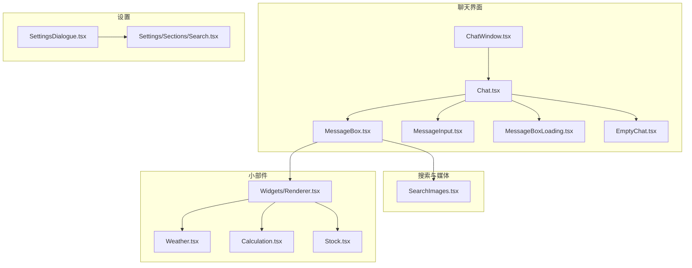
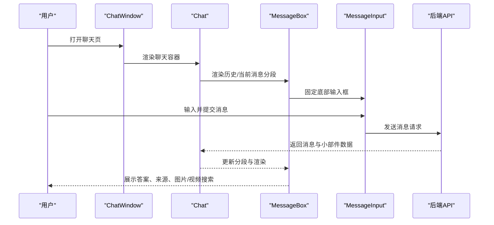
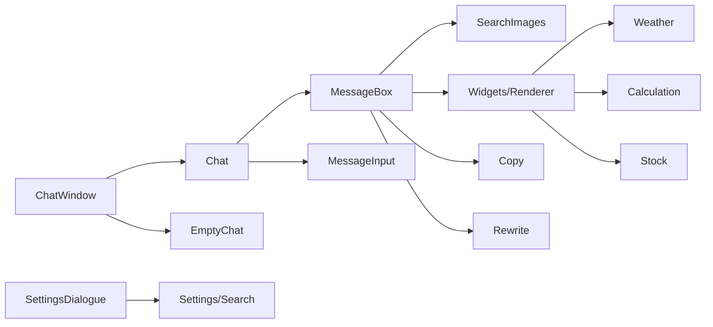

# 用户界面组件

<cite>
**本文引用的文件**
- [src/components/Chat.tsx](file://src/components/Chat.tsx)
- [src/components/ChatWindow.tsx](file://src/components/ChatWindow.tsx)
- [src/components/MessageBox.tsx](file://src/components/MessageBox.tsx)
- [src/components/MessageInput.tsx](file://src/components/MessageInput.tsx)
- [src/components/MessageBoxLoading.tsx](file://src/components/MessageBoxLoading.tsx)
- [src/components/EmptyChat.tsx](file://src/components/EmptyChat.tsx)
- [src/components/SearchImages.tsx](file://src/components/SearchImages.tsx)
- [src/components/Widgets/Renderer.tsx](file://src/components/Widgets/Renderer.tsx)
- [src/components/Widgets/Weather.tsx](file://src/components/Widgets/Weather.tsx)
- [src/components/Widgets/Calculation.tsx](file://src/components/Widgets/Calculation.tsx)
- [src/components/Widgets/Stock.tsx](file://src/components/Widgets/Stock.tsx)
- [src/components/Settings/SettingsDialogue.tsx](file://src/components/Settings/SettingsDialogue.tsx)
- [src/components/Settings/Sections/Search.tsx](file://src/components/Settings/Sections/Search.tsx)
- [src/components/MessageActions/Copy.tsx](file://src/components/MessageActions/Copy.tsx)
- [src/components/MessageActions/Rewrite.tsx](file://src/components/MessageActions/Rewrite.tsx)
</cite>

## 目录
1. [简介](#简介)
2. [项目结构](#项目结构)
3. [核心组件](#核心组件)
4. [架构总览](#架构总览)
5. [组件详解](#组件详解)
6. [依赖关系分析](#依赖关系分析)
7. [性能与可访问性](#性能与可访问性)
8. [故障排查指南](#故障排查指南)
9. [结论](#结论)
10. [附录：使用示例与集成模式](#附录使用示例与集成模式)

## 简介
本文件系统化梳理 Perplexica 的用户界面组件，覆盖聊天界面、设置管理、消息显示、搜索组件与小部件渲染等模块。文档从架构、数据流、状态管理、事件处理、样式定制、响应式与无障碍支持等方面进行深入解析，并提供可操作的使用示例与扩展建议，帮助开发者快速理解与二次开发。

## 项目结构
围绕用户界面的关键目录与文件如下：
- 聊天主容器与窗口：Chat.tsx、ChatWindow.tsx
- 消息显示与输入：MessageBox.tsx、MessageInput.tsx、MessageBoxLoading.tsx、EmptyChat.tsx
- 搜索与媒体：SearchImages.tsx
- 小部件渲染与具体组件：Widgets/Renderer.tsx、Weather.tsx、Calculation.tsx、Stock.tsx
- 设置与配置：Settings/SettingsDialogue.tsx、Settings/Sections/Search.tsx
- 消息动作：MessageActions/Copy.tsx、MessageActions/Rewrite.tsx

图表来源
- [src/components/ChatWindow.tsx](file://src/components/ChatWindow.tsx#L36-L77)
- [src/components/Chat.tsx](file://src/components/Chat.tsx#L9-L109)
- [src/components/MessageBox.tsx](file://src/components/MessageBox.tsx#L42-L291)
- [src/components/MessageInput.tsx](file://src/components/MessageInput.tsx#L8-L103)
- [src/components/MessageBoxLoading.tsx](file://src/components/MessageBoxLoading.tsx#L1-L12)
- [src/components/EmptyChat.tsx](file://src/components/EmptyChat.tsx#L16-L76)
- [src/components/SearchImages.tsx](file://src/components/SearchImages.tsx#L14-L153)
- [src/components/Widgets/Renderer.tsx](file://src/components/Widgets/Renderer.tsx#L7-L77)
- [src/components/Widgets/Weather.tsx](file://src/components/Widgets/Weather.tsx#L223-L423)
- [src/components/Widgets/Calculation.tsx](file://src/components/Widgets/Calculation.tsx#L10-L47)
- [src/components/Widgets/Stock.tsx](file://src/components/Widgets/Stock.tsx#L85-L518)
- [src/components/Settings/SettingsDialogue.tsx](file://src/components/Settings/SettingsDialogue.tsx#L65-L294)
- [src/components/Settings/Sections/Search.tsx](file://src/components/Settings/Sections/Search.tsx#L4-L30)

章节来源
- [src/components/ChatWindow.tsx](file://src/components/ChatWindow.tsx#L36-L77)
- [src/components/Chat.tsx](file://src/components/Chat.tsx#L9-L109)

## 核心组件
- 聊天窗口 ChatWindow：负责整体页面布局、错误与加载态、空对话占位与聊天内容切换。
- 聊天容器 Chat：负责消息分段渲染、输入框固定定位、滚动行为与遮罩层宽度同步。
- 消息块 MessageBox：渲染查询、答案、来源、研究步骤、相关建议、语音朗读、图片/视频搜索等。
- 输入框 MessageInput：多行自适应、快捷键聚焦、发送消息、附件按钮。
- 加载骨架 MessageBoxLoading：消息生成时的占位动画。
- 空对话 EmptyChat：首次进入时的引导与天气/新闻小部件展示。
- 搜索图片 SearchImages：调用后端接口拉取图片并提供缩略图与灯箱预览。
- 小部件渲染器 Widgets/Renderer：按类型分发至 Weather/Calculation/Stock 组件。
- 设置对话框 SettingsDialogue：多节配置页、管理员鉴权、远程配置加载。
- 消息动作 Copy/Rewrite：复制含引用的消息文本、重写当前消息。

章节来源
- [src/components/ChatWindow.tsx](file://src/components/ChatWindow.tsx#L36-L77)
- [src/components/Chat.tsx](file://src/components/Chat.tsx#L9-L109)
- [src/components/MessageBox.tsx](file://src/components/MessageBox.tsx#L42-L291)
- [src/components/MessageInput.tsx](file://src/components/MessageInput.tsx#L8-L103)
- [src/components/MessageBoxLoading.tsx](file://src/components/MessageBoxLoading.tsx#L1-L12)
- [src/components/EmptyChat.tsx](file://src/components/EmptyChat.tsx#L16-L76)
- [src/components/SearchImages.tsx](file://src/components/SearchImages.tsx#L14-L153)
- [src/components/Widgets/Renderer.tsx](file://src/components/Widgets/Renderer.tsx#L7-L77)
- [src/components/Settings/SettingsDialogue.tsx](file://src/components/Settings/SettingsDialogue.tsx#L65-L294)
- [src/components/MessageActions/Copy.tsx](file://src/components/MessageActions/Copy.tsx#L7-L49)
- [src/components/MessageActions/Rewrite.tsx](file://src/components/MessageActions/Rewrite.tsx#L3-L21)

## 架构总览
组件间的数据与控制流如下：

图表来源
- [src/components/ChatWindow.tsx](file://src/components/ChatWindow.tsx#L36-L77)
- [src/components/Chat.tsx](file://src/components/Chat.tsx#L9-L109)
- [src/components/MessageBox.tsx](file://src/components/MessageBox.tsx#L42-L291)
- [src/components/MessageInput.tsx](file://src/components/MessageInput.tsx#L8-L103)
- [src/components/SearchImages.tsx](file://src/components/SearchImages.tsx#L41-L68)

## 组件详解

### 聊天界面组件

#### ChatWindow（聊天窗口）
- 职责
  - 根据加载、错误、未找到状态切换视图。
  - 在有消息时渲染导航栏与聊天容器；无消息时渲染空对话页。
  - 提供移动端设置入口。
- 关键属性与事件
  - 属性：无（内部通过钩子 useChat 获取状态）。
  - 事件：无（通过路由与状态驱动渲染）。
- 状态管理
  - 使用 useChat 返回的 isReady、hasError、notFound、messages 控制视图。
- 样式与布局
  - 基于 Tailwind 类名组织，适配移动端与桌面端。
- 可访问性
  - 使用语义化标签与屏幕阅读器友好的文案。
- 扩展建议
  - 可增加“清空会话”“导出对话”等按钮，复用现有 Action 组件风格。

章节来源
- [src/components/ChatWindow.tsx](file://src/components/ChatWindow.tsx#L36-L77)

#### Chat（聊天容器）
- 职责
  - 渲染消息分段列表，处理滚动到底部、标题更新、遮罩层宽度同步。
- 关键属性与事件
  - 属性：sections、loading、messageAppeared、messages。
  - 事件：无（通过 useEffect 与 ref 驱动 DOM 行为）。
- 状态管理
  - 内部维护 divider 宽度、滚动位置引用、标题动态更新。
- 数据流
  - 从 useChat 获取分段数据，逐个传给 MessageBox 渲染。
- 性能
  - 使用 ResizeObserver 与 window.resize 优化宽度计算，避免频繁重排。
- 可访问性
  - 底部固定输入区域，键盘焦点管理良好。

章节来源
- [src/components/Chat.tsx](file://src/components/Chat.tsx#L9-L109)

#### MessageBox（消息块）
- 职责
  - 渲染查询标题、来源、研究步骤、答案正文、相关建议、图片/视频搜索、语音朗读、复制与重写。
- 关键属性与事件
  - 属性：section、sectionIndex、dividerRef、isLast。
  - 事件：点击“重写”触发 rewrite；点击“复制”触发复制；点击“播放/暂停”触发语音。
- 状态管理
  - 使用 useChat 获取消息状态、研究状态、建议列表等。
- 数据流
  - 解析 parsedTextBlocks、拼接 speechMessage、筛选 source blocks、渲染 widgets。
- Markdown 渲染
  - 自定义 overrides 支持 think 标签与 citation 组件。
- 可访问性
  - 使用语义化标题与列表，按钮具备 hover/focus 状态。
- 扩展建议
  - 可新增“收藏/笔记”“分享链接”等动作按钮。

章节来源
- [src/components/MessageBox.tsx](file://src/components/MessageBox.tsx#L42-L291)

#### MessageInput（消息输入）
- 职责
  - 多行自适应输入、快捷键聚焦、发送消息、附件按钮。
- 关键属性与事件
  - 属性：无（内部通过 useChat 获取 loading 状态）。
  - 事件：表单提交、回车发送、快捷键监听。
- 状态管理
  - 内部维护 message 文本、行数、模式（单行/多行）、是否启用 Copilot。
- 可访问性
  - 输入框具备 placeholder、禁用态提示。
- 扩展建议
  - 可增加“粘贴上传”“撤销/重做”等能力。

章节来源
- [src/components/MessageInput.tsx](file://src/components/MessageInput.tsx#L8-L103)

#### MessageBoxLoading（加载骨架）
- 职责
  - 渲染消息生成时的占位动画。
- 关键属性与事件
  - 属性：无。
  - 事件：无。
- 可访问性
  - 使用动画元素，不引入交互。

章节来源
- [src/components/MessageBoxLoading.tsx](file://src/components/MessageBoxLoading.tsx#L1-L12)

#### EmptyChat（空对话）
- 职责
  - 首次进入时的引导文案与输入框，条件性展示天气/新闻小部件。
- 关键属性与事件
  - 属性：无。
  - 事件：无。
- 状态管理
  - 通过客户端配置开关控制小部件可见性，监听配置变更事件。
- 可访问性
  - 文案简洁明确，按钮具备 hover 状态。

章节来源
- [src/components/EmptyChat.tsx](file://src/components/EmptyChat.tsx#L16-L76)

### 设置管理组件

#### SettingsDialogue（设置对话框）
- 职责
  - 多节配置页（偏好、个性化、模型、搜索），支持管理员模式与鉴权。
- 关键属性与事件
  - 属性：isOpen、setIsOpen。
  - 事件：打开/关闭对话框，切换配置节。
- 状态管理
  - 内部维护 activeSection、config、加载状态、管理员登录弹窗。
- 数据流
  - 通过 /api/config 获取配置，按节渲染对应组件。
- 可访问性
  - 使用 Headless UI Dialog 与 Framer Motion 动画，移动端提供选择器。
- 扩展建议
  - 可增加“导入/导出配置”“重置默认值”等高级功能。

章节来源
- [src/components/Settings/SettingsDialogue.tsx](file://src/components/Settings/SettingsDialogue.tsx#L65-L294)

#### Settings/Sections/Search（搜索配置节）
- 职责
  - 渲染搜索相关配置字段，支持本地存储与服务端值。
- 关键属性与事件
  - 属性：fields、values。
  - 事件：无。
- 状态管理
  - 通过 SettingsField 组件统一渲染与保存。

章节来源
- [src/components/Settings/Sections/Search.tsx](file://src/components/Settings/Sections/Search.tsx#L4-L30)

### 消息显示组件

#### MessageActions/Copy（复制）
- 职责
  - 复制消息正文与引用列表到剪贴板。
- 关键属性与事件
  - 属性：section、initialMessage。
  - 事件：点击触发复制与短暂成功反馈。
- 状态管理
  - 内部维护 copied 状态。

章节来源
- [src/components/MessageActions/Copy.tsx](file://src/components/MessageActions/Copy.tsx#L7-L49)

#### MessageActions/Rewrite（重写）
- 职责
  - 触发重写当前消息。
- 关键属性与事件
  - 属性：rewrite、messageId。
  - 事件：点击触发重写。

章节来源
- [src/components/MessageActions/Rewrite.tsx](file://src/components/MessageActions/Rewrite.tsx#L3-L21)

### 搜索组件

#### SearchImages（图片搜索）
- 职责
  - 调用 /api/images 获取图片，展示网格缩略图与灯箱预览。
- 关键属性与事件
  - 属性：query、chatHistory、messageId。
  - 事件：点击“搜索图片”发起请求；点击缩略图打开灯箱。
- 状态管理
  - 内部维护 images、loading、open、slides。
- 数据流
  - 从 localStorage 读取模型配置，POST 请求携带 query 与 chatHistory。
- 可访问性
  - 图片具备 alt 文案，按钮具备 hover 状态。

章节来源
- [src/components/SearchImages.tsx](file://src/components/SearchImages.tsx#L14-L153)

### 小部件组件

#### Widgets/Renderer（小部件渲染器）
- 职责
  - 根据 widgetType 分发到具体小部件组件。
- 关键属性与事件
  - 属性：widgets（数组）。
  - 事件：无。
- 数据流
  - 依据 params 字段渲染 Weather/Calculation/Stock。

章节来源
- [src/components/Widgets/Renderer.tsx](file://src/components/Widgets/Renderer.tsx#L7-L77)

#### Widgets/Weather（天气）
- 职责
  - 展示实时天气与未来多日预报，支持深浅色主题渐变。
- 关键属性与事件
  - 属性：location、current、daily、timezone。
  - 事件：无。
- 状态管理
  - 监听文档类名变化以切换深浅色主题。
- 数据流
  - 计算温度与风速单位转换，生成图标与渐变背景。

章节来源
- [src/components/Widgets/Weather.tsx](file://src/components/Widgets/Weather.tsx#L223-L423)

#### Widgets/Calculation（计算）
- 职责
  - 展示表达式与结果。
- 关键属性与事件
  - 属性：expression、result。
  - 事件：无。
- 状态管理
  - 无。

章节来源
- [src/components/Widgets/Calculation.tsx](file://src/components/Widgets/Calculation.tsx#L10-L47)

#### Widgets/Stock（股票）
- 职责
  - 展示股票价格、涨跌、成交量、市值等指标，绘制时间序列图表。
- 关键属性与事件
  - 属性：symbol、shortName、longName、exchange、currency、marketState、regularMarketPrice、regularMarketChange、regularMarketChangePercent、chartData、comparisonData、error。
  - 事件：无。
- 状态管理
  - 监听深浅色主题切换；维护选中时间范围；初始化图表并响应窗口尺寸变化。
- 数据流
  - 使用 lightweight-charts 绘制折线图，支持对比多个标的。

章节来源
- [src/components/Widgets/Stock.tsx](file://src/components/Widgets/Stock.tsx#L85-L518)

## 依赖关系分析

图表来源
- [src/components/ChatWindow.tsx](file://src/components/ChatWindow.tsx#L36-L77)
- [src/components/Chat.tsx](file://src/components/Chat.tsx#L9-L109)
- [src/components/MessageBox.tsx](file://src/components/MessageBox.tsx#L42-L291)
- [src/components/MessageInput.tsx](file://src/components/MessageInput.tsx#L8-L103)
- [src/components/SearchImages.tsx](file://src/components/SearchImages.tsx#L14-L153)
- [src/components/Widgets/Renderer.tsx](file://src/components/Widgets/Renderer.tsx#L7-L77)
- [src/components/Widgets/Weather.tsx](file://src/components/Widgets/Weather.tsx#L223-L423)
- [src/components/Widgets/Calculation.tsx](file://src/components/Widgets/Calculation.tsx#L10-L47)
- [src/components/Widgets/Stock.tsx](file://src/components/Widgets/Stock.tsx#L85-L518)
- [src/components/EmptyChat.tsx](file://src/components/EmptyChat.tsx#L16-L76)
- [src/components/Settings/SettingsDialogue.tsx](file://src/components/Settings/SettingsDialogue.tsx#L65-L294)
- [src/components/Settings/Sections/Search.tsx](file://src/components/Settings/Sections/Search.tsx#L4-L30)
- [src/components/MessageActions/Copy.tsx](file://src/components/MessageActions/Copy.tsx#L7-L49)
- [src/components/MessageActions/Rewrite.tsx](file://src/components/MessageActions/Rewrite.tsx#L3-L21)

## 性能与可访问性
- 性能
  - Chat 使用 ResizeObserver 与 window.resize 优化宽度计算，减少不必要的重绘。
  - MessageBox 对图片/视频搜索采用懒加载与轻量级占位，提升首屏体验。
  - Widgets/Stock 使用 lightweight-charts 并在窗口尺寸变化时重绘，避免内存泄漏。
- 可访问性
  - 使用语义化标题与列表，按钮具备 hover/focus 状态。
  - 对话窗口与设置对话框使用 Headless UI Dialog，提供键盘导航与焦点管理。
  - 文本与图标具备对比度，支持深浅色主题切换。

[本节为通用指导，无需列出章节来源]

## 故障排查指南
- 聊天窗口无法加载
  - 检查 useChat 返回的 hasError/notFound/isReady 状态，确认网络与后端可用性。
  - 若返回错误，检查 /api/chat 或 /api/chats 接口响应。
- 消息输入无响应
  - 确认 loading 状态未被阻塞；检查键盘事件绑定与 ref 是否正确。
- 图片搜索失败
  - 检查 /api/images 接口返回格式与 localStorage 中模型配置项是否存在。
- 小部件渲染异常
  - Weather/Stock/Calculation 组件需传入完整参数；若缺参则显示占位或错误信息。
- 设置对话框不可见或无法切换节
  - 检查 isOpen 状态与节的可见性过滤逻辑；管理员权限不足时部分节会被隐藏。

章节来源
- [src/components/ChatWindow.tsx](file://src/components/ChatWindow.tsx#L36-L77)
- [src/components/MessageInput.tsx](file://src/components/MessageInput.tsx#L8-L103)
- [src/components/SearchImages.tsx](file://src/components/SearchImages.tsx#L41-L68)
- [src/components/Widgets/Weather.tsx](file://src/components/Widgets/Weather.tsx#L223-L423)
- [src/components/Widgets/Stock.tsx](file://src/components/Widgets/Stock.tsx#L85-L518)
- [src/components/Settings/SettingsDialogue.tsx](file://src/components/Settings/SettingsDialogue.tsx#L65-L294)

## 结论
Perplexica 的用户界面组件以清晰的分层与职责划分构建，聊天主流程稳定，消息渲染与输入交互完善，小部件生态丰富且可扩展。通过 SettingsDialogue 实现了灵活的配置管理与管理员模式。建议在后续迭代中进一步增强无障碍支持与国际化能力，并持续优化图表与媒体资源的加载策略。

[本节为总结性内容，无需列出章节来源]

## 附录：使用示例与集成模式

- 在页面中集成聊天窗口
  - 在路由页面中直接渲染 ChatWindow，它会根据状态自动切换到聊天或空对话视图。
  - 示例路径参考：[src/app/c/[chatId]/page.tsx](file://src/app/c/[chatId]/page.tsx)
- 在消息块中插入小部件
  - 将包含 widgetType 与 params 的对象数组传入 Widgets/Renderer，即可按类型渲染天气、计算或股票组件。
  - 示例路径参考：[src/components/Widgets/Renderer.tsx](file://src/components/Widgets/Renderer.tsx#L7-L77)
- 添加新的小部件
  - 新建组件并在 Renderer 中注册类型分支，保持与 Section.widgets 的数据契约一致。
  - 示例路径参考：[src/components/Widgets/Weather.tsx](file://src/components/Widgets/Weather.tsx#L223-L423)
- 配置搜索与偏好
  - 通过 SettingsDialogue 的各节组件渲染配置字段，支持本地存储与服务端值。
  - 示例路径参考：[src/components/Settings/SettingsDialogue.tsx](file://src/components/Settings/SettingsDialogue.tsx#L65-L294)
- 优化输入体验
  - 使用 MessageInput 的多行自适应与快捷键聚焦，结合附件按钮扩展能力。
  - 示例路径参考：[src/components/MessageInput.tsx](file://src/components/MessageInput.tsx#L8-L103)

[本节为实践性内容，无需列出章节来源]