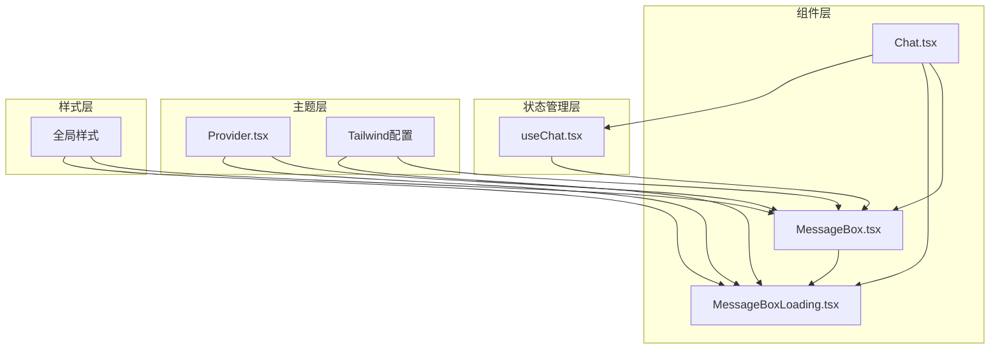
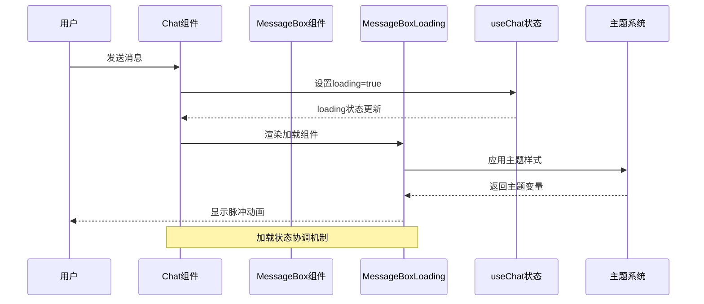
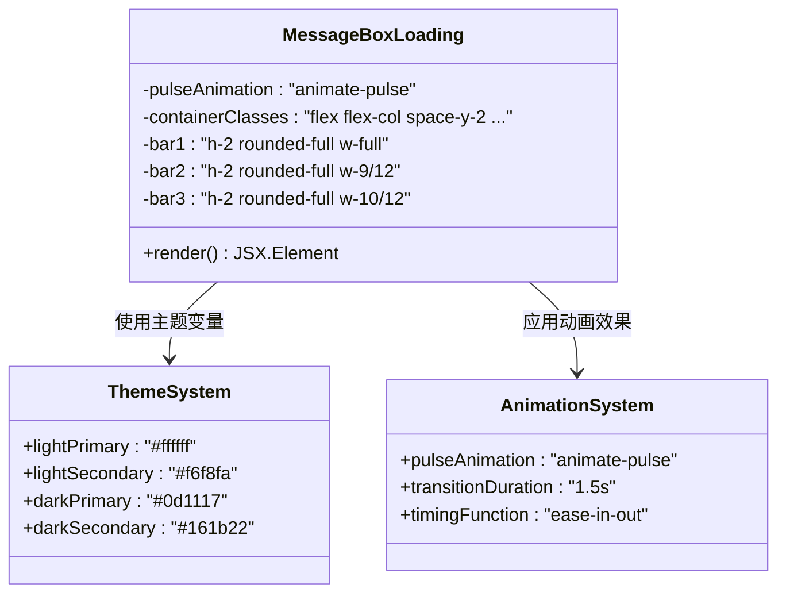
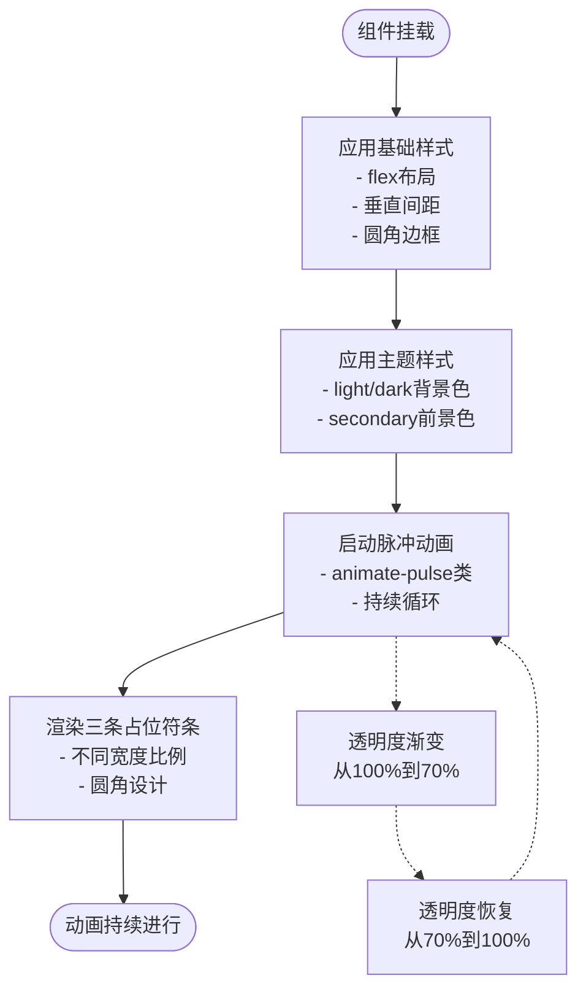
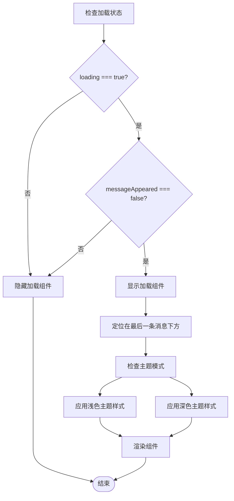
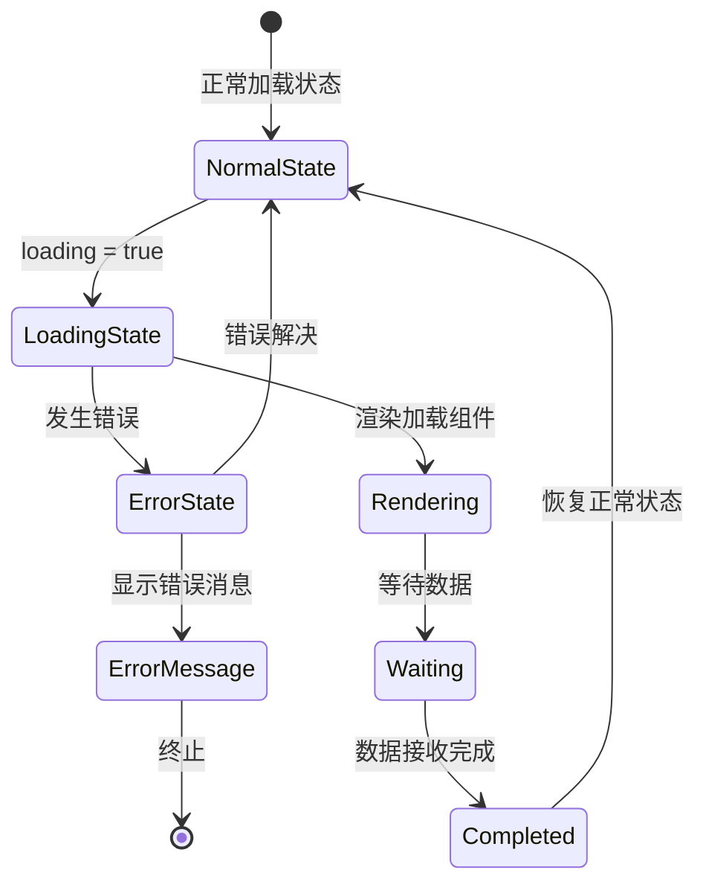
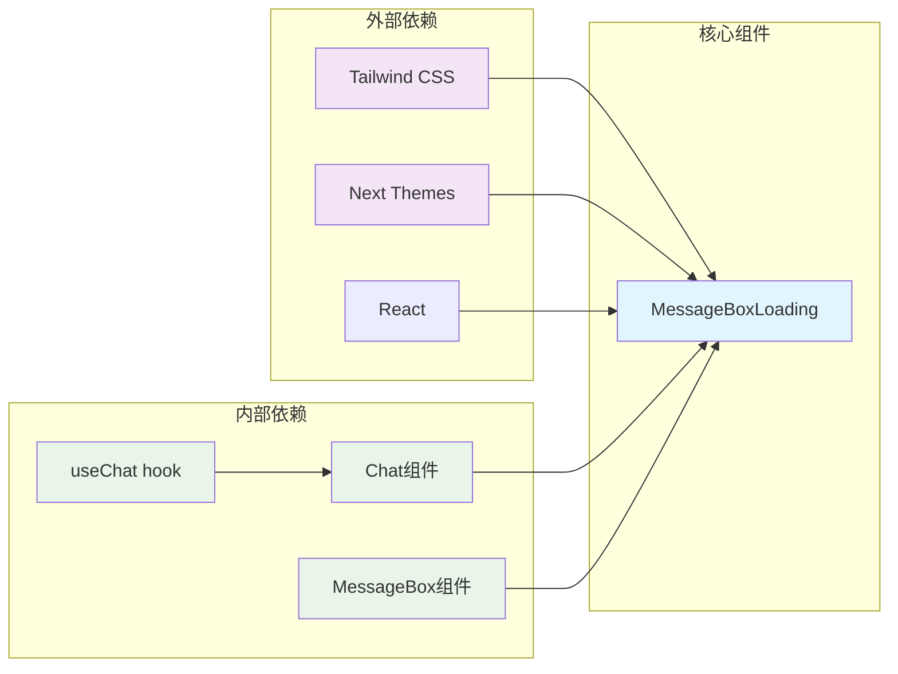

# 消息加载组件

<cite>
**本文档引用的文件**
- [MessageBoxLoading.tsx](file://src/components/MessageBoxLoading.tsx)
- [MessageBox.tsx](file://src/components/MessageBox.tsx)
- [Chat.tsx](file://src/components/Chat.tsx)
- [useChat.tsx](file://src/lib/hooks/useChat.tsx)
- [Provider.tsx](file://src/components/theme/Provider.tsx)
- [tailwind.config.ts](file://tailwind.config.ts)
- [globals.css](file://src/app/globals.css)
</cite>

## 目录
1. [简介](#简介)
2. [项目结构](#项目结构)
3. [核心组件](#核心组件)
4. [架构概览](#架构概览)
5. [详细组件分析](#详细组件分析)
6. [依赖关系分析](#依赖关系分析)
7. [性能考虑](#性能考虑)
8. [故障排除指南](#故障排除指南)
9. [结论](#结论)

## 简介

MessageBoxLoading 是 Perplexica 应用中的一个专门用于显示消息加载状态的组件。该组件采用简洁而高效的视觉设计，通过脉冲动画效果向用户传达内容正在生成或加载中的状态信息。组件的设计遵循现代 Web 应用的用户体验最佳实践，确保在不同设备和主题模式下都能提供一致且友好的加载体验。

该组件的核心功能是为用户提供清晰的加载状态指示，特别是在 AI 聊天对话中，当系统正在处理用户请求时，通过占位符布局和动画效果让用户感知到系统的活跃状态。组件采用轻量级实现，避免对应用性能造成负担，同时保持良好的可访问性和可维护性。

## 项目结构

MessageBoxLoading 组件在项目中的组织结构如下：

**图表来源**
- [MessageBoxLoading.tsx](file://src/components/MessageBoxLoading.tsx#L1-L12)
- [MessageBox.tsx](file://src/components/MessageBox.tsx#L1-L291)
- [Chat.tsx](file://src/components/Chat.tsx#L1-L109)

**章节来源**
- [MessageBoxLoading.tsx](file://src/components/MessageBoxLoading.tsx#L1-L12)
- [Chat.tsx](file://src/components/Chat.tsx#L1-L109)

## 核心组件

MessageBoxLoading 组件是一个高度精简的 React 函数组件，专注于提供视觉化的加载状态指示。组件采用函数式编程范式，不依赖外部状态管理，通过简单的 JSX 结构实现复杂的视觉效果。

### 组件特性

- **轻量级实现**：仅包含 12 行代码，最小化内存占用和渲染开销
- **响应式设计**：支持不同屏幕尺寸的自适应布局
- **主题适配**：自动适配明暗主题模式
- **动画效果**：使用 Tailwind CSS 的内置动画类实现流畅的视觉过渡

### 视觉设计元素

组件通过三个不同长度的矩形条模拟文本行的加载状态：
- 完整宽度的主条目，代表主要文本行
- 9/12 宽度的中等条目，代表次要文本行  
- 10/12 宽度的短条目，代表标题或其他重要文本

每个条目都采用圆角设计，营造现代感的视觉效果。

**章节来源**
- [MessageBoxLoading.tsx](file://src/components/MessageBoxLoading.tsx#L1-L12)

## 架构概览

MessageBoxLoading 在整个应用架构中的位置和交互关系如下：

**图表来源**
- [Chat.tsx](file://src/components/Chat.tsx#L80-L81)
- [useChat.tsx](file://src/lib/hooks/useChat.tsx#L714-L806)
- [MessageBox.tsx](file://src/components/MessageBox.tsx#L146-L158)

### 状态管理集成

MessageBoxLoading 与应用的状态管理系统紧密集成，通过 useChat hook 获取加载状态信息。组件的显示条件基于多个状态变量的组合判断，确保只在适当的时机显示加载指示器。

**章节来源**
- [Chat.tsx](file://src/components/Chat.tsx#L80-L81)
- [useChat.tsx](file://src/lib/hooks/useChat.tsx#L279-L280)

## 详细组件分析

### 组件结构分析

MessageBoxLoading 采用简洁的层级结构，通过 Flexbox 布局实现垂直排列的占位符元素：

**图表来源**
- [MessageBoxLoading.tsx](file://src/components/MessageBoxLoading.tsx#L3-L7)
- [tailwind.config.ts](file://tailwind.config.ts#L33-L48)

### 动画机制详解

组件的动画效果通过 Tailwind CSS 的 `animate-pulse` 类实现，这是一个内置的 CSS 动画，提供了平滑的透明度变化效果：

**图表来源**
- [MessageBoxLoading.tsx](file://src/components/MessageBoxLoading.tsx#L3-L7)

### 状态协调机制

MessageBoxLoading 的显示和隐藏完全由应用的状态管理控制，通过以下条件进行协调：

**图表来源**
- [Chat.tsx](file://src/components/Chat.tsx#L80-L81)
- [useChat.tsx](file://src/lib/hooks/useChat.tsx#L279-L280)

**章节来源**
- [MessageBoxLoading.tsx](file://src/components/MessageBoxLoading.tsx#L1-L12)
- [Chat.tsx](file://src/components/Chat.tsx#L80-L81)
- [useChat.tsx](file://src/lib/hooks/useChat.tsx#L279-L280)

### 错误处理策略

虽然 MessageBoxLoading 本身不直接处理错误状态，但其在整个错误处理流程中扮演重要角色：

**图表来源**
- [useChat.tsx](file://src/lib/hooks/useChat.tsx#L554-L565)
- [Chat.tsx](file://src/components/Chat.tsx#L80-L81)

## 依赖关系分析

MessageBoxLoading 组件的依赖关系相对简单，主要依赖于外部样式系统和主题配置：

**图表来源**
- [MessageBoxLoading.tsx](file://src/components/MessageBoxLoading.tsx#L1-L12)
- [Provider.tsx](file://src/components/theme/Provider.tsx#L1-L17)
- [tailwind.config.ts](file://tailwind.config.ts#L1-L58)

### 样式系统集成

组件与 Tailwind CSS 和主题系统的集成体现在以下几个方面：

1. **颜色系统**：使用 `bg-light-primary/dark-primary` 和 `bg-light-secondary/dark-secondary` 类名
2. **动画系统**：使用 `animate-pulse` 内置动画类
3. **响应式系统**：使用 `w-full/lg:w-9/12` 实现响应式宽度
4. **主题系统**：通过 `dark:` 前缀自动适配深色主题

**章节来源**
- [MessageBoxLoading.tsx](file://src/components/MessageBoxLoading.tsx#L3-L7)
- [tailwind.config.ts](file://tailwind.config.ts#L33-L48)
- [Provider.tsx](file://src/components/theme/Provider.tsx#L10-L13)

## 性能考虑

MessageBoxLoading 组件在设计时充分考虑了性能优化，采用了多项策略来确保最佳的用户体验：

### 渲染性能优化

- **最小化 DOM 结构**：仅包含必要的 div 元素，减少渲染复杂度
- **静态样式类**：使用纯 CSS 类名而非内联样式，提高渲染效率
- **无状态组件**：不维护内部状态，避免不必要的重渲染

### 动画性能优化

- **GPU 加速**：利用 `transform` 属性进行动画，触发硬件加速
- **简洁动画**：脉冲动画只涉及透明度变化，计算开销最小
- **浏览器优化**：使用浏览器原生动画，避免 JavaScript 动画的性能问题

### 内存使用优化

- **零外部依赖**：不引入额外的第三方库
- **轻量级实现**：代码体积小，内存占用低
- **无事件监听**：不绑定任何 DOM 事件处理器

### 用户体验优化

- **即时反馈**：加载状态切换迅速，提供即时的用户反馈
- **视觉一致性**：与整体应用设计风格保持一致
- **无障碍支持**：支持屏幕阅读器和键盘导航

## 故障排除指南

### 常见问题及解决方案

#### 1. 动画不显示
**症状**：组件正确渲染但没有动画效果
**可能原因**：
- Tailwind CSS 未正确配置
- `animate-pulse` 类被覆盖
- 浏览器不支持 CSS 动画

**解决方案**：
- 检查 Tailwind 配置文件中的动画插件
- 确认没有自定义 CSS 覆盖动画类
- 测试在不同浏览器中的兼容性

#### 2. 主题样式异常
**症状**：组件颜色与预期不符
**可能原因**：
- 主题系统配置错误
- CSS 优先级问题
- 缺少主题前缀

**解决方案**：
- 验证 `next-themes` 配置
- 检查 CSS 优先级链
- 确保使用正确的主题类名

#### 3. 响应式布局问题
**症状**：在移动设备上显示异常
**可能原因**：
- 断点配置不当
- 容器宽度限制
- 移动端字体缩放

**解决方案**：
- 检查 Tailwind 断点配置
- 验证容器的宽度属性
- 测试不同屏幕尺寸

**章节来源**
- [MessageBoxLoading.tsx](file://src/components/MessageBoxLoading.tsx#L3-L7)
- [tailwind.config.ts](file://tailwind.config.ts#L24-L25)
- [Provider.tsx](file://src/components/theme/Provider.tsx#L10-L13)

## 结论

MessageBoxLoading 组件虽然实现简洁，但在整个应用架构中发挥着重要作用。通过精心设计的视觉效果和高效的实现方式，该组件成功地解决了加载状态指示这一关键用户体验问题。

组件的主要优势包括：
- **设计简洁**：专注于核心功能，避免过度设计
- **性能优秀**：最小化资源消耗，提供流畅的用户体验
- **易于维护**：代码简洁，便于理解和修改
- **主题友好**：完美适配应用的整体设计语言

未来可以考虑的改进方向：
- 添加更多的动画变体以增强视觉多样性
- 支持自定义动画参数以满足不同的设计需求
- 增加可访问性功能以改善辅助技术的支持

该组件为类似场景下的加载状态指示提供了一个优秀的参考实现，展示了如何在保持简洁的同时实现高质量的用户体验。