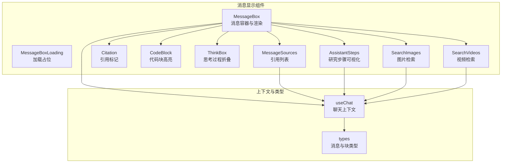
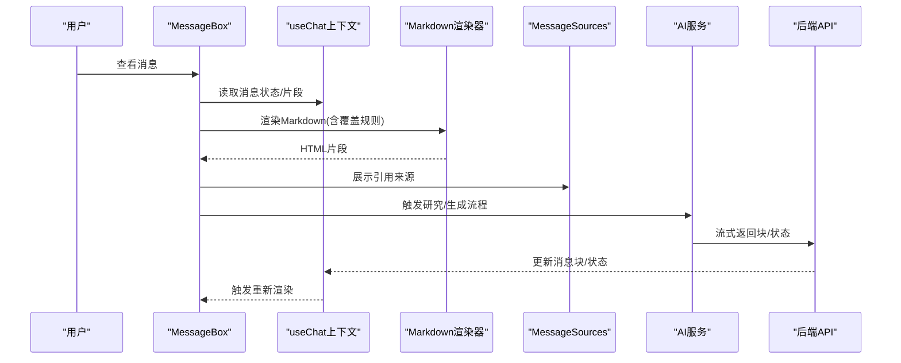
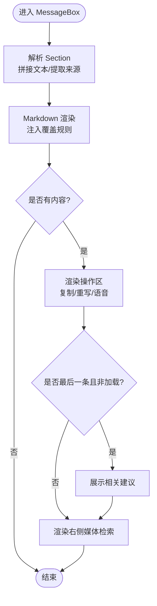
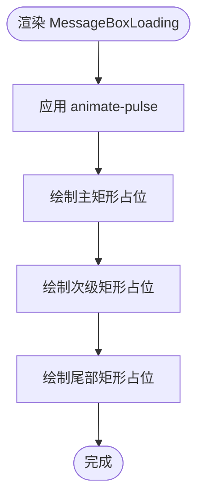
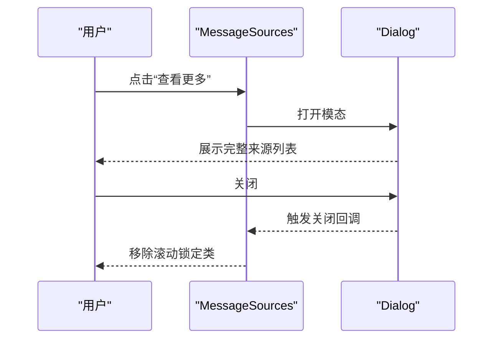
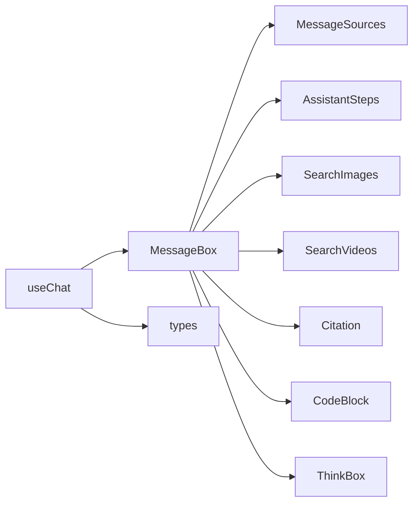

# 消息显示组件

<cite>
**本文档引用的文件**
- [src/components/MessageBox.tsx](file://src/components/MessageBox.tsx)
- [src/components/MessageBoxLoading.tsx](file://src/components/MessageBoxLoading.tsx)
- [src/components/MessageSources.tsx](file://src/components/MessageSources.tsx)
- [src/components/MessageActions/Copy.tsx](file://src/components/MessageActions/Copy.tsx)
- [src/components/MessageActions/Rewrite.tsx](file://src/components/MessageActions/Rewrite.tsx)
- [src/components/MessageRenderer/Citation.tsx](file://src/components/MessageRenderer/Citation.tsx)
- [src/components/MessageRenderer/CodeBlock/index.tsx](file://src/components/MessageRenderer/CodeBlock/index.tsx)
- [src/components/ThinkBox.tsx](file://src/components/ThinkBox.tsx)
- [src/components/AssistantSteps.tsx](file://src/components/AssistantSteps.tsx)
- [src/components/SearchImages.tsx](file://src/components/SearchImages.tsx)
- [src/components/SearchVideos.tsx](file://src/components/SearchVideos.tsx)
- [src/lib/hooks/useChat.tsx](file://src/lib/hooks/useChat.tsx)
- [src/lib/types.ts](file://src/lib/types.ts)
- [src/app/globals.css](file://src/app/globals.css)
</cite>

## 目录
1. [简介](#简介)
2. [项目结构](#项目结构)
3. [核心组件](#核心组件)
4. [架构总览](#架构总览)
5. [组件详细分析](#组件详细分析)
6. [依赖关系分析](#依赖关系分析)
7. [性能考虑](#性能考虑)
8. [故障排查指南](#故障排查指南)
9. [结论](#结论)

## 简介
本文件聚焦于消息显示相关组件，系统性阐述以下能力与实现细节：
- MessageBox 组件的消息渲染机制：内容展示、状态管理、操作按钮、引用显示与研究进度展示。
- MessageBoxLoading 组件的加载占位与动画效果。
- MessageSources 组件的引用链接管理与来源展示逻辑。
- 组件属性接口、事件处理机制与样式定制选项。
- 渲染性能优化策略与用户体验改进措施。

## 项目结构
消息显示相关组件位于 src/components 下，围绕聊天消息的展示与交互展开，配合 src/lib/hooks/useChat.tsx 提供的状态上下文与 src/lib/types.ts 的数据模型，形成完整的消息渲染管线。

图表来源
- [src/components/MessageBox.tsx](file://src/components/MessageBox.tsx#L42-L291)
- [src/components/MessageBoxLoading.tsx](file://src/components/MessageBoxLoading.tsx#L1-L12)
- [src/components/MessageSources.tsx](file://src/components/MessageSources.tsx#L13-L166)
- [src/components/MessageRenderer/Citation.tsx](file://src/components/MessageRenderer/Citation.tsx#L1-L20)
- [src/components/MessageRenderer/CodeBlock/index.tsx](file://src/components/MessageRenderer/CodeBlock/index.tsx#L10-L65)
- [src/components/ThinkBox.tsx](file://src/components/ThinkBox.tsx#L11-L52)
- [src/components/AssistantSteps.tsx](file://src/components/AssistantSteps.tsx#L54-L267)
- [src/components/SearchImages.tsx](file://src/components/SearchImages.tsx#L14-L153)
- [src/components/SearchVideos.tsx](file://src/components/SearchVideos.tsx#L27-L224)
- [src/lib/hooks/useChat.tsx](file://src/lib/hooks/useChat.tsx#L22-L62)
- [src/lib/types.ts](file://src/lib/types.ts#L28-L124)

章节来源
- [src/components/MessageBox.tsx](file://src/components/MessageBox.tsx#L1-L291)
- [src/lib/hooks/useChat.tsx](file://src/lib/hooks/useChat.tsx#L1-L848)
- [src/lib/types.ts](file://src/lib/types.ts#L1-L124)

## 核心组件
- MessageBox：负责单条消息的完整渲染，包括查询标题、来源区块、研究步骤、答案正文、操作按钮（复制、重写、语音）、相关建议以及右侧的图片/视频检索区域。
- MessageBoxLoading：提供骨架屏式加载占位，使用动画脉冲增强等待体验。
- MessageSources：展示引用来源卡片，支持弹窗查看全部来源，并对上传文件进行特殊标识。
- 辅助组件：Citation 引用标记、CodeBlock 代码高亮、ThinkBox 思考过程折叠、AssistantSteps 研究步骤可视化、SearchImages/SearchVideos 媒体检索。

章节来源
- [src/components/MessageBox.tsx](file://src/components/MessageBox.tsx#L42-L291)
- [src/components/MessageBoxLoading.tsx](file://src/components/MessageBoxLoading.tsx#L1-L12)
- [src/components/MessageSources.tsx](file://src/components/MessageSources.tsx#L13-L166)
- [src/components/MessageActions/Copy.tsx](file://src/components/MessageActions/Copy.tsx#L7-L49)
- [src/components/MessageActions/Rewrite.tsx](file://src/components/MessageActions/Rewrite.tsx#L3-L21)
- [src/components/MessageRenderer/Citation.tsx](file://src/components/MessageRenderer/Citation.tsx#L1-L20)
- [src/components/MessageRenderer/CodeBlock/index.tsx](file://src/components/MessageRenderer/CodeBlock/index.tsx#L10-L65)
- [src/components/ThinkBox.tsx](file://src/components/ThinkBox.tsx#L11-L52)
- [src/components/AssistantSteps.tsx](file://src/components/AssistantSteps.tsx#L54-L267)
- [src/components/SearchImages.tsx](file://src/components/SearchImages.tsx#L14-L153)
- [src/components/SearchVideos.tsx](file://src/components/SearchVideos.tsx#L27-L224)

## 架构总览
消息渲染从 useChat 上下文中读取 Section 列表，MessageBox 将 Section 解析为最终 DOM 结构；Markdown 渲染器通过自定义规则处理内联代码、代码块、思考标签与引用标记；右侧区域联动图片/视频检索服务，实现“所见即所得”的多媒体辅助。

图表来源
- [src/components/MessageBox.tsx](file://src/components/MessageBox.tsx#L77-L104)
- [src/lib/hooks/useChat.tsx](file://src/lib/hooks/useChat.tsx#L550-L712)

## 组件详细分析

### MessageBox 组件
- 职责与结构
  - 渲染查询标题、来源区块、研究步骤、答案正文、操作区（复制、重写、语音）、相关建议、右侧图片/视频检索。
  - 使用 Markdown 渲染器并注入自定义覆盖规则，支持内联代码、代码块、思考标签与引用标记。
  - 通过 useChat 获取全局状态，控制加载态、研究结束态与最后一条消息的交互行为。
- 关键逻辑
  - 来源提取：从 responseBlocks 中筛选 type 为 source 的块，合并为 Chunk[] 并传递给 MessageSources。
  - 内容拼接：将多个文本块按换行合并，作为 Markdown 输入。
  - 语音：基于 react-text-to-speech 控制播放/停止。
  - 相关建议：在最后一条非加载消息且存在建议时展示。
  - 右侧媒体：根据是否已有内容决定是否渲染图片/视频检索入口。
- 事件与交互
  - 复制：调用 Copy 动作，支持复制带引用的完整文本。
  - 重写：调用 useChat.rewrite，回滚到指定消息并重新发送。
  - 语音：切换 useSpeech 的 start/stop。
  - 建议点击：直接触发 sendMessage。
- 样式与主题
  - 使用 cn 合并类名，适配明暗主题；Prose 兼容暗色模式；代码块高亮由 CodeBlock 实现。
- 性能与体验
  - 避免在加载中渲染建议区，减少不必要的重排。
  - 对研究步骤使用展开/收起，仅在需要时渲染复杂内容。
  - 语音按钮在加载中保持可用但不闪烁，避免视觉干扰。

图表来源
- [src/components/MessageBox.tsx](file://src/components/MessageBox.tsx#L62-L291)

章节来源
- [src/components/MessageBox.tsx](file://src/components/MessageBox.tsx#L42-L291)
- [src/lib/hooks/useChat.tsx](file://src/lib/hooks/useChat.tsx#L22-L62)

### MessageBoxLoading 组件
- 职责与实现
  - 提供骨架屏占位，使用 animate-pulse 实现脉冲动画，提升加载感知。
  - 采用网格布局与多段不同宽度的矩形模拟真实内容高度。
- 样式定制
  - 支持明暗主题背景色与边框色，确保在深色背景下仍具可读性。
- 适用场景
  - 在消息流尚未就绪或新消息生成前显示，避免白屏与闪烁。

图表来源
- [src/components/MessageBoxLoading.tsx](file://src/components/MessageBoxLoading.tsx#L1-L12)

章节来源
- [src/components/MessageBoxLoading.tsx](file://src/components/MessageBoxLoading.tsx#L1-L12)
- [src/app/globals.css](file://src/app/globals.css#L1-L100)

### MessageSources 组件
- 职责与实现
  - 展示前三个来源的卡片，超出部分以“查看更多”按钮呈现。
  - 点击“查看更多”打开模态对话框，完整列出所有来源。
  - 对上传文件使用文件图标标识，普通链接使用站点 favicon。
  - 为每个来源标注序号，便于引用定位。
- 交互细节
  - 打开/关闭模态时动态添加/移除滚动锁定类，避免背景滚动。
  - 支持在新窗口打开来源链接。
- 数据模型
  - 接收 Chunk[] 类型的 sources，其中 Chunk.metadata 包含 url、title 等字段。

图表来源
- [src/components/MessageSources.tsx](file://src/components/MessageSources.tsx#L13-L166)

章节来源
- [src/components/MessageSources.tsx](file://src/components/MessageSources.tsx#L13-L166)
- [src/lib/types.ts](file://src/lib/types.ts#L34-L49)

### 辅助组件与渲染扩展
- Citation 引用标记
  - 将 Markdown 中的引用标记转换为可点击的外部链接，用于跳转至来源。
- CodeBlock 代码块
  - 支持语言高亮与一键复制，根据主题切换浅/深色语法高亮方案。
- ThinkBox 思考过程
  - 折叠/展开“思考过程”，在思考结束时自动收起。
- AssistantSteps 研究步骤
  - 可展开的研究步骤面板，展示推理、搜索、结果、阅读等阶段，支持流式更新与动画过渡。
- SearchImages/SearchVideos 媒体检索
  - 按需触发图片/视频检索，支持缩略图预览与 Lightbox 全屏浏览；视频支持暂停与播放控制。

章节来源
- [src/components/MessageRenderer/Citation.tsx](file://src/components/MessageRenderer/Citation.tsx#L1-L20)
- [src/components/MessageRenderer/CodeBlock/index.tsx](file://src/components/MessageRenderer/CodeBlock/index.tsx#L10-L65)
- [src/components/ThinkBox.tsx](file://src/components/ThinkBox.tsx#L11-L52)
- [src/components/AssistantSteps.tsx](file://src/components/AssistantSteps.tsx#L54-L267)
- [src/components/SearchImages.tsx](file://src/components/SearchImages.tsx#L14-L153)
- [src/components/SearchVideos.tsx](file://src/components/SearchVideos.tsx#L27-L224)

## 依赖关系分析
- 组件耦合
  - MessageBox 依赖 useChat 上下文提供的状态与方法，同时组合 MessageSources、AssistantSteps、SearchImages、SearchVideos 等子组件。
  - MessageSources 与 useChat 无直接耦合，仅消费传入的 sources 数组。
  - Markdown 渲染器通过覆盖规则与自定义组件（Citation、CodeBlock、ThinkBox）协作。
- 数据流
  - useChat 通过 getMessageHandler 接收后端流式数据，更新消息块与状态，驱动 MessageBox 重新渲染。
  - 研究步骤与来源变化会触发 setMessageAppeared，影响后续建议生成与界面展示时机。

图表来源
- [src/lib/hooks/useChat.tsx](file://src/lib/hooks/useChat.tsx#L22-L62)
- [src/components/MessageBox.tsx](file://src/components/MessageBox.tsx#L42-L291)
- [src/lib/types.ts](file://src/lib/types.ts#L28-L124)

章节来源
- [src/lib/hooks/useChat.tsx](file://src/lib/hooks/useChat.tsx#L550-L712)
- [src/components/MessageBox.tsx](file://src/components/MessageBox.tsx#L42-L291)

## 性能考虑
- 渲染优化
  - 条件渲染：仅在有内容时渲染正文与操作区，避免空节点造成的重排。
  - 惰性渲染：研究步骤与右侧媒体在需要时才渲染，减少初始负载。
  - 动画节流：语音按钮与加载指示器使用简单动画，避免复杂计算。
- 数据处理
  - 文本块拼接与引用替换在 useChat 的 sections 计算中完成，避免在 MessageBox 中重复处理。
  - 来源列表截断与模态全量展示分离，降低首屏压力。
- 用户体验
  - 加载占位与骨架屏提升感知速度；脉冲动画与渐变过渡增强流畅感。
  - 建议区延迟出现，避免与研究过程冲突。

[本节为通用指导，无需特定文件引用]

## 故障排查指南
- 引用无法点击或链接错误
  - 检查 Markdown 覆盖规则是否正确将引用标记转换为带 href 的链接。
  - 确认 Citation 组件已注册为覆盖组件。
- 来源列表为空或不完整
  - 确认 useChat 已正确提取 source 类型块并合并为 Chunk[]。
  - 检查 MessageSources 接收的 sources 是否为空。
- 研究步骤不展开或不更新
  - 确认 AssistantSteps 的 status 与 researchEnded 状态同步。
  - 检查后端流式数据是否包含 subSteps。
- 语音播放异常
  - 确认 useSpeech 初始化参数与状态切换逻辑。
  - 检查浏览器权限与音频设备。
- 图片/视频检索失败
  - 检查对应 API 返回格式与本地缓存状态。
  - 确认 Lightbox 依赖已正确引入。

章节来源
- [src/components/MessageRenderer/Citation.tsx](file://src/components/MessageRenderer/Citation.tsx#L1-L20)
- [src/components/MessageSources.tsx](file://src/components/MessageSources.tsx#L13-L166)
- [src/components/AssistantSteps.tsx](file://src/components/AssistantSteps.tsx#L54-L267)
- [src/lib/hooks/useChat.tsx](file://src/lib/hooks/useChat.tsx#L550-L712)

## 结论
消息显示组件通过清晰的职责划分与上下文驱动的数据流，实现了从文本渲染、引用展示到研究过程可视化的完整闭环。MessageBox 作为核心容器，结合 Loading 占位与右侧媒体检索，显著提升了信息密度与交互效率。通过合理的条件渲染与动画策略，既保证了性能，也兼顾了用户体验。建议在后续迭代中进一步完善流式更新的边界情况与错误恢复机制，持续优化长文本与多来源场景下的渲染稳定性。