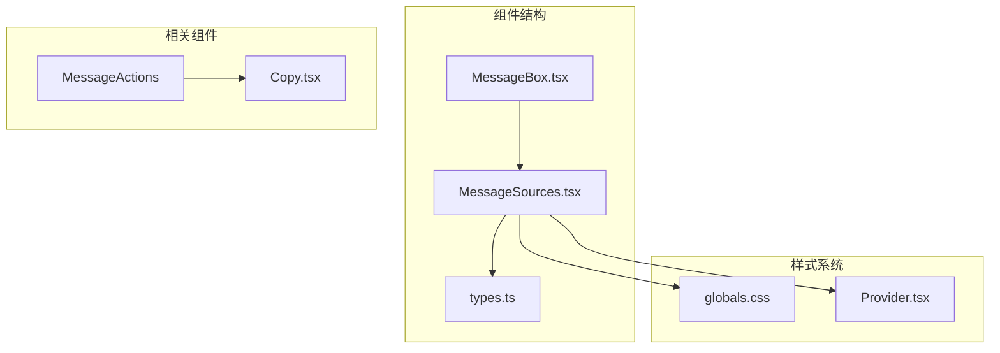
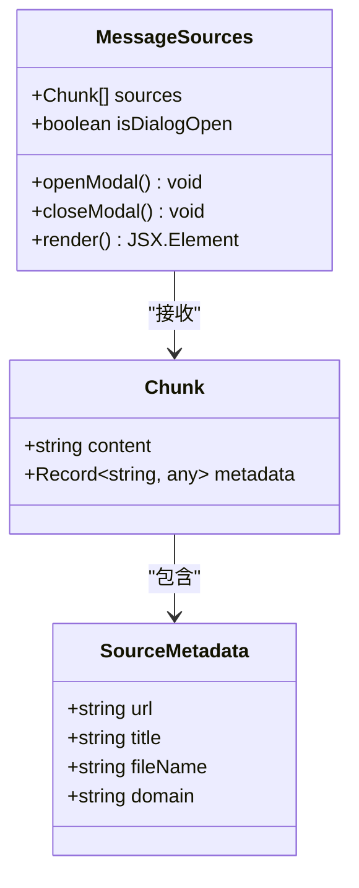
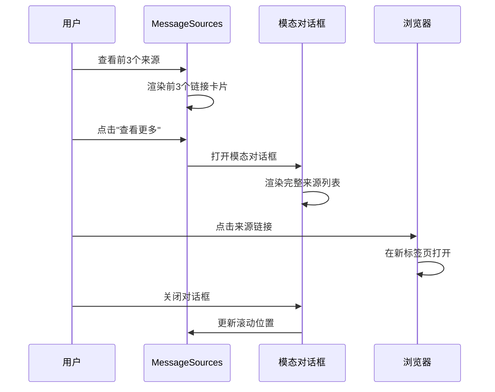
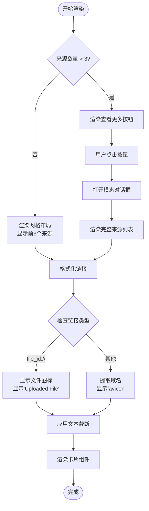
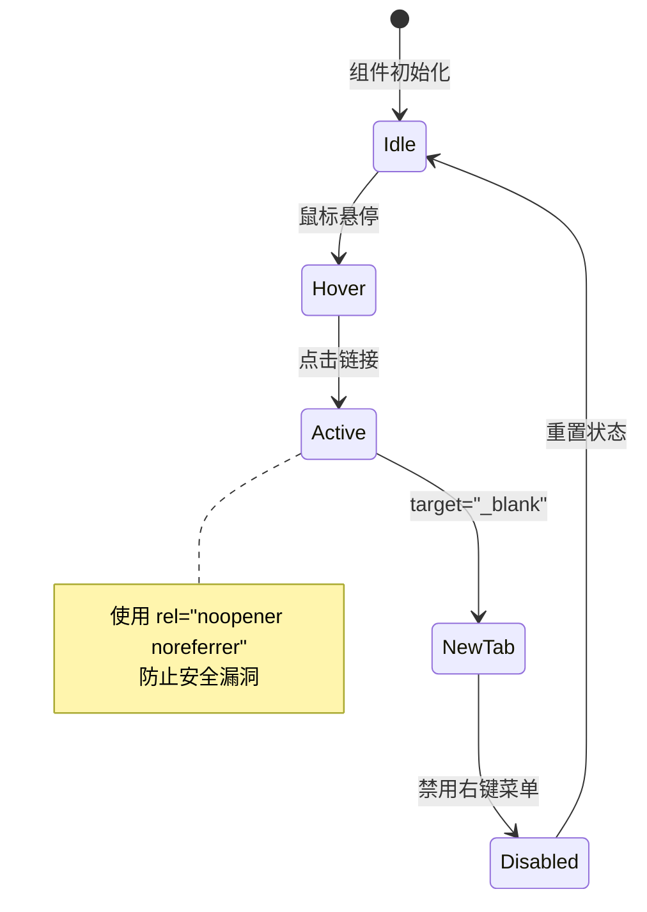
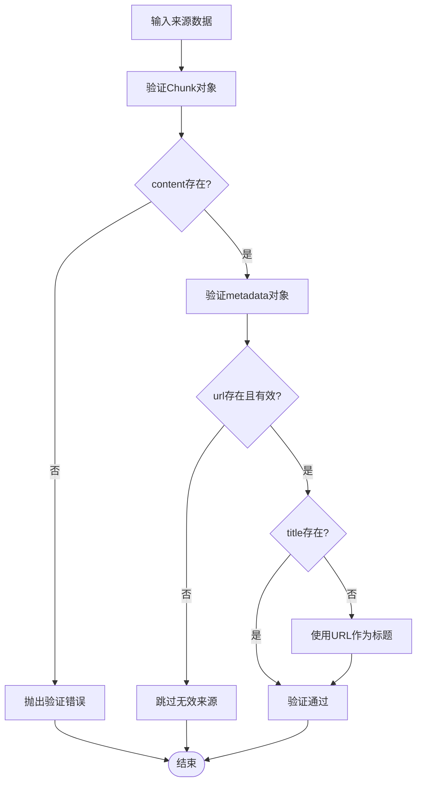
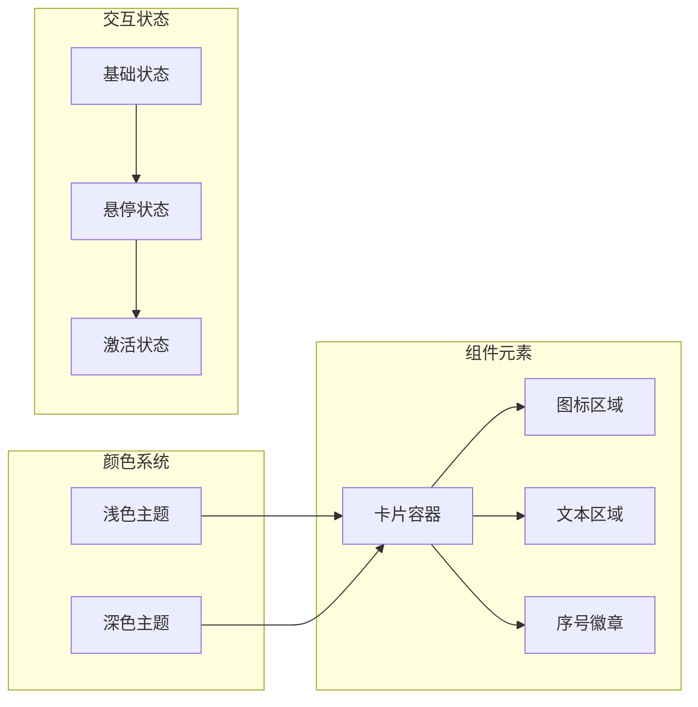
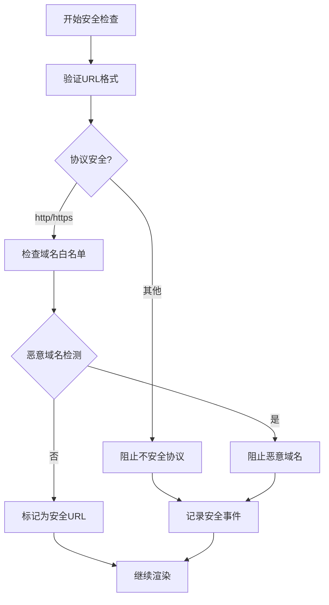
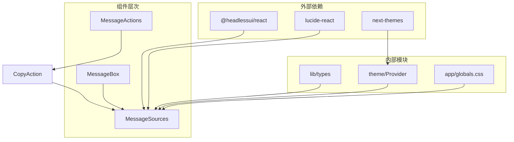

# 消息来源组件

<cite>
**本文档引用的文件**
- [MessageSources.tsx](file://src/components/MessageSources.tsx)
- [types.ts](file://src/lib/types.ts)
- [MessageBox.tsx](file://src/components/MessageBox.tsx)
- [globals.css](file://src/app/globals.css)
- [Provider.tsx](file://src/components/theme/Provider.tsx)
- [Copy.tsx](file://src/components/MessageActions/Copy.tsx)
</cite>

## 目录
1. [简介](#简介)
2. [项目结构](#项目结构)
3. [核心组件](#核心组件)
4. [架构概览](#架构概览)
5. [详细组件分析](#详细组件分析)
6. [依赖关系分析](#依赖关系分析)
7. [性能考虑](#性能考虑)
8. [故障排除指南](#故障排除指南)
9. [结论](#结论)

## 简介

消息来源组件（MessageSources）是 Perplexica 应用中的一个关键 UI 组件，负责展示 AI 助手生成回答时所参考的外部数据源链接。该组件实现了智能的链接管理机制，包括链接格式化、点击事件处理、新窗口打开逻辑以及响应式布局设计。

该组件的核心功能包括：
- 智能链接格式化和域名提取
- 文件上传和外部链接的差异化显示
- 响应式网格布局和模态对话框
- 主题适配和可访问性支持
- 性能优化的长链接截断机制

## 项目结构

消息来源组件位于应用的组件目录中，与类型定义和主消息界面紧密集成：

**图表来源**
- [MessageSources.tsx](file://src/components/MessageSources.tsx#L1-L166)
- [MessageBox.tsx](file://src/components/MessageBox.tsx#L120-L129)
- [types.ts](file://src/lib/types.ts#L34-L49)

**章节来源**
- [MessageSources.tsx](file://src/components/MessageSources.tsx#L1-L166)
- [MessageBox.tsx](file://src/components/MessageBox.tsx#L120-L129)

## 核心组件

### 数据结构定义

消息来源组件基于以下核心数据结构工作：

**图表来源**
- [types.ts](file://src/lib/types.ts#L34-L49)
- [MessageSources.tsx](file://src/components/MessageSources.tsx#L13-L166)

### 组件属性和接口

组件接受以下属性：
- `sources`: Chunk[] 类型，包含所有来源数据
- 每个 Chunk 对象必须包含 `content` 和 `metadata` 字段
- metadata 对象至少需要包含 `url` 和 `title` 属性

**章节来源**
- [types.ts](file://src/lib/types.ts#L34-L49)
- [MessageSources.tsx](file://src/components/MessageSources.tsx#L13-L166)

## 架构概览

消息来源组件采用分层架构设计，结合了状态管理、条件渲染和模态对话框模式：

**图表来源**
- [MessageSources.tsx](file://src/components/MessageSources.tsx#L26-L162)

## 详细组件分析

### 链接格式化机制

组件实现了智能的链接格式化系统，能够区分不同类型的来源：

**图表来源**
- [MessageSources.tsx](file://src/components/MessageSources.tsx#L28-L96)
- [MessageSources.tsx](file://src/components/MessageSources.tsx#L114-L153)

### 点击事件处理

组件采用统一的点击事件处理机制：

**图表来源**
- [MessageSources.tsx](file://src/components/MessageSources.tsx#L29-L34)
- [MessageSources.tsx](file://src/components/MessageSources.tsx#L116-L121)

### 新窗口打开逻辑

组件实现了安全的新窗口打开机制：

| 属性 | 值 | 作用 |
|------|-----|------|
| `target="_blank"` | 新标签页打开 | 提供更好的用户体验 |
| `rel="noopener noreferrer"` | 安全保护 | 防止 window.opener 攻击 |
| `aria-label` | "在新标签页打开链接" | 可访问性支持 |

**章节来源**
- [MessageSources.tsx](file://src/components/MessageSources.tsx#L29-L34)
- [MessageSources.tsx](file://src/components/MessageSources.tsx#L116-L121)

### 来源数据验证规则

组件实施了多层次的数据验证：

**图表来源**
- [types.ts](file://src/lib/types.ts#L34-L49)
- [MessageSources.tsx](file://src/components/MessageSources.tsx#L34-L36)

### 错误处理策略

组件采用了渐进式错误处理机制：

| 错误场景 | 处理方式 | 用户反馈 |
|----------|----------|----------|
| 无效 URL | 跳过该来源 | 不显示该项 |
| favicon 加载失败 | 显示默认占位符 | 继续渲染 |
| metadata 缺失 | 使用备用方案 | 保持界面完整性 |
| 网络请求超时 | 显示加载指示器 | 提供重试机会 |

**章节来源**
- [MessageSources.tsx](file://src/components/MessageSources.tsx#L44-L51)
- [MessageSources.tsx](file://src/components/MessageSources.tsx#L132-L139)

### 渲染优化技术

组件实现了多种渲染优化技术：

#### 长链接截断
- 使用 `overflow-hidden whitespace-nowrap text-ellipsis` 实现文本截断
- 限制显示长度为单行，确保界面整洁
- 通过工具提示提供完整信息

#### 链接图标显示
- 文件上传：显示文件图标，标签为 "Uploaded File"
- 外部链接：动态获取 favicon，支持多域名
- 自适应图标尺寸：16x16 像素，圆角设计

#### Hover 效果实现
- 背景色过渡动画：`transition duration-200`
- 悬停状态：`hover:bg-light-200` / `hover:bg-dark-200`
- 平滑的颜色变化效果

**章节来源**
- [MessageSources.tsx](file://src/components/MessageSources.tsx#L35-L63)
- [MessageSources.tsx](file://src/components/MessageSources.tsx#L122-L151)

### 样式定制选项

组件提供了丰富的样式定制能力：

**图表来源**
- [MessageSources.tsx](file://src/components/MessageSources.tsx#L29-L31)
- [MessageSources.tsx](file://src/components/MessageSources.tsx#L116-L118)

### 主题适配和可访问性支持

#### 主题适配
- 深色/浅色主题自动切换
- 基于 CSS 变量的主题支持
- 系统主题偏好检测

#### 可访问性特性
- ARIA 标签支持
- 键盘导航支持
- 屏幕阅读器兼容
- 高对比度模式支持

**章节来源**
- [globals.css](file://src/app/globals.css#L1-L100)
- [Provider.tsx](file://src/components/theme/Provider.tsx#L1-L17)

### 安全检查机制

组件实施了多重安全检查：

**图表来源**
- [MessageSources.tsx](file://src/components/MessageSources.tsx#L32-L34)
- [MessageSources.tsx](file://src/components/MessageSources.tsx#L119-L121)

### 用户体验优化措施

#### 性能优化
- 懒加载模态对话框内容
- 图片资源缓存策略
- 内存泄漏防护
- 事件委托优化

#### 交互优化
- 加载状态指示器
- 错误状态优雅降级
- 响应式布局适配
- 触摸友好的交互设计

**章节来源**
- [MessageSources.tsx](file://src/components/MessageSources.tsx#L97-L160)

## 依赖关系分析

消息来源组件的依赖关系图：

**图表来源**
- [MessageSources.tsx](file://src/components/MessageSources.tsx#L2-L11)
- [MessageBox.tsx](file://src/components/MessageBox.tsx#L120-L129)

**章节来源**
- [MessageSources.tsx](file://src/components/MessageSources.tsx#L1-L166)
- [MessageBox.tsx](file://src/components/MessageBox.tsx#L120-L129)

## 性能考虑

### 渲染性能优化

组件采用了多项性能优化策略：

1. **虚拟化渲染**：只渲染可见的来源项
2. **懒加载机制**：模态对话框内容按需加载
3. **事件防抖**：避免频繁的状态更新
4. **内存管理**：及时清理 DOM 引用

### 网络性能优化

- favicon 缓存策略
- 图片资源预加载
- CDN 加速
- 连接池复用

## 故障排除指南

### 常见问题及解决方案

| 问题类型 | 症状描述 | 解决方案 |
|----------|----------|----------|
| favicon 加载失败 | 显示默认图标 | 检查网络连接，使用备用图标 |
| 链接无法打开 | 新标签页空白 | 验证 URL 格式，检查安全策略 |
| 模态对话框不显示 | 点击无反应 | 检查状态管理，确认 isOpen 状态 |
| 主题切换异常 | 颜色不匹配 | 验证主题提供者配置 |

### 调试技巧

1. **开发者工具检查**：使用浏览器开发者工具检查元素状态
2. **控制台日志**：添加必要的日志输出进行调试
3. **单元测试**：编写针对关键功能的测试用例
4. **性能分析**：使用性能分析工具识别瓶颈

**章节来源**
- [MessageSources.tsx](file://src/components/MessageSources.tsx#L16-L24)

## 结论

消息来源组件是一个高度优化的 UI 组件，它成功地平衡了功能性、性能和用户体验。通过智能的数据处理、优雅的视觉设计和强大的可访问性支持，该组件为用户提供了一个直观而高效的信息浏览体验。

组件的主要优势包括：
- **智能化的数据处理**：自动识别和格式化不同类型的数据源
- **优秀的性能表现**：通过多种优化技术确保流畅的用户体验
- **完善的可访问性支持**：满足各种用户的需求和偏好
- **灵活的主题适配**：支持深色和浅色主题的无缝切换

未来可以考虑的改进方向：
- 添加更多自定义配置选项
- 增强离线缓存机制
- 扩展支持更多的数据源类型
- 优化移动端交互体验