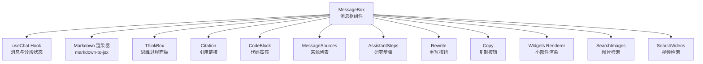
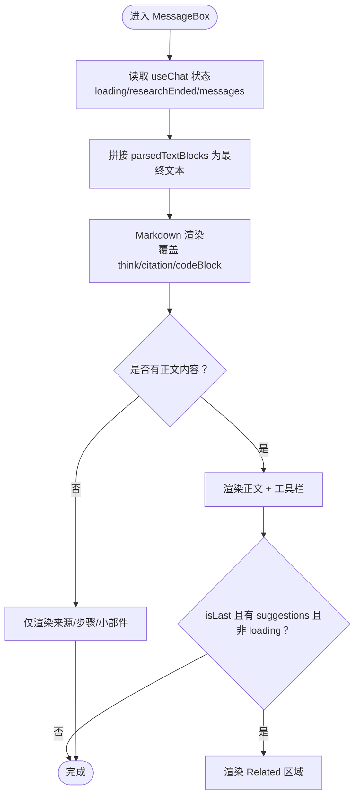
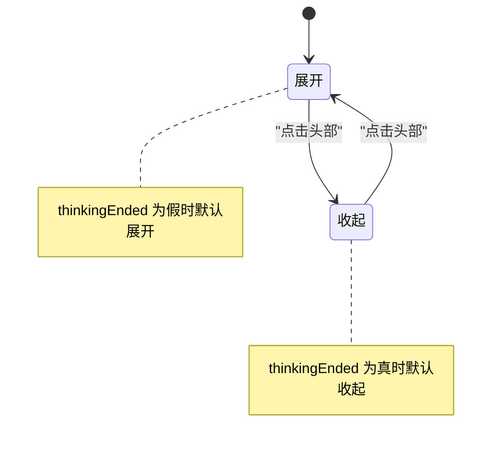
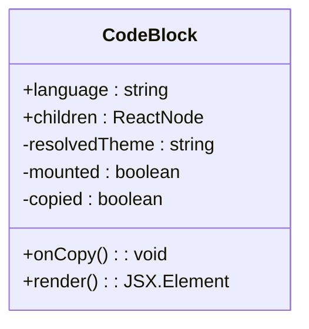
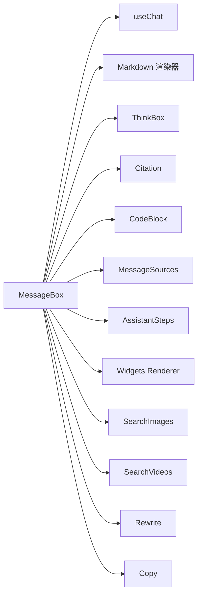

# 消息框组件

<cite>
**本文引用的文件**
- [src/components/MessageBox.tsx](file://src/components/MessageBox.tsx)
- [src/components/ThinkBox.tsx](file://src/components/ThinkBox.tsx)
- [src/components/MessageRenderer/Citation.tsx](file://src/components/MessageRenderer/Citation.tsx)
- [src/components/MessageRenderer/CodeBlock/index.tsx](file://src/components/MessageRenderer/CodeBlock/index.tsx)
- [src/lib/hooks/useChat.tsx](file://src/lib/hooks/useChat.tsx)
- [src/lib/types.ts](file://src/lib/types.ts)
- [src/components/MessageActions/Copy.tsx](file://src/components/MessageActions/Copy.tsx)
- [src/components/MessageActions/Rewrite.tsx](file://src/components/MessageActions/Rewrite.tsx)
- [src/components/MessageSources.tsx](file://src/components/MessageSources.tsx)
- [src/components/Widgets/Renderer.tsx](file://src/components/Widgets/Renderer.tsx)
- [src/components/AssistantSteps.tsx](file://src/components/AssistantSteps.tsx)
- [src/components/SearchImages.tsx](file://src/components/SearchImages.tsx)
- [src/components/SearchVideos.tsx](file://src/components/SearchVideos.tsx)
- [src/app/globals.css](file://src/app/globals.css)
</cite>

## 目录
1. [简介](#简介)
2. [项目结构](#项目结构)
3. [核心组件](#核心组件)
4. [架构总览](#架构总览)
5. [详细组件分析](#详细组件分析)
6. [依赖关系分析](#依赖关系分析)
7. [性能考虑](#性能考虑)
8. [故障排查指南](#故障排查指南)
9. [结论](#结论)
10. [附录](#附录)

## 简介
本文件为 MessageBox 组件的深度技术文档，聚焦以下方面：
- 消息内容的 Markdown 渲染机制与自定义规则
- ThinkBox 思维过程显示与折叠控制
- Citation 引用标记解析与展示
- CodeBlock 代码块高亮与复制交互
- 组件 props 接口定义（section、sectionIndex、dividerRef、isLast）及其作用
- 消息状态管理、加载状态处理与响应块类型过滤逻辑
- 样式定制、主题适配与响应式布局
- 性能优化策略与用户体验改进措施

## 项目结构
MessageBox 位于组件层，围绕 useChat 钩子提供的消息与分段数据进行渲染，并组合多个子组件完成“答案正文 + 来源 + 步骤 + 小部件 + 媒体检索 + 操作工具栏”的完整信息呈现。



图表来源
- [src/components/MessageBox.tsx](file://src/components/MessageBox.tsx#L42-L288)
- [src/lib/hooks/useChat.tsx](file://src/lib/hooks/useChat.tsx#L31-L62)

章节来源
- [src/components/MessageBox.tsx](file://src/components/MessageBox.tsx#L1-L291)
- [src/lib/hooks/useChat.tsx](file://src/lib/hooks/useChat.tsx#L1-L848)

## 核心组件
- MessageBox：负责单条消息的渲染与交互，聚合 ThinkBox、Citation、CodeBlock、MessageSources、AssistantSteps、Widgets Renderer、SearchImages、SearchVideos 及操作按钮。
- ThinkBox：可展开/收起的“思维过程”容器，根据 thinkingEnded 自动调整展开状态。
- Citation：Markdown 中的引用标签渲染为带样式的超链接。
- CodeBlock：基于 react-syntax-highlighter 的代码块高亮，支持复制与明暗主题切换。
- useChat：提供 messages、sections、loading、researchEnded、chatHistory 等上下文状态与方法。
- 其他子组件：MessageSources、AssistantSteps、Widgets Renderer、SearchImages、SearchVideos、Copy、Rewrite。

章节来源
- [src/components/MessageBox.tsx](file://src/components/MessageBox.tsx#L42-L288)
- [src/components/ThinkBox.tsx](file://src/components/ThinkBox.tsx#L1-L52)
- [src/components/MessageRenderer/Citation.tsx](file://src/components/MessageRenderer/Citation.tsx#L1-L20)
- [src/components/MessageRenderer/CodeBlock/index.tsx](file://src/components/MessageRenderer/CodeBlock/index.tsx#L1-L65)
- [src/lib/hooks/useChat.tsx](file://src/lib/hooks/useChat.tsx#L31-L62)

## 架构总览
MessageBox 通过 useChat 获取当前 section（含 message、widgets、parsedTextBlocks、speechMessage、thinkingEnded、suggestions），并基于 Markdown 渲染器与自定义覆盖规则，将文本中的 think/citation/codeBlock 标签转换为对应组件；同时根据响应块类型过滤与渲染来源、研究步骤、小部件等。

```mermaid
sequenceDiagram
participant U as "用户"
participant MB as "MessageBox"
participant UC as "useChat"
participant MD as "Markdown 渲染器"
participant TH as "ThinkBox"
participant CT as "Citation"
participant CB as "CodeBlock"
U->>MB : 查看消息
MB->>UC : 读取 loading/researchEnded/messages
MB->>MD : 传入 Markdown 配置与已拼接的文本
MD->>TH : 匹配 <think> 标签并渲染
MD->>CT : 匹配 [数字] 引用并替换为 <citation>
MD->>CB : 匹配
```code``` 并渲染
  MB-->>U: 展示答案正文 + 源 + 步骤 + 小部件 + 媒体检索 + 操作
```

图表来源
- [src/components/MessageBox.tsx](file://src/components/MessageBox.tsx#L77-L104)
- [src/components/ThinkBox.tsx](file://src/components/ThinkBox.tsx#L11-L20)
- [src/components/MessageRenderer/Citation.tsx](file://src/components/MessageRenderer/Citation.tsx#L1-L20)
- [src/components/MessageRenderer/CodeBlock/index.tsx](file://src/components/MessageRenderer/CodeBlock/index.tsx#L10-L29)

## 详细组件分析

### MessageBox 组件
- 职责
  - 聚合并渲染单条消息的所有内容：查询标题、来源、研究步骤、加载提示、小部件、答案正文、相关建议、右侧媒体检索。
  - 基于 Markdown 渲染器与自定义覆盖规则处理 think、citation、codeBlock。
  - 提供复制、重写、语音播放/停止等交互。
- 关键 props
  - section: 当前分段对象，包含 message、widgets、parsedTextBlocks、speechMessage、thinkingEnded、suggestions。
  - sectionIndex: 分段索引（用于定位与调试）。
  - dividerRef?: 可选的 DOM 引用，用于滚动或定位。
  - isLast: 是否为最后一条消息，影响加载态、相关建议与媒体自动触发。
- Markdown 渲染配置
  - 内联代码保留反引号包裹。
  - 代码块使用 CodeBlock 组件并传递语言属性。
  - think 标签映射到 ThinkBox，并注入 thinkingEnded。
  - citation 标签映射到 Citation 组件。
- 响应块类型过滤
  - 过滤出 type 为 source 的块，提取数据作为来源列表。
  - 过滤出 type 为 research 且包含 subSteps 的块，渲染 AssistantSteps。
- 加载与状态
  - isLast 且 loading 且 research 未结束且无 research 步骤时，显示“Brainstorming...”加载提示。
  - loading 且 isLast 时不显示“重写/复制”工具栏。
- 相关建议
  - isLast 且存在 suggestions 且有内容且非 loading 时，渲染 Related 区域。
- 右侧媒体检索
  - 在有正文内容时，渲染 SearchImages 与 SearchVideos，并在消息结束时自动触发点击以拉取结果。



图表来源
- [src/components/MessageBox.tsx](file://src/components/MessageBox.tsx#L62-L288)

章节来源
- [src/components/MessageBox.tsx](file://src/components/MessageBox.tsx#L42-L288)

### ThinkBox 组件
- 功能
  - 可折叠的“思维过程”面板，默认展开；当 thinkingEnded 为真时自动收起。
  - 展开/收起按钮带有动画与图标。
- 主题与样式
  - 使用明暗主题下的边框与背景色，保持与整体设计一致。
- 交互
  - 点击头部区域切换展开/收起状态。



图表来源
- [src/components/ThinkBox.tsx](file://src/components/ThinkBox.tsx#L11-L20)

章节来源
- [src/components/ThinkBox.tsx](file://src/components/ThinkBox.tsx#L1-L52)

### Citation 引用组件
- 功能
  - 将 Markdown 中的 [数字] 替换为带链接的引用标记，点击打开外部链接。
- 样式
  - 使用明暗主题下的浅色背景与圆角，字号较小，便于阅读但不喧宾夺主。

章节来源
- [src/components/MessageRenderer/Citation.tsx](file://src/components/MessageRenderer/Citation.tsx#L1-L20)

### CodeBlock 代码块组件
- 功能
  - 使用 react-syntax-highlighter 对代码进行高亮。
  - 支持复制按钮，复制成功后短暂提示。
  - 基于 next-themes 切换明/暗主题。
- 交互
  - 复制按钮在首次挂载后才启用，避免服务端与客户端主题不一致导致的闪烁。



图表来源
- [src/components/MessageRenderer/CodeBlock/index.tsx](file://src/components/MessageRenderer/CodeBlock/index.tsx#L10-L62)

章节来源
- [src/components/MessageRenderer/CodeBlock/index.tsx](file://src/components/MessageRenderer/CodeBlock/index.tsx#L1-L65)

### 消息状态管理与加载处理
- useChat 提供的消息与分段结构
  - Section：包含 message、widgets、parsedTextBlocks、speechMessage、thinkingEnded、suggestions。
  - Block 类型：text/source/suggestion/widget/research 等。
- 状态流转
  - sendMessage 触发后设置 loading=true；收到 messageEnd 后恢复为 completed 并设置 loading=false。
  - researchComplete 事件设置 researchEnded=true，影响 AssistantSteps 与 ThinkBox 的展开状态。
- 过滤与渲染
  - 过滤 source 块生成来源列表。
  - 过滤 research 块渲染研究步骤。
  - 过滤 widget 块交由 Widgets Renderer 渲染。

章节来源
- [src/lib/hooks/useChat.tsx](file://src/lib/hooks/useChat.tsx#L22-L62)
- [src/lib/types.ts](file://src/lib/types.ts#L39-L124)
- [src/lib/hooks/useChat.tsx](file://src/lib/hooks/useChat.tsx#L567-L711)

### Props 接口定义与作用
- section: 当前分段对象，承载消息主体、小部件、解析后的文本、语音文本、思维结束标志与建议。
- sectionIndex: 分段索引，用于定位与调试。
- dividerRef: 可选的 DOM 引用，用于滚动或定位。
- isLast: 是否为最后一条消息，决定加载态、相关建议与媒体自动触发。

章节来源
- [src/components/MessageBox.tsx](file://src/components/MessageBox.tsx#L42-L52)

### Markdown 渲染机制与自定义规则
- 内联代码：保留反引号包裹形式。
- 代码块：传递 language 与文本给 CodeBlock。
- think 标签：映射到 ThinkBox，并注入 thinkingEnded。
- citation 标签：映射到 Citation。

章节来源
- [src/components/MessageBox.tsx](file://src/components/MessageBox.tsx#L77-L104)

### Citation 引用标记处理
- 文本预处理：将 [1][2] 等引用替换为 <citation href="...">1,2</citation>，并从 sources 中按索引映射 URL。
- 渲染：Citation 组件以超链接形式展示，目标为外部资源。

章节来源
- [src/lib/hooks/useChat.tsx](file://src/lib/hooks/useChat.tsx#L332-L392)
- [src/components/MessageRenderer/Citation.tsx](file://src/components/MessageRenderer/Citation.tsx#L1-L20)

### CodeBlock 代码块渲染
- 语言识别：从代码块语言字符串传递给 CodeBlock。
- 主题切换：根据 resolvedTheme 切换深/浅主题。
- 复制交互：点击复制按钮写入剪贴板并短暂提示。

章节来源
- [src/components/MessageBox.tsx](file://src/components/MessageBox.tsx#L83-L89)
- [src/components/MessageRenderer/CodeBlock/index.tsx](file://src/components/MessageRenderer/CodeBlock/index.tsx#L10-L62)

### 消息渲染的性能优化策略
- 仅在需要时渲染右侧媒体检索：仅当 hasContent 为真时渲染 SearchImages 与 SearchVideos。
- 条件渲染工具栏：loading 且 isLast 时不渲染“重写/复制”，减少不必要的 DOM。
- 代码高亮懒加载：首次挂载后才切换主题，避免首屏闪烁。
- 滚动与粘性布局：右侧媒体检索使用 sticky 定位，提升长内容阅读体验。
- 响应式网格：来源卡片与图片/视频网格采用 Tailwind 的响应式类，适配多端。

章节来源
- [src/components/MessageBox.tsx](file://src/components/MessageBox.tsx#L160-L284)
- [src/components/MessageRenderer/CodeBlock/index.tsx](file://src/components/MessageRenderer/CodeBlock/index.tsx#L17-L29)
- [src/app/globals.css](file://src/app/globals.css#L1-L100)

### 样式定制、主题适配与响应式布局
- 主题适配
  - ThinkBox、CodeBlock、MessageSources、SearchImages/Video 等均使用明/暗主题下的边框、背景与文字颜色。
  - next-themes 提供 resolvedTheme，CodeBlock 在 mounted 后切换主题。
- 响应式布局
  - 使用 flex 与 grid 实现两列布局（左侧正文 + 右侧媒体），在 lg 断点下调整宽度与粘性定位。
  - 来源卡片、图片/视频网格采用响应式列数，移动端紧凑展示。
- 滚动条与可访问性
  - 全局样式统一滚动条外观，暗色模式下颜色适配。
  - 图片/视频懒加载与错误回退，避免页面异常。

章节来源
- [src/components/ThinkBox.tsx](file://src/components/ThinkBox.tsx#L22-L48)
- [src/components/MessageRenderer/CodeBlock/index.tsx](file://src/components/MessageRenderer/CodeBlock/index.tsx#L17-L29)
- [src/components/MessageSources.tsx](file://src/components/MessageSources.tsx#L27-L162)
- [src/components/SearchImages.tsx](file://src/components/SearchImages.tsx#L28-L149)
- [src/components/SearchVideos.tsx](file://src/components/SearchVideos.tsx#L43-L218)
- [src/app/globals.css](file://src/app/globals.css#L1-L100)

### 用户体验改进措施
- 加载态提示：在最后一条消息且未结束时显示“Brainstorming...”。
- 自动媒体检索：消息结束后自动触发图片/视频检索，减少用户操作。
- 可展开的研究步骤：逐步展示思考、搜索、阅读等阶段，增强透明度。
- 语音播放：支持文本转语音播放/暂停，便于听读。
- 复制与重写：一键复制含引用的完整内容，或重写上一条消息。

章节来源
- [src/components/MessageBox.tsx](file://src/components/MessageBox.tsx#L146-L158)
- [src/components/MessageBox.tsx](file://src/components/MessageBox.tsx#L200-L217)
- [src/components/AssistantSteps.tsx](file://src/components/AssistantSteps.tsx#L63-L74)
- [src/components/MessageActions/Copy.tsx](file://src/components/MessageActions/Copy.tsx#L1-L49)
- [src/components/MessageActions/Rewrite.tsx](file://src/components/MessageActions/Rewrite.tsx#L1-L21)

## 依赖关系分析
- MessageBox 依赖 useChat 提供的状态与方法，以及多个子组件（ThinkBox、Citation、CodeBlock、MessageSources、AssistantSteps、Widgets Renderer、SearchImages、SearchVideos、Copy、Rewrite）。
- 子组件之间松耦合，通过 props 传递数据与回调，便于独立测试与维护。
- Markdown 渲染器通过覆盖规则与自定义组件解耦了标签到组件的映射。



图表来源
- [src/components/MessageBox.tsx](file://src/components/MessageBox.tsx#L22-L28)
- [src/lib/hooks/useChat.tsx](file://src/lib/hooks/useChat.tsx#L31-L62)

章节来源
- [src/components/MessageBox.tsx](file://src/components/MessageBox.tsx#L1-L291)
- [src/lib/hooks/useChat.tsx](file://src/lib/hooks/useChat.tsx#L1-L848)

## 性能考虑
- 渲染优化
  - 条件渲染：仅在有正文时渲染右侧媒体检索与工具栏。
  - 仅在最后一条消息且非 loading 时渲染“相关建议”，避免重复渲染。
- 主题切换
  - CodeBlock 在 mounted 后再切换主题，避免首屏闪烁。
- 网络与异步
  - 媒体检索采用懒加载与缓存策略，避免重复请求。
- 可访问性
  - 使用语义化标签与键盘可达性，确保屏幕阅读器友好。

## 故障排查指南
- think 标签未闭合
  - 预处理会在检测到开启标签但未闭合时自动补全闭合标签，确保 ThinkBox 正常渲染。
- 引用索引越界
  - 预处理会校验索引合法性，非法或超出范围的索引将被忽略，避免渲染异常。
- 代码高亮不生效
  - 确认 language 字符串正确传递至 CodeBlock；检查主题是否已挂载。
- 媒体检索失败
  - 检查网络请求与返回数据格式；确认 messageId 与按钮 ID 一致。
- 加载态异常
  - 确认 messageEnd 事件是否正确触发；检查 researchComplete 事件是否设置 researchEnded。

章节来源
- [src/lib/hooks/useChat.tsx](file://src/lib/hooks/useChat.tsx#L338-L350)
- [src/lib/hooks/useChat.tsx](file://src/lib/hooks/useChat.tsx#L360-L381)
- [src/components/MessageRenderer/CodeBlock/index.tsx](file://src/components/MessageRenderer/CodeBlock/index.tsx#L17-L29)
- [src/components/SearchImages.tsx](file://src/components/SearchImages.tsx#L41-L57)
- [src/components/SearchVideos.tsx](file://src/components/SearchVideos.tsx#L56-L73)

## 结论
MessageBox 通过清晰的 props 接口与完善的 Markdown 渲染覆盖，将复杂的消息内容（正文、来源、思维过程、研究步骤、小部件、媒体检索）整合为统一的信息呈现界面。配合 useChat 的状态管理与子组件的模块化设计，实现了良好的可维护性与扩展性。在性能与体验方面，通过条件渲染、主题懒加载与自动媒体检索等策略，提升了用户的阅读与交互效率。

## 附录
- 相关类型定义参考：Block、TextBlock、SourceBlock、SuggestionBlock、WidgetBlock、ResearchBlock 等。
- 全局样式参考：Tailwind 基础、组件与工具类层，以及滚动条主题适配。

章节来源
- [src/lib/types.ts](file://src/lib/types.ts#L39-L124)
- [src/app/globals.css](file://src/app/globals.css#L1-L100)